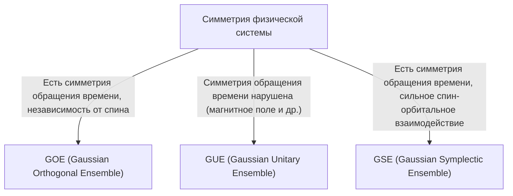

# Введение: Удивительная универсальность теории случайных матриц

Мир кажется сложным и непредсказуемым, но через призму математики иногда можно обнаружить удивительные общие черты в совершенно разных областях. «Теория случайных матриц (Random Matrix Theory, RMT)» — это именно та математическая основа, которая обладает подобной универсальностью.

Случайная матрица — это матрица, элементы которой задаются случайными величинами. На первый взгляд, это просто случайный набор чисел, но если устремить размер матрицы к бесконечности, в распределении её [собственных значений](/p/eigenvalues-and-eigenvectors/) проявляются удивительно красивые и универсальные законы. Эти законы скрываются за совершенно разными системами: от микроскопического мира атомных ядер до загадок распределения простых чисел, колебаний цен на финансовых рынках и динамики обучения передовых моделей глубокого обучения.

В этой статье мы начнем с исторического контекста теории случайных матриц, объясним ее математическую основу — классификацию ансамблей GOE/GUE/GSE, математическое доказательство полукругового закона Вигнера, а также неожиданную связь с дзета-функцией Римана. Во второй половине статьи мы глубоко погрузимся в современные приложения, такие как оптимизация портфелей в финансовой инженерии и проблемы инициализации весов в ИИ и глубоком обучении, сопровождая это практической визуализацией с помощью кода на Python.

---

# 1. Рождение в физике: Вигнер и загадка тяжелых атомных ядер

Корни теории случайных матриц уходят в ядерную физику 1950-х годов. В то время физики боролись за понимание энергетических уровней (значений энергии, которые могут принимать квантово-механические состояния) тяжелых атомных ядер, таких как уран.

## Энергетические уровни ядра урана

Для легких атомных ядер энергетические уровни можно точно предсказать, рассчитав взаимодействие протонов и нейтронов в соответствии с уравнением Шредингера. Однако в тяжелых ядрах, таких как уран (с массовым числом 238 и т. д.), где большое количество нуклонов сложно взаимодействуют друг с другом, степеней свободы слишком много, и точные расчеты практически невозможны.

Глядя на экспериментально полученные данные рассеяния нейтронов, энергетические уровни резонанса, казалось, располагались хаотично. Однако при изучении статистического распределения «интервалов (spacing)» между энергетическими уровнями выяснилось, что в них есть четкая закономерность. Соседние уровни энергии обладали свойством «отталкивания уровней (level repulsion)» — они никогда не приближались друг к другу слишком близко.

## Интуиция Вигнера и открытие полукругового закона

В 1955 году Юджин Вигнер (Eugene Wigner) предложил смелую идею: моделировать гамильтониан (матрицу, представляющую энергию) этой сложной квантовой системы не как конкретную матрицу с детальной физической структурой, а как «гигантскую симметричную матрицу, элементы которой принимают случайные значения».

Удивительно, но распределение интервалов [собственных значений](/p/eigenvalues-and-eigenvectors/) этой крайне упрощенной случайной матрицы идеально совпало с распределением интервалов фактических уровней энергии ядра урана. Более того, Вигнер обнаружил, что в пределе, когда размер матрицы $N$ стремится к бесконечности, общая плотность распределения [собственных значений](/p/eigenvalues-and-eigenvectors/) принимает форму полукруга. Это знаменитый «полукруговой закон Вигнера (Wigner's semicircle law)».

---

# 2. Классификация ансамблей: GOE, GUE, GSE

Опираясь на исследования Вигнера, Фримен Дайсон (Freeman Dyson) систематизировал теорию случайных матриц и классифицировал случайные матрицы на 3 универсальных класса (ансамбля) на основе симметрии физических систем. Их называют «тройным путем Дайсона (Dyson's threefold way)».



## Гауссовский ортогональный ансамбль (GOE)

GOE — это набор действительных симметричных матриц, элементы которых состоят из действительных чисел. Каждый недиагональный элемент независимо выбирается из нормального распределения с нулевым средним и дисперсией 1, а диагональные элементы выбираются из нормального распределения с нулевым средним и дисперсией 2. GOE используется для моделирования гамильтонианов квантовых систем (например, систем бесспиновых частиц), в которых нет внешних магнитных полей и сохраняется симметрия относительно обращения времени.

## Гауссовский унитарный ансамбль (GUE)

GUE — это множество эрмитовых матриц, элементы которых являются комплексными числами. Действительная и мнимая части недиагональных элементов подчиняются независимым нормальным распределениям. Применяется к физическим системам, в которых нарушена симметрия относительно обращения времени, например, при наличии внешнего магнитного поля. Именно GUE имеет глубокую связь с распределением нулей дзета-функции Римана, о которой пойдет речь далее.

## Гауссовский симплектический ансамбль (GSE)

GSE — это множество самодуальных эрмитовых матриц, элементы которых состоят из кватернионов. Он описывает системы, в которых симметрия относительно обращения времени сохраняется, но частицы имеют полуцелый спин, а спин-орбитальное взаимодействие велико.

---

# 3. Математические бездны: Доказательство полукругового закона Вигнера

Мы кратко рассмотрим процесс доказательства полукругового закона Вигнера, самого фундаментального результата теории случайных матриц, с использованием метода моментов (Method of Moments).

Рассмотрим действительную симметричную матрицу $X$ размера $N \times N$, элементы $X_{ij}$ которой являются взаимно независимыми случайными величинами со средним значением 0 и дисперсией 1. Найдем предел ($N \to \infty$) распределения [собственных значений](/p/eigenvalues-and-eigenvectors/) масштабированной матрицы $W = \frac{1}{\sqrt{N}}X$.

## Подход с использованием метода моментов

Для анализа эмпирической функции распределения [собственных значений](/p/eigenvalues-and-eigenvectors/) мы вычисляем $k$-й момент распределения $m_k$. Поскольку след матрицы (сумма диагональных элементов) равен сумме [собственных значений](/p/eigenvalues-and-eigenvectors/),
$$ m_k = \lim_{N \to \infty} \frac{1}{N} \mathbb{E}[\text{Tr}(W^k)] $$
оценивается следующим образом.

Раскрывая след:
$$ \text{Tr}(W^k) = \frac{1}{N^{k/2}} \sum_{i_1, i_2, \dots, i_k} X_{i_1 i_2} X_{i_2 i_3} \cdots X_{i_k i_1} $$
При взятии математического ожидания, поскольку элементы $X_{ij}$ имеют нулевое среднее значение и независимы, те члены разложения, в которых один и тот же элемент появляется только один раз, будут иметь математическое ожидание, равное 0. Чтобы вклад был ненулевым, каждое ребро на пути $i_1 \to i_2 \to \dots \to i_k \to i_1$ должно быть пройдено как минимум дважды.

Главный вклад в пределе $N \to \infty$ вносят пути ровно из $k$ шагов, которые образуют структуру «дерева (tree)», при которой новые вершины исследуются, а пройденные ребра проходятся обратно ровно один раз. Это возможно только если $k$ — четное число ($k = 2m$), а нечетные моменты в пределе равны нулю.

## Связь чисел Каталана с полукруговым законом

Общее количество таких путей (путей Дика) длины $2m$ задается знаменитыми в комбинаторике «[числами Каталана](/p/catalan-numbers/) (Catalan numbers)» $C_m$.
$$ C_m = \frac{1}{m+1} \binom{2m}{m} $$

Следовательно, моменты предельного распределения равны:
$$ m_{2m} = C_m, \quad m_{2m+1} = 0 $$
Известно, что распределение вероятностей с такими моментами является полукруговым распределением (полукруговым законом Вигнера), имеющим носитель на отрезке $[-2, 2]$. Его функция плотности вероятности выглядит следующим образом:
$$ \rho(x) = \begin{cases} \frac{1}{2\pi} \sqrt{4 - x^2} & (-2 \le x \le 2) \\ 0 & (\text{в остальных случаях}) \end{cases} $$

---

# 4. Неожиданная встреча с дзета-функцией Римана

Теория случайных матриц, созданная для решения физических задач, привела к величайшему открытию века в чистой математике, в частности, в теории чисел в 1970-х годах.

## Гипотеза Монтгомери-Одлыжко

В 1972 году теоретик чисел Хью Монтгомери (Hugh Montgomery) исследовал распределение интервалов между нетривиальными нулями дзета-функции Римана. Согласно гипотезе Римана, все эти нули лежат на «критической прямой (прямой, действительная часть которой равна 1/2)» в комплексной плоскости. Монтгомери вычислил парную корреляционную функцию нулей и вывел, что она равна $1 - \left(\frac{\sin(\pi x)}{\pi x}\right)^2$.

Однажды за чаепитием в Институте перспективных исследований в Принстоне Монтгомери рассказал об этом результате физику Фримену Дайсону. Дайсон был поражен. Эта формула была в точности идентична распределению интервалов [собственных значений](/p/eigenvalues-and-eigenvectors/) GUE (гауссовского унитарного ансамбля), выведенному самим Дайсоном.

## Пересечение простых чисел и квантового хаоса

Впоследствии математик Эндрю Одлыжко (Andrew Odlyzko) с помощью суперкомпьютера вычислил миллионы нулей дзета-функции и продемонстрировал, что распределение их интервалов с удивительной точностью совпадает с предсказаниями GUE.

Это открытие, названное «гипотезой Монтгомери-Одлыжко», позволяет предположить, что между распределением простых чисел (нули дзета-функции тесно связаны с распределением простых чисел) и квантовыми хаотическими системами (GUE) существует глубокая универсальная связь. Это был момент, когда математика, описывающая микроскопические законы Вселенной, и математика, управляющая простыми числами (строительными блоками чисел), пересеклись через точку соприкосновения — случайную матрицу.

---

# 5. Применение в финансовой инженерии: Эволюция оптимизации портфеля

Теория случайных матриц не ограничивается физикой и чистой математикой, она также применяется как мощный инструмент для анализа финансовых рынков. В частности, она играет важную роль в оптимизации управления активами.

## Ограничения модели Марковица

В модели Марковица (Harry Markowitz), которая является основой современной портфельной теории (модель среднее-дисперсия), оптимальные коэффициенты инвестирования определяются с использованием матрицы, обратной матрице ковариации активов. Однако на практике возникла серьезная проблема.

При оценке выборочной ковариационной матрицы по данным доходности $N$ активов за прошлые $T$ периодов, если $N$ велико, а $T$ недостаточно (то есть $N/T$ не близко к 0), выборочная ковариационная матрица будет содержать большое количество статистического шума. Если рассчитать матрицу, обратную матрице с таким шумом, погрешности многократно возрастут, и будет создан нереалистичный экстремальный портфель (указывающий на экстремальные шорты или лонги по определенным активам).

## Очистка от шума с помощью случайных матриц

Именно здесь на сцену выходит теория случайных матриц. В 1999 году Бушо (Bouchaud) и его коллеги, а также Лалу (Laloux) независимо друг от друга применили теорию случайных матриц к ковариационным матрицам финансовых рынков. Они сравнили распределение [собственных значений](/p/eigenvalues-and-eigenvectors/) ковариационной матрицы, полученной из абсолютно случайных данных временных рядов (распределение Марченко-Пастура), с распределением [собственных значений](/p/eigenvalues-and-eigenvectors/) ковариационной матрицы реальных рыночных данных.

В результате выяснилось, что подавляющее большинство (более 90%) [собственных значений](/p/eigenvalues-and-eigenvectors/) рыночных данных попадает в теоретические границы, предсказанные теорией случайных матриц. То есть это просто «шум». С другой стороны, было показано, что только небольшое количество крупных [собственных значений](/p/eigenvalues-and-eigenvectors/), далеко выходящих за границы, содержит значимую информацию, отражающую истинную корреляционную структуру рынка (рыночные и секторные факторы).

На основе этих выводов был разработан метод «очистки» ковариационной матрицы путем фильтрации [собственных значений](/p/eigenvalues-and-eigenvectors/), соответствующих шуму (обнуления или замены средним значением). Это позволило значительно улучшить показатели и стабильность портфелей, и сейчас эта методика является стандартом во многих квантовых фондах.

---

# 6. Применение в искусственном интеллекте: Веса и динамика обучения в глубоком обучении

В последние годы теория случайных матриц также привлекает внимание в области теоретического анализа ИИ и машинного обучения, особенно глубокого обучения (Deep Learning).

## Проблема инициализации нейронных сетей

При обучении гигантской нейронной сети то, как будут заданы начальные значения матрицы весов, является критическим вопросом, определяющим успех или провал обучения. Неправильная инициализация может привести к исчезновению градиента (Gradient Vanishing) или взрыву градиента (Gradient Exploding), в результате чего обучение не будет продвигаться.

Когда матрица весов инициализируется случайными значениями, это и есть случайная матрица. Используя теорию случайных матриц, можно строго проанализировать изменение дисперсии сигнала при прохождении через слои и поведение градиентов при обратном распространении ошибки. Например, анализ влияния нелинейных функций активации на спектр (распределение [собственных значений](/p/eigenvalues-and-eigenvectors/)) случайных матриц позволяет теоретически обосновать современные стандартные методы инициализации, такие как инициализация Ксавье и инициализация Хе.

## Распределение собственных значений гессиана

Для понимания динамики процесса обучения необходим анализ матрицы Гессе (гессиана), отражающей кривизну функции потерь. В случае [LLM](/p/large-language-models-llm-transformer-prompt-engineering/) (больших языковых моделей) с десятками миллионов или миллиардами параметров гессиан представляет собой огромную матрицу, и непосредственно изучить ее свойства сложно. Однако теория случайных матриц позволяет аппроксимировать и предсказывать распределение ее [собственных значений](/p/eigenvalues-and-eigenvectors/).

Исследования показывают, что распределение [собственных значений](/p/eigenvalues-and-eigenvectors/) гессиана в глубоких нейронных сетях состоит из основной массы (большого количества [собственных значений](/p/eigenvalues-and-eigenvectors/) около нуля) и небольшого числа крупных выбросов (аутлайеров). Основную часть можно смоделировать как зашумленную случайную матрицу (например, направления с малым количеством информации), в то время как выбросы указывают на важные направления обучения, непосредственно связанные с задачей. Понимание этой спектральной структуры дает ценную информацию для улучшения сходимости алгоритмов оптимизации (таких как SGD, Adam) и оптимизации расписания скорости обучения.

---

# 7. Практика: Визуализация распределения собственных значений с помощью Python

Наконец, давайте сгенерируем GOE (гауссовский ортогональный ансамбль) с помощью Python и численно убедимся в выполнимости полукругового закона Вигнера.

```python
import numpy as np
import matplotlib.pyplot as plt
from scipy.stats import semicircular

# Настройка параметров
N = 1000  # Размер матрицы
num_matrices = 50  # Количество матриц в ансамбле

eigenvalues = []

# Генерация GOE-матриц и вычисление собственных значений
for _ in range(num_matrices):
    # Генерация матрицы N x N, элементы которой подчиняются N(0, 1)
    X = np.random.randn(N, N)
    # Создание GOE-матрицы путем симметризации (обратите внимание на масштабирование дисперсии)
    A = (X + X.T) / np.sqrt(2)
    # Масштабирование дисперсии к 1/N
    W = A / np.sqrt(N)
    
    # Вычисление собственных значений (так как матрица действительная симметричная, используем eigh)
    eigvals = np.linalg.eigh(W)[0]
    eigenvalues.extend(eigvals)

# Настройка графика
plt.figure(figsize=(10, 6))

# Построение гистограммы собственных значений
plt.hist(eigenvalues, bins=100, density=True, alpha=0.6, color='skyblue', edgecolor='black', label='Empirical Eigenvalues (GOE)')

# Построение теоретического полукругового закона Вигнера
x = np.linspace(-2.2, 2.2, 1000)
# Функция плотности вероятности для полукругового закона с радиусом R=2
y = np.where(np.abs(x) <= 2, np.sqrt(4 - x**2) / (2 * np.pi), 0)
plt.plot(x, y, 'r-', lw=3, label="Wigner's Semicircle Law")

plt.title(f"Eigenvalue Distribution of GOE Matrices ($N={N}$)", fontsize=16)
plt.xlabel("Eigenvalue", fontsize=14)
plt.ylabel("Density", fontsize=14)
plt.legend(fontsize=12)
plt.grid(True, alpha=0.3)
plt.tight_layout()
plt.show()
```

Запустив этот код, вы увидите, что [собственные значения](/p/eigenvalues-and-eigenvectors/) случайно сгенерированных матриц распределены в виде красивого полукруга. Тот факт, что в целом проявляется такая закономерность, хотя элементы каждой матрицы абсолютно случайны, и есть величайшее очарование теории случайных матриц.

---

# Заключение

В этой статье мы проследили грандиозную историю теории случайных матриц, которая началась в ядерной физике и проникла в чистую математику, финансовую инженерию и даже современные технологии ИИ. Тот факт, что такие, казалось бы, не связанные друг с другом сложные системы в экстремальных состояниях могут общаться на общем языке «[собственных значений](/p/eigenvalues-and-eigenvectors/) случайных матриц», свидетельствует о таинственной глубине природы и математики.

В наше время, когда объемы данных стремительно растут, а модели продолжают укрупняться, теория случайных матриц эволюционирует из абстрактного математического объекта в мощное оружие для практического решения задач в науке о данных и машинном обучении. Эта теория, исследующая универсальные истины, скрытые за сложными системами, несомненно, будет и впредь служить светом, углубляющим наше понимание во многих областях.
