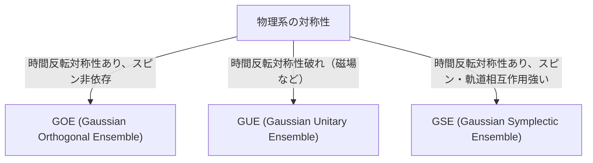

# Введение: Удивительная универсальность теории случайных матриц

Мир кажется сложным и непредсказуемым, но если посмотреть на него через призму математики, можно обнаружить удивительные сходства в совершенно разных областях. «Теория случайных матриц» (Random Matrix Theory, RMT) — это как раз одна из таких математических концепций, обладающих универсальностью.

Случайная матрица — это матрица, элементы которой задаются случайными величинами. На первый взгляд это просто случайный набор чисел, но если устремить размер матрицы к бесконечности, в распределении её собственных значений проявятся удивительно красивые и универсальные законы. Эти законы скрываются за совершенно разными системами: от микромира атомных ядер до загадки распределения простых чисел, колебаний цен на финансовых рынках и даже динамики обучения самых современных моделей глубокого обучения.

В этой статье мы начнем с исторического контекста теории случайных матриц, объясним ее математические основы, такие как классификация ансамблей GOE/GUE/GSE, математическое доказательство полукругового закона Вигнера, а также неожиданную связь с дзета-функцией Римана. Во второй половине мы углубимся в современные применения, такие как оптимизация портфеля в финансовой инженерии и проблема инициализации весов в ИИ и глубоком обучении, сопровождая это практической визуализацией с помощью кода на Python.

---

# 1. Зарождение в физике: Вигнер и загадка тяжелых атомных ядер

Корни теории случайных матриц уходят в ядерную физику 1950-х годов. Физики того времени отчаянно пытались понять энергетические уровни (значения энергии, которые могут принимать квантово-механические состояния) тяжелых атомных ядер, таких как уран.

## Энергетические уровни ядра урана

Для легких атомных ядер можно точно предсказать энергетические уровни, рассчитав взаимодействие протонов и нейтронов в соответствии с уравнением Шредингера. Однако для тяжелых ядер, таких как уран (например, с массовым числом 238), где большое количество нуклонов сложно взаимодействует друг с другом, точные вычисления практически невозможны из-за слишком большого числа степеней свободы.

Глядя на экспериментальные данные рассеяния нейтронов, казалось, что энергетические уровни резонансов расположены беспорядочно. Однако, когда исследователи изучили статистическое распределение "интервалов" (spacing) между энергетическими уровнями, выяснилось, что в них есть четкая закономерность. Соседние энергетические уровни обладали свойством «отталкивания уровней» (level repulsion), никогда не сближаясь слишком сильно.

## Интуиция Вигнера и открытие полукругового закона

В 1955 году Юджин Вигнер (Eugene Wigner) предложил смелую идею: моделировать гамильтониан (матрицу, представляющую энергию) этой сложной квантовой системы не как конкретную матрицу с детальной физической структурой, а как «огромную симметричную матрицу со случайно принимающими значения элементами».

Удивительно, но распределение интервалов между собственными значениями этой крайне упрощенной случайной матрицы идеально совпало с распределением интервалов между энергетическими уровнями реального ядра урана. Более того, Вигнер обнаружил, что в пределе, когда размер матрицы $N$ стремится к бесконечности, общее распределение плотности собственных значений принимает форму полукруга. Это и есть знаменитый «полукруговой закон Вигнера» (Wigner's semicircle law).

---

# 2. Классификация ансамблей: GOE, GUE, GSE

Опираясь на исследования Вигнера, Фримен Дайсон (Freeman Dyson) систематизировал теорию случайных матриц и классифицировал случайные матрицы на три универсальных класса (ансамбля) в зависимости от симметрии физической системы. Они известны как «Тройной путь Дайсона» (Dyson's threefold way).



## Гауссовский ортогональный ансамбль (GOE)

GOE — это множество вещественных симметричных матриц, элементы которых являются вещественными числами. Каждый недиагональный элемент выбирается независимо из нормального распределения со средним 0 и дисперсией 1, а диагональные элементы выбираются из нормального распределения со средним 0 и дисперсией 2. GOE используется для моделирования гамильтонианов квантовых систем, в которых отсутствует внешнее магнитное поле и сохраняется симметрия обращения времени (например, системы бесспиновых частиц).

## Гауссовский унитарный ансамбль (GUE)

GUE — это множество эрмитовых матриц, элементы которых являются комплексными числами. Вещественная и мнимая части недиагональных элементов независимо следуют нормальному распределению. Применяется к физическим системам, в которых нарушена симметрия обращения времени, например, из-за наличия внешнего магнитного поля. Именно GUE имеет глубокую связь с распределением нулей дзета-функции Римана, о которой пойдет речь далее.

## Гауссовский симплектический ансамбль (GSE)

GSE — это множество самодуальных эрмитовых матриц, элементы которых состоят из кватернионов. Он описывает системы, в которых симметрия обращения времени сохраняется, но частицы имеют полуцелый спин, и присутствует сильное спин-орбитальное взаимодействие.

---

# 3. Математические глубины: Доказательство полукругового закона Вигнера

Давайте рассмотрим процесс доказательства полукругового закона Вигнера, самого фундаментального результата теории случайных матриц, с помощью метода моментов (Method of Moments).

Рассмотрим вещественную симметричную матрицу $X$ размера $N \times N$, элементы которой $X_{ij}$ являются взаимно независимыми случайными величинами со средним 0 и дисперсией 1. Мы хотим найти предел распределения собственных значений масштабированной матрицы $W = \frac{1}{\sqrt{N}}X$ при ($N \to \infty$).

## Подход с использованием метода моментов

Для анализа эмпирической функции распределения собственных значений мы вычислим $k$-й момент распределения $m_k$. Поскольку след матрицы (сумма диагональных элементов) равен сумме её собственных значений, мы оцениваем:
$$ m_k = \lim_{N \to \infty} \frac{1}{N} \mathbb{E}[\text{Tr}(W^k)] $$

Разворачивая след, получаем:
$$ \text{Tr}(W^k) = \frac{1}{N^{k/2}} \sum_{i_1, i_2, \dots, i_k} X_{i_1 i_2} X_{i_2 i_3} \cdots X_{i_k i_1} $$
При взятии математического ожидания, поскольку элементы $X_{ij}$ имеют среднее 0 и независимы, те члены в разложении, в которых один и тот же элемент появляется только один раз, будут иметь математическое ожидание 0. Чтобы иметь ненулевой вклад, каждое ребро на пути $i_1 \to i_2 \to \dots \to i_k \to i_1$ должно быть пройдено как минимум дважды.

В пределе $N \to \infty$ основной вклад дают пути длиной ровно $k$ шагов, которые образуют древовидную структуру ("дерево", tree), где мы исследуем новые вершины и возвращаемся по пройденным ребрам ровно по одному разу. Это возможно только если $k$ — четное число ($k = 2m$), а нечетные моменты в пределе равны нулю.

## Связь чисел Каталана и полукругового закона

Общее количество таких путей длины $2m$ (путей Дика) задается известными в комбинаторике «числами Каталана» (Catalan numbers) $C_m$:
$$ C_m = \frac{1}{m+1} \binom{2m}{m} $$

Следовательно, моменты предельного распределения равны:
$$ m_{2m} = C_m, \quad m_{2m+1} = 0 $$
Известно, что вероятностным распределением, обладающим такими моментами, является полукруговое распределение (полукруговой закон Вигнера), носитель которого находится на отрезке $[-2, 2]$. Его функция плотности вероятности имеет вид:
$$ \rho(x) = \begin{cases} \frac{1}{2\pi} \sqrt{4 - x^2} & (-2 \le x \le 2) \\ 0 & (\text{иначе}) \end{cases} $$

---

# 4. Неожиданная встреча с дзета-функцией Римана

Теория случайных матриц, рожденная для решения физических задач, в 1970-х годах привела к открытию века в области чистой математики, в частности, в теории чисел.

## Гипотеза Монтгомери-Одлыжко

В 1972 году теоретик чисел Хью Монтгомери (Hugh Montgomery) исследовал распределение интервалов между нетривиальными нулями дзета-функции Римана. Согласно гипотезе Римана, все эти нули лежат на «критической прямой» (прямой, где вещественная часть равна 1/2) в комплексной плоскости. Монтгомери вычислил парную корреляционную функцию нулей и вывел, что она равна $1 - \left(\frac{\sin(\pi x)}{\pi x}\right)^2$.

Однажды во время чаепития в Институте перспективных исследований в Принстоне Монтгомери рассказал об этом результате физику Фримену Дайсону. Дайсон был поражен. Дело в том, что эта формула была в точности такой же, как распределение интервалов между собственными значениями GUE (Гауссовского унитарного ансамбля), которое вывел сам Дайсон.

## Пересечение простых чисел и квантового хаоса

Позже математик Эндрю Одлыжко (Andrew Odlyzko) с помощью суперкомпьютера вычислил миллионы нулей дзета-функции и доказал, что их распределение интервалов совпадает с предсказаниями GUE с поразительной точностью.

Это открытие, названное «гипотезой Монтгомери-Одлыжко», предполагает наличие глубокой универсальной связи между распределением простых чисел (нули дзета-функции тесно связаны с распределением простых чисел) и квантовыми хаотическими системами (GUE). Это был момент, когда математика, описывающая микроскопические законы Вселенной, и математика, управляющая строительными блоками чисел — простыми числами, пересеклись через точку соприкосновения случайных матриц.

---

# 5. Применение в финансовой инженерии: Эволюция оптимизации портфеля

Теория случайных матриц не ограничивается физикой и чистой математикой, но также применяется как мощный инструмент анализа финансовых рынков. В частности, она играет важную роль в оптимизации управления активами.

## Ограничения модели Марковица

В модели "среднее-дисперсия" Гарри Марковица (Harry Markowitz), которая является основой современной портфельной теории, для определения оптимальных пропорций инвестирования используется обратная матрица ковариации активов. Однако на практике возникла серьезная проблема.

При оценке выборочной матрицы ковариации на основе данных о доходности за прошлые $T$ периодов для $N$ активов, если $N$ велико, а $T$ недостаточно (нельзя сказать, что $N/T$ близко к 0), выборочная матрица ковариации будет содержать большое количество статистического шума. При вычислении обратной матрицы с таким шумом ошибки многократно усиливаются, в результате чего генерируются нереалистичные и экстремальные портфели (например, предписывающие экстремально короткие или длинные позиции по некоторым активам).

## Очистка от шума с помощью случайных матриц

Здесь на сцену выходит теория случайных матриц. В 1999 году Бушо (Bouchaud) с соавторами и Лалу (Laloux) с соавторами независимо применили теорию случайных матриц к матрицам ковариации финансовых рынков. Они сравнили распределение собственных значений матрицы ковариации, полученной из абсолютно случайных временных рядов данных (распределение Марченко-Пастура, Marchenko-Pastur distribution), с распределением собственных значений матрицы ковариации реальных рыночных данных.

В результате выяснилось, что подавляющее большинство (более 90%) собственных значений рыночных данных находится в пределах теоретических границ, предсказанных теорией случайных матриц. Другими словами, это просто «шум». С другой стороны, было показано, что только небольшое число крупных собственных значений, далеко выходящих за эти границы, несут значимую информацию, отражающую истинную структуру корреляции рынка (рыночные факторы и отраслевые факторы).

На основе этих выводов был разработан метод «очистки» (cleaning) матрицы ковариации путем фильтрации собственных значений, соответствующих шуму (например, их обнуления или замены средним значением). Это позволило кардинально повысить производительность и стабильность портфелей, и сегодня этот метод является стандартной технологией во многих квантовых фондах.

---

# 6. Применение в искусственном интеллекте: Веса и динамика обучения в глубоком обучении

В последние годы теория случайных матриц также привлекает внимание в теоретическом анализе ИИ и машинного обучения, особенно глубокого обучения (Deep Learning).

## Проблема инициализации нейронных сетей

При обучении гигантских нейронных сетей вопрос о том, как задать начальные значения матриц весов сети, является критически важным и может решить судьбу обучения. Если инициализация неадекватна, может возникнуть проблема затухания градиента (Gradient Vanishing) или взрыва градиента (Gradient Exploding), и обучение не будет продвигаться.

Когда матрица весов инициализируется случайными значениями, это и есть случайная матрица. Используя теорию случайных матриц, можно строго проанализировать изменение дисперсии сигнала при прохождении через слои и поведение градиента при обратном распространении ошибки. Например, анализ влияния нелинейных функций активации на спектр (распределение собственных значений) случайных матриц теоретически обосновывает такие современные стандартные методы инициализации, как инициализация Ксавье (Xavier initialization) и инициализация Хе (He initialization).

## Распределение собственных значений гессиана (Hessian)

Для понимания динамики процесса обучения необходим анализ матрицы Гессе (гессиана), которая представляет кривизну функции потерь. Гессиан LLM ([больших языковых моделей](/ru/p/large-language-models-llm-transformer-prompt-engineering/)) с десятками миллионов или сотнями миллиардов параметров — это гигантская матрица, и прямо изучить ее свойства сложно. Однако с помощью теории случайных матриц можно аппроксимировать и предсказать распределение ее собственных значений.

Исследования показывают, что распределение собственных значений гессиана в глубоких нейронных сетях состоит из "основной массы" (bulk, большого количества собственных значений около нуля) и небольшого числа крупных выбросов (outliers). Основную массу можно смоделировать как случайную матрицу с шумом (например, направления с малым количеством информации), в то время как выбросы указывают на важные направления обучения, напрямую связанные с задачей. Понимание этой спектральной структуры дает крайне полезные знания для улучшения сходимости алгоритмов оптимизации (SGD, Adam и др.) и оптимизации расписания скорости обучения.

---

# 7. Практика: Визуализация распределения собственных значений на Python

В завершение давайте с помощью Python сгенерируем GOE (Гауссовский ортогональный ансамбль) и численно подтвердим выполнение полукругового закона Вигнера.

```python
import numpy as np
import matplotlib.pyplot as plt
from scipy.stats import semicircular

# パラメータ設定
N = 1000  # 行列のサイズ
num_matrices = 50  # アンサンブルのサンプル数

eigenvalues = []

# GOE行列の生成と固有値の計算
for _ in range(num_matrices):
    # 要素がN(0, 1)に従うN x N行列を生成
    X = np.random.randn(N, N)
    # 対称化してGOE行列を作成 (分散のスケーリングに注意)
    A = (X + X.T) / np.sqrt(2)
    # 分散を 1/N にスケーリング
    W = A / np.sqrt(N)
    
    # 固有値を計算（実対称行列なのでeighを使用）
    eigvals = np.linalg.eigh(W)[0]
    eigenvalues.extend(eigvals)

# プロットの設定
plt.figure(figsize=(10, 6))

# 固有値のヒストグラムをプロット
plt.hist(eigenvalues, bins=100, density=True, alpha=0.6, color='skyblue', edgecolor='black', label='Empirical Eigenvalues (GOE)')

# 理論的なウィグナーの半円則をプロット
x = np.linspace(-2.2, 2.2, 1000)
# 半径 R=2 の半円則の確率密度関数
y = np.where(np.abs(x) <= 2, np.sqrt(4 - x**2) / (2 * np.pi), 0)
plt.plot(x, y, 'r-', lw=3, label="Wigner's Semicircle Law")

plt.title(f"Eigenvalue Distribution of GOE Matrices ($N={N}$)", fontsize=16)
plt.xlabel("Eigenvalue", fontsize=14)
plt.ylabel("Density", fontsize=14)
plt.legend(fontsize=12)
plt.grid(True, alpha=0.3)
plt.tight_layout()
plt.show()
```

Если выполнить этот код, вы увидите, что собственные значения случайно сгенерированных матриц распределены в виде красивого полукруга. То, что, несмотря на абсолютную случайность элементов отдельных матриц, в целом возникает такой правильный закон — это и есть главная прелесть теории случайных матриц.

---

# Заключение

В этой статье мы проследили грандиозную историю теории случайных матриц, начавшуюся с ядерной физики и дошедшую до чистой математики, финансовой инженерии и современных технологий ИИ. Тот факт, что сложные, на первый взгляд не связанные между собой системы в предельных состояниях могут «разговаривать» на общем языке «собственных значений случайных матриц», показывает мистическую глубину природы и математики.

В наше время, когда объем данных стремительно растет, а модели становятся гигантскими, теория случайных матриц эволюционировала из объекта чисто абстрактной математики в мощное оружие для практического решения задач в науке о данных и машинном обучении. Эта теория, исследующая универсальную истину, скрытую за сложными системами, и в будущем останется светом, углубляющим наше понимание в различных областях.
