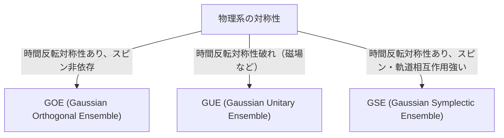

# 引言：随机矩阵理论惊人的普适性

世界看似复杂且不可预测，但透过数学的镜头，我们有时会在完全不同的领域中发现惊人的共同点。“随机矩阵理论（Random Matrix Theory, RMT）”正是具有这种普适性的数学框架之一。

随机矩阵是指元素由随机变量给出的矩阵。乍看之下，这不过是数字的随机排列，但当矩阵的大小趋于无限大时，其[特征值](/zh-cn/p/eigenvalues-and-eigenvectors/)的分布会展现出惊人美丽且普遍的规律。这种规律潜藏在完全不同的系统背后，从微观的原子核世界、素数分布的奥秘、金融市场的价格波动，一直到最先进的深度学习模型的学习动态。

本文将从随机矩阵理论的历史背景讲起，解释其数学基础——即GOE/GUE/GSE等系综（Ensemble）的分类、维格纳（Wigner）半圆律的数学证明，以及它与黎曼zeta函数之间意想不到的联系。在后半部分，我们将结合金融工程中的投资组合优化，以及AI和深度学习中的权重初始化问题等现代应用，利用Python代码进行实践性的可视化，进行更深入的探讨。

---

# 1. 诞生于物理学：维格纳与重原子核之谜

随机矩阵理论的根源可以追溯到1950年代的原子核物理学。当时的物理学家们正苦苦挣扎于理解像铀这样的重原子核的能级（量子力学状态可能采取的能量值）。

## 铀原子核的能级

如果是轻原子核，通过根据薛定谔方程计算质子和中子的相互作用，可以准确地预测能级。然而，在像铀（质量数为238等）这样由大量核子复杂相互作用的重原子核中，自由度太大，严格的计算实际上是不可能的。

观察实验测得的中子散射数据，共振的能级似乎是无序排列的。但是，当研究能级“间距（spacing）”的统计分布时，发现其中存在清晰的模式。相邻的能级具有一种永远不会靠得太近的“能级排斥（level repulsion）”属性。

## 维格纳的直觉与半圆律的发现

1955年，尤金·维格纳（Eugene Wigner）提出了一个大胆的想法：不将这个复杂量子系统的哈密顿量（表示能量的矩阵）视为具有详细物理结构的特定矩阵，而是将其建模为“元素取随机值的巨大对称矩阵”。

令人惊讶的是，这种极其简化的随机矩阵的[特征值](/zh-cn/p/eigenvalues-and-eigenvectors/)间距分布，与实际铀原子核能级的间距分布惊人地一致。维格纳进一步发现，在矩阵大小 $N$ 趋向于无穷大的极限下，[特征值](/zh-cn/p/eigenvalues-and-eigenvectors/)的整体密度分布呈现半圆形。这就是著名的“维格纳半圆律（Wigner's semicircle law）”。

---

# 2. 系综的分类：GOE、GUE、GSE

在维格纳研究的基础上，弗里曼·戴森（Freeman Dyson）将随机矩阵理论系统化，并基于物理系统具有的对称性，将随机矩阵分类为3个普遍类别（系综）。这些被称为“戴森三重道（Dyson's threefold way）”。



## 高斯正交系综 (GOE)

GOE是由元素为实数构成的实对称矩阵的集合。每个非对角元素独立地从均值为0、方差为1的正态分布中选取，对角元素从均值为0、方差为2的正态分布中选取。GOE用于对没有外部磁场且保持时间反演对称性的量子系统（例如，无自旋粒子的系统）的哈密顿量进行建模。

## 高斯酉系综 (GUE)

GUE是由元素为复数构成的埃尔米特矩阵的集合。非对角元素的实部和虚部分别服从独立的正态分布。适用于存在外部磁场等导致时间反演对称性破缺的物理系统。后文将提到，与黎曼zeta函数零点分布有深刻联系的正是这个GUE。

## 高斯辛系综 (GSE)

GSE是由元素为四元数构成的自对偶埃尔米特矩阵的集合。它描述的是时间反演对称性保持，但由自旋为半整数的粒子组成，且自旋轨道相互作用强的系统。

---

# 3. 数学深渊：维格纳半圆律的证明

我们将概述使用矩方法（Method of Moments）证明随机矩阵理论最基本结果——维格纳半圆律的过程。

考虑一个 $N \times N$ 的实对称矩阵 $X$，其元素 $X_{ij}$ 相互独立，且为均值为0、方差为1的随机变量。我们要求解缩放后的矩阵 $W = \frac{1}{\sqrt{N}}X$ 在极限（$N \to \infty$）下的[特征值](/zh-cn/p/eigenvalues-and-eigenvectors/)分布。

## 矩方法方法

为了分析[特征值](/zh-cn/p/eigenvalues-and-eigenvectors/)的经验分布函数，我们计算分布的 $k$ 阶矩 $m_k$。因为矩阵的迹（对角线元素之和）等于[特征值](/zh-cn/p/eigenvalues-and-eigenvectors/)之和，所以
$$ m_k = \lim_{N \to \infty} \frac{1}{N} \mathbb{E}[\text{Tr}(W^k)] $$
我们对其进行评估。

将迹展开，得到：
$$ \text{Tr}(W^k) = \frac{1}{N^{k/2}} \sum_{i_1, i_2, \dots, i_k} X_{i_1 i_2} X_{i_2 i_3} \cdots X_{i_k i_1} $$
在取期望值时，由于元素 $X_{ij}$ 均值为0且独立，在展开的项中，如果同一个元素只出现一次，其期望值将为0。为了产生非零的贡献，路径 $i_1 \to i_2 \to \dots \to i_k \to i_1$ 上的每条边都必须至少经过两次。

在极限 $N \to \infty$ 下，主要贡献来自于恰好 $k$ 步的路径，这些路径在探索新顶点的同时，精确地沿走过的边原路返回各一次，形成一种“树（tree）”结构。这只有在 $k$ 为偶数（$k = 2m$）时才可能发生，奇数阶矩在极限下为0。

## 卡特兰数与半圆律的联系

长度为 $2m$ 的此类路径（Dyck路径）的总数，由组合数学中著名的“卡特兰数（Catalan numbers）”$C_m$ 给出：
$$ C_m = \frac{1}{m+1} \binom{2m}{m} $$

因此，极限分布的矩为：
$$ m_{2m} = C_m, \quad m_{2m+1} = 0 $$
已知具有这种矩的概率分布是在区间 $[-2, 2]$ 上有支撑的半圆分布（维格纳半圆律）。其概率密度函数如下：
$$ \rho(x) = \begin{cases} \frac{1}{2\pi} \sqrt{4 - x^2} & (-2 \le x \le 2) \\ 0 & (\text{otherwise}) \end{cases} $$

---

# 4. 与黎曼zeta函数的意外邂逅

为了解决物理学问题而诞生的随机矩阵理论，在1970年代为纯粹数学，尤其是数论领域带来了一项世纪大发现。

## 蒙哥马利-奥德里兹科猜想

1972年，数论学家休·蒙哥马利（Hugh Montgomery）正在研究黎曼zeta函数非平凡零点的间距分布。根据黎曼猜想，这些零点全部位于复平面上的“临界线（实部为1/2的直线）”上。蒙哥马利计算了零点对的相关函数，并推导出其结果为 $1 - \left(\frac{\sin(\pi x)}{\pi x}\right)^2$。

某天，在普林斯顿高等研究院的下午茶时间，蒙哥马利将这个结果告诉了物理学家弗里曼·戴森。戴森震惊了。因为这个公式与戴森自己推导出的GUE（高斯酉系综）的[特征值](/zh-cn/p/eigenvalues-and-eigenvectors/)间距分布完全相同。

## 素数与量子混沌的交汇点

后来，数学家安德鲁·奥德里兹科（Andrew Odlyzko）利用超级计算机计算了数百万个zeta函数的零点，证实了其间距分布与GUE的预测以惊人的精度吻合。

这一发现被称为“蒙哥马利-奥德里兹科猜想（Montgomery-Odlyzko conjecture）”，它暗示了素数的分布（zeta函数的零点与素数分布密切相关）和量子混沌系统（GUE）之间存在深刻且普遍的联系。这是描述宇宙微观规律的数学，与支配数字构成要素素数的数学，通过随机矩阵这一契合点交汇的瞬间。

---

# 5. 金融工程的应用：投资组合优化的演进

随机矩阵理论不仅在物理学和纯数学领域，在分析金融市场方面也作为一种强大的工具得到应用。特别是在资产管理的优化中发挥着重要作用。

## 马科维茨模型的局限性

在作为现代投资组合理论基础的哈里·马科维茨（Harry Markowitz）的均值-方差模型中，通过使用资产协方差矩阵的逆矩阵来决定最佳投资比例。然而，在实际业务中存在一个很大的问题。

当从 $N$ 个资产过去 $T$ 个期的收益率数据中估计样本协方差矩阵时，如果 $N$ 很大而 $T$ 不够充分（不能说 $N/T$ 接近于0），样本协方差矩阵将包含大量的统计噪声。如果计算包含这种噪声的矩阵的逆矩阵，误差会被放大，从而生成不现实且极端的投资组合（指示对某些资产进行极端的做空或做多）。

## 随机矩阵的噪声清理

在这里，随机矩阵理论登场了。1999年，Bouchaud等人和Laloux等人独立地将随机矩阵理论应用于金融市场的协方差矩阵。他们将从完全随机的时间序列数据中获得的协方差矩阵的[特征值](/zh-cn/p/eigenvalues-and-eigenvectors/)分布（Marchenko-Pastur分布），与实际市场数据的协方差矩阵的[特征值](/zh-cn/p/eigenvalues-and-eigenvectors/)分布进行了比较。

结果发现，市场数据的绝大部分[特征值](/zh-cn/p/eigenvalues-and-eigenvectors/)（90%以上）都落在随机矩阵理论预测的理论边界内。换句话说，这些只是单纯的“噪声”。另一方面，只有远超边界的少数几个大[特征值](/zh-cn/p/eigenvalues-and-eigenvectors/)，才被证明包含了反映市场真实相关结构（市场因子或行业因子）的有意义的信息。

基于这一发现，开发了过滤对应于噪声的[特征值](/zh-cn/p/eigenvalues-and-eigenvectors/)（例如将其置零或用平均值替换）以“清理”协方差矩阵的方法。这极大地提高了投资组合的绩效和稳定性，现在已成为许多量化基金的标准技术。

---

# 6. 人工智能的应用：深度学习中的权重与学习动态

近年来，随机矩阵理论在AI和机器学习，特别是深度学习（Deep Learning）的理论分析中也备受瞩目。

## 神经网络的初始化问题

在训练巨大的神经网络时，如何设置网络权重矩阵的初始值，是决定训练成败的极其重要的问题。如果初始化不当，就会发生梯度消失（Gradient Vanishing）或梯度爆炸（Gradient Exploding），导致学习无法进行。

当用随机值初始化权重矩阵时，它正是随机矩阵。利用随机矩阵理论，可以严格解析信号穿过各层后方差的变化，以及反向传播中梯度的行为。例如，通过分析非线性激活函数对随机矩阵谱（[特征值](/zh-cn/p/eigenvalues-and-eigenvectors/)分布）的影响，为Xavier初始化和He初始化等现代标准初始化方法提供了理论依据。

## 海森矩阵（Hessian）的特征值分布

为了理解学习过程的动态特性，分析表示损失函数曲率的海森矩阵至关重要。拥有数千万到数千亿参数的[LLM](/zh-cn/p/large-language-models-llm-transformer-prompt-engineering/)（[大型语言模型](/zh-cn/p/large-language-models-llm-transformer-prompt-engineering/)）的海森矩阵是一个巨大的矩阵，直接研究其性质很困难，但利用随机矩阵理论可以近似预测其[特征值](/zh-cn/p/eigenvalues-and-eigenvectors/)分布。

研究表明，深度神经网络海森矩阵的[特征值](/zh-cn/p/eigenvalues-and-eigenvectors/)分布由主体部分（bulk，大量在零附近的[特征值](/zh-cn/p/eigenvalues-and-eigenvectors/)）和少数巨大的离群值（outliers）组成。主体部分可以被建模为包含噪声的随机矩阵（例如，信息较少的方向），而离群值则指示了直接关系到任务的重要学习方向。对这种谱结构的理解，在改善优化算法（SGD、Adam等）的收敛性以及优化学习率调度方面，提供了极其有益的见解。

---

# 7. 实践：用Python进行特征值分布的可视化

最后，让我们使用Python实际生成GOE（高斯正交系综），并进行数值验证以确认维格纳半圆律的成立。

```python
import numpy as np
import matplotlib.pyplot as plt
from scipy.stats import semicircular

# パラメータ設定
N = 1000  # 行列のサイズ
num_matrices = 50  # アンサンブルのサンプル数

eigenvalues = []

# GOE行列の生成と固有値の計算
for _ in range(num_matrices):
    # 要素がN(0, 1)に従うN x N行列を生成
    X = np.random.randn(N, N)
    # 対称化してGOE行列を作成 (分散のスケーリングに注意)
    A = (X + X.T) / np.sqrt(2)
    # 分散を 1/N にスケーリング
    W = A / np.sqrt(N)
    
    # 固有値を計算（実対称行列なのでeighを使用）
    eigvals = np.linalg.eigh(W)[0]
    eigenvalues.extend(eigvals)

# プロットの設定
plt.figure(figsize=(10, 6))

# 固有値のヒストグラムをプロット
plt.hist(eigenvalues, bins=100, density=True, alpha=0.6, color='skyblue', edgecolor='black', label='Empirical Eigenvalues (GOE)')

# 理論的なウィグナーの半円則をプロット
x = np.linspace(-2.2, 2.2, 1000)
# 半径 R=2 の半円則の確率密度関数
y = np.where(np.abs(x) <= 2, np.sqrt(4 - x**2) / (2 * np.pi), 0)
plt.plot(x, y, 'r-', lw=3, label="Wigner's Semicircle Law")

plt.title(f"Eigenvalue Distribution of GOE Matrices ($N={N}$)", fontsize=16)
plt.xlabel("Eigenvalue", fontsize=14)
plt.ylabel("Density", fontsize=14)
plt.legend(fontsize=12)
plt.grid(True, alpha=0.3)
plt.tight_layout()
plt.show()
```

运行这段代码，可以确认随机生成的矩阵的[特征值](/zh-cn/p/eigenvalues-and-eigenvectors/)分布呈现出美丽的半圆形。尽管每个矩阵的元素完全是随机的，但整体上展现出这样规则的规律，这正是随机矩阵理论最大的魅力所在。

---

# 结语

在本文中，我们追溯了随机矩阵理论的宏大故事，从原子核物理学开始，延伸到纯数学、金融工程，甚至是现代AI技术。看似毫无关联的复杂系统，在极限状态下却能以“随机矩阵的[特征值](/zh-cn/p/eigenvalues-and-eigenvectors/)”这一通用语言相互对话，这一事实展示了自然界与数学之间神秘的深邃。

在数据爆炸式增长、模型不断变大的现代社会，随机矩阵理论已经从纯粹的抽象数学对象，演变成为解决数据科学和机器学习中实际问题的有力武器。这个探索复杂系统背后普遍真理的理论，今后也将继续成为加深我们在各领域理解的指路明灯。
