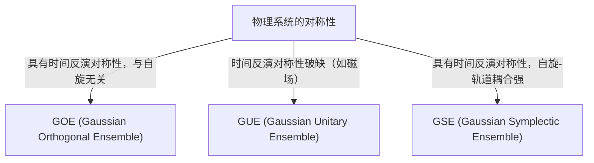

# 导言：随机矩阵理论令人惊叹的普适性

世界看似复杂而不可预测，但透过数学的镜头，我们有时能在完全不同的领域发现惊人的共同点。“随机矩阵理论（Random Matrix Theory, RMT）”正是具有这种普适性的数学框架之一。

随机矩阵是指元素由随机变量构成的矩阵。乍看之下，它不过是数字的随机排列，但当矩阵的尺寸趋于无限大时，其[特征值](/zh-cn/p/eigenvalues-and-eigenvectors/)的分布会呈现出令人惊叹的优美而普适的规律。从微观世界的原子核、素数分布之谜、金融市场的价格波动，乃至最前沿深度学习模型的训练动力学，这一规律潜藏在截然不同的系统背后。

本文将从随机矩阵理论的历史背景讲起，探讨其数学基础（如GOE/GUE/GSE系综的分类）、维格纳半圆律的数学证明，以及它与黎曼ζ函数之间出人意料的联系。在后半部分，我们将结合Python代码的实战可视化，深入剖析其在金融工程中的投资组合优化、AI与深度学习中的权重初始化等现代应用。

---

# 1. 诞生于物理学：维格纳与重原子核之谜

随机矩阵理论的根源可以追溯到20世纪50年代的核物理学。当时的物理学家们正绞尽脑汁地试图理解铀等重原子核的能级（量子力学状态可能具有的能量值）。

## 铀原子核的能级

对于轻原子核，通过薛定谔方程计算质子和中子的相互作用，就能准确预测其能级。然而，在像铀（质量数238等）这样由大量核子发生复杂相互作用的重原子核中，由于自由度过大，严格的计算实际上是不可能的。

从实验观测到的中子散射数据来看，共振能级似乎是无序排列的。但是，当研究能级间距（spacing）的统计分布时，人们发现其中有着清晰的模式。相邻的能级绝不会靠得太近，这被称为“能级排斥（level repulsion）”特性。

## 维格纳的直觉与半圆律的发现

1955年，尤金·维格纳（Eugene Wigner）提出了一个大胆的想法：不把这个复杂量子系统的哈密顿量（表示能量的矩阵）当作具有具体物理结构的特定矩阵，而是将其建模为“元素取随机值的巨大对称矩阵”。

令人惊讶的是，这个极度简化的随机矩阵的[特征值](/zh-cn/p/eigenvalues-and-eigenvectors/)间距分布，与实际铀原子核能级间距分布惊人地一致。维格纳进一步发现，在矩阵尺寸 $N$ 趋于无限大的极限下，[特征值](/zh-cn/p/eigenvalues-and-eigenvectors/)的整体密度分布会呈现半圆的形状。这就是著名的“维格纳半圆律（Wigner's semicircle law）”。

---

# 2. 系综的分类：GOE、GUE、GSE

在维格纳研究的基础上，弗里曼·戴森（Freeman Dyson）将随机矩阵理论系统化，并根据物理系统所具有的对称性，将随机矩阵分为三个普适的类别（系综）。这被称为“戴森的三重道（Dyson's threefold way）”。



## 高斯正交系综 (GOE)

GOE 是由实数构成的实对称矩阵集合。非对角元素各自独立地从均值为0、方差为1的正态分布中抽取，对角元素则从均值为0、方差为2的正态分布中抽取。GOE 被用于模拟没有外部磁场、保持时间反演对称性的量子系统（例如无自旋粒子系统）的哈密顿量。

## 高斯酉系综 (GUE)

GUE 是由复数构成的埃尔米特矩阵集合。非对角元素的实部和虚部分别服从独立的正态分布。适用于存在外部磁场等导致时间反演对称性破缺的物理系统。后文将提到的与黎曼ζ函数零点分布有深刻联系的正是这个 GUE。

## 高斯辛系综 (GSE)

GSE 是由四元数（Quaternion）构成的自对偶埃尔米特矩阵集合。它描述的是时间反演对称性得以保持，但由半整数自旋粒子构成、自旋轨道相互作用很强的系统。

---

# 3. 数学的深渊：维格纳半圆律的证明

下面我们将概述如何使用矩方法（Method of Moments）来证明随机矩阵理论最基本的结果——维格纳半圆律。

考虑一个尺寸为 $N \times N$ 的实对称矩阵 $X$，其元素 $X_{ij}$ 是相互独立、均值为0、方差为1的随机变量。我们要求出缩放矩阵 $W = \frac{1}{\sqrt{N}}X$ 在极限（$N \to \infty$）时的[特征值](/zh-cn/p/eigenvalues-and-eigenvectors/)分布。

## 基于矩方法的推导

为了分析[特征值](/zh-cn/p/eigenvalues-and-eigenvectors/)的经验分布函数，我们计算分布的第 $k$ 阶矩 $m_k$。由于矩阵的迹（对角元素的和）等于[特征值](/zh-cn/p/eigenvalues-and-eigenvectors/)之和，故：
$$ m_k = \lim_{N \to \infty} \frac{1}{N} \mathbb{E}[\text{Tr}(W^k)] $$

将迹展开得：
$$ \text{Tr}(W^k) = \frac{1}{N^{k/2}} \sum_{i_1, i_2, \dots, i_k} X_{i_1 i_2} X_{i_2 i_3} \cdots X_{i_k i_1} $$
在求期望值时，由于元素 $X_{ij}$ 均值为0且相互独立，因此在展开项中，若同一元素只出现1次，其期望值为0。若要获得非零的贡献，路径 $i_1 \to i_2 \to \dots \to i_k \to i_1$ 上的每一条边都必须至少经过2次。

在极限 $N \to \infty$ 时，主要的贡献来自于正好走 $k$ 步、在探索新顶点的同时精确地沿着走过的边返回一次的“树（tree）”状路径。这只有在 $k$ 为偶数（$k = 2m$）时才可能，而奇数阶矩在极限下均为0。

## 卡特兰数与半圆律的联系

长度为 $2m$ 的此类路径（戴克路径）的总数，由组合数学中著名的“[卡特兰数](/zh-cn/p/catalan-numbers/)（Catalan numbers）” $C_m$ 给出：
$$ C_m = \frac{1}{m+1} \binom{2m}{m} $$

因此，极限分布的矩为：
$$ m_{2m} = C_m, \quad m_{2m+1} = 0 $$
拥有这些矩的概率分布，已知就是在区间 $[-2, 2]$ 上有支撑的半圆分布（维格纳半圆律）。其概率密度函数如下：
$$ \rho(x) = \begin{cases} \frac{1}{2\pi} \sqrt{4 - x^2} & (-2 \le x \le 2) \\ 0 & (\text{其他}) \end{cases} $$

---

# 4. 与黎曼ζ函数的意外邂逅

诞生于解决物理学问题的随机矩阵理论，在20世纪70年代为纯数学领域，特别是数论，带来了世纪大发现。

## 蒙哥马利-奥德里兹科猜想

1972年，数论学家休·蒙哥马利（Hugh Montgomery）正在研究黎曼ζ函数非平凡零点的间距分布。根据黎曼猜想，这些零点都位于复平面上的“临界线（实部为1/2的直线）”上。蒙哥马利计算了零点对的相关函数，得出结果为 $1 - \left(\frac{\sin(\pi x)}{\pi x}\right)^2。

有一天，在普林斯顿高等研究院的下午茶时间，蒙哥马利向物理学家弗里曼·戴森谈起了这个结果。戴森大为震惊。因为这个公式，与戴森自己推导出的 GUE（高斯酉系综）的[特征值](/p/eigenvalues-and-eigenvectors/)间距分布完全一致。

## 素数与量子混沌的交叉点

后来，数学家安德鲁·奥德里兹科（Andrew Odlyzko）利用超级计算机计算了数百万个ζ函数的零点，证实了其间距分布与 GUE 的预测有着惊人的吻合度。

这一发现被称为“蒙哥马利-奥德里兹科猜想”，它表明素数分布（ζ函数的零点与素数分布密切相关）与量子混沌系统（GUE）之间存在着深刻的普适联系。描述宇宙微观法则的数学，与支配数字构成要素“素数”的数学，在随机矩阵这一交点上历史性地相遇了。

---

# 5. 金融工程应用：投资组合优化的进化

随机矩阵理论不仅在物理学和纯数学领域，在金融市场分析中也被应用为一种强大的工具。特别是在资产管理的优化方面发挥着重要作用。

## 马科维茨模型的局限性

在现代投资组合理论的奠基人哈里·马科维茨（Harry Markowitz）的均值-方差模型中，通过使用资产协方差矩阵的逆矩阵来决定最佳投资比例。然而，在实务中存在一个大问题。

当从 $N$ 个资产过去 $T$ 期的收益率数据中估计样本协方差矩阵时，如果 $N$ 很大而 $T$ 不够长（即 $N/T$ 无法说是接近0），样本协方差矩阵就会包含大量统计噪声。如果计算包含这些噪声的矩阵的逆矩阵，误差会被放大，从而生成极不现实且极端的投资组合（比如指示对某些资产进行极端的做空或做多）。

## 基于随机矩阵的噪声清理

这里就是随机矩阵理论大显身手的地方。1999年，Bouchaud等和Laloux等分别独立地将随机矩阵理论应用到了金融市场的协方差矩阵中。他们将完全随机的时间序列数据所得出的协方差矩阵[特征值](/p/eigenvalues-and-eigenvectors/)分布（马尔琴科-巴斯图尔分布），与实际市场数据协方差矩阵的[特征值](/p/eigenvalues-and-eigenvectors/)分布进行了比较。

结果发现，市场数据的绝大部分[特征值](/p/eigenvalues-and-eigenvectors/)（90%以上）都落在随机矩阵理论预测的理论边界内。这意味着这些仅仅是“噪声”。另一方面，只有极少数远超边界的大[特征值](/p/eigenvalues-and-eigenvectors/)，才包含了反映市场真实相关结构（如市场因子或行业因子）的有意义的信息。

基于这一发现，人们开发出了一种通过过滤（将其归零或替换为均值）对应噪声的[特征值](/p/eigenvalues-and-eigenvectors/)，来“清理”协方差矩阵的方法。这极大地提高了投资组合的表现和稳定性，目前已被许多量化基金作为标准技术使用。

---

# 6. 人工智能应用：深度学习中的权重与训练动力学

近年来，随机矩阵理论在AI与机器学习，尤其是深度学习的理论分析中也备受瞩目。

## 神经网络的初始化问题

在训练巨大的神经网络时，如何设置网络权重矩阵的初始值是决定训练成败的关键问题。如果初始化不当，就会发生梯度消失（Gradient Vanishing）或梯度爆炸（Gradient Exploding），导致训练无法进行。

当用随机值初始化权重矩阵时，它本身就是一个随机矩阵。利用随机矩阵理论，可以严格分析信号方差在穿过各层时的演变过程，以及反向传播中梯度的行为。例如，通过分析非线性激活函数对随机矩阵谱（[特征值](/p/eigenvalues-and-eigenvectors/)分布）的影响，为Xavier初始化和He初始化等现代标准初始化方法提供了理论上的正当性。

## 海森（Hessian）矩阵的特征值分布

在理解训练过程动力学时，分析表示损失函数曲率的海森矩阵是必不可少的。拥有数千万乃至数千亿参数的[LLM](/p/large-language-models-llm-transformer-prompt-engineering/)（大语言模型）的海森矩阵极其庞大，直接研究其性质非常困难，但利用随机矩阵理论，我们可以近似并预测其[特征值](/p/eigenvalues-and-eigenvectors/)分布。

研究表明，深度神经网络海森矩阵的[特征值](/p/eigenvalues-and-eigenvectors/)分布，是由一个主体（bulk，大量接近零的[特征值](/p/eigenvalues-and-eigenvectors/)）和极少数巨大的离群值（outlier）组成的。主体部分可建模为包含噪声的随机矩阵（例如，信息较少的方向），而离群值则表示与任务直接相关的重要训练方向。对这种谱结构的理解，为改善优化算法（如SGD、Adam等）的收敛性、以及优化学习率调度提供了极其有价值的见解。

---

# 7. 实践：利用Python进行特征值分布的可视化

最后，让我们利用Python实际生成GOE（高斯正交系综），并数值验证维格纳半圆律的成立。

```python
import numpy as np
import matplotlib.pyplot as plt
from scipy.stats import semicircular

# 参数设置
N = 1000  # 矩阵尺寸
num_matrices = 50  # 系综的样本数

eigenvalues = []

# 生成GOE矩阵并计算特征值
for _ in range(num_matrices):
    # 生成元素服从N(0, 1)的N x N矩阵
    X = np.random.randn(N, N)
    # 对称化创建GOE矩阵 (注意方差的缩放)
    A = (X + X.T) / np.sqrt(2)
    # 将方差缩放为 1/N
    W = A / np.sqrt(N)
    
    # 计算特征值（由于是实对称矩阵，使用eigh）
    eigvals = np.linalg.eigh(W)[0]
    eigenvalues.extend(eigvals)

# 绘图设置
plt.figure(figsize=(10, 6))

# 绘制特征值的直方图
plt.hist(eigenvalues, bins=100, density=True, alpha=0.6, color='skyblue', edgecolor='black', label='Empirical Eigenvalues (GOE)')

# 绘制理论上的维格纳半圆律
x = np.linspace(-2.2, 2.2, 1000)
# 半径为 R=2 的半圆律概率密度函数
y = np.where(np.abs(x) <= 2, np.sqrt(4 - x**2) / (2 * np.pi), 0)
plt.plot(x, y, 'r-', lw=3, label="Wigner's Semicircle Law")

plt.title(f"Eigenvalue Distribution of GOE Matrices ($N={N}$)", fontsize=16)
plt.xlabel("Eigenvalue", fontsize=14)
plt.ylabel("Density", fontsize=14)
plt.legend(fontsize=12)
plt.grid(True, alpha=0.3)
plt.tight_layout()
plt.show()
```

运行这段代码，你会看到随机生成的矩阵的[特征值](/zh-cn/p/eigenvalues-and-eigenvectors/)呈现出优美的半圆形状分布。尽管单个矩阵的元素完全是随机的，但整体却能涌现出如此规律的法则，这正是随机矩阵理论最大的魅力所在。

---

# 结语

在本文中，我们追溯了从核物理学起步的随机矩阵理论，延伸到纯数学、金融工程，甚至现代AI技术的宏大故事。看似毫不相干的复杂系统，在极限状态下却能用“随机矩阵的[特征值](/zh-cn/p/eigenvalues-and-eigenvectors/)”这一共同语言进行对话，揭示了自然界与数学那神秘而深邃的本质。

在数据爆炸、模型持续变大的现代，随机矩阵理论正在从纯粹的抽象数学对象，进化为解决数据科学和机器学习实务问题的强力武器。探寻潜藏在复杂系统背后的普适真理，这一理论今后也必定会在各领域中继续发光发热，深化我们的认知。
