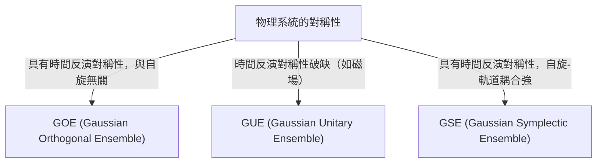

# 導言：隨機矩陣理論令人驚嘆的普適性

世界看似複雜而不可預測，但透過數學的鏡頭，我們有時能在完全不同的領域發現驚人的共同點。「隨機矩陣理論（Random Matrix Theory, RMT）」正是具有這種普適性的數學框架之一。

隨機矩陣是指元素由隨機變數構成的矩陣。乍看之下，它不過是數字的隨機排列，但當矩陣的尺寸趨於無限大時，其[特徵值](/zh-tw/p/eigenvalues-and-eigenvectors/)的分佈會呈現出令人驚嘆的優美而普適的規律。從微觀世界的原子核、質數分佈之謎、金融市場的價格波動，乃至最前沿深度學習模型的訓練動力學，這一規律潛藏在截然不同的系統背後。

本文將從隨機矩陣理論的歷史背景講起，探討其數學基礎（如GOE/GUE/GSE系綜的分類）、維格那半圓律的數學證明，以及它與黎曼ζ函數之間出人意料的聯繫。在後半部分，我們將結合Python代碼的實戰視覺化，深入剖析其在金融工程中的投資組合優化、AI與深度學習中的權重初始化等現代應用。

---

# 1. 誕生於物理學：維格那與重原子核之謎

隨機矩陣理論的根源可以追溯到20世紀50年代的核物理學。當時的物理學家們正絞盡腦汁地試圖理解鈾等重原子核的能階（量子力學狀態可能具有的能量值）。

## 鈾原子核的能階

對於輕原子核，透過薛丁格方程式計算質子和中子的相互作用，就能準確預測其能階。然而，在像鈾（質量數238等）這樣由大量核子發生複雜相互作用的重原子核中，由於自由度過大，嚴格的計算實際上是不可能的。

從實驗觀測到的中子散射數據來看，共振能階似乎是無序排列的。但是，當研究能階間距（spacing）的統計分佈時，人們發現其中有著清晰的模式。相鄰的能階絕不會靠得太近，這被稱為「能階排斥（level repulsion）」特性。

## 維格那的直覺與半圓律的發現

1955年，尤金·維格那（Eugene Wigner）提出了一個大膽的想法：不把這個複雜量子系統的哈密頓量（表示能量的矩陣）當作具有具體物理結構的特定矩陣，而是將其建模為「元素取隨機值的巨大對稱矩陣」。

令人驚訝的是，這個極度簡化的隨機矩陣的[特徵值](/zh-tw/p/eigenvalues-and-eigenvectors/)間距分佈，與實際鈾原子核能階間距分佈驚人地一致。維格那進一步發現，在矩陣尺寸 $N$ 趨於無限大的極限下，[特徵值](/zh-tw/p/eigenvalues-and-eigenvectors/)的整體密度分佈會呈現半圓的形狀。這就是著名的「維格那半圓律（Wigner's semicircle law）」。

---

# 2. 系綜的分類：GOE、GUE、GSE

在維格那研究的基礎上，弗里曼·戴森（Freeman Dyson）將隨機矩陣理論系統化，並根據物理系統所具有的對稱性，將隨機矩陣分為三個普適的類別（系綜）。這被稱為「戴森的三重道（Dyson's threefold way）」。



## 高斯正交系綜 (GOE)

GOE 是由實數構成的實對稱矩陣集合。非對角元素各自獨立地從均值為0、方差為1的常態分佈中抽取，對角元素則從均值為0、方差為2的常態分佈中抽取。GOE 被用於模擬沒有外部磁場、保持時間反演對稱性的量子系統（例如無自旋粒子系統）的哈密頓量。

## 高斯酉系綜 (GUE)

GUE 是由複數構成的埃爾米特矩陣集合。非對角元素的實部和虛部分別服從獨立的常態分佈。適用於存在外部磁場等導致時間反演對稱性破缺的物理系統。後文將提到的與黎曼ζ函數零點分佈有深刻聯繫的正是這個 GUE。

## 高斯辛系綜 (GSE)

GSE 是由四元數（Quaternion）構成的自對偶埃爾米特矩陣集合。它描述的是時間反演對稱性得以保持，但由半整數自旋粒子構成、自旋軌道相互作用很強的系統。

---

# 3. 數學的深淵：維格那半圓律的證明

下面我們將概述如何使用動差法（Method of Moments）來證明隨機矩陣理論最基本的結果——維格那半圓律。

考慮一個尺寸為 $N \times N$ 的實對稱矩陣 $X$，其元素 $X_{ij}$ 是相互獨立、均值為0、方差為1的隨機變數。我們要求出縮放矩陣 $W = \frac{1}{\sqrt{N}}X$ 在極限（$N \to \infty$）時的[特徵值](/zh-tw/p/eigenvalues-and-eigenvectors/)分佈。

## 基於動差法的推導

為了分析[特徵值](/zh-tw/p/eigenvalues-and-eigenvectors/)的經驗分佈函數，我們計算分佈的第 $k$ 階動差 $m_k$。由於矩陣的跡（對角元素的和）等於[特徵值](/zh-tw/p/eigenvalues-and-eigenvectors/)之和，故：
$$ m_k = \lim_{N \to \infty} \frac{1}{N} \mathbb{E}[\text{Tr}(W^k)] $$

將跡展開得：
$$ \text{Tr}(W^k) = \frac{1}{N^{k/2}} \sum_{i_1, i_2, \dots, i_k} X_{i_1 i_2} X_{i_2 i_3} \cdots X_{i_k i_1} $$
在求期望值時，由於元素 $X_{ij}$ 均值為0且相互獨立，因此在展開項中，若同一元素只出現1次，其期望值為0。若要獲得非零的貢獻，路徑 $i_1 \to i_2 \to \dots \to i_k \to i_1$ 上的每一條邊都必須至少經過2次。

在極限 $N \to \infty$ 時，主要的貢獻來自於正好走 $k$ 步、在探索新頂點的同時精確地沿著走過的邊返回一次的「樹（tree）」狀路徑。這只有在 $k$ 為偶數（$k = 2m$）時才可能，而奇數階動差在極限下均為0。

## 卡塔蘭數與半圓律的聯繫

長度為 $2m$ 的此類路徑（戴克路徑）的總數，由組合數學中著名的「[卡塔蘭數](/zh-tw/p/catalan-numbers/)（Catalan numbers）」 $C_m$ 給出：
$$ C_m = \frac{1}{m+1} \binom{2m}{m} $$

因此，極限分佈的動差為：
$$ m_{2m} = C_m, \quad m_{2m+1} = 0 $$
擁有這些動差的機率分佈，已知就是在區間 $[-2, 2]$ 上有支撐的半圓分佈（維格那半圓律）。其機率密度函數如下：
$$ \rho(x) = \begin{cases} \frac{1}{2\pi} \sqrt{4 - x^2} & (-2 \le x \le 2) \\ 0 & (\text{其他}) \end{cases} $$

---

# 4. 與黎曼ζ函數的意外邂逅

誕生於解決物理學問題的隨機矩陣理論，在20世紀70年代為純數學領域，特別是數論，帶來了世紀大發現。

## 蒙哥馬利-奧德里茲科猜想

1972年，數論學家休·蒙哥馬利（Hugh Montgomery）正在研究黎曼ζ函數非平凡零點的間距分佈。根據黎曼猜想，這些零點都位於複數平面上的「臨界線（實部為1/2的直線）」上。蒙哥馬利計算了零點對的相關函數，得出結果為 $1 - \left(\frac{\sin(\pi x)}{\pi x}\right)^2$。

有一天，在普林斯頓高等研究院的下午茶時間，蒙哥馬利向物理學家弗里曼·戴森談起了這個結果。戴森大為震驚。因為這個公式，與戴森自己推導出的 GUE（高斯酉系綜）的[特徵值](/zh-tw/p/eigenvalues-and-eigenvectors/)間距分佈完全一致。

## 質數與量子混沌的交叉點

後來，數學家安德魯·奧德里茲科（Andrew Odlyzko）利用超級電腦計算了數百萬個ζ函數的零點，證實了其間距分佈與 GUE 的預測有著驚人的吻合度。

這一發現被稱為「蒙哥馬利-奧德里茲科猜想」，它表明質數分佈（ζ函數的零點與質數分佈密切相關）與量子混沌系統（GUE）之間存在著深刻的普適聯繫。描述宇宙微觀法則的數學，與支配數字構成要素「質數」的數學，在隨機矩陣這一交點上歷史性地相遇了。

---

# 5. 金融工程應用：投資組合優化的進化

隨機矩陣理論不僅在物理學和純數學領域，在金融市場分析中也被應用為一種強大的工具。特別是在資產管理的優化方面發揮著重要作用。

## 馬可維茲模型的局限性

在現代投資組合理論的奠基人哈里·馬可維茲（Harry Markowitz）的均值-方差模型中，透過使用資產協方差矩陣的逆矩陣來決定最佳投資比例。然而，在實務中存在一個大問題。

當從 $N$ 個資產過去 $T$ 期的收益率數據中估計樣本協方差矩陣時，如果 $N$ 很大而 $T$ 不夠長（即 $N/T$ 無法說是接近0），樣本協方差矩陣就會包含大量統計雜訊。如果計算包含這些雜訊的矩陣的逆矩陣，誤差會被放大，從而生成極不現實且極端的投資組合（比如指示對某些資產進行極端的做空或做多）。

## 基於隨機矩陣的雜訊清理

這裡就是隨機矩陣理論大顯身手的地方。1999年，Bouchaud等和Laloux等分別獨立地將隨機矩陣理論應用到了金融市場的協方差矩陣中。他們將完全隨機的時間序列數據所得出的協方差矩陣[特徵值](/zh-tw/p/eigenvalues-and-eigenvectors/)分佈（馬爾琴科-巴斯圖爾分佈），與實際市場數據協方差矩陣的[特徵值](/zh-tw/p/eigenvalues-and-eigenvectors/)分佈進行了比較。

結果發現，市場數據的絕大部分[特徵值](/zh-tw/p/eigenvalues-and-eigenvectors/)（90%以上）都落在隨機矩陣理論預測的理論邊界內。這意味著這些僅僅是「雜訊」。另一方面，只有極少數遠超邊界的大[特徵值](/zh-tw/p/eigenvalues-and-eigenvectors/)，才包含了反映市場真實相關結構（如市場因子或行業因子）的有意義的資訊。

基於這一發現，人們開發出了一種透過過濾（將其歸零或替換為均值）對應雜訊的[特徵值](/zh-tw/p/eigenvalues-and-eigenvectors/)，來「清理」協方差矩陣的方法。這極大地提高了投資組合的表現和穩定性，目前已被許多量化基金作為標準技術使用。

---

# 6. 人工智慧應用：深度學習中的權重與訓練動力學

近年來，隨機矩陣理論在AI與機器學習，尤其是深度學習的理論分析中也備受矚目。

## 神經網路的初始化問題

在訓練巨大的神經網路時，如何設定網路權重矩陣的初始值是決定訓練成敗的關鍵問題。如果初始化不當，就會發生梯度消失（Gradient Vanishing）或梯度爆炸（Gradient Exploding），導致訓練無法進行。

當用隨機值初始化權重矩陣時，它本身就是一個隨機矩陣。利用隨機矩陣理論，可以嚴格分析信號方差在穿過各層時的演變過程，以及反向傳播中梯度的行為。例如，透過分析非線性激活函數對隨機矩陣譜（[特徵值](/zh-tw/p/eigenvalues-and-eigenvectors/)分佈）的影響，為Xavier初始化和He初始化等現代標準初始化方法提供了理論上的正當性。

## 海森（Hessian）矩陣的特徵值分佈

在理解訓練過程動力學時，分析表示損失函數曲率的海森矩陣是必不可少的。擁有數千萬乃至數千億參數的[LLM](/zh-tw/p/large-language-models-llm-transformer-prompt-engineering/)（[大型語言模型](/zh-tw/p/large-language-models-llm-transformer-prompt-engineering/)）的海森矩陣極其龐大，直接研究其性質非常困難，但利用隨機矩陣理論，我們可以近似並預測其[特徵值](/zh-tw/p/eigenvalues-and-eigenvectors/)分佈。

研究表明，深度神經網路海森矩陣的[特徵值](/zh-tw/p/eigenvalues-and-eigenvectors/)分佈，是由一個主體（bulk，大量接近零的[特徵值](/zh-tw/p/eigenvalues-and-eigenvectors/)）和極少數巨大的離群值（outlier）組成的。主體部分可建模為包含雜訊的隨機矩陣（例如，資訊較少的方向），而離群值則表示與任務直接相關的重要訓練方向。對這種譜結構的理解，為改善優化演算法（如SGD、Adam等）的收斂性、以及優化學習率排程提供了極其有價值的見解。

---

# 7. 實踐：利用Python進行特徵值分佈的視覺化

最後，讓我們利用Python實際生成GOE（高斯正交系綜），並數值驗證維格那半圓律的成立。

```python
import numpy as np
import matplotlib.pyplot as plt
from scipy.stats import semicircular

# 參數設定
N = 1000  # 矩陣尺寸
num_matrices = 50  # 系綜的樣本數

eigenvalues = []

# 生成GOE矩陣並計算特徵值
for _ in range(num_matrices):
    # 生成元素服從N(0, 1)的N x N矩陣
    X = np.random.randn(N, N)
    # 對稱化建立GOE矩陣 (注意方差的縮放)
    A = (X + X.T) / np.sqrt(2)
    # 將方差縮放為 1/N
    W = A / np.sqrt(N)
    
    # 計算特徵值（由於是實對稱矩陣，使用eigh）
    eigvals = np.linalg.eigh(W)[0]
    eigenvalues.extend(eigvals)

# 繪圖設定
plt.figure(figsize=(10, 6))

# 繪製特徵值的直方圖
plt.hist(eigenvalues, bins=100, density=True, alpha=0.6, color='skyblue', edgecolor='black', label='Empirical Eigenvalues (GOE)')

# 繪製理論上的維格那半圓律
x = np.linspace(-2.2, 2.2, 1000)
# 半徑為 R=2 的半圓律機率密度函數
y = np.where(np.abs(x) <= 2, np.sqrt(4 - x**2) / (2 * np.pi), 0)
plt.plot(x, y, 'r-', lw=3, label="Wigner's Semicircle Law")

plt.title(f"Eigenvalue Distribution of GOE Matrices ($N={N}$)", fontsize=16)
plt.xlabel("Eigenvalue", fontsize=14)
plt.ylabel("Density", fontsize=14)
plt.legend(fontsize=12)
plt.grid(True, alpha=0.3)
plt.tight_layout()
plt.show()
```

執行這段程式碼，你會看到隨機生成的矩陣的[特徵值](/zh-tw/p/eigenvalues-and-eigenvectors/)呈現出優美的半圓形狀分佈。儘管單個矩陣的元素完全是隨機的，但整體卻能湧現出如此規律的法則，這正是隨機矩陣理論最大的魅力所在。

---

# 結語

在本文中，我們追溯了從核物理學起步的隨機矩陣理論，延伸到純數學、金融工程，甚至現代AI技術的宏大故事。看似毫不相干的複雜系統，在極限狀態下卻能用「隨機矩陣的[特徵值](/zh-tw/p/eigenvalues-and-eigenvectors/)」這一共同語言進行對話，揭示了自然界與數學那神秘而深邃的本質。

在資料爆炸、模型持續變大的現代，隨機矩陣理論正在從純粹的抽象數學對象，進化為解決資料科學和機器學習實務問題的強力武器。探尋潛藏在複雜系統背後的普適真理，這一理論今後也必定會在各領域中繼續發光發熱，深化我們的認知。
