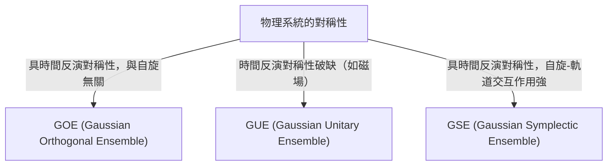

# 前言：隨機矩陣理論令人驚嘆的普適性

世界看似複雜且不可預測，但透過數學的鏡頭，我們有時能在完全不同的領域中發現令人驚嘆的共通點。「隨機矩陣理論（Random Matrix Theory, RMT）」正是這樣一個具有普適性的數學框架。

隨機矩陣是指元素由隨機變數組成的矩陣。乍看之下，這不過是數字的隨機排列，但當矩陣的大小趨近於無限大時，其[特徵值](/zh-tw/p/eigenvalues-and-eigenvectors/)的分布會展現出令人驚豔的美麗且普適的法則。這項法則潛藏在完全不同的系統背後：從微觀的原子核世界、質數分布之謎、金融市場的價格波動，一直到最先進的深度學習模型的學習動態。

本文將從隨機矩陣理論的歷史背景出發，解說其數學基礎的 GOE/GUE/GSE 等系綜（Ensemble）分類、維格納半圓律的數學證明，乃至於其與黎曼猜想中黎曼 Zeta 函數意想不到的連結。在後半部分，我們將深入探討其在現代的應用，如金融工程中的投資組合最佳化，以及人工智慧與深度學習中的權重初始化問題，並結合 Python 程式碼的實際視覺化進行說明。

---

# 1. 誕生於物理學：維格納與重原子核之謎

隨機矩陣理論的根源可以追溯至 1950 年代的原子核物理學。當時的物理學家正苦於理解如鈾這類重原子核的能階（量子力學狀態可能具有的能量值）。

## 鈾原子核的能階

對於輕原子核，只要根據薛丁格方程式計算質子和中子的交互作用，就能準確預測能階。然而，在像鈾（如質量數 238）這樣由大量核子產生複雜交互作用的重原子核中，自由度過高使得嚴密的計算幾乎是不可能的。

從實驗觀測到的中子散射數據來看，共振的能階似乎是無序排列的。然而，當研究能階「間距（spacing）」的統計分布時，卻發現其中存在著明確的模式。相鄰的能階絕不會靠得太近，這被稱為「能階排斥（level repulsion）」現象。

## 維格納的直覺與半圓律的發現

1955 年，尤金·維格納（Eugene Wigner）提出了一個大膽的想法：不將這個複雜量子系統的哈密頓量（代表能量的矩陣）視為具有詳細物理結構的特定矩陣，而是將其建模為「元素取隨機值的巨大對稱矩陣」。

令人驚訝的是，這個極度簡化的隨機矩陣的[特徵值](/zh-tw/p/eigenvalues-and-eigenvectors/)間距分布，竟然與實際鈾原子核的能階間距分布完美吻合。維格納進一步發現，在矩陣大小 $N$ 趨向無限大的極限下，[特徵值](/zh-tw/p/eigenvalues-and-eigenvectors/)的整體密度分布會呈現半圓形。這就是著名的「維格納半圓律（Wigner's semicircle law）」。

---

# 2. 系綜的分類：GOE、GUE、GSE

繼維格納的研究之後，弗里曼·戴森（Freeman Dyson）將隨機矩陣理論體系化，並根據物理系統所具有的對稱性，將隨機矩陣分為三個普適的類別（系綜）。這被稱為「戴森的三重道（Dyson's threefold way）」。



## 高斯正交系綜 (GOE)

GOE 是由元素為實數的實對稱矩陣組成的集合。每個非對角元素皆獨立地從平均值為 0、變異數為 1 的常態分布中選取，而對角元素則從平均值為 0、變異數為 2 的常態分布中選取。GOE 用於對沒有外部磁場且保持時間反演對稱性的量子系統（例如，不具自旋的粒子系統）的哈密頓量進行建模。

## 高斯酉系綜 (GUE)

GUE 是由元素為複數的埃爾米特矩陣（Hermitian matrix）組成的集合。非對角元素的實部和虛部分別服從獨立的常態分布。它適用於存在外部磁場等導致時間反演對稱性破缺的物理系統。後文將提到，與黎曼 Zeta 函數零點分布有著深刻關聯的正是 GUE。

## 高斯辛系綜 (GSE)

GSE 是由元素為四元數（Quaternion）的自對偶埃爾米特矩陣組成的集合。它描述的是時間反演對稱性得以保持，但由自旋為半整數的粒子組成，且自旋軌道交互作用強烈的系統。

---

# 3. 數學深淵：維格納半圓律的證明

我們將概觀使用動差法（Method of Moments）證明隨機矩陣理論中最基本結果——維格納半圓律的過程。

考慮一個 $N \times N$ 的實對稱矩陣 $X$，其元素 $X_{ij}$ 是互相獨立、平均值為 0、變異數為 1 的隨機變數。我們要求解經過縮放的矩陣 $W = \frac{1}{\sqrt{N}}X$ 的[特徵值](/zh-tw/p/eigenvalues-and-eigenvectors/)分布極限（$N \to \infty$）。

## 動差法的方法

為了解析[特徵值](/zh-tw/p/eigenvalues-and-eigenvectors/)的經驗分布函數，我們計算分布的第 $k$ 階動差 $m_k$。由於矩陣的跡（Trace，對角元素之和）等於[特徵值](/zh-tw/p/eigenvalues-and-eigenvectors/)之和，我們評估：
$$ m_k = \lim_{N \to \infty} \frac{1}{N} \mathbb{E}[\text{Tr}(W^k)] $$

將跡展開後，得到：
$$ \text{Tr}(W^k) = \frac{1}{N^{k/2}} \sum_{i_1, i_2, \dots, i_k} X_{i_1 i_2} X_{i_2 i_3} \cdots X_{i_k i_1} $$
在取期望值時，因為元素 $X_{ij}$ 的平均值為 0 且獨立，所以在展開的項中，如果相同元素只出現 1 次，其期望值將為 0。為了擁有不為零的貢獻，路徑 $i_1 \to i_2 \to \dots \to i_k \to i_1$ 上的每條邊都必須至少被走過 2 次。

在 $N \to \infty$ 的極限下，主要的貢獻來自恰好 $k$ 步的路徑中，一邊探索新頂點，一邊將走過的邊精確地回溯 1 次的「樹狀（tree）」結構路徑。這種情況只有在 $k$ 為偶數（$k = 2m$）時才可能發生，奇數階動差在極限下為 0。

## 卡塔蘭數與半圓律的關聯

長度為 $2m$ 的這種路徑（戴克路徑，Dyck path）的總數，由組合數學中著名的「[卡塔蘭數](/zh-tw/p/catalan-numbers/)（Catalan numbers）」$C_m$ 給出：
$$ C_m = \frac{1}{m+1} \binom{2m}{m} $$

因此，極限分布的動差為：
$$ m_{2m} = C_m, \quad m_{2m+1} = 0 $$
我們已知具有這種動差的機率分布，是在區間 $[-2, 2]$ 上有支撐的半圓分布（維格納半圓律）。其機率密度函數如下：
$$ \rho(x) = \begin{cases} \frac{1}{2\pi} \sqrt{4 - x^2} & (-2 \le x \le 2) \\ 0 & (\text{otherwise}) \end{cases} $$

---

# 4. 與黎曼 Zeta 函數的意外邂逅

為了解決物理學問題而誕生的隨機矩陣理論，在 1970 年代的純數學領域，特別是數論領域，帶來了世紀性的大發現。

## 蒙哥馬利-奧德里茲科猜想

1972 年，數論學家休·蒙哥馬利（Hugh Montgomery）正在研究黎曼 Zeta 函數非平凡零點的間距分布。根據黎曼猜想，這些零點都存在於複數平面上的「臨界線（實部為 1/2 的直線）」上。蒙哥馬利計算了零點對的相關函數，推導出其結果為 $1 - \left(\frac{\sin(\pi x)}{\pi x}\right)^2$。

某天，在普林斯頓高等研究院的下午茶時間，蒙哥馬利將這個結果告訴了物理學家弗里曼·戴森。戴森感到震驚，因為那個數學式與戴森自己推導出的 GUE（高斯酉系綜）[特徵值](/zh-tw/p/eigenvalues-and-eigenvectors/)間距分布完全一模一樣。

## 質數與量子混沌的交會點

隨後，數學家安德魯·奧德里茲科（Andrew Odlyzko）利用超級電腦計算了數百萬個 Zeta 函數的零點，證實其間距分布與 GUE 的預測以驚人的精確度吻合。

這項發現被稱為「蒙哥馬利-奧德里茲科猜想」，暗示了質數分布（Zeta 函數的零點與質數分布密切相關）與量子混沌系統（GUE）之間存在著深刻且普適的連結。這是描述宇宙微觀法則的數學，與支配作為數字基本構成要素的質數的數學，透過隨機矩陣這個交點相會的瞬間。

---

# 5. 在金融工程的應用：投資組合最佳化的進化

隨機矩陣理論不僅停留在物理學和純數學，也作為強大的工具應用於金融市場的分析。特別是在資產管理的最佳化中扮演著重要角色。

## 馬可維茲模型的侷限性

在現代投資組合理論的基礎，即哈利·馬可維茲（Harry Markowitz）的均值-變異數模型中，是利用資產共變異數矩陣的反矩陣來決定最佳的投資比例。然而，在實務操作上卻存在重大問題。

當從 $N$ 個資產過去 $T$ 期間的報酬率數據中估計樣本共變異數矩陣時，如果 $N$ 很大且 $T$ 不夠大（不能說 $N/T$ 趨近於 0），樣本共變異數矩陣就會包含大量的統計雜訊。如果對這個包含雜訊的矩陣計算反矩陣，誤差將會被放大，從而產生不切實際且極端的投資組合（例如指示對某些資產進行極端的做空或做多）。

## 隨機矩陣消除雜訊

這時隨機矩陣理論便派上用場了。1999 年，Bouchaud 等人與 Laloux 等人各自獨立地將隨機矩陣理論應用於金融市場的共變異數矩陣。他們比較了從完全隨機的時間序列數據中得到的共變異數矩陣[特徵值](/zh-tw/p/eigenvalues-and-eigenvectors/)分布（Marchenko-Pastur 分布），以及實際市場數據共變異數矩陣的[特徵值](/zh-tw/p/eigenvalues-and-eigenvectors/)分布。

結果發現，市場數據絕大部分（90% 以上）的[特徵值](/zh-tw/p/eigenvalues-and-eigenvectors/)，都落在隨機矩陣理論所預測的理論邊界內。換句話說，這些都只是單純的「雜訊」。另一方面，只有少數遠遠超出邊界的大[特徵值](/zh-tw/p/eigenvalues-and-eigenvectors/)，才具有反映市場真正相關性結構（市場因子或板塊因子）的有意義資訊。

基於這項發現，人們開發出了過濾對應於雜訊的[特徵值](/zh-tw/p/eigenvalues-and-eigenvectors/)（例如將其歸零，或用平均值取代），以「清理（cleaning）」共變異數矩陣的方法。這使得投資組合的績效與穩定性得到戲劇性的提升，目前已被許多量化基金作為標準技術使用。

---

# 6. 在人工智慧的應用：深度學習中的權重與學習動態

近年來，隨機矩陣理論在 AI 與機器學習，特別是深度學習（Deep Learning）的理論分析上也備受矚目。

## 神經網路的初始化問題

在訓練巨大的神經網路時，如何設定網路權重矩陣的初始值，是決定訓練成敗的關鍵問題。如果初始化不當，就會發生梯度消失（Gradient Vanishing）或梯度爆炸（Gradient Exploding），導致學習無法進行。

當我們用隨機值來初始化權重矩陣時，這正是一個隨機矩陣。透過運用隨機矩陣理論，我們可以嚴密地解析訊號通過每一層後變異數的變化，以及反向傳播中梯度的行為。例如，透過分析非線性激勵函數對隨機矩陣頻譜（[特徵值](/zh-tw/p/eigenvalues-and-eigenvectors/)分布）的影響，為 Xavier 初始化和 He 初始化等現代標準初始化方法的理論正確性提供了佐證。

## 海森矩陣（Hessian）的特徵值分布

為了理解學習過程的動態，解析代表損失函數曲率的海森矩陣是不可或缺的。擁有數千萬到數千億參數的[大型語言模型](/zh-tw/p/large-language-models-llm-transformer-prompt-engineering/)（[LLM](/zh-tw/p/large-language-models-llm-transformer-prompt-engineering/)），其海森矩陣是一個巨大的矩陣，難以直接探究其性質，但利用隨機矩陣理論，我們可以近似並預測其[特徵值](/zh-tw/p/eigenvalues-and-eigenvectors/)分布。

研究表明，深度神經網路的海森矩陣[特徵值](/zh-tw/p/eigenvalues-and-eigenvectors/)分布，是由主體積聚（大量接近零的[特徵值](/zh-tw/p/eigenvalues-and-eigenvectors/)）和少數巨大的離群值（Outliers）所組成。主體部分可以建模為包含雜訊的隨機矩陣（例如資訊量少的方向），而離群值則代表了與任務直接相關的重要學習方向。了解這種頻譜結構，對於改善最佳化演算法（如 SGD、Adam）的收斂性，以及最佳化學習率排程，提供了極為有益的見解。

---

# 7. 實踐：使用 Python 進行特徵值分布的視覺化

最後，讓我們使用 Python 實際生成 GOE（高斯正交系綜），並以數值方式確認維格納半圓律的成立。

```python
import numpy as np
import matplotlib.pyplot as plt
from scipy.stats import semicircular

# 參數設定
N = 1000  # 矩陣大小
num_matrices = 50  # 系綜的樣本數

eigenvalues = []

# 生成 GOE 矩陣並計算特徵值
for _ in range(num_matrices):
    # 生成元素服從 N(0, 1) 的 N x N 矩陣
    X = np.random.randn(N, N)
    # 對稱化以建立 GOE 矩陣 (注意變異數的縮放)
    A = (X + X.T) / np.sqrt(2)
    # 將變異數縮放為 1/N
    W = A / np.sqrt(N)
    
    # 計算特徵值（因為是實對稱矩陣，使用 eigh）
    eigvals = np.linalg.eigh(W)[0]
    eigenvalues.extend(eigvals)

# 繪圖設定
plt.figure(figsize=(10, 6))

# 繪製特徵值的直方圖
plt.hist(eigenvalues, bins=100, density=True, alpha=0.6, color='skyblue', edgecolor='black', label='Empirical Eigenvalues (GOE)')

# 繪製理論上的維格納半圓律
x = np.linspace(-2.2, 2.2, 1000)
# 半徑 R=2 的半圓律機率密度函數
y = np.where(np.abs(x) <= 2, np.sqrt(4 - x**2) / (2 * np.pi), 0)
plt.plot(x, y, 'r-', lw=3, label="Wigner's Semicircle Law")

plt.title(f"Eigenvalue Distribution of GOE Matrices ($N={N}$)", fontsize=16)
plt.xlabel("Eigenvalue", fontsize=14)
plt.ylabel("Density", fontsize=14)
plt.legend(fontsize=12)
plt.grid(True, alpha=0.3)
plt.tight_layout()
plt.show()
```

執行這段程式碼後，我們可以確認隨機生成的矩陣[特徵值](/zh-tw/p/eigenvalues-and-eigenvectors/)，呈現出美麗的半圓形分布。儘管個別矩陣的元素完全是隨機的，但整體卻展現出如此規律的法則，這正是隨機矩陣理論最大的魅力所在。

---

# 結語

本文中，我們追溯了隨機矩陣理論從原子核物理學起步，一路連結到純數學、金融工程，乃至現代 AI 技術的宏大發展歷程。這些看似毫無關聯的複雜系統，在極限狀態下竟然能以「隨機矩陣的[特徵值](/zh-tw/p/eigenvalues-and-eigenvectors/)」這種共同語言進行交流，這個事實展現了自然界與數學所蘊含的神秘深邃。

在數據呈現爆炸性增長、模型不斷巨大化的現代，隨機矩陣理論已經從單純的抽象數學研究對象，演化為解決數據科學與機器學習實務問題的強大武器。這門探索潛藏於複雜系統背後普適真理的理論，未來也必將成為我們在各個領域加深理解的一道光芒。
