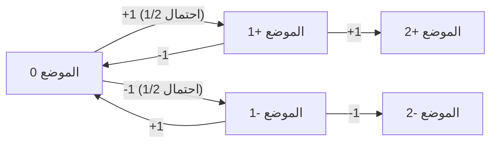
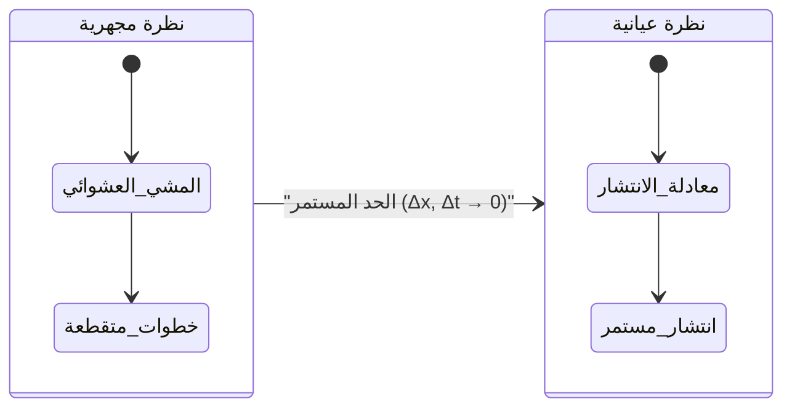
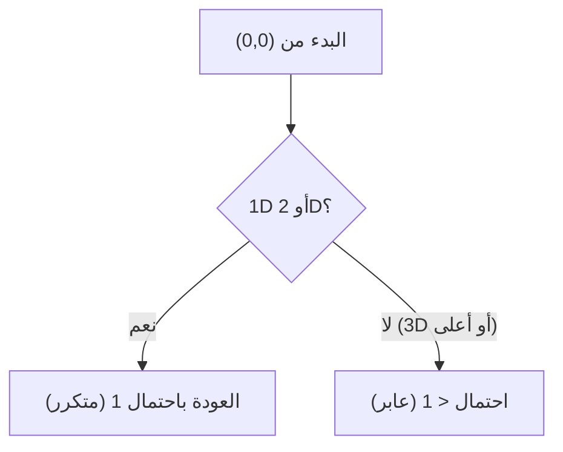

# مقدمة

[المشي العشوائي](https://kenji.blog/ar/p/random-walk/) هو مفهوم رياضي يتم فيه تحديد الموضع التالي بشكل عشوائي (احتمالي). غالبًا ما يُطلق عليه "مشية السكران".

## الصيغة (1D)

لنفترض أن الجسيم يقع عند نقطة الأصل $x = 0$. يتحرك إلى اليمين $+1$ أو إلى اليسار $-1$ باحتمال متساوٍ:

$$
X_i = \begin{cases} 
+1 & (\text{احتمال } 1/2) \\ 
-1 & (\text{احتمال } 1/2) 
\end{cases}
$$

الموضع بعد $n$ خطوات هو:

$$
S_n = X_1 + X_2 + \dots + X_n = \sum_{i=1}^n X_i
$$



## القيمة المتوقعة والتباين

القيمة المتوقعة هي $0$، لكن التباين هو $n$.

## معادلة الانتشار

عند الحد المستمر، يصبح [المشي العشوائي](https://kenji.blog/ar/p/random-walk/) **معادلة الانتشار**:

$$
\frac{\partial P}{\partial t} = D \frac{\partial^2 P}{\partial x^2}
$$



## الحركة البراونية ونظرية بوليا

تنص **نظرية بوليا** على أنه بالنسبة للأبعاد 1D و 2D، فإن احتمال العودة إلى نقطة الأصل هو 100%، ولكن بالنسبة للأبعاد 3D أو أعلى، فهو أقل من 1.



## المحاكاة باستخدام بايثون

```python
import numpy as np
import matplotlib.pyplot as plt

def simulate_random_walk_2d(steps):
    """
    محاكاة المشي العشوائي ثنائي الأبعاد
    """
    directions = np.array([[1, 0], [-1, 0], [0, 1], [0, -1]])
    random_steps = np.random.randint(0, 4, size=steps)
    movements = directions[random_steps]
    path = np.vstack([[0, 0], np.cumsum(movements, axis=0)])
    return path

steps = 50000
path = simulate_random_walk_2d(steps)

plt.figure(figsize=(10, 10))
plt.plot(path[:, 0], path[:, 1], alpha=0.6, color='royalblue', linewidth=0.5)
plt.scatter(0, 0, color='red', marker='x', s=150, label='البداية', zorder=5)
plt.scatter(path[-1, 0], path[-1, 1], color='darkorange', marker='o', s=100, label='النهاية', zorder=5)

plt.title(f"2D Random Walk ({steps} steps)", fontsize=16)
plt.xlabel("محور X", fontsize=12)
plt.ylabel("محور Y", fontsize=12)
plt.legend(fontsize=12)
plt.grid(True, linestyle='--', alpha=0.7)
plt.axis('equal')
plt.show()
```
