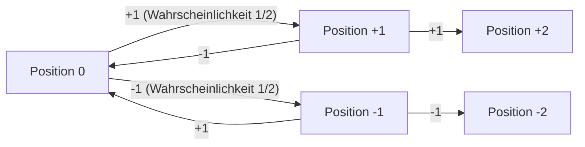
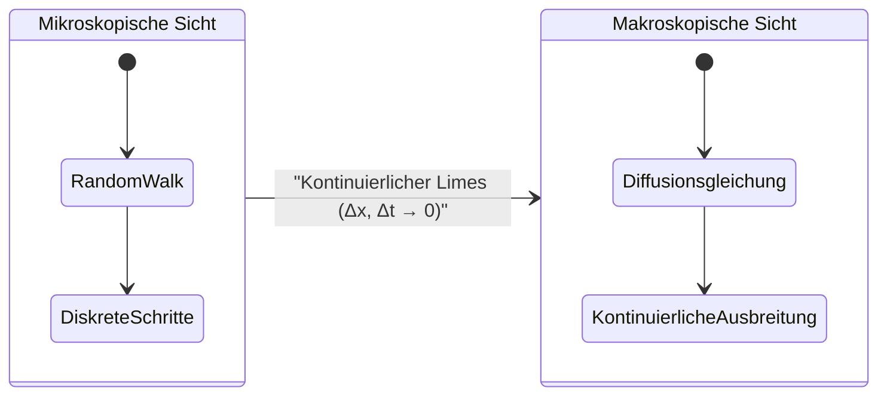
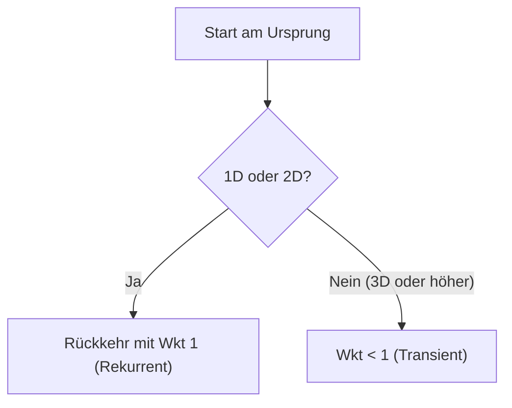

# Einführung: Was ist ein [Random Walk](https://kenji.blog/de/p/random-walk/)?

Ein [Random Walk](https://kenji.blog/de/p/random-walk/) (Irrfahrt) ist ein mathematisches Konzept, bei dem die nächste Position zufällig (probabilistisch) bestimmt wird. Er wird oft als "Trunkenbold-Spaziergang" bezeichnet, da er einer betrunkenen Person ähnelt, die mit unsicheren Schritten nach links und rechts taumelt. Auf den ersten Blick scheint es eine chaotische Bewegung zu sein, doch bei vielen Schritten entstehen erstaunlich schöne und regelmäßige mathematische Gesetze.

In diesem Artikel beginnen wir mit den Grundlagen des einfachsten eindimensionalen [Random Walk](https://kenji.blog/de/p/random-walk/)s und untersuchen die Verbindung zur Diffusionsgleichung und der Brownschen Bewegung. Auch Pólyas Satz und Finanzanwendungen werden beleuchtet.

## Historischer Hintergrund: Karl Pearsons Frage

Der Begriff wurde erstmals 1905 von Karl Pearson in der Zeitschrift *Nature* verwendet. Er fragte nach der Wahrscheinlichkeit des Abstands vom Ursprung nach $n$ zufälligen Schritten. Lord Rayleigh zeigte, dass mathematische Formeln aus der Akustik anwendbar sind, was den Startschuss für die Theorie gab.

## Strenge mathematische Formulierung (1D)

### Definition der Wahrscheinlichkeit

Ein Teilchen starte bei $x = 0$. In jedem Zeitschritt geht es mit Wahrscheinlichkeit $p$ um $+1$ nach rechts, und mit $q = 1-p$ um $-1$ nach links. Wir betrachten den symmetrischen Fall $p = q = 1/2$.

Sei $X_i$ die Verschiebung im $i$-ten Schritt:

$$
X_i = \begin{cases} 
+1 & (\text{Wahrscheinlichkeit } 1/2) \\ 
-1 & (\text{Wahrscheinlichkeit } 1/2) 
\end{cases}
$$

Die Position nach $n$ Schritten ist $S_n = \sum_{i=1}^n X_i$.



### Binomialverteilung

Die Wahrscheinlichkeit $P(S_n = m)$ für Position $m$ nach $n$ Schritten ist:

$$
P(S_n = m) = \binom{n}{\frac{n+m}{2}} \left( \frac{1}{2} \right)^n
$$

## Erwartungswert und Varianz

$$
E[X_i] = 0, \quad V(X_i) = 1
$$
$$
E[S_n] = 0, \quad V(S_n) = n
$$

Im Durchschnitt bleibt man bei 0, aber die Streuung ist $\sqrt{n}$. Das ist das Hauptmerkmal des [Random Walk](https://kenji.blog/de/p/random-walk/)s.

## [Zentraler Grenzwertsatz](https://kenji.blog/de/p/central-limit-theorem/)

Für große $n$ konvergiert die Binomialverteilung gegen die **Normalverteilung** (Gauß-Verteilung).

$$
f(x, n) \approx \frac{1}{\sqrt{2\pi n}} \exp\left( - \frac{x^2}{2n} \right)
$$

## Ableitung der Diffusionsgleichung

Im kontinuierlichen Grenzwert ($\Delta x \to 0, \Delta t \to 0$) ergibt sich die **Diffusionsgleichung** (Wärmeleitungsgleichung):

$$
\frac{\partial P}{\partial t} = D \frac{\partial^2 P}{\partial x^2}
$$



## Brownsche Bewegung und Wiener-Prozess

Albert Einstein erklärte 1905 die Brownsche Bewegung der Pollen als [Random Walk](https://kenji.blog/de/p/random-walk/). Mathematisch ist dies der **Wiener-Prozess** $W(t)$. Die Pfade sind überall stetig, aber **nirgends differenzierbar**.

## Pólyas Rekurrenzsatz

- **1D und 2D**: Rückkehrwahrscheinlichkeit zum Ursprung ist $1$ (100%).
- **3D oder höher**: Wahrscheinlichkeit $< 1$. Man kann sich "verirren".

> "A drunk man will find his way home, but a drunk bird may get lost forever."



## Anwendung in der Finanzmathematik

Aktienkurse werden als **Geometrische Brownsche Bewegung** modelliert:

$$
dS_t = \mu S_t dt + \sigma S_t dW_t
$$

Dies ist die Grundlage der **Black-Scholes-Gleichung**.

## Python Simulation

```python
import numpy as np
import matplotlib.pyplot as plt

def simulate_random_walk_2d(steps):
    """
    Funktion zur Simulation eines 2D Random Walks
    """
    directions = np.array([[1, 0], [-1, 0], [0, 1], [0, -1]])
    random_steps = np.random.randint(0, 4, size=steps)
    movements = directions[random_steps]
    path = np.vstack([[0, 0], np.cumsum(movements, axis=0)])
    return path

steps = 50000
path = simulate_random_walk_2d(steps)

plt.figure(figsize=(10, 10))
plt.plot(path[:, 0], path[:, 1], alpha=0.6, color='royalblue', linewidth=0.5)
plt.scatter(0, 0, color='red', marker='x', s=150, label='Start', zorder=5)
plt.scatter(path[-1, 0], path[-1, 1], color='darkorange', marker='o', s=100, label='Ende', zorder=5)

plt.title(f"2D Random Walk ({steps} steps)", fontsize=16)
plt.xlabel("X-Achse", fontsize=12)
plt.ylabel("Y-Achse", fontsize=12)
plt.legend(fontsize=12)
plt.grid(True, linestyle='--', alpha=0.7)
plt.axis('equal')
plt.show()
```

## Fazit

Zufällige lokale Regeln erzeugen die komplexe makroskopische Welt. Das macht die Mathematik des [Random Walk](https://kenji.blog/de/p/random-walk/)s so faszinierend.
