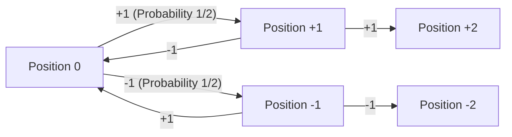
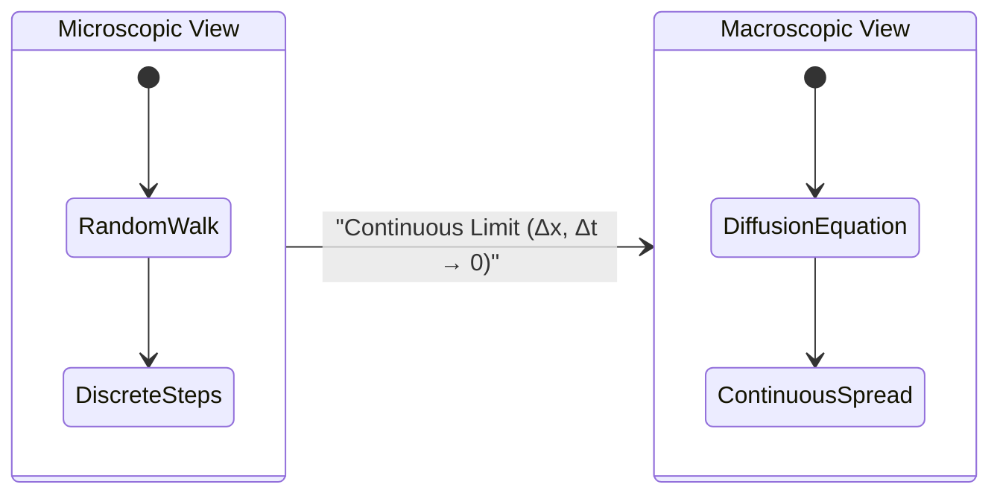
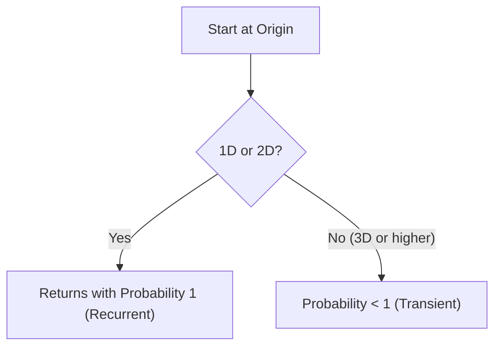

# Introduction: What is a [Random Walk](https://kenji.blog/en/p/random-walk/)?

A random walk is a mathematical concept referring to a motion where the next position is determined randomly (probabilistically). It is often referred to as the "drunkard's walk," as it resembles a drunk person staggering left and right with unsteady steps. At first glance, it appears to be a chaotic and unpredictable movement, but as the number of steps increases, surprisingly beautiful and regular mathematical laws emerge.

In this article, we will start from the basics of the simplest one-dimensional random walk, and explore how it connects to diffusion phenomena and Brownian motion in physics. We will also dive deep into the fascinating properties of random walks in higher-dimensional spaces, using mathematical formulas. Understanding random walks has become essential knowledge in various modern fields, not just in physics and mathematics, but also in financial engineering and computer science.

## Historical Background: Karl Pearson's Question

The term "random walk" was first used academically in a short question submitted to the science journal *Nature* in 1905 by the British mathematical statistician Karl Pearson. He posed the following problem:

> "A man starts from a point $O$ and walks $l$ yards in a straight line; he then turns through any angle whatever and walks another $l$ yards in a second straight line. He repeats this process $n$ times. I require the probability that after these $n$ stretches he is at a distance between $r$ and $r + dr$ from his starting point, $O$."

In response to this question, Lord Rayleigh pointed out that the mathematical formulas from his own research on acoustics regarding the "superposition of multiple sound waves" could be applied directly. This became the catalyst for the widespread recognition of random walk theory.

## Strict Mathematical Formulation of the 1D [Random Walk](https://kenji.blog/en/p/random-walk/)

### Definition of Probabilistic Movement

Let's consider the simplest one-dimensional random walk. Suppose a particle located at the origin $x = 0$ on a number line moves to the right by $+1$ with probability $p$, and to the left by $-1$ with probability $q = 1 - p$ at each unit of time. Here, we simply deal with a symmetric random walk where $p = q = 1/2$.

Let the amount of movement at the $i$-th step be the random variable $X_i$, then $X_i$ takes the following values:

$$
X_i = \begin{cases} 
+1 & (\text{with probability } 1/2) \\ 
-1 & (\text{with probability } 1/2) 
\end{cases}
$$

The position $S_n$ of the particle after $n$ steps is expressed as the sum of the movements at each step:

$$
S_n = X_1 + X_2 + \dots + X_n = \sum_{i=1}^n X_i
$$



### Arrival Probability and the Binomial Distribution

Suppose that out of $n$ steps, the particle moves $k$ steps to the right and $n - k$ steps to the left. The position $S_n$ at this time is:

$$
S_n = k \times (+1) + (n - k) \times (-1) = 2k - n
$$

For the position to be $m$, since $m = 2k - n$, the particle must move to the right exactly $k = (n + m) / 2$ times. Therefore, the probability $P(S_n = m)$ of reaching position $m$ is expressed using the binomial distribution as follows:

$$
P(S_n = m) = \binom{n}{\frac{n+m}{2}} \left( \frac{1}{2} \right)^n
$$

Note that if the parity (odd/even) of $n$ and $m$ does not match, this probability is $0$.

## Calculation of Expected Value and Variance: The Spread of the Wander

Next, let's examine the statistical properties of the position $S_n$. First, we find the expected value $E[X_i]$ and the variance $V(X_i)$ of $X_i$.

$$
E[X_i] = (+1) \times \frac{1}{2} + (-1) \times \frac{1}{2} = 0
$$

$$
V(X_i) = E[X_i^2] - (E[X_i])^2 = (1)^2 \times \frac{1}{2} + (-1)^2 \times \frac{1}{2} - 0 = 1
$$

Since the movement $X_i$ at each step is independent of each other, the expected value and variance of the position $S_n$ at the $n$-th step are as follows:

$$
E[S_n] = \sum_{i=1}^n E[X_i] = 0
$$

$$
V(S_n) = \sum_{i=1}^n V(X_i) = n
$$

This result is extremely important. An expected value of $0$ means that **on average, the particle remains at the origin**. However, because the variance increases proportionally to $n$, the standard deviation (a measure of dispersion) becomes $\sqrt{n}$. In other words, as the number of steps $n$ increases, the existence range of the particle gradually expands on the order of $\sqrt{n}$. The inefficiency where time advances by $n$ but the movement distance only advances by $\sqrt{n}$ is the most significant characteristic of a random walk.

## Stirling's Approximation and the [Central Limit Theorem](https://kenji.blog/en/p/central-limit-theorem/): Convergence to the Gaussian Distribution

When the number of steps $n$ is very large, calculating the binomial distribution becomes difficult. Here, if we evaluate the binomial coefficient using Stirling's approximation for factorials $n! \approx \sqrt{2\pi n} (n/e)^n$, the discrete probability distribution converges to a continuous **normal distribution** (Gaussian distribution).

Considering position $x$ as a continuous variable and the variance as $n$, the probability density function $f(x, n)$ asymptotically approaches the following form:

$$
f(x, n) \approx \frac{1}{\sqrt{2\pi n}} \exp\left( - \frac{x^2}{2n} \right)
$$

This is precisely a direct manifestation of the [Central Limit Theorem](https://kenji.blog/en/p/central-limit-theorem/), which states that the sum of independent and identically distributed random variables converges to a normal distribution.

## Derivation of the Diffusion Equation (Heat Equation): From Discrete to Continuous

While a random walk is a model describing the movement of microscopic particles, when viewed from a macroscopic continuous limit, it can be understood as the **diffusion equation**.

We divide space into microscopic intervals $\Delta x$ and time into microscopic intervals $\Delta t$. Let the probability of a particle existing at position $x$ and time $t$ be $P(x, t)$.
The probability that the particle is at position $x$ at time $t + \Delta t$ is the sum of the probabilities that it moved there from position $x - \Delta x$ or $x + \Delta x$ at time $t$.

$$
P(x, t + \Delta t) = \frac{1}{2} P(x - \Delta x, t) + \frac{1}{2} P(x + \Delta x, t)
$$

Subtracting $P(x, t)$ from both sides of this equation, we transform it as follows:

$$
P(x, t + \Delta t) - P(x, t) = \frac{1}{2} \left[ P(x - \Delta x, t) - 2P(x, t) + P(x + \Delta x, t) \right]
$$

Dividing both sides by $\Delta t$ and multiplying the right side by $(\Delta x)^2 / (\Delta x)^2$:

$$
\frac{P(x, t + \Delta t) - P(x, t)}{\Delta t} = \frac{(\Delta x)^2}{2 \Delta t} \frac{P(x - \Delta x, t) - 2P(x, t) + P(x + \Delta x, t)}{(\Delta x)^2}
$$

Now we take the limits as $\Delta x \to 0$ and $\Delta t \to 0$. Assuming that in the limit $D = \lim \frac{(\Delta x)^2}{2 \Delta t}$ becomes a finite constant (the diffusion coefficient), the left side becomes a time derivative and the right side becomes a second-order spatial derivative, yielding the following partial differential equation:

$$
\frac{\partial P}{\partial t} = D \frac{\partial^2 P}{\partial x^2}
$$

This is the **diffusion equation**, and it has the exact same form as the heat conduction equation in physics. This is the moment it is mathematically proven that microscopic random movements express a macroscopic continuous spread (diffusion).



## Brownian Motion and the Wiener Process: Einstein's Achievement

The continuous version of a random walk is **Brownian Motion**.

In 1827, botanist Robert Brown discovered that microscopic particles ejected from pollen in water moved irregularly. This phenomenon, which remained a mystery for a long time, was mathematically explained by Albert Einstein in 1905 as a "random walk caused by water molecules randomly colliding with the particles." Using the diffusion equation, Einstein derived that the mean squared displacement of the particles is proportional to time $\langle x^2 \rangle = 2Dt$.

Mathematically, the rigorous formulation of Brownian motion is called the **Wiener Process** $W(t)$. It satisfies the following properties:

1. $W(0) = 0$
2. The increment $W(t) - W(s)$ follows a normal distribution $\mathcal{N}(0, t-s)$.
3. It has independent increments.
4. The trajectory is continuous with probability $1$, but is **nowhere differentiable**.

## Expansion to Higher Dimensions: Pólya's Recurrence Theorem

When we expand the space to 2 dimensions (a plane) or 3 dimensions (solid space), a very interesting theorem emerges. This is **Pólya's recurrence theorem**, proven by George Pólya in 1921.

When performing a random walk on an infinitely large lattice space, the probability of returning to the starting point (the origin) – the recurrence probability – differs depending on the dimensions.

- **1D and 2D**: The recurrence probability is $1$ (100%). Given infinite time, it will certainly return to the origin.
- **3D or higher**: The recurrence probability is less than $1$ (about $0.3405$ for 3D). There is a positive probability that it will never return to the origin.

There is a famous joke by Shizuo Kakutani regarding this:

> "A drunk man will find his way home, but a drunk bird may get lost forever."

A drunkard walking on the ground (2D) can eventually return to their starting point, but a bird flying in the sky (3D) might get lost because the space is too vast.



## Application to Financial Engineering: Geometric Brownian Motion and the Black-Scholes Equation

The theory of random walks is not limited to physics. Price fluctuations in financial markets are also considered to follow a random walk under the efficient-market hypothesis.

A stock price $S_t$ is modeled as a **Geometric Brownian Motion**, assuming a log-normal distribution so it doesn't take negative values:

$$
dS_t = \mu S_t dt + \sigma S_t dW_t
$$

Here, $\mu$ is the drift (expected return), $\sigma$ is the volatility (rate of price fluctuation), and $W_t$ is the Wiener process. Based on this model, the **Black-Scholes equation**, which derives the fair price of an option, was formulated, becoming the foundation of modern financial engineering.

## Simulation of a [Random Walk](https://kenji.blog/en/p/random-walk/) in Python

Understanding deepens not just through theory, but also by actually running a program and visualizing it. Let's perform a simulation of a 2D random walk using Python.

```python
import numpy as np
import matplotlib.pyplot as plt

def simulate_random_walk_2d(steps):
    """
    Function to simulate a 2-dimensional random walk
    """
    # Movement vectors for 4 directions (up, down, left, right)
    directions = np.array([[1, 0], [-1, 0], [0, 1], [0, -1]])
    
    # Randomly select indices from 0 to 3 at each step
    random_steps = np.random.randint(0, 4, size=steps)
    movements = directions[random_steps]
    
    # Calculate the trajectory by taking the cumulative sum (starting from origin [0,0])
    path = np.vstack([[0, 0], np.cumsum(movements, axis=0)])
    return path

# Simulation of 50000 steps
steps = 50000
path = simulate_random_walk_2d(steps)

# Plot settings
plt.figure(figsize=(10, 10))
plt.plot(path[:, 0], path[:, 1], alpha=0.6, color='royalblue', linewidth=0.5)
plt.scatter(0, 0, color='red', marker='x', s=150, label='Start', zorder=5)
plt.scatter(path[-1, 0], path[-1, 1], color='darkorange', marker='o', s=100, label='End', zorder=5)

plt.title(f"2D Random Walk ({steps} steps)", fontsize=16)
plt.xlabel("X axis", fontsize=12)
plt.ylabel("Y axis", fontsize=12)
plt.legend(fontsize=12)
plt.grid(True, linestyle='--', alpha=0.7)
plt.axis('equal')
plt.show()
```

When you run this code, it will draw a trajectory wandering aimlessly on a plane. Although locally completely random, you can observe a beautiful pattern with a fractal-like self-similar structure overall.

## Conclusion

In this article, we started from the simplest "drunkard's walk" and detailed the mathematical background surrounding random walks: convergence to the Gaussian distribution via the [Central Limit Theorem](https://kenji.blog/en/p/central-limit-theorem/), derivation of the diffusion equation, Einstein's explanation of Brownian motion, Pólya's theorem, and applications to financial engineering.

The fact that universal laws (differential equations and normal distributions) governing the macroscopic world naturally emerge from the repetition of extremely simple and chaotic rules is one of the most fascinating and inspiring aspects of mathematics and physics. The concept of the random walk will undoubtedly continue to be a powerful weapon for unraveling various unknown phenomena.
