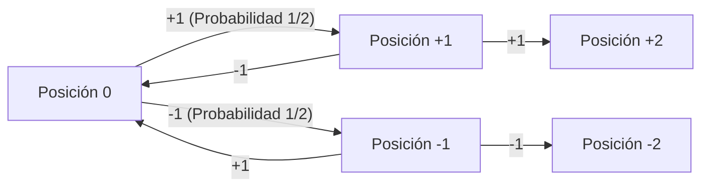
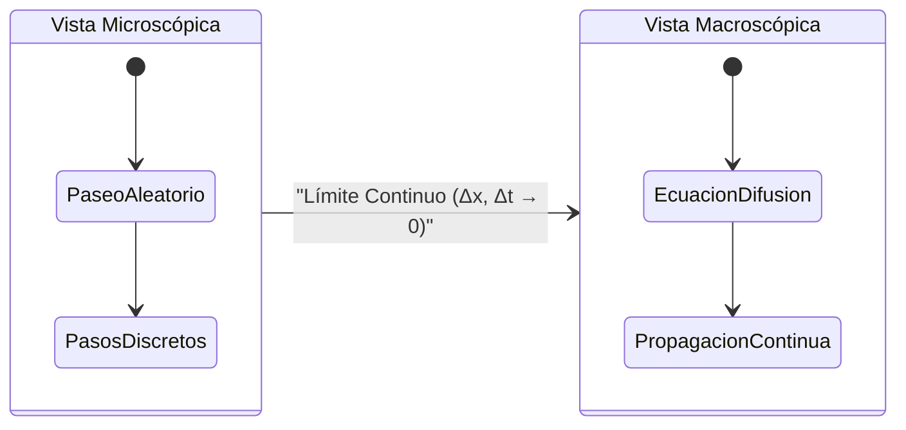
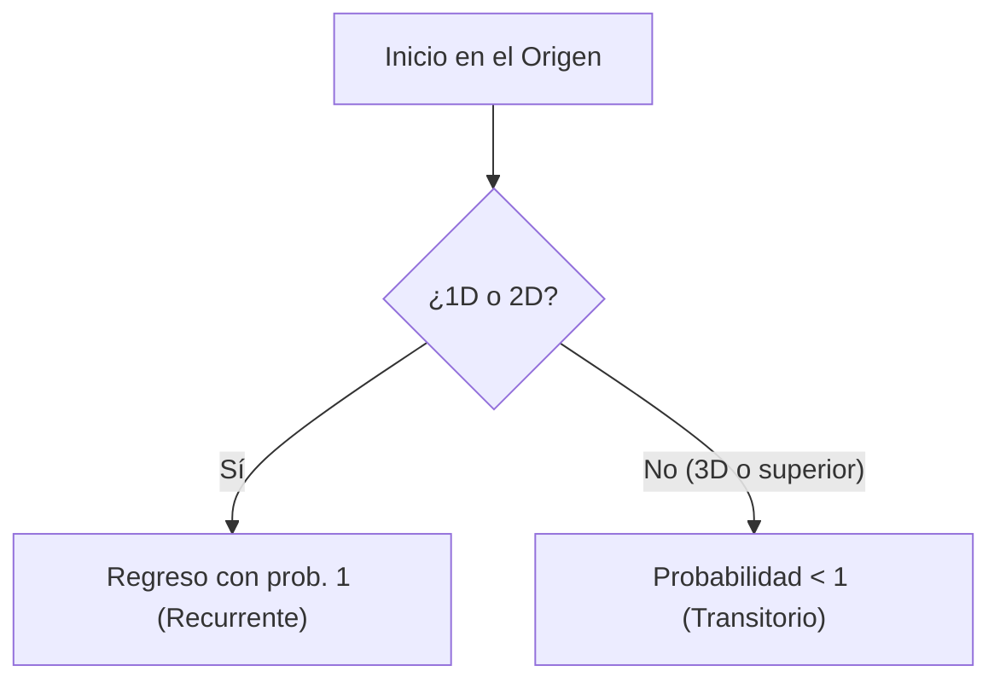

# Introducción: ¿Qué es un [Paseo Aleatorio](https://kenji.blog/es/p/random-walk/)?

Un paseo aleatorio (o camino aleatorio) es un concepto matemático que se refiere a un movimiento donde la siguiente posición se determina aleatoriamente (probabilísticamente). A menudo se le llama "el paseo del borracho", ya que se asemeja a una persona ebria tambaleándose de izquierda a derecha con pasos inestables. A primera vista, parece un movimiento caótico e impredecible, pero a medida que aumenta el número de pasos, emergen leyes matemáticas asombrosamente hermosas y regulares.

## Formulación Matemática Estricta (1D)

Supongamos que una partícula situada en el origen $x = 0$ se mueve a la derecha $+1$ con probabilidad $p = 1/2$ y a la izquierda $-1$ con probabilidad $q = 1/2$.
Sea $X_i$ la variable aleatoria para el movimiento en el paso $i$:

$$
X_i = \begin{cases} 
+1 & (\text{probabilidad } 1/2) \\ 
-1 & (\text{probabilidad } 1/2) 
\end{cases}
$$

La posición tras $n$ pasos es:

$$
S_n = X_1 + X_2 + \dots + X_n = \sum_{i=1}^n X_i
$$



## Valor Esperado y Varianza

$$
E[X_i] = 0, \quad V(X_i) = 1
$$
$$
E[S_n] = 0, \quad V(S_n) = n
$$

En promedio, la partícula permanece en el origen, pero su dispersión crece proporcional a $\sqrt{n}$.

## De Discreto a Continuo: Ecuación de Difusión

Tomando el límite continuo, el paseo aleatorio se aproxima por la **ecuación de difusión**:

$$
\frac{\partial P}{\partial t} = D \frac{\partial^2 P}{\partial x^2}
$$



## Movimiento Browniano y el Teorema de Pólya

El límite continuo es el **Proceso de Wiener**. Además, el **Teorema de recurrencia de Pólya** nos dice:
- **1D y 2D**: Regresa al origen con probabilidad 1.
- **3D o más**: Probabilidad menor a 1.

> "A drunk man will find his way home, but a drunk bird may get lost forever."



## Simulación en Python

```python
import numpy as np
import matplotlib.pyplot as plt

def simulate_random_walk_2d(steps):
    """
    Función para simular un paseo aleatorio en 2D
    """
    directions = np.array([[1, 0], [-1, 0], [0, 1], [0, -1]])
    random_steps = np.random.randint(0, 4, size=steps)
    movements = directions[random_steps]
    path = np.vstack([[0, 0], np.cumsum(movements, axis=0)])
    return path

steps = 50000
path = simulate_random_walk_2d(steps)

plt.figure(figsize=(10, 10))
plt.plot(path[:, 0], path[:, 1], alpha=0.6, color='royalblue', linewidth=0.5)
plt.scatter(0, 0, color='red', marker='x', s=150, label='Inicio', zorder=5)
plt.scatter(path[-1, 0], path[-1, 1], color='darkorange', marker='o', s=100, label='Fin', zorder=5)

plt.title(f"2D Random Walk ({steps} steps)", fontsize=16)
plt.xlabel("Eje X", fontsize=12)
plt.ylabel("Eje Y", fontsize=12)
plt.legend(fontsize=12)
plt.grid(True, linestyle='--', alpha=0.7)
plt.axis('equal')
plt.show()
```

Estas reglas simples subyacen desde la física hasta los mercados financieros con la **ecuación de Black-Scholes**.
