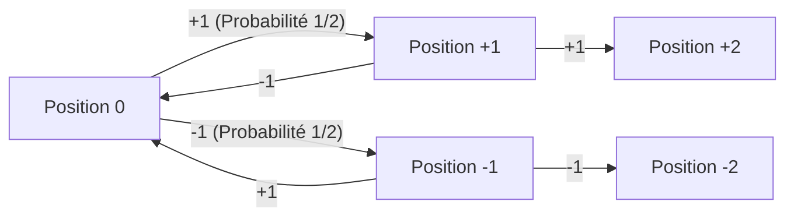
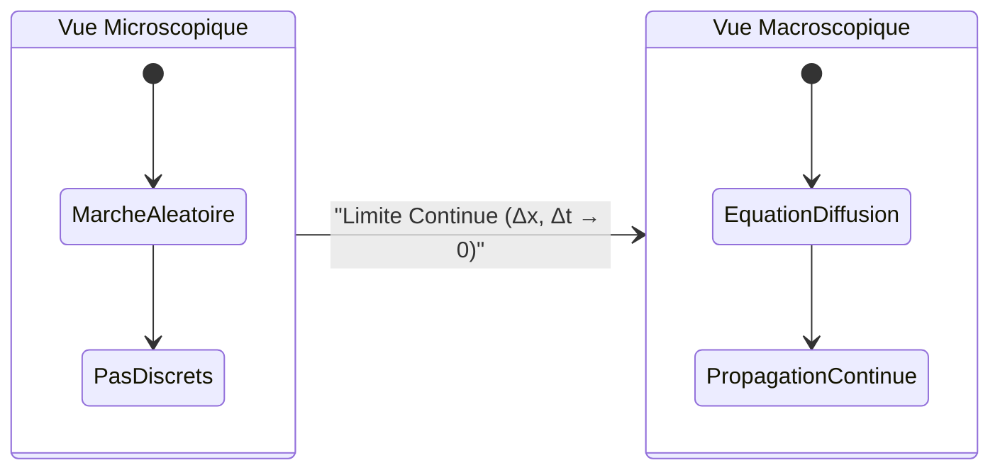
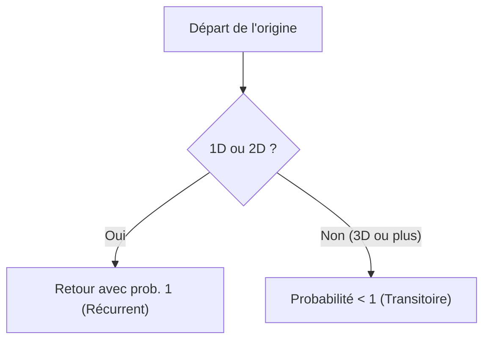

# Introduction : Qu'est-ce que la [Marche Aléatoire](https://kenji.blog/fr/p/random-walk/) ?

La marche aléatoire est un concept mathématique qui décrit un mouvement où la position suivante est déterminée de manière aléatoire (probabiliste). Elle est souvent appelée "la marche de l'ivrogne", car elle ressemble à une personne ivre titubant de gauche à droite avec des pas incertains. À première vue, il s'agit d'un mouvement chaotique et imprévisible, mais à mesure que le nombre de pas augmente, des lois mathématiques étonnamment belles et régulières émergent.

Dans cet article, nous partirons des bases de la marche aléatoire unidimensionnelle la plus simple, et explorerons comment elle se connecte aux phénomènes de diffusion et au mouvement brownien en physique. Nous approfondirons également les propriétés fascinantes des marches aléatoires dans des espaces multidimensionnels. La compréhension de la marche aléatoire est devenue une connaissance essentielle dans divers domaines modernes tels que l'ingénierie financière et l'informatique.

## Contexte Historique : La Question de Karl Pearson

Le terme "marche aléatoire" a été utilisé académiquement pour la première fois en 1905 dans une courte question soumise à la revue scientifique *Nature* par le statisticien mathématique britannique Karl Pearson. Il posait le problème suivant :

> "Un homme part d'une origine $O$ et parcourt une distance $l$ en ligne droite dans une direction aléatoire. Il répète ce processus $n$ fois. Quelle est la probabilité qu'après ces $n$ trajets, sa distance à l'origine soit comprise entre $r$ et $r + dr$ ?"

En réponse à cette question, Lord Rayleigh a souligné que les formules mathématiques de ses propres recherches en acoustique concernant la "superposition de multiples ondes sonores" pouvaient s'appliquer directement. Cela a été le catalyseur d'une large reconnaissance de la théorie de la marche aléatoire.

## Formulation Mathématique Rigoureuse de la [Marche Aléatoire](https://kenji.blog/fr/p/random-walk/) en 1D

### Définition du Mouvement Probabiliste

Considérons la marche aléatoire unidimensionnelle la plus simple. Supposons qu'une particule située à l'origine $x = 0$ sur une droite numérique se déplace vers la droite de $+1$ avec une probabilité $p$, et vers la gauche de $-1$ avec une probabilité $q = 1 - p$ à chaque unité de temps. Ici, nous traiterons simplement une marche aléatoire symétrique où $p = q = 1/2$.

Soit $X_i$ la variable aléatoire représentant le déplacement à l'étape $i$, alors $X_i$ prend les valeurs suivantes :

$$
X_i = \begin{cases} 
+1 & (\text{probabilité } 1/2) \\ 
-1 & (\text{probabilité } 1/2) 
\end{cases}
$$

La position $S_n$ de la particule après $n$ pas est exprimée comme la somme des déplacements à chaque étape :

$$
S_n = X_1 + X_2 + \dots + X_n = \sum_{i=1}^n X_i
$$



### Probabilité d'Arrivée et Distribution Binomiale

Supposons que sur $n$ pas, la particule se déplace de $k$ pas vers la droite et de $n - k$ pas vers la gauche. La position $S_n$ à ce moment est :

$$
S_n = k \times (+1) + (n - k) \times (-1) = 2k - n
$$

Pour que la position soit $m$, puisque $m = 2k - n$, il faut avancer vers la droite exactement $k = (n + m) / 2$ fois. Par conséquent, la probabilité $P(S_n = m)$ d'atteindre la position $m$ s'exprime à l'aide de la distribution binomiale comme suit :

$$
P(S_n = m) = \binom{n}{\frac{n+m}{2}} \left( \frac{1}{2} \right)^n
$$

Notez que si la parité de $n$ et $m$ ne correspond pas, cette probabilité est $0$.

## Calcul de l'Espérance et de la Variance : L'Étendue de la Dispersion

Ensuite, examinons les propriétés statistiques de la position $S_n$. Tout d'abord, trouvons l'espérance $E[X_i]$ et la variance $V(X_i)$ de $X_i$.

$$
E[X_i] = (+1) \times \frac{1}{2} + (-1) \times \frac{1}{2} = 0
$$

$$
V(X_i) = E[X_i^2] - (E[X_i])^2 = (1)^2 \times \frac{1}{2} + (-1)^2 \times \frac{1}{2} - 0 = 1
$$

Puisque les déplacements $X_i$ à chaque étape sont indépendants les uns des autres, l'espérance et la variance de la position $S_n$ au $n$-ième pas sont :

$$
E[S_n] = \sum_{i=1}^n E[X_i] = 0
$$

$$
V(S_n) = \sum_{i=1}^n V(X_i) = n
$$

Ce résultat est très important. Une espérance de $0$ signifie que **en moyenne, la particule reste à l'origine**. Cependant, parce que la variance augmente proportionnellement à $n$, l'écart-type (indicateur de dispersion) devient $\sqrt{n}$. Autrement dit, à mesure que le nombre de pas $n$ augmente, la zone de présence de la particule s'étend progressivement à l'ordre de $\sqrt{n}$. L'inefficacité où le temps avance de $n$ mais la distance de déplacement n'avance que de $\sqrt{n}$ est la caractéristique la plus marquante de la marche aléatoire.

## Approximation de Stirling et [Théorème Central Limite](https://kenji.blog/fr/p/central-limit-theorem/)

Lorsque le nombre de pas $n$ est très grand, le calcul de la distribution binomiale devient difficile. Si l'on évalue les coefficients binomiaux à l'aide de l'approximation de Stirling pour les factorielles $n! \approx \sqrt{2\pi n} (n/e)^n$, la distribution de probabilité discrète converge vers une **distribution normale** (distribution de Gauss) continue.

En considérant la position $x$ comme une variable continue et la variance comme $n$, la fonction de densité de probabilité $f(x, n)$ se rapproche asymptotiquement de la forme suivante :

$$
f(x, n) \approx \frac{1}{\sqrt{2\pi n}} \exp\left( - \frac{x^2}{2n} \right)
$$

Ceci est l'expression directe du [Théorème Central Limite](https://kenji.blog/fr/p/central-limit-theorem/).

## Dérivation de l'Équation de Diffusion (Équation de la Chaleur)

Considérée dans une limite continue macroscopique, la marche aléatoire se traduit par l'**équation de diffusion**.

Divisons l'espace en intervalles infinitésimaux $\Delta x$ et le temps en $\Delta t$. Soit $P(x, t)$ la probabilité de présence de la particule.
La probabilité d'être à la position $x$ au temps $t + \Delta t$ est la somme des probabilités d'y être venu depuis $x - \Delta x$ ou $x + \Delta x$.

$$
P(x, t + \Delta t) = \frac{1}{2} P(x - \Delta x, t) + \frac{1}{2} P(x + \Delta x, t)
$$

En soustrayant $P(x, t)$ des deux côtés et en réarrangeant :

$$
P(x, t + \Delta t) - P(x, t) = \frac{1}{2} \left[ P(x - \Delta x, t) - 2P(x, t) + P(x + \Delta x, t) \right]
$$

En divisant par $\Delta t$ et en multipliant le côté droit par $(\Delta x)^2 / (\Delta x)^2$, puis en prenant la limite $\Delta x \to 0$ et $\Delta t \to 0$, avec une constante $D = \lim \frac{(\Delta x)^2}{2 \Delta t}$ :

$$
\frac{\partial P}{\partial t} = D \frac{\partial^2 P}{\partial x^2}
$$

C'est l'**équation de diffusion**.



## Le Mouvement Brownien et le Processus de Wiener

La version continue de la marche aléatoire est le **Mouvement Brownien**.
Albert Einstein, en 1905, a expliqué mathématiquement le mouvement brownien découvert par Robert Brown. Mathématiquement, cette formalisation stricte est appelée le **Processus de Wiener** $W(t)$.

1. $W(0) = 0$
2. L'incrément $W(t) - W(s)$ suit $\mathcal{N}(0, t-s)$.
3. Incréments indépendants.
4. La trajectoire est continue avec une probabilité $1$, mais **nulle part dérivable**.

## Extension en Dimensions Supérieures : Théorème de Pólya

Le **Théorème de récurrence de Pólya** (1921) montre que la probabilité de revenir à l'origine (probabilité de récurrence) dépend de la dimension :

- **1D et 2D** : Probabilité de $1$ (100%). Retour certain.
- **3D et plus** : Probabilité inférieure à $1$ (environ $0.3405$ en 3D). Il se peut qu'elle ne revienne jamais.

> "A drunk man will find his way home, but a drunk bird may get lost forever."



## Application Financière : Mouvement Brownien Géométrique

Les fluctuations boursières sont modélisées par le **Mouvement Brownien Géométrique** pour éviter les valeurs négatives :

$$
dS_t = \mu S_t dt + \sigma S_t dW_t
$$

Où $\mu$ est la dérive, $\sigma$ la volatilité. Cela a conduit à l'**équation de Black-Scholes**, pilier de l'ingénierie financière.

## Simulation en Python

Voici un code Python pour simuler une marche aléatoire en 2D.

```python
import numpy as np
import matplotlib.pyplot as plt

def simulate_random_walk_2d(steps):
    """
    Fonction pour simuler une marche aléatoire en 2D
    """
    # 4 directions (haut, bas, gauche, droite)
    directions = np.array([[1, 0], [-1, 0], [0, 1], [0, -1]])
    
    # Choix aléatoire
    random_steps = np.random.randint(0, 4, size=steps)
    movements = directions[random_steps]
    
    # Somme cumulée (origine au départ)
    path = np.vstack([[0, 0], np.cumsum(movements, axis=0)])
    return path

steps = 50000
path = simulate_random_walk_2d(steps)

plt.figure(figsize=(10, 10))
plt.plot(path[:, 0], path[:, 1], alpha=0.6, color='royalblue', linewidth=0.5)
plt.scatter(0, 0, color='red', marker='x', s=150, label='Départ', zorder=5)
plt.scatter(path[-1, 0], path[-1, 1], color='darkorange', marker='o', s=100, label='Fin', zorder=5)

plt.title(f"2D Random Walk ({steps} steps)", fontsize=16)
plt.xlabel("Axe X", fontsize=12)
plt.ylabel("Axe Y", fontsize=12)
plt.legend(fontsize=12)
plt.grid(True, linestyle='--', alpha=0.7)
plt.axis('equal')
plt.show()
```

## Conclusion

Nous avons exploré comment des règles microscopiques simples et aléatoires donnent naissance à des lois macroscopiques universelles, que ce soit dans la physique, les mathématiques ou la finance.
