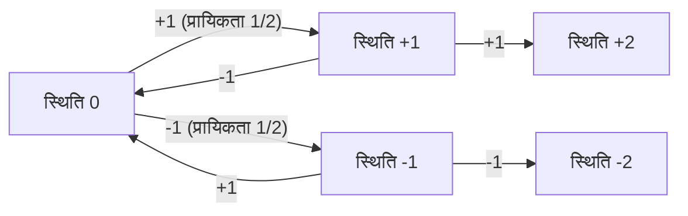
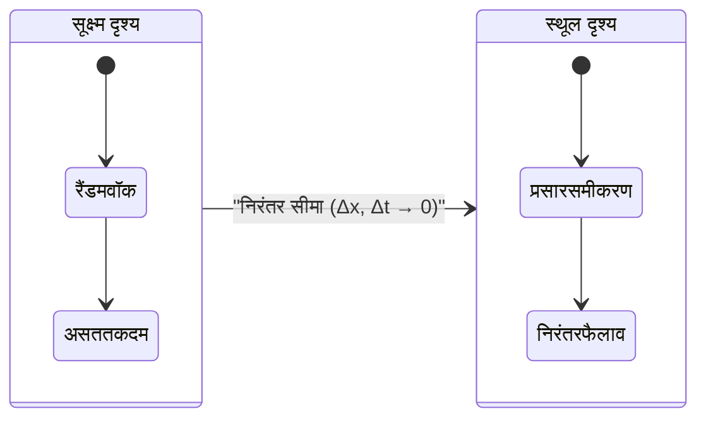
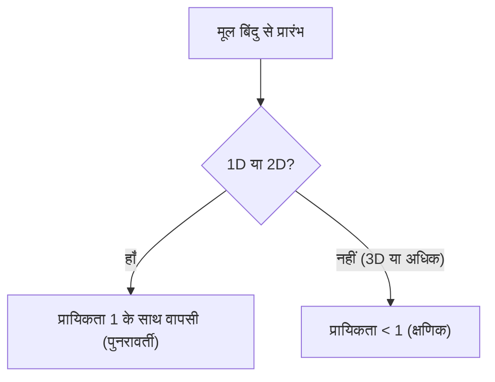

# परिचय

रैंडम वॉक (यादृच्छिक चाल) एक गणितीय अवधारणा है जिसमें अगली स्थिति को यादृच्छिक (प्रायिकता) रूप से निर्धारित किया जाता है। इसे अक्सर "शराबी की चाल" कहा जाता है।

## सूत्र (1D)

मान लें कि एक कण मूल बिंदु $x = 0$ पर है। यह दाईं ओर $+1$ या बाईं ओर $-1$ समान प्रायिकता के साथ जाता है:

$$
X_i = \begin{cases} 
+1 & (\text{प्रायिकता } 1/2) \\ 
-1 & (\text{प्रायिकता } 1/2) 
\end{cases}
$$

$n$ कदमों के बाद स्थिति है:

$$
S_n = X_1 + X_2 + \dots + X_n = \sum_{i=1}^n X_i
$$



## प्रत्याशित मान और प्रसरण

प्रत्याशित मान $0$ है, लेकिन प्रसरण $n$ है।

## प्रसार समीकरण

निरंतर सीमा पर, रैंडम वॉक **प्रसार समीकरण** बन जाता है:

$$
\frac{\partial P}{\partial t} = D \frac{\partial^2 P}{\partial x^2}
$$



## ब्राउनियन गति और पोल्या का प्रमेय

**पोल्या का प्रमेय** बताता है कि 1D और 2D के लिए मूल बिंदु पर लौटने की प्रायिकता 100% है, लेकिन 3D या उससे अधिक के लिए, यह 1 से कम है।



## पायथन के साथ सिमुलेशन

```python
import numpy as np
import matplotlib.pyplot as plt

def simulate_random_walk_2d(steps):
    """
    2D रैंडम वॉक सिमुलेशन
    """
    directions = np.array([[1, 0], [-1, 0], [0, 1], [0, -1]])
    random_steps = np.random.randint(0, 4, size=steps)
    movements = directions[random_steps]
    path = np.vstack([[0, 0], np.cumsum(movements, axis=0)])
    return path

steps = 50000
path = simulate_random_walk_2d(steps)

plt.figure(figsize=(10, 10))
plt.plot(path[:, 0], path[:, 1], alpha=0.6, color='royalblue', linewidth=0.5)
plt.scatter(0, 0, color='red', marker='x', s=150, label='प्रारंभ', zorder=5)
plt.scatter(path[-1, 0], path[-1, 1], color='darkorange', marker='o', s=100, label='अंत', zorder=5)

plt.title(f"2D Random Walk ({steps} steps)", fontsize=16)
plt.xlabel("X अक्ष", fontsize=12)
plt.ylabel("Y अक्ष", fontsize=12)
plt.legend(fontsize=12)
plt.grid(True, linestyle='--', alpha=0.7)
plt.axis('equal')
plt.show()
```
