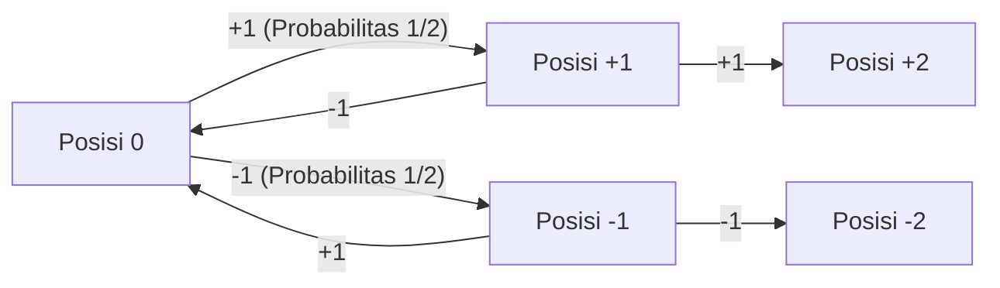
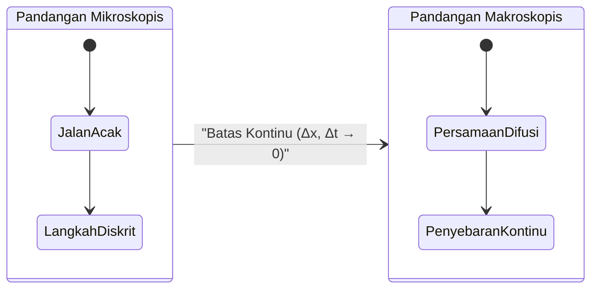
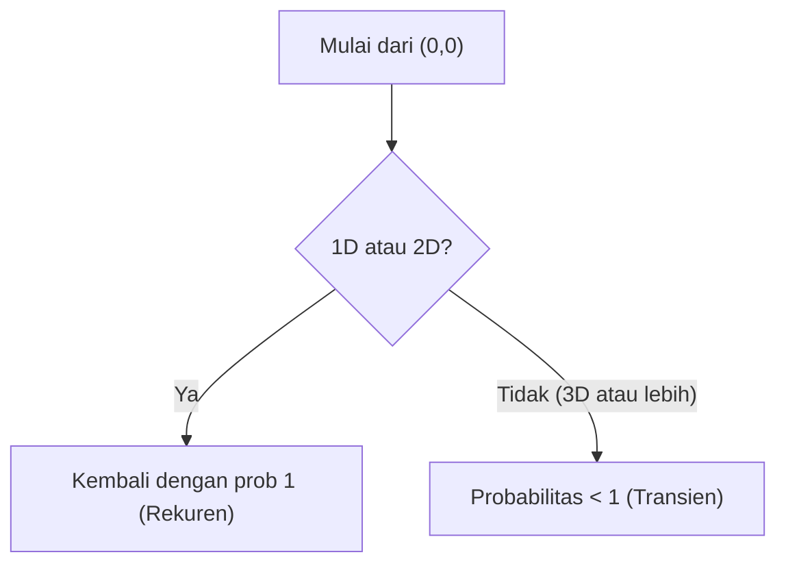

# Pengantar: Apa itu Jalan Acak?

Jalan acak (Random Walk) adalah konsep matematika di mana posisi berikutnya ditentukan secara acak (probabilistik). Sering disebut juga "langkah pemabuk".

## Rumus (1D)

Misalkan sebuah partikel di titik awal $x = 0$. Ia bergerak ke kanan $+1$ atau ke kiri $-1$ dengan probabilitas yang sama:

$$
X_i = \begin{cases} 
+1 & (\text{probabilitas } 1/2) \\ 
-1 & (\text{probabilitas } 1/2) 
\end{cases}
$$

Posisi setelah $n$ langkah adalah:

$$
S_n = X_1 + X_2 + \dots + X_n = \sum_{i=1}^n X_i
$$



## Nilai Harapan dan Varians

Nilai harapan adalah $0$, tetapi varians adalah $n$.

## Persamaan Difusi

Pada batas kontinu, jalan acak menjadi **Persamaan Difusi**:

$$
\frac{\partial P}{\partial t} = D \frac{\partial^2 P}{\partial x^2}
$$



## Gerak Brown dan Teorema Polya

**Teorema Polya** menyatakan bahwa untuk 1D dan 2D probabilitas kembali ke titik awal adalah 100%, tetapi untuk 3D atau lebih besar dari itu, kurang dari 1.



## Simulasi dengan Python

```python
import numpy as np
import matplotlib.pyplot as plt

def simulate_random_walk_2d(steps):
    """
    Simulasi jalan acak 2D
    """
    directions = np.array([[1, 0], [-1, 0], [0, 1], [0, -1]])
    random_steps = np.random.randint(0, 4, size=steps)
    movements = directions[random_steps]
    path = np.vstack([[0, 0], np.cumsum(movements, axis=0)])
    return path

steps = 50000
path = simulate_random_walk_2d(steps)

plt.figure(figsize=(10, 10))
plt.plot(path[:, 0], path[:, 1], alpha=0.6, color='royalblue', linewidth=0.5)
plt.scatter(0, 0, color='red', marker='x', s=150, label='Mulai', zorder=5)
plt.scatter(path[-1, 0], path[-1, 1], color='darkorange', marker='o', s=100, label='Selesai', zorder=5)

plt.title(f"2D Random Walk ({steps} steps)", fontsize=16)
plt.xlabel("Sumbu X", fontsize=12)
plt.ylabel("Sumbu Y", fontsize=12)
plt.legend(fontsize=12)
plt.grid(True, linestyle='--', alpha=0.7)
plt.axis('equal')
plt.show()
```
