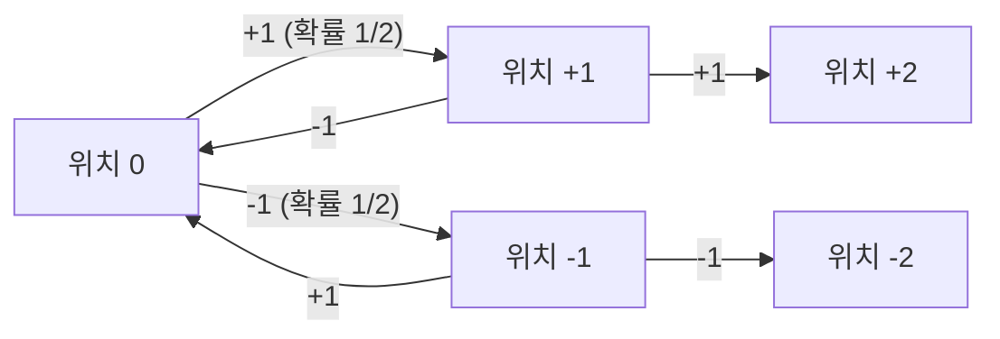
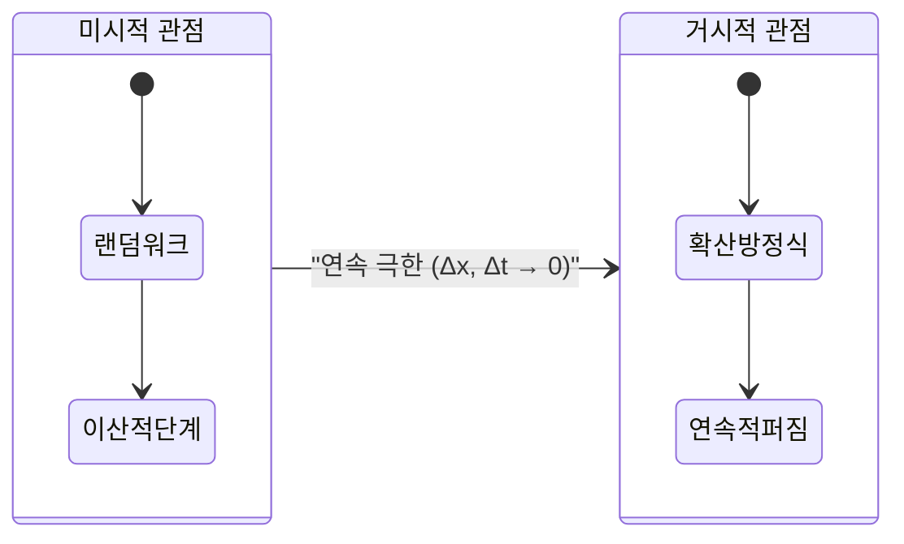
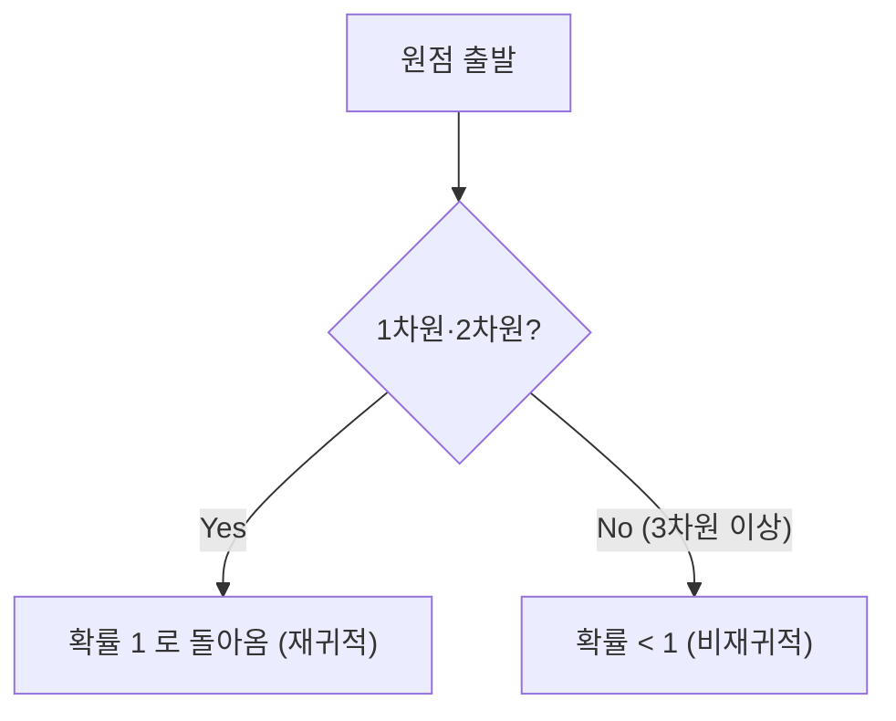

# 시작하며: [랜덤 워크](https://kenji.blog/ko/p/random-walk/)란 무엇인가?

[랜덤 워크](https://kenji.blog/ko/p/random-walk/)([Random Walk](https://kenji.blog/ko/p/random-walk/))란, 다음 위치가 확률적으로 무작위(랜덤)하게 결정되는 운동을 가리키는 수학적 개념입니다. 흔히 '취보(醉步, 술 취한 사람의 걸음)'라고도 불립니다. 이는 술에 취한 사람이 비틀거리며 오른쪽, 왼쪽으로 흔들흔들 걷는 모습에 비유되기 때문입니다. 언뜻 보면 무질서하고 예측 불가능한 움직임 같지만, 많은 걸음이 쌓이면 그 속에서 놀랍도록 아름답고 규칙적인 수학적 법칙이 떠오르게 됩니다.

이 글에서는 가장 단순한 1차원 [랜덤 워크](https://kenji.blog/ko/p/random-walk/)의 기초에서 출발하여, 이것이 어떻게 물리학의 확산 현상이나 브라운 운동과 연결되는지, 그리고 고차원 공간에서의 랜덤 워크가 가지는 흥미로운 성질에 대해 수식을 곁들여 깊이 파헤쳐 보겠습니다. [랜덤 워크](https://kenji.blog/ko/p/random-walk/)의 이해는 물리학이나 수학에 그치지 않고, 금융 공학과 정보 과학 등 현대의 다양한 분야에서 필수적인 교양이 되었습니다.

## 역사적 배경: 칼 피어슨의 질문

[랜덤 워크](https://kenji.blog/ko/p/random-walk/)라는 용어가 처음 학술적으로 사용된 것은 1905년 영국의 수리 통계학자 칼 피어슨(Karl Pearson)이 과학 잡지 《네이처》에 기고한 짧은 질문 기사에서였습니다. 그는 다음과 같은 문제를 제시했습니다.

> "어떤 사람이 원점에서 출발하여 길이 $l$ 의 직선을 무작위 방향으로 걷는다. 이것을 $n$ 번 반복했을 때, 출발점으로부터의 거리가 $r$ 과 $r + dr$ 사이에 있을 확률은 얼마인가?"

이 질문에 대해 레일리 경(Lord Rayleigh)이 자신의 음향학 연구 중 '여러 음파의 중첩'에 관한 수학 공식이 그대로 적용될 수 있음을 지적했습니다. 이것이 [랜덤 워크](https://kenji.blog/ko/p/random-walk/) 이론이 널리 알려지게 된 계기입니다.

## 1차원 [랜덤 워크](https://kenji.blog/ko/p/random-walk/)의 엄밀한 수학적 공식화

### 확률적 이동의 정의

가장 단순한 1차원 [랜덤 워크](https://kenji.blog/ko/p/random-walk/)를 생각해 봅시다. 수직선 위의 원점 $x = 0$ 에 있는 입자가 단위 시간마다 확률 $p$ 로 오른쪽 방향으로 $+1$, 확률 $q = 1 - p$ 로 왼쪽 방향으로 $-1$ 이동한다고 합시다. 여기서는 단순하게 $p = q = 1/2$ 인 대칭 랜덤 워크(Symmetric [Random Walk](https://kenji.blog/ko/p/random-walk/))를 다룹니다.

제 $i$ 번째 걸음에서의 이동량을 확률 변수 $X_i$ 라고 하면, $X_i$ 는 다음의 값을 가집니다.

$$
X_i = \begin{cases} 
+1 & (\text{확률 } 1/2) \\ 
-1 & (\text{확률 } 1/2) 
\end{cases}
$$

$n$ 걸음을 나아간 후의 입자 위치 $S_n$ 은 각 단계의 이동량의 합으로 다음과 같이 표현됩니다.

$$
S_n = X_1 + X_2 + \dots + X_n = \sum_{i=1}^n X_i
$$



### 도달 확률과 이항 분포

$n$ 걸음의 이동 중, 오른쪽으로 $k$ 걸음, 왼쪽으로 $n - k$ 걸음 나아갔다고 합시다. 이때의 위치 $S_n$ 은 다음과 같습니다.

$$
S_n = k \times (+1) + (n - k) \times (-1) = 2k - n
$$

위치가 $m$ 이 되기 위해서는 $m = 2k - n$ 에서 $k = (n + m) / 2$ 번만큼 오른쪽으로 나아가야 합니다. 따라서 위치 $m$ 에 도달할 확률 $P(S_n = m)$ 은 이항 분포를 이용하여 다음과 같이 나타냅니다.

$$
P(S_n = m) = \binom{n}{\frac{n+m}{2}} \left( \frac{1}{2} \right)^n
$$

참고로 $n$ 과 $m$ 의 홀짝이 일치하지 않을 경우, 이 확률은 $0$ 이 됩니다.

## 기댓값과 분산의 계산: 흔들림의 퍼짐

다음으로 위치 $S_n$ 의 통계적인 성질을 조사해 봅시다. 먼저, $X_i$ 의 기댓값 $E[X_i]$ 와 분산 $V(X_i)$ 를 구합니다.

$$
E[X_i] = (+1) \times \frac{1}{2} + (-1) \times \frac{1}{2} = 0
$$

$$
V(X_i) = E[X_i^2] - (E[X_i])^2 = (1)^2 \times \frac{1}{2} + (-1)^2 \times \frac{1}{2} - 0 = 1
$$

각 걸음의 이동 $X_i$ 는 서로 독립이므로, $n$ 번째 걸음 위치 $S_n$ 의 기댓값과 분산은 다음과 같습니다.

$$
E[S_n] = \sum_{i=1}^n E[X_i] = 0
$$

$$
V(S_n) = \sum_{i=1}^n V(X_i) = n
$$

이 결과는 매우 중요합니다. 기댓값이 $0$ 이라는 것은 **평균적으로는 원점에 머무름** 을 의미합니다. 그러나 분산이 $n$ 에 비례하여 커지기 때문에, 표준 편차(흩어짐의 지표)는 $\sqrt{n}$ 이 됩니다. 즉, 걸음 수 $n$ 이 늘어남에 따라 입자의 존재 범위는 $\sqrt{n}$ 의 크기로 서서히 넓어져 가는 것을 알 수 있습니다. 시간은 $n$ 으로 진행하는데 이동 거리는 $\sqrt{n}$ 밖에 나아가지 못하는 비효율성이 [랜덤 워크](https://kenji.blog/ko/p/random-walk/)의 가장 큰 특징입니다.

## 스털링의 근사와 중심 극한 정리: 가우스 분포로의 수렴

걸음 수 $n$ 이 매우 클 경우, 이항 분포의 계산은 어려워집니다. 여기서 팩토리얼의 근사식인 스털링의 근사(Stirling's approximation) $n! \approx \sqrt{2\pi n} (n/e)^n$ 을 이용하여 이항 계수를 평가하면, 이산적인 확률 분포는 연속적인 **정규 분포** (가우스 분포)로 수렴합니다.

위치 $x$ 를 연속 변수로 간주하고, 분산이 $n$ 임을 고려하면 확률 밀도 함수 $f(x, n)$ 은 다음의 형태로 점근합니다.

$$
f(x, n) \approx \frac{1}{\sqrt{2\pi n}} \exp\left( - \frac{x^2}{2n} \right)
$$

이것은 바로 중심 극한 정리가 보여주듯이, 독립 동일 분포를 따르는 확률 변수의 합이 정규 분포로 수렴한다는 것의 직접적인 표현입니다.

## 확산 방정식(열전도 방정식)의 도출: 이산에서 연속으로

[랜덤 워크](https://kenji.blog/ko/p/random-walk/)는 미시적인 입자의 움직임을 기술하는 모델이지만, 이를 거시적인 연속 극한에서 보면 **확산 방정식** 으로 파악할 수 있습니다.

공간을 미소한 간격 $\Delta x$, 시간을 미소한 간격 $\Delta t$ 로 나눕니다. 위치 $x$, 시간 $t$ 에서의 입자 존재 확률을 $P(x, t)$ 라 합시다.
시각 $t + \Delta t$ 에 입자가 위치 $x$ 에 존재할 확률은, 시각 $t$ 에 위치 $x - \Delta x$ 또는 $x + \Delta x$ 에서 이동해 왔을 확률의 합입니다.

$$
P(x, t + \Delta t) = \frac{1}{2} P(x - \Delta x, t) + \frac{1}{2} P(x + \Delta x, t)
$$

이 식의 양변에서 $P(x, t)$ 를 빼고 다음과 같이 변형합니다.

$$
P(x, t + \Delta t) - P(x, t) = \frac{1}{2} \left[ P(x - \Delta x, t) - 2P(x, t) + P(x + \Delta x, t) \right]
$$

양변을 $\Delta t$ 로 나누고, 우변에는 $(\Delta x)^2 / (\Delta x)^2$ 를 곱합니다.

$$
\frac{P(x, t + \Delta t) - P(x, t)}{\Delta t} = \frac{(\Delta x)^2}{2 \Delta t} \frac{P(x - \Delta x, t) - 2P(x, t) + P(x + \Delta x, t)}{(\Delta x)^2}
$$

여기서 극한 $\Delta x \to 0$ 및 $\Delta t \to 0$ 을 취합니다. 극한에서 $D = \lim \frac{(\Delta x)^2}{2 \Delta t}$ 가 유한한 상수(확산 계수)가 된다고 가정하면, 좌변은 시간에 대한 1계 미분, 우변은 공간에 대한 2계 미분이 되어 다음의 편미분 방정식을 얻습니다.

$$
\frac{\partial P}{\partial t} = D \frac{\partial^2 P}{\partial x^2}
$$

이것이 **확산 방정식** 이며, 물리학의 열전도 방정식과 완전히 같은 형태를 하고 있습니다. 미시적인 무작위 움직임이 거시적인 연속적인 퍼짐(확산)을 표현하고 있음이 수학적으로 증명되는 순간입니다.



## 브라운 운동과 위너 과정: 아인슈타인의 업적

[랜덤 워크](https://kenji.blog/ko/p/random-walk/)를 연속화한 것이 **브라운 운동** (Brownian Motion)입니다.

1827년, 식물학자 로버트 브라운은 물속의 꽃가루에서 방출된 미립자가 불규칙하게 움직이는 것을 발견했습니다. 오랫동안 수수께끼였던 이 현상을 1905년 알베르트 아인슈타인이 "물 분자가 미립자에 무작위로 충돌함으로써 일어나는 [랜덤 워크](https://kenji.blog/ko/p/random-walk/)"로서 수학적으로 설명했습니다. 아인슈타인은 확산 방정식을 이용하여 입자의 평균 제곱 변위가 시간에 비례한다는 것 $\langle x^2 \rangle = 2Dt$ 을 이끌어 냈습니다.

수학적으로는 브라운 운동을 엄밀하게 공식화한 것을 **위너 과정** $W(t)$ 라고 부릅니다. 다음 성질을 만족합니다.

1. $W(0) = 0$
2. 증분 $W(t) - W(s)$ 는 정규 분포 $\mathcal{N}(0, t-s)$ 를 따른다.
3. 독립 증분성을 가진다.
4. 궤적은 확률 $1$ 로 연속이지만, **어디에서도 미분 불가능** 하다.

## 고차원으로의 확장: 폴리아의 재귀 정리

공간을 2차원(평면)이나 3차원(입체)으로 확장하면 매우 흥미로운 정리가 나타납니다. 1921년 조지 폴리아(George Pólya)가 증명한 **폴리아의 재귀 정리** 입니다.

무한히 넓은 격자 공간에서 [랜덤 워크](https://kenji.blog/ko/p/random-walk/)를 할 때, 출발점(원점)으로 다시 돌아올 확률(재귀 확률)은 차원에 따라 다릅니다.

- **1차원** 및 **2차원** 의 경우: 재귀 확률은 $1$(100%). 무한한 시간을 들이면 반드시 원점으로 돌아온다.
- **3차원** 이상의 경우: 재귀 확률은 $1$ 미만(3차원의 경우 약 $0.3405$). 원점으로 두 번 다시 돌아오지 않을 확률이 양의 값으로 존재한다.

가쿠타니 시즈오가 한 유명한 농담이 있습니다.

> "A drunk man will find his way home, but a drunk bird may get lost forever."
> (술 취한 사람은 반드시 집에 돌아갈 수 있지만, 술 취한 새는 영원히 길을 잃을지도 모른다)

지상(2차원)을 걷는 술 취한 사람은 언젠가는 출발점으로 돌아올 수 있지만, 하늘(3차원)을 나는 새는 공간이 너무 넓기 때문에 미아가 될 가능성이 있는 것입니다.



## 금융 공학으로의 응용: 기하 브라운 운동과 블랙-숄즈 방정식

[랜덤 워크](https://kenji.blog/ko/p/random-walk/) 이론은 물리학에만 머물지 않습니다. 효율적 시장 가설 하에서는 금융 시장의 주가 변동도 [랜덤 워크](https://kenji.blog/ko/p/random-walk/)를 따른다고 간주됩니다.

주가 $S_t$ 는 음의 값을 갖지 않도록 로그 정규 분포를 가정한 **기하 브라운 운동** (Geometric Brownian Motion)으로 모델링됩니다.

$$
dS_t = \mu S_t dt + \sigma S_t dW_t
$$

여기서 $\mu$ 는 드리프트(기대 수익률), $\sigma$ 는 변동성(가격 변동률), $W_t$ 는 위너 과정입니다. 이 모델을 기초로 옵션 가격의 적정 가격을 도출하는 **블랙-숄즈 방정식** 이 구축되어 현대 금융 공학의 초석이 되었습니다.

## 파이썬을 이용한 [랜덤 워크](https://kenji.blog/ko/p/random-walk/) 시뮬레이션

이론뿐만 아니라 실제로 프로그램을 구동하여 시각화함으로써 이해를 깊게 할 수 있습니다. 파이썬을 이용하여 2차원 [랜덤 워크](https://kenji.blog/ko/p/random-walk/) 시뮬레이션을 해봅시다.

```python
import numpy as np
import matplotlib.pyplot as plt

def simulate_random_walk_2d(steps):
    """
    2차원 랜덤 워크를 시뮬레이션하는 함수
    """
    # 상하좌우 4방향으로의 이동 벡터
    directions = np.array([[1, 0], [-1, 0], [0, 1], [0, -1]])
    
    # 각 걸음에서 0~3의 인덱스를 무작위로 선택
    random_steps = np.random.randint(0, 4, size=steps)
    movements = directions[random_steps]
    
    # 누적합을 구하여 궤적을 계산 (원점[0,0]에서 시작)
    path = np.vstack([[0, 0], np.cumsum(movements, axis=0)])
    return path

# 50000 스텝 시뮬레이션
steps = 50000
path = simulate_random_walk_2d(steps)

# 그리기 설정
plt.figure(figsize=(10, 10))
plt.plot(path[:, 0], path[:, 1], alpha=0.6, color='royalblue', linewidth=0.5)
plt.scatter(0, 0, color='red', marker='x', s=150, label='Start', zorder=5)
plt.scatter(path[-1, 0], path[-1, 1], color='darkorange', marker='o', s=100, label='End', zorder=5)

plt.title(f"2D Random Walk ({steps} steps)", fontsize=16)
plt.xlabel("X axis", fontsize=12)
plt.ylabel("Y axis", fontsize=12)
plt.legend(fontsize=12)
plt.grid(True, linestyle='--', alpha=0.7)
plt.axis('equal')
plt.show()
```

이 코드를 실행하면 평면 위를 무작위로 헤매는 궤적이 그려집니다. 국소적으로는 완전히 무작위지만 전체적으로는 프랙탈적인 자기 유사 구조를 가지는 아름다운 무늬를 관찰할 수 있을 것입니다.

## 마치며

이 글에서는 가장 단순한 '취보'에서 출발하여 중심 극한 정리에 의한 가우스 분포로의 수렴, 확산 방정식의 도출, 아인슈타인에 의한 브라운 운동 해명, 폴리아의 정리, 그리고 금융 공학 응용까지 [랜덤 워크](https://kenji.blog/ko/p/random-walk/)에 얽힌 수학적 배경을 자세히 해설했습니다.

지극히 단순하고 무질서한 규칙의 반복에서 거시적인 세계를 지배하는 보편적인 법칙(미분 방정식이나 정규 분포)이 자연스럽게 나타난다는 사실은 수학이나 물리학의 가장 매력적이고 감동적인 측면 중 하나입니다. [랜덤 워크](https://kenji.blog/ko/p/random-walk/)의 개념은 앞으로도 다양한 미지의 현상을 밝혀내기 위한 강력한 무기로 남을 것입니다.
