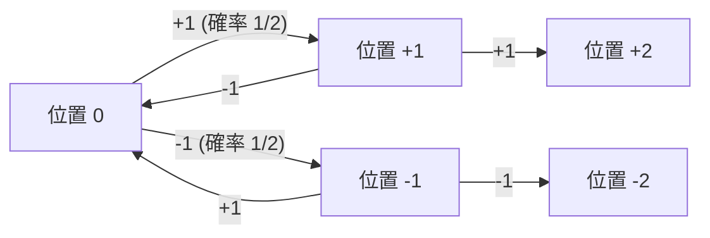
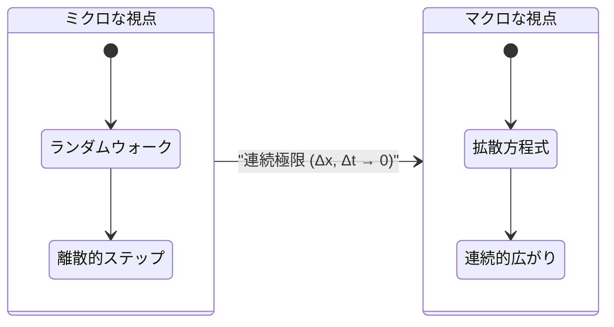
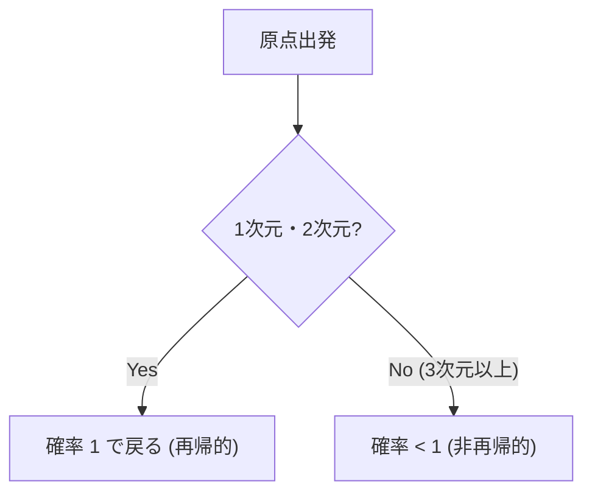

# はじめに：ランダムウォークとは何か？

ランダムウォーク（Random Walk）とは、次に現れる位置が確率的に無作為（ランダム）に決定される運動を指す数学的な概念です。日本語ではしばしば「酔歩（すいほ）」とも呼ばれます。これは、酔っ払いが千鳥足で右へ左へとふらふらと歩く様子に例えられるためです。一見すると無秩序で予測不可能な動きですが、多数のステップを重ねることで、そこには驚くほど美しく、そして規則的な数学的法則が浮かび上がってきます。

この記事では、最も単純な1次元ランダムウォークの基礎から出発し、それがどのようにして物理学における拡散現象やブラウン運動と結びつくのか、そして高次元空間におけるランダムウォークの興味深い性質について、数式を交えながら深く掘り下げていきます。ランダムウォークの理解は、物理学や数学にとどまらず、金融工学や情報科学など、現代の多岐にわたる分野で必須の教養となっています。

## 歴史的背景：カール・ピアソンの問いかけ

ランダムウォークという用語が初めて学術的に用いられたのは、1905年にイギリスの数理統計学者カール・ピアソン（Karl Pearson）が科学雑誌『ネイチャー』に投稿した短い質問記事においてです。彼は次のような問題を提示しました。

> 「ある人が原点から出発し、長さ $l$ の直線をランダムな方向に歩く。これを $n$ 回繰り返したとき、出発点からの距離が $r$ と $r + dr$ の間にある確率はいくらか？」

この問いに対して、レイリー卿（Lord Rayleigh）が自身の音響学の研究における「複数の音波の重ね合わせ」の数式がそのまま適用できることを指摘しました。これが、ランダムウォークの理論が広く認知されるきっかけとなりました。

## 1次元ランダムウォークの厳密な数学的定式化

### 確率的な移動の定義

最も単純な1次元のランダムウォークを考えましょう。数直線上の原点 $x = 0$ にいる粒子が、単位時間ごとに確率 $p$ で右方向に $+1$、確率 $q = 1 - p$ で左方向に $-1$ 移動するとします。ここでは、シンプルに $p = q = 1/2$ の対称ランダムウォーク（Symmetric Random Walk）を扱います。

第 $i$ 番目のステップでの移動量を確率変数 $X_i$ とすると、$X_i$ は以下の値をとります。

$$
X_i = \begin{cases} 
+1 & (\text{確率 } 1/2) \\ 
-1 & (\text{確率 } 1/2) 
\end{cases}
$$

$n$ 歩進んだ後の粒子の位置 $S_n$ は、各ステップの移動量の和として次のように表されます。

$$
S_n = X_1 + X_2 + \dots + X_n = \sum_{i=1}^n X_i
$$



### 到達確率と二項分布

$n$ 歩の移動のうち、右に $k$ 歩、左に $n - k$ 歩進んだとします。このときの位置 $S_n$ は以下のようになります。

$$
S_n = k \times (+1) + (n - k) \times (-1) = 2k - n
$$

位置が $m$ となるためには、$m = 2k - n$ より、$k = (n + m) / 2$ 回だけ右に進む必要があります。したがって、位置 $m$ に到達する確率 $P(S_n = m)$ は二項分布を用いて次のように表されます。

$$
P(S_n = m) = \binom{n}{\frac{n+m}{2}} \left( \frac{1}{2} \right)^n
$$

なお、$n$ と $m$ の偶奇が一致しない場合、この確率は $0$ となります。

## 期待値と分散の計算：ふらつきの広がり

次に、位置 $S_n$ の統計的な性質を調べてみましょう。まず、$X_i$ の期待値 $E[X_i]$ と分散 $V(X_i)$ を求めます。

$$
E[X_i] = (+1) \times \frac{1}{2} + (-1) \times \frac{1}{2} = 0
$$

$$
V(X_i) = E[X_i^2] - (E[X_i])^2 = (1)^2 \times \frac{1}{2} + (-1)^2 \times \frac{1}{2} - 0 = 1
$$

各ステップの移動 $X_i$ は互いに独立であるため、$n$ 歩目の位置 $S_n$ の期待値と分散は以下のようになります。

$$
E[S_n] = \sum_{i=1}^n E[X_i] = 0
$$

$$
V(S_n) = \sum_{i=1}^n V(X_i) = n
$$

この結果は非常に重要です。期待値が $0$ であるということは、 **平均的には原点に留まる** ということを意味します。しかし、分散が $n$ に比例して大きくなるため、標準偏差（ばらつきの指標）は $\sqrt{n}$ となります。つまり、ステップ数 $n$ が増えるにつれて、粒子の存在範囲は $\sqrt{n}$ のオーダーで徐々に広がっていくことがわかります。時間は $n$ で進むのに、移動距離は $\sqrt{n}$ でしか進まないという非効率性が、ランダムウォークの最大の特徴です。

## スターリングの近似と中心極限定理：ガウス分布への収束

ステップ数 $n$ が非常に大きい場合、二項分布の計算は困難になります。ここで、階乗の近似式であるスターリングの近似（Stirling's approximation） $n! \approx \sqrt{2\pi n} (n/e)^n$ を用いて二項係数を評価すると、離散的な確率分布は連続的な **正規分布** （ガウス分布）へと収束します。

位置 $x$ を連続変数とみなし、分散が $n$ であることを考慮すると、確率密度関数 $f(x, n)$ は以下の形に漸近します。

$$
f(x, n) \approx \frac{1}{\sqrt{2\pi n}} \exp\left( - \frac{x^2}{2n} \right)
$$

これはまさに、中心極限定理が示す通り、独立同分布に従う確率変数の和が正規分布に収束することの直接的な現れです。

## 拡散方程式（熱伝導方程式）の導出：離散から連続へ

ランダムウォークは、ミクロな粒子の動きを記述するモデルですが、これをマクロな連続極限で見ると **拡散方程式** として捉えることができます。

空間を微小な間隔 $\Delta x$、時間を微小な間隔 $\Delta t$ で区切ります。位置 $x$、時間 $t$ における粒子の存在確率を $P(x, t)$ とします。
時刻 $t + \Delta t$ に粒子が位置 $x$ に存在する確率は、時刻 $t$ に位置 $x - \Delta x$ または $x + \Delta x$ から移動してきた確率の和です。

$$
P(x, t + \Delta t) = \frac{1}{2} P(x - \Delta x, t) + \frac{1}{2} P(x + \Delta x, t)
$$

この式の両辺から $P(x, t)$ を引き、次のように変形します。

$$
P(x, t + \Delta t) - P(x, t) = \frac{1}{2} \left[ P(x - \Delta x, t) - 2P(x, t) + P(x + \Delta x, t) \right]
$$

両辺を $\Delta t$ で割り、右辺には $(\Delta x)^2 / (\Delta x)^2$ を掛けます。

$$
\frac{P(x, t + \Delta t) - P(x, t)}{\Delta t} = \frac{(\Delta x)^2}{2 \Delta t} \frac{P(x - \Delta x, t) - 2P(x, t) + P(x + \Delta x, t)}{(\Delta x)^2}
$$

ここで極限 $\Delta x \to 0$ および $\Delta t \to 0$ をとります。極限において $D = \lim \frac{(\Delta x)^2}{2 \Delta t}$ が有限の定数（拡散係数）になると仮定すると、左辺は時間微分、右辺は空間の二階微分となり、以下の偏微分方程式が得られます。

$$
\frac{\partial P}{\partial t} = D \frac{\partial^2 P}{\partial x^2}
$$

これが **拡散方程式** であり、物理学における熱伝導方程式と全く同じ形をしています。ミクロなランダムな動きが、マクロな連続的な広がり（拡散）を表現していることが数学的に証明された瞬間です。



## ブラウン運動とウィーナー過程：アインシュタインの業績

ランダムウォークを連続化したものが **ブラウン運動** （Brownian Motion）です。

1827年、植物学者ロバート・ブラウンは水中の花粉から放出された微粒子が不規則に動くことを発見しました。長らく謎であったこの現象を、1905年にアルベルト・アインシュタインが「水分子が微粒子にランダムに衝突することによるランダムウォーク」として数学的に説明しました。アインシュタインは拡散方程式を用いて、粒子の平均二乗変位が時間に比例すること $\langle x^2 \rangle = 2Dt$ を導き出しました。

数学的には、ブラウン運動を厳密に定式化したものを **ウィーナー過程** $W(t)$ と呼びます。以下の性質を満たします。

1. $W(0) = 0$
2. 増分 $W(t) - W(s)$ は正規分布 $\mathcal{N}(0, t-s)$ に従う。
3. 独立増分性を持つ。
4. 軌跡は確率 $1$ で連続であるが、 **至る所微分不可能** である。

## 高次元への拡張：ポリアの再帰定理

空間を2次元（平面）や3次元（立体）へと拡張すると、非常に興味深い定理が現れます。1921年にジョージ・ポリア（George Pólya）が証明した **ポリアの再帰定理** です。

無限に広い格子空間でランダムウォークを行ったとき、出発点（原点）に再び戻ってくる確率（再帰確率）は次元によって異なります。

- **1次元** および **2次元** の場合：再帰確率は $1$（100%）。無限の時間をかければ必ず原点に戻る。
- **3次元** 以上の場合：再帰確率は $1$ 未満（3次元の場合は約 $0.3405$）。原点に二度と戻ってこない確率が正の値として存在する。

角谷静夫による有名なジョークがあります。

> "A drunk man will find his way home, but a drunk bird may get lost forever."
> （酔っ払いは必ず家に帰れるが、酔っ払った鳥は永遠に迷子になるかもしれない）

地上（2次元）を歩く酔っ払いはいつか出発点に戻れますが、空（3次元）を飛ぶ鳥は空間が広すぎるため迷子になる可能性があるのです。



## 金融工学への応用：幾何ブラウン運動とブラック・ショールズ方程式

ランダムウォークの理論は物理学に留まりません。金融市場における株価の変動も、効率的市場仮説のもとではランダムウォークに従うと考えられています。

株価 $S_t$ は、負の値を取らないように対数正規分布を仮定した **幾何ブラウン運動** （Geometric Brownian Motion）としてモデル化されます。

$$
dS_t = \mu S_t dt + \sigma S_t dW_t
$$

ここで、$\mu$ はドリフト（期待収益率）、$\sigma$ はボラティリティ（価格変動率）、$W_t$ はウィーナー過程です。このモデルを基礎として、オプション価格の適正価格を導出する **ブラック・ショールズ方程式** が構築され、現代の金融工学の礎となりました。

## Pythonによるランダムウォークのシミュレーション

理論だけでなく、実際にプログラムを動かして視覚化することで理解が深まります。Pythonを用いて2次元ランダムウォークのシミュレーションを行いましょう。

```python
import numpy as np
import matplotlib.pyplot as plt

def simulate_random_walk_2d(steps):
    """
    2次元ランダムウォークをシミュレーションする関数
    """
    # 上下左右の4方向への移動ベクトル
    directions = np.array([[1, 0], [-1, 0], [0, 1], [0, -1]])
    
    # 各ステップで0〜3のインデックスをランダムに選択
    random_steps = np.random.randint(0, 4, size=steps)
    movements = directions[random_steps]
    
    # 累積和をとることで軌跡を計算（原点[0,0]から開始）
    path = np.vstack([[0, 0], np.cumsum(movements, axis=0)])
    return path

# 50000ステップのシミュレーション
steps = 50000
path = simulate_random_walk_2d(steps)

# 描画設定
plt.figure(figsize=(10, 10))
plt.plot(path[:, 0], path[:, 1], alpha=0.6, color='royalblue', linewidth=0.5)
plt.scatter(0, 0, color='red', marker='x', s=150, label='Start', zorder=5)
plt.scatter(path[-1, 0], path[-1, 1], color='darkorange', marker='o', s=100, label='End', zorder=5)

plt.title(f"2D Random Walk ({steps} steps)", fontsize=16)
plt.xlabel("X axis", fontsize=12)
plt.ylabel("Y axis", fontsize=12)
plt.legend(fontsize=12)
plt.grid(True, linestyle='--', alpha=0.7)
plt.axis('equal')
plt.show()
```

このコードを実行すると、平面上を無作為にさまよう軌跡が描画されます。局所的には完全にランダムですが、全体としてはフラクタル的な自己相似構造を持つ美しい模様が観察できるでしょう。

## おわりに

この記事では、最も単純な「酔歩」から出発し、中心極限定理によるガウス分布への収束、拡散方程式の導出、アインシュタインによるブラウン運動の解明、ポリアの定理、そして金融工学への応用まで、ランダムウォークにまつわる数学的背景を詳しく解説しました。

極めてシンプルで無秩序なルールの反復から、マクロな世界を支配する普遍的な法則（微分方程式や正規分布）が自然と現れるという事実は、数学や物理学の最も魅力的で感動的な側面の一つです。ランダムウォークの概念は、これからも様々な未知の現象を解き明かすための強力な武器であり続けるでしょう。
