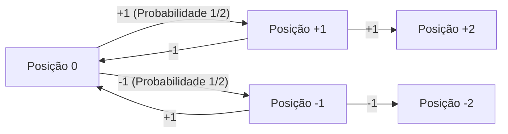
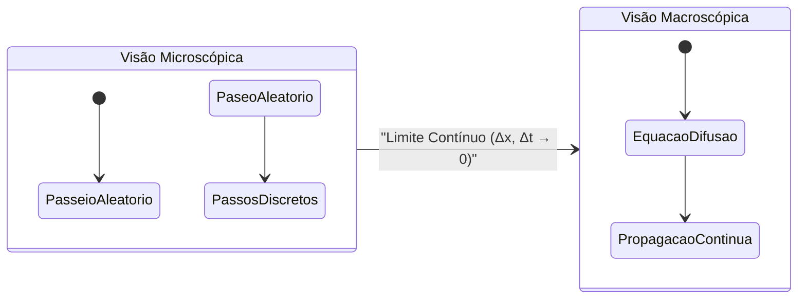
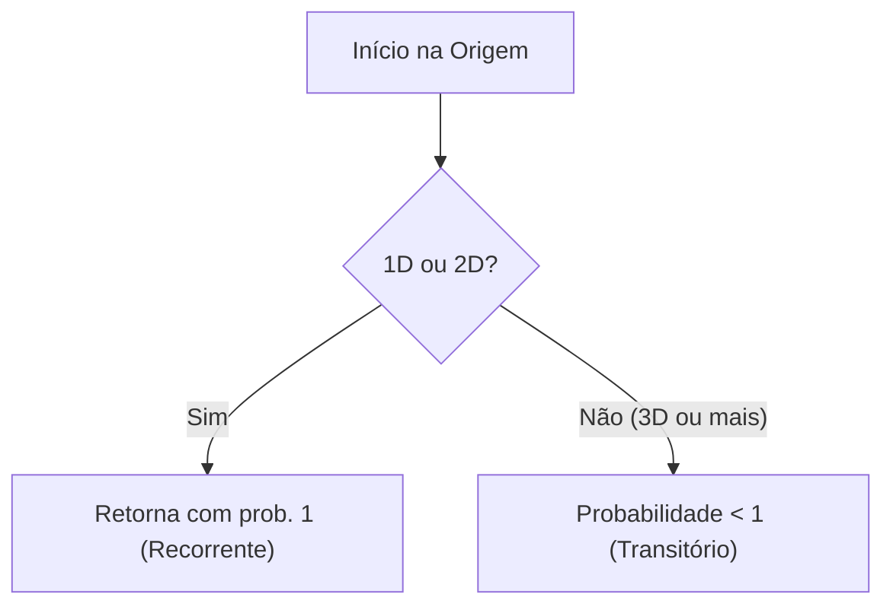

# Introdução: O que é um Passeio Aleatório?

Um passeio aleatório é um conceito matemático referente a um movimento em que a próxima posição é determinada aleatoriamente (probabilisticamente). Muitas vezes é chamado de "caminhada do bêbado".

## Formulação Matemática (1D)

Suponha uma partícula na origem $x = 0$. Ela se move para a direita $+1$ ou para a esquerda $-1$ com probabilidade igual.

$$
X_i = \begin{cases} 
+1 & (\text{probabilidade } 1/2) \\ 
-1 & (\text{probabilidade } 1/2) 
\end{cases}
$$

A posição após $n$ passos é:

$$
S_n = X_1 + X_2 + \dots + X_n = \sum_{i=1}^n X_i
$$



## Valor Esperado e Variância

O valor esperado é $0$, mas a variância é $n$.

## Equação de Difusão

O limite contínuo do passeio aleatório leva à **Equação de Difusão**:

$$
\frac{\partial P}{\partial t} = D \frac{\partial^2 P}{\partial x^2}
$$



## Movimento Browniano e o Teorema de Pólya

O **Teorema da Recorrência de Pólya** afirma que em 1D e 2D a probabilidade de retornar à origem é 100%, mas em 3D ou mais, é menor que 1.



## Simulação com Python

```python
import numpy as np
import matplotlib.pyplot as plt

def simulate_random_walk_2d(steps):
    """
    Função para simular passeio aleatório em 2D
    """
    directions = np.array([[1, 0], [-1, 0], [0, 1], [0, -1]])
    random_steps = np.random.randint(0, 4, size=steps)
    movements = directions[random_steps]
    path = np.vstack([[0, 0], np.cumsum(movements, axis=0)])
    return path

steps = 50000
path = simulate_random_walk_2d(steps)

plt.figure(figsize=(10, 10))
plt.plot(path[:, 0], path[:, 1], alpha=0.6, color='royalblue', linewidth=0.5)
plt.scatter(0, 0, color='red', marker='x', s=150, label='Início', zorder=5)
plt.scatter(path[-1, 0], path[-1, 1], color='darkorange', marker='o', s=100, label='Fim', zorder=5)

plt.title(f"2D Random Walk ({steps} steps)", fontsize=16)
plt.xlabel("Eixo X", fontsize=12)
plt.ylabel("Eixo Y", fontsize=12)
plt.legend(fontsize=12)
plt.grid(True, linestyle='--', alpha=0.7)
plt.axis('equal')
plt.show()
```

O passeio aleatório tem profundas conexões com a física moderna e finanças.
