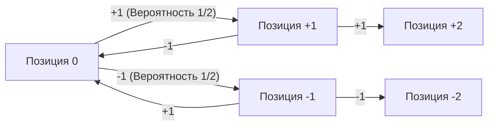
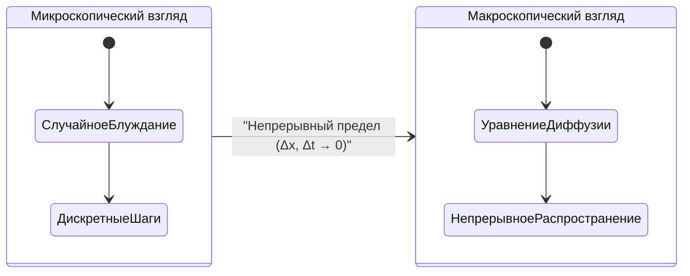
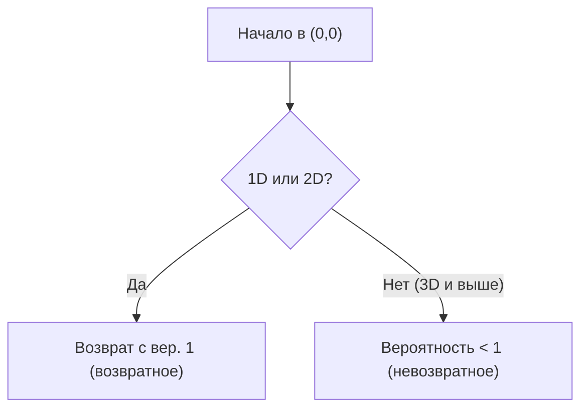

# Введение

[Случайное блуждание](https://kenji.blog/ru/p/random-walk/) — это математическая модель, в которой следующая позиция определяется случайным (вероятностным) образом. Его часто называют «блужданием пьяницы».

## Формула (1D)

Пусть частица находится в начале координат $x = 0$. Она движется вправо $+1$ или влево $-1$ с равной вероятностью:

$$
X_i = \begin{cases} 
+1 & (\text{вероятность } 1/2) \\ 
-1 & (\text{вероятность } 1/2) 
\end{cases}
$$

Позиция после $n$ шагов:

$$
S_n = X_1 + X_2 + \dots + X_n = \sum_{i=1}^n X_i
$$



## Математическое ожидание и дисперсия

Математическое ожидание равно $0$, а дисперсия $n$.

## Уравнение диффузии

При непрерывном пределе возникает **уравнение диффузии**:

$$
\frac{\partial P}{\partial t} = D \frac{\partial^2 P}{\partial x^2}
$$



## Броуновское движение и теорема Пойи

**Теорема Пойи** утверждает, что для 1D и 2D вероятность возврата в начало равна 1, но для 3D и выше она меньше 1.



## Симуляция на Python

```python
import numpy as np
import matplotlib.pyplot as plt

def simulate_random_walk_2d(steps):
    """
    Симуляция 2D случайного блуждания
    """
    directions = np.array([[1, 0], [-1, 0], [0, 1], [0, -1]])
    random_steps = np.random.randint(0, 4, size=steps)
    movements = directions[random_steps]
    path = np.vstack([[0, 0], np.cumsum(movements, axis=0)])
    return path

steps = 50000
path = simulate_random_walk_2d(steps)

plt.figure(figsize=(10, 10))
plt.plot(path[:, 0], path[:, 1], alpha=0.6, color='royalblue', linewidth=0.5)
plt.scatter(0, 0, color='red', marker='x', s=150, label='Старт', zorder=5)
plt.scatter(path[-1, 0], path[-1, 1], color='darkorange', marker='o', s=100, label='Финиш', zorder=5)

plt.title(f"2D Random Walk ({steps} steps)", fontsize=16)
plt.xlabel("Ось X", fontsize=12)
plt.ylabel("Ось Y", fontsize=12)
plt.legend(fontsize=12)
plt.grid(True, linestyle='--', alpha=0.7)
plt.axis('equal')
plt.show()
```
