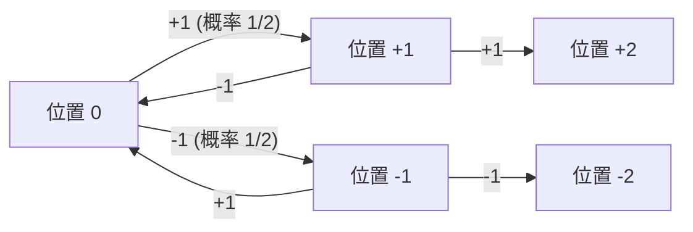
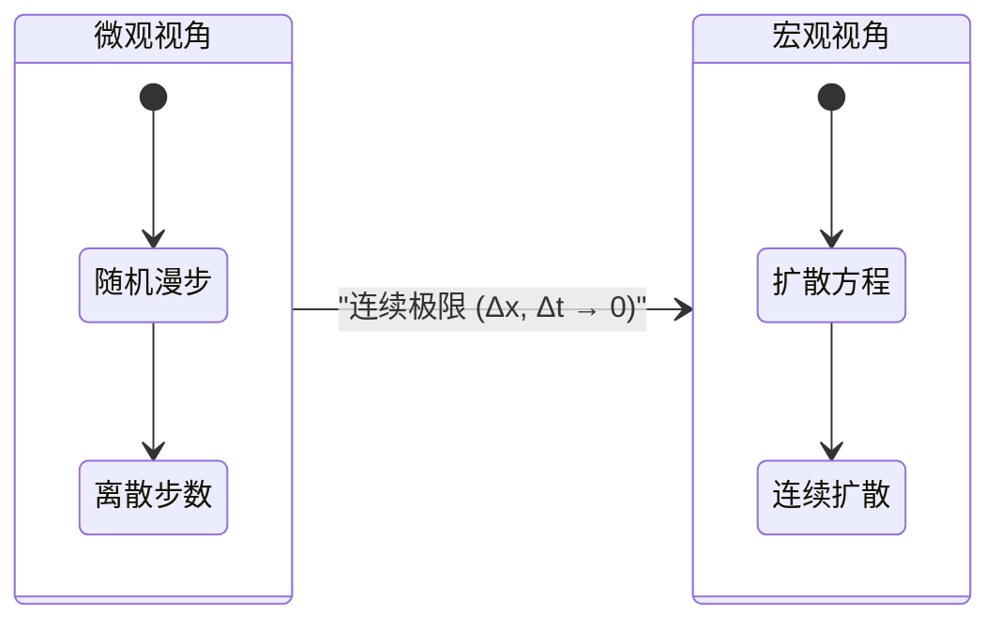
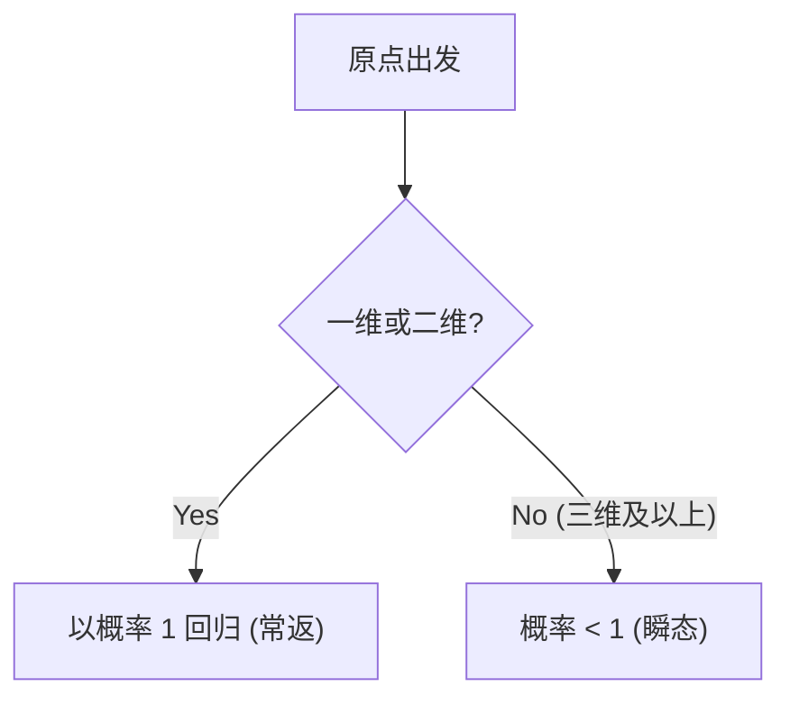

# 引言：什么是[随机漫步](https://kenji.blog/zh-cn/p/random-walk/)？

[随机漫步](https://kenji.blog/zh-cn/p/random-walk/)（[Random Walk](https://kenji.blog/zh-cn/p/random-walk/)）是一个数学概念，指的是下一步的位置由概率随机决定的运动。由于它类似于醉汉摇摇晃晃地左右行走的模样，因此常被称为“醉汉漫步”。乍看之下，这是一种无序且不可预测的运动，但是当步骤数量累积到一定程度后，就会浮现出令人惊叹的、美丽且有规律的数学法则。

在本文中，我们将从最简单的一维[随机漫步](https://kenji.blog/zh-cn/p/random-walk/)的基础出发，结合数学公式，深入探讨它如何与物理学中的扩散现象和布朗运动联系起来，以及高维空间中[随机漫步](https://kenji.blog/zh-cn/p/random-walk/)的有趣性质。对[随机漫步](https://kenji.blog/zh-cn/p/random-walk/)的理解，不仅仅局限于物理学和数学，更已成为金融工程、信息科学等现代众多领域必不可少的素养。

## 历史背景：卡尔·皮尔逊的提问

“[随机漫步](https://kenji.blog/zh-cn/p/random-walk/)”这一术语首次在学术上使用，是在 1905 年英国数理统计学家卡尔·皮尔逊（Karl Pearson）向科学杂志《自然》投稿的一篇简短提问文章中。他提出了以下问题：

> “一个人从原点出发，向随机方向走直线距离 $l$。重复 $n$ 次后，其距离出发点在 $r$ 和 $r + dr$ 之间的概率是多少？”

针对这一问题，瑞利男爵（Lord Rayleigh）指出，这完全可以直接套用他自己在声学研究中关于“多个声波叠加”的数学公式。这成为了[随机漫步](https://kenji.blog/zh-cn/p/random-walk/)理论被广泛认知的契机。

## 一维[随机漫步](https://kenji.blog/zh-cn/p/random-walk/)的严密数学表述

### 概率性移动的定义

让我们考虑最简单的一维[随机漫步](https://kenji.blog/zh-cn/p/random-walk/)。假设位于数轴上原点 $x = 0$ 的粒子，每单位时间以概率 $p$ 向右移动 $+1$，以概率 $q = 1 - p$ 向左移动 $-1$。在这里，我们仅处理最简单的 $p = q = 1/2$ 的对称[随机漫步](https://kenji.blog/zh-cn/p/random-walk/)（Symmetric [Random Walk](https://kenji.blog/zh-cn/p/random-walk/)）。

假设第 $i$ 步的移动量为随机变量 $X_i$，则 $X_i$ 取以下值：

$$
X_i = \begin{cases} 
+1 & (\text{概率 } 1/2) \\ 
-1 & (\text{概率 } 1/2) 
\end{cases}
$$

走过 $n$ 步后，粒子的位置 $S_n$ 可以表示为每一步移动量的总和：

$$
S_n = X_1 + X_2 + \dots + X_n = \sum_{i=1}^n X_i
$$



### 到达概率与二项分布

假设在 $n$ 步的移动中，向右走了 $k$ 步，向左走了 $n - k$ 步。此时的位置 $S_n$ 如下所示：

$$
S_n = k \times (+1) + (n - k) \times (-1) = 2k - n
$$

若要使得位置为 $m$，由 $m = 2k - n$ 可知，必须刚好向右移动 $k = (n + m) / 2$ 次。因此，到达位置 $m$ 的概率 $P(S_n = m)$ 可以使用二项分布表示如下：

$$
P(S_n = m) = \binom{n}{\frac{n+m}{2}} \left( \frac{1}{2} \right)^n
$$

需要注意的是，如果 $n$ 和 $m$ 的奇偶性不一致，则该概率为 $0$。

## 期望值与方差的计算：摇摆的扩散

接下来，让我们考察位置 $S_n$ 的统计性质。首先，求出 $X_i$ 的期望值 $E[X_i]$ 与方差 $V(X_i)$。

$$
E[X_i] = (+1) \times \frac{1}{2} + (-1) \times \frac{1}{2} = 0
$$

$$
V(X_i) = E[X_i^2] - (E[X_i])^2 = (1)^2 \times \frac{1}{2} + (-1)^2 \times \frac{1}{2} - 0 = 1
$$

由于每一步的移动 $X_i$ 相互独立，因此第 $n$ 步的位置 $S_n$ 的期望值与方差如下：

$$
E[S_n] = \sum_{i=1}^n E[X_i] = 0
$$

$$
V(S_n) = \sum_{i=1}^n V(X_i) = n
$$

这个结果非常重要。期望值为 $0$ 意味着 **平均而言，粒子会停留在原点**。然而，由于方差与 $n$ 成正比增加，标准差（离散程度的指标）变为 $\sqrt{n}$。换句话说，随着步数 $n$ 的增加，粒子的存在范围会以 $\sqrt{n}$ 的量级逐渐扩大。时间以 $n$ 推进，而移动距离却只以 $\sqrt{n}$ 推进，这种低效性正是[随机漫步](https://kenji.blog/zh-cn/p/random-walk/)的最大特征。

## 斯特林公式与中心极限定理：向高斯分布的收敛

当步数 $n$ 极大时，二项分布的计算会变得非常困难。在这里，如果我们使用阶乘的近似公式——斯特林公式（Stirling's approximation） $n! \approx \sqrt{2\pi n} (n/e)^n$ 来评估二项式系数，离散的概率分布将收敛为连续的 **正态分布**（高斯分布）。

将位置 $x$ 视为连续变量，并考虑方差为 $n$，则概率密度函数 $f(x, n)$ 将渐近于以下形式：

$$
f(x, n) \approx \frac{1}{\sqrt{2\pi n}} \exp\left( - \frac{x^2}{2n} \right)
$$

这正是中心极限定理最直接的体现：独立同分布的随机变量之和会收敛于正态分布。

## 扩散方程（热传导方程）的推导：从离散到连续

虽然[随机漫步](https://kenji.blog/zh-cn/p/random-walk/)是描述微观粒子运动的模型，但若从宏观的连续极限来看，就可以将其理解为 **扩散方程**。

将空间划分为微小间隔 $\Delta x$，将时间划分为微小间隔 $\Delta t$。设粒子在位置 $x$、时间 $t$ 存在的概率为 $P(x, t)$。
在时刻 $t + \Delta t$ 粒子存在于位置 $x$ 的概率，是时刻 $t$ 时从位置 $x - \Delta x$ 或 $x + \Delta x$ 移动过来的概率之和。

$$
P(x, t + \Delta t) = \frac{1}{2} P(x - \Delta x, t) + \frac{1}{2} P(x + \Delta x, t)
$$

将等式两边同时减去 $P(x, t)$，并变形如下：

$$
P(x, t + \Delta t) - P(x, t) = \frac{1}{2} \left[ P(x - \Delta x, t) - 2P(x, t) + P(x + \Delta x, t) \right]
$$

两边同时除以 $\Delta t$，右边则乘以 $(\Delta x)^2 / (\Delta x)^2$：

$$
\frac{P(x, t + \Delta t) - P(x, t)}{\Delta t} = \frac{(\Delta x)^2}{2 \Delta t} \frac{P(x - \Delta x, t) - 2P(x, t) + P(x + \Delta x, t)}{(\Delta x)^2}
$$

在此取极限 $\Delta x \to 0$ 及 $\Delta t \to 0$。在极限情况下，假设 $D = \lim \frac{(\Delta x)^2}{2 \Delta t}$ 成为一个有限常数（扩散系数），那么左边就变成了对时间的一阶偏导，右边变成了对空间的二阶偏导，从而得到以下偏微分方程：

$$
\frac{\partial P}{\partial t} = D \frac{\partial^2 P}{\partial x^2}
$$

这就是 **扩散方程**，它与物理学中的热传导方程形式完全相同。这正是微观的随机运动在数学上被证明可以表达宏观的连续扩散的瞬间。



## 布朗运动与维纳过程：爱因斯坦的贡献

将[随机漫步](https://kenji.blog/zh-cn/p/random-walk/)连续化后便得到了 **布朗运动**（Brownian Motion）。

1827 年，植物学家罗伯特·布朗发现，水中花粉释放出的微粒在做不规则运动。这个长期成谜的现象，在 1905 年被阿尔伯特·爱因斯坦通过数学解释为“水分子随机碰撞微粒引起的[随机漫步](https://kenji.blog/zh-cn/p/random-walk/)”。爱因斯坦利用扩散方程，推导出微粒的均方位移与时间成正比 $\langle x^2 \rangle = 2Dt$。

在数学上，将布朗运动严格表述的过程称为 **维纳过程** $W(t)$。它满足以下性质：

1. $W(0) = 0$
2. 增量 $W(t) - W(s)$ 服从正态分布 $\mathcal{N}(0, t-s)$。
3. 具有独立增量。
4. 轨迹在概率 $1$ 下是连续的，但 **处处不可导**。

## 向高维的扩展：波利亚复发定理

若将空间扩展到二维（平面）或三维（立体），就会出现一个非常有趣的定理。这就是由乔治·波利亚（George Pólya）在 1921 年证明的 **波利亚复发定理**。

在无限大的网格空间中进行[随机漫步](https://kenji.blog/zh-cn/p/random-walk/)时，重新回到出发点（原点）的概率（复发概率）会因维度的不同而不同。

- **一维** 和 **二维** 的情况：复发概率为 $1$（100%）。只要花无限的时间，一定能回到原点。
- **三维** 及以上的情况：复发概率小于 $1$（三维约为 $0.3405$）。存在永远回不到原点的正概率。

关于这一点，角谷静夫有一个著名的笑话：

> "A drunk man will find his way home, but a drunk bird may get lost forever."
> （醉汉总能找到回家的路，但喝醉的鸟可能会永远迷失）

在地面（二维）行走的醉汉无论花多长时间总能回到起点，但是在天空（三维）飞翔的鸟却因为空间太过广阔而可能迷路。



## 金融工程中的应用：几何布朗运动与布莱克-斯科尔斯方程

[随机漫步](https://kenji.blog/zh-cn/p/random-walk/)的理论并不仅仅停留在物理学中。在有效市场假说下，金融市场的股价波动也被认为服从[随机漫步](https://kenji.blog/zh-cn/p/random-walk/)。

为了确保股价 $S_t$ 不取负值，通常采用对数正态分布假设，将其建模为 **几何布朗运动**（Geometric Brownian Motion）：

$$
dS_t = \mu S_t dt + \sigma S_t dW_t
$$

其中，$\mu$ 是漂移率（期望收益率），$\sigma$ 是波动率（价格波动率），$W_t$ 是维纳过程。以此模型为基础，推导出了用于计算期权合理价格的 **布莱克-斯科尔斯方程**（Black-Scholes Equation），从而奠定了现代金融工程的基石。

## 使用 Python 模拟[随机漫步](https://kenji.blog/zh-cn/p/random-walk/)

除了理论之外，通过实际运行程序进行可视化也能加深理解。让我们使用 Python 进行二维[随机漫步](https://kenji.blog/zh-cn/p/random-walk/)的模拟吧。

```python
import numpy as np
import matplotlib.pyplot as plt

def simulate_random_walk_2d(steps):
    """
    模拟二维随机漫步的函数
    """
    # 上下左右 4 个方向的移动向量
    directions = np.array([[1, 0], [-1, 0], [0, 1], [0, -1]])
    
    # 在每一步中随机选择 0〜3 的索引
    random_steps = np.random.randint(0, 4, size=steps)
    movements = directions[random_steps]
    
    # 通过累积求和计算轨迹（从原点[0,0]开始）
    path = np.vstack([[0, 0], np.cumsum(movements, axis=0)])
    return path

# 50000 步的模拟
steps = 50000
path = simulate_random_walk_2d(steps)

# 绘图设置
plt.figure(figsize=(10, 10))
plt.plot(path[:, 0], path[:, 1], alpha=0.6, color='royalblue', linewidth=0.5)
plt.scatter(0, 0, color='red', marker='x', s=150, label='Start', zorder=5)
plt.scatter(path[-1, 0], path[-1, 1], color='darkorange', marker='o', s=100, label='End', zorder=5)

plt.title(f"2D Random Walk ({steps} steps)", fontsize=16)
plt.xlabel("X axis", fontsize=12)
plt.ylabel("Y axis", fontsize=12)
plt.legend(fontsize=12)
plt.grid(True, linestyle='--', alpha=0.7)
plt.axis('equal')
plt.show()
```

运行这段代码后，会绘制出在平面上随机游走的轨迹。虽然局部来看是完全随机的，但是从整体观察，你会发现它具有分形般的自相似结构的优美图案。

## 结语

在本文中，我们从最简单的“醉汉漫步”出发，详细讲解了与[随机漫步](https://kenji.blog/zh-cn/p/random-walk/)相关的数学背景，包括中心极限定理向高斯分布的收敛、扩散方程的推导、爱因斯坦对布朗运动的解释、波利亚定理，以及在金融工程中的应用。

从极其简单、无序的规则的反复中，自然而然地浮现出支配宏观世界的普遍法则（微分方程和正态分布），这是数学和物理学中最具魅力且令人感动的侧面之一。[随机漫步](https://kenji.blog/zh-cn/p/random-walk/)这一概念，在未来也必定会继续作为解开各种未知现象的强大武器。
