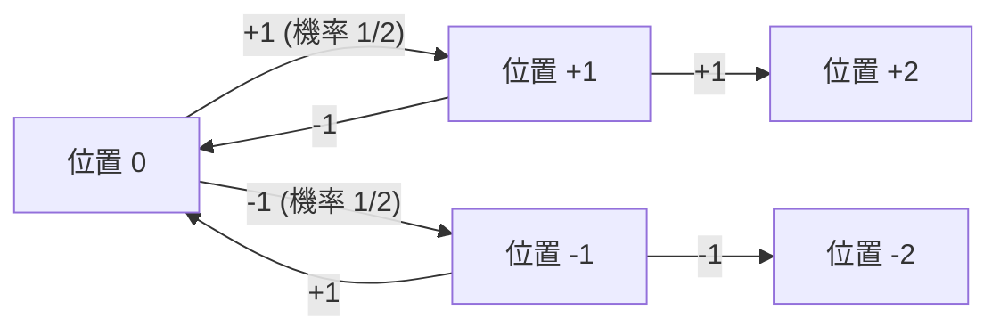
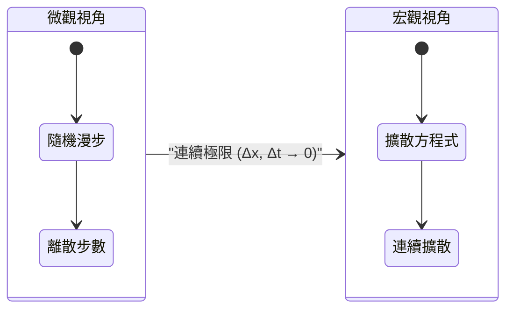
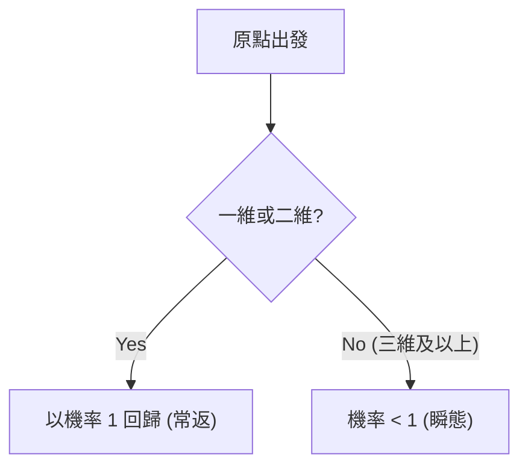

# 引言：什麼是[隨機漫步](https://kenji.blog/zh-tw/p/random-walk/)？

[隨機漫步](https://kenji.blog/zh-tw/p/random-walk/)（[Random Walk](https://kenji.blog/zh-tw/p/random-walk/)）是一個數學概念，指的是下一步的位置由機率隨機決定的運動。由於它類似於醉漢搖搖晃晃地左右行走的模樣，因此常被稱為「醉漢漫步」。乍看之下，這是一種無序且不可預測的運動，但是當步驟數量累積到一定程度後，就會浮現出令人驚嘆的、美麗且有規律的數學法則。

在本文中，我們將從最簡單的一維[隨機漫步](https://kenji.blog/zh-tw/p/random-walk/)的基礎出發，結合數學公式，深入探討它如何與物理學中的擴散現象和布朗運動聯繫起來，以及高維空間中隨機漫步的有趣性質。對[隨機漫步](https://kenji.blog/zh-tw/p/random-walk/)的理解，不僅僅侷限於物理學和數學，更已成為金融工程、資訊科學等現代眾多領域必不可少的素養。

## 歷史背景：卡爾·皮爾森的提問

「[隨機漫步](https://kenji.blog/zh-tw/p/random-walk/)」這一術語首次在學術上使用，是在 1905 年英國數理統計學家卡爾·皮爾森（Karl Pearson）向科學雜誌《自然》投稿的一篇簡短提問文章中。他提出了以下問題：

> 「一個人從原點出發，向隨機方向走直線距離 $l$。重複 $n$ 次後，其距離出發點在 $r$ 和 $r + dr$ 之間的機率是多少？」

針對這一問題，瑞利男爵（Lord Rayleigh）指出，這完全可以直接套用他自己在聲學研究中關於「多個聲波疊加」的數學公式。這成為了[隨機漫步](https://kenji.blog/zh-tw/p/random-walk/)理論被廣泛認知的契機。

## 一維[隨機漫步](https://kenji.blog/zh-tw/p/random-walk/)的嚴密數學表述

### 機率性移動的定義

讓我們考慮最簡單的一維[隨機漫步](https://kenji.blog/zh-tw/p/random-walk/)。假設位於數線上原點 $x = 0$ 的粒子，每單位時間以機率 $p$ 向右移動 $+1$，以機率 $q = 1 - p$ 向左移動 $-1$。在這裡，我們僅處理最簡單的 $p = q = 1/2$ 的對稱隨機漫步（Symmetric [Random Walk](https://kenji.blog/zh-tw/p/random-walk/)）。

假設第 $i$ 步的移動量為隨機變數 $X_i$，則 $X_i$ 取以下值：

$$
X_i = \begin{cases} 
+1 & (\text{機率 } 1/2) \\ 
-1 & (\text{機率 } 1/2) 
\end{cases}
$$

走過 $n$ 步後，粒子的位置 $S_n$ 可以表示為每一步移動量的總和：

$$
S_n = X_1 + X_2 + \dots + X_n = \sum_{i=1}^n X_i
$$



### 到達機率與二項分佈

假設在 $n$ 步的移動中，向右走了 $k$ 步，向左走了 $n - k$ 步。此時的位置 $S_n$ 如下所示：

$$
S_n = k \times (+1) + (n - k) \times (-1) = 2k - n
$$

若要使得位置為 $m$，由 $m = 2k - n$ 可知，必須剛好向右移動 $k = (n + m) / 2$ 次。因此，到達位置 $m$ 的機率 $P(S_n = m)$ 可以使用二項分佈表示如下：

$$
P(S_n = m) = \binom{n}{\frac{n+m}{2}} \left( \frac{1}{2} \right)^n
$$

需要注意的是，如果 $n$ 和 $m$ 的奇偶性不一致，則該機率為 $0$。

## 期望值與變異數的計算：搖擺的擴散

接下來，讓我們考察位置 $S_n$ 的統計性質。首先，求出 $X_i$ 的期望值 $E[X_i]$ 與變異數 $V(X_i)$。

$$
E[X_i] = (+1) \times \frac{1}{2} + (-1) \times \frac{1}{2} = 0
$$

$$
V(X_i) = E[X_i^2] - (E[X_i])^2 = (1)^2 \times \frac{1}{2} + (-1)^2 \times \frac{1}{2} - 0 = 1
$$

由於每一步的移動 $X_i$ 相互獨立，因此第 $n$ 步的位置 $S_n$ 的期望值與變異數如下：

$$
E[S_n] = \sum_{i=1}^n E[X_i] = 0
$$

$$
V(S_n) = \sum_{i=1}^n V(X_i) = n
$$

這個結果非常重要。期望值為 $0$ 意味著 **平均而言，粒子會停留在原點**。然而，由於變異數與 $n$ 成正比增加，標準差（離散程度的指標）變為 $\sqrt{n}$。換句話說，隨著步數 $n$ 的增加，粒子的存在範圍會以 $\sqrt{n}$ 的量級逐漸擴大。時間以 $n$ 推進，而移動距離卻只以 $\sqrt{n}$ 推進，這種低效性正是[隨機漫步](https://kenji.blog/zh-tw/p/random-walk/)的最大特徵。

## 史特靈公式與中央極限定理：向高斯分佈的收斂

當步數 $n$ 極大時，二項分佈的計算會變得非常困難。在這裡，如果我們使用階乘的近似公式——史特靈公式（Stirling's approximation） $n! \approx \sqrt{2\pi n} (n/e)^n$ 來評估二項式係數，離散的機率分佈將收斂為連續的 **常態分佈**（高斯分佈）。

將位置 $x$ 視為連續變數，並考慮變異數為 $n$，則機率密度函數 $f(x, n)$ 將漸近於以下形式：

$$
f(x, n) \approx \frac{1}{\sqrt{2\pi n}} \exp\left( - \frac{x^2}{2n} \right)
$$

這正是中央極限定理最直接的體現：獨立同分佈的隨機變數之和會收斂於常態分佈。

## 擴散方程式（熱傳導方程式）的推導：從離散到連續

雖然[隨機漫步](https://kenji.blog/zh-tw/p/random-walk/)是描述微觀粒子運動的模型，但若從宏觀的連續極限來看，就可以將其理解為 **擴散方程式**。

將空間劃分為微小間隔 $\Delta x$，將時間劃分為微小間隔 $\Delta t$。設粒子在位置 $x$、時間 $t$ 存在的機率為 $P(x, t)$。
在時刻 $t + \Delta t$ 粒子存在於位置 $x$ 的機率，是時刻 $t$ 時從位置 $x - \Delta x$ 或 $x + \Delta x$ 移動過來的機率之和。

$$
P(x, t + \Delta t) = \frac{1}{2} P(x - \Delta x, t) + \frac{1}{2} P(x + \Delta x, t)
$$

將等式兩邊同時減去 $P(x, t)$，並變形如下：

$$
P(x, t + \Delta t) - P(x, t) = \frac{1}{2} \left[ P(x - \Delta x, t) - 2P(x, t) + P(x + \Delta x, t) \right]
$$

兩邊同時除以 $\Delta t$，右邊則乘以 $(\Delta x)^2 / (\Delta x)^2$：

$$
\frac{P(x, t + \Delta t) - P(x, t)}{\Delta t} = \frac{(\Delta x)^2}{2 \Delta t} \frac{P(x - \Delta x, t) - 2P(x, t) + P(x + \Delta x, t)}{(\Delta x)^2}
$$

在此取極限 $\Delta x \to 0$ 及 $\Delta t \to 0$。在極限情況下，假設 $D = \lim \frac{(\Delta x)^2}{2 \Delta t}$ 成為一個有限常數（擴散係數），那麼左邊就變成了對時間的一階偏導，右邊變成了對空間的二階偏導，從而得到以下偏微分方程式：

$$
\frac{\partial P}{\partial t} = D \frac{\partial^2 P}{\partial x^2}
$$

這就是 **擴散方程式**，它與物理學中的熱傳導方程式形式完全相同。這正是微觀的隨機運動在數學上被證明可以表達宏觀的連續擴散的瞬間。



## 布朗運動與維納過程：愛因斯坦的貢獻

將[隨機漫步](https://kenji.blog/zh-tw/p/random-walk/)連續化後便得到了 **布朗運動**（Brownian Motion）。

1827 年，植物學家羅伯特·布朗發現，水中花粉釋放出的微粒在做不規則運動。這個長期成謎的現象，在 1905 年被阿爾伯特·愛因斯坦透過數學解釋為「水分子隨機碰撞微粒引起的[隨機漫步](https://kenji.blog/zh-tw/p/random-walk/)」。愛因斯坦利用擴散方程式，推導出微粒的均方位移與時間成正比 $\langle x^2 \rangle = 2Dt$。

在數學上，將布朗運動嚴格表述的過程稱為 **維納過程** $W(t)$。它滿足以下性質：

1. $W(0) = 0$
2. 增量 $W(t) - W(s)$ 服從常態分佈 $\mathcal{N}(0, t-s)$。
3. 具有獨立增量。
4. 軌跡在機率 $1$ 下是連續的，但 **處處不可導**。

## 向高維的擴展：波利亞復發定理

若將空間擴展到二維（平面）或三維（立體），就會出現一個非常有趣的定理。這就是由喬治·波利亞（George Pólya）在 1921 年證明的 **波利亞復發定理**。

在無限大的網格空間中進行[隨機漫步](https://kenji.blog/zh-tw/p/random-walk/)時，重新回到出發點（原點）的機率（復發機率）會因維度的不同而不同。

- **一維** 和 **二維** 的情況：復發機率為 $1$（100%）。只要花無限的時間，一定能回到原點。
- **三維** 及以上的情況：復發機率小於 $1$（三維約為 $0.3405$）。存在永遠回不到原點的正機率。

關於這一點，角谷靜夫有一個著名的笑話：

> "A drunk man will find his way home, but a drunk bird may get lost forever."
> （醉漢總能找到回家的路，但喝醉的鳥可能會永遠迷失）

在地面（二維）行走的醉漢無論花多長時間總能回到起點，但是在天空（三維）飛翔的鳥卻因為空間太過廣闊而可能迷路。



## 金融工程中的應用：幾何布朗運動與布萊克-休斯方程式

[隨機漫步](https://kenji.blog/zh-tw/p/random-walk/)的理論並不僅僅停留在物理學中。在效率市場假說下，金融市場的股價波動也被認為服從[隨機漫步](https://kenji.blog/zh-tw/p/random-walk/)。

為了確保股價 $S_t$ 不取負值，通常採用對數常態分佈假設，將其建模為 **幾何布朗運動**（Geometric Brownian Motion）：

$$
dS_t = \mu S_t dt + \sigma S_t dW_t
$$

其中，$\mu$ 是漂移率（期望報酬率），$\sigma$ 是波動率（價格波動率），$W_t$ 是維納過程。以此模型為基礎，推導出了用於計算選擇權合理價格的 **布萊克-休斯方程式**（Black-Scholes Equation），從而奠定了現代金融工程的基石。

## 使用 Python 模擬[隨機漫步](https://kenji.blog/zh-tw/p/random-walk/)

除了理論之外，透過實際執行程式進行視覺化也能加深理解。讓我們使用 Python 進行二維[隨機漫步](https://kenji.blog/zh-tw/p/random-walk/)的模擬吧。

```python
import numpy as np
import matplotlib.pyplot as plt

def simulate_random_walk_2d(steps):
    """
    模擬二維隨機漫步的函數
    """
    # 上下左右 4 個方向的移動向量
    directions = np.array([[1, 0], [-1, 0], [0, 1], [0, -1]])
    
    # 在每一步中隨機選擇 0〜3 的索引
    random_steps = np.random.randint(0, 4, size=steps)
    movements = directions[random_steps]
    
    # 透過累積求和計算軌跡（從原點[0,0]開始）
    path = np.vstack([[0, 0], np.cumsum(movements, axis=0)])
    return path

# 50000 步的模擬
steps = 50000
path = simulate_random_walk_2d(steps)

# 繪圖設定
plt.figure(figsize=(10, 10))
plt.plot(path[:, 0], path[:, 1], alpha=0.6, color='royalblue', linewidth=0.5)
plt.scatter(0, 0, color='red', marker='x', s=150, label='Start', zorder=5)
plt.scatter(path[-1, 0], path[-1, 1], color='darkorange', marker='o', s=100, label='End', zorder=5)

plt.title(f"2D Random Walk ({steps} steps)", fontsize=16)
plt.xlabel("X axis", fontsize=12)
plt.ylabel("Y axis", fontsize=12)
plt.legend(fontsize=12)
plt.grid(True, linestyle='--', alpha=0.7)
plt.axis('equal')
plt.show()
```

執行這段程式碼後，會繪製出在平面上隨機遊走的軌跡。雖然局部來看是完全隨機的，但是從整體觀察，你會發現它具有碎形般的自我相似結構的優美圖案。

## 結語

在本文中，我們從最簡單的「醉漢漫步」出發，詳細講解了與[隨機漫步](https://kenji.blog/zh-tw/p/random-walk/)相關的數學背景，包括中央極限定理向高斯分佈的收斂、擴散方程式的推導、愛因斯坦對布朗運動的解釋、波利亞定理，以及在金融工程中的應用。

從極其簡單、無序的規則的反覆中，自然而然地浮現出支配宏觀世界的普遍法則（微分方程式和常態分佈），這是數學和物理學中最具魅力且令人感動的側面之一。[隨機漫步](https://kenji.blog/zh-tw/p/random-walk/)這一概念，在未來也必定會繼續作為解開各種未知現象的強大武器。
