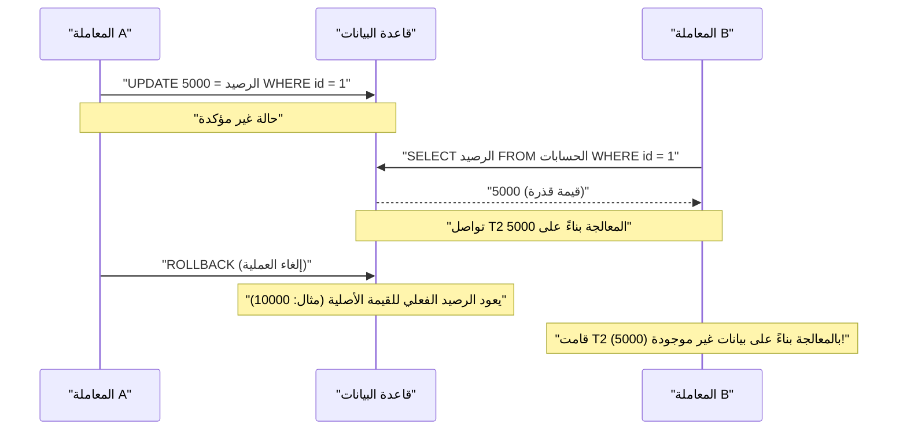

في أنظمة إدارة قواعد البيانات العلائقية (RDBMS)، يعتبر المفهوم الأساسي والأكثر أهمية لحماية سلامة البيانات واتساقها، وضمان موثوقية النظام هو **المعاملة** (Transaction).

في تطبيقات الويب الحديثة وأنظمة الشركات، يقوم العديد من المستخدمين بقراءة وكتابة البيانات في قاعدة البيانات في نفس الوقت. يُعد الفهم العميق للآليات التي تضمن معالجة البيانات بشكل صحيح وبدون تعارض في بيئة المعالجة المتزامنة هذه، مهارة أساسية لمهندسي الواجهة الخلفية (Backend) ومسؤولي قواعد البيانات.

في هذه المقالة، سنشرح بالتفصيل وبشكل شامل الأساس النظري الذي يدعم معاملات قاعدة البيانات وهي **خصائص ACID** ، مرورًا بمختلف **الحالات الشاذة (Anomaly)** التي يمكن أن تحدث عند تنفيذ عدة معاملات في وقت واحد، وكيفية منع هذه الحالات الشاذة من خلال **مستوى عزل المعاملات (Isolation Level)** . علاوة على ذلك، سنتعمق في الطرق الملموسة لحماية البيانات من التعارضات، مثل **القفل المتشائم** و **القفل المتفائل** ، بالإضافة إلى **MVCC (التحكم المتزامن متعدد الإصدارات)** المعتمد على نطاق واسع في أنظمة RDBMS الحديثة.

---

## 1. ما هي المعاملة؟

تشير **المعاملة** إلى "مجموعة من العمليات غير القابلة للتجزئة" على قاعدة البيانات.
إنها آلية تتعامل مع عبارات SQL المتعددة (إضافة، تحديث، حذف البيانات، إلخ) كوحدة عمل منطقية واحدة، وتضمن إما "نجاحها بالكامل وانعكاسها على قاعدة البيانات ( **Commit** )"، أو "فشلها في المنتصف وعودة الحالة إلى ما كانت عليه دون أي انعكاس ( **Rollback** )".

### 1.1 مثال على التحويل البنكي (الحاجة إلى المعاملات)

عند شرح أهمية المعاملات، غالبًا ما يُستخدم مثال التحويل البنكي (تحويل الأموال).
على سبيل المثال، عملية "تحويل 10,000 ين من حساب A إلى حساب B" تنقسم في قاعدة البيانات إلى الخطوتين التاليتين (عمليات التحديث):

1. خصم 10,000 ين من رصيد حساب A (UPDATE)
2. إضافة 10,000 ين إلى رصيد حساب B (UPDATE)

ماذا لو حدث عطل في النظام أو خطأ في الشبكة مباشرة بعد نجاح الخطوة 1، ولم يتم تنفيذ الخطوة 2؟
سيتم خصم 10,000 ين من حساب A، ولكن لن يتم إيداع 10,000 ين في حساب B، مما يؤدي إلى **عدم اتساق في البيانات** وهو أمر كارثي للنظام المالي.

يمكن منع حدوث مثل هذه الحالات باستخدام المعاملات.

```sql
BEGIN TRANSACTION; -- بدء المعاملة

-- 1. خصم 10000 ين من حساب A
UPDATE accounts
SET balance = balance - 10000
WHERE account_id = 'A' AND balance >= 10000;

-- 2. إضافة 10000 ين إلى حساب B
UPDATE accounts
SET balance = balance + 10000
WHERE account_id = 'B';

COMMIT; -- يتم التأكيد فقط إذا نجحت جميع العمليات
-- ※ إذا حدث خطأ سيتم التراجع (ROLLBACK)، وكأن عملية الخصم في الخطوة 1 لم تحدث
```

بهذه الطريقة، فإن الدور الأكبر للمعاملة هو الحفاظ على سلامة قاعدة البيانات عن طريق تجميع عدة عمليات تحديث مرتبطة كوحدة واحدة غير قابلة للتجزئة.

---

## 2. خصائص ACID (المتطلبات الأربعة للمعاملة)

هناك أربع خصائص يجب الوفاء بها لضمان تنفيذ المعاملة بأمان، وتُعرف باسم **خصائص ACID** (تؤخذ من الحروف الأولى لكل خاصية). تمتلك أنظمة RDBMS آليات داخلية معقدة لضمان خصائص ACID هذه.

### 2.1 الذرية (Atomicity)
**الذرية** (Atomicity) هي الخاصية التي تضمن أن جميع العمليات داخل المعاملة "إما أن تُنفذ بالكامل، أو لا تُنفذ على الإطلاق (All or Nothing)".
كما في مثال التحويل البنكي السابق، إذا فشلت العملية في المنتصف، يجب أن يتم التراجع بالكامل ( **Rollback** ) عن التغييرات المنفذة بالفعل وإعادتها إلى الحالة التي كانت عليها قبل بدء المعاملة. لا يُسمح بترك حالة غير مكتملة (Commit جزئي) في قاعدة البيانات.

### 2.2 الاتساق ([Consistency](https://kenji.blog/ar/p/cap-theorem-distributed-systems-tradeoff/))
**الاتساق** (Consistency) هو الخاصية التي تضمن الوفاء المستمر بقواعد (قيود) قاعدة البيانات قبل وبعد تنفيذ المعاملة.
يمكن تعريف القواعد التي يجب أن تستوفيها البيانات في قاعدة البيانات، مثل قيد المفتاح الأساسي (Primary Key)، وقيد المفتاح الأجنبي (Foreign Key)، وقيد الفريد (Unique)، وقيد الفحص (Check). لا يُسمح للمعاملة بتحديث البيانات بطريقة تنتهك هذه القيود، وإذا حدث انتهاك، يتم التراجع فورًا. بمعنى آخر، المعاملة لها دور في نقل قاعدة البيانات من "حالة متسقة" إلى "حالة متسقة أخرى".

### 2.3 العزل (Isolation)
**العزل** (Isolation) هو الخاصية التي تضمن أنه حتى في حالة تنفيذ عدة معاملات في نفس الوقت، فإن كل معاملة لا تؤثر ولا تتأثر بعملية تنفيذ (الحالة المتوسطة) للمعاملات الأخرى.
العزل المثالي يعني أن نتيجة التنفيذ المتزامن لعدة معاملات متطابقة تمامًا مع نتيجة تنفيذها بشكل متسلسل واحدًا تلو الآخر (ويسمى هذا **القابلية للتسلسل** ). ومع ذلك، فإن محاولة ضمان العزل الكامل ستقلل بشكل كبير من أداء المعالجة المتزامنة (الإنتاجية) للنظام، لذلك توفر أنظمة RDBMS الفعلية **مستويات العزل** (كما سيتم شرحه لاحقًا) لضبط التوازن بين الأداء والعزل.

### 2.4 المتانة (Durability)
**المتانة** (Durability) هي الخاصية التي تضمن أنه بمجرد أن يتم **تأكيد** (Commit) المعاملة، لن تُفقد نتيجتها أبدًا حتى لو حدث عطل في النظام (انقطاع التيار الكهربائي، تعطل، إلخ).
عادةً ما تقوم RDBMS بتحديث البيانات في الذاكرة (Buffer Pool) وتكتبها في القرص بشكل غير متزامن، ولكن عند الـ Commit، تقوم دائمًا بتسجيل محتوى التحديث (سجل التغييرات) كـ **سجل الكتابة المسبق** (WAL: Write-Ahead Log أو REDO Log) في وحدة تخزين دائمة مثل القرص. يتيح هذا استعادة (Recovery) الحالة المؤكدة باستخدام السجل عند إعادة التشغيل في حالة تعطل قاعدة البيانات.

---

## 3. التحكم المتزامن والحالات الشاذة للمعاملات (Anomaly)

عند وصول العديد من المستخدمين أو التطبيقات إلى قاعدة البيانات في نفس الوقت وتنفيذ المعاملات بالتوازي، إذا لم يتم التحكم بشكل صحيح، ستحدث العديد من حالات **عدم اتساق البيانات (الحالات الشاذة Anomaly)** . قبل فهم مستويات العزل، من الضروري معرفة ماهية هذه الحالات الشاذة.

### 3.1 القراءة القذرة (Dirty Read)
**القراءة القذرة** هي ظاهرة تقوم فيها إحدى المعاملات بقراءة **بيانات تم تحديثها بواسطة معاملة أخرى ولم يتم تأكيدها بعد (غير مؤكدة)** .

يوضح مخطط التسلسل التالي عملية حدوث القراءة القذرة.



إذا قامت المعاملة A بالتراجع عن العملية، فإن المعاملة B تكون قد تقدمت في المعالجة بناءً على "بيانات وهمية لم تكن موجودة في قاعدة البيانات أصلًا"، مما يتسبب في خطأ منطقي قاتل.

### 3.2 القراءة غير القابلة للتكرار (Non-repeatable Read)
**القراءة غير القابلة للتكرار** هي ظاهرة تحدث عند تنفيذ نفس الاستعلام مرتين داخل نفس المعاملة، وبسبب قيام معاملة أخرى **بتحديث وتأكيد** البيانات في تلك الأثناء، تختلف النتيجة (القيمة) المقروءة بين المرة الأولى والثانية.

1. المعاملة A تقوم بعمل SELECT للصف `id=1` (القيمة ولتكن 100).
2. المعاملة B تقوم بعمل UPDATE للصف `id=1` إلى 200 وتقوم بالـ Commit.
3. عندما تقوم المعاملة A بعمل SELECT لنفس الصف `id=1` مرة أخرى، تكون القيمة قد تغيرت إلى 200.

من منظور المعاملة A، تواجه حالة غير متسقة حيث "البيانات تتغير في كل مرة تُقرأ فيها، على الرغم من أنها لم تُجرِ أي تغييرات".

### 3.3 القراءة الوهمية (Phantom Read)
**القراءة الوهمية** هي ظاهرة تحدث عند تنفيذ نفس الاستعلام مع نفس شروط البحث (بحث في نطاق، إلخ) مرتين داخل نفس المعاملة، وتقوم معاملة أخرى في تلك الأثناء **بإضافة (INSERT) أو حذف (DELETE)** بيانات وتأكيدها، مما يؤدي إلى ظهور صفوف لم تكن موجودة (أو اختفاء صفوف كانت موجودة) في المرة الأولى عند قراءتها في المرة الثانية.

بينما تنتج القراءة غير القابلة للتكرار عن **تحديث صف موجود (UPDATE)** ، فإن القراءة الوهمية تشير إلى ظاهرة يتغير فيها عدد الصفوف أو البنية الخاصة بمجموعة النتائج نفسها بسبب **إضافة أو حذف صفوف (INSERT/DELETE)** .

### 3.4 التحديث المفقود (Lost Update)
**التحديث المفقود** هي ظاهرة تحدث عندما تقوم معاملات متعددة بقراءة نفس الصف في نفس الوقت، وتقوم كل منها بالحساب ثم الكتابة مرة أخرى، حيث **يتم الكتابة فوق التحديث الأول بواسطة التحديث الثاني، مما يؤدي إلى اختفائه** .

1. المعاملة A تقرأ الرصيد (10000 ين).
2. المعاملة B تقرأ أيضًا نفس الرصيد (10000 ين).
3. المعاملة A تضيف 1000 ين، وتقوم بعمل UPDATE للرصيد إلى 11000 ين وتؤكد (Commit).
4. المعاملة B تخصم 2000 ين، وتقوم بعمل UPDATE للرصيد إلى 8000 ين وتؤكد (Commit).

ونتيجة لذلك، يصبح الرصيد في قاعدة البيانات 8000 ين. لقد تم الكتابة فوق عملية "إضافة 1000 ين" التي أجرتها المعاملة A بالكامل وفُقدت بواسطة تحديث المعاملة B. إذا تمت معالجتها بالترتيب الصحيح، يجب أن يصبح الرصيد 9000 ين. هذه مشكلة خطيرة تحدث بشكل متكرر في نمط المعالجة حيث يقرأ التطبيق البيانات في الذاكرة ثم يقوم بالحساب.

---

## 4. مستويات عزل المعاملات حسب معيار ANSI SQL

لمنع الحالات الشاذة المذكورة أعلاه، يحدد معيار ANSI SQL أربعة **مستويات لعزل المعاملات** (Isolation Level). كلما تم تعيين مستوى العزل أعلى (أكثر صرامة)، أصبحت حماية اتساق البيانات أقوى، ولكن في نفس الوقت يزداد احتمال انتظار المعاملات الأخرى (حدوث تعارض في الأقفال)، مما يؤدي إلى انخفاض أداء المعالجة المتزامنة.

| مستوى العزل (Isolation Level) | القراءة القذرة | القراءة غير القابلة للتكرار | القراءة الوهمية |
| :--- | :---: | :---: | :---: |
| **Read Uncommitted** (قراءة غير المؤكد) | تحدث | تحدث | تحدث |
| **Read Committed** (قراءة المؤكد) | **تُمنع** | تحدث | تحدث |
| **Repeatable Read** (قراءة قابلة للتكرار) | **تُمنع** | **تُمنع** | تحدث (※) |
| **Serializable** (قابلة للتسلسل) | **تُمنع** | **تُمنع** | **تُمنع** |

*(※ في مستوى Repeatable Read الخاص بمحرك InnoDB في MySQL، يتم منع القراءة الوهمية أيضًا بشكل كبير بشكل افتراضي بفضل آليات مثل Next-Key Lock و MVCC)*

### 4.1 Read Uncommitted
هو أدنى مستوى عزل. يقوم بقراءة التغييرات التي لم تقم المعاملات الأخرى بتأكيدها بعد (تحدث القراءة القذرة). نظرًا لأن اتساق البيانات غير مضمون على الإطلاق، نادرًا ما يُستخدم في الواقع العملي باستثناء بعض عمليات التجميع التي تتطلب أداءً فائقًا على حساب الدقة الصارمة. في بعض أنظمة DBMS مثل PostgreSQL، حتى إذا قمت بتحديد هذا المستوى، فإنه يعمل داخليًا كـ Read Committed.

### 4.2 Read Committed
هو مستوى العزل الافتراضي المعتمد في العديد من أنظمة RDBMS (الإعداد الافتراضي في Oracle، PostgreSQL، SQL Server).
البيانات التي تقرأها المعاملة تقتصر دائمًا على البيانات **المؤكدة** فقط. هذا يمنع القراءة القذرة، ولكن إذا قامت معاملة أخرى بتحديث البيانات وتأكيدها أثناء تنفيذ معاملتك، فسيتم قراءتها، وبالتالي تحدث القراءة غير القابلة للتكرار والقراءة الوهمية.

### 4.3 Repeatable Read
مستوى العزل الافتراضي في محرك MySQL (InnoDB).
يُضمن أن تكون مجموعة البيانات المقروءة في بداية المعاملة متسقة وفي نفس الحالة حتى نهاية المعاملة. بمعنى أنه حتى لو قامت معاملة أخرى بتحديث وتأكيد البيانات المعنية أثناء المعاملة الخاصة بك، فستظل ترى البيانات القديمة (عند نقطة البداية). هذا يمنع القراءة غير القابلة للتكرار.
ومع ذلك، وفقًا للتعريف الصارم لمعيار ANSI، يمكن أن تحدث القراءة الوهمية لإضافة أو حذف الصفوف (كما ذكرنا أعلاه، في MySQL InnoDB، يتم قمع القراءة الوهمية أيضًا حسب التنفيذ).

### 4.4 Serializable
هو مستوى العزل الأكثر صرامة، ويضمن نتيجة كما لو تم تنفيذ المعاملات بشكل متسلسل تمامًا (Serial). يمكن أن يمنع جميع الحالات الشاذة (القراءة القذرة، والقراءة غير القابلة للتكرار، والقراءة الوهمية) تمامًا.
لكن لتحقيق ذلك، يتطلب أقفالًا واسعة النطاق (أقفال على مستوى الجدول أو النطاق) أو آليات معقدة لاكتشاف التعارض (مثل SSI: Serializable Snapshot Isolation)، مما يضحي بأداء المعالجة المتزامنة بشكل كبير، ويزيد من مخاطر كثرة التراجع عن المعاملات (Retry بسبب أخطاء التعارض).

---

## 5. آليات تنفيذ التحكم المتزامن (الأقفال و MVCC)

كيف تقوم أنظمة RDBMS بتنفيذ المتطلبات المنطقية لمستويات العزل على أرض الواقع؟ تاريخياً، كانت **آلية القفل** هي السائدة، ولكن في العصر الحديث، أصبح استخدام **MVCC** واسع الانتشار لتحسين أداء المعالجة المتزامنة.

### 5.1 التحكم المعتمد على القفل (القفل المتشائم)
قامت أنظمة RDBMS التقليدية بتنفيذ التحكم الحصري عن طريق وضع "أقفال" على الموارد (الصفوف أو الجداول).
- **القفل المشترك (S Lock / Shared Lock)** : يتم الحصول عليه عند قراءة البيانات. يمكن للمعاملات الأخرى أيضًا الحصول على قفل مشترك والقراءة في نفس الوقت، لكن لا يمكن تغيير البيانات (الحصول على X Lock).
- **القفل الحصري (X Lock / Exclusive Lock)** : يتم الحصول عليه عند تحديث أو حذف البيانات. لا يمكن للمعاملات الأخرى القراءة (S Lock) ولا التحديث (X Lock)، وتُجبر على الانتظار (Block).

التحكم المعتمد على الأقفال موثوق، ولكن له عيب كبير وهو **"عملية القراءة تحجب عملية التحديث" و "عملية التحديث تحجب عملية القراءة"** ، مما يتسبب في انخفاض الإنتاجية، وحدوث **الجمود** (Deadlock) حيث تنتظر المعاملات بعضها البعض للإفراج عن الأقفال.

### 5.2 MVCC (التحكم المتزامن متعدد الإصدارات)
لتجاوز عيوب الأقفال، ظهر **MVCC** . تعتمده معظم أنظمة RDBMS الرئيسية الحديثة مثل PostgreSQL، MySQL (InnoDB)، و Oracle.
الفكرة الأساسية لـ MVCC هي **"عند تغيير البيانات، لا تقم بالكتابة فوق البيانات الأصلية، بل قم بإنشاء إصدار جديد (نسخة) من البيانات"** .

- **عملية القراءة** تقرأ "بيانات الإصدار السابق (لقطة Snapshot)" وقت بدء المعاملة.
- **عملية التحديث** تُنشئ "بيانات الإصدار الأحدث" بشكل جديد، وتصبح صالحة عند التأكيد (Commit).

يتيح هذا تحقيق توازي عالٍ جدًا حيث **"القراءة لا تحجب التحديث" و "التحديث لا يحجب القراءة"** ، مع ضمان الاتساق لـ Read Committed و Repeatable Read. في بيئة MVCC، تضطر العمليات اللاحقة للانتظار فقط عند تعارض الأقفال الحصرية (X Lock) (عند محاولة تحديث نفس الصف في نفس الوقت).

---

## 6. التعامل مع التعارضات في طبقة التطبيق (القفل المتشائم والقفل المتفائل)

بالإضافة إلى التحكم عبر مستويات العزل و MVCC على مستوى قاعدة البيانات، من الشائع تنفيذ تحكم قفل صريح بدمج التطبيق مع SQL، لمنع **التحديثات المفقودة** المذكورة أعلاه ولضمان اتساق البيانات لمتطلبات العمل. أكثر الطرق شيوعًا لذلك هما **القفل المتشائم** و **القفل المتفائل** .

يوضح الشكل التالي الفرق في التدفق والسلوك بين طريقتي القفل.

```mermaid
flowchart TD
    subgraph "القفل المتشائم (Pessimistic Lock)"
        P1("T1: SELECT ... FOR UPDATE")
        P2("DB: الحصول على قفل حصري على الصف المستهدف")
        P3("T2: SELECT ... FOR UPDATE")
        P4("DB: وضع T2 في وضع الانتظار (Block) حتى تحرير القفل")
        P5("T1: UPDATE & COMMIT")
        P6("DB: تحرير القفل")
        P7("T2: إنهاء الانتظار، الحصول على القفل ومتابعة المعالجة")

        P1 --> P2
        P2 --> P3
        P3 --> P4
        P4 --> P5
        P5 --> P6
        P6 --> P7
    end

    subgraph "القفل المتفائل (Optimistic Lock)"
        O1("T1: SELECT (version=1)")
        O2("T2: SELECT (version=1)")
        O3("T1: UPDATE ... WHERE version=1")
        O4("DB: نجاح (تم التحديث لـ version=2)")
        O5("T2: UPDATE ... WHERE version=1")
        O6("DB: عدد السجلات المحدثة 0 (فشل، تم اكتشاف تعارض)")
        O7("T2: معالجة الخطأ على مستوى التطبيق مثل إعادة المحاولة (Retry)")

        O1 --> O2
        O2 --> O3
        O3 --> O4
        O4 --> O5
        O5 --> O6
        O6 --> O7
    end
```



### 6.1 القفل المتشائم (Pessimistic Lock)
**القفل المتشائم** يعتمد على افتراض أن "احتمالية قيام مستخدمين آخرين بتحديث نفس البيانات في نفس الوقت مرتفعة (متشائم)"، ويقوم صراحةً بالحصول على قفل حصري على مستوى الصف في قاعدة البيانات في بداية العملية، لمنع وصول المستخدمين الآخرين تمامًا.

على مستوى SQL، يتم تنفيذه عن طريق إضافة جملة `FOR UPDATE` إلى نهاية عبارة `SELECT`.

```sql
BEGIN TRANSACTION;

-- الحصول على قفل حصري للصف المستهدف. سيتم حظر المعاملات الأخرى هنا.
SELECT balance FROM accounts WHERE account_id = 'A' FOR UPDATE;

-- تنفيذ منطق العمل (التحقق من الرصيد، الحساب، إلخ) ثم التحديث
UPDATE accounts SET balance = balance - 10000 WHERE account_id = 'A';

COMMIT; -- تحرير القفل
```

**المزايا** : يمكن منع تعارض البيانات بالكامل، ومسار المعالجة بسيط.
**العيوب** : يمكن أن يؤدي إلى انخفاض الأداء نظرًا لأنه يحجب المعاملات الأخرى طوال فترة الاحتفاظ بالقفل. إذا تم الاحتفاظ بالقفل لفترة طويلة، أو أثناء عمليات الشاشة التي تتطلب انتظار إدخال المستخدم، فقد يؤدي ذلك إلى توقف النظام بأكمله.

### 6.2 القفل المتفائل (Optimistic Lock)
**القفل المتفائل** يعتمد على افتراض أن "تعارض البيانات نادر الحدوث (متفائل)"، ولا يقوم بوضع أقفال مسبقة، بل **في اللحظة التي يُراد فيها تحديث البيانات، يتم التحقق مما إذا كان شخص آخر قد أجرى أي تغييرات** .

عادةً، يتم تنفيذه عن طريق إضافة **عمود لإدارة الإصدار (مثال: `version` INT)** أو عمود لآخر تاريخ ووقت تحديث إلى الجدول المستهدف.

```sql
-- 1. استرداد البيانات مسبقًا، والاحتفاظ بالإصدار الحالي (version = 1) في ذاكرة التطبيق
SELECT balance, version FROM accounts WHERE account_id = 'A';

-- (إجراء الحسابات على مستوى التطبيق، أو عرض شاشة التأكيد للمستخدم، إلخ)

-- 2. عند التحديث، قم بتضمين الإصدار الذي تم استرداده في جملة WHERE، وقم بزيادة الإصدار في نفس الوقت
UPDATE accounts
SET balance = balance - 10000,
    version = version + 1
WHERE account_id = 'A'
  AND version = 1; -- التحقق من مطابقته للإصدار عند القراءة
```

عند تنفيذ عبارة UPDATE هذه، يتحقق التطبيق من **عدد الصفوف المحدثة (Affected Rows)** المُرجعة من قاعدة البيانات.
- **إذا كان عدد التحديثات 1** : لم يحدث تعارض، وتم التحديث بنجاح.
- **إذا كان عدد التحديثات 0** : هذا يعني أنه في الفترة بين قراءة البيانات والتحديث، قامت معاملة أخرى بتحديث البيانات، وأصبح `version` بمقدار `2` أو أكثر (أو تم حذف الصف). في هذه الحالة، يجب على التطبيق إرجاع **خطأ حصري** للمستخدم بعبارة مثل "تم تغيير البيانات بواسطة مستخدم آخر. يرجى التحقق من أحدث المعلومات والمحاولة مرة أخرى"، أو إعادة المحاولة (Retry) تلقائيًا.

**المزايا** : لا يشغل أقفال قاعدة البيانات لفترات طويلة، لذا فهو يوفر تزامنًا عاليًا جدًا وأداءً ممتازًا. مثالي لمنع التعارض في معالجة طلبات/استجابات HTTP عديمة الحالة (Stateless) في تطبيقات الويب (بين عرض الشاشة والنقر فوق الزر).
**العيوب** : من الضروري تنفيذ معالجة التعارض (عرض الخطأ أو إعادة المحاولة) على مستوى التطبيق. في البيئات التي تتكرر فيها التعارضات بشكل كبير، يزداد العبء (Overhead) بسبب عمليات إعادة المحاولة.

---

## 7. الخاتمة

إن **المعاملات** في قاعدة البيانات ليست مجرد امتداد لـ SQL، بل هي جوهر تطوير الواجهة الخلفية (Backend) الذي يحدد موثوقية وأداء النظام بأكمله.

- فهم **خصائص ACID** ومعرفة كيف تحمي RDBMS البيانات.
- إدراك الحالات الشاذة (Anomaly) الناجمة عن المعالجة المتزامنة مثل **القراءة القذرة** ، و **القراءة الوهمية** ، و **التحديث المفقود** .
- معرفة القيم الافتراضية واختلاف السلوك لـ **مستويات العزل (Isolation Level)** بين أنظمة DBMS المختلفة (مثل الفرق بين Read Committed و Repeatable Read)، واختيار المستوى المناسب بناءً على المتطلبات.
- فهم خصائص **القفل المتشائم** و **القفل المتفائل** ، وتنفيذ التحكم الحصري الأمثل في التطبيق بناءً على خصائص منطق العمل وحركة المرور (تكرار التعارضات).

من خلال دمج هذه المعارف والتقنيات، يصبح من الممكن بناء نظام قوي "لا يتسبب في عدم اتساق البيانات ويمكنه التوسع بأداء عالٍ".
في المقال التالي، نخطط لشرح كيف يتطور التحكم في المعاملات هذا في [الأنظمة الموزعة](/ar/p/cap-theorem-distributed-systems-tradeoff/) وهندسة الخدمات المصغرة (مثل نمط Saga و 2PC). ابقوا معنا.
