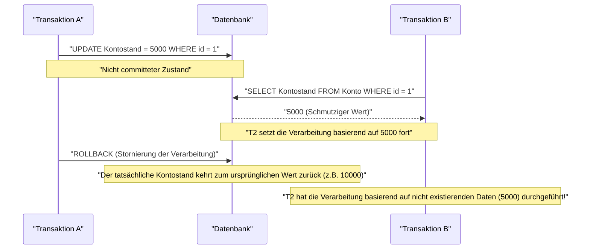

In RDBMS (Relational Database Management Systems) ist das grundlegendste und wichtigste Konzept zum Schutz der Datenintegrität und Konsistenz sowie zur Sicherstellung der Systemzuverlässigkeit die **Transaktion** (Transaction).

In modernen Webanwendungen und Unternehmenssystemen lesen und schreiben viele Benutzer gleichzeitig in die Datenbank. Ein tiefes Verständnis der Mechanismen, die sicherstellen, dass Daten in einer solchen parallelen Verarbeitungsumgebung fehlerfrei und korrekt verarbeitet werden, ist eine wesentliche Fähigkeit für Backend-Ingenieure und Datenbankadministratoren.

In diesem Artikel werden wir die **ACID-Eigenschaften**, die grundlegende Theorie hinter Datenbanktransaktionen, ausführlich und umfassend erklären. Wir behandeln auch verschiedene **Anomalien (Anomaly)**, die auftreten können, wenn mehrere Transaktionen gleichzeitig ausgeführt werden, sowie die **Transaktionsisolationsstufen (Isolation Level)**, die definieren, wie diese Anomalien verhindert werden können. Darüber hinaus werden wir uns eingehend mit spezifischen Implementierungsmethoden zum Schutz von Daten vor Konflikten befassen: **Pessimistische Sperren (Pessimistic Lock)** und **Optimistische Sperren (Optimistic Lock)**, sowie **MVCC (Multi-Version Concurrency Control)**, das in modernen RDBMS weit verbreitet ist.

---

## 1. Was ist eine Transaktion?

Eine **Transaktion** bezieht sich auf einen "unteilbaren Satz von Verarbeitungen" für eine Datenbank.
Es ist ein Mechanismus, der mehrere SQL-Anweisungen (wie das Hinzufügen, Aktualisieren und Löschen von Daten) als eine logische Arbeitseinheit behandelt und garantiert, dass entweder "alles erfolgreich ist und in der Datenbank reflektiert wird (**Commit**)" oder "unterwegs fehlschlägt und auf den ursprünglichen Zustand zurückgesetzt wird, ohne überhaupt reflektiert zu werden (**Rollback**)".

### 1.1 Beispiel Kontotransaktion (Notwendigkeit von Transaktionen)

Ein oft verwendetes Beispiel zur Erklärung der Wichtigkeit von Transaktionen ist eine Überweisung bei einer Bank.
Zum Beispiel wird der Vorgang "10.000 Yen von Person A's Konto auf Person B's Konto überweisen" in der Datenbank in die folgenden zwei Schritte (Aktualisierungsvorgänge) aufgeteilt:

1. Reduziere den Kontostand von Person A um 10.000 Yen (UPDATE)
2. Erhöhe den Kontostand von Person B um 10.000 Yen (UPDATE)

Was würde passieren, wenn direkt nach dem Erfolg von Schritt 1 ein System- oder Netzwerkfehler auftritt und Schritt 2 nicht ausgeführt wird?
Es käme zu einer **Dateninkonsistenz**, die für ein Finanzsystem fatal wäre: 10.000 Yen wurden vom Konto von Person A abgebucht, aber nicht auf das Konto von Person B eingezahlt.

Durch die Verwendung von Transaktionen können solche Situationen verhindert werden.

```sql
BEGIN TRANSACTION; -- Start der Transaktion

-- 1. 10000 Yen vom Konto von Person A abziehen
UPDATE accounts
SET balance = balance - 10000
WHERE account_id = 'A' AND balance >= 10000;

-- 2. 10000 Yen zum Konto von Person B hinzufügen
UPDATE accounts
SET balance = balance + 10000
WHERE account_id = 'B';

COMMIT; -- Nur bestätigen, wenn alle Prozesse erfolgreich waren
-- ※ Tritt ein Fehler auf, wird ein ROLLBACK durchgeführt, und die Subtraktion in 1 wird rückgängig gemacht
```

Die Hauptaufgabe einer Transaktion besteht also darin, die Datenbankintegrität zu wahren, indem zusammenhängende Aktualisierungen als eine unteilbare Einheit zusammengefasst werden.

---

## 2. ACID-Eigenschaften (Die 4 Anforderungen an Transaktionen)

Es gibt vier Eigenschaften, die eine Transaktion erfüllen muss, um sicher ausgeführt zu werden. Sie werden durch ihre Anfangsbuchstaben als **ACID-Eigenschaften** bezeichnet. Ein RDBMS verfügt über komplexe interne Mechanismen, um diese ACID-Eigenschaften zu gewährleisten.

### 2.1 Atomicity (Atomarität)
**Atomicity** (Atomarität) ist die Eigenschaft, die garantiert, dass alle Operationen innerhalb einer Transaktion entweder "ganz oder gar nicht (All or Nothing)" ausgeführt werden.
Wie im obigen Beispiel der Kontoüberweisung, muss bei einem Fehler während des Prozesses der Zustand vollständig auf den Zustand vor Beginn der Transaktion **zurückgerollt (Rollback)** werden, einschließlich aller bereits vorgenommenen Änderungen. Es dürfen keine unvollständigen Zustände (teilweise Commits) in der Datenbank verbleiben.

### 2.2 [Consistency](https://kenji.blog/de/p/cap-theorem-distributed-systems-tradeoff/) (Konsistenz)
**Consistency** (Konsistenz) ist die Eigenschaft, die sicherstellt, dass die Regeln (Einschränkungen) der Datenbank vor und nach der Ausführung der Transaktion durchgehend erfüllt sind.
In der Datenbank können Regeln wie Primärschlüssel (Primary Key), Fremdschlüssel (Foreign Key), Eindeutigkeit (Unique) und Prüfeinschränkungen (Check) definiert werden, die die Daten erfüllen müssen. Wenn durch die Transaktion aktualisierte Daten diese Einschränkungen verletzen, ist dieser Zustand nicht zulässig und es erfolgt sofort ein Rollback. Das bedeutet, dass eine Transaktion die Datenbank von einem "konsistenten Zustand" in einen "anderen konsistenten Zustand" überführt.

### 2.3 Isolation (Isolation)
**Isolation** (Isolation) ist die Eigenschaft, die verhindert, dass mehrere gleichzeitig ausgeführte Transaktionen den Ausführungsverlauf (Zwischenzustände) anderer Transaktionen beeinflussen oder davon beeinflusst werden.
Die ideale Isolation bedeutet, dass die parallele Ausführung mehrerer Transaktionen genau dasselbe Ergebnis liefert, als wenn sie nacheinander (seriell) ausgeführt worden wären (dies nennt man **Serialisierbarkeit**). Da jedoch die Gewährleistung einer vollständigen Isolation die parallele Verarbeitungsleistung (Durchsatz) des Systems erheblich verringern würde, bieten reale RDBMS **Isolationsstufen** (siehe unten) an, um den Kompromiss zwischen Leistung und Isolation anzupassen.

### 2.4 Durability (Dauerhaftigkeit)
**Durability** (Dauerhaftigkeit) ist die Eigenschaft, die sicherstellt, dass das Ergebnis einer **bestätigten (committeten)** Transaktion auch bei einem Systemausfall (Stromausfall, Absturz usw.) niemals verloren geht.
RDBMS aktualisieren Daten normalerweise im Speicher (Buffer Pool) und schreiben sie asynchron auf die Festplatte. Zum Zeitpunkt des Commits werden die Aktualisierungen (Änderungsprotokoll) jedoch immer als **Write-Ahead Log** (WAL oder REDO-Log) auf einen persistenten Speicher wie eine Festplatte geschrieben. Selbst wenn die Datenbank abstürzt, kann der committete Zustand beim Neustart anhand der Protokolle wiederhergestellt (Recovery) werden.

---

## 3. Parallelitätskontrolle und Transaktionsanomalien (Anomaly)

Wenn mehrere Benutzer oder Anwendungen gleichzeitig auf eine Datenbank zugreifen und Transaktionen parallel ausführen, können bei unzureichender Steuerung verschiedene **Dateninkonsistenzen (Anomalien)** auftreten. Als Voraussetzung für das Verständnis der Isolationsstufen ist es wichtig zu wissen, welche Anomalien existieren.

### 3.1 Dirty Read
Ein **Dirty Read** (Schmutziges Lesen) ist ein Phänomen, bei dem eine Transaktion Daten liest, die von einer anderen Transaktion aktualisiert, aber **noch nicht committet (unbestätigt)** wurden.

Das folgende Sequenzdiagramm zeigt den Prozess, bei dem ein Dirty Read auftritt:



Wenn Transaktion A die Verarbeitung zurückrollt, bedeutet dies, dass Transaktion B die Verarbeitung mit "Phantomdaten, die letztendlich nicht in der Datenbank existierten" fortgesetzt hat, was zu einem schwerwiegenden logischen Fehler führt.

### 3.2 Non-repeatable Read
Ein **Non-repeatable Read** (Nicht wiederholbares Lesen) ist ein Phänomen, bei dem dieselbe Abfrage zweimal in derselben Transaktion ausgeführt wird, aber in der Zwischenzeit eine andere Transaktion Daten **aktualisiert und committet** hat, sodass die beim ersten und zweiten Mal gelesenen Ergebnisse (Werte) unterschiedlich sind.

1. Transaktion A wählt die Zeile mit `id=1` aus (Wert ist 100).
2. Transaktion B aktualisiert die Zeile mit `id=1` auf 200 und committet.
3. Transaktion A wählt die Zeile mit `id=1` erneut aus, und der Wert hat sich auf 200 geändert.

Aus Sicht von Transaktion A entsteht ein inkonsistenter Zustand, in dem sich "die Daten jedes Mal ändern, wenn sie gelesen werden, obwohl sie selbst nichts geändert hat".

### 3.3 Phantom Read
Ein **Phantom Read** (Phantomlesen) ist ein Phänomen, bei dem dieselbe Abfrage mit denselben Suchbedingungen (z. B. Bereichssuche) zweimal in derselben Transaktion ausgeführt wird, aber in der Zwischenzeit eine andere Transaktion neue Daten **hinzugefügt (INSERT) oder gelöscht (DELETE)** und committet hat, sodass Zeilen, die beim ersten Mal nicht existierten (oder existierten), beim zweiten Mal erscheinen (oder verschwinden).

Während das Non-repeatable Read durch die **Aktualisierung bestehender Zeilen (UPDATE)** verursacht wird, bezieht sich das Phantom Read auf ein Phänomen, bei dem sich die Anzahl der Zeilen oder die Struktur des Resultsets selbst durch das **Hinzufügen oder Löschen von Zeilen (INSERT/DELETE)** ändert.

### 3.4 Lost Update
Ein **Lost Update** (Verlorenes Update) ist ein Phänomen, bei dem mehrere Transaktionen dieselbe Zeile gleichzeitig lesen, jede eine Berechnung durchführt und dann beim Zurückschreiben des Updates **das spätere Update das frühere Update überschreibt und vernichtet**.

1. Transaktion A liest den Kontostand (10000 Yen).
2. Transaktion B liest denselben Kontostand (10000 Yen).
3. Transaktion A addiert 1000 Yen, aktualisiert den Kontostand auf 11000 Yen und committet.
4. Transaktion B subtrahiert 2000 Yen, aktualisiert den Kontostand auf 8000 Yen und committet.

Als Ergebnis beträgt der Kontostand in der Datenbank 8000 Yen. Die von Transaktion A durchgeführte "Addition von 1000 Yen" wurde durch das Update von Transaktion B vollständig überschrieben und ging verloren. Bei korrekter Verarbeitung sollte der Kontostand 9000 Yen betragen. Dies ist ein schwerwiegendes Problem, das häufig bei Verarbeitungsmustern auftritt, bei denen Anwendungen Daten in den Speicher laden, bevor sie Berechnungen durchführen.

---

## 4. ANSI SQL Transaktionsisolationsstufen

Um die oben genannten Anomalien zu verhindern, der ANSI SQL-Standard definiert vier **Transaktionsisolationsstufen** (Isolation Level). Je höher (strenger) die Isolationsstufe eingestellt ist, desto stärker wird die Datenkonsistenz geschützt, aber gleichzeitig steigt die Wahrscheinlichkeit, dass andere Transaktionen warten müssen (Sperrkonflikte), was die parallele Verarbeitungsleistung verringert.

| Isolationsstufe (Isolation Level) | Dirty Read | Non-repeatable Read | Phantom Read |
| :--- | :---: | :---: | :---: |
| **Read Uncommitted** (Nicht committetes Lesen) | Tritt auf | Tritt auf | Tritt auf |
| **Read Committed** (Committetes Lesen) | **Verhindert** | Tritt auf | Tritt auf |
| **Repeatable Read** (Wiederholbares Lesen) | **Verhindert** | **Verhindert** | Tritt auf (※) |
| **Serializable** (Serialisierbar) | **Verhindert** | **Verhindert** | **Verhindert** |

*(※ Beim Repeatable Read von MySQL InnoDB können Phantom Reads dank Next-Key-Sperren und MVCC-Mechanismen standardmäßig größtenteils verhindert werden)*

### 4.1 Read Uncommitted
Die niedrigste Isolationsstufe. Änderungen anderer Transaktionen, die noch nicht committet wurden, werden gelesen (Dirty Reads treten auf). Da die Datenkonsistenz überhaupt nicht garantiert ist, wird dies in der Praxis fast nie verwendet, außer für spezielle Aggregationsprozesse, die eher extreme Leistung als strikte Genauigkeit erfordern. Bei einigen DBMS wie PostgreSQL wird, selbst wenn dieses Level angegeben wird, intern Read Committed verwendet.

### 4.2 Read Committed
Die in vielen RDBMS (Standard bei Oracle, PostgreSQL, SQL Server) verwendete Standard-Isolationsstufe.
Die Daten, die eine Transaktion liest, sind immer nur **committete** Daten. Dies verhindert Dirty Reads, aber wenn eine andere Transaktion Daten während der Ausführung der eigenen Transaktion aktualisiert und committet, werden diese gelesen, sodass Non-repeatable Reads und Phantom Reads auftreten.

### 4.3 Repeatable Read
Die Standard-Isolationsstufe für MySQL (InnoDB).
Es wird garantiert, dass das zu Beginn der Transaktion gelesene Datenset bis zum Ende der Transaktion in demselben Zustand bleibt. Das heißt, selbst wenn eine andere Transaktion die entsprechenden Daten während der eigenen Transaktion aktualisiert und committet, sieht die eigene Transaktion weiterhin die alten Daten (vom Zeitpunkt des Starts). Dies verhindert Non-repeatable Reads.
Nach der strengen ANSI-Standarddefinition können jedoch Phantom Reads für das Hinzufügen/Löschen von Zeilen auftreten (wie oben erwähnt, verhindern Implementierungen wie MySQL InnoDB Phantom Reads ebenfalls weitgehend).

### 4.4 Serializable
Die strengste Isolationsstufe, die garantiert, dass die Ergebnisse so sind, als ob die Transaktionen vollständig seriell (nacheinander) ausgeführt worden wären. Alle Anomalien (Dirty Read, Non-repeatable Read, Phantom Read) können vollständig verhindert werden.
Um dies zu erreichen, sind jedoch umfangreiche Sperren (Tabellensperren oder Bereichssperren) erforderlich, oder komplexe Konflikterkennungsmechanismen (wie SSI: Serializable Snapshot Isolation) treten in Kraft, was die parallele Verarbeitungsleistung erheblich beeinträchtigt und das Risiko häufiger Transaktions-Rollbacks (Wiederholungsversuche aufgrund von Konfliktfehlern) birgt.

---

## 5. Implementierungsmechanismen der Parallelitätskontrolle (Sperren und MVCC)

Wie setzen RDBMS die logischen Anforderungen von Isolationsstufen konkret um? Historisch gesehen waren **Sperrmechanismen** der Mainstream, aber heute ist **MVCC** zur Steigerung der parallelen Verarbeitungsleistung weit verbreitet.

### 5.1 Sperrenbasierte Steuerung (Pessimistische Sperre)
Herkömmliche RDBMS führten die exklusive Steuerung durch, indem sie Ressourcen (Zeilen oder Tabellen) "abschlossen".
- **Gemeinsame Sperre (S-Sperre / Shared Lock)**: Wird beim Lesen von Daten erworben. Andere Transaktionen können ebenfalls eine gemeinsame Sperre erwerben und gleichzeitig lesen, aber die Daten können nicht geändert werden (Erwerb einer X-Sperre).
- **Exklusive Sperre (X-Sperre / Exclusive Lock)**: Wird beim Aktualisieren/Löschen von Daten erworben. Andere Transaktionen können weder lesen (S-Sperre) noch aktualisieren (X-Sperre) und werden zum Warten (Blockieren) gezwungen.

Die sperrenbasierte Steuerung ist zuverlässig, hat jedoch den großen Nachteil, dass **"Leseprozesse Aktualisierungsprozesse blockieren"** und **"Aktualisierungsprozesse Leseprozesse blockieren"**, was zu einer Verringerung des Durchsatzes führen und **Deadlocks**, bei denen man gegenseitig auf die Freigabe von Sperren wartet, verursachen kann.

### 5.2 MVCC (Multi-Version Concurrency Control)
**MVCC** wurde eingeführt, um diese Nachteile von Sperren zu überwinden. Es wird von den meisten modernen RDBMS wie PostgreSQL, MySQL (InnoDB) und Oracle verwendet.
Die Grundidee von MVCC ist, dass **"beim Ändern von Daten die ursprünglichen Daten nicht überschrieben werden, sondern eine neue Version der Daten erstellt wird"**.

- **Leseprozesse** lesen die "Datenversion der Vergangenheit (Snapshot)" zum Zeitpunkt des Starts der Transaktion.
- **Aktualisierungsprozesse** erstellen eine neue "neueste Datenversion", die erst gültig wird, wenn sie committet wurde.

Dadurch wird eine extrem hohe Parallelität erreicht, bei der **"Lesen Aktualisierungen nicht blockiert"** und **"Aktualisierungen Lesen nicht blockieren"**, während die Konsistenz von Read Committed und Repeatable Read gewährleistet wird. In einer MVCC-Umgebung werden nachfolgende Prozesse nur dann in die Warteschlange gestellt, wenn exklusive Sperren (X-Sperren) miteinander in Konflikt geraten (wenn versucht wird, dieselbe Zeile gleichzeitig zu aktualisieren).

---

## 6. Maßnahmen gegen Konflikte auf Anwendungsebene (Pessimistische und Optimistische Sperren)

Zusätzlich zur Steuerung der Isolationsstufen und MVCC auf Datenbankebene ist es üblich, Anwendungslogik und SQL zu kombinieren, um eine explizite Sperrsteuerung durchzuführen, insbesondere um das erwähnte **Lost Update** zu verhindern und die Datenkonsistenz im Geschäftsbetrieb sicherzustellen. Die repräsentativen Methoden dafür sind **Pessimistische Sperren (Pessimistic Lock)** und **Optimistische Sperren (Optimistic Lock)**.

Das folgende Diagramm vergleicht den Ablauf und das Verhalten der beiden Sperrverfahren.

```mermaid
flowchart TD
    subgraph "Pessimistische Sperre (Pessimistic Lock)"
        P1("T1: SELECT ... FOR UPDATE")
        P2("DB: Exklusive Sperre auf der Zielzeile erwerben")
        P3("T2: SELECT ... FOR UPDATE")
        P4("DB: T2 blockieren, bis Sperre freigegeben wird")
        P5("T1: UPDATE & COMMIT")
        P6("DB: Sperre freigeben")
        P7("T2: Blockierung aufgehoben, Sperre erwerben & Verarbeitung fortsetzen")

        P1 --> P2
        P2 --> P3
        P3 --> P4
        P4 --> P5
        P5 --> P6
        P6 --> P7
    end

    subgraph "Optimistische Sperre (Optimistic Lock)"
        O1("T1: SELECT (version=1)")
        O2("T2: SELECT (version=1)")
        O3("T1: UPDATE ... WHERE version=1")
        O4("DB: Erfolgreich (auf version=2 aktualisiert)")
        O5("T2: UPDATE ... WHERE version=1")
        O6("DB: 0 aktualisierte Zeilen (Fehler, Konflikt erkannt)")
        O7("T2: Fehlerbehandlung wie Retry auf Anwendungsseite")

        O1 --> O2
        O2 --> O3
        O3 --> O4
        O4 --> O5
        O5 --> O6
        O6 --> O7
    end
```



### 6.1 Pessimistische Sperre (Pessimistic Lock)
Die **pessimistische Sperre** geht von der Annahme aus, dass "die Wahrscheinlichkeit hoch ist, dass andere Benutzer dieselben Daten gleichzeitig aktualisieren (pessimistisch)", und sperrt andere Benutzer zu Beginn des Prozesses durch das explizite Erwerben einer exklusiven Sperre auf Zeilenebene in der Datenbank vollständig aus.

Auf SQL-Ebene wird dies erreicht, indem am Ende der `SELECT`-Anweisung die Klausel `FOR UPDATE` hinzugefügt wird.

```sql
BEGIN TRANSACTION;

-- Exklusive Sperre für die Zielzeile erwerben. Andere Transaktionen werden hier blockiert
SELECT balance FROM accounts WHERE account_id = 'A' FOR UPDATE;

-- Aktualisierung durchführen, nachdem die Geschäftslogik (Kontostandsprüfung, Berechnungen usw.) ausgeführt wurde
UPDATE accounts SET balance = balance - 10000 WHERE account_id = 'A';

COMMIT; -- Sperre freigeben
```

**Vorteile**: Datenkonflikte können vollständig verhindert werden, und der Prozessablauf ist einfach.
**Nachteile**: Da andere Transaktionen blockiert werden, während die Sperre gehalten wird, nimmt die Leistung tendenziell ab. Wenn Sperren während langer Transaktionen oder Bildschirmprozesse, die auf Benutzereingaben warten, aufrechterhalten werden, besteht die Gefahr, dass das gesamte System zum Stillstand kommt.

### 6.2 Optimistische Sperre (Optimistic Lock)
Die **optimistische Sperre** geht von der Annahme aus, dass "Datenkonflikte selten auftreten (optimistisch)", sperrt nicht im Voraus, sondern **überprüft im Moment der Datenaktualisierung, ob jemand anderes Änderungen vorgenommen hat**.

Im Allgemeinen wird dies implementiert, indem der Zieltabelle eine Spalte zur Versionsverwaltung hinzugefügt wird (z. B. `version` INT) oder eine Spalte mit Datum und Uhrzeit der letzten Aktualisierung.

```sql
-- 1. Daten vorab abrufen und aktuelle Version (version = 1) im Speicher der Anwendung behalten
SELECT balance, version FROM accounts WHERE account_id = 'A';

-- (Hier erfolgen Berechnungen auf der Anwendungsseite, Anzeige des Bestätigungsbildschirms für den Benutzer usw.)

-- 2. Beim Aktualisieren die abgerufene Version in die WHERE-Klausel aufnehmen und die Version gleichzeitig inkrementieren
UPDATE accounts
SET balance = balance - 10000,
    version = version + 1
WHERE account_id = 'A'
  AND version = 1; -- Überprüfen, ob sie mit der Version zum Zeitpunkt des Lesens übereinstimmt
```

Wenn diese UPDATE-Anweisung ausgeführt wird, überprüft die Anwendung die von der Datenbank zurückgegebene Anzahl der **aktualisierten Zeilen (Affected Rows)**.
- **Wenn 1 Zeile aktualisiert wurde**: Es liegt kein Konflikt vor, Aktualisierung erfolgreich abgeschlossen.
- **Wenn 0 Zeilen aktualisiert wurden**: Dies bedeutet, dass eine andere Transaktion die Daten in der Zeit zwischen dem Lesen und Aktualisieren durch die eigene Transaktion aktualisiert hat und `version` auf `2` oder höher gestiegen ist (oder die Zeile gelöscht wurde). In diesem Fall gibt die Anwendung einen **Exklusivfehler** an den Benutzer zurück, wie z. B. "Die Daten wurden von einem anderen Benutzer geändert. Bitte überprüfen Sie die neuesten Informationen und führen Sie den Vorgang erneut aus", oder führt einen automatischen Retry durch.

**Vorteile**: Da die Datenbanksperre nicht für lange Zeit belegt wird, ist die Parallelität sehr hoch und die Leistung hervorragend. Ideal zur Vermeidung von Konflikten in zustandslosen HTTP-Request/Response-Prozessen (von der Bildschirmanzeige bis zum Klick auf einen Button) in Webanwendungen.
**Nachteile**: Die Behandlung im Falle eines Konflikts (Fehleranzeige oder Retry) muss auf der Anwendungsseite implementiert werden. In Umgebungen mit häufigen Konflikten wird der Overhead der Retry-Verarbeitung groß.

---

## 7. Zusammenfassung

**Transaktionen** in Datenbanken sind nicht nur eine Erweiterung von SQL, sondern das Herzstück der Backend-Entwicklung, das die Zuverlässigkeit und Leistung des gesamten Systems bestimmt.

- Die **ACID-Eigenschaften** verstehen und wissen, wie das RDBMS die Daten schützt.
- Anomalien (Anomaly) wie **Dirty Reads**, **Phantom Reads** und **Lost Updates**, die durch parallele Verarbeitung verursacht werden, erkennen.
- Die Standardwerte und Verhaltensunterschiede (wie den Unterschied zwischen Read Committed und Repeatable Read) der **Isolationsstufen (Isolation Level)** für jedes DBMS verstehen und die geeignete Isolationsstufe je nach Anforderungen auswählen.
- Die Eigenschaften von **Pessimistischen Sperren** und **Optimistischen Sperren** verstehen und die optimale exklusive Steuerung in der Anwendung entsprechend der Geschäftslogik und den Verkehrseigenschaften (Häufigkeit von Konflikten) implementieren.

Durch die Kombination dieses Wissens und dieser Techniken ist es erstmals möglich, ein robustes System zu erstellen, das "keine Dateninkonsistenzen verursacht und mit hoher Leistung skaliert".
Im nächsten Artikel planen wir zu erklären, wie sich diese Transaktionssteuerung in verteilten Systemen und [Microservices](https://kenji.blog/de/p/microservices-architecture-bff-api-gateway/)-Architekturen entwickelt hat (Saga-Pattern, 2PC usw.). Bleiben Sie dran.
