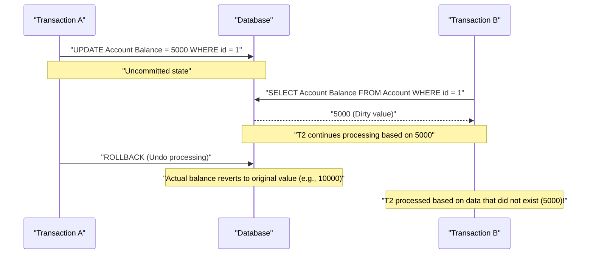

In an RDBMS (Relational Database Management System), the most fundamental and important concept for protecting data consistency and integrity, and ensuring system reliability, is the **transaction**.

In modern web applications and enterprise systems, a large number of users simultaneously read and write to the database. Deeply understanding the mechanisms to ensure data is processed correctly without contradictions in such a concurrent processing environment is a must-have skill for backend engineers and database administrators.

In this article, we will provide a very detailed and comprehensive explanation, starting from the **ACID properties**, the foundational theory supporting database transactions, to various **anomalies** that can occur when multiple transactions are executed concurrently, and the **transaction isolation levels** defined to prevent these anomalies. Furthermore, we will delve into **pessimistic locking** and **optimistic locking**, which are specific implementation methods to protect data from contention, as well as **MVCC** (Multi-Version Concurrency Control), which is widely adopted in modern RDBMS.

---

## 1. What is a Transaction?

A **transaction** refers to an "indivisible block of sequential processing" performed on a database.
It is a mechanism that treats multiple SQL statements (data insertion, update, deletion, etc.) as a single logical unit of work, ensuring that either "all of them succeed and are reflected in the database ( **commit** )" or "they fail in the middle and are not reflected at all, returning to the original state ( **rollback** )".

### 1.1 Example of Bank Transfer (Necessity of Transactions)

An example often used to explain the importance of transactions is a bank transfer (remittance).
For example, the process of "transferring 10,000 yen from A's account to B's account" is broken down into the following two steps (update processes) on the database.

1. Decrease A's account balance by 10,000 yen (UPDATE)
2. Increase B's account balance by 10,000 yen (UPDATE)

What would happen if a system failure or network error occurred immediately after step 1 succeeded, and step 2 was not executed?
10,000 yen would be deducted from A's account, but 10,000 yen would not be deposited into B's account, resulting in a fatal **data inconsistency** for a financial system.

By using transactions, we can prevent such situations.

```sql
BEGIN TRANSACTION; -- Start of transaction

-- 1. Subtract 10000 yen from A's account
UPDATE accounts
SET balance = balance - 10000
WHERE account_id = 'A' AND balance >= 10000;

-- 2. Add 10000 yen to B's account
UPDATE accounts
SET balance = balance + 10000
WHERE account_id = 'B';

COMMIT; -- Confirmed only when all processes succeed
-- * If an error occurs, it is ROLLBACKed, and the subtraction in 1 is also undone
```

In this way, the primary role of a transaction is to maintain the integrity of the database by bundling multiple related update processes into an indivisible single unit.

---

## 2. ACID Properties (Four Requirements of a Transaction)

There are four properties that a transaction must satisfy to be executed safely, and they are called the **ACID properties**, taking the first letter of each. An RDBMS has complex internal mechanisms to guarantee these ACID properties.

### 2.1 Atomicity
**Atomicity** is the property that guarantees that all operations within a transaction are either "all executed or not executed at all (All or Nothing)".
As in the bank transfer example mentioned above, if a process fails halfway, it must be completely **rolled back** (undone) to the state before the transaction started, including any changes that have already been executed. A halfway state (partial commit) is not allowed to remain in the database.

### 2.2 [Consistency](https://kenji.blog/en/p/cap-theorem-distributed-systems-tradeoff/)
**Consistency** is the property that guarantees that the rules (constraints) of the database are consistently satisfied before and after the execution of a transaction.
In a database, you can define rules that data must satisfy, such as Primary Key constraints, Foreign Key constraints, Unique constraints, and Check constraints. As a result of data being updated by a transaction, a state that violates these constraints is not allowed, and if a violation occurs, it is immediately rolled back. In other words, a transaction has the role of transitioning the database from "one consistent state" to "another consistent state".

### 2.3 Isolation
**Isolation** is the property that ensures that even if multiple transactions are executed concurrently, each transaction does not affect or is not affected by the execution process (intermediate state) of other transactions.
Ideal isolation means that the results of multiple transactions executing concurrently are exactly the same as the results of executing them one by one sequentially (this is called **serializability**). However, trying to guarantee perfect isolation significantly degrades the concurrent processing performance (throughput) of the system, so practical RDBMSs provide **isolation levels** (described later) to adjust the trade-off between performance and isolation.

### 2.4 Durability
**Durability** is the property that guarantees that once a transaction is **committed** (completed), its results will never be lost even if a system failure (power outage, crash, etc.) occurs.
An RDBMS typically updates data in memory (buffer pool) and asynchronously writes it out to disk, but at the time of commit, it always records the update contents (change history) as a **Write-Ahead Log** (WAL or REDO log) on a persistent storage such as a disk. This makes it possible to restore (recover) the committed state using the log upon restart in the unlikely event that the database crashes.

---

## 3. Concurrency Control and Transaction Anomalies

When multiple users or applications access a database simultaneously and execute transactions concurrently, various **data inconsistencies (anomalies)** occur if they are not controlled appropriately. As a prerequisite to understanding isolation levels, it is essential to understand what kind of anomalies exist.

### 3.1 Dirty Read
A **dirty read** is a phenomenon where a transaction reads data that has been updated by another transaction but **has not yet been committed (unconfirmed data)**.

The following sequence diagram shows the process of a dirty read occurring.



If Transaction A rolls back its processing, Transaction B will have continued its processing reading "phantom data that ultimately did not exist in the database," causing a fatal logical error.

### 3.2 Non-repeatable Read
A **non-repeatable read** is a phenomenon where, when the same query is executed twice within the same transaction, the results (values) read in the first and second time differ because another transaction has **updated and committed** the data in the meantime.

1. Transaction A SELECTs the row with `id=1` (value is assumed to be 100).
2. Transaction B UPDATEs the row with `id=1` to 200 and commits.
3. When Transaction A SELECTs the row with `id=1` again, the value has changed to 200.

From Transaction A's perspective, it faces an inconsistent state where "the data changes every time it is read, even though I haven't changed anything myself."

### 3.3 Phantom Read
A **phantom read** is a phenomenon where, when the same search query (such as a range search) is executed twice within the same transaction, rows that did not exist (or existed) the first time appear (or disappear) the second time because another transaction has **inserted or deleted** new data and committed it in the meantime.

While a non-repeatable read is caused by **updating existing rows (UPDATE)**, a phantom read refers to a phenomenon where the number of rows or the composition of the result set itself changes due to the **addition or deletion of rows (INSERT/DELETE)**.

### 3.4 Lost Update
A **lost update** is a phenomenon where multiple transactions read the same row at the same time, perform calculations respectively, and when they write back the updates, **the earlier update is overwritten and disappears due to the later write**.

1. Transaction A reads the balance (10000 yen).
2. Transaction B also reads the same balance (10000 yen).
3. Transaction A adds 1000 yen, UPDATEs the balance to 11000 yen, and commits.
4. Transaction B subtracts 2000 yen, UPDATEs the balance to 8000 yen, and commits.

As a result, the balance in the database becomes 8000 yen. The "addition of 1000 yen" performed by Transaction A is completely overwritten by Transaction B's update and lost. If processed in the correct order, the balance should be 9000 yen. This is a critical problem that frequently occurs in processing patterns where the application reads data into memory and then performs calculations.

---

## 4. ANSI SQL Transaction Isolation Levels

To prevent the various anomalies mentioned above, four **transaction isolation levels** are defined in the ANSI SQL standard. Setting a higher (stricter) isolation level strongly protects data consistency, but at the same time, the probability of making other transactions wait (lock contention) increases, degrading concurrent processing performance.

| Isolation Level | Dirty Read | Non-repeatable Read | Phantom Read |
| :--- | :---: | :---: | :---: |
| **Read Uncommitted** | Occurs | Occurs | Occurs |
| **Read Committed** | **Prevented** | Occurs | Occurs |
| **Repeatable Read** | **Prevented** | **Prevented** | Occurs (*) |
| **Serializable** | **Prevented** | **Prevented** | **Prevented** |

*( * In MySQL's InnoDB Repeatable Read, phantom reads are mostly prevented by default due to mechanisms like next-key locks and MVCC)*

### 4.1 Read Uncommitted
This is the lowest isolation level. It reads even uncommitted changes from other transactions (dirty reads occur). Since data consistency is not guaranteed at all, it is rarely used in practice except for peculiar aggregation processes where extreme performance is required over strict accuracy. In some DBMSs like PostgreSQL, even if this level is specified, it internally operates as Read Committed.

### 4.2 Read Committed
This is the default isolation level adopted by many RDBMSs (default setting for Oracle, PostgreSQL, SQL Server).
The data read by a transaction is always only **committed** data. This prevents dirty reads, but if another transaction updates and commits data while your transaction is executing, you will read it, so non-repeatable reads and phantom reads do occur.

### 4.3 Repeatable Read
This is the default isolation level for MySQL (InnoDB).
It guarantees that the dataset read at the start of a transaction remains consistently in the same state until the transaction ends. In other words, even if another transaction updates and commits the corresponding data during your transaction, the old data (at the time of starting) will continue to be visible from your transaction. This prevents non-repeatable reads.
However, in the strict ANSI standard definition, it is said that phantom reads for row addition/deletion can occur (as mentioned above, phantom reads are also suppressed in MySQL InnoDB depending on the implementation).

### 4.4 Serializable
This is the strictest isolation level, guaranteeing results as if transactions were executed completely sequentially (serially). All anomalies (dirty read, non-repeatable read, phantom read) can be completely prevented.
However, to achieve this, extensive locks (table locks or range locks) are required, or complex conflict detection mechanisms (such as SSI: Serializable Snapshot Isolation) work, which significantly sacrifices concurrent processing performance and increases the risk of frequent transaction rollbacks (retries due to conflict errors).

---

## 5. Implementation Mechanisms of Concurrency Control (Locks and MVCC)

How do RDBMSs concretely implement the logical requirements of isolation levels? Historically, control by **locking mechanisms** was mainstream, but nowadays, **MVCC** is widely spread to enhance concurrent processing performance.

### 5.1 Lock-based Control (Pessimistic Locking)
Traditional RDBMSs perform exclusive control by applying a "lock" to resources (rows or tables).
- **Shared Lock (S-lock)** : Acquired when reading data. Other transactions can also acquire shared locks and read simultaneously, but changing the data (acquiring an X-lock) is not possible.
- **Exclusive Lock (X-lock)** : Acquired when updating or deleting data. Other transactions cannot read (S-lock) or update (X-lock) and are forced to wait (blocked).

Lock-based control is reliable, but it has the major drawback that **"read processes block update processes" and "update processes block read processes"**, which causes a decrease in throughput and leads to **deadlocks**, where transactions keep waiting for each other to release locks.

### 5.2 MVCC (Multi-Version Concurrency Control)
**MVCC** appeared to overcome this locking drawback. Most major modern RDBMSs such as PostgreSQL, MySQL (InnoDB), and Oracle have adopted it.
The basic idea of MVCC is to **"create a new version of the data without overwriting the original data when the data is changed"**.

- **Read processes** read the "past version of data (snapshot)" at the time the transaction started.
- **Update processes** create a new "latest version of data," which becomes valid when committed.

This has made it possible to guarantee Read Committed or Repeatable Read consistency while achieving extremely high concurrency where **"reads do not block updates" and "updates do not block reads"**. Under the MVCC environment, subsequent processes only wait when exclusive locks (X-locks) conflict with each other (when trying to update the same row at the same time).

---

## 6. Contention Countermeasures at the Application Layer (Pessimistic Locking and Optimistic Locking)

In addition to isolation levels and MVCC control at the database level, it is common to combine applications and SQL to perform explicit lock control, particularly to prevent the aforementioned **lost updates** and ensure business data consistency. Typical methods for this are **pessimistic locking** and **optimistic locking**.

The following diagram compares the flow and behavioral differences of the two locking methods.

```mermaid
flowchart TD
    subgraph "Pessimistic Lock"
        P1("T1: SELECT ... FOR UPDATE")
        P2("DB: Acquire exclusive lock on target row")
        P3("T2: SELECT ... FOR UPDATE")
        P4("DB: Wait (block) T2 until lock is released")
        P5("T1: UPDATE & COMMIT")
        P6("DB: Release lock")
        P7("T2: Wait released, acquire lock & continue processing")

        P1 --> P2
        P2 --> P3
        P3 --> P4
        P4 --> P5
        P5 --> P6
        P6 --> P7
    end

    subgraph "Optimistic Lock"
        O1("T1: SELECT (version=1)")
        O2("T2: SELECT (version=1)")
        O3("T1: UPDATE ... WHERE version=1")
        O4("DB: Success (updated to version=2)")
        O5("T2: UPDATE ... WHERE version=1")
        O6("DB: 0 rows updated (failure, conflict detected)")
        O7("T2: Error handling such as retry on application side")

        O1 --> O2
        O2 --> O3
        O3 --> O4
        O4 --> O5
        O5 --> O6
        O6 --> O7
    end
```



### 6.1 Pessimistic Lock
**Pessimistic locking** is a method based on the premise that "there is a high possibility that other users will update the same data at the same time (pessimistic)". It explicitly acquires a database row-level exclusive lock at the beginning of the process to completely block access by other users.

At the SQL level, it is realized by adding the `FOR UPDATE` clause to the end of a `SELECT` statement.

```sql
BEGIN TRANSACTION;

-- Acquire exclusive lock on target row. Other transactions are blocked here
SELECT balance FROM accounts WHERE account_id = 'A' FOR UPDATE;

-- Update after executing business logic (such as checking balance or calculating)
UPDATE accounts SET balance = balance - 10000 WHERE account_id = 'A';

COMMIT; -- Release lock
```

**Pros** : Completely prevents data contention and makes the process flow simple.
**Cons** : Because it blocks other transactions while holding the lock, performance tends to degrade. If a lock is held for a long time during a transaction or a screen process that involves waiting for user input, it may cause the entire system to halt.

### 6.2 Optimistic Lock
**Optimistic locking** is a method based on the premise that "data contention will rarely occur (optimistic)". Without locking in advance, it **verifies whether anyone else has made changes at the exact moment of updating the data**.

Generally, it is implemented by adding a **version management column (e.g., `version` INT)** or a last updated date/time column to the target table.

```sql
-- 1. Fetch data in advance and keep the current version (version = 1) in application memory
SELECT balance, version FROM accounts WHERE account_id = 'A';

-- (Perform calculations on the application side or display confirmation screens to users here)

-- 2. When updating, include the version obtained at the time of fetching in the WHERE clause, and simultaneously increment the version
UPDATE accounts
SET balance = balance - 10000,
    version = version + 1
WHERE account_id = 'A'
  AND version = 1; -- Check if it matches the version at the time it was read
```

When executing this UPDATE statement, the application side checks the **Affected Rows** returned from the database.
- **If the number of updated rows is 1** : There is no contention, and the update is successfully completed.
- **If the number of updated rows is 0** : It means that between the time you read the data and the time you updated it, another transaction updated the data, and the `version` was incremented to `2` or higher (or the row was deleted). In this case, the application returns an **exclusive error** to the user, such as "Data was modified by another user. Please check the latest information and execute again," or performs an automatic retry.

**Pros** : Since it does not occupy database locks for a long time, it has extremely high concurrency and excellent performance. Ideal for preventing contention in processes across stateless HTTP request/responses of web applications (from screen display to button press).
**Cons** : Handling when contention occurs (error display or retry) must be implemented on the application side. In environments where contention occurs frequently, the overhead of retry processing becomes large.

---

## 7. Conclusion

**Transactions** in a database are not just an extension of SQL, but the cornerstone of backend development that dictates the reliability and performance of the entire system.

- Understand the **ACID properties** and know how an RDBMS protects data.
- Recognize anomalies such as **dirty reads**, **phantom reads**, and **lost updates** caused by concurrent processing.
- Grasp the default values and behavioral differences of **Isolation Levels** for each DBMS (such as the difference between Read Committed and Repeatable Read), and select the appropriate isolation level according to requirements.
- Understand the characteristics of **pessimistic locking** and **optimistic locking**, and implement the optimal exclusive control in the application according to the business logic and traffic characteristics (frequency of contention).

By combining these knowledge and technologies, it becomes possible for the first time to build a robust system that "scales to high performance without causing data inconsistencies."
In the next article, we plan to explain how this transaction control is evolving in [distributed systems](/en/p/cap-theorem-distributed-systems-tradeoff/) and microservice architectures (such as the Saga pattern and 2PC). Stay tuned.
