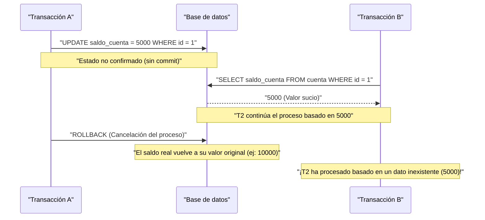

En un RDBMS (Sistema de Gestión de Bases de Datos Relacionales), el concepto más fundamental e importante para proteger la consistencia e integridad de los datos y asegurar la fiabilidad del sistema es la **transacción** (Transaction).

En las aplicaciones web y sistemas empresariales modernos, múltiples usuarios leen y escriben en la base de datos simultáneamente. Comprender profundamente los mecanismos para que los datos se procesen de manera correcta y sin contradicciones en este entorno de procesamiento concurrente es una habilidad indispensable para los ingenieros backend y administradores de bases de datos.

En este artículo, explicaremos de forma detallada y exhaustiva desde las **propiedades ACID**, que son la teoría básica que sustenta las transacciones de bases de datos, hasta las diversas **anomalías (Anomaly)** que pueden ocurrir cuando se ejecutan múltiples transacciones simultáneamente, y los **niveles de aislamiento (Isolation Level)** que definen cómo prevenir estas anomalías. Además, profundizaremos en métodos de implementación específicos para proteger los datos de conflictos, como el **bloqueo pesimista** y el **bloqueo optimista**, así como el **MVCC (Control de Concurrencia Multiversión)**, ampliamente adoptado en los RDBMS modernos.

---

## 1. ¿Qué es una transacción?

Una **transacción** se refiere a una "unidad de procesamiento indivisible" en una base de datos.
Es un mecanismo que trata múltiples sentencias SQL (inserción, actualización, eliminación de datos, etc.) como una única unidad de trabajo lógico, garantizando que "todas tengan éxito y se reflejen en la base de datos ( **commit** )" o que "falle a la mitad y no se refleje en absoluto, volviendo a su estado original ( **rollback** )", permitiendo solo una de estas dos opciones.

### 1.1 Ejemplo de transferencia bancaria (Necesidad de transacciones)

El ejemplo que se utiliza a menudo para explicar la importancia de las transacciones es el de una transferencia bancaria.
Por ejemplo, el proceso de "transferir 10,000 yenes de la cuenta de A a la cuenta de B" se descompone en los siguientes dos pasos (procesos de actualización) en la base de datos.

1. Restar 10,000 yenes del saldo de la cuenta de A (UPDATE)
2. Sumar 10,000 yenes al saldo de la cuenta de B (UPDATE)

Si ocurriera un fallo del sistema o un error de red justo después de que el proceso 1 tenga éxito, y el proceso 2 no se ejecutara, ¿qué pasaría?
Se habrían deducido 10,000 yenes de la cuenta de A, pero no se habrían depositado 10,000 yenes en la cuenta de B, produciéndose una **inconsistencia de datos** fatal para un sistema financiero.

Al utilizar transacciones, se puede evitar este tipo de situaciones.

```sql
BEGIN TRANSACTION; -- Inicio de la transacción

-- 1. Restar 10000 yenes de la cuenta de A
UPDATE accounts
SET balance = balance - 10000
WHERE account_id = 'A' AND balance >= 10000;

-- 2. Sumar 10000 yenes a la cuenta de B
UPDATE accounts
SET balance = balance + 10000
WHERE account_id = 'B';

COMMIT; -- Se confirma solo si todos los procesos tienen éxito
-- ※ Si ocurre un error, se hace ROLLBACK y la resta 1 tampoco habrá ocurrido
```

De esta manera, el mayor rol de una transacción es mantener la integridad de la base de datos agrupando múltiples procesos de actualización relacionados como una sola unidad indivisible.

---

## 2. Propiedades ACID (4 requisitos de las transacciones)

Existen cuatro propiedades que las transacciones deben cumplir para ejecutarse de forma segura, y se denominan **propiedades ACID** tomando las iniciales de cada una. Los RDBMS cuentan internamente con mecanismos complejos para garantizar estas propiedades ACID.

### 2.1 Atomicity (Atomicidad)
La **Atomicidad** (Atomicity) es la propiedad que garantiza que todas las operaciones dentro de una transacción "se ejecutan todas, o no se ejecuta ninguna (All or Nothing)".
Como en el ejemplo anterior de la transferencia bancaria, si el proceso falla a la mitad, debe hacerse un **rollback** (deshacer) completo al estado anterior al inicio de la transacción, incluyendo los cambios ya ejecutados. No se permite dejar la base de datos en un estado intermedio (commit parcial).

### 2.2 [Consistency](https://kenji.blog/es/p/cap-theorem-distributed-systems-tradeoff/) (Consistencia / Integridad)
La **Consistencia** (Consistency) es la propiedad que garantiza que las reglas (restricciones) de la base de datos se cumplan de manera consistente antes y después de la ejecución de la transacción.
En la base de datos, se pueden definir reglas que los datos deben cumplir, como restricciones de clave primaria (Primary Key), restricciones de clave externa (Foreign Key), restricciones de unicidad (Unique) y restricciones de verificación (Check). No se permite que el resultado de la actualización de datos mediante una transacción viole estas restricciones, y si ocurre una violación, se realiza un rollback inmediato. Es decir, la transacción tiene la función de transicionar la base de datos de "un estado consistente" a "otro estado consistente".

### 2.3 Isolation (Aislamiento)
El **Aislamiento** (Isolation) es la propiedad que asegura que, incluso cuando se ejecutan múltiples transacciones simultáneamente, cada transacción no afecte ni sea afectada por el proceso de ejecución (estado intermedio) de otras transacciones.
El aislamiento ideal es que el resultado de múltiples transacciones ejecutadas en paralelo coincida exactamente con el resultado de ejecutarlas secuencialmente una por una (a esto se le llama **serializabilidad**). Sin embargo, intentar garantizar un aislamiento completo reduce significativamente el rendimiento del procesamiento concurrente (throughput) del sistema, por lo que los RDBMS reales ofrecen **niveles de aislamiento** (explicados más adelante) para ajustar el compromiso entre rendimiento y aislamiento.

### 2.4 Durability (Durabilidad)
La **Durabilidad** (Durability) es la propiedad que garantiza que, una vez que una transacción ha hecho **commit** (completado), su resultado nunca se perderá incluso si ocurre un fallo en el sistema (corte de energía, caída, etc.).
Normalmente, los RDBMS actualizan los datos en la memoria (buffer pool) y los escriben de forma asíncrona en el disco, pero al hacer commit siempre registran el contenido de la actualización (historial de cambios) como un **registro de escritura anticipada** (WAL: Write-Ahead Log o REDO log, etc.) en un almacenamiento persistente como el disco. De esta manera, si la base de datos falla, es posible restaurar (recuperar) el estado committeado utilizando los registros al reiniciar.

---

## 3. Control de Concurrencia y Anomalías de Transacciones (Anomaly)

Cuando múltiples usuarios o aplicaciones acceden simultáneamente a la base de datos y ejecutan transacciones en paralelo, si no se controla adecuadamente, ocurren diversas **inconsistencias de datos (anomalías / Anomaly)**. Como premisa para entender los niveles de aislamiento, es indispensable saber qué tipo de anomalías existen.

### 3.1 Lectura Sucia (Dirty Read)
Una **lectura sucia** ocurre cuando una transacción lee **datos no confirmados (sin commit)** que están siendo actualizados por otra transacción.

El siguiente diagrama de secuencia muestra el proceso en el que ocurre una lectura sucia.



Si la Transacción A revierte su proceso mediante un rollback, la Transacción B habrá leído y procesado "datos fantasma que finalmente no existieron en la base de datos", lo que causa errores lógicos fatales.

### 3.2 Lectura No Repetible (Non-repeatable Read)
La **lectura no repetible** ocurre cuando, al ejecutar la misma consulta dos veces dentro de la misma transacción, otra transacción **actualiza y confirma (commit)** los datos en el medio, provocando que los resultados (valores) leídos difieran entre la primera y la segunda vez.

1. La Transacción A hace SELECT de la fila `id=1` (el valor es 100).
2. La Transacción B hace UPDATE de la fila `id=1` a 200 y hace commit.
3. Cuando la Transacción A vuelve a hacer SELECT de la fila `id=1`, el valor ha cambiado a 200.

Desde la perspectiva de la Transacción A, se enfrenta a un estado inconsistente donde "aunque no ha cambiado nada, los datos cambian cada vez que se leen".

### 3.3 Lectura Fantasma (Phantom Read)
La **lectura fantasma** ocurre cuando, al ejecutar la misma consulta con las mismas condiciones de búsqueda (búsqueda de rango, etc.) dos veces en la misma transacción, otra transacción **inserta (INSERT) o elimina (DELETE)** nuevos datos y hace commit en el medio, provocando que filas que no existían (o que existían) en la primera vez, aparezcan (o desaparezcan) en la segunda.

Mientras que la lectura no repetible es causada por la **actualización de filas existentes (UPDATE)**, la lectura fantasma se refiere al fenómeno donde el número de filas o la composición del conjunto de resultados cambia debido a la **inserción o eliminación de filas (INSERT/DELETE)**.

### 3.4 Pérdida de Actualización (Lost Update)
La **pérdida de actualización** es un fenómeno donde múltiples transacciones leen la misma fila simultáneamente, realizan cálculos y luego escriben las actualizaciones de vuelta, provocando que **la actualización escrita posteriormente sobrescriba y elimine la actualización anterior**.

1. La Transacción A lee el saldo (10000 yenes).
2. La Transacción B también lee el mismo saldo (10000 yenes).
3. La Transacción A suma 1000 yenes, hace UPDATE del saldo a 11000 yenes, y hace commit.
4. La Transacción B resta 2000 yenes, hace UPDATE del saldo a 8000 yenes, y hace commit.

Como resultado, el saldo en la base de datos será de 8000 yenes. La "suma de 1000 yenes" realizada por la Transacción A fue completamente sobrescrita por la actualización de la Transacción B y se perdió. Si se hubiera procesado en el orden correcto, el saldo debería ser 9000 yenes. Este es un problema grave que ocurre con frecuencia en patrones de procesamiento donde la aplicación carga los datos en memoria antes de realizar cálculos.

---

## 4. Niveles de Aislamiento de Transacciones según ANSI SQL

Para prevenir las diversas anomalías mencionadas anteriormente, el estándar ANSI SQL define 4 **niveles de aislamiento de transacciones** (Isolation Level). Cuanto mayor (más estricto) se establece el nivel de aislamiento, más fuertemente se protege la consistencia de los datos, pero al mismo tiempo aumenta la probabilidad de hacer esperar a otras transacciones (conflictos de bloqueo), reduciendo el rendimiento del procesamiento concurrente.

| Nivel de Aislamiento (Isolation Level) | Lectura Sucia | Lectura No Repetible | Lectura Fantasma |
| :--- | :---: | :---: | :---: |
| **Read Uncommitted** (Lectura no confirmada) | Ocurre | Ocurre | Ocurre |
| **Read Committed** (Lectura confirmada) | **Se previene** | Ocurre | Ocurre |
| **Repeatable Read** (Lectura repetible) | **Se previene** | **Se previene** | Ocurre (※) |
| **Serializable** (Serializable) | **Se previene** | **Se previene** | **Se previene** |

*(※ En Repeatable Read de InnoDB en MySQL, los mecanismos como next-key lock y MVCC previenen por defecto la mayoría de las lecturas fantasmas)*

### 4.1 Read Uncommitted
Es el nivel de aislamiento más bajo. Lee incluso los cambios no confirmados de otras transacciones (ocurren lecturas sucias). Debido a que no garantiza ninguna consistencia de datos, rara vez se usa en la práctica, excepto en procesos de agregación específicos donde se requiere un rendimiento extremo en lugar de una precisión estricta. En algunos DBMS como PostgreSQL, incluso si se especifica este nivel, internamente opera como Read Committed.

### 4.2 Read Committed
Es el nivel de aislamiento predeterminado adoptado por muchos RDBMS (Oracle, PostgreSQL, SQL Server).
Los datos que lee la transacción son siempre solo datos **confirmados (commit)**. Esto previene las lecturas sucias, pero si otra transacción actualiza los datos y hace commit mientras se ejecuta tu propia transacción, esos cambios se leerán, por lo que pueden ocurrir lecturas no repetibles y lecturas fantasmas.

### 4.3 Repeatable Read
Es el nivel de aislamiento predeterminado de MySQL (InnoDB).
Se garantiza que el conjunto de datos leído al inicio de la transacción permanece de forma consistente en el mismo estado hasta que finalice la transacción. En otras palabras, incluso si otra transacción actualiza y confirma los datos relevantes durante tu propia transacción, desde la perspectiva de tu transacción seguirás viendo los datos antiguos (del momento en que comenzó). Esto previene las lecturas no repetibles.
Sin embargo, según la definición estricta del estándar ANSI, las lecturas fantasmas debido a inserciones y eliminaciones de filas todavía podrían ocurrir (como se mencionó anteriormente, implementaciones como MySQL InnoDB también suprimen las lecturas fantasmas).

### 4.4 Serializable
Es el nivel de aislamiento más estricto, garantizando resultados como si las transacciones se ejecutaran de manera completamente en serie (serial). Puede prevenir por completo todas las anomalías (lectura sucia, lectura no repetible, lectura fantasma).
Sin embargo, lograr esto requiere bloqueos extensos (bloqueos de tabla o de rango) o mecanismos complejos de detección de conflictos (como SSI: Serializable Snapshot Isolation), lo que sacrifica en gran medida el rendimiento del procesamiento concurrente y aumenta el riesgo de que las transacciones hagan rollback (reintentos debido a errores de conflicto) con frecuencia.

---

## 5. Mecanismos de Implementación del Control de Concurrencia (Bloqueos y MVCC)

¿Cómo implementan específicamente los RDBMS las demandas lógicas de los niveles de aislamiento? Históricamente, el control mediante **mecanismos de bloqueo** era la tendencia principal, pero en la actualidad, el **MVCC** se ha popularizado ampliamente para mejorar el rendimiento del procesamiento concurrente.

### 5.1 Control Basado en Bloqueos (Bloqueo Pesimista)
Los RDBMS tradicionales realizaban el control de exclusión aplicando "claves" a los recursos (filas o tablas).
- **Bloqueo Compartido (S Lock / Shared Lock)**: Se adquiere al leer datos. Otras transacciones también pueden adquirir bloqueos compartidos y leer al mismo tiempo, pero no pueden modificar los datos (adquirir un bloqueo X).
- **Bloqueo Exclusivo (X Lock / Exclusive Lock)**: Se adquiere al actualizar o eliminar datos. Otras transacciones no pueden leer (bloqueo S) ni actualizar (bloqueo X) y quedan en espera (bloqueadas).

El control basado en bloqueos es seguro, pero tiene la gran desventaja de que **"los procesos de lectura bloquean a los procesos de actualización"** y **"los procesos de actualización bloquean a los procesos de lectura"**, lo que causa una disminución en el throughput (rendimiento) y puede provocar un **interbloqueo** (Deadlock) donde ambas transacciones se quedan esperando mutuamente a que se libere el bloqueo.

### 5.2 MVCC (Multi-Version Concurrency Control: Control de Concurrencia Multiversión)
Para superar las desventajas de los bloqueos, surgió el **MVCC**. La mayoría de los principales RDBMS modernos, como PostgreSQL, MySQL(InnoDB) y Oracle, lo han adoptado.
La idea básica de MVCC es **"al modificar datos, no sobrescribir los datos originales, sino crear una nueva versión de los datos"**.

- El **proceso de lectura** lee una "versión pasada de los datos (instantánea o snapshot)" correspondiente al momento en que se inició la transacción.
- El **proceso de actualización** crea una "versión más reciente de los datos", la cual entra en vigencia una vez confirmada (commit).

Esto permite un nivel de concurrencia extremadamente alto donde **"la lectura no bloquea a la actualización"** y **"la actualización no bloquea a la lectura"**, al mismo tiempo que garantiza la consistencia de Read Committed o Repeatable Read. En un entorno MVCC, los procesos posteriores solo tienen que esperar en casos donde los bloqueos exclusivos (X Lock) entren en conflicto (cuando se intenta actualizar la misma fila simultáneamente).

---

## 6. Medidas contra Conflictos en la Capa de Aplicación (Bloqueo Pesimista y Bloqueo Optimista)

Además del control mediante niveles de aislamiento o MVCC a nivel de base de datos, para prevenir específicamente la **pérdida de actualización** mencionada anteriormente y garantizar la consistencia de los datos en la lógica de negocio, es común combinar aplicaciones y SQL para realizar un control de bloqueo explícito. Los métodos representativos para esto son el **bloqueo pesimista** y el **bloqueo optimista**.

El siguiente diagrama compara el flujo y el comportamiento de ambas técnicas de bloqueo.

```mermaid
flowchart TD
    subgraph "Bloqueo Pesimista (Pessimistic Lock)"
        P1("T1: SELECT ... FOR UPDATE")
        P2("DB: Adquiere bloqueo exclusivo en fila objetivo")
        P3("T2: SELECT ... FOR UPDATE")
        P4("DB: T2 en espera (bloqueado) hasta liberar bloqueo")
        P5("T1: UPDATE & COMMIT")
        P6("DB: Liberación de bloqueo")
        P7("T2: Fin de espera, adquiere bloqueo y continúa")

        P1 --> P2
        P2 --> P3
        P3 --> P4
        P4 --> P5
        P5 --> P6
        P6 --> P7
    end

    subgraph "Bloqueo Optimista (Optimistic Lock)"
        O1("T1: SELECT (version=1)")
        O2("T2: SELECT (version=1)")
        O3("T1: UPDATE ... WHERE version=1")
        O4("DB: Éxito (Actualiza a version=2)")
        O5("T2: UPDATE ... WHERE version=1")
        O6("DB: 0 filas actualizadas (Fallo, detecta conflicto)")
        O7("T2: Manejo de error en aplicación (ej. reintento)")

        O1 --> O2
        O2 --> O3
        O3 --> O4
        O4 --> O5
        O5 --> O6
        O6 --> O7
    end
```



### 6.1 Bloqueo Pesimista (Pessimistic Lock)
El **bloqueo pesimista** parte de la premisa de que "es muy probable que otros usuarios actualicen los mismos datos al mismo tiempo (pesimista)". Al comienzo del proceso, adquiere explícitamente un bloqueo exclusivo a nivel de fila en la base de datos para bloquear por completo el acceso de otros usuarios.

A nivel de SQL, esto se logra agregando la cláusula `FOR UPDATE` al final de la sentencia `SELECT`.

```sql
BEGIN TRANSACTION;

-- Adquiere bloqueo exclusivo para la fila objetivo. Otras transacciones se bloquearán aquí.
SELECT balance FROM accounts WHERE account_id = 'A' FOR UPDATE;

-- Ejecuta la lógica de negocio (verificación de saldo, cálculos, etc.) y luego actualiza.
UPDATE accounts SET balance = balance - 10000 WHERE account_id = 'A';

COMMIT; -- Liberación del bloqueo
```

**Ventaja**: Puede evitar por completo los conflictos de datos y el flujo del proceso es simple.
**Desventaja**: Al bloquear a otras transacciones mientras retiene el bloqueo, es propenso a reducir el rendimiento. Si se mantiene el bloqueo durante transacciones largas o durante procesos de pantalla que esperan la entrada del usuario, puede provocar que todo el sistema se detenga.

### 6.2 Bloqueo Optimista (Optimistic Lock)
El **bloqueo optimista** parte de la premisa de que "rara vez ocurrirán conflictos de datos (optimista)". No bloquea de antemano; en cambio, **justo en el momento de actualizar los datos, verifica si alguien más ha realizado modificaciones**.

Generalmente, se implementa agregando a la tabla objetivo una **columna para el control de versiones (ej: `version` INT)** o una columna de fecha y hora de la última actualización.

```sql
-- 1. Obtiene los datos previamente y mantiene la versión actual (version = 1) en la memoria de la aplicación.
SELECT balance, version FROM accounts WHERE account_id = 'A';

-- (Aquí se realizan cálculos en el lado de la aplicación o se muestran pantallas de confirmación al usuario)

-- 2. Al actualizar, incluye la versión obtenida en la cláusula WHERE y, al mismo tiempo, incrementa la versión.
UPDATE accounts
SET balance = balance - 10000,
    version = version + 1
WHERE account_id = 'A'
  AND version = 1; -- Verifica si coincide con la versión en el momento en que se leyó
```

Al ejecutar esta sentencia UPDATE, la aplicación verifica el **número de filas actualizadas (Affected Rows)** devuelto por la base de datos.
- **Si es 1 fila actualizada**: No hubo conflicto y la actualización se completó exitosamente.
- **Si son 0 filas actualizadas**: Significa que entre el momento en que se leyeron los datos y la actualización, otra transacción actualizó los datos y la `version` se incrementó a `2` o más (o la fila fue eliminada). En este caso, la aplicación devuelve al usuario un **error de exclusión** con un mensaje como "Los datos fueron modificados por otro usuario. Verifique la información más reciente y vuelva a intentarlo", o realiza un reintento automático.

**Ventaja**: Dado que no ocupa bloqueos en la base de datos a largo plazo, la concurrencia es muy alta y el rendimiento es excelente. Ideal para prevenir conflictos en procesos que abarcan múltiples peticiones/respuestas HTTP sin estado en aplicaciones web (desde que se muestra la pantalla hasta que se presiona el botón).
**Desventaja**: Es necesario implementar el manejo de casos donde ocurre un conflicto (mostrar errores o reintentar) en el lado de la aplicación. En entornos con conflictos frecuentes, la sobrecarga del proceso de reintento puede ser considerable.

---

## 7. Resumen

Las **transacciones** en las bases de datos no son simplemente una extensión del SQL; son un aspecto fundamental en el desarrollo backend que dicta la fiabilidad y el rendimiento de todo el sistema.

- Comprender las **propiedades ACID** y saber cómo el RDBMS protege los datos.
- Reconocer anomalías (Anomaly) como la **lectura sucia**, la **lectura fantasma** y la **pérdida de actualización** que son causadas por el procesamiento concurrente.
- Conocer los valores predeterminados y las diferencias de comportamiento de los **niveles de aislamiento (Isolation Level)** de cada DBMS (como la diferencia entre Read Committed y Repeatable Read), y seleccionar el nivel adecuado según los requerimientos.
- Comprender las características del **bloqueo pesimista** y el **bloqueo optimista**, e implementar en la aplicación el control de exclusión óptimo adaptado a la lógica de negocio y las características del tráfico (frecuencia de conflictos).

Combinando este conocimiento y estas tecnologías, es posible construir sistemas robustos que "escalen con alto rendimiento y sin generar inconsistencias de datos".
En el próximo artículo, tenemos planeado explicar cómo este control de transacciones ha evolucionado en sistemas distribuidos y arquitecturas de microservicios (como el patrón Saga y 2PC). ¡No te lo pierdas!
