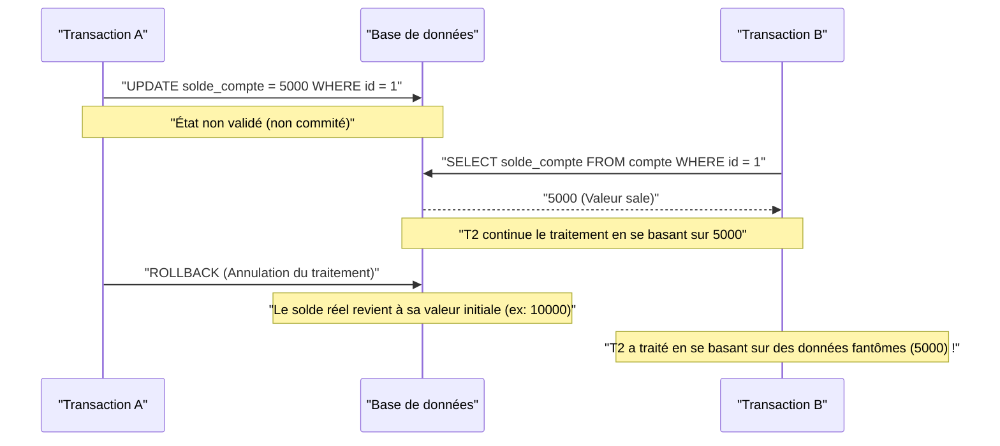

Dans un SGBDR (Système de Gestion de Base de Données Relationnelle), le concept le plus fondamental et important pour protéger l'intégrité et la cohérence des données et assurer la fiabilité du système est la **transaction** (Transaction).

Dans les applications Web et les systèmes d'entreprise modernes, de nombreux utilisateurs lisent et écrivent simultanément dans la base de données. Comprendre en profondeur les mécanismes qui garantissent que les données sont traitées correctement et sans incohérence dans un tel environnement de traitement concurrent est une compétence indispensable pour les ingénieurs backend et les administrateurs de bases de données.

Cet article explique de manière très détaillée et exhaustive les **propriétés ACID**, qui sont la théorie de base soutenant les transactions de base de données, les diverses **anomalies (Anomaly)** qui peuvent survenir lorsque plusieurs transactions s'exécutent simultanément, et les **niveaux d'isolement de transaction (Isolation Level)** qui définissent comment empêcher ces anomalies. De plus, nous approfondirons les méthodes d'implémentation spécifiques pour protéger les données des conflits, telles que le **verrouillage pessimiste** et le **verrouillage optimiste**, ainsi que le **MVCC (Multi-Version Concurrency Control)**, largement adopté dans les SGBDR modernes.

---

## 1. Qu'est-ce qu'une transaction ?

Une **transaction** désigne "un ensemble de traitements indivisibles" sur une base de données.
Il s'agit d'un mécanisme qui traite plusieurs instructions SQL (ajout, mise à jour, suppression de données, etc.) comme une seule unité de travail logique, garantissant que soit "tout réussit et est reflété dans la base de données ( **commit** )", soit "échoue en cours de route et n'est pas reflété du tout, retournant à l'état initial ( **rollback** )".

### 1.1 Exemple de virement bancaire (Nécessité des transactions)

L'exemple du virement bancaire (transfert d'argent) est souvent utilisé pour expliquer l'importance des transactions.
Par exemple, le processus de "transférer 10 000 yens du compte de A vers le compte de B" se décompose en deux étapes (traitements de mise à jour) dans la base de données :

1. Déduire 10 000 yens du solde du compte de A (UPDATE)
2. Ajouter 10 000 yens au solde du compte de B (UPDATE)

Que se passerait-il si une défaillance du système ou une erreur réseau survenait juste après le succès de l'étape 1, empêchant l'exécution de l'étape 2 ?
10 000 yens auraient été déduits du compte de A, mais ils n'auraient pas été crédités sur le compte de B, provoquant une **incohérence des données** fatale pour un système financier.

L'utilisation de transactions permet d'éviter ce genre de situation.

```sql
BEGIN TRANSACTION; -- Début de la transaction

-- 1. Déduire 10000 yens du compte de A
UPDATE accounts
SET balance = balance - 10000
WHERE account_id = 'A' AND balance >= 10000;

-- 2. Ajouter 10000 yens au compte de B
UPDATE accounts
SET balance = balance + 10000
WHERE account_id = 'B';

COMMIT; -- Valider uniquement si toutes les opérations ont réussi
-- * En cas d'erreur, un ROLLBACK est effectué et la déduction de l'étape 1 est annulée
```

Ainsi, regrouper plusieurs opérations de mise à jour associées en une seule unité indivisible est le rôle principal des transactions pour maintenir l'intégrité de la base de données.

---

## 2. Propriétés ACID (Les 4 exigences des transactions)

Il y a 4 propriétés qu'une transaction doit satisfaire pour s'exécuter en toute sécurité. Les initiales de ces propriétés forment l'acronyme **ACID** (Propriétés ACID). Les SGBDR sont dotés de mécanismes internes complexes pour garantir ces propriétés ACID.

### 2.1 Atomicity (Atomicité)
L'**Atomicité** (Atomicity) garantit que toutes les opérations d'une transaction sont "soit toutes exécutées, soit aucune n'est exécutée (All or Nothing)".
Comme dans l'exemple du virement bancaire précédent, si le traitement échoue en cours de route, la base de données doit être complètement **restaurée (rollback)** à son état avant le début de la transaction, annulant même les modifications déjà effectuées. Il est inacceptable de laisser la base de données dans un état intermédiaire (commit partiel).

### 2.2 [Consistency](https://kenji.blog/fr/p/cap-theorem-distributed-systems-tradeoff/) (Cohérence)
La **Cohérence** (Consistency) garantit qu'avant et après l'exécution d'une transaction, les règles (contraintes) de la base de données sont systématiquement respectées.
Une base de données peut définir des règles que les données doivent respecter, telles que les contraintes de clé primaire (Primary Key), de clé étrangère (Foreign Key), d'unicité (Unique) et de vérification (Check). À la suite d'une transaction, l'état des données ne doit pas enfreindre ces contraintes ; en cas de violation, un rollback immédiat est effectué. En d'autres termes, une transaction a pour rôle de faire passer la base de données d'un "état cohérent" à un "autre état cohérent".

### 2.3 Isolation (Isolement)
L'**Isolement** (Isolation) garantit que même lorsque plusieurs transactions s'exécutent simultanément, chaque transaction n'affecte pas, ni n'est affectée par, le processus d'exécution (état intermédiaire) des autres transactions.
L'isolement idéal signifie que le résultat de plusieurs transactions exécutées en parallèle correspond exactement au résultat qu'on obtiendrait si elles s'exécutaient l'une après l'autre (en série) (ce qu'on appelle la **sérialisabilité**). Cependant, chercher à garantir un isolement total réduirait considérablement les performances de traitement parallèle (débit) du système. Par conséquent, les SGBDR réels proposent des **niveaux d'isolement** (décrits plus loin) pour ajuster le compromis entre performances et isolement.

### 2.4 Durability (Durabilité)
La **Durabilité** (Durability) garantit qu'une fois qu'une transaction a été **validée** (commit), son résultat ne sera jamais perdu, même en cas de panne du système (coupure de courant, crash, etc.).
Les SGBDR mettent généralement à jour les données en mémoire (pool de tampons) et les écrivent de manière asynchrone sur le disque. Cependant, lors du commit, ils écrivent toujours le contenu des mises à jour (historique des modifications) sous forme de **journal de journalisation anticipée** (WAL : Write-Ahead Log ou REDO log, etc.) sur un stockage persistant tel qu'un disque. Ainsi, même si la base de données plante, il est possible de restaurer (récupérer) l'état des transactions validées en utilisant le journal lors du redémarrage.

---

## 3. Contrôle de concurrence et anomalies de transaction (Anomaly)

Lorsque plusieurs utilisateurs ou applications accèdent simultanément à la base de données et exécutent des transactions en parallèle, sans un contrôle approprié, diverses **incohérences de données (anomalies / Anomaly)** se produisent. Il est essentiel de comprendre quelles anomalies existent avant de comprendre les niveaux d'isolement.

### 3.1 Lecture non validée (Dirty Read)
Le **Dirty Read** (Lecture sale) est un phénomène où une transaction lit des données qui ont été modifiées par une autre transaction mais qui ne sont **pas encore validées (non confirmées)**.

Le diagramme de séquence suivant montre comment se produit un Dirty Read.



Si la transaction A annule son traitement (rollback), la transaction B aura poursuivi son traitement en lisant "des données fantômes qui n'ont finalement jamais existé dans la base de données", provoquant une erreur logique fatale.

### 3.2 Lecture non répétable (Non-repeatable Read)
Le **Non-repeatable Read** (Lecture non répétable) est un phénomène où, lors de l'exécution d'une même requête deux fois au sein d'une même transaction, le résultat (la valeur) lu diffère entre la première et la deuxième fois parce qu'une autre transaction a **mis à jour et validé** les données entre-temps.

1. La transaction A fait un SELECT sur la ligne `id=1` (la valeur est 100).
2. La transaction B fait un UPDATE de la ligne `id=1` à 200, et valide (commit).
3. La transaction A fait de nouveau un SELECT sur la ligne `id=1`, et la valeur a changé à 200.

Du point de vue de la transaction A, elle fait face à un état incohérent où "les données changent à chaque lecture, bien qu'elle n'ait rien modifié elle-même".

### 3.3 Lecture fantôme (Phantom Read)
Le **Phantom Read** (Lecture fantôme) est un phénomène où, lors de l'exécution d'une même requête avec les mêmes conditions de recherche (recherche par plage, etc.) deux fois au sein d'une même transaction, des lignes qui n'existaient pas (ou qui existaient) lors de la première lecture apparaissent (ou disparaissent) lors de la seconde, parce qu'une autre transaction a **ajouté (INSERT) ou supprimé (DELETE)** des données et les a validées entre-temps.

Alors que le Non-repeatable Read est causé par la **mise à jour (UPDATE) de lignes existantes**, le Phantom Read est un phénomène où le nombre de lignes ou la structure du jeu de résultats change en raison de **l'ajout ou la suppression de lignes (INSERT/DELETE)**.

### 3.4 Mise à jour perdue (Lost Update)
Le **Lost Update** (Mise à jour perdue) est un phénomène où plusieurs transactions lisent la même ligne simultanément, effectuent chacune des calculs, puis écrivent leurs mises à jour, et **la mise à jour écrite en dernier écrase et annule la mise à jour précédente**.

1. La transaction A lit le solde (10 000 yens).
2. La transaction B lit le même solde (10 000 yens).
3. La transaction A ajoute 1 000 yens, met à jour le solde à 11 000 yens, et valide (commit).
4. La transaction B soustrait 2 000 yens, met à jour le solde à 8 000 yens, et valide (commit).

En conséquence, le solde de la base de données devient 8 000 yens. L'"ajout de 1 000 yens" effectué par la transaction A est complètement écrasé par la mise à jour de la transaction B et est perdu. S'ils avaient été traités dans le bon ordre, le solde devrait être de 9 000 yens. C'est un problème grave qui survient fréquemment avec les modèles de traitement où les applications chargent des données en mémoire avant d'effectuer des calculs.

---

## 4. Niveaux d'isolement de transaction ANSI SQL

Pour prévenir les diverses anomalies mentionnées ci-dessus, la norme ANSI SQL définit quatre **niveaux d'isolement de transaction** (Isolation Level). Plus le niveau d'isolement est élevé (strict), plus la cohérence des données est solidement protégée, mais le risque de faire attendre d'autres transactions (conflit de verrous) augmente, réduisant les performances de traitement parallèle.

| Niveau d'isolement (Isolation Level) | Dirty Read | Non-repeatable Read | Phantom Read |
| :--- | :---: | :---: | :---: |
| **Read Uncommitted** (Lecture non validée) | Se produit | Se produit | Se produit |
| **Read Committed** (Lecture validée) | **Évité** | Se produit | Se produit |
| **Repeatable Read** (Lecture répétable) | **Évité** | **Évité** | Se produit (※) |
| **Serializable** (Sérialisable) | **Évité** | **Évité** | **Évité** |

*(※ Avec le Repeatable Read de InnoDB sous MySQL, le Phantom Read est également évité en grande partie par défaut grâce au Next-Key Lock et au MVCC)*

### 4.1 Read Uncommitted
C'est le niveau d'isolement le plus bas. Il lit même les modifications non validées d'autres transactions (le Dirty Read se produit). Étant donné que la cohérence des données n'est pas du tout garantie, il n'est presque jamais utilisé en pratique, sauf pour des processus d'agrégation spécifiques nécessitant des performances extrêmes plutôt qu'une exactitude stricte. Certains SGBD, comme PostgreSQL, fonctionnent en interne comme Read Committed même si ce niveau est spécifié.

### 4.2 Read Committed
C'est le niveau d'isolement par défaut utilisé par de nombreux SGBDR (paramètre par défaut d'Oracle, PostgreSQL, SQL Server).
Les données lues par une transaction sont toujours des données **validées**. Cela empêche le Dirty Read, mais si une autre transaction met à jour et valide des données pendant que votre transaction s'exécute, votre transaction lira ces modifications, provoquant des Non-repeatable Reads ou des Phantom Reads.

### 4.3 Repeatable Read
C'est le niveau d'isolement par défaut de MySQL (InnoDB).
Il garantit que l'ensemble de données lu au début d'une transaction reste cohérent dans le même état jusqu'à la fin de la transaction. En d'autres termes, même si une autre transaction met à jour et valide les données correspondantes pendant votre transaction, votre transaction continuera de voir les anciennes données (de l'instant de son début). Cela empêche le Non-repeatable Read.
Cependant, selon la définition stricte de la norme ANSI, des Phantom Reads peuvent survenir lors de l'ajout ou de la suppression de lignes (comme mentionné ci-dessus, des implémentations comme InnoDB de MySQL suppriment également les Phantom Reads).

### 4.4 Serializable
C'est le niveau d'isolement le plus strict, garantissant des résultats comme si les transactions étaient exécutées de manière complètement sérielle (l'une après l'autre). Il peut prévenir complètement toutes les anomalies (Dirty Read, Non-repeatable Read, Phantom Read).
Cependant, pour y parvenir, des verrous étendus (verrous de table ou verrous de plage) ou des mécanismes complexes de détection des conflits (SSI : Serializable Snapshot Isolation, etc.) sont nécessaires, sacrifiant grandement les performances de traitement parallèle et augmentant le risque d'annulations de transactions (relances dues aux erreurs de conflit).

---

## 5. Mécanismes d'implémentation du contrôle de concurrence (Verrouillage et MVCC)

Comment les SGBDR implémentent-ils concrètement les exigences logiques posées par les niveaux d'isolement ? Historiquement, le contrôle basé sur des **mécanismes de verrouillage** était courant, mais aujourd'hui, le **MVCC** est largement utilisé pour améliorer les performances de traitement parallèle.

### 5.1 Contrôle basé sur les verrous (Verrouillage pessimiste)
Les SGBDR traditionnels effectuaient un contrôle d'exclusion en plaçant une "clé" sur des ressources (lignes ou tables).
- **Verrou partagé (S-Lock / Shared Lock)** : Acquis lors de la lecture de données. D'autres transactions peuvent également acquérir des verrous partagés pour lire en même temps, mais elles ne peuvent pas modifier les données (acquérir un verrou exclusif, X-Lock).
- **Verrou exclusif (X-Lock / Exclusive Lock)** : Acquis lors de la mise à jour ou de la suppression de données. Les autres transactions ne peuvent ni lire (S-Lock) ni mettre à jour (X-Lock) et sont mises en attente (bloquées).

Le contrôle basé sur les verrous est fiable, mais présente le gros inconvénient que **"le traitement de lecture bloque le traitement de mise à jour"** et **"le traitement de mise à jour bloque le traitement de lecture"**, causant une baisse du débit et provoquant des **interblocages (Deadlocks)** où des processus s'attendent mutuellement pour libérer leurs verrous.

### 5.2 MVCC (Multi-Version Concurrency Control)
Le **MVCC** a émergé pour surmonter les défauts du verrouillage. Il est adopté par la plupart des grands SGBDR modernes, y compris PostgreSQL, MySQL (InnoDB) et Oracle.
L'idée de base du MVCC est de **"créer une nouvelle version des données lors de la modification sans écraser les données d'origine"**.

- Le **traitement de lecture** lit les "versions passées des données (instantanés)" au moment où la transaction a commencé.
- Le **traitement de mise à jour** crée nouvellement une "dernière version des données", qui devient valide lors de sa validation (commit).

Grâce à cela, il est devenu possible de garantir la cohérence des Read Committed et Repeatable Read tout en réalisant une concurrence extrêmement élevée où **"la lecture ne bloque pas la mise à jour"** et **"la mise à jour ne bloque pas la lecture"**. Dans un environnement MVCC, les processus suivants ne sont mis en attente que lorsque des verrous exclusifs (X-Locks) entrent en conflit (lorsqu'ils essaient de mettre à jour la même ligne en même temps).

---

## 6. Mesures anti-conflit au niveau de l'application (Verrouillage pessimiste et Verrouillage optimiste)

En plus des niveaux d'isolement ou du contrôle MVCC au niveau de la base de données, il est courant de combiner l'application et SQL pour effectuer un contrôle explicite des verrous, afin notamment d'empêcher les **Lost Updates** mentionnés plus haut et de garantir la cohérence métier des données. Les méthodes typiques sont le **verrouillage pessimiste** et le **verrouillage optimiste**.

Le diagramme ci-dessous compare le flux et le comportement des deux méthodes de verrouillage.

```mermaid
flowchart TD
    subgraph "Verrouillage pessimiste (Pessimistic Lock)"
        P1("T1: SELECT ... FOR UPDATE")
        P2("DB: Acquérir un verrou exclusif sur la ligne cible")
        P3("T2: SELECT ... FOR UPDATE")
        P4("DB: Mettre T2 en attente (bloqué) jusqu'à libération du verrou")
        P5("T1: UPDATE & COMMIT")
        P6("DB: Libération du verrou")
        P7("T2: Déblocage, acquisition du verrou et suite du traitement")

        P1 --> P2
        P2 --> P3
        P3 --> P4
        P4 --> P5
        P5 --> P6
        P6 --> P7
    end

    subgraph "Verrouillage optimiste (Optimistic Lock)"
        O1("T1: SELECT (version=1)")
        O2("T2: SELECT (version=1)")
        O3("T1: UPDATE ... WHERE version=1")
        O4("DB: Succès (mise à jour à version=2)")
        O5("T2: UPDATE ... WHERE version=1")
        O6("DB: 0 ligne mise à jour (échec, conflit détecté)")
        O7("T2: Gestion des erreurs côté application (ex: retry)")

        O1 --> O2
        O2 --> O3
        O3 --> O4
        O4 --> O5
        O5 --> O6
        O6 --> O7
    end
```



### 6.1 Verrouillage pessimiste (Pessimistic Lock)
Le **verrouillage pessimiste** part du principe qu'"il y a une forte probabilité que d'autres utilisateurs mettent à jour les mêmes données simultanément (pessimiste)". Il s'agit d'une technique qui acquiert explicitement un verrou exclusif au niveau de la ligne dans la base de données au début du traitement, bloquant complètement l'accès des autres utilisateurs.

Au niveau SQL, il est mis en œuvre en ajoutant la clause `FOR UPDATE` à la fin de la requête `SELECT`.

```sql
BEGIN TRANSACTION;

-- Acquérir un verrou exclusif sur la ligne cible. Les autres transactions sont bloquées ici.
SELECT balance FROM accounts WHERE account_id = 'A' FOR UPDATE;

-- Exécuter la logique métier (vérification du solde, calculs, etc.) puis mettre à jour
UPDATE accounts SET balance = balance - 10000 WHERE account_id = 'A';

COMMIT; -- Libération du verrou
```

**Avantages** : Il peut empêcher complètement les conflits de données, et le flux de traitement est simple.
**Inconvénients** : Pendant que le verrou est maintenu, d'autres transactions sont bloquées, ce qui réduit souvent les performances. Si des verrous sont maintenus pendant de longues transactions ou lors de traitements d'interface utilisateur attendant l'entrée de l'utilisateur, cela peut entraîner l'arrêt de l'ensemble du système.

### 6.2 Verrouillage optimiste (Optimistic Lock)
Le **verrouillage optimiste** part du principe que "les conflits de données sont rares (optimiste)". Il ne verrouille pas les données au préalable, mais **vérifie au moment précis de la mise à jour des données si quelqu'un d'autre n'a pas apporté de modifications**.

En général, il est mis en œuvre en ajoutant une **colonne pour la gestion des versions (ex : `version` INT)** ou une colonne de date de dernière mise à jour dans la table cible.

```sql
-- 1. Récupérer les données à l'avance et conserver la version actuelle (version = 1) dans la mémoire de l'application
SELECT balance, version FROM accounts WHERE account_id = 'A';

-- (Effectuer ici les calculs côté application ou afficher un écran de confirmation pour l'utilisateur, etc.)

-- 2. Lors de la mise à jour, inclure la version obtenue dans la clause WHERE, et incrémenter la version simultanément
UPDATE accounts
SET balance = balance - 10000,
    version = version + 1
WHERE account_id = 'A'
  AND version = 1; -- Vérifie si la version correspond à celle du moment de la lecture
```

Lors de l'exécution de cette requête UPDATE, le **nombre de lignes mises à jour (Affected Rows)** renvoyé par la base de données est vérifié côté application.
- **Si 1 ligne est mise à jour** : Il n'y a pas eu de conflit, la mise à jour s'est terminée avec succès.
- **Si 0 ligne est mise à jour** : Cela signifie qu'entre le moment où vous avez lu les données et celui où vous les mettez à jour, une autre transaction a modifié les données et `version` est passé à `2` ou plus (ou la ligne a été supprimée). Dans ce cas, l'application doit renvoyer une **erreur d'exclusion** à l'utilisateur, telle que "Les données ont été modifiées par un autre utilisateur. Veuillez vérifier les dernières informations et réessayer", ou effectuer une relance automatique.

**Avantages** : Comme il ne maintient pas de verrou dans la base de données sur une longue période, le parallélisme est très élevé, offrant d'excellentes performances. Idéal pour empêcher les conflits dans les traitements s'étendant sur plusieurs requêtes/réponses HTTP sans état des applications Web (de l'affichage de l'écran à l'appui sur un bouton).
**Inconvénients** : Le traitement en cas de conflit (affichage d'erreur ou nouvelle tentative) doit être implémenté côté application. Dans un environnement où les conflits sont fréquents, la charge de traitement liée aux nouvelles tentatives devient importante.

---

## 7. Résumé

Les **transactions** de base de données ne sont pas une simple extension du SQL, mais l'essence même du développement backend, affectant la fiabilité et les performances de l'ensemble du système.

- Comprendre les **propriétés ACID** et savoir comment les SGBDR protègent les données.
- Reconnaître les anomalies (Anomaly) telles que les **Dirty Reads**, les **Phantom Reads** et les **Lost Updates** causées par le traitement parallèle.
- Saisir les différences de comportement et les valeurs par défaut des **niveaux d'isolement (Isolation Level)** selon les SGBD (comme la différence entre Read Committed et Repeatable Read), et choisir le niveau d'isolement approprié en fonction des exigences.
- Comprendre les caractéristiques du **verrouillage pessimiste** et du **verrouillage optimiste**, et implémenter dans l'application le contrôle d'exclusion optimal en fonction de la logique métier et des caractéristiques du trafic (fréquence des conflits).

C'est en combinant ces connaissances et ces techniques qu'il devient possible de construire des systèmes robustes capables d'évoluer avec des performances élevées tout en ne provoquant pas d'incohérences de données.
Dans le prochain article, nous prévoyons d'expliquer comment ce contrôle de transaction a évolué dans les systèmes distribués et l'architecture des microservices (le pattern Saga, le commit en 2 phases (2PC), etc.). Restez à l'écoute !
