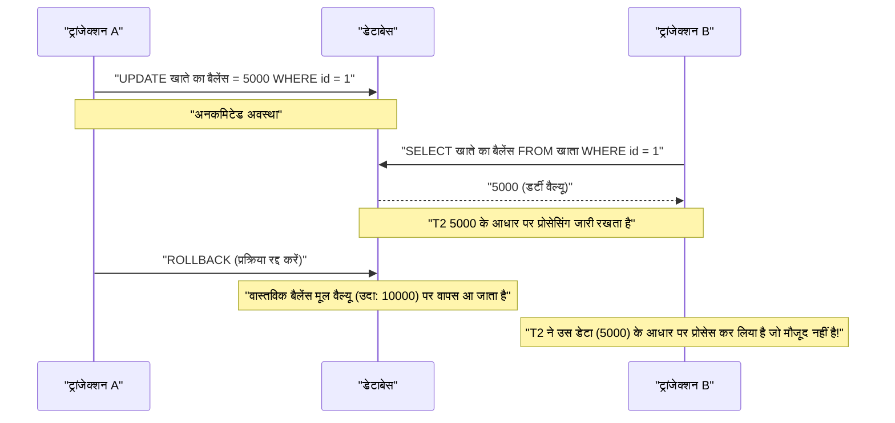

RDBMS (रिलेशनल डेटाबेस मैनेजमेंट सिस्टम) में, डेटा की अखंडता (integrity) और स्थिरता (consistency) की रक्षा करने और सिस्टम की विश्वसनीयता सुनिश्चित करने के लिए सबसे मौलिक और महत्वपूर्ण अवधारणा **ट्रांजेक्शन** (Transaction) है।

आधुनिक वेब एप्लीकेशन और एंटरप्राइज़ सिस्टम में, कई उपयोगकर्ता एक साथ डेटाबेस में रीड और राइट करते हैं। यह एक बैकएंड इंजीनियर या डेटाबेस एडमिनिस्ट्रेटर के लिए आवश्यक कौशल है कि वे इस तरह के समवर्ती (concurrent) प्रोसेसिंग वातावरण में बिना किसी असंगति के डेटा को सही ढंग से संसाधित करने के तंत्र को गहराई से समझें।

इस लेख में, हम **ACID गुणों** से शुरू करके, जो डेटाबेस ट्रांजेक्शन का समर्थन करने वाला मूलभूत सिद्धांत है, कई ट्रांजेक्शन के एक साथ निष्पादित होने पर उत्पन्न होने वाली विभिन्न **विसंगतियों (Anomaly)**, और उन विसंगतियों को रोकने के लिए परिभाषित **ट्रांजेक्शन आइसोलेशन लेवल (Isolation Level)** के बारे में बहुत विस्तार से और व्यापक रूप से बताएंगे। इसके अलावा, हम डेटा को टकराव से बचाने के लिए विशिष्ट कार्यान्वयन विधियों, **निराशावादी लॉक (Pessimistic Lock)** और **आशावादी लॉक (Optimistic Lock)**, साथ ही आधुनिक RDBMS में व्यापक रूप से उपयोग किए जाने वाले **MVCC (मल्टी-वर्जन कंकरेंसी कंट्रोल)** पर भी गहराई से चर्चा करेंगे।

---

## 1. ट्रांजेक्शन क्या है?

**ट्रांजेक्शन** डेटाबेस पर ऑपरेशन्स के एक "अविभाज्य सेट" को संदर्भित करता है।
यह एक ऐसा तंत्र है जो कई SQL स्टेटमेंट्स (डेटा जोड़ना, अपडेट करना, हटाना आदि) को एक तार्किक कार्य इकाई के रूप में मानता है, और यह गारंटी देता है कि या तो "वे सभी सफल होते हैं और डेटाबेस में परिलक्षित होते हैं ( **कमिट** )" या "वे बीच में विफल हो जाते हैं और बिना किसी परिवर्तन के अपनी मूल स्थिति में वापस आ जाते हैं ( **रोलबैक** )"।

### 1.1 अकाउंट ट्रांसफर का उदाहरण (ट्रांजेक्शन की आवश्यकता)

ट्रांजेक्शन के महत्व को समझाते समय बैंक अकाउंट ट्रांसफर (पैसे भेजने) का उदाहरण अक्सर उपयोग किया जाता है।
उदाहरण के लिए, "व्यक्ति A के खाते से व्यक्ति B के खाते में 10,000 येन ट्रांसफर करने" की प्रक्रिया डेटाबेस पर निम्नलिखित 2 चरणों (अपडेट ऑपरेशन्स) में टूट जाती है:

1. व्यक्ति A के खाते का बैलेंस 10,000 येन कम करें (UPDATE)
2. व्यक्ति B के खाते का बैलेंस 10,000 येन बढ़ाएं (UPDATE)

क्या होगा यदि चरण 1 सफल होने के ठीक बाद सिस्टम विफलता या नेटवर्क त्रुटि होती है, और चरण 2 निष्पादित नहीं होता है?
व्यक्ति A के खाते से 10,000 येन काट लिए जाते हैं, लेकिन व्यक्ति B के खाते में 10,000 येन जमा नहीं होते हैं। वित्तीय प्रणाली के लिए यह एक घातक **डेटा असंगति** का कारण बनेगा।

ट्रांजेक्शन का उपयोग करके इस तरह की स्थिति को रोका जा सकता है।

```sql
BEGIN TRANSACTION; -- ट्रांजेक्शन की शुरुआत

-- 1. व्यक्ति A के खाते से 10000 येन घटाएं
UPDATE accounts
SET balance = balance - 10000
WHERE account_id = 'A' AND balance >= 10000;

-- 2. व्यक्ति B के खाते में 10000 येन जोड़ें
UPDATE accounts
SET balance = balance + 10000
WHERE account_id = 'B';

COMMIT; -- केवल तभी सुनिश्चित करें जब सभी प्रक्रियाएं सफल हों
-- ※ यदि कोई त्रुटि होती है, तो यह ROLLBACK हो जाएगा, और 1 का घटाव भी रद्द कर दिया जाएगा
```

इस प्रकार, संबंधित कई अपडेट प्रक्रियाओं को एक अविभाज्य इकाई में बांधकर डेटाबेस की पूर्णता बनाए रखना ट्रांजेक्शन की सबसे बड़ी भूमिका है।

---

## 2. ACID गुण (ट्रांजेक्शन की 4 आवश्यकताएं)

ट्रांजेक्शन को सुरक्षित रूप से निष्पादित करने के लिए 4 गुणों को पूरा करना होता है, जिनके पहले अक्षरों को मिलाकर **ACID गुण** कहा जाता है। RDBMS में इन ACID गुणों की गारंटी देने के लिए जटिल आंतरिक तंत्र होते हैं।

### 2.1 Atomicity (परमाण्विकता)
**Atomicity** (परमाण्विकता) वह गुण है जो गारंटी देता है कि एक ट्रांजेक्शन के भीतर सभी ऑपरेशन "या तो सभी निष्पादित होते हैं, या कोई भी निष्पादित नहीं होता है (All or Nothing)"।
ऊपर दिए गए अकाउंट ट्रांसफर के उदाहरण की तरह, यदि प्रक्रिया बीच में विफल हो जाती है, तो इसे पहले से निष्पादित किए गए परिवर्तनों सहित, ट्रांजेक्शन शुरू होने से पहले की स्थिति में पूरी तरह से **रोलबैक** (रद्द) किया जाना चाहिए। आधी-अधूरी स्थिति (आंशिक कमिट) को डेटाबेस में रहने की अनुमति नहीं है।

### 2.2 [Consistency](https://kenji.blog/hi/p/cap-theorem-distributed-systems-tradeoff/) (स्थिरता/अखंडता)
**Consistency** (स्थिरता) वह गुण है जो गारंटी देता है कि ट्रांजेक्शन के निष्पादन से पहले और बाद में डेटाबेस के नियम (प्रतिबंध) लगातार पूरे होते हैं।
डेटाबेस में ऐसे नियम परिभाषित किए जा सकते हैं जिन्हें डेटा को पूरा करना चाहिए, जैसे प्राइमरी की (Primary Key), फॉरेन की (Foreign Key), यूनिक (Unique), और चेक (Check) प्रतिबंध। ट्रांजेक्शन के माध्यम से डेटा अपडेट होने के परिणामस्वरूप, इन प्रतिबंधों का उल्लंघन करने वाली स्थिति की अनुमति नहीं है, और यदि उल्लंघन होता है तो इसे तुरंत रोलबैक कर दिया जाता है। दूसरे शब्दों में, ट्रांजेक्शन की भूमिका डेटाबेस को "एक सुसंगत स्थिति" से "दूसरी सुसंगत स्थिति" में स्थानांतरित करना है।

### 2.3 Isolation (स्वतंत्रता/पृथक्करण)
**Isolation** (स्वतंत्रता) वह गुण है जो यह सुनिश्चित करता है कि जब कई ट्रांजेक्शन एक साथ निष्पादित होते हैं, तो प्रत्येक ट्रांजेक्शन अन्य ट्रांजेक्शन की निष्पादन प्रक्रिया (मध्यवर्ती स्थिति) को प्रभावित नहीं करता है, या उससे प्रभावित नहीं होता है।
आदर्श स्वतंत्रता यह है कि एक साथ निष्पादित कई ट्रांजेक्शन का परिणाम पूरी तरह से मेल खाता है यदि उन्हें एक-एक करके क्रमिक रूप से निष्पादित किया जाता (इसे **सीरियलाइज़ेबिलिटी** कहा जाता है)। हालांकि, पूरी तरह से स्वतंत्रता की गारंटी देने से सिस्टम का समवर्ती प्रोसेसिंग प्रदर्शन (थ्रूपुट) काफी कम हो जाता है, इसलिए वास्तविक RDBMS प्रदर्शन और स्वतंत्रता के बीच ट्रेड-ऑफ़ को समायोजित करने के लिए **आइसोलेशन लेवल** (बाद में वर्णित) प्रदान करते हैं।

### 2.4 Durability (स्थायित्व)
**Durability** (स्थायित्व) वह गुण है जो यह गारंटी देता है कि एक बार ट्रांजेक्शन **कमिट** (पूरा) हो जाने के बाद, सिस्टम के विफल होने (बिजली गुल होने, क्रैश आदि) की स्थिति में भी इसका परिणाम कभी नहीं खोता है।
RDBMS आमतौर पर मेमोरी (बफ़र पूल) में डेटा को अपडेट करता है और इसे डिस्क पर एसिंक्रोनस रूप से लिखता है, लेकिन कमिट के समय, अपडेट सामग्री (परिवर्तन इतिहास) को हमेशा डिस्क जैसे स्थायी स्टोरेज में **राइट-अहेड लॉग** (WAL: Write-Ahead Log या REDO लॉग आदि) के रूप में रिकॉर्ड किया जाता है। इससे यह सुनिश्चित होता है कि यदि डेटाबेस क्रैश भी हो जाता है, तो पुनरारंभ होने पर लॉग का उपयोग करके कमिट की गई स्थिति को पुनर्प्राप्त (रिकवर) किया जा सकता है।

---

## 3. समवर्ती नियंत्रण और ट्रांजेक्शन विसंगतियाँ (Anomaly)

जब कई उपयोगकर्ता या एप्लीकेशन एक साथ डेटाबेस तक पहुंचते हैं और समानांतर रूप से ट्रांजेक्शन निष्पादित करते हैं, तो यदि उचित नियंत्रण नहीं किया जाता है, तो विभिन्न **डेटा असंगतियां (विसंगतियां/Anomaly)** उत्पन्न होती हैं। आइसोलेशन लेवल को समझने से पहले, यह समझना आवश्यक है कि किस प्रकार की विसंगतियाँ मौजूद हैं।

### 3.1 डर्टी रीड (Dirty Read)
**डर्टी रीड** वह घटना है जहाँ एक ट्रांजेक्शन उस डेटा को पढ़ लेता है जिसे किसी अन्य ट्रांजेक्शन ने अपडेट किया है लेकिन **अभी तक कमिट नहीं किया है (अनिर्धारित डेटा)**।

निम्नलिखित अनुक्रम आरेख डर्टी रीड होने की प्रक्रिया को दर्शाता है।



यदि ट्रांजेक्शन A प्रक्रिया को रोलबैक कर देता है, तो ट्रांजेक्शन B ने "भ्रामक डेटा जो अंततः डेटाबेस में मौजूद नहीं था" को पढ़कर आगे बढ़ने का काम किया होगा, जिसके परिणामस्वरूप एक घातक तार्किक त्रुटि होती है।

### 3.2 नॉन-रिपीटेबल रीड (Non-repeatable Read)
**नॉन-रिपीटेबल रीड** (अपठनीय पठन) वह घटना है जब एक ही क्वेरी को एक ही ट्रांजेक्शन के भीतर दो बार निष्पादित किया जाता है, और इस बीच कोई अन्य ट्रांजेक्शन डेटा को **अपडेट और कमिट** कर देता है, जिससे पहली और दूसरी बार पढ़े गए परिणाम (मान) भिन्न होते हैं।

1. ट्रांजेक्शन A `id=1` वाली पंक्ति को SELECT करता है (मान लीजिए 100 है)।
2. ट्रांजेक्शन B `id=1` वाली पंक्ति को 200 पर UPDATE करता है और कमिट करता है।
3. जब ट्रांजेक्शन A `id=1` वाली पंक्ति को फिर से SELECT करता है, तो मान 200 में बदल जाता है।

ट्रांजेक्शन A के दृष्टिकोण से, इसे एक असंगत स्थिति का सामना करना पड़ता है जहाँ "भले ही मैंने कुछ भी नहीं बदला है, हर बार पढ़ने पर डेटा बदल जाता है।"

### 3.3 फैंटम रीड (Phantom Read)
**फैंटम रीड** (भ्रामक पठन) वह घटना है जब एक ही ट्रांजेक्शन के भीतर एक ही सर्च कंडीशन (रेंज सर्च आदि) वाली क्वेरी को दो बार निष्पादित किया जाता है, और इस बीच कोई अन्य ट्रांजेक्शन नया डेटा **जोड़ता (INSERT) या हटाता (DELETE)** है और कमिट कर देता है, जिसके परिणामस्वरूप पहली बार मौजूद नहीं होने वाली (या मौजूद होने वाली) पंक्तियाँ दूसरी बार दिखाई देती हैं (या गायब हो जाती हैं)।

जबकि नॉन-रिपीटेबल रीड **मौजूदा पंक्तियों के अपडेट (UPDATE)** के कारण होता है, फैंटम रीड **पंक्तियों को जोड़ने या हटाने (INSERT/DELETE)** के कारण परिणाम सेट में पंक्तियों की संख्या या संरचना के बदलने की घटना को संदर्भित करता है।

### 3.4 लॉस्ट अपडेट (Lost Update)
**लॉस्ट अपडेट** (अपडेट का खो जाना) वह घटना है जहाँ कई ट्रांजेक्शन एक ही पंक्ति को एक साथ पढ़ते हैं, प्रत्येक गणना करता है और फिर अपडेट वापस लिखता है, और **बाद में लिखे गए अपडेट द्वारा पहले वाले अपडेट को ओवरराइट करके नष्ट कर दिया जाता है**।

1. ट्रांजेक्शन A बैलेंस (10000 येन) पढ़ता है।
2. ट्रांजेक्शन B भी वही बैलेंस (10000 येन) पढ़ता है।
3. ट्रांजेक्शन A 1000 येन जोड़ता है, बैलेंस को 11000 येन पर UPDATE करता है, और कमिट करता है।
4. ट्रांजेक्शन B 2000 येन घटाता है, बैलेंस को 8000 येन पर UPDATE करता है, और कमिट करता है।

परिणामस्वरूप, डेटाबेस का बैलेंस 8000 येन हो जाता है। ट्रांजेक्शन A द्वारा किया गया "1000 येन का जोड़" ट्रांजेक्शन B के अपडेट द्वारा पूरी तरह से ओवरराइट हो गया और खो गया। यदि इसे सही क्रम में संसाधित किया गया होता, तो बैलेंस 9000 येन होना चाहिए था। यह एक गंभीर समस्या है जो उन प्रोसेसिंग पैटर्न में अक्सर होती है जहाँ एप्लीकेशन डेटा को मेमोरी में पढ़ने के बाद गणना करता है।

---

## 4. ANSI SQL के ट्रांजेक्शन आइसोलेशन लेवल

ऊपर उल्लिखित विभिन्न विसंगतियों को रोकने के लिए, ANSI SQL मानक 4 **ट्रांजेक्शन आइसोलेशन लेवल** (Isolation Level) परिभाषित करता है। आइसोलेशन लेवल जितना अधिक (सख्त) सेट किया जाता है, डेटा अखंडता उतनी ही मजबूती से सुरक्षित रहती है, लेकिन साथ ही अन्य ट्रांजेक्शन के प्रतीक्षा करने (लॉक टकराव होने) की संभावना बढ़ जाती है, जिससे समवर्ती प्रोसेसिंग का प्रदर्शन कम हो जाता है।

| आइसोलेशन लेवल (Isolation Level) | डर्टी रीड | नॉन-रिपीटेबल रीड | फैंटम रीड |
| :--- | :---: | :---: | :---: |
| **Read Uncommitted** (अनकमिटेड रीड) | होता है | होता है | होता है |
| **Read Committed** (कमिटेड रीड) | **रोका जा सकता है** | होता है | होता है |
| **Repeatable Read** (रिपीटेबल रीड) | **रोका जा सकता है** | **रोका जा सकता है** | होता है (※) |
| **Serializable** (सीरियलाइज़ेबल) | **रोका जा सकता है** | **रोका जा सकता है** | **रोका जा सकता है** |

*(※ MySQL के InnoDB के Repeatable Read में, नेक्स्ट-की लॉक और MVCC तंत्र के कारण, फैंटम रीड को भी डिफ़ॉल्ट रूप से काफी हद तक रोका जा सकता है)*

### 4.1 Read Uncommitted
यह सबसे कम आइसोलेशन लेवल है। यह अन्य ट्रांजेक्शन के अनकमिटेड परिवर्तनों को भी पढ़ लेता है (डर्टी रीड होता है)। चूंकि डेटा अखंडता की बिल्कुल भी गारंटी नहीं है, इसलिए इसका उपयोग व्यावहारिक रूप से उन विशिष्ट एकत्रीकरण प्रक्रियाओं को छोड़कर शायद ही कभी किया जाता है जहाँ सख्त सटीकता के बजाय अत्यधिक प्रदर्शन की आवश्यकता होती है। PostgreSQL जैसे कुछ DBMS में, भले ही आप यह स्तर निर्दिष्ट करें, यह आंतरिक रूप से Read Committed के रूप में काम करता है।

### 4.2 Read Committed
यह डिफ़ॉल्ट आइसोलेशन लेवल है जिसे कई RDBMS (Oracle, PostgreSQL, SQL Server के लिए डिफ़ॉल्ट सेटिंग) में अपनाया गया है।
ट्रांजेक्शन द्वारा पढ़ा गया डेटा हमेशा केवल **कमिट किया गया** डेटा होता है। यह डर्टी रीड को रोकता है, लेकिन यदि कोई अन्य ट्रांजेक्शन डेटा को अपडेट करता है और आपके अपने ट्रांजेक्शन के निष्पादन के दौरान इसे कमिट करता है, तो आप इसे पढ़ेंगे, इसलिए नॉन-रिपीटेबल रीड और फैंटम रीड होते हैं।

### 4.3 Repeatable Read
यह MySQL (InnoDB) का डिफ़ॉल्ट आइसोलेशन लेवल है।
यह गारंटी देता है कि ट्रांजेक्शन की शुरुआत में पढ़ा गया डेटासेट तब तक लगातार उसी स्थिति में रहेगा जब तक ट्रांजेक्शन समाप्त नहीं हो जाता। दूसरे शब्दों में, भले ही कोई अन्य ट्रांजेक्शन संबंधित डेटा को अपडेट करता है और आपके अपने ट्रांजेक्शन के दौरान इसे कमिट करता है, पुराना (शुरुआती बिंदु पर) डेटा आपके अपने ट्रांजेक्शन से दिखाई देना जारी रहेगा। यह नॉन-रिपीटेबल रीड को रोकता है।
हालांकि, सख्त ANSI मानक परिभाषा के तहत, पंक्तियों को जोड़ने या हटाने के कारण फैंटम रीड हो सकते हैं (जैसा कि ऊपर बताया गया है, MySQL InnoDB आदि कार्यान्वयन के माध्यम से फैंटम रीड को भी दबा देते हैं)।

### 4.4 Serializable
यह सबसे सख्त आइसोलेशन लेवल है और परिणामों की गारंटी देता है जैसे कि ट्रांजेक्शन पूरी तरह से क्रमिक (सीरियल) रूप से निष्पादित किए गए हों। सभी विसंगतियों (डर्टी रीड, नॉन-रिपीटेबल रीड, फैंटम रीड) को पूरी तरह से रोका जा सकता है।
हालांकि, इसे प्राप्त करने के लिए, व्यापक लॉक (टेबल लॉक या रेंज लॉक) आवश्यक हैं, या एक जटिल टकराव पहचान तंत्र (SSI: Serializable Snapshot Isolation आदि) काम करता है, जिसके परिणामस्वरूप समवर्ती प्रोसेसिंग प्रदर्शन का भारी नुकसान होता है और अक्सर ट्रांजेक्शन के रोलबैक (टकराव त्रुटियों के कारण पुनः प्रयास) का जोखिम होता है।

---

## 5. समवर्ती नियंत्रण का कार्यान्वयन तंत्र (लॉक और MVCC)

RDBMS आइसोलेशन लेवल की तार्किक आवश्यकताओं को विशेष रूप से कैसे लागू करता है? ऐतिहासिक रूप से, **लॉक तंत्र** का उपयोग करके नियंत्रण मुख्यधारा रहा है, लेकिन आज समवर्ती प्रोसेसिंग प्रदर्शन को बेहतर बनाने के लिए **MVCC** का व्यापक रूप से उपयोग किया जाता है।

### 5.1 लॉक-आधारित नियंत्रण (निराशावादी लॉक)
पारंपरिक RDBMS संसाधनों (पंक्तियों या तालिकाओं) पर "लॉक" लगाकर अनन्य नियंत्रण करते थे।
- **शेयर्ड लॉक (S लॉक / Shared Lock)** : डेटा पढ़ते समय प्राप्त किया जाता है। अन्य ट्रांजेक्शन भी एक साथ पढ़ने के लिए शेयर्ड लॉक प्राप्त कर सकते हैं, लेकिन डेटा को नहीं बदला जा सकता है (X लॉक प्राप्त नहीं किया जा सकता)।
- **एक्सक्लूसिव लॉक (X लॉक / Exclusive Lock)** : डेटा को अपडेट या हटाते समय प्राप्त किया जाता है। अन्य ट्रांजेक्शन पढ़ (S लॉक) या अपडेट (X लॉक) नहीं कर सकते हैं, और उन्हें प्रतीक्षा करने (ब्लॉक होने) के लिए मजबूर किया जाता है।

लॉक-आधारित नियंत्रण विश्वसनीय है, लेकिन इसमें यह बड़ी कमी है कि **"पढ़ने की प्रक्रिया अपडेट प्रक्रिया को ब्लॉक करती है" और "अपडेट प्रक्रिया पढ़ने की प्रक्रिया को ब्लॉक करती है"**, जो थ्रूपुट में कमी और **डेडलॉक** (Deadlock) का कारण बनता है जहाँ वे एक-दूसरे के लॉक हटने की प्रतीक्षा करते रहते हैं।

### 5.2 MVCC (मल्टी-वर्जन कंकरेंसी कंट्रोल)
इस लॉक की कमी को दूर करने के लिए **MVCC** पेश किया गया था। अधिकांश आधुनिक प्रमुख RDBMS जैसे PostgreSQL, MySQL (InnoDB), और Oracle इसे अपनाते हैं।
MVCC का मूल विचार यह है कि **"डेटा बदलते समय मूल डेटा को ओवरराइट न करें, बल्कि डेटा का एक नया संस्करण बनाएँ"**।

- **रीड प्रोसेसिंग** ट्रांजेक्शन के प्रारंभ होने के समय "पिछले संस्करण का डेटा (स्नैपशॉट)" पढ़ती है।
- **अपडेट प्रोसेसिंग** नया "नवीनतम संस्करण का डेटा" बनाती है, जो इसके कमिट होने पर प्रभावी हो जाता है।

यह Read Committed और Repeatable Read की निरंतरता की गारंटी देते हुए अत्यधिक उच्च समवर्तीता प्राप्त करता है जहाँ **"रीडिंग अपडेटिंग को ब्लॉक नहीं करती" और "अपडेटिंग रीडिंग को ब्लॉक नहीं करती"**। MVCC वातावरण के तहत, बाद की प्रक्रिया केवल तभी प्रतीक्षा करेगी जब एक्सक्लूसिव लॉक (X लॉक) आपस में टकराते हैं (जब एक ही पंक्ति को एक साथ अपडेट करने का प्रयास किया जाता है)।

---

## 6. एप्लीकेशन परत पर टकराव के उपाय (निराशावादी लॉक और आशावादी लॉक)

डेटाबेस स्तर पर आइसोलेशन लेवल और MVCC नियंत्रण के अलावा, आमतौर पर ऊपर वर्णित **लॉस्ट अपडेट** को रोकने और व्यावसायिक डेटा अखंडता सुनिश्चित करने के लिए एप्लीकेशन और SQL के संयोजन से स्पष्ट लॉक नियंत्रण किया जाता है। विशिष्ट तरीके **निराशावादी लॉक** और **आशावादी लॉक** हैं।

नीचे दिया गया आरेख दो लॉकिंग विधियों के प्रवाह और व्यवहार में अंतर की तुलना करता है।

```mermaid
flowchart TD
    subgraph "निराशावादी लॉक (Pessimistic Lock)"
        P1("T1: SELECT ... FOR UPDATE")
        P2("DB: लक्षित पंक्ति पर एक्सक्लूसिव लॉक प्राप्त करता है")
        P3("T2: SELECT ... FOR UPDATE")
        P4("DB: लॉक हटने तक T2 को प्रतीक्षा (ब्लॉक) कराता है")
        P5("T1: UPDATE & COMMIT")
        P6("DB: लॉक हटाना")
        P7("T2: प्रतीक्षा समाप्त, लॉक प्राप्त करना और प्रोसेसिंग जारी रखना")

        P1 --> P2
        P2 --> P3
        P3 --> P4
        P4 --> P5
        P5 --> P6
        P6 --> P7
    end

    subgraph "आशावादी लॉक (Optimistic Lock)"
        O1("T1: SELECT (version=1)")
        O2("T2: SELECT (version=1)")
        O3("T1: UPDATE ... WHERE version=1")
        O4("DB: सफल (version=2 में अपडेट हुआ)")
        O5("T2: UPDATE ... WHERE version=1")
        O6("DB: 0 पंक्तियां अपडेट हुईं (विफल, टकराव का पता चला)")
        O7("T2: एप्लीकेशन साइड पर रीट्राई आदि जैसी एरर हैंडलिंग")

        O1 --> O2
        O2 --> O3
        O3 --> O4
        O4 --> O5
        O5 --> O6
        O6 --> O7
    end
```



### 6.1 निराशावादी लॉक (Pessimistic Lock)
**निराशावादी लॉक** एक ऐसी विधि है जो इस आधार पर काम करती है कि "इस बात की बहुत अधिक संभावना है कि अन्य उपयोगकर्ता एक ही समय में उसी डेटा को अपडेट करेंगे (निराशावादी)", और प्रक्रिया की शुरुआत में स्पष्ट रूप से डेटाबेस पर पंक्ति स्तर का एक्सक्लूसिव लॉक प्राप्त करके अन्य उपयोगकर्ताओं की पहुंच को पूरी तरह से अवरुद्ध कर देती है।

SQL स्तर पर, इसे `SELECT` स्टेटमेंट के अंत में `FOR UPDATE` क्लॉज जोड़कर महसूस किया जाता है।

```sql
BEGIN TRANSACTION;

-- लक्षित पंक्ति पर एक्सक्लूसिव लॉक प्राप्त करें। अन्य ट्रांजेक्शन यहां ब्लॉक हो जाते हैं
SELECT balance FROM accounts WHERE account_id = 'A' FOR UPDATE;

-- बिजनेस लॉजिक (बैलेंस चेक, गणना आदि) निष्पादित करने के बाद अपडेट करें
UPDATE accounts SET balance = balance - 10000 WHERE account_id = 'A';

COMMIT; -- लॉक हटाना
```

**लाभ** : डेटा टकराव को पूरी तरह से रोका जा सकता है, और प्रोसेसिंग प्रवाह सरल है।
**नुकसान** : लॉक प्राप्त करते समय अन्य ट्रांजेक्शन ब्लॉक हो जाते हैं, जिससे प्रदर्शन में आसानी से गिरावट आ सकती है। यदि उपयोगकर्ता इनपुट की प्रतीक्षा करने वाली लंबी ट्रांजेक्शन या स्क्रीन प्रोसेसिंग के दौरान लॉक बनाए रखा जाता है, तो पूरा सिस्टम रुक सकता है।

### 6.2 आशावादी लॉक (Optimistic Lock)
**आशावादी लॉक** इस आधार पर काम करता है कि "डेटा टकराव शायद ही कभी होगा (आशावादी)", और बिना पूर्व लॉक के, **डेटा को अपडेट करने के सटीक क्षण में यह सत्यापित करता है कि किसी और ने परिवर्तन नहीं किए हैं**।

आमतौर पर, इसे लक्षित तालिका में **संस्करण नियंत्रण कॉलम (उदा: `version` INT)** या अंतिम अपडेट दिनांक और समय कॉलम जोड़कर कार्यान्वित किया जाता है।

```sql
-- 1. पहले से डेटा प्राप्त करें और वर्तमान संस्करण (version = 1) को एप्लीकेशन मेमोरी में रखें
SELECT balance, version FROM accounts WHERE account_id = 'A';

-- (यहां एप्लीकेशन साइड पर गणना या उपयोगकर्ता पुष्टिकरण स्क्रीन प्रदर्शित करना आदि करें)

-- 2. अपडेट करते समय, WHERE क्लॉज में प्राप्त संस्करण को शामिल करें, और साथ ही संस्करण को इंक्रीमेंट करें
UPDATE accounts
SET balance = balance - 10000,
    version = version + 1
WHERE account_id = 'A'
  AND version = 1; -- जांचें कि क्या यह संस्करण उस समय से मेल खाता है जब मैंने इसे पढ़ा था
```

इस UPDATE स्टेटमेंट को निष्पादित करते समय, डेटाबेस द्वारा लौटाई गई **अपडेट की गई पंक्तियों की संख्या (Affected Rows)** को एप्लीकेशन साइड पर चेक किया जाता है।
- **यदि अपडेट की गई पंक्तियों की संख्या 1 है** : कोई टकराव नहीं हुआ, अपडेट सफलतापूर्वक पूरा हुआ।
- **यदि अपडेट की गई पंक्तियों की संख्या 0 है** : इसका मतलब है कि आपके डेटा पढ़ने और उसे अपडेट करने के बीच किसी अन्य ट्रांजेक्शन ने डेटा अपडेट कर दिया है, और `version` `2` या अधिक हो गया है (या पंक्ति हटा दी गई है)। इस स्थिति में, एप्लीकेशन उपयोगकर्ता को **एक्सक्लूसिव एरर** लौटाता है, जैसे "अन्य उपयोगकर्ताओं द्वारा डेटा बदल दिया गया है। कृपया नवीनतम जानकारी की जांच करें और पुनः प्रयास करें," या स्वचालित रूप से पुनः प्रयास करता है।

**लाभ** : चूंकि डेटाबेस लॉक लंबे समय तक अधिग्रहित नहीं होता है, समवर्तीता बहुत अधिक है, और प्रदर्शन उत्कृष्ट है। यह वेब एप्लीकेशन में स्टेटलेस HTTP अनुरोधों/प्रतिक्रियाओं (स्क्रीन डिस्प्ले से बटन दबाने तक) के बीच टकराव को रोकने के लिए आदर्श है।
**नुकसान** : टकराव होने पर हैंडलिंग (त्रुटि प्रदर्शन और पुनः प्रयास) को एप्लीकेशन साइड पर लागू किया जाना चाहिए। ऐसे वातावरण में जहाँ अक्सर टकराव होते हैं, पुनः प्रयास प्रक्रिया का ओवरहेड बड़ा हो जाता है।

---

## 7. निष्कर्ष

डेटाबेस का **ट्रांजेक्शन** केवल SQL का विस्तार नहीं है, बल्कि बैकएंड विकास की कुंजी है जो पूरे सिस्टम की विश्वसनीयता और प्रदर्शन को निर्धारित करता है।

- **ACID गुणों** को समझें और जानें कि RDBMS डेटा की रक्षा कैसे करता है।
- समवर्ती प्रोसेसिंग के कारण होने वाली विसंगतियों (Anomaly) जैसे **डर्टी रीड**, **फैंटम रीड**, और **लॉस्ट अपडेट** को पहचानें।
- प्रत्येक DBMS के लिए **आइसोलेशन लेवल (Isolation Level)** के डिफ़ॉल्ट मानों और व्यवहार में अंतर (जैसे Read Committed और Repeatable Read के बीच अंतर) को समझें, और आवश्यकताओं के अनुसार उपयुक्त आइसोलेशन लेवल चुनें।
- **निराशावादी लॉक** और **आशावादी लॉक** की विशेषताओं को समझें, और बिजनेस लॉजिक और ट्रैफ़िक विशेषताओं (टकराव की आवृत्ति) के अनुसार एप्लीकेशन में इष्टतम अनन्य नियंत्रण लागू करें।

इन ज्ञान और प्रौद्योगिकियों के संयोजन से ही एक ऐसा मजबूत सिस्टम बनाना संभव है जो "डेटा असंगतियों का कारण नहीं बनता है और उच्च प्रदर्शन के लिए स्केल करता है।"
अगले लेख में, हम यह बताने की योजना बना रहे हैं कि [वितरित सिस्टम](/hi/p/cap-theorem-distributed-systems-tradeoff/) और माइक्रोसेवा आर्किटेक्चर (सागा पैटर्न, 2PC आदि) में यह ट्रांजेक्शन नियंत्रण कैसे विकसित हो रहा है। इसके लिए उत्सुक रहें।
