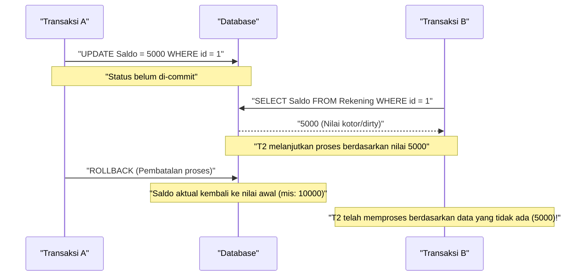

Dalam RDBMS (Relational Database Management System), konsep yang paling mendasar dan penting untuk melindungi integritas dan konsistensi data serta memastikan keandalan sistem adalah **Transaksi** (Transaction).

Dalam aplikasi Web modern atau sistem enterprise, banyak pengguna melakukan baca dan tulis ke database secara bersamaan. Di bawah lingkungan pemrosesan paralel seperti ini, memahami secara mendalam mekanisme agar data diproses secara benar tanpa kontradiksi adalah keterampilan yang wajib dimiliki oleh insinyur backend maupun administrator database.

Artikel ini akan memberikan penjelasan yang sangat rinci dan komprehensif tentang **Karakteristik ACID**, yang merupakan teori dasar di balik transaksi database, berbagai **Anomali** (Anomaly) yang dapat terjadi ketika beberapa transaksi dieksekusi secara bersamaan, dan **Level Isolasi Transaksi** (Isolation Level) yang mendefinisikan cara mencegah anomali tersebut. Selain itu, kita juga akan menggali lebih dalam mengenai metode implementasi spesifik seperti **Pessimistic Lock** dan **Optimistic Lock** untuk melindungi data dari konflik, serta **MVCC** (Multi-Version Concurrency Control) yang diadopsi secara luas di RDBMS modern.

---

## 1. Apa itu Transaksi?

**Transaksi** mengacu pada "satu kesatuan operasi yang tidak dapat dibagi" terhadap database.
Ini adalah mekanisme yang mengelola beberapa perintah SQL (seperti penambahan, pembaruan, penghapusan data) sebagai satu unit kerja logis, dan menjamin bahwa sistem hanya akan berakhir dalam satu dari dua kondisi: "semuanya berhasil dan tercermin dalam database (**Commit**)", atau "gagal di tengah jalan dan kembali sepenuhnya ke status semula tanpa perubahan yang tercermin (**Rollback**)".

### 1.1 Contoh Transfer Rekening (Perlunya Transaksi)

Contoh yang sering digunakan untuk menjelaskan pentingnya transaksi adalah transfer dana (pengiriman uang) antar rekening bank.
Misalnya, proses "mengirimkan uang Rp 10.000 dari rekening A ke rekening B" pada database akan dipecah menjadi 2 langkah (proses pembaruan) berikut:

1. Mengurangi saldo rekening A sebesar Rp 10.000 (UPDATE)
2. Menambah saldo rekening B sebesar Rp 10.000 (UPDATE)

Jika gangguan sistem atau kesalahan jaringan terjadi tepat setelah proses 1 berhasil dan proses 2 tidak sempat dieksekusi, apa yang akan terjadi?
Uang Rp 10.000 telah ditarik dari rekening A, tetapi uang tersebut belum disetorkan ke rekening B. Hal ini akan menyebabkan **inkonsistensi data** yang fatal bagi sebuah sistem keuangan.

Dengan menggunakan transaksi, kejadian seperti ini dapat dihindari.

```sql
BEGIN TRANSACTION; -- Memulai transaksi

-- 1. Mengurangi Rp 10000 dari rekening A
UPDATE accounts
SET balance = balance - 10000
WHERE account_id = 'A' AND balance >= 10000;

-- 2. Menambahkan Rp 10000 ke rekening B
UPDATE accounts
SET balance = balance + 10000
WHERE account_id = 'B';

COMMIT; -- Ditetapkan hanya jika semua proses berhasil
-- ※ Jika terjadi kesalahan, akan dilakukan ROLLBACK sehingga pengurangan pada proses 1 seolah-olah tidak pernah terjadi
```

Dengan cara ini, dengan mengikat beberapa proses pembaruan yang terkait ke dalam satu unit yang tidak dapat dibagi, peran terbesar dari transaksi adalah mempertahankan integritas database.

---

## 2. Karakteristik ACID (4 Syarat Transaksi)

Terdapat 4 sifat yang harus dipenuhi agar transaksi dapat dieksekusi dengan aman, dan sering disebut sebagai **Karakteristik ACID** yang diambil dari huruf awal masing-masing sifat. RDBMS dilengkapi dengan mekanisme internal yang kompleks untuk menjamin karakteristik ACID ini.

### 2.1 Atomicity (Atomisitas)
**Atomicity** adalah sifat yang menjamin bahwa semua operasi dalam suatu transaksi akan "dieksekusi seluruhnya, atau tidak dieksekusi sama sekali (All or Nothing)".
Seperti contoh transfer rekening di atas, jika proses gagal di tengah jalan, sistem harus melakukan **rollback** (pembatalan) sepenuhnya ke keadaan sebelum transaksi dimulai, termasuk membatalkan perubahan yang sudah sempat dieksekusi. Keadaan setengah matang (commit parsial) yang tertinggal di database tidak diperbolehkan.

### 2.2 [Consistency](https://kenji.blog/id/p/cap-theorem-distributed-systems-tradeoff/) (Konsistensi / Integritas)
**Consistency** adalah sifat yang menjamin bahwa aturan (kendala/constraint) database tetap terpenuhi secara konsisten sebelum dan sesudah eksekusi transaksi.
Dalam database, kita dapat mendefinisikan aturan yang harus dipenuhi oleh data seperti Primary Key, Foreign Key, Unique constraint, maupun Check constraint. Hasil pembaruan data dari suatu transaksi tidak diizinkan untuk melanggar aturan-aturan ini. Jika terjadi pelanggaran, transaksi akan segera di-rollback. Dengan kata lain, transaksi berperan untuk memindahkan database dari "satu keadaan yang konsisten" ke "keadaan konsisten yang lain".

### 2.3 Isolation (Isolasi / Independensi)
**Isolation** adalah sifat yang memastikan bahwa meskipun beberapa transaksi dieksekusi secara bersamaan, setiap transaksi tidak memengaruhi atau dipengaruhi oleh proses eksekusi (keadaan sementara) dari transaksi lain.
Isolasi yang ideal berarti hasil dari beberapa transaksi yang dieksekusi secara paralel akan sama persis dengan jika transaksi tersebut dieksekusi satu per satu secara berurutan (**Serializability**). Namun, karena menjamin isolasi secara penuh akan menurunkan kinerja pemrosesan paralel (throughput) sistem secara drastis, RDBMS nyata menyediakan **Level Isolasi** (dibahas nanti) untuk menyesuaikan trade-off antara kinerja dan isolasi.

### 2.4 Durability (Durabilitas / Ketahanan)
**Durability** adalah sifat yang menjamin bahwa setelah sebuah transaksi di-**commit** (selesai), hasilnya tidak akan pernah hilang meskipun terjadi kegagalan sistem (mati listrik, crash, dll).
RDBMS biasanya memperbarui data di memori (buffer pool) dan menuliskannya ke disk secara asinkron. Namun, pada saat commit, perubahan (riwayat pembaruan) tersebut pasti direkam sebagai **Write-Ahead Log** (WAL: Write-Ahead Log atau REDO log, dsb) ke media penyimpanan permanen seperti disk. Dengan demikian, kalaupun database crash, status yang telah di-commit dapat dipulihkan (recovery) menggunakan log saat sistem dinyalakan kembali.

---

## 3. Kontrol Konkurensi dan Anomali Transaksi (Anomaly)

Ketika banyak pengguna atau aplikasi mengakses database dan menjalankan transaksi secara paralel, tanpa kontrol yang tepat, akan muncul berbagai **Inkonsistensi data (Anomali / Anomaly)**. Untuk memahami level isolasi, penting untuk mengetahui jenis-jenis anomali yang ada.

### 3.1 Dirty Read
**Dirty Read** adalah fenomena di mana suatu transaksi membaca data yang telah diperbarui oleh transaksi lain namun **belum di-commit (masih belum pasti)**.

Diagram urutan berikut menunjukkan proses terjadinya Dirty Read.



Jika Transaksi A me-rollback prosesnya, Transaksi B telah melanjutkan proses dengan membaca "data fiktif yang pada akhirnya tidak ada di database", yang dapat memicu kesalahan logika yang fatal.

### 3.2 Non-repeatable Read
**Non-repeatable Read** (Pembacaan yang Tidak Dapat Diulang) adalah fenomena di mana ketika query yang sama dieksekusi dua kali dalam satu transaksi yang sama, hasil pembacaan (nilai) pada percobaan pertama dan kedua berbeda karena transaksi lain telah melakukan **UPDATE dan commit** pada data tersebut di antara kedua waktu pembacaan.

1. Transaksi A melakukan SELECT pada baris `id=1` (nilainya 100).
2. Transaksi B melakukan UPDATE pada baris `id=1` menjadi 200, lalu di-commit.
3. Transaksi A melakukan SELECT kembali pada baris `id=1`, dan nilainya telah berubah menjadi 200.

Dari sudut pandang Transaksi A, ia akan menghadapi keadaan yang tidak konsisten yaitu "meskipun saya sendiri tidak mengubah apa-apa, data selalu berubah setiap kali dibaca".

### 3.3 Phantom Read
**Phantom Read** (Pembacaan Bayangan) adalah fenomena di mana ketika query pencarian dengan kondisi yang sama (misalnya pencarian rentang) dieksekusi dua kali dalam satu transaksi yang sama, baris yang sebelumnya tidak ada pada pembacaan pertama tiba-tiba muncul (atau baris yang tadinya ada menjadi hilang) pada pembacaan kedua karena transaksi lain telah **menambahkan (INSERT) atau menghapus (DELETE)** data dan me-commit perubahannya di antara waktu tersebut.

Sementara Non-repeatable Read disebabkan oleh **pembaruan (UPDATE) baris yang sudah ada**, Phantom Read mengacu pada fenomena di mana jumlah atau struktur baris dalam hasil query berubah akibat **penambahan atau penghapusan (INSERT/DELETE) baris**.

### 3.4 Lost Update
**Lost Update** (Kehilangan Pembaruan) adalah fenomena di mana ketika beberapa transaksi membaca baris yang sama secara bersamaan, melakukan perhitungan masing-masing, dan kemudian menulis kembali pembaruan tersebut, **pembaruan yang ditulis belakangan menimpa dan menghilangkan pembaruan yang ditulis sebelumnya**.

1. Transaksi A membaca saldo (Rp 10.000).
2. Transaksi B juga membaca saldo yang sama (Rp 10.000).
3. Transaksi A menambahkan Rp 1.000, meng-UPDATE saldo menjadi Rp 11.000, lalu commit.
4. Transaksi B mengurangi Rp 2.000, meng-UPDATE saldo menjadi Rp 8.000, lalu commit.

Akibatnya, saldo di database menjadi Rp 8.000. "Penambahan Rp 1.000" yang dilakukan Transaksi A sepenuhnya ditimpa oleh pembaruan Transaksi B dan hilang. Jika diproses dalam urutan yang benar, seharusnya saldonya menjadi Rp 9.000. Ini adalah masalah serius yang sering terjadi pada pola proses di mana aplikasi memuat data ke memori sebelum melakukan perhitungan.

---

## 4. Level Isolasi Transaksi ANSI SQL

Untuk mencegah berbagai anomali seperti disebutkan di atas, standar ANSI SQL mendefinisikan 4 **Level Isolasi Transaksi** (Isolation Level). Semakin tinggi (semakin ketat) level isolasi yang diatur, integritas data akan semakin kuat terlindungi. Namun pada saat yang sama, kemungkinan transaksi lain harus menunggu (konflik lock) juga semakin tinggi, yang menyebabkan penurunan kinerja pemrosesan paralel.

| Level Isolasi (Isolation Level) | Dirty Read | Non-repeatable Read | Phantom Read |
| :--- | :---: | :---: | :---: |
| **Read Uncommitted** | Terjadi | Terjadi | Terjadi |
| **Read Committed** | **Dapat dicegah** | Terjadi | Terjadi |
| **Repeatable Read** | **Dapat dicegah** | **Dapat dicegah** | Terjadi (※) |
| **Serializable** | **Dapat dicegah** | **Dapat dicegah** | **Dapat dicegah** |

*(※ Pada Repeatable Read milik InnoDB di MySQL, sebagian besar Phantom Read juga dapat dicegah secara default berkat mekanisme Next-Key Lock dan MVCC)*

### 4.1 Read Uncommitted
Ini adalah level isolasi terendah. Ia bahkan akan membaca perubahan dari transaksi lain yang belum di-commit (terjadi Dirty Read). Karena integritas data sama sekali tidak dijamin, level ini hampir tidak pernah digunakan dalam praktik nyata, kecuali untuk proses agregasi khusus yang lebih mengutamakan kinerja ekstrem ketimbang akurasi ketat. Di beberapa DBMS seperti PostgreSQL, bahkan jika Anda menentukan level ini, secara internal ia akan bekerja sebagai Read Committed.

### 4.2 Read Committed
Ini adalah level isolasi default yang digunakan oleh banyak RDBMS (pengaturan default pada Oracle, PostgreSQL, dan SQL Server).
Data yang dibaca oleh transaksi dipastikan hanyalah data yang sudah di-**commit**. Hal ini mencegah Dirty Read. Namun, jika transaksi lain memperbarui dan men-commit data saat transaksi berjalan, data tersebut akan terbaca. Karena itu, Non-repeatable Read dan Phantom Read masih dapat terjadi.

### 4.3 Repeatable Read
Ini adalah level isolasi default pada MySQL (InnoDB).
Set data yang dibaca di awal transaksi dijamin akan tetap sama sampai transaksi berakhir. Artinya, meskipun transaksi lain memperbarui dan men-commit data tersebut saat transaksi kita sedang berjalan, kita akan tetap melihat data lama (pada saat transaksi kita dimulai). Hal ini mencegah Non-repeatable Read.
Namun, berdasarkan definisi standar ANSI yang ketat, Phantom Read yang disebabkan oleh penambahan/penghapusan baris masih dapat terjadi (seperti yang telah disebutkan, pada implementasi seperti InnoDB MySQL, Phantom Read juga ikut ditekan).

### 4.4 Serializable
Ini adalah level isolasi yang paling ketat, menjamin hasil yang seolah-olah semua transaksi dieksekusi sepenuhnya secara berurutan (serial). Ini sepenuhnya mencegah semua anomali (Dirty Read, Non-repeatable Read, Phantom Read).
Namun, untuk mencapai ini, dibutuhkan cakupan lock yang luas (seperti table lock atau range lock) atau mekanisme deteksi konflik yang kompleks (misalnya SSI: Serializable Snapshot Isolation). Akibatnya, kinerja pemrosesan paralel akan sangat dikorbankan, dan risiko terjadinya rollback transaksi (percobaan ulang akibat error konflik) akan sangat tinggi.

---

## 5. Mekanisme Implementasi Kontrol Konkurensi (Lock dan MVCC)

Secara spesifik, bagaimana RDBMS mengimplementasikan tuntutan logis berdasarkan level isolasi tersebut? Secara historis, kontrol utama dilakukan dengan **mekanisme lock** (kunci), tetapi saat ini **MVCC** lebih banyak digunakan untuk meningkatkan kinerja pemrosesan paralel.

### 5.1 Kontrol Berbasis Lock (Pessimistic Lock)
RDBMS tradisional melakukan kontrol eksklusif dengan "mengunci" resource (baris atau tabel).
- **Shared Lock (S-Lock)**: Diperoleh saat membaca data. Transaksi lain juga dapat memperoleh shared lock dan membaca data secara bersamaan, tetapi tidak diizinkan untuk mengubah data (memperoleh X-Lock).
- **Exclusive Lock (X-Lock)**: Diperoleh saat memperbarui atau menghapus data. Transaksi lain tidak dapat membaca (S-Lock) maupun memperbarui (X-Lock) dan akan disuruh menunggu (terblokir).

Kontrol berbasis lock sangat pasti, namun memiliki kelemahan besar yaitu **"proses pembacaan memblokir proses pembaruan"** dan **"proses pembaruan memblokir proses pembacaan"**. Ini menjadi penyebab turunnya throughput atau terjadinya **Deadlock**, di mana transaksi saling menunggu tanpa akhir agar kunci dilepaskan.

### 5.2 MVCC (Multi-Version Concurrency Control)
**MVCC** (Kontrol Konkurensi Multi-Versi) muncul untuk mengatasi kelemahan pada sistem lock ini. Sebagian besar RDBMS utama modern seperti PostgreSQL, MySQL (InnoDB), dan Oracle mengadopsinya.
Konsep dasar dari MVCC adalah **"alih-alih menimpa data asli saat ada pembaruan, buat versi (salinan) baru dari data tersebut"**.

- **Proses pembacaan** akan membaca "data versi masa lalu (snapshot)" pada saat transaksi dimulai.
- **Proses pembaruan** akan membuat "data versi terbaru" baru, yang baru menjadi efektif saat di-commit.

Hal ini memungkinkan tingkat konkurensi yang sangat tinggi di mana **"pembacaan tidak memblokir pembaruan"** dan **"pembaruan tidak memblokir pembacaan"**, sambil tetap menjamin konsistensi tingkat Read Committed maupun Repeatable Read. Dalam lingkungan MVCC, proses berikutnya hanya perlu menunggu jika terjadi konflik antara lock eksklusif (X-Lock) (yaitu ketika mencoba memperbarui baris yang sama persis secara bersamaan).

---

## 6. Tindakan Pencegahan Konflik di Lapisan Aplikasi (Pessimistic Lock dan Optimistic Lock)

Selain dari kontrol isolasi atau MVCC pada tingkat database, sangat umum bagi aplikasi untuk menggabungkan SQL untuk melakukan kontrol lock secara eksplisit, terutama untuk mencegah **Lost Update** yang telah disebutkan dan memastikan integritas data dalam logika bisnis. Metode yang merepresentasikan ini adalah **Pessimistic Lock** dan **Optimistic Lock**.

Diagram berikut membandingkan alur dan perilaku dari dua metode penguncian ini.

```mermaid
flowchart TD
    subgraph "Pessimistic Lock (Kunci Pesimis)"
        P1("T1: SELECT ... FOR UPDATE")
        P2("DB: Mendapatkan kunci eksklusif pada baris target")
        P3("T2: SELECT ... FOR UPDATE")
        P4("DB: T2 menunggu (terblokir) hingga kunci dilepaskan")
        P5("T1: UPDATE & COMMIT")
        P6("DB: Kunci dilepaskan")
        P7("T2: Penundaan dibatalkan, mendapatkan kunci & melanjutkan proses")

        P1 --> P2
        P2 --> P3
        P3 --> P4
        P4 --> P5
        P5 --> P6
        P6 --> P7
    end

    subgraph "Optimistic Lock (Kunci Optimis)"
        O1("T1: SELECT (version=1)")
        O2("T2: SELECT (version=1)")
        O3("T1: UPDATE ... WHERE version=1")
        O4("DB: Berhasil (diperbarui ke version=2)")
        O5("T2: UPDATE ... WHERE version=1")
        O6("DB: Jumlah pembaruan 0 (Gagal, mendeteksi konflik)")
        O7("T2: Penanganan kesalahan di aplikasi (mis: retry)")

        O1 --> O2
        O2 --> O3
        O3 --> O4
        O4 --> O5
        O5 --> O6
        O6 --> O7
    end
```



### 6.1 Pessimistic Lock (Kunci Pesimis)
**Pessimistic Lock** didasarkan pada asumsi bahwa "kemungkinan besar pengguna lain akan memperbarui data yang sama pada saat yang sama (pesimis)". Karena itu, pada awal pemrosesan, secara eksplisit ia memperoleh kunci eksklusif (exclusive lock) di tingkat baris dari database untuk memblokir akses pengguna lain sepenuhnya.

Di tingkat SQL, hal ini dapat direalisasikan dengan menambahkan klausa `FOR UPDATE` di akhir pernyataan `SELECT`.

```sql
BEGIN TRANSACTION;

-- Mendapatkan kunci eksklusif pada baris target. Transaksi lain akan diblokir di sini
SELECT balance FROM accounts WHERE account_id = 'A' FOR UPDATE;

-- Mengeksekusi logika bisnis (seperti pengecekan saldo, perhitungan) kemudian memperbarui
UPDATE accounts SET balance = balance - 10000 WHERE account_id = 'A';

COMMIT; -- Kunci dilepaskan
```

**Kelebihan**: Dapat sepenuhnya mencegah konflik data, dan alur pemrosesannya sederhana.
**Kekurangan**: Selama kunci dipegang, transaksi lain akan diblokir sehingga performa mudah menurun. Jika kunci dipegang terus-menerus selama transaksi panjang atau saat pemrosesan layar menunggu input pengguna, hal itu berisiko menyebabkan sistem secara keseluruhan terhenti.

### 6.2 Optimistic Lock (Kunci Optimis)
**Optimistic Lock** didasarkan pada asumsi bahwa "konflik data akan sangat jarang terjadi (optimis)". Karena itu, ia tidak melakukan penguncian sebelumnya, melainkan **saat momen data akan diperbarui, ia memverifikasi apakah ada orang lain yang telah membuat perubahan**.

Umumnya, metode ini diimplementasikan dengan menambahkan **kolom untuk manajemen versi (mis: `version` INT)** atau kolom tanggal dan waktu pembaruan terakhir pada tabel target.

```sql
-- 1. Mendapatkan data di awal dan menyimpan versi saat ini (version = 1) ke memori aplikasi
SELECT balance, version FROM accounts WHERE account_id = 'A';

-- (Di sini aplikasi melakukan perhitungan atau menampilkan layar konfirmasi ke pengguna, dll)

-- 2. Saat memperbarui, masukkan versi yang didapat ke klausa WHERE, sekaligus melakukan increment versi
UPDATE accounts
SET balance = balance - 10000,
    version = version + 1
WHERE account_id = 'A'
  AND version = 1; -- Memeriksa apakah versinya cocok dengan versi pada saat dibaca
```

Ketika menjalankan pernyataan UPDATE ini, sisi aplikasi akan memeriksa nilai kembalian database berupa **jumlah baris yang diperbarui (Affected Rows)**.
- **Jika jumlah yang diperbarui adalah 1 baris**: Tidak ada konflik, pembaruan berhasil diselesaikan secara normal.
- **Jika jumlah yang diperbarui adalah 0 baris**: Ini berarti di antara saat kita membaca data dan memperbaruinya, ada transaksi lain yang telah memperbarui data tersebut dan nilai `version` telah naik menjadi `2` atau lebih (atau baris tersebut telah dihapus). Dalam kasus ini, aplikasi akan mengembalikan **error eksklusif** kepada pengguna, misalnya "Data telah diubah oleh pengguna lain. Silakan periksa informasi terbaru dan coba lagi", atau melakukan proses coba lagi (retry) secara otomatis.

**Kelebihan**: Karena tidak menduduki kunci (lock) database dalam waktu lama, tingkat paralelisme konkurensinya sangat tinggi dan performanya unggul. Sangat ideal untuk mencegah konflik pada proses Web Application stateles yang melintasi permintaan/respons HTTP (mulai dari tampilan layar hingga penekanan tombol).
**Kekurangan**: Penanganan ketika terjadi konflik (seperti tampilan error atau retry) perlu diimplementasikan di sisi aplikasi. Di lingkungan di mana konflik sering terjadi, biaya overhead (beban) proses retry bisa menjadi besar.

---

## 7. Kesimpulan

**Transaksi** dalam database bukan sekadar perpanjangan dari SQL semata, melainkan inti dari pengembangan backend yang memengaruhi keseluruhan keandalan dan performa sistem.

- Memahami **Karakteristik ACID** untuk mengetahui bagaimana RDBMS melindungi data.
- Mengenali berbagai anomali seperti **Dirty Read**, **Phantom Read**, dan **Lost Update** yang dapat ditimbulkan akibat pemrosesan paralel.
- Mengetahui nilai default dan perbedaan perilaku **Level Isolasi Transaksi (Isolation Level)** pada setiap DBMS (seperti perbedaan Read Committed dan Repeatable Read), dan memilih level isolasi yang sesuai dengan kebutuhan.
- Memahami karakteristik **Pessimistic Lock** dan **Optimistic Lock**, serta mengimplementasikan kontrol eksklusif yang paling optimal pada aplikasi sesuai dengan logika bisnis dan sifat lalu lintas data (frekuensi konflik).

Hanya dengan menggabungkan pengetahuan dan teknik ini, kita baru bisa membangun sistem yang kokoh dengan semboyan "mampu berkembang dengan performa tinggi tanpa menyebabkan inkonsistensi data".
Pada artikel selanjutnya, kami akan membahas bagaimana kontrol transaksi berevolusi pada arsitektur [sistem terdistribusi](/id/p/cap-theorem-distributed-systems-tradeoff/) dan layanan mikro ([Microservices](https://kenji.blog/id/p/microservices-architecture-bff-api-gateway/)), seperti pola Saga dan 2PC. Selamat menantikan.
