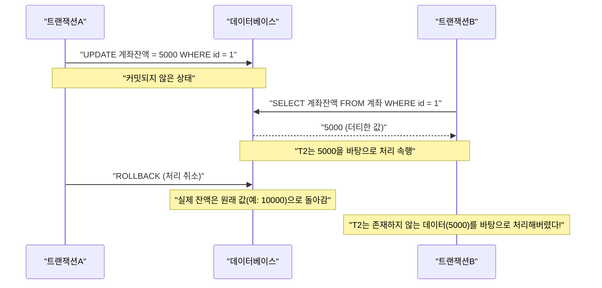

RDBMS(관계형 데이터베이스 관리 시스템)에서 데이터의 정합성과 일관성을 지키고 시스템의 신뢰성을 확보하기 위한 가장 근본적이고 중요한 개념이 **트랜잭션**(Transaction)입니다.

현대의 웹 애플리케이션이나 엔터프라이즈 시스템에서는 동시에 수많은 사용자가 데이터베이스를 읽고 씁니다. 이러한 병행 처리 환경에서 데이터가 모순 없이 올바르게 처리되기 위한 구조를 깊이 이해하는 것은 백엔드 엔지니어나 데이터베이스 관리자에게 필수적인 스킬이라고 할 수 있습니다.

본 문서에서는 데이터베이스 트랜잭션을 뒷받침하는 기초 이론인 **ACID 특성**부터, 여러 트랜잭션이 동시에 실행될 때 발생할 수 있는 다양한 **이상(Anomaly)** 현상, 그리고 이러한 이상 현상을 어떻게 방지할지 정의한 **트랜잭션 격리 수준(Isolation Level)**에 대해 매우 상세하고 포괄적으로 해설합니다. 나아가 데이터를 경합으로부터 보호하기 위한 구체적인 구현 기법인 **비관적 잠금(Pessimistic Lock)**과 **낙관적 잠금(Optimistic Lock)**, 그리고 현대 RDBMS에서 널리 채택되고 있는 **MVCC(다중 버전 동시성 제어)**에 대해서도 깊이 파헤쳐 보겠습니다.

---

## 1. 트랜잭션이란 무엇인가?

**트랜잭션**이란 데이터베이스에 대한 "분할할 수 없는 일련의 처리 단위"를 말합니다.
여러 SQL 문(데이터의 추가, 갱신, 삭제 등)을 하나의 논리적인 작업 단위로 취급하여, 그 "모든 것이 성공하여 데이터베이스에 반영되거나(**커밋**)", "도중에 실패하여 전혀 반영되지 않고 원래 상태로 되돌아가거나(**롤백**)" 둘 중 하나의 결과만 발생하도록 보장하는 메커니즘입니다.

### 1.1 계좌 이체의 예 (트랜잭션의 필요성)

트랜잭션의 중요성을 설명할 때 자주 사용되는 것이 은행의 계좌 이체(송금) 예시입니다.
예를 들어, "A의 계좌에서 B의 계좌로 10,000원을 송금한다"는 처리는 데이터베이스 상에서 다음 두 가지 단계(갱신 처리)로 분해됩니다.

1. A의 계좌 잔액을 10,000원 줄인다 (UPDATE)
2. B의 계좌 잔액을 10,000원 늘린다 (UPDATE)

만약 1번 처리가 성공한 직후 시스템 장애나 네트워크 오류가 발생하여 2번 처리가 실행되지 않는다면 어떻게 될까요?
A의 계좌에서는 10,000원이 출금되었는데, B의 계좌에는 10,000원이 입금되지 않는 금융 시스템으로서는 치명적인 **데이터 불일치(정합성 오류)**가 발생하게 됩니다.

트랜잭션을 이용하면 이러한 사태를 방지할 수 있습니다.

```sql
BEGIN TRANSACTION; -- 트랜잭션 시작

-- 1. A의 계좌에서 10000원 차감
UPDATE accounts
SET balance = balance - 10000
WHERE account_id = 'A' AND balance >= 10000;

-- 2. B의 계좌에 10000원 합산
UPDATE accounts
SET balance = balance + 10000
WHERE account_id = 'B';

COMMIT; -- 모든 처리가 성공한 경우에만 확정
-- ※ 오류가 발생한 경우에는 ROLLBACK 되어, 1번의 차감도 없었던 일이 됨
```

이처럼 관련된 여러 갱신 처리를 나눌 수 없는 하나의 단위로 묶음으로써 데이터베이스의 무결성을 유지하는 것이 트랜잭션의 가장 큰 역할입니다.

---

## 2. ACID 특성 (트랜잭션의 4가지 요건)

트랜잭션이 안전하게 실행되기 위해 충족해야 할 4가지 성질이 있으며, 각각의 앞 글자를 따서 **ACID 특성**이라고 부릅니다. RDBMS는 이 ACID 특성을 보장하기 위한 복잡한 메커니즘을 내부에 갖추고 있습니다.

### 2.1 Atomicity (원자성)
**Atomicity**(원자성)는 트랜잭션 내의 모든 조작이 "모두 실행되거나, 전혀 실행되지 않거나(All or Nothing)" 둘 중 하나임을 보장하는 성질입니다.
앞서 언급한 계좌 이체의 예처럼, 도중에 처리가 실패한 경우에는 이미 실행된 변경 사항을 포함하여 트랜잭션 시작 전의 상태로 완전히 **롤백**(취소)되어야 합니다. 어중간한 상태(부분적인 커밋)가 데이터베이스에 남는 것은 허용되지 않습니다.

### 2.2 [Consistency](https://kenji.blog/ko/p/cap-theorem-distributed-systems-tradeoff/) (일관성)
**Consistency**(일관성)는 트랜잭션 실행 전후로 데이터베이스의 규칙(제약 조건)이 일관되게 충족됨을 보장하는 성질입니다.
데이터베이스에는 기본 키 제약(Primary Key), 외래 키 제약(Foreign Key), 고유 제약(Unique), 체크 제약(Check) 등 데이터가 충족해야 할 규칙을 정의할 수 있습니다. 트랜잭션에 의해 데이터가 갱신된 결과 이러한 제약을 위반하는 상태가 되는 것은 허용되지 않으며, 위반이 발생한 경우 즉시 롤백됩니다. 즉, 트랜잭션은 데이터베이스를 "어떤 일관성 있는 상태"에서 "다른 일관성 있는 상태"로 전이시키는 역할을 합니다.

### 2.3 Isolation (독립성/격리성)
**Isolation**(독립성)은 여러 트랜잭션이 동시에 실행되더라도 각각의 트랜잭션이 다른 트랜잭션의 실행 과정(중간 상태)에 영향을 주거나 받지 않도록 하는 성질입니다.
이상적인 독립성이란 여러 트랜잭션이 병행하여 실행된 결과가 이들을 하나씩 순서대로(직렬로) 실행했을 때의 결과와 완전히 일치하는 것입니다(이를 **직렬화 가능성**이라고 부릅니다). 그러나 완벽한 독립성을 보장하려고 하면 시스템의 병행 처리 성능(처리량)이 현저히 저하되므로, 실제 RDBMS에서는 성능과 독립성의 트레이드오프를 조정하기 위한 **격리 수준**(후술)이 준비되어 있습니다.

### 2.4 Durability (지속성)
**Durability**(지속성)는 트랜잭션이 한 번 **커밋**(완료)되면 그 결과는 시스템 장애(전원 차단, 크래시 등)가 발생하더라도 결코 손실되지 않음을 보장하는 성질입니다.
RDBMS는 통상적으로 데이터를 메모리상(버퍼 풀)에서 갱신하고 비동기적으로 디스크에 기록하지만, 커밋 시에는 반드시 갱신 내용(변경 이력)을 **미리 쓰기 로그**(WAL: Write-Ahead Log나 REDO 로그 등)로서 디스크 등의 영구 스토리지에 기록합니다. 이를 통해 만에 하나 데이터베이스가 크래시되더라도 재시작 시 로그를 이용하여 커밋된 상태를 복원(복구)할 수 있습니다.

---

## 3. 동시성 제어와 트랜잭션 이상 (Anomaly)

데이터베이스에 여러 사용자나 애플리케이션이 동시에 접근하여 병행해서 트랜잭션을 실행할 경우, 적절하게 제어하지 않으면 다양한 **데이터 불일치(이상 현상, Anomaly)**가 발생합니다. 격리 수준을 이해하는 전제 조건으로 어떠한 이상 현상들이 존재하는지 파악해 두는 것이 필수적입니다.

### 3.1 더티 리드 (Dirty Read)
**더티 리드**란 어떤 트랜잭션이 다른 트랜잭션이 갱신하고 **아직 커밋하지 않은(미확정된) 데이터**를 읽어버리는 현상입니다.

다음 시퀀스 다이어그램은 더티 리드가 발생하는 과정을 보여줍니다.



만약 트랜잭션A가 처리를 롤백한 경우, 트랜잭션B는 "최종적으로 데이터베이스에 존재하지 않았던 환상의 데이터"를 읽어서 처리를 진행해 버린 셈이 되어, 치명적인 논리적 오류를 유발합니다.

### 3.2 논리피터블 리드 (Non-repeatable Read)
**논리피터블 리드**(반복 불가능한 읽기)란 같은 트랜잭션 내에서 같은 쿼리를 두 번 실행했을 때, 그 사이에 다른 트랜잭션이 데이터를 **갱신·커밋**했기 때문에 첫 번째와 두 번째에 읽은 결과(값)가 달라지는 현상입니다.

1. 트랜잭션A가 `id=1`인 행을 SELECT (값은 100이라고 가정).
2. 트랜잭션B가 `id=1`인 행을 200으로 UPDATE하고 커밋.
3. 트랜잭션A가 다시 `id=1`인 행을 SELECT하면 값이 200으로 바뀌어 있음.

트랜잭션A의 관점에서는 "자신이 아무것도 변경하지 않았는데 읽을 때마다 데이터가 변해버리는" 일관성 없는 상태에 직면하게 됩니다.

### 3.3 팬텀 리드 (Phantom Read)
**팬텀 리드**(유령 읽기)란 같은 트랜잭션 내에서 동일한 검색 조건(범위 검색 등)의 쿼리를 두 번 실행했을 때, 그 사이에 다른 트랜잭션이 새로운 데이터를 **추가(INSERT) 또는 삭제(DELETE)**하여 커밋했기 때문에 첫 번째에는 존재하지 않던(혹은 존재하던) 행이 두 번째에는 나타나는(혹은 사라지는) 현상입니다.

논리피터블 리드가 **기존 행의 갱신(UPDATE)**에 의해 발생하는 반면, 팬텀 리드는 **행의 추가나 삭제(INSERT/DELETE)**에 의해 결과 집합의 행 수나 구성 자체가 변화해버리는 현상을 가리킵니다.

### 3.4 로스트 업데이트 (Lost Update)
**로스트 업데이트**(갱신 손실)란 여러 트랜잭션이 같은 행을 동시에 읽고 각각 계산을 수행한 후 갱신 내용을 다시 기록할 때, **나중에 기록한 갱신에 의해 먼저 수행된 갱신이 덮어씌워져 소멸해 버리는** 현상입니다.

1. 트랜잭션A가 잔액(10000원)을 읽음.
2. 트랜잭션B도 같은 잔액(10000원)을 읽음.
3. 트랜잭션A가 1000원을 더하여 잔액을 11000원으로 UPDATE하고 커밋.
4. 트랜잭션B가 2000원을 빼서 잔액을 8000원으로 UPDATE하고 커밋.

결과적으로 데이터베이스의 잔액은 8000원이 됩니다. 트랜잭션A가 수행한 "1000원 더하기"는 트랜잭션B의 갱신에 의해 완전히 덮어씌워져 유실되어 버렸습니다. 올바른 순서로 처리되었다면 잔액은 9000원이 되어야 합니다. 이는 애플리케이션이 데이터를 메모리로 읽어 들인 후 계산을 수행하는 처리 패턴에서 빈번하게 발생하는 중대한 문제입니다.

---

## 4. ANSI SQL의 트랜잭션 격리 수준

앞서 설명한 다양한 이상 현상을 방지하기 위해 ANSI SQL 표준에는 4가지 **트랜잭션 격리 수준**(Isolation Level)이 정의되어 있습니다. 격리 수준을 높게(엄격하게) 설정할수록 데이터의 일관성은 더욱 강력하게 지켜지지만, 동시에 다른 트랜잭션을 대기시키는(잠금 경합이 일어나는) 확률이 높아져 병행 처리 성능이 저하됩니다.

| 격리 수준 (Isolation Level) | 더티 리드 | 논리피터블 리드 | 팬텀 리드 |
| :--- | :---: | :---: | :---: |
| **Read Uncommitted** (커밋되지 않은 읽기) | 발생함 | 발생함 | 발생함 |
| **Read Committed** (커밋된 읽기) | **방지됨** | 발생함 | 발생함 |
| **Repeatable Read** (반복 가능한 읽기) | **방지됨** | **방지됨** | 발생함 (※) |
| **Serializable** (직렬화 가능) | **방지됨** | **방지됨** | **방지됨** |

*(※ MySQL의 InnoDB의 Repeatable Read에서는 넥스트 키 잠금과 MVCC 메커니즘을 통해 기본적으로 팬텀 리드도 대부분 방지할 수 있습니다)*

### 4.1 Read Uncommitted
가장 낮은 격리 수준입니다. 다른 트랜잭션의 커밋되지 않은 변경 사항까지 읽어버립니다(더티 리드 발생). 데이터 정합성이 전혀 보장되지 않으므로, 엄밀한 정확성보다 극단적인 성능이 요구되는 특수한 집계 처리 등을 제외하고 실무에서 사용되는 일은 거의 없습니다. PostgreSQL 등 일부 DBMS에서는 이 수준을 지정해도 내부적으로 Read Committed로 동작하기도 합니다.

### 4.2 Read Committed
많은 RDBMS(Oracle, PostgreSQL, SQL Server의 기본 설정)에서 채택하고 있는 기본 격리 수준입니다.
트랜잭션이 읽는 데이터는 반드시 **커밋 완료된** 데이터뿐입니다. 이를 통해 더티 리드는 방지할 수 있지만, 자신의 트랜잭션 실행 중에 다른 트랜잭션이 데이터를 갱신하고 커밋하면 그것을 읽어버리게 되므로 논리피터블 리드나 팬텀 리드는 발생합니다.

### 4.3 Repeatable Read
MySQL(InnoDB)의 기본 격리 수준입니다.
트랜잭션 시작 시점에 읽은 데이터 집합은 트랜잭션이 종료될 때까지 일관되게 같은 상태임이 보장됩니다. 즉, 자신의 트랜잭션 도중에 다른 트랜잭션이 해당 데이터를 갱신하고 커밋하더라도, 자신의 트랜잭션에서는 과거의(시작 시점의) 데이터가 계속 보입니다. 이를 통해 논리피터블 리드를 방지합니다.
단, 엄격한 ANSI 표준의 정의로는 행의 추가·삭제에 대한 팬텀 리드는 발생할 수 있다고 되어 있습니다(앞서 언급했듯이 MySQL InnoDB 등에서는 구현 방식에 따라 팬텀 리드도 억제됩니다).

### 4.4 Serializable
가장 엄격한 격리 수준으로, 트랜잭션이 완전히 직렬(시리얼)로 실행된 것과 같은 결과를 보장합니다. 모든 이상 현상(더티 리드, 논리피터블 리드, 팬텀 리드)을 완벽하게 방지할 수 있습니다.
그러나 이를 실현하기 위해서는 광범위한 잠금(테이블 잠금이나 범위 잠금)이 필요하거나, 복잡한 경합 감지 메커니즘(SSI: Serializable Snapshot Isolation 등)이 작동하기 때문에 병행 처리 성능이 크게 희생되며 트랜잭션 롤백(경합 오류로 인한 재시도)이 빈발할 위험이 있습니다.

---

## 5. 동시성 제어의 구현 메커니즘 (잠금과 MVCC)

격리 수준에 따른 논리적인 요구 사항을 RDBMS는 구체적으로 어떻게 구현하고 있을까요? 역사적으로는 **잠금(Lock) 메커니즘**에 의한 제어가 주류였으나, 현대에는 병행 처리 성능을 높이기 위해 **MVCC**가 널리 보급되었습니다.

### 5.1 잠금 기반 제어 (비관적 잠금)
기존 RDBMS는 리소스(행이나 테이블)에 "자물쇠"를 채워 배타적 제어를 수행했습니다.
- **공유 잠금 (S 잠금 / Shared Lock)** : 데이터를 읽을 때 획득. 다른 트랜잭션도 공유 잠금을 획득하여 동시에 읽을 수 있으나, 데이터 변경(X 잠금 획득)은 불가능함.
- **배타 잠금 (X 잠금 / Exclusive Lock)** : 데이터를 갱신하거나 삭제할 때 획득. 다른 트랜잭션은 읽기(S 잠금)도 갱신(X 잠금)도 불가능하며, 대기(블록) 상태가 됨.

잠금 기반 제어는 확실하지만, **"읽기 처리가 갱신 처리를 블록한다"**, **"갱신 처리가 읽기 처리를 블록한다"**라는 큰 단점이 있어, 처리량 저하나 서로 잠금 해제를 계속 기다리는 **데드락(Deadlock)**을 유발하는 원인이 됩니다.

### 5.2 MVCC (Multi-Version Concurrency Control: 다중 버전 동시성 제어)
이러한 잠금의 단점을 극복하기 위해 등장한 것이 **MVCC**입니다. PostgreSQL, MySQL(InnoDB), Oracle 등 현대 주요 RDBMS 대부분이 채택하고 있습니다.
MVCC의 기본 개념은 **"데이터를 변경할 때 원래 데이터를 덮어쓰지 않고, 새로운 버전(판)의 데이터를 생성한다"**는 것입니다.

- **읽기 처리**는 트랜잭션 시작 시점의 "과거 버전의 데이터(스냅샷)"를 읽습니다.
- **갱신 처리**는 새롭게 "최신 버전의 데이터"를 생성하고, 커밋되는 시점에 유효해집니다.

이를 통해 **"읽기가 갱신을 블록하지 않고", "갱신이 읽기를 블록하지 않는"** 극히 높은 동시성을 실현하면서도 Read Committed나 Repeatable Read의 일관성을 보장할 수 있게 되었습니다. MVCC 환경에서는 배타 잠금(X 잠금)끼리 경합하는 경우(동일한 행을 동시에 갱신하려는 경우)에만 후속 처리가 대기하게 됩니다.

---

## 6. 애플리케이션 계층에서의 경합 대책 (비관적 잠금과 낙관적 잠금)

데이터베이스 수준의 격리 수준이나 MVCC 제어에 더하여, 특히 앞서 언급한 **로스트 업데이트**를 방지하고 업무상 데이터 정합성을 담보하기 위해 애플리케이션과 SQL을 조합하여 명시적으로 잠금을 제어하는 것이 일반적입니다. 그 대표적인 방법이 **비관적 잠금**과 **낙관적 잠금**입니다.

다음 그림은 두 가지 잠금 기법의 흐름과 동작의 차이를 비교한 것입니다.

```mermaid
flowchart TD
    subgraph "비관적 잠금 (Pessimistic Lock)"
        P1("T1: SELECT ... FOR UPDATE")
        P2("DB: 대상 행에 배타 잠금 획득")
        P3("T2: SELECT ... FOR UPDATE")
        P4("DB: 잠금 해제까지 T2 대기 (블록)")
        P5("T1: UPDATE & COMMIT")
        P6("DB: 잠금 해제")
        P7("T2: 대기 해제, 잠금 획득 & 처리 속행")

        P1 --> P2
        P2 --> P3
        P3 --> P4
        P4 --> P5
        P5 --> P6
        P6 --> P7
    end

    subgraph "낙관적 잠금 (Optimistic Lock)"
        O1("T1: SELECT (version=1)")
        O2("T2: SELECT (version=1)")
        O3("T1: UPDATE ... WHERE version=1")
        O4("DB: 성공 (version=2로 갱신)")
        O5("T2: UPDATE ... WHERE version=1")
        O6("DB: 갱신 건수 0 (실패, 경합을 감지)")
        O7("T2: 애플리케이션 측에서 재시도 등의 오류 핸들링")

        O1 --> O2
        O2 --> O3
        O3 --> O4
        O4 --> O5
        O5 --> O6
        O6 --> O7
    end
```



### 6.1 비관적 잠금 (Pessimistic Lock)
**비관적 잠금**은 "다른 사용자가 동시에 같은 데이터를 갱신할 가능성이 높다(비관적)"는 전제하에, 처리 시작 시 명시적으로 데이터베이스의 행 수준 배타 잠금을 획득하여 다른 사용자의 접근을 완전히 차단하는 기법입니다.

SQL 수준에서는 `SELECT` 문 끝에 `FOR UPDATE` 절을 추가하여 구현합니다.

```sql
BEGIN TRANSACTION;

-- 대상 행에 대해 배타 잠금을 획득. 다른 트랜잭션은 여기서 블록됨
SELECT balance FROM accounts WHERE account_id = 'A' FOR UPDATE;

-- 비즈니스 로직(잔액 체크나 계산 등)을 실행한 후 갱신
UPDATE accounts SET balance = balance - 10000 WHERE account_id = 'A';

COMMIT; -- 잠금 해제
```

**장점** : 데이터 경합을 완벽하게 방지할 수 있으며 처리 흐름이 단순합니다.
**단점** : 잠금을 획득하고 있는 동안 다른 트랜잭션을 블록하므로 성능이 저하되기 쉽습니다. 트랜잭션이 길어지거나 사용자 입력을 기다리는 화면 처리 중에 잠금을 계속 유지하면 시스템 전체의 마비를 초래할 우려가 있습니다.

### 6.2 낙관적 잠금 (Optimistic Lock)
**낙관적 잠금**은 "데이터 경합은 거의 발생하지 않을 것이다(낙관적)"라는 전제하에, 사전에 잠금을 걸지 않고 **막상 데이터를 갱신하는 순간에 다른 누군가가 변경을 가하지 않았는지를 검증하는** 기법입니다.

일반적으로 대상 테이블에 **버전 관리용 컬럼(예: `version` INT)**이나 최종 갱신 일시 컬럼을 추가하여 구현합니다.

```sql
-- 1. 사전에 데이터를 조회하여, 현재 버전(version = 1)을 애플리케이션의 메모리에 유지함
SELECT balance, version FROM accounts WHERE account_id = 'A';

-- (여기서 애플리케이션 측에서의 계산이나 사용자 확인 화면 표시 등을 수행)

-- 2. 갱신 시 조회했던 버전을 WHERE 절에 포함시키고, 동시에 버전을 1 증가시킴
UPDATE accounts
SET balance = balance - 10000,
    version = version + 1
WHERE account_id = 'A'
  AND version = 1; -- 자신이 읽었던 시점의 버전과 일치하는지 체크
```

이 UPDATE 문을 실행했을 때, 데이터베이스에서 반환되는 **갱신 건수(Affected Rows)**를 애플리케이션 측에서 확인합니다.
- **갱신 건수가 1건인 경우** : 경합이 없으며 정상적으로 갱신 완료.
- **갱신 건수가 0건인 경우** : 자신이 데이터를 읽고 갱신하기까지의 사이에 다른 트랜잭션이 데이터를 갱신하여 `version`이 `2` 이상으로 올라가 버렸음(또는 행이 삭제되었음)을 의미합니다. 이 경우 애플리케이션은 "데이터가 다른 사용자에 의해 변경되었습니다. 최신 정보를 확인하고 다시 실행해 주세요"와 같은 **배타 오류**를 사용자에게 반환하거나 자동 재시도를 수행합니다.

**장점** : 데이터베이스 잠금을 장기간 점유하지 않아 동시 병행성이 매우 높고 성능이 우수합니다. 웹 애플리케이션의 상태가 없는(Stateless) HTTP 요청/응답 사이를 넘나드는 처리(화면 표시부터 버튼 클릭까지)에서의 경합 방지에 최적입니다.
**단점** : 경합이 발생했을 때의 핸들링(오류 표시나 재시도)을 애플리케이션 측에서 구현해야 합니다. 경합이 빈번한 환경에서는 재시도 처리의 오버헤드가 커집니다.

---

## 7. 요약

데이터베이스의 **트랜잭션**은 단순한 SQL의 연장이 아니라, 시스템 전체의 신뢰성과 성능을 좌우하는 백엔드 개발의 핵심입니다.

- **ACID 특성**을 이해하고 RDBMS가 어떻게 데이터를 지키고 있는지 알아야 합니다.
- 병행 처리에 의해 발생하는 **더티 리드**나 **팬텀 리드**, **로스트 업데이트** 등 이상(Anomaly) 현상을 인식해야 합니다.
- DBMS별 **격리 수준(Isolation Level)**의 기본값과 동작의 차이(Read Committed와 Repeatable Read의 차이 등)를 파악하고, 요구 사항에 맞게 적절한 격리 수준을 선택해야 합니다.
- **비관적 잠금**과 **낙관적 잠금**의 특성을 이해하고, 비즈니스 로직이나 트래픽 특성(경합 빈도)에 맞춰 최적의 배타 제어를 애플리케이션에 구현해야 합니다.

이러한 지식과 기술을 결합해야만 비로소 "데이터 불일치를 일으키지 않으면서 고성능으로 확장되는" 견고한 시스템을 구축할 수 있습니다.
다음 문서에서는 이러한 트랜잭션 제어가 [분산 시스템](/ko/p/cap-theorem-distributed-systems-tradeoff/)이나 [마이크로서비스 아키텍처](/ko/p/microservices-architecture-bff-api-gateway/)에서 어떻게 진화하고 있는지(Saga 패턴이나 2PC 등)에 대해 해설할 예정입니다. 기대해 주세요.
