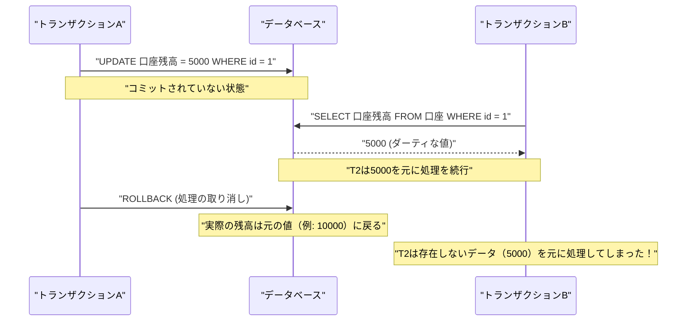

RDBMS（リレーショナルデータベース管理システム）において、データの整合性と一貫性を守り、システムの信頼性を確保するための最も根本的かつ重要な概念が **トランザクション** （Transaction）です。

現代のWebアプリケーションやエンタープライズシステムでは、同時に多数のユーザーがデータベースに対して読み書きを行います。このような並行処理環境下で、データが矛盾なく正しく処理されるための仕組みを深く理解することは、バックエンドエンジニアやデータベース管理者にとって必須のスキルと言えます。

本記事では、データベースのトランザクションを支える基礎理論である **ACID特性** から、複数のトランザクションが同時に実行された際に発生しうる様々な **異常（Anomaly）** 、そしてそれら異常をどのように防ぐかを定義した **トランザクション分離レベル（Isolation Level）** について、非常に詳細かつ網羅的に解説します。さらに、データを競合から守るための具体的な実装手法である **悲観的ロック** と **楽観的ロック** 、および近代的なRDBMSで広く採用されている **MVCC（多版同時実行制御）** についても深く掘り下げていきます。

---

## 1. トランザクションとは何か？

**トランザクション** とは、データベースに対する「分割不可能な一連の処理のまとまり」を指します。
複数のSQL文（データの追加、更新、削除など）を一つの論理的な作業単位として扱い、その「すべてが成功してデータベースに反映される（ **コミット** ）」か、「途中で失敗して一切反映されない元の状態に戻る（ **ロールバック** ）」かのどちらか一方のみになることを保証する仕組みです。

### 1.1 口座振替の例（トランザクションの必要性）

トランザクションの重要性を説明する際によく用いられるのが、銀行の口座振替（送金）の例です。
例えば、「Aさんの口座からBさんの口座へ10,000円を送金する」という処理は、データベース上では以下の2つのステップ（更新処理）に分解されます。

1. Aさんの口座残高を10,000円減らす（UPDATE）
2. Bさんの口座残高を10,000円増やす（UPDATE）

もし、1の処理が成功した直後にシステム障害やネットワークエラーが発生し、2の処理が実行されなかったらどうなるでしょうか？
Aさんの口座からは10,000円が引き落とされているのに、Bさんの口座には10,000円が入金されていないという、金融システムとしては致命的な **データの不整合** が発生してしまいます。

トランザクションを利用することで、このような事態を防ぐことができます。

```sql
BEGIN TRANSACTION; -- トランザクションの開始

-- 1. Aさんの口座から10000円を減算
UPDATE accounts
SET balance = balance - 10000
WHERE account_id = 'A' AND balance >= 10000;

-- 2. Bさんの口座へ10000円を加算
UPDATE accounts
SET balance = balance + 10000
WHERE account_id = 'B';

COMMIT; -- すべての処理が成功した場合のみ確定
-- ※ エラーが発生した場合は ROLLBACK され、1の減算も無かったことになる
```

このように、関連する複数の更新処理を不可分な一つの単位として束ねることで、データベースの完全性を維持するのがトランザクションの最大の役割です。

---

## 2. ACID特性（トランザクションの4つの要件）

トランザクションが安全に実行されるために満たすべき4つの性質があり、それぞれの頭文字を取って **ACID特性** （アシッド特性）と呼ばれます。RDBMSは、このACID特性を保証するための複雑なメカニズムを内部に備えています。

### 2.1 Atomicity（原子性）
**Atomicity** （原子性）は、トランザクション内のすべての操作が「すべて実行されるか、全く実行されないか（All or Nothing）」のどちらかであることを保証する性質です。
前述の口座振替の例のように、途中で処理が失敗した場合は、すでに実行された変更も含めてトランザクション開始前の状態へ完全に **ロールバック** （取り消し）されなければなりません。中途半端な状態（部分的なコミット）がデータベースに残ることは許されません。

### 2.2 [Consistency](https://kenji.blog/p/cap-theorem-distributed-systems-tradeoff/)（一貫性・整合性）
**Consistency** （一貫性）は、トランザクションの実行前後で、データベースのルール（制約）が一貫して満たされていることを保証する性質です。
データベースには、主キー制約（Primary Key）、外部キー制約（Foreign Key）、ユニーク制約（Unique）、チェック制約（Check）など、データが満たすべきルールを定義できます。トランザクションによってデータが更新された結果、これらの制約に違反するような状態になることは許可されず、違反が生じた場合は直ちにロールバックされます。つまり、トランザクションはデータベースを「ある整合性のある状態」から「別の整合性のある状態」へと遷移させる役割を持ちます。

### 2.3 Isolation（独立性・分離性）
**Isolation** （独立性）は、複数のトランザクションが同時に実行された場合でも、それぞれのトランザクションが他のトランザクションの実行過程（途中の状態）に影響を与えない、あるいは影響を受けないようにする性質です。
理想的な独立性とは、複数のトランザクションが並行して実行された結果が、それらを一つずつ順番に（直列に）実行した場合の結果と完全に一致することです（これを **シリアライザビリティ** と呼びます）。しかし、完全な独立性を保証しようとするとシステムの並行処理性能（スループット）が著しく低下するため、実際のRDBMSでは、性能と独立性のトレードオフを調整するための **分離レベル** （後述）が用意されています。

### 2.4 Durability（永続性）
**Durability** （永続性）は、トランザクションが一度 **コミット** （完了）されたら、その結果はシステム障害（電源断、クラッシュなど）が発生しても決して失われないことを保証する性質です。
RDBMSは通常、データをメモリ上（バッファプール）で更新し、非同期にディスクへ書き出しますが、コミット時には必ず更新内容（変更履歴）を **先行書き込みログ** （WAL: Write-Ahead Log や REDOログなど）としてディスク等の永続ストレージに記録します。これにより、万が一データベースがクラッシュしても、再起動時にログを用いてコミット済みの状態を復元（リカバリ）することが可能になります。

---

## 3. 同時実行制御とトランザクション異常（Anomaly）

データベースに複数のユーザーやアプリケーションが同時にアクセスし、並行してトランザクションを実行する場合、適切に制御を行わないと様々な **データ不整合（異常・Anomaly）** が発生します。分離レベルを理解する前提として、どのような異常が存在するのかを把握しておくことが不可欠です。

### 3.1 ダーティリード（Dirty Read）
**ダーティリード** とは、あるトランザクションが、他のトランザクションが更新して **まだコミットしていない（未確定の）データ** を読み取ってしまう現象です。

以下のシーケンス図は、ダーティリードが発生する過程を示しています。



もし トランザクションA が処理をロールバックした場合、トランザクションB は「最終的にデータベースには存在しなかった幻のデータ」を読み取って処理を進めてしまったことになり、致命的な論理エラーを引き起こします。

### 3.2 ノンリピータブルリード（Non-repeatable Read）
**ノンリピータブルリード** （反復不能読み取り）とは、同じトランザクション内で同じクエリを2回実行した際に、その間に他のトランザクションがデータを **更新・コミット** したため、1回目と2回目で読み取った結果（値）が異なってしまう現象です。

1. トランザクションAが `id=1` の行をSELECT（値は 100 とする）。
2. トランザクションBが `id=1` の行を 200 にUPDATEし、コミットする。
3. トランザクションAが再度 `id=1` の行をSELECTすると、値が 200 に変わっている。

トランザクションAから見れば、「自分が何も変更していないのに、読み取るたびにデータが変わってしまう」という一貫性のない状態に直面します。

### 3.3 ファントムリード（Phantom Read）
**ファントムリード** （幻影読み取り）とは、同じトランザクション内で同じ検索条件（範囲検索など）のクエリを2回実行した際に、その間に他のトランザクションが新しいデータを **追加（INSERT）または削除（DELETE）** してコミットしたため、1回目には存在しなかった（あるいは存在した）行が、2回目には現れる（あるいは消える）現象です。

ノンリピータブルリードが **既存の行の更新（UPDATE）** によって引き起こされるのに対し、ファントムリードは **行の追加や削除（INSERT/DELETE）** によって、結果セットの行数や構成自体が変化してしまう現象を指します。

### 3.4 ロストアップデート（Lost Update）
**ロストアップデート** （更新の消失）とは、複数のトランザクションが同じ行を同時に読み取り、それぞれが計算を行った後で更新を書き戻す際に、 **後から書き込んだ方の更新によって、先の更新が上書きされて消滅してしまう** 現象です。

1. トランザクションAが残高（10000円）を読み取る。
2. トランザクションBも同じ残高（10000円）を読み取る。
3. トランザクションAが1000円加算して、残高を 11000円 にUPDATEし、コミット。
4. トランザクションBが2000円減算して、残高を 8000円 にUPDATEし、コミット。

結果として、データベースの残高は 8000円 になります。トランザクションAが行った「1000円の加算」は、トランザクションBの更新によって完全に上書きされ、失われてしまいました。正しい順序で処理されていれば残高は 9000円 になるべきです。これは、アプリケーションがデータをメモリに読み込んでから計算を行う処理パターンで頻発する重大な問題です。

---

## 4. ANSI SQLのトランザクション分離レベル

前述のような様々な異常を防ぐために、ANSI SQL標準では4つの **トランザクション分離レベル** （Isolation Level）が定義されています。分離レベルを高く（厳格に）設定するほどデータの整合性は強固に守られますが、同時に他のトランザクションを待たせる（ロックの競合が起きる）確率が高まり、並行処理性能が低下します。

| 分離レベル (Isolation Level) | ダーティリード | ノンリピータブルリード | ファントムリード |
| :--- | :---: | :---: | :---: |
| **Read Uncommitted** （未コミット読み取り） | 発生する | 発生する | 発生する |
| **Read Committed** （コミット済み読み取り） | **防げる** | 発生する | 発生する |
| **Repeatable Read** （反復可能読み取り） | **防げる** | **防げる** | 発生する (※) |
| **Serializable** （直列化可能） | **防げる** | **防げる** | **防げる** |

*(※ MySQLのInnoDBのRepeatable Readでは、ネクストキーロックやMVCCの仕組みにより、デフォルトでファントムリードも大部分防ぐことができます)*

### 4.1 Read Uncommitted
最も低い分離レベルです。他トランザクションのコミットされていない変更まで読み取ってしまいます（ダーティリードが発生）。データの整合性が全く保証されないため、厳密な正確性よりも極端なパフォーマンスが求められる特異な集計処理等を除き、実務で使われることはほぼありません。PostgreSQLなど一部のDBMSでは、このレベルを指定しても内部的に Read Committed として動作するものもあります。

### 4.2 Read Committed
多くのRDBMS（Oracle、PostgreSQL、SQL Serverのデフォルト設定）で採用されているデフォルトの分離レベルです。
トランザクションが読み取るデータは、必ず **コミット済み** のデータのみとなります。これによりダーティリードは防げますが、自トランザクション実行中に他トランザクションがデータを更新してコミットすると、それを読み取ってしまうため、ノンリピータブルリードやファントムリードは発生します。

### 4.3 Repeatable Read
MySQL（InnoDB）のデフォルト分離レベルです。
トランザクション開始時に読み取ったデータセットは、トランザクションが終了するまで一貫して同じ状態であることが保証されます。つまり、自トランザクション中に他トランザクションが該当データを更新してコミットしても、自トランザクションからは古い（開始時点の）データが見え続けます。これにより、ノンリピータブルリードを防ぎます。
ただし、厳密なANSI標準の定義では行の追加・削除に対するファントムリードは発生しうるとされています（上述の通り、MySQL InnoDB等では実装によりファントムリードも抑制されます）。

### 4.4 Serializable
最も厳格な分離レベルであり、トランザクションが完全に直列（シリアル）に実行されたかのような結果を保証します。すべての異常（ダーティリード、ノンリピータブルリード、ファントムリード）を完全に防ぐことができます。
しかし、これを実現するためには広範囲なロック（テーブルロックや範囲ロック）が必要となるか、あるいは複雑な競合検知メカニズム（SSI: Serializable Snapshot Isolation など）が働くため、並行処理性能が大きく犠牲になり、トランザクションのロールバック（競合エラーによる再試行）が頻発するリスクがあります。

---

## 5. 同時実行制御の実装メカニズム（ロックとMVCC）

分離レベルによる論理的な要求を、RDBMSは具体的にどのように実装しているのでしょうか。歴史的には **ロック機構** による制御が主流でしたが、現代では並行処理性能を高めるために **MVCC** が広く普及しています。

### 5.1 ロックベースの制御（悲観的ロック）
従来のRDBMSは、リソース（行やテーブル）に対して「鍵」をかけることで排他制御を行っていました。
- **共有ロック（Sロック / Shared Lock）** : データを読み取る際に取得。他のトランザクションも共有ロックを取得して同時に読み取れるが、データの変更（Xロックの取得）はできない。
- **排他ロック（Xロック / Exclusive Lock）** : データを更新・削除する際に取得。他のトランザクションは読み取り（Sロック）も更新（Xロック）もできず、待機（ブロック）させられる。

ロックベースの制御は確実ですが、 **「読み取り処理が更新処理をブロックする」「更新処理が読み取り処理をブロックする」** という大きな欠点があり、スループットの低下や、互いにロックの解放を待ち続ける **デッドロック** （Deadlock）を引き起こす原因となります。

### 5.2 MVCC（Multi-Version Concurrency Control: 多版同時実行制御）
このロックの欠点を克服するために登場したのが **MVCC** です。PostgreSQL、MySQL(InnoDB)、Oracleなど、現代の主要なRDBMSのほとんどが採用しています。
MVCCの基本的な考え方は、 **「データの変更時に元のデータを上書きせず、新しいバージョン（版）のデータを作成する」** というものです。

- **読み取り処理** は、トランザクション開始時点での「過去のバージョンのデータ（スナップショット）」を読み取ります。
- **更新処理** は、新しく「最新バージョンのデータ」を作成し、コミットされた時点で有効になります。

これにより、 **「読み取りが更新をブロックしない」「更新が読み取りをブロックしない」** という極めて高い並行性を実現しつつ、Read Committed や Repeatable Read の一貫性を保証できるようになりました。MVCC環境下では、排他ロック（Xロック）同士が競合する場合（同じ行を同時に更新しようとする場合）にのみ、後続の処理が待機することになります。

---

## 6. アプリケーション層での競合対策（悲観的ロックと楽観的ロック）

データベースレベルでの分離レベルやMVCCの制御に加え、特に前述の **ロストアップデート** を防ぎ、業務上のデータの整合性を担保するために、アプリケーションとSQLを組み合わせて明示的なロック制御を行うことが一般的です。その代表的な手法が **悲観的ロック** と **楽観的ロック** です。

以下の図は、2つのロック手法のフローと振る舞いの違いを比較したものです。

```mermaid
flowchart TD
    subgraph "悲観的ロック（Pessimistic Lock）"
        P1("T1: SELECT ... FOR UPDATE")
        P2("DB: 対象行に排他ロックを取得")
        P3("T2: SELECT ... FOR UPDATE")
        P4("DB: ロック解放までT2を待機（ブロック）")
        P5("T1: UPDATE & COMMIT")
        P6("DB: ロック解放")
        P7("T2: 待機解除、ロック取得＆処理続行")

        P1 --> P2
        P2 --> P3
        P3 --> P4
        P4 --> P5
        P5 --> P6
        P6 --> P7
    end

    subgraph "楽観的ロック（Optimistic Lock）"
        O1("T1: SELECT (version=1)")
        O2("T2: SELECT (version=1)")
        O3("T1: UPDATE ... WHERE version=1")
        O4("DB: 成功 (version=2に更新)")
        O5("T2: UPDATE ... WHERE version=1")
        O6("DB: 更新件数0（失敗、競合を検知）")
        O7("T2: アプリケーション側でリトライ等のエラーハンドリング")

        O1 --> O2
        O2 --> O3
        O3 --> O4
        O4 --> O5
        O5 --> O6
        O6 --> O7
    end
```



### 6.1 悲観的ロック（Pessimistic Lock）
**悲観的ロック** は、「他のユーザーが同時に同じデータを更新する可能性が高い（悲観的）」という前提に立ち、処理の最初に明示的にデータベースの行レベルの排他ロックを取得して、他のユーザーのアクセスを完全に遮断する手法です。

SQLレベルでは、`SELECT`文の末尾に `FOR UPDATE` 句を追加することで実現します。

```sql
BEGIN TRANSACTION;

-- 対象の行に対して排他ロックを取得。他のトランザクションがここでブロックされる
SELECT balance FROM accounts WHERE account_id = 'A' FOR UPDATE;

-- ビジネスロジック（残高のチェックや計算など）を実行後、更新
UPDATE accounts SET balance = balance - 10000 WHERE account_id = 'A';

COMMIT; -- ロック解放
```

**メリット** : データ競合を完全に防ぐことができ、処理の流れがシンプル。
**デメリット** : ロックを取得している間、他のトランザクションをブロックするため、パフォーマンスが低下しやすい。長時間のトランザクションや、ユーザーの入力待ちを伴う画面処理の間にロックを保持し続けると、システム全体の停止を招く恐れがある。

### 6.2 楽観的ロック（Optimistic Lock）
**楽観的ロック** は、「データ競合はめったに発生しないだろう（楽観的）」という前提に立ち、事前のロックを行わず、 **いざデータを更新する瞬間に、他の誰かが変更を加えていないかを検証する** 手法です。

一般的には、対象のテーブルに **バージョン管理用のカラム（例: `version` INT）** や、最終更新日時のカラムを追加して実装します。

```sql
-- 1. 事前にデータを取得し、現在のバージョン（version = 1）をアプリケーションのメモリに保持しておく
SELECT balance, version FROM accounts WHERE account_id = 'A';

-- (ここでアプリケーション側での計算や、ユーザーの確認画面表示などを行う)

-- 2. 更新時に、取得時のバージョンをWHERE句に含め、同時にバージョンをインクリメントする
UPDATE accounts
SET balance = balance - 10000,
    version = version + 1
WHERE account_id = 'A'
  AND version = 1; -- 自分が読み取った時点のバージョンと一致するかチェック
```

このUPDATE文を実行した際、データベースから返却される **更新件数（Affected Rows）** をアプリケーション側でチェックします。
- **更新件数が1件の場合** : 競合はなく、正常に更新完了。
- **更新件数が0件の場合** : 自分がデータを読み取ってから更新するまでの間に、別のトランザクションがデータを更新し、`version` が `2` 以上に上がってしまった（または行が削除された）ことを意味します。この場合、アプリケーションは「データが他のユーザーによって変更されました。最新の情報を確認して再度実行してください」といった **排他エラー** をユーザーに返すか、自動リトライを行います。

**メリット** : データベースのロックを長期間占有しないため、同時並行性が非常に高く、パフォーマンスに優れる。WebアプリケーションのステートレスなHTTPリクエスト/レスポンス間をまたぐ処理（画面表示からボタン押下まで）における競合防止に最適。
**デメリット** : 競合が発生した場合のハンドリング（エラー表示やリトライ）をアプリケーション側で実装する必要がある。競合が頻発する環境では、リトライ処理のオーバーヘッドが大きくなる。

---

## 7. まとめ

データベースの **トランザクション** は、単なるSQLの延長ではなく、システム全体の信頼性とパフォーマンスを左右するバックエンド開発の要諦です。

- **ACID特性** を理解し、RDBMSがどのようにデータを守っているかを知る。
- 並行処理によって引き起こされる **ダーティリード** や **ファントムリード** 、 **ロストアップデート** などの異常（Anomaly）を認識する。
- DBMSごとの **分離レベル（Isolation Level）** のデフォルト値と挙動の違い（Read Committed と Repeatable Read の差など）を把握し、要件に応じて適切な分離レベルを選択する。
- **悲観的ロック** と **楽観的ロック** の特性を理解し、ビジネスロジックやトラフィックの特性（競合の頻度）に合わせて最適な排他制御をアプリケーションに実装する。

これらの知識と技術を組み合わせることで、初めて「データの不整合を起こさず、かつ高パフォーマンスにスケールする」堅牢なシステムを構築することが可能になります。
次回の記事では、このトランザクション制御が[分散システム](https://kenji.blog/p/cap-theorem-distributed-systems-tradeoff/)や[マイクロサービス](https://kenji.blog/p/microservices-architecture-bff-api-gateway/)アーキテクチャにおいてどのように進化しているか（Sagaパターンや2PCなど）について解説する予定です。お楽しみに。
