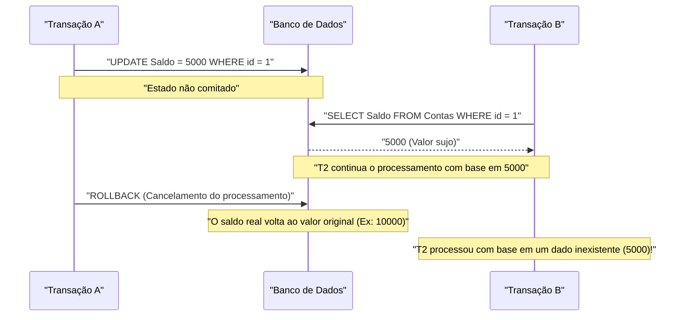

Em Sistemas de Gerenciamento de Bancos de Dados Relacionais (RDBMS), o conceito mais fundamental e importante para proteger a integridade e consistência dos dados e garantir a confiabilidade do sistema é a **transação** (Transaction).

Em aplicações web modernas e sistemas corporativos, um grande número de usuários lê e grava no banco de dados simultaneamente. Compreender profundamente os mecanismos para garantir que os dados sejam processados correta e consistentemente nesse ambiente de processamento simultâneo é uma habilidade essencial para engenheiros de backend e administradores de banco de dados.

Neste artigo, explicaremos de forma abrangente e muito detalhada as **Propriedades ACID** , que formam a teoria básica que suporta transações de banco de dados, várias **anomalias (Anomaly)** que podem ocorrer quando várias transações são executadas simultaneamente, e os **níveis de isolamento da transação (Isolation Level)** , que definem como evitar essas anomalias. Além disso, aprofundaremos as técnicas de implementação específicas para proteger os dados contra concorrência: **bloqueio pessimista** e **bloqueio otimista** , bem como o **MVCC (Controle de Concorrência Multiversão)** , que é amplamente adotado em RDBMS modernos.

---

## 1. O que é uma transação?

Uma **transação** refere-se a uma "unidade de processamento indivisível" em um banco de dados.
É um mecanismo que trata várias instruções SQL (inserção, atualização, exclusão de dados, etc.) como uma única unidade de trabalho lógico, garantindo que "todas tenham sucesso e sejam refletidas no banco de dados ( **commit** )" ou "falhem no meio e retornem ao estado original sem refletir nada ( **rollback** )".

### 1.1 Exemplo de transferência de conta (Necessidade de transações)

O exemplo de uma transferência de conta bancária (remessa) é frequentemente usado para explicar a importância das transações.
Por exemplo, o processo de "transferir 10.000 ienes da conta de A para a conta de B" é dividido nas seguintes duas etapas (processos de atualização) no banco de dados.

1. Subtrair 10.000 ienes do saldo da conta de A (UPDATE)
2. Adicionar 10.000 ienes ao saldo da conta de B (UPDATE)

O que aconteceria se uma falha no sistema ou erro de rede ocorresse logo após o passo 1 ter sucesso, e o passo 2 não fosse executado?
Os 10.000 ienes teriam sido deduzidos da conta de A, mas não depositados na conta de B, resultando em uma **inconsistência de dados** fatal para um sistema financeiro.

O uso de transações pode prevenir que tais situações ocorram.

```sql
BEGIN TRANSACTION; -- Início da transação

-- 1. Subtrai 10.000 da conta de A
UPDATE accounts
SET balance = balance - 10000
WHERE account_id = 'A' AND balance >= 10000;

-- 2. Adiciona 10.000 à conta de B
UPDATE accounts
SET balance = balance + 10000
WHERE account_id = 'B';

COMMIT; -- Confirma apenas se todos os processos forem bem-sucedidos
-- * Se ocorrer um erro, é feito um ROLLBACK, e a subtração no passo 1 será desfeita
```

Dessa forma, o principal papel de uma transação é manter a integridade do banco de dados agrupando vários processos de atualização relacionados em uma unidade indivisível.

---

## 2. Propriedades ACID (4 requisitos de uma transação)

Existem quatro propriedades que uma transação deve satisfazer para ser executada com segurança, e suas iniciais formam o termo **Propriedades ACID** . O RDBMS possui mecanismos internos complexos para garantir essas propriedades ACID.

### 2.1 Atomicity (Atomicidade)
**Atomicity** (Atomicidade) é a propriedade que garante que todas as operações dentro de uma transação sejam "totalmente executadas ou não executadas de forma alguma (Tudo ou Nada)".
Como no exemplo da transferência de conta mencionado acima, se o processo falhar no meio, ele deve sofrer um **rollback** (desfazer) completo para o estado anterior ao início da transação, incluindo as alterações que já foram executadas. Um estado incompleto (commit parcial) não é permitido no banco de dados.

### 2.2 [Consistency](https://kenji.blog/pt/p/cap-theorem-distributed-systems-tradeoff/) (Consistência)
**Consistency** (Consistência) é a propriedade que garante que as regras do banco de dados (restrições) sejam atendidas consistentemente antes e depois da execução de uma transação.
Um banco de dados pode definir regras que os dados devem atender, como restrições de chave primária (Primary Key), chave estrangeira (Foreign Key), exclusividade (Unique) e verificação (Check). Um estado que viole essas restrições como resultado das atualizações de dados por uma transação não é permitido, e se ocorrer uma violação, a transação sofre rollback imediatamente. Em outras palavras, uma transação tem a função de fazer o banco de dados transitar de um "estado consistente" para outro "estado consistente".

### 2.3 Isolation (Isolamento)
**Isolation** (Isolamento) é a propriedade que garante que, mesmo quando várias transações são executadas simultaneamente, cada transação não afete ou seja afetada pelo processo de execução (estados intermediários) de outras transações.
O isolamento ideal significa que os resultados da execução simultânea de várias transações coincidem completamente com os resultados se fossem executadas sequencialmente uma a uma (isso é chamado de **serialização** ). No entanto, tentar garantir o isolamento completo degrada significativamente o desempenho do processamento concorrente (throughput) do sistema; portanto, na prática, os RDBMS fornecem **níveis de isolamento** (descritos mais adiante) para ajustar o equilíbrio entre desempenho e isolamento.

### 2.4 Durability (Durabilidade)
**Durability** (Durabilidade) é a propriedade que garante que, uma vez que uma transação seja **comitada** (concluída), seu resultado não será perdido, mesmo que ocorra uma falha no sistema (falta de energia, falha no sistema, etc.).
Geralmente, o RDBMS atualiza dados na memória (buffer pool) e os grava de forma assíncrona no disco. No entanto, no momento do commit, as atualizações (histórico de alterações) são invariavelmente gravadas no armazenamento persistente, como o disco, em formato de **Log de Gravação Antecipada** (WAL: Write-Ahead Log, Log REDO, etc.). Dessa forma, mesmo que o banco de dados trave, o estado comitado pode ser restaurado (recuperação) usando os logs no momento da reinicialização.

---

## 3. Controle de Concorrência e Anomalias de Transação (Anomaly)

Quando vários usuários ou aplicações acessam o banco de dados simultaneamente e executam transações em paralelo, várias **inconsistências de dados (anomalias, Anomaly)** podem ocorrer se o controle não for adequado. Como pré-requisito para entender os níveis de isolamento, é essencial saber quais tipos de anomalias existem.

### 3.1 Dirty Read (Leitura Suja)
**Dirty Read** é um fenômeno onde uma transação lê dados que foram atualizados por outra transação, mas **ainda não foram comitados (não confirmados)** .

O diagrama de sequência a seguir mostra o processo em que ocorre um Dirty Read.



Se a Transação A sofrer rollback, a Transação B terá lido "dados fantasmas que acabaram não existindo no banco de dados", causando um erro lógico fatal.

### 3.2 Non-repeatable Read (Leitura Não Repetível)
**Non-repeatable Read** ocorre quando a mesma consulta é executada duas vezes na mesma transação, mas os resultados (valores) diferem porque outra transação **atualizou e comitou** os dados entre as duas execuções.

1. Transação A faz um SELECT na linha `id=1` (o valor é 100).
2. Transação B faz um UPDATE na linha `id=1` para 200 e a comita.
3. Quando a Transação A faz novamente o SELECT na linha `id=1`, o valor mudou para 200.

Do ponto de vista da Transação A, ela se depara com um estado inconsistente onde "os dados mudam toda vez que são lidos, embora ela mesma não tenha feito nenhuma alteração".

### 3.3 Phantom Read (Leitura Fantasma)
**Phantom Read** ocorre quando a mesma consulta (como uma busca em um intervalo) é executada duas vezes na mesma transação, mas outra transação **insere (INSERT) ou exclui (DELETE)** novos dados e os comita nesse meio-tempo, fazendo com que linhas que não existiam (ou existiam) na primeira vez apareçam (ou desapareçam) na segunda.

Enquanto a leitura não repetível é causada pela **atualização de linhas existentes (UPDATE)** , a leitura fantasma refere-se a um fenômeno em que o número de linhas ou a própria estrutura do conjunto de resultados muda devido à **adição ou exclusão de linhas (INSERT/DELETE)** .

### 3.4 Lost Update (Atualização Perdida)
**Lost Update** ocorre quando várias transações leem a mesma linha simultaneamente, cada uma realiza cálculos e, ao tentar regravar, **a atualização que é gravada por último substitui e elimina a atualização anterior** .

1. Transação A lê o saldo (10.000 ienes).
2. Transação B também lê o mesmo saldo (10.000 ienes).
3. Transação A adiciona 1.000 ienes e faz o UPDATE do saldo para 11.000 ienes e comita.
4. Transação B subtrai 2.000 ienes e faz o UPDATE do saldo para 8.000 ienes e comita.

Como resultado, o saldo no banco de dados será de 8.000 ienes. A "adição de 1.000 ienes" realizada pela Transação A foi completamente sobrescrita pela atualização da Transação B e se perdeu. Se processado corretamente, o saldo deveria ser 9.000 ienes. Este é um problema sério e comum em padrões de processamento onde a aplicação carrega dados para a memória antes de calcular.

---

## 4. Níveis de Isolamento de Transação no SQL ANSI

Para prevenir as várias anomalias descritas acima, o padrão SQL ANSI define quatro **níveis de isolamento de transação** (Isolation Level). Quanto mais alto (rígido) o nível de isolamento, mais fortemente a consistência dos dados é protegida; mas, ao mesmo tempo, aumenta a probabilidade de outras transações terem que esperar (ocorre concorrência de bloqueios), diminuindo o desempenho da concorrência.

| Nível de Isolamento (Isolation Level) | Dirty Read | Non-repeatable Read | Phantom Read |
| :--- | :---: | :---: | :---: |
| **Read Uncommitted** (Leitura não comitada) | Ocorre | Ocorre | Ocorre |
| **Read Committed** (Leitura comitada) | **Evitado** | Ocorre | Ocorre |
| **Repeatable Read** (Leitura repetível) | **Evitado** | **Evitado** | Ocorre (*) |
| **Serializable** (Serializável) | **Evitado** | **Evitado** | **Evitado** |

*(* No nível Repeatable Read do InnoDB do MySQL, o Phantom Read também é amplamente evitado por padrão devido a mecanismos de next-key locks e MVCC)*

### 4.1 Read Uncommitted
É o nível de isolamento mais baixo. Lê até alterações não comitadas de outras transações (Dirty Read ocorre). Como a consistência dos dados não é garantida de forma alguma, raramente é usado na prática, exceto em processos de agregação singulares onde desempenho extremo é mais necessário do que a exatidão estrita. Em alguns SGBDs, como o PostgreSQL, mesmo se esse nível for especificado, ele se comporta internamente como Read Committed.

### 4.2 Read Committed
É o nível de isolamento padrão adotado por muitos RDBMS (configuração padrão para Oracle, PostgreSQL, SQL Server).
Os dados lidos pela transação serão sempre apenas os dados **comitados** . Isso previne o Dirty Read, mas se outra transação atualizar e comitar dados durante a execução da transação atual, eles serão lidos, o que significa que Non-repeatable Reads e Phantom Reads ainda podem ocorrer.

### 4.3 Repeatable Read
É o nível de isolamento padrão do MySQL (InnoDB).
Garante que o conjunto de dados lido no início da transação permanecerá no mesmo estado até que ela termine. Ou seja, mesmo que outra transação atualize e comite os dados relevantes, a transação atual continuará a ver os dados antigos (do momento de seu início). Isso evita Non-repeatable Reads.
No entanto, sob a definição estrita do padrão ANSI, Phantom Reads em relação à adição/exclusão de linhas ainda podem ocorrer (embora, como mencionado acima, implementações como MySQL InnoDB os mitiguem).

### 4.4 Serializable
É o nível de isolamento mais rigoroso e garante resultados como se as transações fossem executadas de forma totalmente serial. Previne completamente todas as anomalias (Dirty Read, Non-repeatable Read, Phantom Read).
Contudo, conseguir isso requer bloqueios amplos (como bloqueios de tabela ou intervalos de bloqueio) ou mecanismos complexos de detecção de concorrência (como SSI: Serializable Snapshot Isolation), o que sacrifica grandemente a capacidade de execução paralela e aumenta o risco de rollbacks de transações (tentativas de repetição devido a erros de concorrência).

---

## 5. Mecanismos de Implementação de Controle de Concorrência (Bloqueio e MVCC)

Como os RDBMS implementam concretamente os requisitos lógicos definidos pelos níveis de isolamento? Historicamente, **mecanismos de bloqueio** eram o fluxo principal, mas atualmente o **MVCC** é amplamente utilizado para melhorar o desempenho de concorrência.

### 5.1 Controle Baseado em Bloqueio (Bloqueio Pessimista)
RDBMS tradicionais realizavam controle exclusivo aplicando "chaves" aos recursos (linhas ou tabelas).
- **Bloqueio Compartilhado (S-Lock / Shared Lock)** : Adquirido ao ler dados. Outras transações também podem adquirir bloqueios compartilhados para ler simultaneamente, mas não podem alterar (adquirir um X-Lock) os dados.
- **Bloqueio Exclusivo (X-Lock / Exclusive Lock)** : Adquirido ao atualizar ou excluir dados. Outras transações não podem ler (S-Lock) nem atualizar (X-Lock) e são forçadas a aguardar (serem bloqueadas).

O controle baseado em bloqueios é confiável, mas possui uma grande desvantagem: **"processos de leitura bloqueiam processos de atualização"** e **"processos de atualização bloqueiam processos de leitura"**, o que diminui a taxa de transferência e pode causar **deadlocks**, onde as transações continuam esperando a liberação do bloqueio de outras de forma cíclica.

### 5.2 MVCC (Multi-Version Concurrency Control: Controle de Concorrência Multiversão)
O **MVCC** foi introduzido para superar as deficiências do bloqueio. A maioria dos RDBMS modernos importantes o adota, como PostgreSQL, MySQL (InnoDB) e Oracle.
A ideia básica do MVCC é: **"não sobrescrever os dados originais quando houver alteração, mas sim criar uma nova versão dos dados"** .

- **Processo de leitura** lê os "dados da versão passada (snapshot)" presentes no momento em que a transação foi iniciada.
- **Processo de atualização** cria uma "versão mais recente dos dados", que se torna válida no momento do commit.

Isso possibilita uma concorrência extremamente alta porque **"a leitura não bloqueia a atualização"** e **"a atualização não bloqueia a leitura"**, enquanto ainda se garante a consistência para Read Committed ou Repeatable Read. No ambiente MVCC, processos subsequentes precisam esperar apenas se bloqueios exclusivos (X-Locks) entrarem em conflito (por exemplo, ao tentar atualizar a mesma linha ao mesmo tempo).

---

## 6. Medidas contra Concorrência na Camada de Aplicação (Bloqueio Pessimista e Bloqueio Otimista)

Além dos níveis de isolamento e controle de MVCC no nível do banco de dados, é comum usar controle de bloqueio explícito combinando a aplicação e SQL, especialmente para evitar as mencionadas **Lost Updates** e garantir a consistência de negócios. Os principais métodos representativos são o **bloqueio pessimista** e o **bloqueio otimista** .

O diagrama a seguir compara os fluxos e o comportamento de ambos os métodos de bloqueio.

```mermaid
flowchart TD
    subgraph "Bloqueio Pessimista (Pessimistic Lock)"
        P1("T1: SELECT ... FOR UPDATE")
        P2("DB: Adquire bloqueio exclusivo na linha alvo")
        P3("T2: SELECT ... FOR UPDATE")
        P4("DB: Aguarda (bloqueia) T2 até a liberação do bloqueio")
        P5("T1: UPDATE & COMMIT")
        P6("DB: Libera o bloqueio")
        P7("T2: Cancela espera, adquire bloqueio e continua")

        P1 --> P2
        P2 --> P3
        P3 --> P4
        P4 --> P5
        P5 --> P6
        P6 --> P7
    end

    subgraph "Bloqueio Otimista (Optimistic Lock)"
        O1("T1: SELECT (version=1)")
        O2("T2: SELECT (version=1)")
        O3("T1: UPDATE ... WHERE version=1")
        O4("DB: Sucesso (atualiza para version=2)")
        O5("T2: UPDATE ... WHERE version=1")
        O6("DB: 0 linhas atualizadas (falha, concorrência detectada)")
        O7("T2: Tratamento de erros, como repetição na camada de aplicação")

        O1 --> O2
        O2 --> O3
        O3 --> O4
        O4 --> O5
        O5 --> O6
        O6 --> O7
    end
```



### 6.1 Bloqueio Pessimista (Pessimistic Lock)
**Bloqueio Pessimista** baseia-se na suposição "pessimista" de que "há alta probabilidade de que outros usuários atualizem os mesmos dados ao mesmo tempo". Ele bloqueia explicitamente o acesso de outros usuários obtendo um bloqueio exclusivo de nível de linha no banco de dados, logo no início do processo.

No nível SQL, é implementado adicionando a cláusula `FOR UPDATE` no final da instrução `SELECT`.

```sql
BEGIN TRANSACTION;

-- Adquire bloqueio exclusivo na linha alvo. Outras transações ficarão bloqueadas aqui.
SELECT balance FROM accounts WHERE account_id = 'A' FOR UPDATE;

-- Após executar a lógica de negócios (verificação de saldo, cálculo, etc.), atualiza os dados
UPDATE accounts SET balance = balance - 10000 WHERE account_id = 'A';

COMMIT; -- Libera o bloqueio
```

**Vantagens** : Pode prevenir a concorrência de dados completamente e o fluxo de processamento é simples.
**Desvantagens** : Ao adquirir e manter o bloqueio, bloqueia outras transações, o que tende a degradar o desempenho. Manter o bloqueio durante longas transações ou processos de tela aguardando a entrada do usuário pode causar a paralisação de todo o sistema.

### 6.2 Bloqueio Otimista (Optimistic Lock)
**Bloqueio Otimista** baseia-se na suposição "otimista" de que "a concorrência de dados raramente ocorre". Portanto, não aplica bloqueios com antecedência, mas **no exato momento da atualização, verifica se outra pessoa fez alterações** .

Geralmente, isso é implementado adicionando uma **coluna para gerenciamento de versão (ex: `version` INT)** ou uma coluna com a data e hora da última modificação na tabela de destino.

```sql
-- 1. Obtém os dados antecipadamente e mantém a versão atual (version = 1) na memória da aplicação
SELECT balance, version FROM accounts WHERE account_id = 'A';

-- (Ocorre os cálculos do lado da aplicação ou exibição da tela de confirmação do usuário)

-- 2. Na atualização, inclui a versão obtida na cláusula WHERE e incrementa a versão simultaneamente
UPDATE accounts
SET balance = balance - 10000,
    version = version + 1
WHERE account_id = 'A'
  AND version = 1; -- Verifica se a versão coincide com a lida anteriormente
```

Ao executar esta declaração de UPDATE, a aplicação deve verificar o número de **linhas afetadas (Affected Rows)** retornadas pelo banco de dados.
- **Se houver 1 linha atualizada** : Nenhuma concorrência ocorreu; a atualização foi bem-sucedida.
- **Se houver 0 linhas atualizadas** : Significa que entre o momento de leitura dos dados e a atualização, outra transação atualizou os dados e a `version` subiu para `2` ou mais (ou a linha foi excluída). Nesse caso, a aplicação deve retornar um erro de usuário indicando concorrência ("Os dados foram alterados por outro usuário. Verifique as informações mais recentes e tente novamente") ou fazer uma nova tentativa automática (retry).

**Vantagens** : Como não monopoliza um bloqueio de banco de dados a longo prazo, possui altíssima concorrência simultânea e desempenho excelente. É ideal para evitar conflitos no processamento entre requisições/respostas HTTP stateless em aplicativos da web (desde a renderização da tela até o clique do botão).
**Desvantagens** : É necessário implementar o manuseio de conflitos na aplicação (exibir erro ou reiniciar a operação). Em ambientes onde os conflitos são frequentes, o custo geral da tentativa repetida (retry) aumenta muito.

---

## 7. Resumo

As **transações** no banco de dados não são apenas uma extensão do SQL, mas o ponto-chave do desenvolvimento de backend que influencia a confiabilidade do sistema geral e o desempenho.

- Compreenda as **Propriedades ACID** e descubra como os RDBMS protegem os dados.
- Reconheça anomalias (Anomaly) como **Dirty Read**, **Phantom Read** e **Lost Update**, desencadeadas por processamento concorrente.
- Entenda a diferença no comportamento padrão (como entre Read Committed e Repeatable Read) dependendo do **nível de isolamento (Isolation Level)** de cada SGBD e escolha o nível adequado aos seus requisitos.
- Compreenda as características dos **bloqueios pessimistas** e **bloqueios otimistas** , a fim de incorporar os controles exclusivos ideais no sistema com base na lógica de negócios e nos padrões de uso de dados (frequência de ocorrência de problemas).

Ao combinar o conhecimento e a tecnologia, será possível criar sistemas formidáveis, dimensionáveis com excelente desempenho sem gerar desarmonia nas informações.
No nosso próximo artigo, temos a intenção de falar sobre a evolução desse tratamento nas arquiteturas de sistemas distribuídos e de microsserviços (padrão Saga, 2PC, etc.). Fique ligado!
