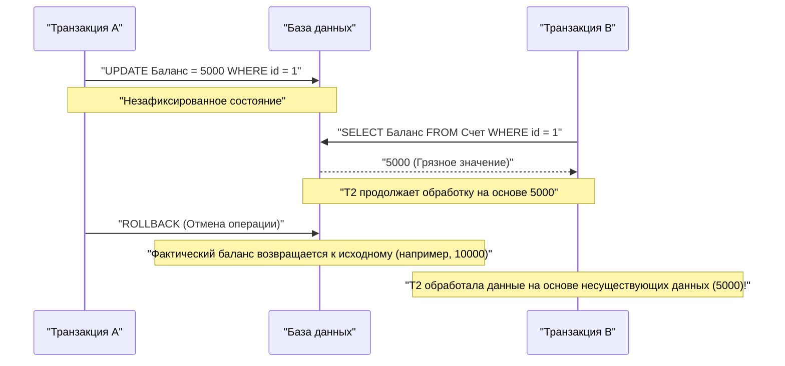

В системах управления реляционными базами данных (РСУБД) **транзакция** (Transaction) является самым фундаментальным и важным понятием для сохранения целостности и непротиворечивости данных, а также обеспечения надежности системы.

В современных веб-приложениях и корпоративных системах множество пользователей одновременно читают и записывают данные в базу. Глубокое понимание механизмов корректной обработки данных без противоречий в такой среде параллельной обработки является обязательным навыком для бэкенд-инженеров и администраторов баз данных.

В этой статье мы подробно и всесторонне рассмотрим **свойства ACID**, которые являются фундаментальной теорией, поддерживающей транзакции базы данных, различные **аномалии (Anomaly)**, которые могут возникнуть при одновременном выполнении нескольких транзакций, и **уровни изоляции транзакций (Isolation Level)**, определяющие, как предотвратить эти аномалии. Кроме того, мы углубимся в **пессимистичную блокировку** и **оптимистичную блокировку** — конкретные методы реализации защиты данных от конфликтов, а также в **MVCC (Multi-Version Concurrency Control)**, широко применяемый в современных РСУБД.

---

## 1. Что такое транзакция?

**Транзакция** — это «неделимая последовательность операций» с базой данных.
Это механизм, который обрабатывает несколько SQL-операторов (добавление, обновление, удаление данных и т. д.) как единую логическую единицу работы и гарантирует, что либо «все они будут успешными и отразятся в базе данных (**фиксация** / commit)», либо «ошибка в процессе приведет к тому, что ни одно из них не отразится, и произойдет возврат в исходное состояние (**откат** / rollback)».

### 1.1 Пример банковского перевода (необходимость транзакций)

Пример банковского перевода (перемещения средств) часто используется для объяснения важности транзакций.
Например, операция «перевод 10 000 иен со счета пользователя А на счет пользователя Б» в базе данных разбивается на следующие два шага (операции обновления):

1. Уменьшить баланс счета А на 10 000 иен (UPDATE)
2. Увеличить баланс счета Б на 10 000 иен (UPDATE)

Что произойдет, если сразу после успешного выполнения первого шага возникнет сбой системы или ошибка сети, и второй шаг не будет выполнен?
С баланса А будет списано 10 000 иен, но на счет Б эти 10 000 иен не поступят, что приведет к фатальной **несогласованности данных** для финансовой системы.

Использование транзакций позволяет предотвратить подобные ситуации.

```sql
BEGIN TRANSACTION; -- Начало транзакции

-- 1. Вычитание 10000 иен со счета пользователя A
UPDATE accounts
SET balance = balance - 10000
WHERE account_id = 'A' AND balance >= 10000;

-- 2. Добавление 10000 иен на счет пользователя B
UPDATE accounts
SET balance = balance + 10000
WHERE account_id = 'B';

COMMIT; -- Фиксация только в случае успешного выполнения всех операций
-- ※ В случае ошибки происходит ROLLBACK, и вычитание на шаге 1 отменяется
```

Таким образом, основная роль транзакции заключается в поддержании целостности базы данных путем объединения нескольких связанных операций обновления в одну неделимую единицу.

---

## 2. Свойства ACID (четыре требования к транзакции)

Существует четыре свойства, которым должна удовлетворять транзакция для безопасного выполнения, и по их первым буквам они называются **свойствами ACID**. РСУБД внутренне оснащены сложными механизмами для гарантии этих свойств ACID.

### 2.1 Atomicity (Атомарность)
**Atomicity** (Атомарность) — это свойство, которое гарантирует, что все операции в транзакции либо «выполняются полностью, либо не выполняются вообще (Всё или ничего)».
Как в предыдущем примере с банковским переводом, если операция прерывается на полпути, необходимо полностью **откатить (rollback)** систему к состоянию до начала транзакции, включая уже выполненные изменения. Оставлять базу данных в промежуточном состоянии (частичная фиксация) недопустимо.

### 2.2 [Consistency](https://kenji.blog/ru/p/cap-theorem-distributed-systems-tradeoff/) (Согласованность)
**Consistency** (Согласованность) — это свойство, гарантирующее, что до и после выполнения транзакции правила (ограничения) базы данных последовательно соблюдаются.
В базе данных можно определить правила, которым должны соответствовать данные, такие как ограничение первичного ключа (Primary Key), ограничение внешнего ключа (Foreign Key), ограничение уникальности (Unique) и ограничение проверки (Check). В результате обновления данных транзакцией не допускается состояние, нарушающее эти ограничения; в случае нарушения происходит немедленный откат. Другими словами, транзакция служит для перевода базы данных из «одного согласованного состояния» в «другое согласованное состояние».

### 2.3 Isolation (Изолированность)
**Isolation** (Изолированность) — это свойство, гарантирующее, что даже при одновременном выполнении нескольких транзакций каждая транзакция не влияет на процесс выполнения (промежуточные состояния) других транзакций и не подвергается их влиянию.
Идеальная изолированность означает, что результат параллельного выполнения нескольких транзакций полностью совпадает с результатом их последовательного выполнения одна за другой (это называется **сериализуемостью**). Однако, попытка гарантировать полную изолированность приведет к значительному снижению производительности параллельной обработки (пропускной способности), поэтому в реальных РСУБД предусмотрены **уровни изоляции** (описанные ниже) для балансировки между производительностью и изолированностью.

### 2.4 Durability (Долговечность)
**Durability** (Долговечность) — это свойство, гарантирующее, что после **фиксации** (завершения) транзакции ее результаты никогда не будут потеряны, даже в случае сбоя системы (отключение питания, сбой и т. д.).
Обычно РСУБД обновляет данные в памяти (буферном пуле) и асинхронно записывает их на диск, но во время фиксации она обязательно записывает содержимое обновления (историю изменений) как **журнал упреждающей записи** (WAL: Write-Ahead Log, REDO-журнал и т. д.) на постоянное хранилище, такое как диск. Таким образом, даже если база данных выйдет из строя, при перезапуске можно использовать журнал для восстановления зафиксированного состояния (recovery).

---

## 3. Управление параллелизмом и аномалии транзакций (Anomaly)

Когда к базе данных одновременно обращаются множество пользователей и приложений, и транзакции выполняются параллельно, без должного контроля возникают различные **несогласованности данных (аномалии, Anomaly)**. Чтобы понять уровни изоляции, необходимо знать, какие существуют аномалии.

### 3.1 Грязное чтение (Dirty Read)
**Грязное чтение** — это явление, при котором транзакция считывает **еще не зафиксированные (неутвержденные) данные**, обновленные другой транзакцией.

Следующая диаграмма последовательности показывает процесс возникновения грязного чтения.



Если Транзакция A откатит операцию, Транзакция B, получается, продолжит работу, прочитав «фантомные данные, которых в итоге не было в базе», что приведет к фатальной логической ошибке.

### 3.2 Неповторяющееся чтение (Non-repeatable Read)
**Неповторяющееся чтение** — это явление, при котором один и тот же запрос выполняется дважды в рамках одной транзакции, и результат (значение), прочитанный в первый и второй раз, отличается из-за того, что в промежутке другая транзакция **обновила и зафиксировала** данные.

1. Транзакция A выбирает (SELECT) строку с `id=1` (значение, например, 100).
2. Транзакция B обновляет (UPDATE) строку с `id=1` на 200 и фиксирует ее.
3. Транзакция A снова выбирает строку с `id=1`, и значение изменилось на 200.

С точки зрения Транзакции A, она сталкивается с несогласованным состоянием: «Хотя я ничего не меняла, данные меняются при каждом чтении».

### 3.3 Фантомное чтение (Phantom Read)
**Фантомное чтение** — это явление, при котором один и тот же запрос (например, поиск по диапазону) выполняется дважды в рамках одной транзакции, и из-за того, что другая транзакция **добавила (INSERT) или удалила (DELETE)** данные и зафиксировала изменения в промежутке, строки, которых не было (или были) в первый раз, появляются (или исчезают) во второй.

В то время как неповторяющееся чтение вызывается **обновлением существующих строк (UPDATE)**, фантомное чтение — это явление, при котором меняется само количество и состав строк в результирующем наборе из-за **добавления или удаления строк (INSERT/DELETE)**.

### 3.4 Потерянное обновление (Lost Update)
**Потерянное обновление** — это явление, при котором несколько транзакций одновременно считывают одну и ту же строку, каждая выполняет вычисления, а затем при записи обновлений обратно **обновление, записанное позже, перезаписывает и уничтожает предыдущее обновление**.

1. Транзакция A считывает баланс (10 000 иен).
2. Транзакция B также считывает тот же баланс (10 000 иен).
3. Транзакция A прибавляет 1 000 иен, обновляет (UPDATE) баланс до 11 000 иен и фиксирует.
4. Транзакция B вычитает 2 000 иен, обновляет (UPDATE) баланс до 8 000 иен и фиксирует.

В результате баланс базы данных составит 8 000 иен. «Прибавление 1 000 иен», выполненное Транзакцией A, было полностью перезаписано и потеряно из-за обновления Транзакции B. Если бы операции были обработаны в правильном порядке, баланс должен был бы составить 9 000 иен. Это серьезная проблема, часто возникающая в паттернах обработки, когда приложение считывает данные в память перед вычислениями.

---

## 4. Уровни изоляции транзакций стандарта ANSI SQL

Для предотвращения описанных выше аномалий стандарт ANSI SQL определяет четыре **уровня изоляции транзакций** (Isolation Level). Чем выше (строже) установлен уровень изоляции, тем надежнее защищена целостность данных, но в то же время возрастает вероятность того, что другим транзакциям придется ждать (возникают конфликты блокировок), и производительность параллельной обработки снижается.

| Уровень изоляции (Isolation Level) | Грязное чтение | Неповторяющееся чтение | Фантомное чтение |
| :--- | :---: | :---: | :---: |
| **Read Uncommitted** (Чтение незафиксированных данных) | Возникает | Возникает | Возникает |
| **Read Committed** (Чтение зафиксированных данных) | **Предотвращается** | Возникает | Возникает |
| **Repeatable Read** (Повторяющееся чтение) | **Предотвращается** | **Предотвращается** | Возникает (※) |
| **Serializable** (Сериализуемость) | **Предотвращается** | **Предотвращается** | **Предотвращается** |

*(※ В режиме Repeatable Read в InnoDB MySQL с помощью механизмов блокировки следующего ключа (Next-Key Lock) и MVCC по умолчанию в значительной степени предотвращается и фантомное чтение)*

### 4.1 Read Uncommitted
Самый низкий уровень изоляции. Он считывает даже незафиксированные изменения других транзакций (возникает грязное чтение). Поскольку целостность данных не гарантируется вообще, он почти никогда не используется на практике, за исключением особых процессов агрегации, где требуется экстремальная производительность, а не строгая точность. В некоторых СУБД, таких как PostgreSQL, даже если вы укажете этот уровень, внутренне он будет работать как Read Committed.

### 4.2 Read Committed
Это уровень изоляции по умолчанию во многих РСУБД (например, в Oracle, PostgreSQL, SQL Server).
Данные, считываемые транзакцией, — это всегда только **зафиксированные** данные. Это предотвращает грязное чтение, но если другая транзакция обновляет и фиксирует данные во время выполнения вашей транзакции, вы их считаете, поэтому неповторяющееся чтение и фантомное чтение возникают.

### 4.3 Repeatable Read
Уровень изоляции по умолчанию в MySQL (InnoDB).
Гарантируется, что набор данных, считанный в начале транзакции, останется в одном и том же согласованном состоянии до конца транзакции. Иными словами, даже если другая транзакция обновляет и фиксирует эти данные во время вашей транзакции, ваша транзакция будет продолжать видеть старые данные (по состоянию на начало). Это предотвращает неповторяющееся чтение.
Однако, согласно строгому определению стандарта ANSI, фантомное чтение для добавления и удаления строк все еще может возникнуть (как упоминалось выше, в MySQL InnoDB и др. реализация также подавляет фантомное чтение).

### 4.4 Serializable
Самый строгий уровень изоляции, гарантирующий результаты, как если бы транзакции выполнялись полностью последовательно (serial). Он может полностью предотвратить все аномалии (грязное чтение, неповторяющееся чтение, фантомное чтение).
Однако для достижения этого требуются блокировки широкого диапазона (блокировки таблиц или блокировки диапазонов) или работают сложные механизмы обнаружения конфликтов (например, SSI: Serializable Snapshot Isolation), что значительно снижает производительность параллельной обработки и увеличивает риск частых откатов транзакций (повторных попыток из-за ошибок конфликтов).

---

## 5. Механизмы реализации контроля параллелизма (блокировки и MVCC)

Как именно РСУБД реализует логические требования уровней изоляции? Исторически основным методом был **механизм блокировок**, но сегодня для повышения производительности параллельной обработки широко используется **MVCC**.

### 5.1 Контроль на основе блокировок (Пессимистичная блокировка)
Традиционные РСУБД выполняли эксклюзивный контроль, накладывая «замки» (блокировки) на ресурсы (строки или таблицы).
- **Разделяемая блокировка (S-блокировка / Shared Lock)** : Приобретается при чтении данных. Другие транзакции также могут приобрести S-блокировку для одновременного чтения, но не могут изменить данные (приобрести X-блокировку).
- **Эксклюзивная блокировка (X-блокировка / Exclusive Lock)** : Приобретается при обновлении или удалении данных. Другие транзакции не могут ни читать (S-блокировка), ни обновлять (X-блокировка) данные, и они вынуждены ждать (блокируются).

Управление на основе блокировок надежно, но имеет серьезный недостаток: **«процесс чтения блокирует процесс обновления» и «процесс обновления блокирует процесс чтения»**, что приводит к снижению пропускной способности и вызывает **взаимоблокировки (Deadlock)**, когда транзакции бесконечно ждут снятия блокировок друг у друга.

### 5.2 MVCC (Multi-Version Concurrency Control: Управление параллельным доступом с помощью многоверсионности)
Для преодоления этих недостатков блокировок появился **MVCC**. Он применяется в большинстве современных ведущих РСУБД, таких как PostgreSQL, MySQL (InnoDB), Oracle и т. д.
Основная идея MVCC заключается в том, что **«при изменении данных исходные данные не перезаписываются, а создается новая версия данных»**.

- **Процесс чтения** считывает «прошлую версию данных (снимок)» по состоянию на начало транзакции.
- **Процесс обновления** создает новую «последнюю версию данных», которая становится действительной после фиксации (commit).

Это позволяет достичь чрезвычайно высокой степени параллелизма: **«чтение не блокирует обновление» и «обновление не блокирует чтение»**, гарантируя при этом согласованность для Read Committed или Repeatable Read. В среде MVCC последующие процессы ждут только в случае конфликта между эксклюзивными блокировками (X-блокировками) (при попытке одновременного обновления одной и той же строки).

---

## 6. Защита от конфликтов на уровне приложения (Пессимистичная и Оптимистичная блокировки)

В дополнение к контролю на уровне изоляции и MVCC на уровне базы данных, обычно применяется явный контроль блокировок с использованием комбинации приложения и SQL, особенно для предотвращения вышеупомянутой проблемы **потерянного обновления** и обеспечения бизнес-согласованности данных. Типичными методами являются **пессимистичная блокировка** и **оптимистичная блокировка**.

На следующей диаграмме сравниваются потоки и поведение двух методов блокировки.

```mermaid
flowchart TD
    subgraph "Пессимистичная блокировка (Pessimistic Lock)"
        P1("T1: SELECT ... FOR UPDATE")
        P2("DB: Получение эксклюзивной блокировки для целевой строки")
        P3("T2: SELECT ... FOR UPDATE")
        P4("DB: T2 ожидает (блокируется) до снятия блокировки")
        P5("T1: UPDATE & COMMIT")
        P6("DB: Снятие блокировки")
        P7("T2: Снятие ожидания, получение блокировки и продолжение обработки")

        P1 --> P2
        P2 --> P3
        P3 --> P4
        P4 --> P5
        P5 --> P6
        P6 --> P7
    end

    subgraph "Оптимистичная блокировка (Optimistic Lock)"
        O1("T1: SELECT (version=1)")
        O2("T2: SELECT (version=1)")
        O3("T1: UPDATE ... WHERE version=1")
        O4("DB: Успешно (обновление до version=2)")
        O5("T2: UPDATE ... WHERE version=1")
        O6("DB: Количество обновлений 0 (Ошибка, конфликт обнаружен)")
        O7("T2: Обработка ошибок, например повторная попытка на стороне приложения")

        O1 --> O2
        O2 --> O3
        O3 --> O4
        O4 --> O5
        O5 --> O6
        O6 --> O7
    end
```



### 6.1 Пессимистичная блокировка (Pessimistic Lock)
**Пессимистичная блокировка** исходит из предположения, что «существует высокая вероятность того, что другие пользователи одновременно обновят те же данные (пессимистично)». Она явно запрашивает эксклюзивную блокировку на уровне строки базы данных в самом начале процесса, чтобы полностью перекрыть доступ другим пользователям.

На уровне SQL это реализуется добавлением оператора `FOR UPDATE` в конец запроса `SELECT`.

```sql
BEGIN TRANSACTION;

-- Получение эксклюзивной блокировки для целевой строки. Другие транзакции здесь блокируются.
SELECT balance FROM accounts WHERE account_id = 'A' FOR UPDATE;

-- Выполнение бизнес-логики (проверка баланса, расчеты и т.д.) перед обновлением
UPDATE accounts SET balance = balance - 10000 WHERE account_id = 'A';

COMMIT; -- Снятие блокировки
```

**Преимущества**: Полностью предотвращает конфликты данных, простая логика обработки.
**Недостатки**: Во время удержания блокировки она блокирует другие транзакции, что может легко привести к снижению производительности. Если блокировка удерживается во время длительных транзакций или процессов пользовательского интерфейса, ожидающих ввода пользователя, это может привести к остановке всей системы.

### 6.2 Оптимистичная блокировка (Optimistic Lock)
**Оптимистичная блокировка** исходит из предположения, что «конфликты данных будут происходить редко (оптимистично)». Она не блокирует данные заранее, а **в момент фактического обновления данных проверяет, не внес ли кто-то еще изменения**.

Обычно это реализуется путем добавления в целевую таблицу **колонки для контроля версий (например, `version` INT)** или колонки даты/времени последнего обновления.

```sql
-- 1. Предварительное получение данных и сохранение текущей версии (version = 1) в памяти приложения
SELECT balance, version FROM accounts WHERE account_id = 'A';

-- (Здесь выполняются расчеты на стороне приложения или отображение экрана подтверждения для пользователя)

-- 2. При обновлении включаем версию, полученную ранее, в условие WHERE и одновременно инкрементируем версию
UPDATE accounts
SET balance = balance - 10000,
    version = version + 1
WHERE account_id = 'A'
  AND version = 1; -- Проверка, совпадает ли версия с той, что мы считали
```

При выполнении этого оператора UPDATE приложение проверяет **количество обновленных строк (Affected Rows)**, возвращаемое базой данных.
- **Если количество обновлений равно 1**: Конфликта нет, обновление успешно завершено.
- **Если количество обновлений равно 0**: Это означает, что другая транзакция обновила данные в промежутке между тем, как мы считали данные и попытались их обновить, и значение `version` стало `2` или больше (или строка была удалена). В этом случае приложение возвращает пользователю **ошибку эксклюзивного доступа**, например: «Данные были изменены другим пользователем. Пожалуйста, проверьте актуальную информацию и повторите попытку», либо выполняет автоматический повтор (retry).

**Преимущества**: Поскольку блокировка базы данных не удерживается в течение длительного времени, достигается очень высокий уровень параллелизма и отличная производительность. Оптимально подходит для предотвращения конфликтов в процессах без сохранения состояния (stateless) между HTTP-запросами и ответами веб-приложений (от отображения экрана до нажатия кнопки).
**Недостатки**: Приложению необходимо реализовать обработку (отображение ошибки или повтор) в случае возникновения конфликта. В среде, где конфликты происходят часто, накладные расходы на повторные попытки становятся значительными.

---

## 7. Заключение

**Транзакции** базы данных — это не просто расширение SQL, а ключевой элемент бэкенд-разработки, который определяет надежность и производительность всей системы.

- Понимание **свойств ACID** и знание того, как РСУБД защищает данные.
- Распознавание **аномалий (Anomaly)**, вызываемых параллельной обработкой, таких как **грязное чтение**, **фантомное чтение** и **потерянное обновление**.
- Понимание значений по умолчанию и различий в поведении **уровней изоляции (Isolation Level)** для каждой СУБД (например, разница между Read Committed и Repeatable Read) и выбор подходящего уровня в зависимости от требований.
- Понимание характеристик **пессимистичной блокировки** и **оптимистичной блокировки** и реализация оптимального эксклюзивного контроля в приложении в соответствии с бизнес-логикой и характеристиками трафика (частота конфликтов).

Только объединив эти знания и технологии, можно построить надежную систему, которая «не вызывает несогласованности данных и масштабируется с высокой производительностью».
В следующей статье мы планируем рассказать о том, как этот контроль транзакций эволюционировал в распределенных системах и микросервисной архитектуре (например, паттерн Saga и 2PC). Следите за обновлениями.
