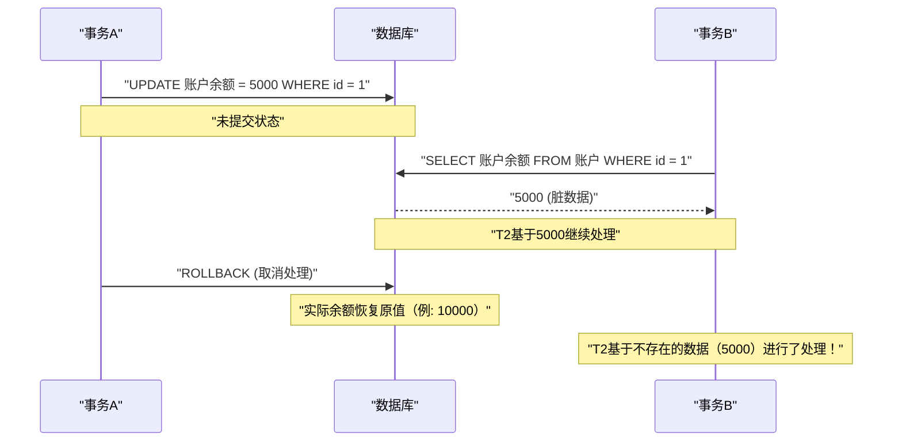

在RDBMS（关系型数据库管理系统）中，保护数据完整性和一致性以确保系统可靠性的最根本且重要的概念就是 **事务** （Transaction）。

在现代Web应用和企业级系统中，会有大量用户同时对数据库进行读写操作。在这种并发处理环境下，深入理解让数据无矛盾地正确处理的机制，对于后端工程师和数据库管理员来说是一项必备技能。

本文将从支撑数据库事务的基础理论 **ACID特性** 开始，详细且全面地讲解多个事务同时执行时可能发生的各种 **异常（Anomaly）** ，以及定义了如何防止这些异常的 **事务隔离级别（Isolation Level）** 。此外，还将深入探讨为了保护数据免受冲突而采用的具体实现手法，即 **悲观锁** 和 **乐观锁** ，以及在现代RDBMS中被广泛采用的 **MVCC（多版本并发控制）** 。

---

## 1. 事务是什么？

**事务** 是指对数据库进行的一系列“不可分割的处理集合”。
将多条SQL语句（数据的追加、更新、删除等）作为一个逻辑工作单元处理，保证要么“全部成功并反映到数据库中（ **提交** ）”，要么“中途失败并返回任何未反映的初始状态（ **回滚** ）”，这是一种保证结果只有上述两者之一的机制。

### 1.1 账户转账的例子（事务的必要性）

在解释事务的重要性时，经常使用银行账户转账（汇款）的例子。
例如，“从A的账户向B的账户汇款10,000日元”这个处理，在数据库上可以分解为以下两个步骤（更新处理）。

1. 将A的账户余额减少10,000日元（UPDATE）
2. 将B的账户余额增加10,000日元（UPDATE）

如果在步骤1成功之后立即发生系统故障或网络错误，而步骤2未被执行，会发生什么呢？
A的账户已经被扣除了10,000日元，但B的账户却没有存入这10,000日元，这对于金融系统来说将引发致命的 **数据不一致** 。

通过使用事务，就可以防止这种情况发生。

```sql
BEGIN TRANSACTION; -- 开始事务

-- 1. 从A的账户扣除10000日元
UPDATE accounts
SET balance = balance - 10000
WHERE account_id = 'A' AND balance >= 10000;

-- 2. 向B的账户增加10000日元
UPDATE accounts
SET balance = balance + 10000
WHERE account_id = 'B';

COMMIT; -- 仅当所有处理成功时确认
-- ※ 若发生错误则 ROLLBACK，1的扣除也会被取消
```

像这样，将相关的多个更新处理捆绑为一个不可分割的单位，从而维持数据库的完整性，就是事务最大的作用。

---

## 2. ACID特性（事务的四个要求）

为了让事务安全执行，有四个必须满足的性质，取其首字母被称为 **ACID特性** （ACID Properties）。RDBMS内部具备了保障此ACID特性的复杂机制。

### 2.1 Atomicity（原子性）
**Atomicity** （原子性）是保证事务内所有操作要么“全部被执行，要么全不执行（All or Nothing）”的性质。
就像前面转账的例子，如果处理中途失败，必须将包括已经执行的更改在内的状态完全 **回滚** （撤销）到事务开始前。决不允许数据库中留下半途而废的状态（部分提交）。

### 2.2 [Consistency](https://kenji.blog/zh-cn/p/cap-theorem-distributed-systems-tradeoff/)（一致性）
**Consistency** （一致性）是保证在事务执行前后，数据库的规则（约束）始终被满足的性质。
在数据库中，可以定义数据必须满足的规则，如主键约束（Primary Key）、外键约束（Foreign Key）、唯一约束（Unique）、检查约束（Check）等。由事务更新数据的结果，决不允许变成违反这些约束的状态，如果发生违反，会立即被回滚。也就是说，事务承担着将数据库从“某一个一致的状态”转移到“另一个一致的状态”的角色。

### 2.3 Isolation（隔离性）
**Isolation** （隔离性）是保证即使多个事务同时执行，各个事务也不会影响其他事务的执行过程（中间状态），或者不受到影响的性质。
理想的隔离性意味着，并发执行多个事务的结果，与将它们逐一按顺序（串行）执行的结果完全一致（这被称为 **可串行化** ）。然而，如果试图保证完全的隔离性，系统的并发处理性能（吞吐量）会显著下降，所以在实际的RDBMS中，准备了调整性能和隔离性之间权衡的 **隔离级别** （后述）。

### 2.4 Durability（持久性）
**Durability** （持久性）是保证事务一旦 **提交** （完成），即使发生系统故障（断电、崩溃等），其结果也绝不会丢失的性质。
RDBMS通常在内存（缓冲池）中更新数据，然后异步写入磁盘，但在提交时，必定会将更新内容（变更日志）作为 **预写式日志** （WAL: Write-Ahead Log 或 REDO日志等）记录到磁盘等持久化存储中。这样一来，万一数据库崩溃，也可以在重启时使用日志将已提交的状态进行恢复（Recovery）。

---

## 3. 并发控制与事务异常（Anomaly）

当多个用户或应用程序同时访问数据库，并发执行事务时，如果不进行适当控制，就会发生各种 **数据不一致（异常・Anomaly）** 。在理解隔离级别之前，了解存在哪些异常是不可或缺的。

### 3.1 脏读（Dirty Read）
**脏读** 是指一个事务读取了其他事务已经更新但 **尚未提交（未确认）的数据** 的现象。

以下的时序图展示了脏读发生的过程。



如果 事务A 将处理回滚，那么 事务B 就等于是读取了“最终未存在于数据库中的幻影数据”并进行了处理，从而引发致命的逻辑错误。

### 3.2 不可重复读（Non-repeatable Read）
**不可重复读** 是指在同一事务内两次执行相同的查询时，期间因为其他事务对数据进行了 **更新并提交** ，导致第一次和第二次读取的结果（值）不同的现象。

1. 事务A 对 `id=1` 的行进行SELECT（值为 100）。
2. 事务B 将 `id=1` 的行UPDATE为 200，并提交。
3. 事务A 再次对 `id=1` 的行进行SELECT时，值变为了 200。

从事务A的视角来看，就面临着“自己什么都没改，每次读取数据却变了”的不一致状态。

### 3.3 幻读（Phantom Read）
**幻读** 是指在同一事务内两次执行相同搜索条件（如范围搜索）的查询时，期间因为其他事务 **追加（INSERT）或删除（DELETE）** 了新数据并提交，导致第一次不存在（或存在）的行，在第二次出现（或消失）的现象。

不可重复读是由 **现有行的更新（UPDATE）** 引起的，而幻读是由 **行的追加或删除（INSERT/DELETE）** 引起的结果集行数或结构本身发生变化的现象。

### 3.4 丢失更新（Lost Update）
**丢失更新** 是指多个事务同时读取同一行，分别进行计算后在写回更新时， **后写入的更新将之前的更新覆盖并使其消失** 的现象。

1. 事务A 读取余额（10000日元）。
2. 事务B 也读取同样的余额（10000日元）。
3. 事务A 增加1000日元，将余额UPDATE为 11000日元 并提交。
4. 事务B 减少2000日元，将余额UPDATE为 8000日元 并提交。

结果，数据库的余额变成了 8000日元。事务A所做的“增加1000日元”被事务B的更新完全覆盖并丢失了。如果按正确的顺序处理，余额应该是 9000日元。在应用程序将数据读入内存进行计算的处理模式中，这是一个频繁发生的严重问题。

---

## 4. ANSI SQL的事务隔离级别

为了防止上述各种异常，ANSI SQL标准定义了四个 **事务隔离级别** （Isolation Level）。隔离级别设置得越高（越严格），数据一致性就保护得越牢固，但同时让其他事务等待（发生锁竞争）的概率也会增加，并发处理性能会下降。

| 隔离级别 (Isolation Level) | 脏读 | 不可重复读 | 幻读 |
| :--- | :---: | :---: | :---: |
| **Read Uncommitted** （读未提交） | 会发生 | 会发生 | 会发生 |
| **Read Committed** （读已提交） | **可防止** | 会发生 | 会发生 |
| **Repeatable Read** （可重复读） | **可防止** | **可防止** | 会发生 (※) |
| **Serializable** （可串行化） | **可防止** | **可防止** | **可防止** |

*(※ 在MySQL的InnoDB的Repeatable Read中，凭借间隙锁（Next-Key Lock）和MVCC机制，默认情况下大部分幻读也能被防止)*

### 4.1 Read Uncommitted
最低的隔离级别。会读取到其他事务尚未提交的更改（发生脏读）。由于完全不保证数据的一致性，除了对极端性能要求高于严密准确性的特殊聚合处理外，实务中几乎不被使用。在PostgreSQL等部分DBMS中，即使指定了该级别，内部也会作为 Read Committed 运行。

### 4.2 Read Committed
这是许多RDBMS（Oracle、PostgreSQL、SQL Server的默认设置）采用的默认隔离级别。
事务读取的数据必定仅限于 **已提交** 的数据。由此可以防止脏读，但在自事务执行期间，如果其他事务更新数据并提交，就会读取到这些数据，因此会发生不可重复读和幻读。

### 4.3 Repeatable Read
MySQL（InnoDB）的默认隔离级别。
保证事务开始时读取的数据集直到事务结束始终保持同一状态。也就是说，即使自事务期间其他事务更新了相应数据并提交，从自事务依然只能看到旧的（开始时的）数据。由此防止不可重复读。
但是，根据严格的ANSI标准定义，认为仍可能发生针对行追加、删除的幻读（如上所述，在MySQL InnoDB等实现中，幻读也会被抑制）。

### 4.4 Serializable
最严格的隔离级别，保证事务就像完全串行（串联）执行一样的结果。能够完全防止所有的异常（脏读、不可重复读、幻读）。
然而，为了实现这一点，需要大范围的锁（表锁或范围锁），或者复杂的并发检测机制（如SSI: Serializable Snapshot Isolation等）起作用，因此并发处理性能会被大幅牺牲，且存在事务回滚（由冲突错误引发的重试）频发的风险。

---

## 5. 并发控制的实现机制（锁与MVCC）

RDBMS是如何具体实现隔离级别所带来的逻辑要求的呢？历史上主要是通过 **锁机制** 进行控制，但在现代，为了提高并发处理性能， **MVCC** 得到了广泛普及。

### 5.1 基于锁的控制（悲观锁）
传统的RDBMS通过对资源（行或表）加“锁”来进行排他控制。
- **共享锁（S锁 / Shared Lock）** : 读取数据时获取。其他事务也可以获取共享锁同时读取，但不能修改数据（获取X锁）。
- **排他锁（X锁 / Exclusive Lock）** : 更新、删除数据时获取。其他事务既不能读取（S锁）也不能更新（X锁），将被迫等待（阻塞）。

基于锁的控制虽然可靠，但存在 **“读处理阻塞写处理”、“写处理阻塞读处理”** 的巨大缺陷，成为导致吞吐量下降以及彼此一直等待对方释放锁的 **死锁** （Deadlock）的原因。

### 5.2 MVCC（Multi-Version Concurrency Control: 多版本并发控制）
为了克服这种锁的缺陷而出现的就是 **MVCC** 。PostgreSQL、MySQL(InnoDB)、Oracle等现代主要的RDBMS几乎都采用了它。
MVCC的基本思想是： **“更改数据时不覆盖原数据，而是创建新版本（版）的数据”** 。

- **读取处理** 读取的是事务开始时的“过去版本的数据（快照）”。
- **更新处理** 则是新创建“最新版本的数据”，在提交时生效。

由此，实现了 **“读不阻塞写”、“写不阻塞读”** 的极高并发性，同时保证了 Read Committed 和 Repeatable Read 的一致性。在MVCC环境下，只有当排他锁（X锁）之间发生冲突时（试图同时更新同一行时），后续处理才会等待。

---

## 6. 应用层面的冲突对策（悲观锁与乐观锁）

除了数据库层面的隔离级别和MVCC控制外，特别是为了防止前述的 **丢失更新** ，确保业务上的数据一致性，通常会结合应用程序和SQL进行显式的锁控制。其中代表性的手法是 **悲观锁** 和 **乐观锁** 。

下图比较了这两种锁手法的流程和行为差异。

```mermaid
flowchart TD
    subgraph "悲观锁（Pessimistic Lock）"
        P1("T1: SELECT ... FOR UPDATE")
        P2("DB: 对目标行获取排他锁")
        P3("T2: SELECT ... FOR UPDATE")
        P4("DB: 在锁释放前让T2等待（阻塞）")
        P5("T1: UPDATE & COMMIT")
        P6("DB: 释放锁")
        P7("T2: 解除等待，获取锁并继续处理")

        P1 --> P2
        P2 --> P3
        P3 --> P4
        P4 --> P5
        P5 --> P6
        P6 --> P7
    end

    subgraph "乐观锁（Optimistic Lock）"
        O1("T1: SELECT (version=1)")
        O2("T2: SELECT (version=1)")
        O3("T1: UPDATE ... WHERE version=1")
        O4("DB: 成功 (更新为version=2)")
        O5("T2: UPDATE ... WHERE version=1")
        O6("DB: 更新件数0（失败，检测到冲突）")
        O7("T2: 应用程序端进行重试等错误处理")

        O1 --> O2
        O2 --> O3
        O3 --> O4
        O4 --> O5
        O5 --> O6
        O6 --> O7
    end
```



### 6.1 悲观锁（Pessimistic Lock）
**悲观锁** 基于“其他用户很可能同时更新相同数据（悲观）”的前提，在处理之初显式地获取数据库行级别的排他锁，从而完全切断其他用户的访问。

在SQL层面，通过在 `SELECT` 语句末尾追加 `FOR UPDATE` 子句来实现。

```sql
BEGIN TRANSACTION;

-- 对目标行获取排他锁。其他事务在此被阻塞
SELECT balance FROM accounts WHERE account_id = 'A' FOR UPDATE;

-- 执行业务逻辑（余额检查或计算等）后，更新
UPDATE accounts SET balance = balance - 10000 WHERE account_id = 'A';

COMMIT; -- 释放锁
```

**优点** : 能够完全防止数据冲突，处理流程简单。
**缺点** : 在持有锁的期间会阻塞其他事务，因此容易导致性能下降。如果在长时间的事务或伴随等待用户输入的画面处理期间持续持有锁，可能会导致整个系统停滞。

### 6.2 乐观锁（Optimistic Lock）
**乐观锁** 基于“数据冲突极少发生（乐观）”的前提，不进行事前锁定， **而是在实际更新数据的瞬间，验证是否有其他人进行了修改** 。

通常情况下，通过在目标表中追加 **版本控制字段（例: `version` INT）** 或最后更新时间的字段来实现。

```sql
-- 1. 预先获取数据，并将当前版本（version = 1）保留在应用程序内存中
SELECT balance, version FROM accounts WHERE account_id = 'A';

-- (在此执行应用程序端的计算或显示用户确认画面等)

-- 2. 更新时，在WHERE子句中包含获取时的版本，同时将版本号递增
UPDATE accounts
SET balance = balance - 10000,
    version = version + 1
WHERE account_id = 'A'
  AND version = 1; -- 检查是否与自己读取时的版本一致
```

执行此UPDATE语句时，在应用程序端检查由数据库返回的 **更新件数（Affected Rows）** 。
- **更新件数为1件时** : 没有冲突，正常完成更新。
- **更新件数为0件时** : 意味着在自己读取数据到进行更新期间，其他事务更新了数据，导致 `version` 升至 `2` 以上（或者该行被删除）。此时，应用程序会向用户返回“数据已被其他用户更改，请确认最新信息后重试”之类的 **排他错误** ，或进行自动重试。

**优点** : 不会长时间占用数据库锁，并发性非常高，性能优越。最适合用于跨Web应用无状态HTTP请求/响应（从显示画面到按下按钮）之间的冲突防止。
**缺点** : 发生冲突时的处理（错误显示或重试）需要在应用程序端实现。在冲突频发的环境中，重试处理的开销会变大。

---

## 7. 总结

数据库的 **事务** 绝不仅仅是SQL的延伸，它是左右整个系统可靠性和性能的后端开发要点。

- 理解 **ACID特性** ，知道RDBMS是如何保护数据的。
- 认识由并发处理引起的 **脏读** 、 **幻读** 、 **丢失更新** 等异常（Anomaly）。
- 掌握各DBMS中 **隔离级别（Isolation Level）** 的默认值和行为差异（如 Read Committed 和 Repeatable Read 的区别），并根据需求选择合适的隔离级别。
- 理解 **悲观锁** 和 **乐观锁** 的特性，结合业务逻辑和流量特性（冲突频率）在应用程序中实现最佳的排他控制。

只有将这些知识和技术结合起来，才可能构建出“既不产生数据不一致，又具备高性能扩展”的健壮系统。
在下一篇文章中，我们将讲解这种事务控制在分布式系统和微服务架构中是如何演进的（如Saga模式和2PC等）。敬请期待。
