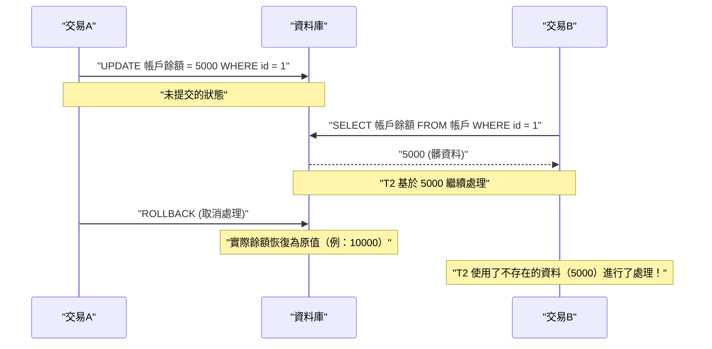

在 RDBMS（關聯式資料庫管理系統）中，保護資料完整性與一致性，並確保系統可靠性的最基本且重要的概念就是 **交易** （Transaction）。

在現代的 Web 應用程式與企業級系統中，同時會有大量使用者對資料庫進行讀寫。在這樣的並行處理環境下，深入理解如何讓資料正確無誤地被處理的機制，可以說是後端工程師與資料庫管理員必備的技能。

本文將從支撐資料庫交易的基礎理論 **ACID 特性** 開始，詳細且全面地解說當多個交易同時執行時可能發生的各種 **異常（Anomaly）** ，以及定義如何防止這些異常的 **交易隔離級別（Isolation Level）** 。此外，我們還會深入探討為了保護資料免於競爭而採用的具體實作手法： **悲觀鎖（Pessimistic Lock）** 與 **樂觀鎖（Optimistic Lock）** ，以及在現代 RDBMS 中被廣泛採用的 **MVCC（多版本並行控制）** 。

---

## 1. 什麼是交易？

**交易** 是指對資料庫進行的「不可分割的一系列處理單元」。
它是將多個 SQL 語句（新增、更新、刪除資料等）視為一個邏輯上的工作單位，並保證其結果只能是「全部成功並反映到資料庫中（ **提交** ）」或「中途失敗並完全不反映，恢復到原始狀態（ **回滾** ）」這兩種情況之一的機制。

### 1.1 帳戶轉帳的例子（交易的必要性）

在說明交易的重要性時，經常使用銀行帳戶轉帳（匯款）作為例子。
例如，「從 A 的帳戶匯款 10,000 元到 B 的帳戶」這個處理，在資料庫上會被拆解為以下兩個步驟（更新處理）：

1. 將 A 的帳戶餘額減少 10,000 元（UPDATE）
2. 將 B 的帳戶餘額增加 10,000 元（UPDATE）

如果在步驟 1 成功後立刻發生系統障礙或網路錯誤，導致步驟 2 沒有被執行，會發生什麼事呢？
A 的帳戶已經被扣除了 10,000 元，但 B 的帳戶卻沒有存入 10,000 元，這對金融系統來說將會引發致命的 **資料不一致** 。

透過使用交易，就能夠防止這種情況發生。

```sql
BEGIN TRANSACTION; -- 開始交易

-- 1. 從 A 的帳戶扣除 10000 元
UPDATE accounts
SET balance = balance - 10000
WHERE account_id = 'A' AND balance >= 10000;

-- 2. 對 B 的帳戶增加 10000 元
UPDATE accounts
SET balance = balance + 10000
WHERE account_id = 'B';

COMMIT; -- 只有在所有處理都成功時才確認
-- ※ 若發生錯誤則會 ROLLBACK，步驟 1 的扣除也會當作沒發生過
```

像這樣，將相關的多個更新處理綑綁為一個不可分割的單位，藉此維持資料庫的完整性，這就是交易最大的作用。

---

## 2. ACID 特性（交易的四個要求）

為了確保交易能安全地執行，必須滿足四個特性，取其英文字首稱為 **ACID 特性** （ACID Properties）。RDBMS 內部具備了複雜的機制來保證這個 ACID 特性。

### 2.1 Atomicity（原子性）
**Atomicity** （原子性）是保證交易內的所有操作必須是「全部執行，或者全部不執行（All or Nothing）」的特性。
如同前面帳戶轉帳的例子，若處理在途中失敗，必須連同已經執行的變更一起完全 **回滾** （取消）到交易開始前的狀態。絕對不允許資料庫殘留半途而廢的狀態（部分提交）。

### 2.2 [Consistency](https://kenji.blog/zh-tw/p/cap-theorem-distributed-systems-tradeoff/)（一致性）
**Consistency** （一致性）是保證在交易執行前後，資料庫的規則（約束）都能始終被滿足的特性。
在資料庫中可以定義主鍵約束（Primary Key）、外鍵約束（Foreign Key）、唯一約束（Unique）、檢查約束（Check）等資料必須滿足的規則。若因為交易更新資料而導致違反這些約束的狀態，是不被允許的，一旦發生違規就會立刻回滾。也就是說，交易扮演著將資料庫從「某個一致性的狀態」轉移到「另一個一致性的狀態」的角色。

### 2.3 Isolation（隔離性）
**Isolation** （隔離性）是確保即使多個交易同時執行，各個交易也不會影響其他交易的執行過程（中途狀態），或者不被其他交易所影響的特性。
理想的隔離性是指，多個交易並行執行的結果，與將它們逐一（循序）執行的結果完全一致（這稱為 **可序列化（Serializability）** ）。然而，若要保證完全的隔離性，系統的並行處理效能（吞吐量）將會大幅下降，因此實際的 RDBMS 中提供了用來調整效能與隔離性之間取捨的 **隔離級別** （詳見後述）。

### 2.4 Durability（持久性）
**Durability** （持久性）是保證一旦交易被 **提交** （完成），其結果即使發生系統障礙（斷電、崩潰等）也絕不會遺失的特性。
RDBMS 通常會在記憶體（緩衝池）中更新資料，並非同步地寫入磁碟，但在提交時，必定會將更新內容（變更歷程）作為 **預寫式日誌** （WAL: Write-Ahead Log 或 REDO 日誌等）記錄到磁碟等持久性儲存裝置中。藉此，萬一資料庫崩潰，也能在重新啟動時利用日誌來復原（Recovery）已提交的狀態。

---

## 3. 並行控制與交易異常（Anomaly）

當多個使用者或應用程式同時存取資料庫並並行執行交易時，若不進行適當的控制，將會發生各種 **資料不一致（異常・Anomaly）** 。在理解隔離級別之前，必須先掌握有哪些異常存在。

### 3.1 髒讀（Dirty Read）
**髒讀** 是指某個交易讀取了其他交易已經更新但 **尚未提交（未確定）的資料** 的現象。

以下的循序圖展示了髒讀發生的過程。



如果 交易A 撤銷了處理，那麼 交易B 就等於是「讀取了最終並不存在於資料庫中的幻影資料」來繼續處理，這將引發致命的邏輯錯誤。

### 3.2 不可重複讀（Non-repeatable Read）
**不可重複讀** 是指在同一個交易內對相同的查詢執行兩次時，因為在此期間其他交易 **更新並提交** 了資料，導致第一次和第二次讀取到的結果（值）不同的現象。

1. 交易A 對 `id=1` 的資料列進行 SELECT（值為 100）。
2. 交易B 將 `id=1` 的資料列 UPDATE 為 200 並提交。
3. 交易A 再次對 `id=1` 的資料列進行 SELECT，發現值變成了 200。

從 交易A 的角度來看，會面臨「自己明明沒有做任何變更，但每次讀取時資料卻不一樣」這種不一致的狀態。

### 3.3 幻讀（Phantom Read）
**幻讀** 是指在同一個交易內使用相同的搜尋條件（如範圍搜尋等）執行兩次查詢時，因為在此期間其他交易 **新增（INSERT）或刪除（DELETE）** 了資料並提交，導致第一次不存在（或存在）的資料列，在第二次出現（或消失）的現象。

不可重複讀是由於 **現有資料列的更新（UPDATE）** 所引起，而幻讀則是指因為 **資料列的新增或刪除（INSERT/DELETE）** ，導致結果集的資料筆數或結構本身發生變化的現象。

### 3.4 遺失更新（Lost Update）
**遺失更新** 是指多個交易同時讀取同一列資料，並各自進行計算後再將更新寫回時， **後寫入的更新會覆寫掉先前的更新，導致先前的更新消失** 的現象。

1. 交易A 讀取餘額（10000 元）。
2. 交易B 也讀取相同的餘額（10000 元）。
3. 交易A 加上 1000 元，將餘額 UPDATE 為 11000 元並提交。
4. 交易B 減去 2000 元，將餘額 UPDATE 為 8000 元並提交。

結果，資料庫中的餘額變成了 8000 元。交易A 所做的「加上 1000 元」的動作，被 交易B 的更新完全覆寫而遺失了。如果按照正確的順序處理，餘額應該要是 9000 元。這是在應用程式將資料讀取到記憶體後進行計算的處理模式中，經常發生的重大問題。

---

## 4. ANSI SQL 的交易隔離級別

為了解決上述的各種異常，ANSI SQL 標準定義了四個 **交易隔離級別** （Isolation Level）。隔離級別設定得越高（越嚴格），資料的一致性就越能得到強固的保護，但同時也越容易讓其他交易等待（發生鎖定競爭），導致並行處理效能下降。

| 隔離級別 (Isolation Level) | 髒讀 | 不可重複讀 | 幻讀 |
| :--- | :---: | :---: | :---: |
| **Read Uncommitted** （未提交讀） | 會發生 | 會發生 | 會發生 |
| **Read Committed** （已提交讀） | **可防止** | 會發生 | 會發生 |
| **Repeatable Read** （可重複讀） | **可防止** | **可防止** | 會發生 (※) |
| **Serializable** （可序列化） | **可防止** | **可防止** | **可防止** |

*(※ 在 MySQL 的 InnoDB 的 Repeatable Read 中，透過 Next-Key Lock 與 MVCC 的機制，預設也能防止大部分的幻讀)*

### 4.1 Read Uncommitted
最低的隔離級別。會讀取到其他交易尚未提交的變更（發生髒讀）。因為完全不保證資料的一致性，除了一些不要求嚴格正確性、只追求極端效能的特殊統計處理等情況外，實務上幾乎不會使用。在 PostgreSQL 等部分 DBMS 中，即使指定了這個級別，內部也會以 Read Committed 來運作。

### 4.2 Read Committed
許多 RDBMS（Oracle、PostgreSQL、SQL Server 的預設設定）所採用的預設隔離級別。
交易讀取到的資料必定只限於 **已提交** 的資料。這雖然能防止髒讀，但在自身交易執行期間，若其他交易更新了資料並提交，自身交易還是會讀取到該變更，因此會發生不可重複讀與幻讀。

### 4.3 Repeatable Read
MySQL（InnoDB）的預設隔離級別。
保證在交易開始時所讀取到的資料集，直到交易結束前都會維持一致的狀態。也就是說，即使在自身交易期間其他交易更新了該資料並提交，自身交易依然只會看到舊的（開始時的）資料。這可以防止不可重複讀。
不過，根據嚴格的 ANSI 標準定義，對於資料列的新增與刪除，仍有可能發生幻讀（如上所述，MySQL InnoDB 等透過實作也能抑制幻讀）。

### 4.4 Serializable
最嚴格的隔離級別，保證交易的執行結果就像是完全循序（序列化）執行一樣。能夠完全防止所有的異常（髒讀、不可重複讀、幻讀）。
然而，為了實現這一點，需要大範圍的鎖定（資料表鎖定或範圍鎖定），或者會有複雜的競爭偵測機制（如 SSI: Serializable Snapshot Isolation）在運作，這將大幅犧牲並行處理效能，並有頻繁發生交易回滾（因競爭錯誤而重試）的風險。

---

## 5. 並行控制的實作機制（鎖定與 MVCC）

RDBMS 具體是如何實作隔離級別的邏輯要求的呢？歷史上主要是以 **鎖定機制** 來控制，但在現代，為了提升並行處理效能， **MVCC** 已被廣泛普及。

### 5.1 基於鎖定的控制（悲觀鎖）
傳統的 RDBMS 是透過對資源（資料列或資料表）上「鎖」來進行排他控制。
- **共用鎖（S鎖 / Shared Lock）** : 讀取資料時取得。其他交易也可以取得共用鎖來同時讀取，但無法變更資料（無法取得 X 鎖）。
- **排他鎖（X鎖 / Exclusive Lock）** : 更新或刪除資料時取得。其他交易既不能讀取（S鎖）也不能更新（X鎖），會被迫等待（阻塞）。

基於鎖定的控制雖然確實，但有著 **「讀取處理會阻塞更新處理」「更新處理會阻塞讀取處理」** 的重大缺點，會導致吞吐量下降，也是引發彼此互相等待解鎖的 **死鎖** （Deadlock）的原因。

### 5.2 MVCC（Multi-Version Concurrency Control: 多版本並行控制）
為了解決這個鎖定的缺點而出現的就是 **MVCC** 。包含 PostgreSQL、MySQL(InnoDB)、Oracle 在內，現代主要的 RDBMS 幾乎都採用了這個機制。
MVCC 的基本概念是 **「在變更資料時不覆寫原始資料，而是建立新版本（版）的資料」** 。

- **讀取處理** 會讀取交易開始時的「過去版本的資料（快照）」。
- **更新處理** 會建立出新的「最新版本的資料」，並在提交時生效。

藉由這種方式，實現了 **「讀取不阻塞更新」「更新不阻塞讀取」** 的極高並行性，同時又能保證 Read Committed 或 Repeatable Read 的一致性。在 MVCC 環境下，只有當排他鎖（X鎖）互相競爭時（嘗試同時更新同一列資料時），後續的處理才會需要等待。

---

## 6. 應用程式層級的競爭對策（悲觀鎖與樂觀鎖）

除了資料庫層級的隔離級別與 MVCC 控制之外，特別是為了防止前述的 **遺失更新** ，並擔保業務上的資料一致性，通常會結合應用程式與 SQL 來進行明確的鎖定控制。其中具代表性的手法就是 **悲觀鎖** 與 **樂觀鎖** 。

下圖比較了這兩種鎖定手法的流程與行為差異。

```mermaid
flowchart TD
    subgraph "悲觀鎖（Pessimistic Lock）"
        P1("T1: SELECT ... FOR UPDATE")
        P2("DB: 對目標列取得排他鎖")
        P3("T2: SELECT ... FOR UPDATE")
        P4("DB: 阻塞 T2 直到鎖定解除")
        P5("T1: UPDATE & COMMIT")
        P6("DB: 解除鎖定")
        P7("T2: 解除阻塞，取得鎖定並繼續處理")

        P1 --> P2
        P2 --> P3
        P3 --> P4
        P4 --> P5
        P5 --> P6
        P6 --> P7
    end

    subgraph "樂觀鎖（Optimistic Lock）"
        O1("T1: SELECT (version=1)")
        O2("T2: SELECT (version=1)")
        O3("T1: UPDATE ... WHERE version=1")
        O4("DB: 成功 (更新為 version=2)")
        O5("T2: UPDATE ... WHERE version=1")
        O6("DB: 更新件數 0（失敗，偵測到競爭）")
        O7("T2: 應用程式端進行重試等錯誤處理")

        O1 --> O2
        O2 --> O3
        O3 --> O4
        O4 --> O5
        O5 --> O6
        O6 --> O7
    end
```



### 6.1 悲觀鎖（Pessimistic Lock）
**悲觀鎖** 是基於「其他使用者很有可能同時更新相同的資料（悲觀的）」這個前提，在處理的一開始就明確地對資料庫的資料列層級取得排他鎖，完全阻斷其他使用者的存取的手法。

在 SQL 層級，這是透過在 `SELECT` 語句的末尾加上 `FOR UPDATE` 子句來實現的。

```sql
BEGIN TRANSACTION;

-- 對目標的資料列取得排他鎖。其他交易會在此被阻塞
SELECT balance FROM accounts WHERE account_id = 'A' FOR UPDATE;

-- 執行業務邏輯（餘額檢查或計算等）後，進行更新
UPDATE accounts SET balance = balance - 10000 WHERE account_id = 'A';

COMMIT; -- 解除鎖定
```

**優點** : 可以完全防止資料競爭，處理流程單純。
**缺點** : 在取得鎖定期間會阻塞其他交易，容易導致效能下降。如果在長時間的交易或是需要等待使用者輸入畫面的處理期間持續保持鎖定，可能會有導致整個系統停擺的風險。

### 6.2 樂觀鎖（Optimistic Lock）
**樂觀鎖** 是基於「資料競爭應該很少發生（樂觀的）」這個前提，事前不進行鎖定， **而是在真正要更新資料的那一刻，才去驗證是否有其他人進行了變更** 的手法。

一般來說，這會透過在目標資料表中加入 **版本管理用的欄位（例: `version` INT）** 或最後更新時間的欄位來實作。

```sql
-- 1. 事先取得資料，並將目前的版本（version = 1）保留在應用程式的記憶體中
SELECT balance, version FROM accounts WHERE account_id = 'A';

-- (在此進行應用程式端的計算，或是顯示使用者確認畫面等)

-- 2. 更新時，將取得時的版本包含在 WHERE 子句中，並同時將版本遞增
UPDATE accounts
SET balance = balance - 10000,
    version = version + 1
WHERE account_id = 'A'
  AND version = 1; -- 檢查是否與自己讀取時的版本一致
```

執行這個 UPDATE 語句時，應用程式端會去檢查資料庫回傳的 **更新筆數（Affected Rows）** 。
- **更新筆數為 1 筆時** : 沒有競爭，正常完成更新。
- **更新筆數為 0 筆時** : 意味著在自己讀取資料到更新之間的這段時間，有另一個交易更新了資料，導致 `version` 變成了 `2` 以上（或者資料列已被刪除）。在這種情況下，應用程式會回傳「資料已被其他使用者變更。請確認最新資訊後再次執行」之類的 **排他錯誤** 給使用者，或是自動進行重試。

**優點** : 因為不會長時間佔用資料庫的鎖定，所以並行性非常高，效能優越。最適合用在 Web 應用程式無狀態的 HTTP 請求/回應之間（從顯示畫面到按下按鈕）防止競爭。
**缺點** : 應用程式端必須實作發生競爭時的處理（顯示錯誤或重試）。在競爭頻繁發生的環境下，重試處理的成本會變大。

---

## 7. 總結

資料庫的 **交易** 並不只是 SQL 的延伸，而是左右整個系統可靠性與效能的後端開發要訣。

- 理解 **ACID 特性** ，並知道 RDBMS 是如何保護資料的。
- 認知到並行處理所引發的 **髒讀** 、 **幻讀** 、 **遺失更新** 等異常（Anomaly）。
- 掌握各個 DBMS **隔離級別（Isolation Level）** 的預設值與行為差異（例如 Read Committed 與 Repeatable Read 的差異），並根據需求選擇合適的隔離級別。
- 理解 **悲觀鎖** 與 **樂觀鎖** 的特性，配合業務邏輯與流量特性（競爭頻率），在應用程式中實作最適合的排他控制。

透過結合這些知識與技術，才可能構築出「不會引起資料不一致，且能以高效能進行擴展」的堅固系統。
在下一篇文章中，我們預計將解說這種交易控制在分散式系統或微服務架構中是如何演進的（例如 Saga 模式或 2PC 等）。敬請期待。
