## 序章：モバイル開発のパラダイムシフトとReact Nativeの存在意義

### 「Learn once, write anywhere」の真意
2015年、Meta（旧Facebook）によってオープンソース化された **React Native** は、それまでのモバイルアプリケーション開発の常識を根底から覆しました。当時提唱されたスローガンは、Javaの掲げた「Write once, run anywhere（一度書けば、どこでも動く）」ではなく、 **「Learn once, write anywhere（一度学べば、どこでも書ける）」** でした。

この理念が意味するのは、単一のコードですべてのプラットフォームに共通の最大公約数的な妥協UIを押し付けることではありません。Reactの強力な宣言的UIパラダイム、コンポーネント指向、そして単方向データフローという「思考様式（メンタルモデル）」をそのまま携え、iOS、Android、さらにはmacOSやWindowsといった異種プラットフォーム固有のネイティブUIコンポーネントを直接駆動するという思想です。

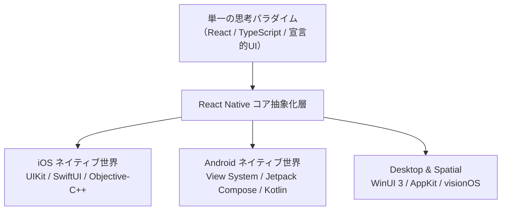

### Web技術者がネイティブアプリ界に進出する歴史的必然性
2010年代初頭のモバイル開発は、iOSのObjective-C/Swiftエンジニアと、AndroidのJava/Kotlinエンジニアという高度に分断されたサイロ構造に縛られていました。同一の機能を備えたアプリケーションを世に送り出すために、企業は2つの専門チームを組織し、別々の言語、別々の開発ツール、別々のライフサイクルで重複したビジネスロジックを実装し続けなければなりませんでした。

Webの世界で爆発的な進化を遂げたJavaScript/TypeScriptエコシステムと、ReactによるUI構築の生産性をネイティブアプリ開発へと移植する試みは、単なる工数削減を超えた「開発組織のスケール限界を打破する必然の変革」でした。Webの圧倒的な反復開発速度（Fast Refresh）と、ネイティブの豊かなユーザー体験を単一の言語基盤上で融合させること――それこそがReact Nativeが切り拓いた地平です。

### ネイティブ・Flutter・Web（PWA）との本質的トレードオフ比較
クロスプラットフォーム技術の選定においては、レンダリングアーキテクチャとプラットフォーム統合のトレードオフを厳密に把握する必要があります。

| 評価軸 | React Native (新アーキテクチャ) | Flutter | ネイティブ (Swift / Kotlin) | Web / PWA (Capacitor等) |
| :--- | :--- | :--- | :--- | :--- |
| **レンダリング方式** | **OSネイティブUIプリミティブ** (`UIView`, `android.view.View`) | 独自グラフィックエンジン (Impeller / Skia) によるCanvas直接描画 | **OSネイティブUIプリミティブ** を直接操作 | WebView内でのDOMレンダリング |
| **プラットフォーム忠実度** | **極めて高い** （OS標準のアニメーション、アクセシビリティ、文字装飾が自動追従） | 忠実度は自作Widget依存（OSのバージョンアップに追従遅延のリスクあり） | **完全な忠実度** （最速で最新APIに追従） | プラットフォーム特有の物理挙動の再現に限界 |
| **開発言語** | **TypeScript / JavaScript** | Dart | Swift, Kotlin | JavaScript / TypeScript, HTML/CSS |
| **実行エンジン** | **Hermes AOTエンジン** （バイトコード事前コンパイル） | AOTコンパイルされたDart機械語 | ネイティブ機械語 (LLVM) | V8 / JavaScriptCore |
| **コード共通化率** | 80% 〜 95%（ネイティブモジュール連携部を除く） | 90% 〜 98% | 0%（KMP導入時はロジックのみ共通化可能） | 95% 〜 100% |
| **ネイティブ連携** | **JSIによるゼロオーバーヘッド直接呼出し** | Platform Channelsによるメッセージ送受信（非同期） | オーバーヘッドなし | WebViewブリッジ経由（高レイテンシ） |
| **エコシステム規模** | **世界最大のnpmエコシステム** + 専用ネイティブライブラリ群 | pub.dev（急速成長中だがnpmに比肩せず） | CocoaPods, SwiftPM, Gradle | npmエコシステム |

---

## 第1章：React Nativeの基本概念とメンタルモデル

### 1.1 Reactコアの継承と差異
React Nativeを理解するための第一歩は、「React（コア）」と「React DOM（レンダラー）」の分離構造を認識することです。React自体は、状態（State）とプロパティ（Props）の変化に応じて「あるべきUIのツリー構造（仮想ツリー）」を計算する純粋な状態機械に過ぎません。

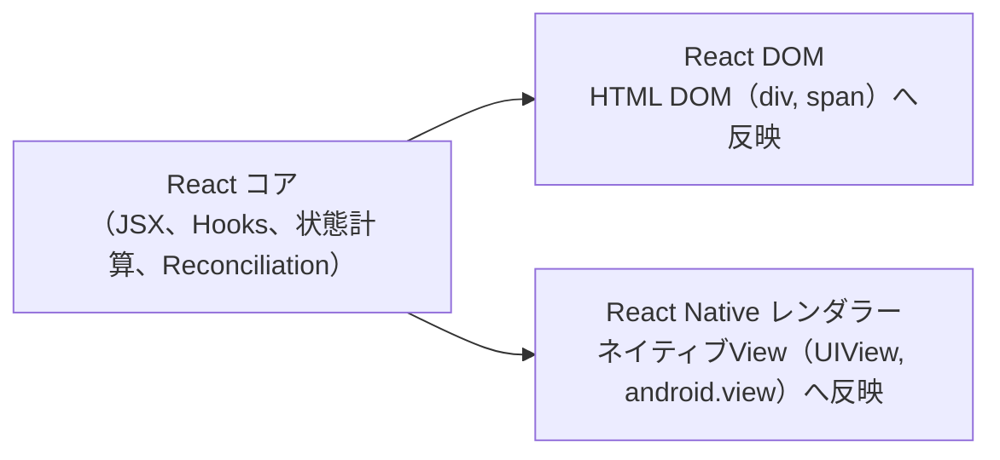

React Webでは差分検出アルゴリズム（Reconciliation）によってブラウザのHTML DOMノード（`<div>`, `<p>`）が更新されますが、React Native環境ではWebブラウザのDOMツリーは存在しません。代わりに、Reactコアが算出したノードツリーは、後述するネイティブプラットフォームのUIウィジェット構築命令へと変換されます。

したがって、Reactにおける開発作法――コンポーネントの分割、`useState` や `useReducer` による局所状態管理、`useEffect` による副作用ハンドリング、`useMemo` や `useCallback` によるメモ化最適化――は、React Nativeにおいても100%同一のメンタルモデルとして機能します。

### 1.2 ネイティブUIプリミティブへのマッピング原理
React Nativeのコードベースには、HTML要素のタグは登場しません。代わりに、プラットフォームに依存しない抽象化された **「コアコンポーネント」** が提供されます。

```tsx
// React Nativeの宣言的UIの基本構造
import React, { useState } from 'react';
import { View, Text, StyleSheet, Pressable } from 'react-native';

export const CounterCard: React.FC = () => {
  const [count, setCount] = useState<number>(0);

  return (
    <View style={styles.cardContainer}>
      <Text style={styles.titleText}>リアクティブ・カウンター</Text>
      <Text style={styles.counterValue}>{count}</Text>
      <Pressable
        style={({ pressed }) => [
          styles.button,
          pressed && styles.buttonPressed
        ]}
        onPress={() => setCount((prev) => prev + 1)}
      >
        <Text style={styles.buttonLabel}>インクリメント</Text>
      </Pressable>
    </View>
  );
};

const styles = StyleSheet.create({
  cardContainer: {
    padding: 20,
    backgroundColor: '#ffffff',
    borderRadius: 12,
    shadowColor: '#000',
    shadowOffset: { width: 0, height: 4 },
    shadowOpacity: 0.1,
    shadowRadius: 8,
    elevation: 4, // Android向け立体的シャドウ
  },
  titleText: {
    fontSize: 16,
    fontWeight: '600',
    color: '#333333',
    marginBottom: 8,
  },
  counterValue: {
    fontSize: 32,
    fontWeight: 'bold',
    color: '#0066cc',
    textAlign: 'center',
    marginVertical: 12,
  },
  button: {
    backgroundColor: '#0066cc',
    paddingVertical: 12,
    paddingHorizontal: 24,
    borderRadius: 8,
    alignItems: 'center',
  },
  buttonPressed: {
    opacity: 0.8,
    transform: [{ scale: 0.98 }],
  },
  buttonLabel: {
    color: '#ffffff',
    fontSize: 14,
    fontWeight: 'bold',
  },
});
```

このコードにおいて、各コンポーネントは実行時にOSネイティブの対応クラスへと直接マッピングされます：
- `<View>`: iOS上では `UIView`、Android上では `android.view.ViewGroup`（または `ReactViewGroup`）として実体化。
- `<Text>`: iOS上では `NSTextStorage` / `UILabel`、Android上では `android.widget.TextView` として実体化。
- `<Pressable>`: タッチイベントシステムを抽象化し、OSネイティブのタッチフィードバック（iOSのハイライト、AndroidのRippleエフェクト等）と連動。

### 1.3 シングルスレッドJavaScriptとマルチスレッドネイティブOSの協調
モバイルOSは、極めて厳格なマルチスレッド規約のもとで動作しています。画面の再描画、ユーザー入力の検知、ウィンドウアニメーションはすべて **「メインスレッド（UIスレッド）」** で処理されなければならず、このスレッドで16.6ms（60Hz画面の場合）または8.3ms（120Hz ProMotion画面の場合）を超える同期ブロッキング処理が発生した瞬間、画面は即座にフレームドロップ（ジャンク・カクつき）を起こします。

React Nativeは、この制約を克服するために **「JavaScript実行環境をネイティブメインスレッドから完全に分離したバックグラウンドスレッドで駆動する」** というアーキテクチャを採用しました。

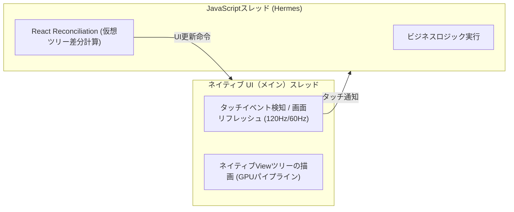

このスレッド分離こそが、JavaScriptで重い計算やネットワーク通信を行っても、ネイティブのスクロールアニメーションを滑らかに維持できる根源的な仕組みです。

---

## 第2章：内部アーキテクチャの深層解剖（旧Bridgeから新アーキテクチャへ）

### 2.1 旧アーキテクチャの限界：「The Bridge」のボトルネック
長年にわたりReact Nativeを支えてきた旧アーキテクチャは、JavaScript世界とネイティブ世界を **「Bridge（ブリッジ）」** と呼ばれる通信チャネルで接続していました。

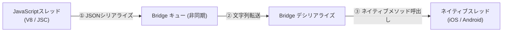

この旧ブリッジには、3つの本質的な工学的限界が存在していました：
1. **非同期性（Asynchronous Overhead）**:
   すべての通信が非同期で行われるため、同期的なレイアウト計測や同期的なタッチ応答が原理的に不可能でした。例えば、ユーザーが画面を素早くスワイプした際、ネイティブのスクロール位置をJSに伝え、JSが新しいセルの描画を命じる通信がブリッジで渋滞し、画面スクロールに追いつかずに背景が白く抜ける「ホワイトアウト現象」が発生しました。
2. **直列化コスト（JSON Serialization Cost）**:
   データを受け渡すたびに、JavaScriptオブジェクトをJSON文字列にエンコードし、ブリッジ経由で転送した後にネイティブ側でデコードする必要がありました。巨大なリストデータや画像バイナリ、毎フレームの加速度センサー値を渡す際、直列化・逆直列化のCPU負荷が深刻な性能低下をもたらしました。
3. **バッチ処理によるレイテンシ**:
   通信効率を上げるため、メッセージは一定周期でバッチ（まとめ）処理されていました。これがマイクロ秒単位の精密なアニメーション同期を困難にしていました。

### 2.2 新アーキテクチャの中核：JavaScript Interface (JSI)
React Native 0.68以降本格導入され、現在デフォルトとなった「新アーキテクチャ（New Architecture）」の最大の革新は、Bridgeの完全撤廃と **「JavaScript Interface (JSI)」** の導入です。

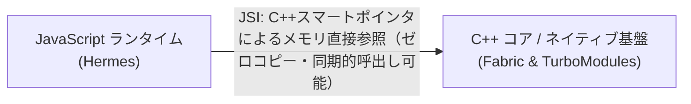

JSIは、JavaScriptエンジンからC++のホストオブジェクトを直接保持し、そのメソッドをダイレクトに同期呼出し可能にする軽量なC++抽象化レイヤーです。
- **共有メモリ空間**: C++オブジェクトへの参照をJavaScriptの変数として直接保持できます。データの受け渡しにJSON文字列変換は一切不要となり、ポインタの直接参照（ゼロコピー）が実現しました。
- **同期実行の解放**: JavaScriptからネイティブ関数を、あたかも通常のJavaScript関数であるかのように同期的に呼び出し、戻り値をその場で即座に受け取ることが可能になりました。
- **エンジン非依存性**: JSIは特定のJSエンジン（V8、JavaScriptCore、Hermes）に依存しない統一インターフェースを提供するため、エンジン自体の換装が極めて容易になりました。

### 2.3 Fabricレンダラー：イミュータブルなシャドウツリーと並行レンダリング
JSIを基盤として、UIレンダリングシステムは旧「UIManager」から **「Fabric」** へと全面的に再構築されました。

Fabricの動作原理は以下の3フェーズで進行します：

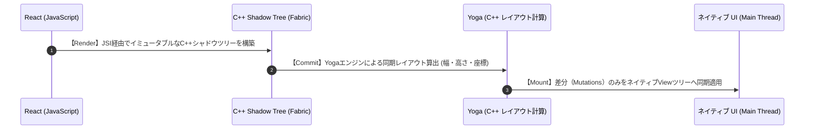

1. **Renderフェーズ**:
 React要素ツリーから、C++のメモリ空間上に **イミュータブル（不変）な「シャドウツリー」** を生成します。オブジェクトが不変であるため、マルチスレッド環境下でも競合状態（Race Condition）が発生せず、スレッドセーフな並行レンダリングが可能になります。
2. **Commitフェーズ**:
   C++製レイアウトエンジン「Yoga」を呼び出し、親から子への制約伝播によって各要素の物理的な座標（$x, y, \text{width}, \text{height}$）を高速に算出します。
3. **Mountフェーズ**:
   前回のシャドウツリーと今回のシャドウツリーの差分（Tree Diffing）を計算し、差分更新命令（Mutations）のリストのみをネイティブメインスレッドに送り、一括で画面に反映します。

Fabricにより、React 18の「Concurrent Features（トランジションやサスペンス）」がネイティブ上でも完全にネイティブスレッドと協調して動作するようになりました。

### 2.4 TurboModules：オンデマンド遅延読み込みと型安全バインディング
従来のネイティブモジュールは、アプリケーション起動時にすべてのモジュール（Bluetooth、カメラ、位置情報など）を一括初期化してBridgeに登録していました。このため、起動時に使用しないモジュールであっても初期化コストが発生し、アプリ起動時間（Time To Interactive: TTI）を悪化させていました。

新アーキテクチャの **「TurboModules」** は、JSIを活用してネイティブ機能をオンデマンドで遅延初期化（Lazy Loading）します。JavaScriptコードが実際にそのモジュールを `import` してメソッドを呼び出す瞬間まで、C++やObjective-C/Kotlinのインスタンスは生成されません。これにより、アプリの起動時間が劇的に短縮されます。

### 2.5 CodeGen：型定義からのC++インターフェース自動生成
JavaScript（動的型付け言語）とC++ / Objective-C / Kotlin（静的型付け言語）の安全なバインディングを実現するのが、ビルド時コード生成ツール **「CodeGen」** です。

開発者がTypeScriptまたはFlowでネイティブモジュールやコンポーネントの型インターフェースを記述すると、CodeGenがビルド時に自動的に対応するC++抽象基底クラスとJSIグルーコードを生成します。

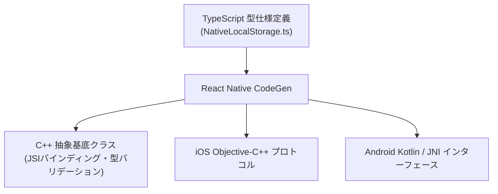

これにより、引数の型不一致や存在しないメソッドの呼出しはすべてコンパイル時に検知され、実行時のBridge通信エラーによるアプリクラッシュが原理的に根絶されます。

### 2.6 Hermes JavaScriptエンジンの仕組み
Metaがモバイル向けにゼロから設計・開発したオープンソースJavaScriptエンジン **「Hermes」** は、現代のReact Nativeの標準エンジンです。

一般的なブラウザのJSエンジン（V8など）は、起動時に生のJavaScriptテキストをパースし、JIT（Just-In-Time）コンパイラで実行時に機械語へコンパイルします。しかし、CPUリソースとメモリが限られたモバイル端末において、JITコンパイルは大きなメモリ消費と起動遅延の主因となっていました。

Hermesのアーキテクチャ的優位性は以下の通りです：
1. **AOT事前バイトコードコンパイル（Ahead-Of-Time Compilation）**:
   開発マシンまたはCI環境でビルドを行う際、JavaScriptソースコードはHermes独自の最適化されたバイトコードファイル（`.hbc`）へと事前にコンパイルされます。アプリ起動時、端末はパースや字句解析を行うことなく、バイトコードを即座にメモリにマップして実行を開始します。
2. **大幅なメモリ使用量削減**:
   実行時のJITコンパイラや構文解析器をバイナリ内に保持する必要がないため、APK/IPAのファイルサイズが小さく、ランタイムメモリフットプリント（RSS）が劇的に抑制されます。
3. **世代別コンパクトGC（Garbage Collector）**:
   モバイルのメモリ断片化を防ぐため、移動型世代別GCを実装し、断続的なGCポーズによるフレーム落ちを防ぎます。

---

## 第3章：開発環境の選定とプロジェクト設計（Expo vs Bare CLI）

### 3.1 現代のExpo（Managed Workflow）の劇的進化
過去のReact Native開発において、Expoは「初心者向けだがネイティブライブラリの追加ができない制限だらけの環境」と評される時代がありました。しかし、現在のExpoは完全にその殻を破り、 **React Nativeの公式ドキュメントが第一推奨する包括的エンタープライズ開発プラットフォーム** へと変貌を遂げています。

その劇的な進化を牽引したのが **「Config Plugins（設定プラグイン）」** の仕組みです。開発者が `app.json` や `app.config.ts` に設定を宣言するだけで、ビルド時にiOSの `Info.plist` や `Podfile`、Androidの `AndroidManifest.xml` や `build.gradle` を自動的かつプログラム的に書き換えます。これにより、プッシュ通知、Bluetooth、カスタムフォント、カメラ権限といった深いOSレイヤーのネイティブ設定を、Git上で生ネイティブファイルを管理することなくクリーンに維持できます。

### 3.2 React Native Community CLI（Bare Workflow）が必要なケース
依然として従来の「Bare Workflow（React Native CLI）」が選択されるシナリオは、極めて特殊かつ限られた領域です：
- 既存の巨大なネイティブアプリ（iOS/Android）の一部画面としてReact Nativeを組み込む（Brownfield統合）場合。
- 企業独自のプライベートC++ライブラリやプロプライエタリなハードウェアSDK（医療機器・特殊POS端末等）と深く結合する必要がある場合。
- ビルドシステム自体を独自のBazelやBuck等で統制している超大規模モノレポ組織。

現代の新規モバイルプロジェクトにおいては、95%以上のユースケースでExpoが最適な選択肢となります。

### 3.3 Expo Prebuild（Continuous Native Generation: CNG）のパラダイム
Expoの真の革命的パラダイムは、 **「Continuous Native Generation (CNG)」** と呼ばれる設計思想です。

従来のBare CLIプロジェクトでは、`ios/` ディレクトリと `android/` ディレクトリ内の数千行に及ぶビルド設定ファイルを開発者が手動でコミット・管理していました。このため、React Nativeのバージョンアップ時には、XcodeやGradleの破壊的変更を1行ずつマージする「アップグレードの苦行」が避けられませんでした。

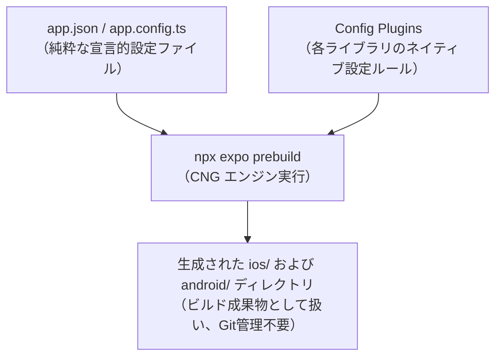

CNGでは、ネイティブディレクトリはソースコードではなく「ビルドアーティファクト」として扱われます。`npx expo prebuild` コマンドを実行するたびに、クリーンなネイティブプロジェクトが再現性高く生成されます。React Native自体のアップグレードも、設定ファイルを更新して `prebuild` を再実行するだけで完了するため、プロジェクトの長期保守性が飛躍的に向上しました。

### 3.4 開発ビルド（Expo Dev Client）とEASクラウド基盤
Expoは、App Store/Google Playに公開されている汎用の「Expo Go」アプリだけではありません。ネイティブモジュールやカスタムC++コードを含む本格アプリを開発する際には、 **「Expo Dev Client（カスタム開発ビルド）」** を使用します。

また、クラウドインフラ基盤である **「Expo Application Services (EAS)」** は、以下の3本柱でモバイルのDevOpsを一変させました：
1. **EAS Build**: クラウド上のmacOS/LinuxコンテナでiOS（IPA）およびAndroid（AAB）バイナリを完全自動ビルド。ローカルにMacを持たないエンジニアでもiOSビルドが可能。
2. **EAS Submit**: ビルドされた成果物を、Apple App Store ConnectやGoogle Play Consoleの内部テスト／製品トラックへワンコマンドで自動提出。
3. **EAS Update**: ネイティブコードの変更を含まないJavaScript/アセットの修正を、ストアの審査を経ずに数分でユーザー端末へ配信するOTA（Over-The-Air）基盤。

---

## 第4章：コアコンポーネントとレイアウト工学（Yogaエンジン）

### 4.1 コアコンポーネント詳解
React Nativeの基本UIは、厳選された高レベルコアコンポーネントの組み合わせによって構築されます。

| コンポーネント | 役割とネイティブマッピング | 特筆すべきプロパティと挙動 |
| :--- | :--- | :--- |
| `<View>` | すべてのUIの基本コンテナ (`UIView` / `ViewGroup`) | デフォルトで `display: flex`、`flexDirection: column` が適用される。 |
| `<Text>` | 文字列のレンダリング (`UILabel` / `TextView`) | **テキストは必ず `<Text>` で囲む必要がある**。ネストした `<Text>` はインラインでインラインスパンを形成。 |
| `<Image>` | 静的画像およびリモート画像描画 (`UIImageView` / `ImageView`) | リモート画像には明示的な幅・高さの指定が必須。新標準としては高性能な `expo-image` が推奨される。 |
| `<ScrollView>` | 任意コンテンツのスクロール可能コンテナ | コンテンツ全体のViewを一度にメモリ確保するため、要素数が多い巨大リストには不向き。 |
| `<TextInput>` | キーボード入力受付 (`UITextField` / `EditText`) | ソフトウェアキーボードの出現に伴うレイアウト調整（KeyboardAvoidingView連携）が必要。 |
| `<Pressable>` | 高度なタッチジェスチャー受付 | タッチ状態に応じた動的スタイル関数や長押し・ホバーの精密検知を提供。 |

### 4.2 C++製レイアウトエンジン「Yoga」の力学
Webブラウザには長年の歴史を持つ強力なレイアウトエンジンが内蔵されていますが、iOSやAndroidのネイティブ環境には共通のFlexboxエンジンが存在しません。そこでMetaが開発したのが、オープンソースの超高速C++製Flexboxレイアウトエンジン **「Yoga」** です。

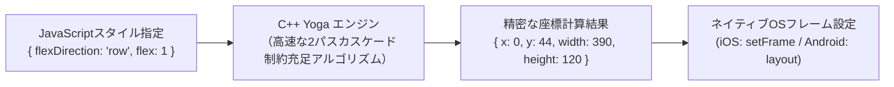

#### WebのCSS Flexboxとの決定的な相違点
React Nativeのスタイル記述はCSSに酷似していますが、モバイルアプリ固有の設計原則に基づき、以下の重大な相違が存在します：
1. **主軸のデフォルトが `column`（垂直方向）**:
   Webでは `flexDirection: 'row'`（水平方向）がデフォルトですが、縦長画面を基本とするモバイル端末では、`<View>` の主軸は最初から `column` に設定されています。
2. **寸法の単位はピクセルではなく「密度非依存ポイント（dp / pt）」**:
   React Nativeの数値は物理ピクセル（px）ではなく、論理単位です。端末の画面密度（`PixelRatio.get()`）に応じて、iPhoneのRetinaディスプレイなら2倍または3倍の物理ピクセルへ自動スケーリングされます。
3. **CSSの継承（Inheritance）が存在しない**:
   Webでは親の `font-family` や `color` が子要素に自動継承されますが、React Nativeでは `<Text>` をネストした場合を除き、スタイルのカスケード継承は発生しません。

### 4.3 高性能リストレンダリング工学：FlatList vs FlashList
モバイル画面で数百から数万件のアイテムをスクロール表示する際、`<ScrollView>` を使用するとメモリ不足（OOM）でアプリが瞬時にクラッシュします。この問題を解決するのが **「仮想化リスト（VirtualizedList）」** です。

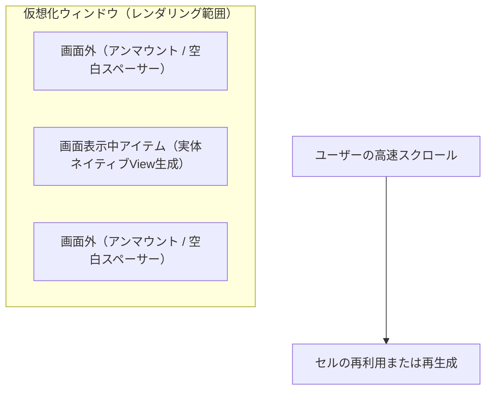

#### FlatListのセル再生成メカニズム
React Native標準の `<FlatList>` は、画面に表示されている領域とその前後のバッファ領域（`windowSize`）の要素のみをネイティブViewとして実体化し、画面外に外れたセルをアンマウントしてプレースホルダーに置き換えます。しかし、セルのマウントとアンマウントを繰り返すため、高速スクロール時にJavaScriptスレッドが追いつかず、空白のセル（ブランクスペース）が現れる限界がありました。

#### Shopify製「FlashList」のセル再利用（Recycling）革命
EC最大手のShopifyが開発した **「FlashList」** は、Androidの `RecyclerView` やiOSの `UICollectionView` が誇る **「セルの再利用（Recycling）」** の概念をReact Native上に完全再現しました。

セルをアンマウントして破棄するのではなく、画面外に出た既存のネイティブView要素をそのまま使い回し、中のデータ（Props）のみを即座に差し替えます。これにより、ガベージコレクションの発生頻度とViewの生成コストが最大で5倍から10倍削減され、低スペックなAndroid端末であっても滑らかな120fpsスクロールが達成されます。

```tsx
// Shopify FlashListによる極限の仮想化リスト実装
import React from 'react';
import { View, Text, StyleSheet } from 'react-native';
import { FlashList } from '@shopify/flash-list';

interface ProductItem {
  id: string;
  title: string;
  price: number;
}

const mockData: ProductItem[] = Array.from({ length: 5000 }, (_, i) => ({
  id: `item-${i}`,
  title: `高性能エンジニアリングアイテム #${i + 1}`,
  price: Math.floor(Math.random() * 10000) + 1000,
}));

export const ProductListView: React.FC = () => {
  return (
    <View style={styles.container}>
      <FlashList
        data={mockData}
        estimatedItemSize={72} // セルの高さの事前推定値（レイアウトジャンプ防止）
        keyExtractor={(item) => item.id}
        renderItem={({ item }) => (
          <View style={styles.itemRow}>
            <Text style={styles.itemTitle}>{item.title}</Text>
            <Text style={styles.itemPrice}>¥{item.price.toLocaleString()}</Text>
          </View>
        )}
      />
    </View>
  );
};

const styles = StyleSheet.create({
  container: { flex: 1, backgroundColor: '#f8f9fa' },
  itemRow: {
    height: 72,
    paddingHorizontal: 16,
    justifyContent: 'center',
    borderBottomWidth: StyleSheet.hairlineWidth,
    borderBottomColor: '#e0e0e0',
  },
  itemTitle: { fontSize: 15, color: '#212529', fontWeight: '500' },
  itemPrice: { fontSize: 14, color: '#0d6efd', marginTop: 4 },
});
```

### 4.4 スタイリング手法の比較評価
現代のReact Nativeにおけるスタイリング設計には、複数のアプローチが存在します。

| スタイリング手法 | 特徴とメリット | デメリット・注意点 | 推奨ユースケース |
| :--- | :--- | :--- | :--- |
| **`StyleSheet.create`** | 標準API。スタイルオブジェクトを数値IDに変換し、JSI経由でネイティブへ一度だけ転送してキャッシュ。 | クラス合成やメディアクエリ、動的テーマ切り替えのボイラープレートが多い。 | コアライブラリ開発、外部依存を極小化したい基幹機能。 |
| **NativeWind (v4)** | Tailwind CSSの記法をそのままReact Nativeへ適用。Babel/SWCプラグインによりビルド時に最適化。 | 複雑な動的プロパティ計算時に実行時オーバーヘッドが生じる場合がある。 | Web（Next.js）とコードベースを共有するクロスプラットフォームアプリ。 |
| **Restyle (Shopify)** | TypeScriptによる厳格な型安全テーマ駆動型スタイリング。デザイントークンを強固に制約。 | Tailwindに比べると記述量が増加する傾向がある。 | 大規模開発チームで一貫したデザインシステムを死守したい場合。 |
| **Tamagui** | ビルド時最適化コンパイラを備えた次世代ユニバーサルUIフレームワーク。Webとネイティブの完全両立。 | 学習コストが高く、設定が高度。 | アプリとWebを極限まで高いパフォーマンスで完全一体化したい新規プロダクト。 |

---

## 第5章：ナビゲーションアーキテクチャと状態管理の実践設計

### 5.1 モバイルナビゲーション特有の複雑性
Webのナビゲーションは、単一のブラウザ履歴スタックとURL文字列の対応関係によってシンプルに表現されます。しかし、モバイルアプリのナビゲーションは本質的に **多次元的** です：
- **スタックナビゲーション**: 画面がカードのように上に重なり、左スワイプのネイティブジェスチャーで戻る。
- **ボトムタブナビゲーション**: 複数の独立したナビゲーションスタックがタブごとに並行して常駐。
- **モーダルナビゲーション**: 下からスライドアップし、ドラッグダウンで破棄されるコンテキスト。
- **ディープリンク**: 外部Webリンク（`https://myapp.com/item/123`）やカスタムURLスキーム（`myapp://item/123`）から、アプリ内の多層階層の深い画面へと一瞬で復元・着地する要求。

### 5.2 React Navigation vs React Native Screens
React Nativeコミュニティのデファクトスタンダードである **「React Navigation」** は、JavaScript層で柔軟なルーティングロジックを制御します。

しかし、JavaScriptだけで画面遷移をアニメーションさせると、CPU負荷が高い画面で遷移時にカクつきが発生します。このボトルネックを解消したのが、Software Mansionが開発した **「React Native Screens」** です。

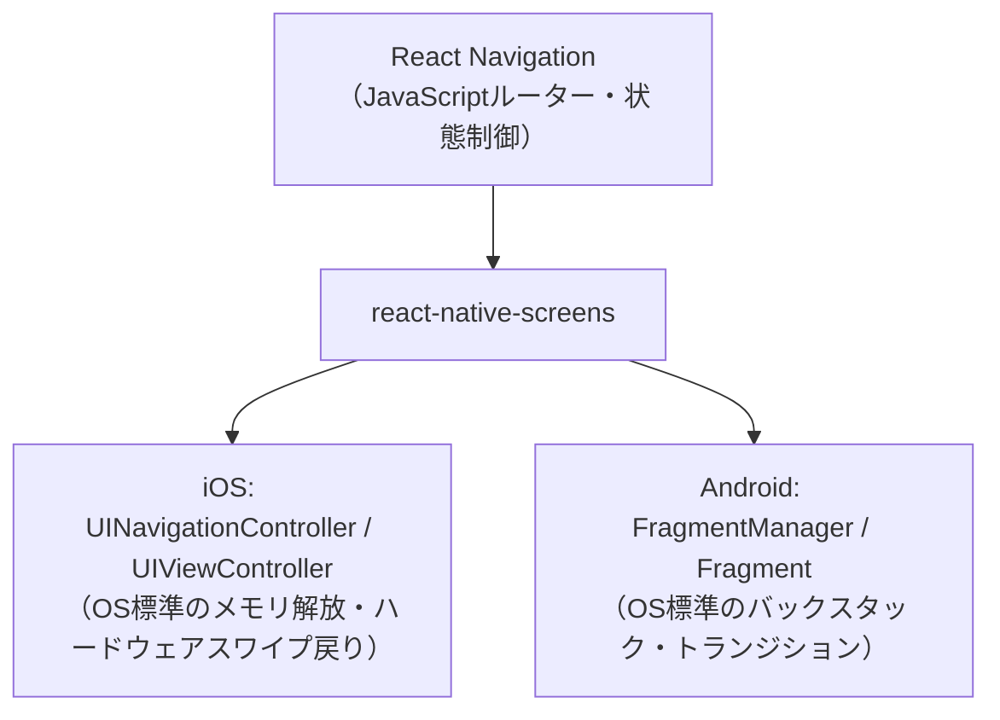

`react-native-screens` は、Reactコンポーネントツリーの各画面を、iOSの真の `UIViewController` およびAndroidの `Fragment` へと直接1対1で接続します。これにより、背面に隠れた画面の描画処理が自動的に一時停止（Freeze）され、メモリとバッテリーが強力に保護されます。

### 5.3 ファイルベースルーティングの最前線：Expo Router
Next.jsのApp Routerに触発され、Evan Bacon（Expoチーム）によって設計されたのが **「Expo Router」** です。

ファイルシステムのディレクトリ構造がそのままアプリのURLとナビゲーション構造を決定します：

```
app/
├── _layout.tsx         # ルートレイアウト（認証状態に応じたスタック定義）
├── (tabs)/             # タブグループ（URLパスには含まれない）
│   ├── _layout.tsx     # ボトムタブナビゲーション定義
│   ├── index.tsx       # ホーム画面 (/)
│   └── profile.tsx     # プロフィール画面 (/profile)
├── item/
│   └── [id].tsx        # 動的ルート (/item/42)
└── modal.tsx           # モーダル画面 (/modal)
```

#### Expo Routerの設計思想と破壊的メリット
1. **真のディープリンク自動解決**:
   すべての画面が本質的にユニークなURL（例: `/item/42?ref=share`）を持つため、特別なディープリンク設定ファイルを何十行も手書きする必要がありません。
2. **ユニバーサルリンクのWeb/Native完全一致**:
   React Native for Webと統合した際、モバイルアプリ内でもWebブラウザ内でも、同一のURL構造で全く同じルーティング挙動が再現されます。
3. **型安全なルート遷移（Typed Routes）**:
   プロジェクト内のルートファイル群からTypeScript型が自動生成されるため、存在しないパスへの `router.push('/invalid')` はコンパイルエラーとして即座に弾かれます。

```tsx
// Expo Routerによる型安全な宣言的遷移の実装
import { View, Text, Pressable } from 'react-native';
import { useRouter, useLocalSearchParams } from 'expo-router';

export default function ItemDetailScreen() {
  const router = useRouter();
  const { id } = useLocalSearchParams<{ id: string }>();

  return (
    <View style={{ flex: 1, justifyContent: 'center', alignItems: 'center' }}>
      <Text style={{ fontSize: 20 }}>アイテム詳細: {id}</Text>
      <Pressable
        onPress={() => router.push('/modal')}
        style={{ marginTop: 20, padding: 12, backgroundColor: '#0066cc', borderRadius: 8 }}
      >
        <Text style={{ color: '#fff' }}>詳細モーダルを開く</Text>
      </Pressable>
    </View>
  );
}
```

### 5.4 状態管理の最適解：サーバー状態とクライアント状態の分離
現代のアーキテクチャでは、「すべての状態を単一のグローバルReduxストアに放り込む」という手法はアンチパターンと見なされています。状態を **「サーバーキャッシュ状態」** と **「純粋なクライアントUI状態」** に峻別することが、極めて高い保守性を生み出します。

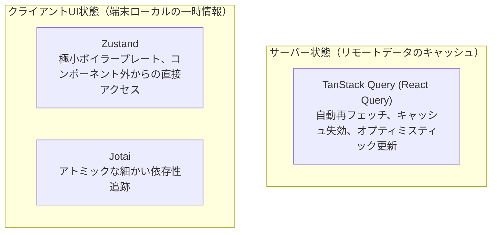

- **サーバー状態管理（TanStack Query）**:
  ユーザーデータ、商品リスト、タイムライン投稿などは、ネットワーク越しに取得される非同期キャッシュです。ローディング状態、エラーリトライ、バックグラウンド更新、無限スクロールのページネーションは、TanStack Queryのカスタムフックに完全に委ねます。
- **クライアント状態管理（Zustand）**:
  テーマ選択、カートに入れたローカルアイテム、認証トークンなどは、軽量かつ型安全なZustandストアで保持します。ReactのContext APIのような不要な広域再レンダリングの連鎖を引き起こさず、必要なコンポーネントのみがセレクター経由でピンポイントに購読します。

---

## 第6章：ネイティブ機能連携・センサー・ハードウェアアクセス

### 6.1 デバイスハードウェアAPIの現代的統合
モバイルアプリがWebアプリに対して圧倒的なアドバンテージを持つ領域が、端末ハードウェアへの深い統合です。Expo SDKは、主要なOS機能を完全に型安全なモジュール群として提供しています：

- **カメラ＆バーコードスキャン (`expo-camera`)**:
  カメラセンサーからの高速フレーム処理をネイティブC++レイヤーで実行し、QRコードやバーコードをリアルタイム解析。
- **位置情報 (`expo-location`)**:
  バックグラウンドジオフェンシング、高精度GPSトラッキング、コンパスヘディング方位検知。
- **生体認証 (`expo-local-authentication`)**:
  iOSのFaceID / TouchID、AndroidのBiometricPrompt APIを抽象化し、銀行系アプリに耐えうる暗号強度で認証をトリガー。
- **プッシュ通知 (`expo-notifications`)**:
  Apple Push Notification service (APNs) と Firebase Cloud Messaging (FCM) のトークン管理、フォアグラウンド表示、アクションボタン付きリッチ通知を一元管理。

### 6.2 ローカルストレージ工学：AsyncStorageの限界とMMKVの圧倒的性能
長年、React Nativeの標準的なキーバリューストレージとして利用されてきた `@react-native-async-storage/async-storage` には、根本的な設計上のボトルネックがありました。

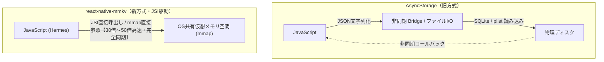

Tencent（WeChat開発元）が開発したC++ライブラリをMarc Rousavy氏がJSIバインディングした **「react-native-mmkv」** は、ストレージ工学に革命をもたらしました：
1. **`mmap`（メモリマップドファイル）による物理I/Oの排除**:
   ファイルをOSの仮想メモリ空間に直接マッピングするため、明示的なディスクread/writeシステムコールを介さず、メモリのポインタ操作と同じ速度で読み書きが行われます。
2. **完全同期API**:
   `await` を使わずに同期的にデータを取得できるため、コンポーネントの初回マウント時にローディングスピナーを挟むことなく、即座にテーマ設定や認証トークンを読み出して初期レンダリングできます。
3. **ベンチマーク性能**:
 読み書き速度はAsyncStorage比で **約30倍〜50倍高速** であり、数千件のアイテムのキャッシュであってもUIフレームを1フレームたりとも落とさずに処理できます。

```tsx
// react-native-mmkv による同期・超高速ストレージ操作の実装
import { MMKV } from 'react-native-mmkv';

export const storage = new MMKV({
  id: 'user-cache-storage',
  encryptionKey: 'super-secure-aes-encryption-key', // ハードウェア暗号化
});

export const UserSessionManager = {
  saveToken: (token: string) => {
    storage.set('auth_token', token); // 同期的に即座に保存
  },
  getToken: (): string | undefined => {
    return storage.getString('auth_token'); // 非同期await不要で同期取得
  },
  clearSession: () => {
    storage.delete('auth_token');
  },
};
```

### 6.3 カスタムネイティブモジュールの開発（TurboModule実装例）
サードパーティのSDKが存在しない独自ハードウェアや、OSの最新APIを叩く必要がある場合、新アーキテクチャのTurboModuleを自作します。

#### ステップ1：TypeScriptによるCodeGen仕様定義
```typescript
// specs/NativeCryptoCalculator.ts
import type { TurboModule } from 'react-native';
import { TurboModuleRegistry } from 'react-native';

export interface Spec extends TurboModule {
  // 高速な暗号ハッシュ計算（同期メソッド）
  computeSha256Sync(input: string): string;
  // 非同期のハードウェアシークレット生成
  generateSecureKey(bits: number): Promise<string>;
}

export default TurboModuleRegistry.getEnforcing<Spec>('NativeCryptoCalculator');
```

#### ステップ2：iOS側でのC++ / Objective-C++ 実装
CodeGenによって生成されたC++インターフェースを実装します。JSIを通じて引数が直接渡されるため、JSON変換は一切発生しません。

```objc
// ios/NativeCryptoCalculator.mm
#import "NativeCryptoCalculator.h"
#import <CommonCrypto/CommonDigest.h>

@implementation NativeCryptoCalculator
RCT_EXPORT_MODULE()

- (std::shared_ptr<facebook::react::TurboModule>)getTurboModule:
    (const facebook::react::ObjCTurboModule::InitParams &)params {
  return std::make_shared<facebook::react::NativeCryptoCalculatorSpecJSI>(params);
}

// 同期メソッドの実装
- (NSString *)computeSha256Sync:(NSString *)input {
  const char *str = [input UTF8String];
  unsigned char result[CC_SHA256_DIGEST_LENGTH];
  CC_SHA256(str, (CC_LONG)strlen(str), result);
  
  NSMutableString *hash = [NSMutableString stringWithCapacity:CC_SHA256_DIGEST_LENGTH * 2];
  for (int i = 0; i < CC_SHA256_DIGEST_LENGTH; i++) {
    [hash appendFormat:@"%02x", result[i]];
  }
  return hash;
}

// 非同期メソッドの実装
RCT_EXPORT_METHOD(generateSecureKey:(double)bits
                  resolve:(RCTPromiseResolveBlock)resolve
                  reject:(RCTPromiseRejectBlock)reject) {
  // バックグラウンドキューで鍵生成を実行
  dispatch_async(dispatch_get_global_queue(DISPATCH_QUEUE_PRIORITY_DEFAULT, 0), ^{
    NSString *dummyKey = [[NSUUID UUID] UUIDString];
    resolve(dummyKey);
  });
}

@end
```

---

## 第7章：極限のパフォーマンス最適化とプロファイリング技術

### 7.1 スレッド分離の原則とUIスレッドの飽和
モバイルアプリの体感速度を決定づける最重要指標は、フレームレート（fps）の安定性です。画面更新の周波数が60Hzであれば **16.6ms** 、120Hzであれば **8.3ms** のフレームバジェット内にすべての描画処理を完結させる必要があります。

React Nativeには、独立して稼働する2大スレッドが存在します：
- **JavaScriptスレッド（Hermes）**: Reactの再レンダリング計算、Hooks、ネットワーク通信、ビジネスロジックの実行。
- **UIスレッド（メインスレッド）**: ユーザーのタッチイベントの受付、ネイティブViewの描画、GPUコマンドの発行。

旧来の設計では、アニメーションの毎フレーム計算をJavaScriptスレッドで行っていたため、JSスレッドが重いAPI通信のJSONパースなどで専有されると、アニメーションがコマ落ち（スタッター）を起こしていました。

### 7.2 宣言的アニメーション革命：React Native Reanimated 3
このスレッド間の障壁を打ち破ったのが、Software Mansionが開発した **「React Native Reanimated」** です。

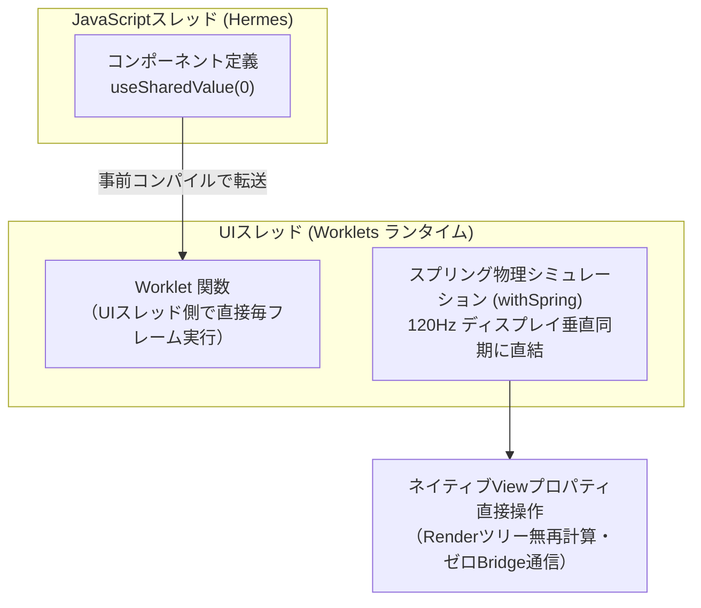

#### 「Worklets」の力学
Reanimatedの中核技術は **「Worklets（ワークレット）」** と呼ばれる極小のJavaScript関数です。Babel/SWCプラグインが関数の先頭の `'worklet';` 指示子を検知すると、その関数をUIスレッド専用に生成された軽量な別個のJSコンテキストへと配置します。

アニメーションの補間やスプリング物理演算（`withSpring`, `withTiming`）はすべてUIスレッド上で自律的に完結し、JavaScriptスレッドが完全にフリーズしている状態であっても、画面上のカードは完全に滑らかな120fpsで指に吸い付くように追従します。

```tsx
// Reanimated 3 と Gesture Handler による極限の慣性ドラッグUI
import React from 'react';
import { StyleSheet, View } from 'react-native';
import { GestureDetector, Gesture } from 'react-native-gesture-handler';
import Animated, {
  useSharedValue,
  useAnimatedStyle,
  withSpring,
} from 'react-native-reanimated';

export const InteractivePhysicsCard: React.FC = () => {
  const translateX = useSharedValue(0);
  const translateY = useSharedValue(0);
  const contextX = useSharedValue(0);
  const contextY = useSharedValue(0);

  // ジェスチャー定義（すべてUIスレッド上でWorkletとして実行）
  const panGesture = Gesture.Pan()
    .onStart(() => {
      'worklet';
      contextX.value = translateX.value;
      contextY.value = translateY.value;
    })
    .onUpdate((event) => {
      'worklet';
      translateX.value = contextX.value + event.translationX;
      translateY.value = contextY.value + event.translationY;
    })
    .onEnd(() => {
      'worklet';
      // 指を離した瞬間にスプリング物理演算で原点復帰
      translateX.value = withSpring(0, { damping: 12, stiffness: 90 });
      translateY.value = withSpring(0, { damping: 12, stiffness: 90 });
    });

  const animatedStyle = useAnimatedStyle(() => {
    'worklet';
    return {
      transform: [
        { translateX: translateX.value },
        { translateY: translateY.value },
        { scale: withSpring(translateX.value !== 0 ? 1.05 : 1) },
      ],
    };
  });

  return (
    <View style={styles.canvas}>
      <GestureDetector gesture={panGesture}>
        <Animated.View style={[styles.card, animatedStyle]} />
      </GestureDetector>
    </View>
  );
};

const styles = StyleSheet.create({
  canvas: { flex: 1, justifyContent: 'center', alignItems: 'center' },
  card: {
    width: 160,
    height: 160,
    backgroundColor: '#0066cc',
    borderRadius: 24,
    shadowColor: '#0066cc',
    shadowOffset: { width: 0, height: 10 },
    shadowOpacity: 0.3,
    shadowRadius: 20,
    elevation: 8,
  },
});
```

### 7.3 高度な画像パイプライン：`expo-image`
モバイルアプリのメモリ肥大化の最大の原因は「画像」です。未圧縮の4K画像を数十枚メモリに展開しただけで、iOSのジェットサム（Jetsam）メモリキラーが発動してアプリが強制終了します。

次世代コンポーネント **`expo-image`** は、iOSの `SDWebImage` とAndroidの `Glide` という歴戦のネイティブ画像キャッシングエンジンをJSIで直結しています：
- **WebP / AVIF 完全サポート**: JPEG比でデータ量を30%〜50%削減。
- **Blurhash / ThumbHash**: 画像読み込み完了までの間、数バイトの文字列から美しいプレビューぼかしグラデーションを即時レンダリング。
- **自動ダウンサンプリング**: ネイティブImageViewの表示ピクセルサイズに合わせて、デコード時に画像を縮小してVRAMに展開。

### 7.4 プロファイリングツールの実践体系
直感や当てずっぽうの最適化は害悪です。計測に基づく科学的ボトルネック特定が不可欠です。

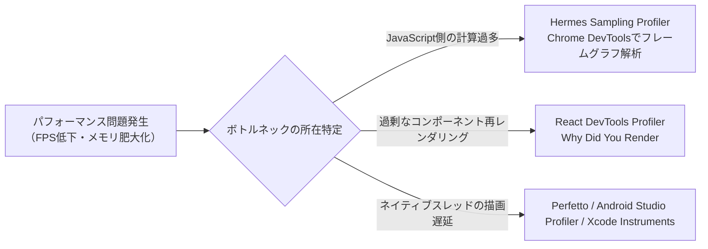

---

## 第8章：テスト戦略、CI/CD、本番リリースと運用保守

### 8.1 モバイルテストピラミッド
モバイルアプリのテストスイートは、実行コストと信頼性のトレードオフを意識して階層化します。

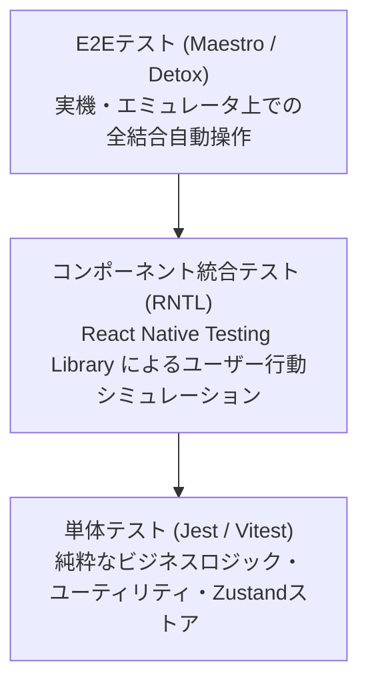

1. **単体テスト（Jest）**:
   Redux/ZustandのReducer、フォーマッター、データ変換ロジックをミリ秒単位で網羅テスト。
2. **コンポーネントテスト（React Native Testing Library: RNTL）**:
   ネイティブ環境をモックしたNode.js環境下でコンポーネントをマウントし、「ボタンを押すとテキストが変化する」といったアクセシビリティクエリに基づく挙動テストを実行。
3. **E2Eテスト（Maestro）**:
   YAMLで直感的にシナリオを記述できる次世代UI自動化フレームワーク「Maestro」を活用し、実機上でログインから決済完了までのクリティカルパスを完全自動検証。

### 8.2 CI/CDパイプライン：FastlaneとGitHub Actions
手動によるローカルXcode/Android Studioからのアプリビルドとストアアップロードは、ヒューマンエラーの温床であり絶対に回避すべきです。

```yaml
# .github/workflows/deploy.yml
name: Production Mobile Release

on:
  push:
    tags:
      - 'v*.*.*'

jobs:
  build-and-deploy:
    runs-on: macos-latest
    steps:
      - name: Checkout Code
        uses: actions/checkout@v4

      - name: Setup Node.js & Bun
        uses: oven-sh/setup-bun@v1
        with:
          bun-version: latest

      - name: Install Dependencies
        run: bun install --frozen-lockfile

      - name: Setup EAS CLI
        run: npm install -g eas-cli

      - name: Execute EAS Cloud Build for iOS and Android
        run: eas build --platform all --profile production --non-interactive
        env:
          EXPO_TOKEN: ${{ secrets.EXPO_TOKEN }}

      - name: Submit to App Store and Google Play
        run: eas submit --platform all --profile production --auto-submit
        env:
          EXPO_TOKEN: ${{ secrets.EXPO_TOKEN }}
```

### 8.3 Over-The-Air（OTA）アップデートと審査ガイドライン
**EAS Update** や **CodePush** を用いると、JavaScriptのバンドルファイルや画像アセットの更新を、ストアの審査を経由せずに直接ユーザー端末へプッシュ配信できます。

#### Apple App Store Review Guidelines（Guideline 2.5.2）への完全準拠
OTAアップデートを運用する際、最も注意すべきはAppleの審査規約です：
> 「アプリは実行可能コードをダウンロードまたはインストールしてはならない。ただし、JavaScriptCoreやWebKitなど、OS付属のインタープリタで実行されるスクリプトコードは例外とする。ただし、 **アプリの主目的や核となる機能を劇的に変更してはならない** 。」

- **許容されるOTA**: バグ修正、UIの細かなスタイル変更、年末年始セールのバナー差し替え、APIエンドポイントのフェイルオーバー切り替え。
- **拒否されるOTA（リジェクト・規約違反対象）**: ショッピングアプリとして公開した後にOTAでカジノゲーム機能を追加する、ネイティブバイナリの追加を伴う変更。

### 8.4 本番運用の可観測性（Observability）
ユーザーの手元で動くモバイルアプリは、千差万別の端末環境（OSバージョン、ストレージ残量、不安定な電波）に晒されます。
- **Sentry for React Native**:
  ネイティブ層（C++/Swift/Kotlin）のシグナルクラッシュと、JavaScript層の未捕捉例外を単一のトレースとして統合。Hermesのソースマップを自動逆変換して正確なスタックトレースを可視化。
- **Datadog / Firebase Performance Monitoring**:
  画面遷移のレイテンシ（TTID: Time to Initial Display）、APIコールの失敗率、オフライン時のキャッシュヒット率をリアルタイムモニタリング。

---

## 第9章：React Nativeの未来とクロスプラットフォームの地平

### 9.1 React Server Components（RSC）for Native
Webの世界でNext.jsが先鞭をつけた **「React Server Components (RSC)」** は、現在React Nativeコミュニティ（特にExpoチーム）によってネイティブアプリへの本格統合が進められています。

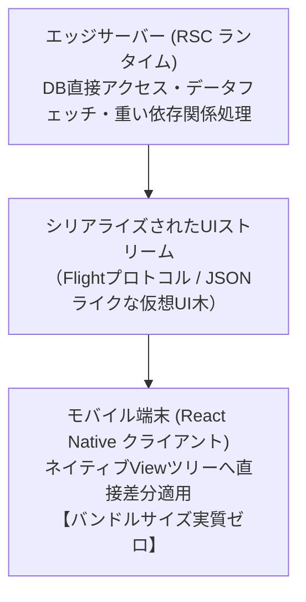

#### ネイティブRSCがもたらす破壊的パラダイム
1. **バンドルサイズの劇的削減**:
   マークダウンパーサーや巨大な日付フォーマッタ、重厚なデータ変換ライブラリをクライアントのモバイルアプリ内にバンドルする必要がなくなります。サーバー側で純粋なUIツリーへと事前レンダリングされ、端末にはその結果のみがストリーミングされます。
2. **ゼロウォーターフォール（Zero Waterfall）データフェッチ**:
   「画面を表示してからAPIを叩いてローディングスピナーを回す」というクライアント主導のウォーターフォールが消滅し、画面の初期表示データが最初から組み込まれた状態でネイティブViewが展開されます。
3. **ストア審査不要の動的コンポーネント更新**:
   サーバー側のReactコンポーネントを変更するだけで、アプリのUI構成やビジネスロジックが即座に最新化されます。

### 9.2 デスクトップ＆空間コンピューティングへの拡張
React Nativeはもはや「スマートフォンのための技術」に留まりません。

- **React Native for Windows / macOS (Microsoft主導)**:
  MicrosoftはOfficeアプリ群（Xboxアプリ、Teamsの一部画面等）においてReact Nativeを大規模に採用しています。C++とWinUI 3 / AppKitを活用し、WebベースのElectronと比較してメモリ消費量が数分の一という圧倒的な軽量性を達成しています。
- **空間コンピューティング（Apple Vision Pro / visionOS）**:
  Callstackチームやコミュニティが推進する `react-native-visionos` により、Reactの宣言的UIを用いてvisionOSの3D空間ウィンドウやボリューム、イマーシブスペースを直接制御する時代が到来しています。

### 9.3 Web統合：React Native for Webとユニバーサルデザイン
Nicolas Gallagher氏（元Twitter/Xエンジニア）によって開発された **「React Native for Web」** は、X（旧Twitter）のWeb版UIを長年支え続けてきた実績を誇ります。

`<View>` を `<div>` に、`<Text>` を `<span>` に、YogaのレイアウトプロパティをブラウザネイティブのCSS Flexboxへ精密に変換します。これにより、iOS、Android、Webブラウザの3大プラットフォームで **90%以上のUIコードを完全共有** する「ユニバーサルアプリケーション」が現実のものとなっています。

---

## 結び：ネイティブの境界線を融解させ、世界へ届けるエンジニアへ

テクノロジーの歴史を振り返ると、それは「分断されていた世界を抽象化によって接続し、解き放つプロセス」の連続でした。かつてOSごとに固有のアセンブリやC言語で書かれていたソフトウェアが、高級言語と標準インターフェースによって汎用化されたように、モバイル開発における「iOS」と「Android」という二項対立の溝もまた、React Nativeという強力な知性の触媒によって融解しつつあります。

新アーキテクチャの完成によって、かつて「クロスプラットフォームの代償」と囁かれたパフォーマンスのボトルネック、同期呼出しの壁、メモリフットプリントの肥大化は過去のものとなりました。C++の超高速な直接性、ネイティブOSの豊かなグラフィック性能、そしてTypeScriptとReactがもたらす洗練された表現力――それらは今、JSIとFabricというエレガントな工学的基盤の上で完全な調和を奏でています。

卓越したモバイルエンジニアとは、単に1つのプラットフォームの文法に固執する者ではありません。根底にあるハードウェアの制約、スレッドの力学、そしてユーザーの指先に宿る官能的な触覚フィードバックの機微を深く理解し、最も美しく無駄のないアーキテクチャを選択できる者です。

「Learn once, write anywhere」――この言葉が約束した自由な創造の海原は、今やデスクトップから空間コンピューティング、エッジサーバーへと無限に広がっています。この技術白書を手にしたあなたが、プラットフォームの壁を軽やかに飛び越え、世界中のユーザーを熱狂させる至高のプロダクトを創り上げることを心より確信しています。
