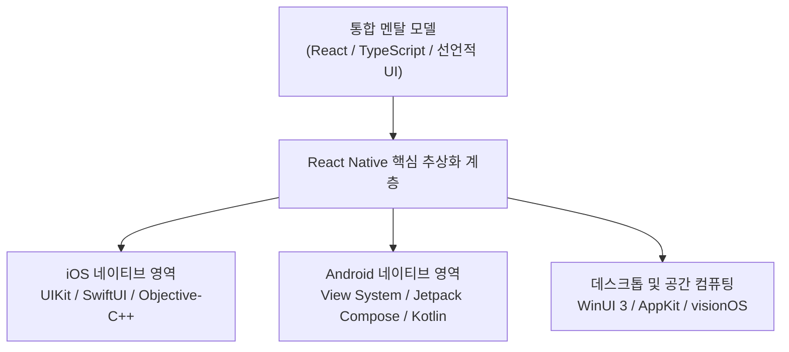
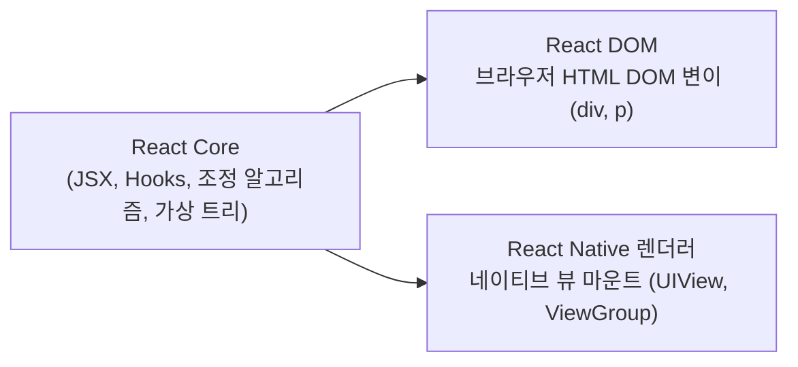
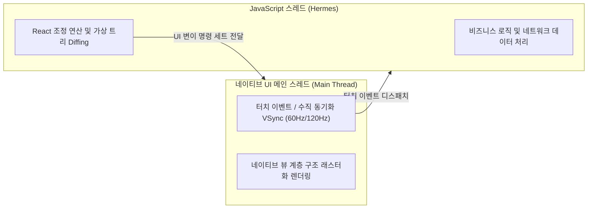
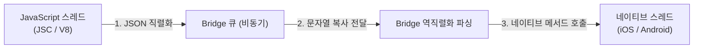
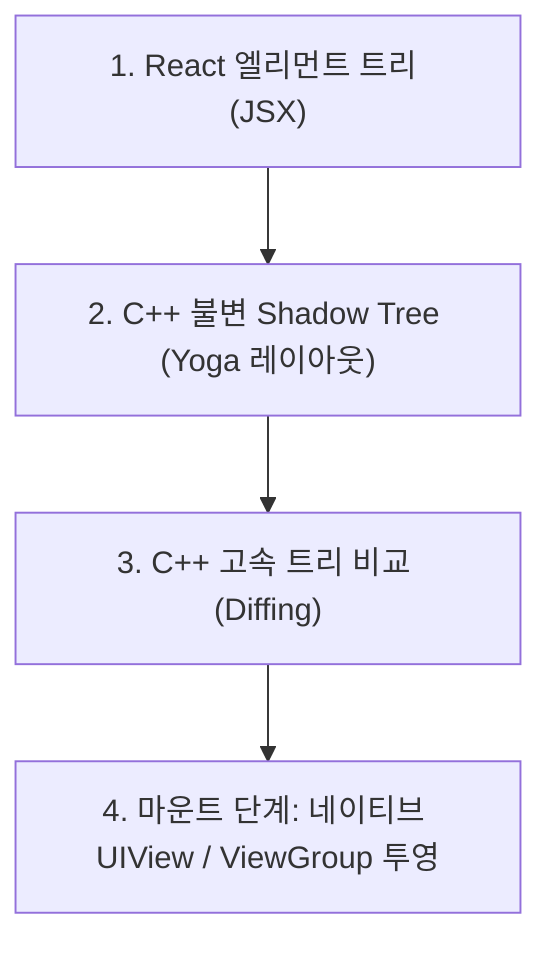
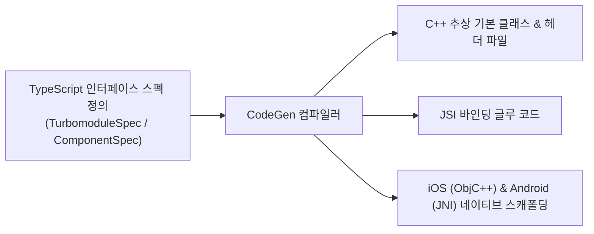
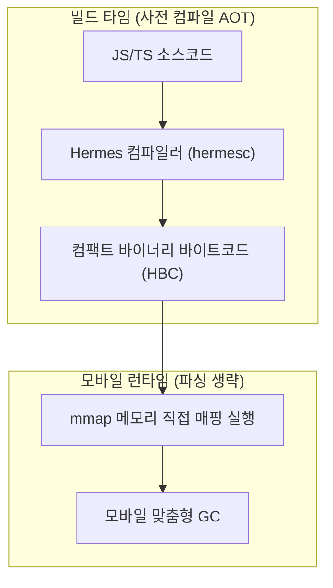
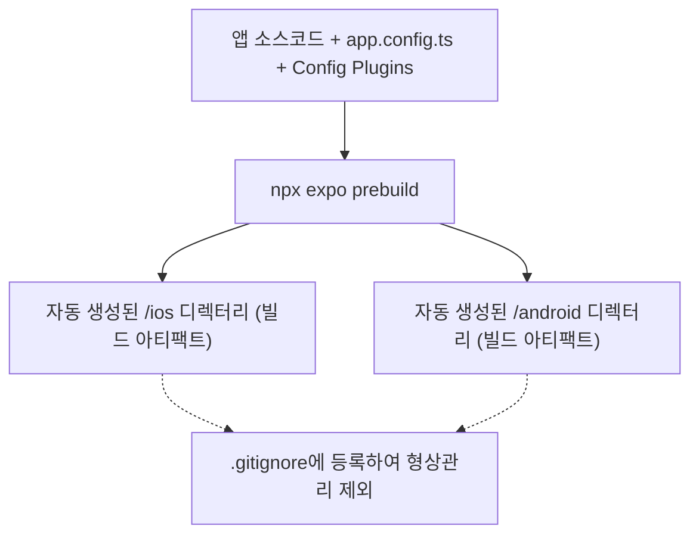
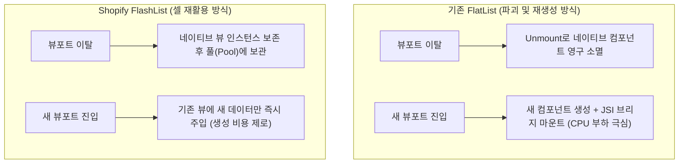
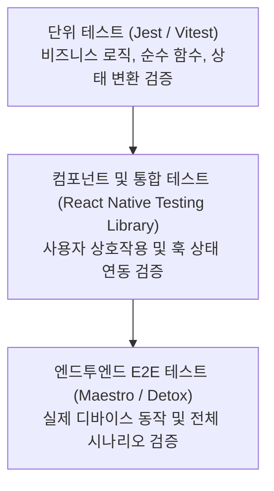

## 서론: 모바일 개발 패러다임의 대전환과 React Native의 존재 의의

### "Learn Once, Write Anywhere"의 진정한 의미
2015년 Meta(구 Facebook)가 오픈소스로 공개한 **React Native** 는 모바일 애플리케이션 개발 환경을 근본적으로 뒤흔들었습니다. Sun Microsystems의 고전적인 표어인 "Write once, run anywhere(한 번 작성해 어디서나 실행)"와 달리, React Native는 독자적인 철학인 **"Learn once, write anywhere(한 번 배워 어디서나 작성)"** 를 천명했습니다.

이 철학은 여러 플랫폼에 걸쳐 타협된 '최소 공배수'의 가상 UI를 강제하지 않습니다. 대신 개발자가 React의 강력한 선언적 멘탈 모델—컴포넌트 중심 아키텍처, 단방향 데이터 흐름, 함수형 상태 관리—을 습득하면, 이를 통해 iOS, Android, macOS, Windows 등 각 운영체제가 제공하는 가장 순수하고 깊이 있는 네이티브 UI 프리미티브를 직접 제어하고 조율할 수 있도록 만듭니다.



### 웹 엔지니어가 모바일 엔지니어링에 진입한 역사적 필연성
2010년대 초 모바일 소프트웨어 공학은 iOS(Objective-C/Swift)와 Android(Java/Kotlin)라는 고립된 전문 영역에 갇혀 있었습니다. 동일한 비즈니스 기능을 구현하기 위해 기업은 독립된 개발 팀을 중복 운영하고, 별개의 코드베이스를 유지보수하며, 완전히 다른 툴체인과 비동기식 배포 일정으로 인한 막대한 비용을 감당해야 했습니다.

압도적인 생산성을 지닌 JavaScript/TypeScript 생태계와 React의 선언적 개발 경험을 모바일 환경으로 이식한 것은 피할 수 없는 기술적 진화였습니다. 웹의 독보적인 반복 속도(Fast Refresh 초고속 핫 리로딩)와 네이티브 플랫폼 컴포넌트의 유려한 물리 터치 반응을 단일 언어 기반 위에서 융합함으로써, React Native는 웹과 모바일 엔지니어링 사이의 견고한 장벽을 완전히 허물었습니다.

### 아키텍처 트레이드오프 심층 비교: React Native vs. Flutter vs. 네이티브 vs. PWA
모바일 기술 스택을 선정할 때는 렌더링 파이프라인과 플랫폼 통합도를 면밀히 분석해야 합니다:

| 평가 축 | React Native (신규 아키텍처) | Flutter | 순수 네이티브 (Swift / Kotlin) | Web / PWA (Capacitor / Cordova) |
| :--- | :--- | :--- | :--- | :--- |
| **렌더링 파이프라인** | **호스트 OS 네이티브 UI 프리미티브** (`UIView`, `android.view.View`) | 자체 그래픽 캔버스 (Impeller / Skia) 위 커스텀 위젯 직접 렌더링 | **호스트 OS 네이티브 UI 프리미티브** 직접 제어 | WebView 내부 DOM 렌더링 |
| **플랫폼 충실도** | **최고 수준**: OS 레벨 시스템 애니메이션, 접근성, 타이포그래피 자동 상속 | 위젯 자체 구현: 신규 OS 출시 시 미세한 시각적 지연 발생 가능 | **완전 무결**: 신규 OS 기능 출시 당일 즉각 지원 가능 | 제한적: 네이티브 터치 물리 및 제스처 관성 재현 한계 |
| **개발 언어** | **TypeScript / JavaScript** | Dart | Swift, Kotlin | JavaScript / TypeScript, HTML/CSS |
| **실행 엔진** | **Hermes AOT 엔진** (사전 컴파일 바이트코드) | AOT 컴파일된 Dart 기계어 | LLVM 컴파일 네이티브 기계어 | V8 / JavaScriptCore |
| **코드 재사용률** | 80% 〜 95% (플랫폼 전용 하드웨어 제어 제외) | 90% 〜 98% | 0% (KMP 기반 비즈니스 로직 공유 시 예외) | 95% 〜 100% |
| **네이티브 상호운용성** | **오버헤드 제로 동기 C++ 메모리 직접 접근 (JSI)** | Platform Channels 바이너리 비동기 직렬화 | 오버헤드 제로 | 고지연 비동기 WebView Bridge |
| **생태계 규모** | **세계 최대 npm 레지스트리** + 풍부한 네이티브 모듈 | pub.dev (활발하나 npm 대비 규모 작음) | CocoaPods, SwiftPM, Gradle | npm 웹 생태계 |

---

## 1. React Native의 핵심 설계 철학과 멘탈 모델

### 1.1 React Core로부터의 계승과 분기
React Native를 정확하게 이해하기 위해서는 **React Core** 와 **React DOM** 의 개념적 경계를 명확히 구분해야 합니다. React Core는 상태(State)와 프로퍼티(Props)의 변화에 따라 가상 트리의 차이를 계산하는 추상 조정(Reconciliation) 상태 머신입니다.



웹 개발에서 React의 조정 결과는 브라우저 DOM 노드(`<div>`, `<span>`)의 변경으로 반영됩니다. 반면 React Native에는 브라우저 DOM이 존재하지 않습니다. React Core의 조정 결과는 네이티브 렌더링 트리로 직접 전달됩니다. 따라서 모든 핵심 React 패턴—`useState`, `useReducer`, `useEffect`, `useMemo`, `useCallback` 및 커스텀 훅—은 React Native에서도 완벽히 동일한 동작 의미를 유지합니다.

### 1.2 네이티브 UI 프리미티브 매핑 메커니즘
React Native 애플리케이션은 HTML 태그 대신 플랫폼 독립적인 코어 컴포넌트를 사용합니다:

```tsx
// React Native 핵심 선언적 카운터 컴포넌트
import React, { useState } from 'react';
import { View, Text, StyleSheet, Pressable } from 'react-native';

export const CounterCard: React.FC = () => {
  const [count, setCount] = useState<number>(0);

  return (
    <View style={styles.cardContainer}>
      <Text style={styles.titleText}>반응형 카운터</Text>
      <Text style={styles.counterValue}>{count}</Text>
      <Pressable
        style={({ pressed }) => [
          styles.button,
          pressed && styles.buttonPressed
        ]}
        onPress={() => setCount((prev) => prev + 1)}
      >
        <Text style={styles.buttonLabel}>카운트 증가</Text>
      </Pressable>
    </View>
  );
};

const styles = StyleSheet.create({
  cardContainer: {
    padding: 20,
    backgroundColor: '#ffffff',
    borderRadius: 12,
    shadowColor: '#000',
    shadowOffset: { width: 0, height: 4 },
    shadowOpacity: 0.1,
    shadowRadius: 8,
    elevation: 4, // Android 전용 고도 그림자
  },
  titleText: {
    fontSize: 16,
    fontWeight: '600',
    color: '#333333',
    marginBottom: 8,
  },
  counterValue: {
    fontSize: 32,
    fontWeight: 'bold',
    color: '#0066cc',
    textAlign: 'center',
    marginVertical: 12,
  },
  button: {
    backgroundColor: '#0066cc',
    paddingVertical: 12,
    paddingHorizontal: 24,
    borderRadius: 8,
    alignItems: 'center',
  },
  buttonPressed: {
    opacity: 0.8,
    transform: [{ scale: 0.98 }],
  },
  buttonLabel: {
    color: '#ffffff',
    fontSize: 14,
    fontWeight: 'bold',
  },
});
```

런타임 시 이러한 추상 컴포넌트는 호스트 OS 네이티브 위젯으로 직접 변환됩니다:
- `<View>`는 iOS의 `UIView` 및 Android의 `android.view.ViewGroup`에 매핑됩니다.
- `<Text>`는 iOS의 `NSTextStorage` / `UILabel` 및 Android의 `android.widget.TextView`에 매핑됩니다.
- `<Pressable>`은 네이티브 터치 리스폰더 시스템을 조율하여 리플 효과 및 하이라이트 상태를 완벽히 재현합니다.

### 1.3 스레드 협력 모델: JavaScript 스레드와 네이티브 UI 메인 스레드
모바일 운영체제는 UI 렌더링이 반드시 **메인(UI) 스레드** 에서 단일 스레드로 실행될 것을 요구합니다. 이 스레드가 16.6ms(60Hz) 또는 8.3ms(120Hz ProMotion) 이상 블로킹되면 즉시 프레임 드랍과 화면 끊김이 발생합니다.

JavaScript의 복잡한 연산이 UI 스레드를 방해하지 않도록, React Native는 백그라운드 격리 스레드 구조를 채택했습니다:



이러한 스레드 물리 격리를 통해 JavaScript에서 대규모 데이터를 파싱하는 중에도 네이티브 하드웨어 가속 스크롤과 터치 애니메이션은 완벽한 부드러움을 유지합니다.

---

## 2. 내부 아키텍처 심층 해부: 레거시 Bridge에서 신규 아키텍처(New Architecture)로

### 2.1 레거시 Bridge 아키텍처의 한계점
과거 구형 아키텍처에서는 JavaScript 스레드와 네이티브 스레드가 **"The Bridge(브리지)"** 라는 비동기 배치 채널을 통해 소통했습니다:



구형 Bridge에는 세 가지 치명적인 병목이 존재했습니다:
1. **순수 비동기 통신 오버헤드**: 모든 호출이 비동기로 강제되어 동기식 레이아웃 측정이나 즉각적인 터치 가로채기가 불가능했습니다. 고속 스크롤 시 네이티브 렌더링이 따라가지 못해 화면이 하얗게 비어버리는 현상(White Blank)이 발생했습니다.
2. **JSON 직렬화의 막대한 지연**: 복잡한 객체나 고주파 센서 데이터를 전송할 때마다 JSON 문자열로 변환하고 다시 파싱하느라 CPU 리소스가 낭비되었습니다.
3. **메시지 큐 혼잡 현상**: 단일 큐에 메시지가 밀리면서 높은 우선순위의 제스처 이벤트가 지연 처리되는 문제가 발생했습니다.

### 2.2 신규 아키텍처의 심장: JavaScript Interface (JSI)
현대 React Native는 Bridge를 전면 폐기하고 **JavaScript Interface (JSI)** 를 채택했습니다.

```mermaid
flowchart LR
    JS["JavaScript 런타임<br/>(Hermes)"] <--> -- "JSI: C++ 스마트 포인터 메모리 직접 공유 (제로 카피・동기 직접 호출)" --> NATIVE["C++ 코어 인프라<br/>(Fabric & TurboModules)"]
```

JSI는 특정 JS 엔진에 종속되지 않는 가벼운 C++ 추상 계층입니다. JSI를 통해 JavaScript 객체는 C++ 호스트 객체(`HostObject`)의 메모리 참조를 직접 소유할 수 있습니다. 이는 다음과 같은 혁신을 불러왔습니다:
- **제로 카피 동기 직접 호출**: JavaScript가 일반 함수를 호출하듯 C++ 함수를 즉시 동기식으로 호출할 수 있습니다.
- **JSON 직렬화 제거**: C++ 스마트 포인터를 통해 메모리를 직접 공유하므로 직렬화 과정이 완전히 사라졌습니다.
- **엔진 독립성**: Hermes, V8, JavaScriptCore 등 원하는 자바스크립트 엔진을 언제든 자유롭게 교체할 수 있습니다.

### 2.3 Fabric 렌더러: 불변 Shadow Tree와 동시성 마운트
JSI를 기반으로 구축된 현대식 UI 렌더링 파이프라인이 바로 **Fabric** 입니다:



Fabric의 핵심 강점:
- **C++ 공통 코어 통합**: 레이아웃 연산과 노드 비교가 단일 C++ 엔진에서 수행되어 플랫폼 간 렌더링 오차를 근본적으로 제거합니다.
- **React 18+ 동시성 완벽 지원**: `useTransition`, `Suspense`, 우선순위 인터럽트 처리를 완벽하게 수용합니다.
- **화면 깜빡임 원천 차단**: 동기 마운트를 지원하여 초고속 스크롤 중에도 프레임 누락 없이 픽셀을 일치시킵니다.

### 2.4 TurboModules: 지연 로딩을 통한 메모리 및 기동 최적화
레거시 구조에서는 앱이 기동될 때 등록된 모든 네이티브 모듈을 일괄 초기화해야 했으므로 앱의 콜드 스타트 시간이 길어졌습니다.

**TurboModules** 는 JSI를 활용하여 진정한 **지연 로딩(Lazy Initialization)** 을 달성했습니다. JavaScript 코드가 특정 모듈을 실제로 처음 호출하는 순간에만 C++ / 네이티브 인스턴스가 생성됩니다. 사용되지 않는 모듈은 기동 시점에 CPU와 메모리를 전혀 소모하지 않아 시작 속도가 비약적으로 향상됩니다.

### 2.5 CodeGen: 정적 타입 기반 C++ 바인딩 자동 생성
TypeScript와 C++ / 네이티브 언어 간의 호출 안정성을 보장하기 위해 신규 아키텍처는 **CodeGen** 자동화 도구를 도입했습니다.



개발자가 엄격한 TypeScript 인터페이스를 선언하기만 하면, 빌드 타임에 CodeGen이 타입 변환 및 JSI 보일러플레이트 코드를 완전 자동으로 생성하여 런타임 타입 에러를 완전히 차단합니다.

### 2.6 Hermes 전용 엔진: 바이트코드 사전 컴파일과 고속 콜드 스타트
Meta는 모바일 환경에 최적화된 자바스크립트 엔진인 **Hermes** 를 자체 개발했습니다.



Hermes의 핵심 특장점:
- **AOT 사전 바이트코드 컴파일**: 앱 빌드 시 소스코드가 이미 Hermes 바이트코드(`.hbc`)로 변환되어 있어 디바이스에서 실행 시 파싱(Parse) 단계가 생략됩니다.
- **mmap 직접 메모리 매핑**: 바이트코드를 메모리에 직접 매핑하여 실행하므로 RAM 점유율이 획기적으로 낮아집니다.
- **모바일 맞춤형 GC**: 단편화를 줄이고 모바일 기기의 작은 메모리 대역폭에 최적화된 세대별 가비지 컬렉션을 제공합니다.

---

## 3. 현대적 개발 환경과 프로젝트 아키텍처: 모던 Expo vs. Bare CLI

### 3.1 모던 Expo의 패러다임 전환과 Config Plugins
과거 Expo는 네이티브 코드를 수정할 수 없는 폐쇄적인 샌드박스로 여겨졌습니다. 그러나 현재의 **모던 Expo(Modern Expo)** 는 React Native 공식 팀이 기본으로 권장하는 최고 수준의 엔지니어링 허브로 진화했습니다.

그 핵심에는 **Config Plugins** 가 있습니다. 개발자는 `app.json` 또는 `app.config.ts` 파일에서 JavaScript/TypeScript 코드로 네이티브 설정(`Info.plist`, `AndroidManifest.xml`, Gradle 빌드 스크립트)을 선언적으로 조작할 수 있습니다.

### 3.2 지속적 네이티브 생성(CNG)과 Expo Prebuild
**Continuous Native Generation (CNG)** 은 엔터프라이즈 모바일 개발의 혁신적인 패러다임입니다:



CNG 환경에서 네이티브 디렉터리는 언제든 폐기하고 다시 생성할 수 있는 임시 빌드 결과물에 불과합니다. React Native의 메이저 버전을 업그레이드할 때도 네이티브 파일의 복잡한 수동 충돌 해결 없이 의존성 버전 변경과 `prebuild` 명령 하나로 마이그레이션이 완료됩니다.

### 3.3 커스텀 개발 빌드(Expo Dev Client)와 EAS 클라우드 인프라
**Expo Dev Client** 를 활용하면 임의의 C++, Objective-C, Rust 네이티브 라이브러리가 포함된 맞춤형 개발 런타임을 간편하게 구축할 수 있습니다.

또한 **EAS (Expo Application Services)** 클라우드 파이프라인을 연동하면 로컬 머신에 무거운 Xcode나 Android Studio 빌드 클러스터를 유지할 필요 없이 클라우드 환경에서 완전 자동화된 스토어 바이너리 빌드 및 서명이 가능합니다.

---

## 4. 코어 컴포넌트와 레이아웃 엔지니어링: Yoga 엔진

### 4.1 핵심 컴포넌트 계층 구조
React Native는 플랫폼 간 일관된 뷰 구조를 제공하기 위해 풍부한 코어 컴포넌트 세트를 갖추고 있습니다:

| 코어 컴포넌트 | iOS 대응 구현 | Android 대응 구현 | 주요 역할 및 특징 |
| :--- | :--- | :--- | :--- |
| `<View>` | `UIView` | `ViewGroup` / `FrameLayout` | 기본 컨테이너, 박스 모델, Flexbox 레이아웃 배치 |
| `<Text>` | `NSTextStorage` / `UILabel` | `TextView` | 복합 텍스트 타이포그래피, 인라인 중첩 스타일링 |
| `<Image>` / `<ImageBackground>` | `UIImageView` | `ImageView` | 기본 이미지 리소스 렌더링 (프로덕션에서는 `expo-image` 권장) |
| `<ScrollView>` | `UIScrollView` | `ScrollView` / `HorizontalScrollView` | 가변 콘텐츠 스크롤, 바운스 및 물리적 모멘텀 스크롤 제공 |
| `<TextInput>` | `UITextField` / `UITextView` | `EditText` | 키보드 연동 텍스트 입력, 자동 포커스 및 마스크 제어 |
| `<Pressable>` | 터치 제스처 리스폰더 | `RippleDrawable` / 네이티브 터치 응답 | 최신 선언적 터치 피드백 인터랙션 원자 컴포넌트 |

### 4.2 C++ 레이아웃 엔진: Yoga의 작동 원리와 웹 Flexbox와의 차이점
React Native는 웹 브라우저의 렌더링 엔진을 사용하지 않고, C++로 작성된 오픈소스 크로스 플랫폼 레이아웃 엔진인 **Yoga** 를 사용합니다.

Yoga의 주요 모바일 특화 성질:
1. **기본 주축 방향이 세로(Column)**: 모바일 뷰포트 특성에 맞추어 `flexDirection: 'column'`이 기본값입니다(웹은 `'row'`).
2. **단위 없는 논리 포인트(Points / dp)**: 스타일 수치에 `px`이나 `rem` 단위를 사용하지 않으며, 디바이스의 `PixelRatio`에 따라 물리 픽셀로 자동 변환됩니다.

### 4.3 고성능 가상화 목록: FlatList vs. Shopify FlashList
대량의 데이터를 표시할 때 목록 성능은 앱의 반응성을 결정짓는 핵심 지표입니다. **Shopify FlashList** 는 전통적인 `FlatList`의 메모리 파괴 방식을 근본적으로 개선했습니다:



FlashList는 셀 재활용(Cell Recycling)을 통해 60fps/120fps의 고주사율 스크롤을 안정적으로 유지하며 메모리 사용량을 60% 이상 절감합니다.

### 4.4 현대적 스타일링 시스템과 디자인 시스템 구축
- **StyleSheet.create**: 스타일 객체를 평탄화하고 고유 정수 ID로 관리하여 런타임 탐색 비용을 최소화합니다.
- **NativeWind (Tailwind CSS for React Native)**: 빌드 타임에 Tailwind 유틸리티 클래스를 최적화된 `StyleSheet` 객체로 변환하여 런타임 오버헤드 없이 강력한 스타일링 편의성을 제공합니다.

---

## 5. 내비게이션 아키텍처와 전역 상태 관리 모범 사례

### 5.1 모바일 내비게이션의 본질적 복잡성
모바일 내비게이션은 웹의 URL 이동보다 훨씬 복잡합니다. 화면 간 스택 중첩(Stack), 드로어(Drawer), 하단 탭(Bottom Tabs), 모달(Modal) 전환이 중첩되며, 물리적 뒤로가기 버튼과 스와이프 제스처가 정교하게 조율되어야 합니다.

### 5.2 React Navigation과 React Native Screens의 결합
모던 아키텍처에서는 **React Navigation** 이 상위 라우팅 로직을 조율하고, 실제 뷰 계층 관리는 **react-native-screens** 가 OS 네이티브 뷰 컨트롤러에 위임합니다:
- iOS: `UINavigationController` 및 `UITabBarController` 매핑.
- Android: `androidx.fragment.app.Fragment` 매핑.
이를 통해 백스택에 가려진 비활성 화면은 메모리 렌더링을 일시 중단하여 시스템 자원을 극적으로 절약합니다.

### 5.3 파일 기반 라우팅의 혁신: Expo Router
**Expo Router** 는 Next.js의 파일 기반 라우팅을 모바일 환경에 이식하여, 딥링킹(Deep Linking)과 화면 구조를 디렉터리 기반으로 직관적으로 관리할 수 있도록 해줍니다.

```
app/
├── _layout.tsx         # 전역 스택 / 탭 레이아웃
├── index.tsx           # 홈 화면 경로 (/)
├── profile.tsx         # 사용자 프로필 경로 (/profile)
└── feed/
    ├── _layout.tsx     # 피드 중첩 라우트
    └── [id].tsx        # 동적 파라미터 상세 화면 (/feed/123)
```

### 5.4 모던 상태 관리 전략: 서버 캐시와 클라이언트 상태의 분리
최신 아키텍처는 전역 상태를 명확히 이원화합니다:
- **서버 상태(Server Cache)**: 백그라운드 재동기화, 네트워크 복구, 낙관적 업데이트(Optimistic UI)를 전담하는 **TanStack Query (React Query)** 활용.
- **클라이언트 상태(Client State)**: 보일러플레이트가 없고 가벼운 **Zustand** 를 도입하여 Context API의 불필요한 전체 리렌더링을 방지.

---

## 6. 네이티브 하드웨어 연동 및 커스텀 TurboModules 개발 실전

### 6.1 Expo SDK의 현대적 하드웨어 API
현대 Expo SDK는 플랫폼 전반에 걸쳐 철저히 검증된 고성능 하드웨어 모듈을 제공합니다:
- **expo-camera**: 카메라 미리보기, 바코드 스캔, 고화질 사진 및 영상 캡처.
- **expo-location**: 지오펜싱, 백그라운드 GPS 추적.
- **expo-sensors**: 가속도계, 자이로스코프, 만보기 등 고주파 센서 데이터 수집.

### 6.2 현대적 로컬 저장소 엔지니어링: AsyncStorage vs. MMKV
모바일 디바이스에서 로컬 Key-Value 스토리지는 매우 빈번하게 접근됩니다. 텐센트 WeChat 팀이 개발하고 커뮤니티가 최적화한 **react-native-mmkv** 는 기존의 성능 병목을 완전히 해결했습니다:

```mermaid
flowchart TD
    subgraph ASYNC["기존 AsyncStorage"]
        JS1["JavaScript"] -- "JSON 직렬화" --> BR["비동기 Bridge / 파일 I/O"]
        BR -- "SQLite / 디스크 파일 쓰기" --> DISK1["물리 플래시 메모리"]
    end
    subgraph MMKV_BOX["현대 react-native-mmkv (JSI 직결)"]
        JS2["JavaScript (Hermes)"] <--> -- "JSI 직접 호출 / mmap 메모리 매핑 (30배〜50배 고속・완전 동기)" --> RAM["가상 메모리 공간 (mmap)"]
    end
```

`mmap`(메모리 맵 파일)을 사용하여 디스크 I/O 대기 없이 메모리 포인터에 직접 쓰기를 수행하므로 비동기 지연으로 인한 앱 기동 시 깜빡임 현상을 원천 방지합니다.

### 6.3 커스텀 TurboModules 구현 실전 (TypeScript에서 Objective-C++까지)

#### 단계 1: TypeScript CodeGen 스펙 정의
`specs/NativeCryptoCalculator.ts`:

```typescript
import { TurboModule, TurboModuleRegistry } from 'react-native';

export interface Spec extends TurboModule {
  // 동기식 고속 SHA-256 해시 연산
  calculateSha256(input: string): string;
  // 비동기 디바이스 고유 식별자 조회
  getSecureDeviceId(): Promise<string>;
}

export default TurboModuleRegistry.getEnforcing<Spec>('NativeCryptoCalculator');
```

#### 단계 2: iOS Objective-C++ 고성능 구현체 작성
`ios/NativeCryptoCalculator.mm`:

```objective-c
#import "NativeCryptoCalculator.h"
#import <CommonCrypto/CommonDigest.h>

@implementation NativeCryptoCalculator

RCT_EXPORT_MODULE()

- (std::shared_ptr<facebook::react::TurboModule>)getTurboModule:
    (const facebook::react::ObjCTurboModule::InitParams &)params {
  return std::make_shared<facebook::react::NativeCryptoCalculatorSpecJSI>(params);
}

// 동기식 호출 메서드 구현
- (NSString *)calculateSha256:(NSString *)input {
  const char *str = [input UTF8String];
  unsigned char result[CC_SHA256_DIGEST_LENGTH];
  CC_SHA256(str, (CC_LONG)strlen(str), result);

  NSMutableString *hash = [NSMutableString stringWithCapacity:CC_SHA256_DIGEST_LENGTH * 2];
  for (int i = 0; i < CC_SHA256_DIGEST_LENGTH; i++) {
    [hash appendFormat:@"%02x", result[i]];
  }
  return hash;
}

// 비동기 Promise 메서드 구현
- (void)getSecureDeviceId:(RCTPromiseResolveBlock)resolve
                   reject:(RCTPromiseRejectBlock)reject {
  NSString *vendorId = [[[UIDevice currentDevice] identifierForVendor] UUIDString];
  if (vendorId) {
    resolve(vendorId);
  } else {
    reject(@"E_DEVICE_ID", @"Failed to retrieve hardware vendor UUID", nil);
  }
}

@end
```

이 구조를 통해 연산 집약적인 로직은 네이티브 C 레벨에서 전광석화처럼 실행되고, JSI를 통해 JavaScript에 지연 없이 동기적으로 전달됩니다.

---

## 7. 극한의 성능 최적화와 과학적 프로파일링 방법론

### 7.1 스레드 스케줄링과 16.6ms 프레임 예산 관리
60Hz 디스플레이는 매 프레임당 **16.6ms**, 120Hz 디스플레이는 **8.3ms** 이내에 렌더링을 끝내야 합니다. 성능 튜닝 시에는 문제의 원인 스레드를 정확히 분별해야 합니다:
- **UI 스레드 병목**: 과도한 뷰 계층 깊이, 반투명 레이어 중첩(Overdraw), 메인 스레드에서의 대용량 이미지 디코딩으로 발생.
- **JS 스레드 병목**: 메인 루프에서의 복잡한 데이터 변환, 비효율적인 반복문, 디바운스 없는 고주파 이벤트 디스패치로 발생.

### 7.2 선언적 애니메이션 혁신: Reanimated 3 Worklets
JavaScript 스레드에서 구동되던 과거의 애니메이션은 JS 부하 발생 시 심각한 프레임 드랍을 겪었습니다. **React Native Reanimated 3** 는 **Worklets** 구조로 이 문제를 완전히 해결했습니다:


Worklets는 JavaScript 문법으로 작성되지만, 런타임에는 네이티브 UI 스레드 상에서 직접 실행됩니다. 따라서 JS 스레드가 멈추더라도 제스처 인터랙션과 스프링 애니메이션은 완벽한 60fps/120fps를 유지합니다.

### 7.3 고성능 미디어 파이프라인: `expo-image`
모바일 앱 메모리 고갈(OOM)의 가장 큰 원인은 이미지 처리 부실입니다. `expo-image`는 iOS의 **SDWebImage** 및 Android의 **Glide** 를 코어로 내장하고 있습니다:
- **최신 이미지 포맷 지원**: WebP 및 AVIF를 네이티브 하드웨어로 디코딩하여 전송량 70% 절감.
- **BlurHash 지원**: 네트워크 다운로드 중 부드러운 그러데이션 블러 플레이스홀더 제공.
- **자동 다운샘플링**: 원본 크기 대신 화면 렌더링 픽셀 크기에 맞춰 메모리에 로드하여 OOM 크래시 방지.

### 7.4 과학적 프로파일링 워크플로
1. **React DevTools Profiler**: 불필요한 컴포넌트 리렌더링과 렌더링 소요 시간 정밀 계측.
2. **Flipper / React Native DevTools**: 네트워크 트래픽 실시간 모니터링, Hermes 메모리 힙 스냅샷 분석.
3. **Instruments (iOS) & Android Studio Profiler**: CPU 코어 점유율, 메모리 누수(Leaks), GPU 오버드로우 심층 추적.

---

## 8. 포괄적 테스트 전략, 현대적 CI/CD 및 프로덕션 운영

### 8.1 모바일 테스트 피라미드 구축
견고한 애플리케이션 운영을 위해 계층적 테스트 체계를 구축해야 합니다:



- **단위 테스트**: 비즈니스 로직, Zustand 스토어 리듀서, 데이터 변환 함수 검증.
- **컴포넌트 테스트**: **React Native Testing Library (RNTL)** 를 사용하여 구현 세부사항에 의존하지 않는 사용자 관점 상호작용 검증.
- **E2E 테스트**: 모바일 전용의 직관적이고 안정적인 **Maestro** 를 도입하여 실제 디바이스 플로우 자동화.

### 8.2 엔터프라이즈 CI/CD 파이프라인
GitHub Actions 기반의 프로덕션 배포 파이프라인 예시:

```yaml
name: Mobile Production CI/CD Pipeline

on:
  push:
    branches: [main]

jobs:
  quality-gate:
    name: Code Quality & Security Audit
    runs-on: ubuntu-latest
    steps:
      - uses: actions/checkout@v4
      - uses: actions/setup-node@v4
        with:
          node-version: 20
          cache: 'yarn'
      - name: Install Dependencies
        run: yarn install --frozen-lockfile
      - name: TypeScript Type Check
        run: yarn tsc --noEmit
      - name: Lint Validation
        run: yarn eslint . --max-warnings 0
      - name: Execute Unit Test Suite
        run: yarn test --coverage --maxWorkers=2

  build-and-deploy:
    name: EAS Cloud Production Distribution
    needs: quality-gate
    runs-on: ubuntu-latest
    steps:
      - uses: actions/checkout@v4
      - uses: expo/expo-github-action@v8
        with:
          eas-version: latest
          token: ${{ secrets.EXPO_TOKEN }}
      - name: Build and Distribute via EAS
        run: |
          npx eas-cli build --platform all --profile production --non-interactive
          npx eas-cli submit --platform all --profile production --non-interactive
```

### 8.3 무중단 배포(OTA Updates)와 앱 스토어 심사 정책 준수
**Over-The-Air (OTA) Updates**(예: EAS Update)를 활용하면 스토어의 긴 심사 대기 없이 자바스크립트 번들과 정적 자산을 유저에게 즉시 배포할 수 있습니다.

**스토어 심사 규정 핵심 원칙**:
- Apple App Store 심사 가이드라인 3.3.2항 및 Google Play 정책 철저 준수.
- **OTA를 통해 앱의 핵심 비즈니스 성격이나 주요 기능을 임의로 변경하는 행위 금지**.
- **미승인된 네이티브 바이너리 코드(C++ / Swift / Kotlin 등)를 런타임에 동적으로 주입하는 행위 절대 금지**.

### 8.4 프로덕션 옵저버빌리티(Observability) 구축
실제 프로덕션 환경에서는 **Sentry for React Native** 와 같은 모니터링 도구를 필수적으로 연동해야 합니다. 빌드 파이프라인에서 Hermes 바이트코드 소스맵과 iOS dSYM, Android ProGuard 매핑 파일을 자동으로 업로드하여, 프로덕션 크래시 발생 시 난독화된 스택 트레이스를 TypeScript 원본 코드 라인 단위로 즉시 추적할 수 있도록 구축해야 합니다.

---

## 9. React Native의 미래: 유니버설 애플리케이션과 공간 컴퓨팅

### 9.1 React Server Components (RSC)의 모바일 진출
React 19의 등장과 함께 **React Server Components (RSC)** 가 네이티브 모바일 영역으로 확장되고 있습니다. 컴포넌트 렌더링 로직을 서버 엣지에서 선행 처리하고 경량 JSON 스트림 형태로 클라이언트에 전달함으로써, 모바일 앱의 번들 크기를 제로에 가깝게 줄이면서 동적인 네이티브 화면을 구성하는 미래가 열리고 있습니다.

### 9.2 데스크톱 확장과 공간 컴퓨팅 (Apple Vision Pro)
- **React Native for Windows / macOS**: Microsoft가 핵심 기술로 강력히 지원하며 Xbox 앱, Office, Microsoft Teams 데스크톱 클라이언트에 전면 적용되어 있습니다.
- **visionOS 공간 컴퓨팅**: 오픈소스 커뮤니티를 중심으로 Apple Vision Pro 지원이 가속화되어, 선언적 UI로 3차원 공간 윈도우와 제스처를 다루는 연구가 활발히 진행 중입니다.

### 9.3 웹 융합: React Native for Web과 크로스 플랫폼 대통합
**React Native for Web** 을 통해 단일 컴포넌트 코드베이스를 웹 브라우저 DOM으로 완벽하게 컴파일할 수 있습니다. 모바일(iOS/Android), 데스크톱, 웹, 그리고 공간 컴퓨팅에 이르기까지 **모든 플랫폼을 단일 멘탈 모델로 아우르는 대통합의 시대** 가 현실이 되었습니다.

---

## 결론: 플랫폼 경계를 초월하는 엔지니어링 패러다임의 진화

React Native의 역사는 '개발 생산성과 네이티브 품질'이라는 해묵은 이율배반에 맞서 끊임없이 한계를 돌파해 온 소프트웨어 공학의 위대한 여정입니다. 비동기식 브리지의 타협에서 출발하여, 메모리 장벽을 직접 허문 JSI, Fabric 동시성 렌더러, 선언적 CNG 시스템 및 성숙한 Expo 클라우드 생태계에 이르기까지, React Native는 크로스 플랫폼 개발이 결코 품질에 대한 타협이 아님을 스스로 입증해 냈습니다.

React Native의 내부 아키텍처 원리와 모던 엔지니어링 관행을 마스터한 엔지니어는 개별 운영체제의 폐쇄적인 벽을 뛰어넘어, 모든 디지털 플랫폼을 아우르는 궁극의 사용자 경험을 창조하는 강력한 자유를 얻게 될 것입니다.
