## Введение: Смена парадигмы мобильной разработки и смысл существования React Native

### Истинный смысл принципа «Learn Once, Write Anywhere»
In 2015, Meta (formerly Facebook) open-sourced **React Native**, fundamentally upending the mobile application development landscape. Rather than adopting Sun Microsystems' classic slogan "Write once, run anywhere," React Native championed a distinct paradigm: **"Learn once, write anywhere."**

This philosophy does not advocate imposing a compromised, lowest-common-denominator synthetic UI across platforms. Instead, it empowers engineers to take the powerful declarative mental model of React—component-driven architecture, unidirectional data flow, and functional state management—and apply it directly to orchestrate native platform UI primitives on iOS, Android, macOS, Windows, and beyond.

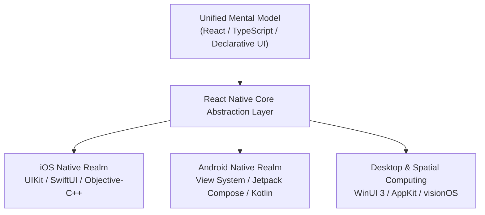

### Историческая неизбежность прихода веб-инженеров в мобильную разработку
During the early 2010s, mobile software engineering was trapped in siloed specializations: Objective-C/Swift for iOS and Java/Kotlin for Android. Building identical feature sets required duplicate engineering teams, disconnected codebases, disparate tooling, and asynchronous release cycles.

Porting the hyper-productive JavaScript/TypeScript ecosystem and React's declarative ergonomics to mobile was a necessary structural evolution. By combining the unmatched iterative velocity of the Web (Fast Refresh) with the high-fidelity tactile responsiveness of native components on a single language substrate, React Native dissolved the barrier between web and mobile development.

### Архитектурный анализ компромиссов: React Native vs. Flutter vs. Нативная разработка vs. PWA
Selecting a mobile engineering stack requires a rigorous evaluation of rendering pipelines and host platform integration:

| Evaluation Axis | React Native (New Architecture) | Flutter | Native (Swift / Kotlin) | Web / PWA (Capacitor / Cordova) |
| :--- | :--- | :--- | :--- | :--- |
| **Rendering Pipeline** | **Host OS Native UI Primitives** (`UIView`, `android.view.View`) | Custom graphics canvas (Impeller / Skia) rendering custom widgets | **Host OS Native UI Primitives** controlled directly | WebView DOM rendering |
| **Platform Fidelity** | **Highest**: Automatically inherits OS-level animations, accessibility, and typography | Widget-dependent; risk of lag behind new OS visual guidelines | **Complete**: Immediate Day-0 support for newest OS features | Limited; struggles with native touch physics and gestures |
| **Language** | **TypeScript / JavaScript** | Dart | Swift, Kotlin | JavaScript / TypeScript, HTML/CSS |
| **Execution Engine** | **Hermes AOT Engine** (Precompiled bytecode) | Ahead-Of-Time (AOT) compiled Dart machine code | LLVM-compiled native machine code | V8 / JavaScriptCore |
| **Code Sharing** | 80% to 95% (excluding platform-specific native hooks) | 90% to 98% | 0% (or shared business logic via KMP) | 95% to 100% |
| **Native Interop** | **Zero-overhead synchronous C++ memory access (JSI)** | Asynchronous binary serialization via Platform Channels | Zero overhead | High-latency asynchronous WebView bridge |
| **Ecosystem** | **World's largest npm registry** + dedicated native modules | pub.dev (Active, but smaller than npm) | CocoaPods, SwiftPM, Gradle | npm ecosystem |

---

## 1. Фундаментальные концепции и ментальные модели React Native

### 1.1 Преемственность и различия с React Core
Understanding React Native requires distinguishing between **React Core** and **React DOM**. React Core is an abstract state machine that reconciles tree mutations based on state and props.

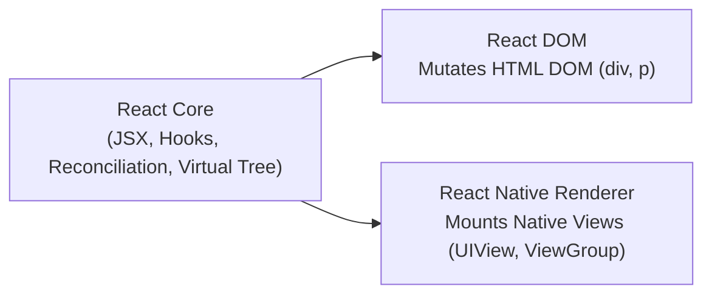

In web development, React reconciliation outputs mutations to browser DOM nodes (`<div>`, `<span>`). In React Native, the browser DOM does not exist. React Core's reconciliation output is piped directly into a native rendering tree. Consequently, all core React idioms—`useState`, `useReducer`, `useEffect`, `useMemo`, `useCallback`, and custom hooks—operate with identical semantics in React Native.

### 1.2 Принципы проецирования на нативные примитивы UI
React Native applications replace HTML tags with platform-agnostic core components:

```tsx
// Fundamental Declarative UI Component in React Native
import React, { useState } from 'react';
import { View, Text, StyleSheet, Pressable } from 'react-native';

export const CounterCard: React.FC = () => {
  const [count, setCount] = useState<number>(0);

  return (
    <View style={styles.cardContainer}>
      <Text style={styles.titleText}>Reactive Counter</Text>
      <Text style={styles.counterValue}>{count}</Text>
      <Pressable
        style={({ pressed }) => [
          styles.button,
          pressed && styles.buttonPressed
        ]}
        onPress={() => setCount((prev) => prev + 1)}
      >
        <Text style={styles.buttonLabel}>Increment Value</Text>
      </Pressable>
    </View>
  );
};

const styles = StyleSheet.create({
  cardContainer: {
    padding: 20,
    backgroundColor: '#ffffff',
    borderRadius: 12,
    shadowColor: '#000',
    shadowOffset: { width: 0, height: 4 },
    shadowOpacity: 0.1,
    shadowRadius: 8,
    elevation: 4, // Android elevation shadow
  },
  titleText: {
    fontSize: 16,
    fontWeight: '600',
    color: '#333333',
    marginBottom: 8,
  },
  counterValue: {
    fontSize: 32,
    fontWeight: 'bold',
    color: '#0066cc',
    textAlign: 'center',
    marginVertical: 12,
  },
  button: {
    backgroundColor: '#0066cc',
    paddingVertical: 12,
    paddingHorizontal: 24,
    borderRadius: 8,
    alignItems: 'center',
  },
  buttonPressed: {
    opacity: 0.8,
    transform: [{ scale: 0.98 }],
  },
  buttonLabel: {
    color: '#ffffff',
    fontSize: 14,
    fontWeight: 'bold',
  },
});
```

At runtime, these components map directly to native operating system widgets:
- `<View>` maps to `UIView` on iOS and `android.view.ViewGroup` on Android.
- `<Text>` maps to `NSTextStorage` / `UILabel` on iOS and `android.widget.TextView` on Android.
- `<Pressable>` synthesizes platform touch responder systems, triggering native ripple and highlight responses.

### 1.3 Координация потоков: JavaScript-поток против главного потока нативного UI
Mobile operating systems demand strict single-threaded UI rendering on the **Main (UI) Thread**. Any synchronous execution blocking this thread for more than 16.6ms (60Hz) or 8.3ms (120Hz ProMotion) results in immediate dropped frames and visual stutter.

To prevent JavaScript computation from blocking the UI, React Native executes the JavaScript runtime on an isolated background thread.

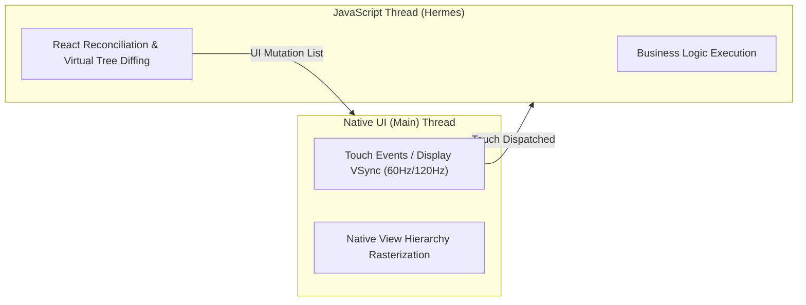

This multi-threaded isolation guarantees that heavy JavaScript business logic does not degrade hardware-accelerated scroll and gesture performance.

---

## 2. Глубокое погружение во внутреннюю архитектуру: от классического Bridge к New Architecture

### 2.1 Ограничения классической архитектуры Bridge
The legacy architecture relied upon an asynchronous, batched communication channel known as **"The Bridge"**:

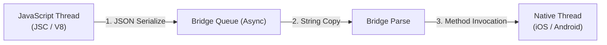

The Bridge suffered from three critical engineering flaws:
1. **Asynchronous Overhead**: All calls across the bridge were inherently asynchronous. Synchronous layout measurements or synchronous touch tracking were physically impossible, causing visible "white-out blanks" during rapid scrolling when view generation lagged behind user input.
2. **JSON Serialization Latency**: Passing structured objects, binary data, or high-frequency sensor updates required serializing objects into JSON strings and parsing them on the native side, consuming substantial CPU cycles.
3. **Queue Congestion**: Batched message scheduling caused message queue congestion, leading to dropped frames during complex touch animations.

### 2.2 Сердце Новой Архитектуры: JavaScript Interface (JSI)
The modern React Native architecture completely eliminates the Bridge in favor of the **JavaScript Interface (JSI)**.

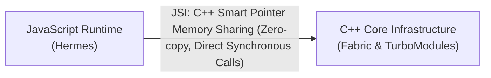

JSI is a lightweight, engine-agnostic C++ abstraction layer that exposes native C++ host objects directly to the JavaScript runtime:
- **Shared Memory Reference**: JavaScript references native C++ objects directly via smart pointers. Zero JSON serialization or string decoding is required.
- **Synchronous Execution**: JavaScript can invoke native methods synchronously and receive return values in the exact same call stack.
- **Engine Agnostic**: JSI decouple React Native from specific JS engines, allowing seamless interchange between Hermes, V8, and JavaScriptCore.

### 2.3 Рендерер Fabric: неизменяемые Shadow Trees и конкурентный монтаж
Fabric is the modern C++ rendering engine built atop JSI, operating through three pipeline phases:

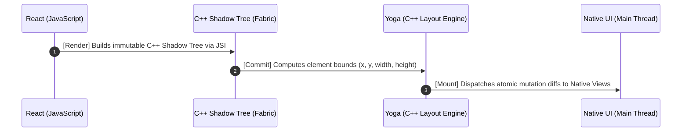

1. **Render Phase**: React elements are translated into an **immutable C++ Shadow Tree**. Immutability guarantees thread safety, unlocking React 18 Concurrent Features (Transitions, Suspense) on mobile.
2. **Commit Phase**: The C++ layout engine (Yoga) computes geometric constraints and layout metrics ($x, y, \text{width}, \text{height}$) across the shadow hierarchy.
3. **Mount Phase**: Fabric calculates tree diffs and sends only atomic mutation operations (Create, Update, Delete) to the native UI thread, executing atomic updates without frame drops.

### 2.4 TurboModules: ленивая инициализация нативных модулей по требованию
In the legacy architecture, all native modules were eagerly initialized on application startup. **TurboModules** leverage JSI to instantiate native modules lazily on-demand. Native capabilities (Camera, Bluetooth, Location) consume memory and initialization cycles only when first invoked by JavaScript, drastically cutting Time-To-Interactive (TTI).

### 2.5 CodeGen: автоматизированная типобезопасная генерация связок C++
**CodeGen** ensures type safety between dynamically typed JavaScript and statically typed native languages (C++, Swift, Kotlin). By analyzing TypeScript or Flow specifications at build time, CodeGen automatically outputs:
- C++ JSI host object boilerplate and protocol headers.
- Objective-C++ delegate protocols.
- Kotlin JNI interfaces.

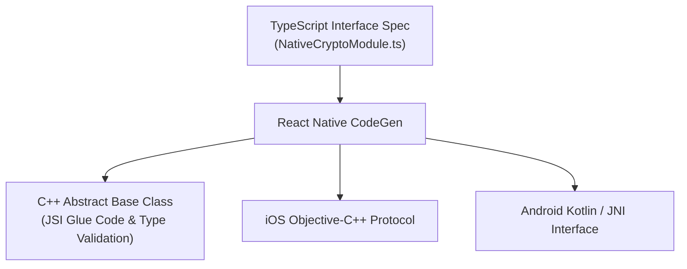

Type mismatches are detected at compile time, eliminating runtime type conversion crashes.

### 2.6 Движок Hermes: предварительная AOT-компиляция байткода и мгновенный холодный старт
**Hermes** is an open-source JavaScript engine optimized by Meta specifically for mobile constraints. Unlike desktop engines (V8) that parse raw JavaScript text and run heavy JIT compilers at runtime, Hermes utilizes:
1. **Ahead-of-Time (AOT) Bytecode Compilation**: JavaScript is compiled into optimized bytecode (`.hbc`) on the developer machine or CI server. The mobile app loads pre-parsed bytecode directly into memory via `mmap`.
2. **Drastically Reduced Memory Footprint (RSS)**: Removing the JIT compiler from the runtime binary minimizes memory consumption.
3. **Generational Garbage Collection**: A compacting, moving generational GC prevents heap fragmentation and eliminates long GC pauses.

---

## 3. Среда разработки и архитектура проекта: Modern Expo против Bare CLI

### 3.1 Парадигма современного Expo и Config Plugins
Expo has evolved from a restricted prototyping tool into the **officially recommended production platform for enterprise React Native applications**.

The cornerstone of this evolution is **Config Plugins**. Instead of manually modifying fragile platform files (`Info.plist`, `Podfile`, `AndroidManifest.xml`, `build.gradle`), developers declare permissions and plugins inside `app.json` or `app.config.ts`. Plugins programmatically manipulate native build files at compile time, maintaining pristine separation between project configuration and generated native code.

### 3.2 Непрерывная нативная генерация (CNG) и механизм Expo Prebuild
The Continuous Native Generation (CNG) paradigm redefines how native directories are managed:

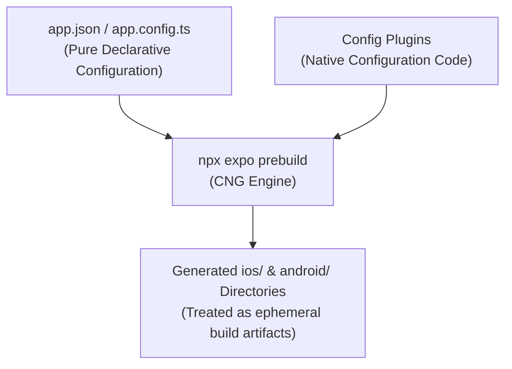

Under CNG, native folders (`ios/`, `android/`) are treated as ephemeral build artifacts rather than source files. Upgrading React Native versions is as simple as updating dependency versions and re-running `npx expo prebuild`, eliminating painful manual Xcode/Gradle merge conflicts.

### 3.3 Кастомные сборки разработки (Expo Dev Client) и облачная инфраструктура EAS
When custom C++ or third-party native libraries are required, developers use **Expo Dev Client** to generate custom development binaries.

Complementing this is **Expo Application Services (EAS)**:
1. **EAS Build**: Cloud-managed containerized builds for iOS (IPA) and Android (AAB) without requiring local macOS hardware.
2. **EAS Submit**: Automated app submission to Apple App Store Connect and Google Play Console.
3. **EAS Update**: Instant Over-The-Air (OTA) runtime code push without waiting for app store review cycles.

---

## 4. Базовые компоненты и верстка: движок Yoga

### 4.1 Иерархия базовых компонентов
| Component | Native Representation | Behavior and Attributes |
| :--- | :--- | :--- |
| `<View>` | `UIView` (iOS) / `ViewGroup` (Android) | Container node. Defaults to `display: flex`, `flexDirection: column`. |
| `<Text>` | `UILabel` (iOS) / `TextView` (Android) | Typography renderer. **All text must reside inside `<Text>`**. Nested `<Text>` inherits inline layout. |
| `<Image>` | `UIImageView` (iOS) / `ImageView` (Android) | Graphic rasterization. Explicit width and height required for remote URIs. Superseded by `expo-image`. |
| `<ScrollView>` | `UIScrollView` (iOS) / `ScrollView` (Android) | Scrollable container. Allocates memory for all children simultaneously; unsuitable for large data sets. |
| `<TextInput>` | `UITextField` (iOS) / `EditText` (Android) | User input field. Coordinates with `KeyboardAvoidingView` to handle keyboard displacement. |
| `<Pressable>` | Native Touch Synthesis | Advanced touch surface with ripple, feedback, and hover state handlers. |

### 4.2 C++ движок компоновки: принципы работы Yoga и отличия от Web Flexbox
Because mobile operating systems lack native CSS engines, React Native uses **Yoga**, an ultra-fast, cross-platform C++ Flexbox implementation.

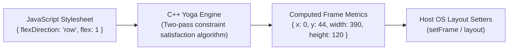

#### Divergences from Web CSS Flexbox
1. **Default `flexDirection` is `column`**: Optimized for mobile portrait viewports.
2. **Dimensions are Density-Independent Points (dp / pt)**: Values are logical units scaled automatically by device pixel ratio (`PixelRatio.get()`).
3. **No Global Style Inheritance**: Properties do not cascade downwards, except within nested `<Text>` components.

### 4.3 Инженерия виртуализированных списков: FlatList против Shopify FlashList
Rendering thousands of items in `<ScrollView>` causes Out-Of-Memory (OOM) crashes. Virtualization solves this by rendering only viewport-visible elements:

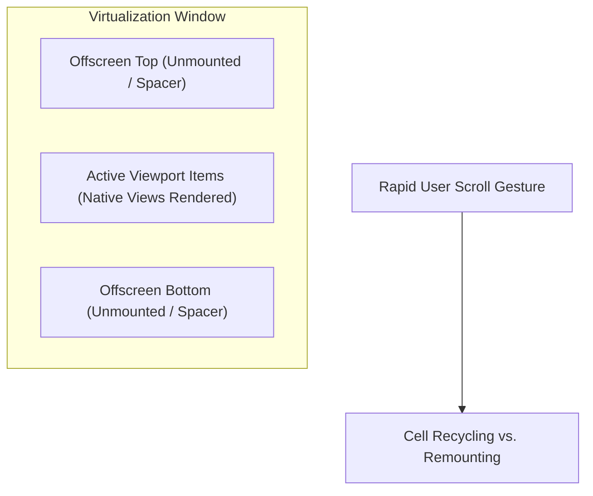

- **FlatList Remounting Overhead**: Standard `<FlatList>` unmounts offscreen cells and instantiates new ones as the user scrolls. During rapid fling gestures, JavaScript allocation delays create visible blank spaces.
- **Shopify FlashList Cell Recycling**: FlashList ports the native recycling architecture of Android's `RecyclerView` and iOS's `UICollectionView`. Instead of destroying offscreen cells, FlashList reuses existing native view structures and re-binds new props, achieving consistent 120fps scrolling with up to 10x lower memory allocation.

```tsx
// High-Performance List Implementation via Shopify FlashList
import React from 'react';
import { View, Text, StyleSheet } from 'react-native';
import { FlashList } from '@shopify/flash-list';

interface ProductItem {
  id: string;
  title: string;
  price: number;
}

const mockData: ProductItem[] = Array.from({ length: 5000 }, (_, i) => ({
  id: `item-${i}`,
  title: `High Performance Hardware Item #${i + 1}`,
  price: Math.floor(Math.random() * 10000) + 1000,
}));

export const ProductListView: React.FC = () => {
  return (
    <View style={styles.container}>
      <FlashList
        data={mockData}
        estimatedItemSize={72} // Crucial for preventing scroll jump
        keyExtractor={(item) => item.id}
        renderItem={({ item }) => (
          <View style={styles.itemRow}>
            <Text style={styles.itemTitle}>{item.title}</Text>
            <Text style={styles.itemPrice}>${(item.price / 100).toFixed(2)}</Text>
          </View>
        )}
      />
    </View>
  );
};

const styles = StyleSheet.create({
  container: { flex: 1, backgroundColor: '#f8f9fa' },
  itemRow: {
    height: 72,
    paddingHorizontal: 16,
    justifyContent: 'center',
    borderBottomWidth: StyleSheet.hairlineWidth,
    borderBottomColor: '#e0e0e0',
  },
  itemTitle: { fontSize: 15, color: '#212529', fontWeight: '500' },
  itemPrice: { fontSize: 14, color: '#0d6efd', marginTop: 4 },
});
```

### 4.4 Современные стратегии стилизации и дизайн-системы
- **`StyleSheet.create`**: Native caching standard with zero build-step overhead.
- **NativeWind (v4)**: Tailwind CSS compilation into optimized StyleSheet objects.
- **Restyle (Shopify)**: Enforces enterprise-grade, type-safe theme tokens in TypeScript.
- **Tamagui**: Universal UI compiler providing zero-overhead style flattening for web and native.

---

## 5. Архитектура навигации и глобальное управление состоянием

### 5.1 Внутренняя сложность мобильной навигации
Mobile navigation involves multi-dimensional state transitions:
- **Stack Navigation**: Card push transitions with native swipe-to-back gestures.
- **Tab Navigation**: Parallel persistent navigation stacks per bottom tab.
- **Modals**: Contextual presentation surfaces with swipe-down dismiss mechanics.
- **Deep Linking**: Seamless routing from external URLs (`https://myapp.com/item/42`) to deep nested screen hierarchies.

### 5.2 Взаимодействие React Navigation и React Native Screens
While **React Navigation** coordinates route logic in JavaScript, running animations in JavaScript creates stutter during heavy CPU load. **`react-native-screens`** solves this by mapping React screen hierarchies directly to native platform view controllers:

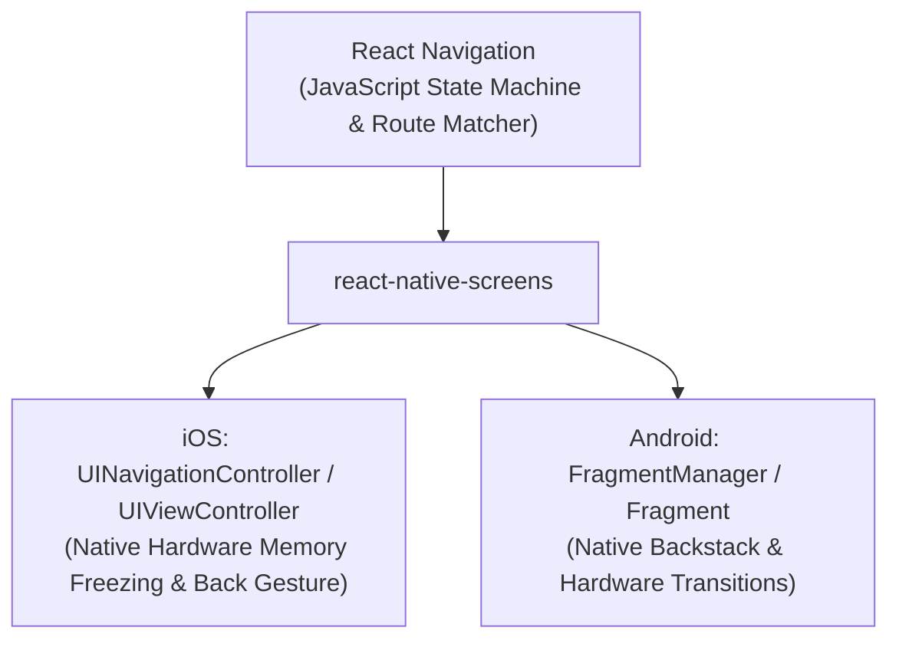

Unfocused screens are placed in a native "frozen" state, conserving battery and GPU rendering cycles.

### 5.3 Революция файловой маршрутизации: Expo Router
Inspired by Next.js App Router, **Expo Router** treats the file system as the canonical map of application navigation:

```
app/
├── _layout.tsx         # Root layout with authentication stack
├── (tabs)/             # Nested tab group
│   ├── _layout.tsx     # Tab bar configuration
│   ├── index.tsx       # Home tab screen (/)
│   └── profile.tsx     # Profile tab screen (/profile)
├── item/
│   └── [id].tsx        # Dynamic route (/item/42)
└── modal.tsx           # Presentation modal (/modal)
```

```tsx
// Type-Safe Declarative Navigation with Expo Router
import { View, Text, Pressable } from 'react-native';
import { useRouter, useLocalSearchParams } from 'expo-router';

export default function ItemDetailScreen() {
  const router = useRouter();
  const { id } = useLocalSearchParams<{ id: string }>();

  return (
    <View style={{ flex: 1, justifyContent: 'center', alignItems: 'center' }}>
      <Text style={{ fontSize: 20 }}>Item Identifier: {id}</Text>
      <Pressable
        onPress={() => router.push('/modal')}
        style={{ marginTop: 20, padding: 12, backgroundColor: '#0066cc', borderRadius: 8 }}
      >
        <Text style={{ color: '#fff' }}>Open Information Modal</Text>
      </Pressable>
    </View>
  );
}
```

### 5.4 Архитектура состояния: разделение серверного кэша и клиентского состояния
Enterprise applications must strictly separate remote data caches from ephemeral client UI state:

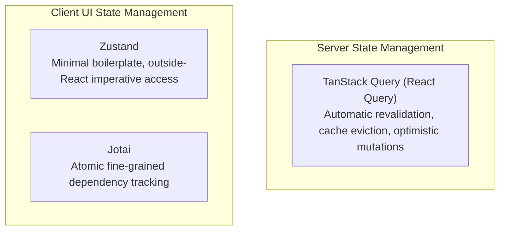

- **Server Cache (TanStack Query)**: Handles network polling, pagination, offline retry policies, and cache invalidation.
- **Client State (Zustand)**: Manages local UI states (active filters, dark mode, auth tokens) with zero context-re-render cascades.

---

## 6. Интеграция с нативным оборудованием и разработка кастомных TurboModules

### 6.1 Современные аппаратные API в Expo SDK
- **Camera (`expo-camera`)**: Real-time native C++ frame parsing for QR/barcode scanning.
- **Location (`expo-location`)**: Background geofencing and GPS telemetry.
- **Biometrics (`expo-local-authentication`)**: Hardware-backed FaceID / TouchID and Android BiometricPrompt authentication.
- **Push Notifications (`expo-notifications`)**: Unified APNs and FCM token synchronization.

### 6.2 Локальное хранилище данных: AsyncStorage против MMKV
The legacy `AsyncStorage` utilized asynchronous bridge serialization and disk I/O, creating substantial read/write latency.

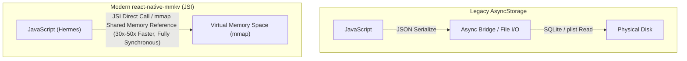

**`react-native-mmkv`** maps storage files directly into process virtual memory using `mmap`, providing:
1. **Synchronous Execution**: Eliminates initial loading spinners by fetching session tokens immediately during component initialization.
2. **High-Speed Benchmarks**: Delivers 30x to 50x higher throughput than AsyncStorage without bridge serialization overhead.

```tsx
// Synchronous Storage Integration via react-native-mmkv
import { MMKV } from 'react-native-mmkv';

export const storage = new MMKV({
  id: 'secure-user-storage',
  encryptionKey: 'enterprise-grade-aes-key',
});

export const SessionStore = {
  setAuthToken: (token: string) => {
    storage.set('auth_token', token); // Synchronous zero-latency write
  },
  getAuthToken: (): string | undefined => {
    return storage.getString('auth_token'); // Synchronous immediate read
  },
  clearSession: () => {
    storage.delete('auth_token');
  },
};
```

### 6.3 Создание кастомных TurboModules (от TypeScript к C++ / Objective-C++)

#### Step 1: TypeScript CodeGen Specification
```typescript
// specs/NativeCryptoCalculator.ts
import type { TurboModule } from 'react-native';
import { TurboModuleRegistry } from 'react-native';

export interface Spec extends TurboModule {
  computeSha256Sync(input: string): string;
  generateSecureKey(bits: number): Promise<string>;
}

export default TurboModuleRegistry.getEnforcing<Spec>('NativeCryptoCalculator');
```

#### Step 2: iOS Objective-C++ Implementation
```objc
// ios/NativeCryptoCalculator.mm
#import "NativeCryptoCalculator.h"
#import <CommonCrypto/CommonDigest.h>

@implementation NativeCryptoCalculator
RCT_EXPORT_MODULE()

- (std::shared_ptr<facebook::react::TurboModule>)getTurboModule:
    (const facebook::react::ObjCTurboModule::InitParams &)params {
  return std::make_shared<facebook::react::NativeCryptoCalculatorSpecJSI>(params);
}

- (NSString *)computeSha256Sync:(NSString *)input {
  const char *str = [input UTF8String];
  unsigned char result[CC_SHA256_DIGEST_LENGTH];
  CC_SHA256(str, (CC_LONG)strlen(str), result);
  
  NSMutableString *hash = [NSMutableString stringWithCapacity:CC_SHA256_DIGEST_LENGTH * 2];
  for (int i = 0; i < CC_SHA256_DIGEST_LENGTH; i++) {
    [hash appendFormat:@"%02x", result[i]];
  }
  return hash;
}

RCT_EXPORT_METHOD(generateSecureKey:(double)bits
                  resolve:(RCTPromiseResolveBlock)resolve
                  reject:(RCTPromiseRejectBlock)reject) {
  dispatch_async(dispatch_get_global_queue(DISPATCH_QUEUE_PRIORITY_DEFAULT, 0), ^{
    NSString *key = [[NSUUID UUID] UUIDString];
    resolve(key);
  });
}

@end
```

---

## 7. Экстремальная оптимизация производительности и научный профилинг

### 7.1 Разделение потоков и бюджет кадра (16.6ms)
Achieving fluid animations requires completing frame calculations within **16.6ms** (60Hz) or **8.3ms** (120Hz). Offloading animation loops from the busy JavaScript thread to the UI thread is essential for high-performance mobile software.

### 7.2 Революция декларативных анимаций: Reanimated 3 Worklets
**React Native Reanimated 3** executes animation logic directly on the UI thread using **Worklets**:

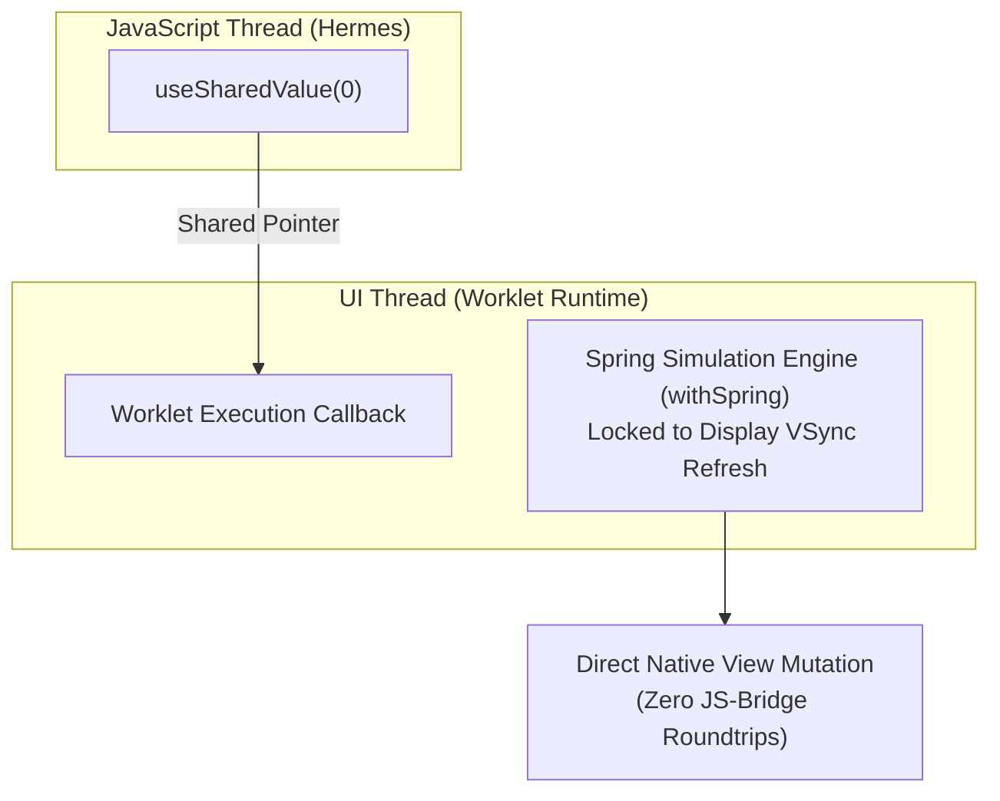

```tsx
// High-Fidelity Physics Gesture Animation with Reanimated 3
import React from 'react';
import { StyleSheet, View } from 'react-native';
import { GestureDetector, Gesture } from 'react-native-gesture-handler';
import Animated, {
  useSharedValue,
  useAnimatedStyle,
  withSpring,
} from 'react-native-reanimated';

export const InteractivePhysicsCard: React.FC = () => {
  const translateX = useSharedValue(0);
  const translateY = useSharedValue(0);
  const contextX = useSharedValue(0);
  const contextY = useSharedValue(0);

  const panGesture = Gesture.Pan()
    .onStart(() => {
      'worklet';
      contextX.value = translateX.value;
      contextY.value = translateY.value;
    })
    .onUpdate((event) => {
      'worklet';
      translateX.value = contextX.value + event.translationX;
      translateY.value = contextY.value + event.translationY;
    })
    .onEnd(() => {
      'worklet';
      translateX.value = withSpring(0, { damping: 12, stiffness: 90 });
      translateY.value = withSpring(0, { damping: 12, stiffness: 90 });
    });

  const animatedStyle = useAnimatedStyle(() => {
    'worklet';
    return {
      transform: [
        { translateX: translateX.value },
        { translateY: translateY.value },
        { scale: withSpring(translateX.value !== 0 ? 1.05 : 1) },
      ],
    };
  });

  return (
    <View style={styles.canvas}>
      <GestureDetector gesture={panGesture}>
        <Animated.View style={[styles.card, animatedStyle]} />
      </GestureDetector>
    </View>
  );
};

const styles = StyleSheet.create({
  canvas: { flex: 1, justifyContent: 'center', alignItems: 'center' },
  card: {
    width: 160,
    height: 160,
    backgroundColor: '#0066cc',
    borderRadius: 24,
    shadowColor: '#0066cc',
    shadowOffset: { width: 0, height: 10 },
    shadowOpacity: 0.3,
    shadowRadius: 20,
    elevation: 8,
  },
});
```

### 7.3 Высокопроизводительный пайплайн изображений: `expo-image`
Uncompressed image textures are the primary cause of out-of-memory terminations (Jetsam on iOS). **`expo-image`** interfaces directly with native decoding engines (`SDWebImage` on iOS, `Glide` on Android), providing:
- Full WebP and AVIF hardware decoding.
- Automatic downsampling matching view dimensions before allocating GPU VRAM.
- Instant ThumbHash placeholder rendering.

### 7.4 Научный рабочий процесс профилирования и мониторинга
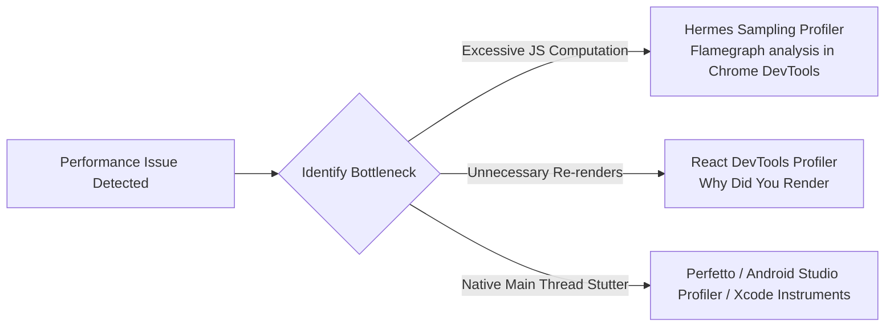

---

## 8. Всеобъемлющая стратегия тестирования, современный CI/CD и релизные операции

### 8.1 Построение пирамиды тестирования для мобильных приложений
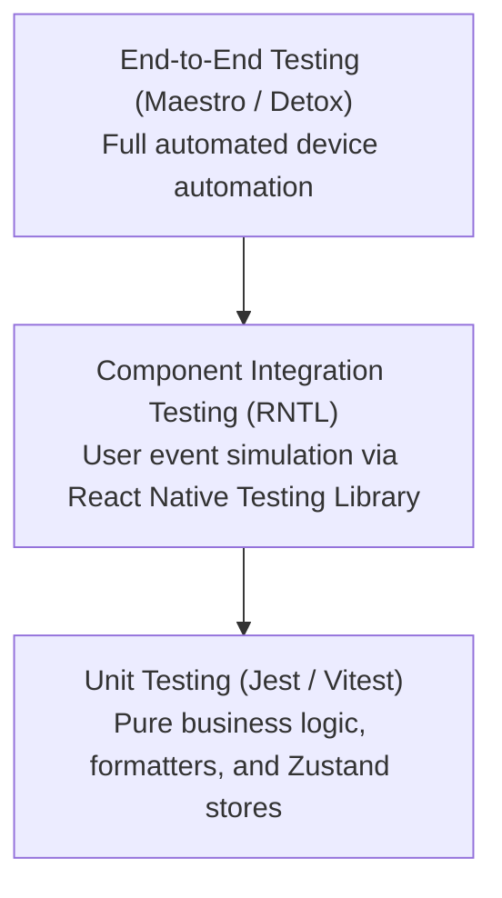

1. **Unit Testing (Jest)**: Validates state transitions, calculations, and reducers in milliseconds.
2. **Component Integration (RNTL)**: Verifies component accessibility and user interactions without requiring real device emulators.
3. **End-to-End Automation (Maestro)**: Executes critical user journeys (login, payment flow) on real iOS and Android devices using declarative YAML scenarios.

### 8.2 Корпоративный автоматизированный конвейер CI/CD
```yaml
# .github/workflows/deploy.yml
name: Production Mobile Release

on:
  push:
    tags:
      - 'v*.*.*'

jobs:
  build-and-deploy:
    runs-on: macos-latest
    steps:
      - name: Checkout Code
        uses: actions/checkout@v4

      - name: Setup Node.js & Bun
        uses: oven-sh/setup-bun@v1
        with:
          bun-version: latest

      - name: Install Dependencies
        run: bun install --frozen-lockfile

      - name: Setup EAS CLI
        run: npm install -g eas-cli

      - name: Execute EAS Cloud Build for iOS and Android
        run: eas build --platform all --profile production --non-interactive
        env:
          EXPO_TOKEN: ${{ secrets.EXPO_TOKEN }}

      - name: Submit to App Store and Google Play
        run: eas submit --platform all --profile production --auto-submit
        env:
          EXPO_TOKEN: ${{ secrets.EXPO_TOKEN }}
```

### 8.3 Обновления по воздуху (OTA) и соответствие правилам магазинов приложений
**EAS Update** pushes updated JavaScript bundles and assets directly to active client devices. To adhere strictly to Apple App Store Review Guideline 2.5.2, OTA updates must:
- Fix defects, update UI themes, or adjust copy.
- **Never alter the primary purpose or fundamental feature set of the application.**

### 8.4 Наблюдаемость и мониторинг в продакшене
- **Sentry for React Native**: Combines native crashes (C++, Swift, Kotlin) with JavaScript unhandled exceptions, resolving symbolicated stack traces via Hermes source maps.
- **Datadog / Firebase Performance Monitoring**: Tracks real-time Time to Initial Display (TTID) metrics and network failure rates across global mobile carriers.

---

## 9. Горизонты React Native: универсальные приложения и пространственные вычисления

### 9.1 React Server Components (RSC) в нативной мобильной среде
RSC executes data-heavy components on edge servers and streams serialized Flight UI payloads directly to mobile clients, eliminating large client-side bundle sizes and removing client-side network waterfalls.

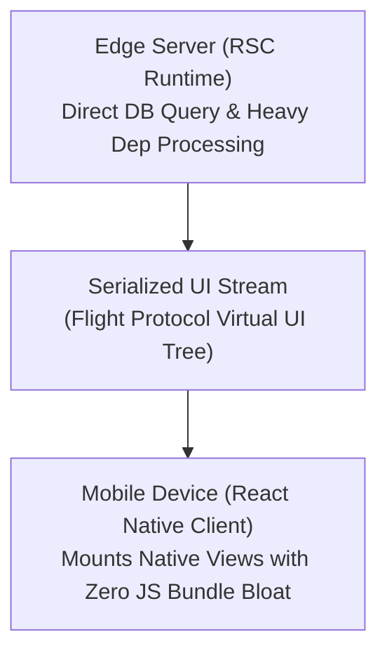

### 9.2 Экспансия на десктоп и пространственные вычисления (Apple Vision Pro)
React Native extends far beyond smartphones:
- **React Native for Windows / macOS**: Maintained by Microsoft, powering flagship desktop applications (Xbox App, Teams) with WinUI 3 and AppKit native controls.
- **Apple Vision Pro (`react-native-visionos`)**: Enables declarative spatial computing UI in 3D volumes and immersive spaces.

### 9.3 Сближение с веб-платформой: React Native for Web и тотальная унификация
Originally engineered for Twitter/X, **React Native for Web** translates `<View>` and `<Text>` primitives into semantic HTML5 and CSS Flexbox rules, enabling over 90% code reuse across iOS, Android, and Web platforms.

---

## Заключение: расширение возможностей инженеров для преодоления границ платформ

The history of software engineering is defined by abstraction: replacing brittle, fragmented platform dialects with unified declarative paradigms. React Native, bolstered by JSI, Fabric, TurboModules, and Hermes, has eliminated the historical compromises of cross-platform engineering.

World-class mobile engineers understand both the underlying constraints of native hardware and the expressive elegance of modern functional TypeScript. By mastering this unified architectural foundation, developers can build responsive, tactile applications that delight millions of users across the globe.
