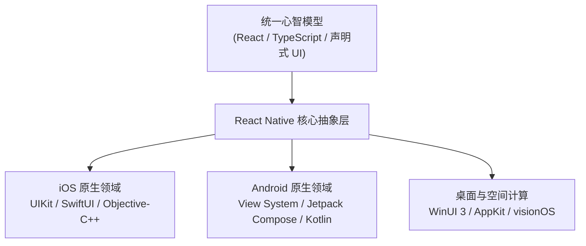
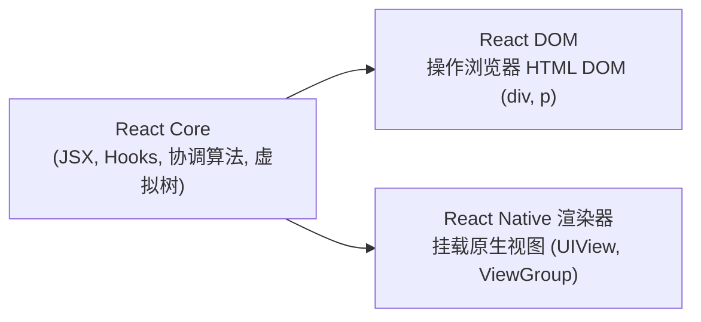
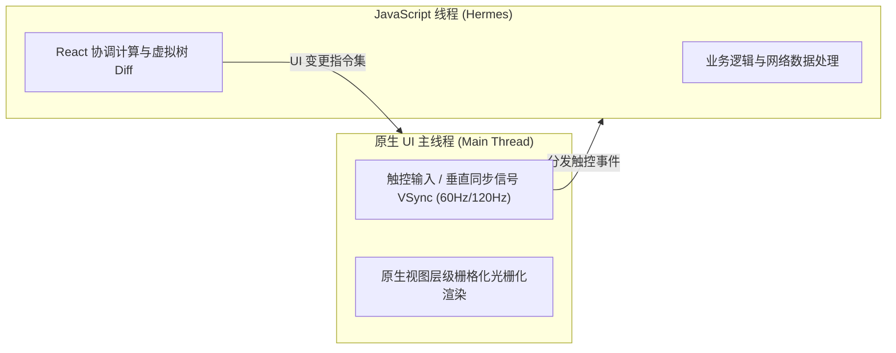
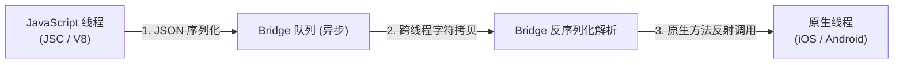
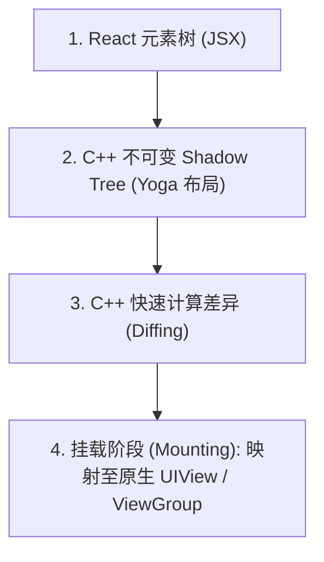
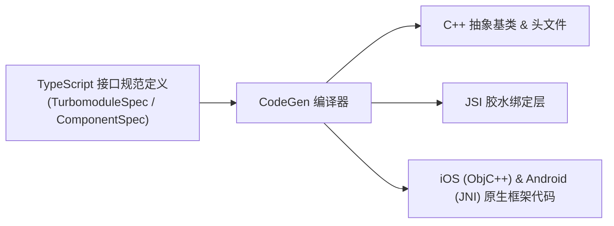
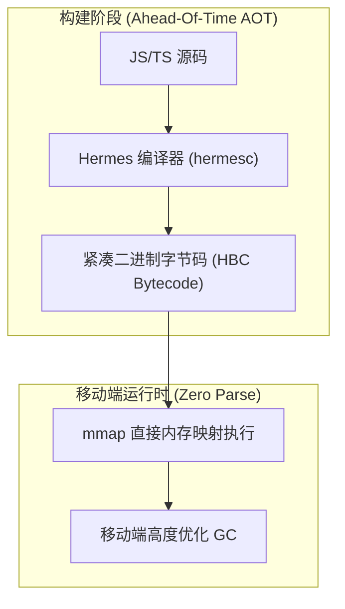
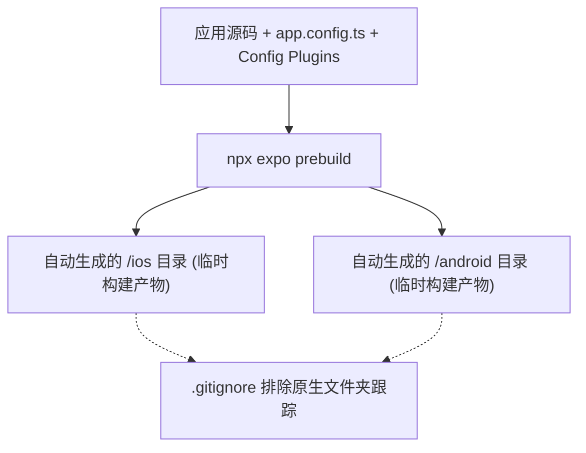
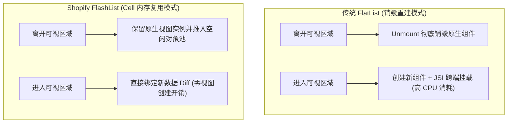
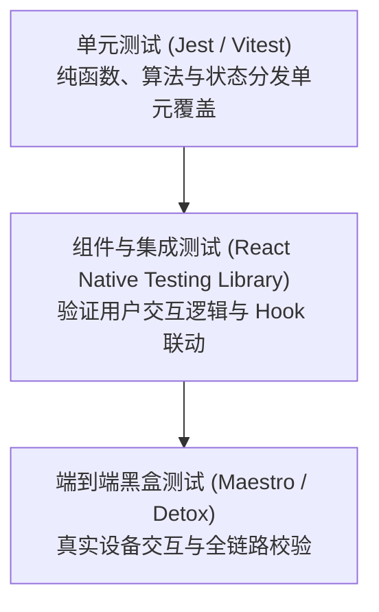

## 引言：移动端开发范式变革与 React Native 的存在意义

### "Learn Once, Write Anywhere" 的真正内涵
2015 年，Meta（原 Facebook）开源了 **React Native** ，彻底颠覆了移动端应用开发的固有格局。与 Sun Microsystems 经典的 "Write once, run anywhere"（一次编写，到处运行）不同，React Native 提出了全新的核心主张： **"Learn once, write anywhere"（一次学习，随处编写）** 。

这一理念并非主张强行跨平台推行妥协折中的“最大公约数”合成 UI。相反，它让工程师能够运用 React 强大的声明式心智模型——组件化架构、单向数据流与函数式状态驱动——直接驱动与编排 iOS、Android、macOS、Windows 等平台原生所提供的最地道、最底层的 UI 原语。



### Web 工程师进军移动工程的历史必然性
在 2010 年代初，移动软件工程深陷于封闭割裂的技术栈之中：iOS 依赖 Objective-C/Swift，Android 依赖 Java/Kotlin。要构建完全相同的功能集，企业必须维持两支完全独立的研发团队，维护互不通用的代码库，使用差异巨大的工具链，并承受异步发布的沟通成本。

将极具生产力的 JavaScript/TypeScript 生态系统以及 React 的声明式开发体验移植到移动端，是技术演进的历史必然。通过将 Web 端无与伦比的迭代效率（Fast Refresh 毫秒级热重载）与原生平台组件丝滑细腻的触控反馈在单一语言基底上结合，React Native 彻底消弭了 Web 工程师与移动工程师之间的鸿沟。

### 架构权衡深度对比: React Native vs. Flutter vs. 原生开发 vs. PWA
在技术选型时，必须对各类跨端方案的底层渲染管线与平台集成度进行深度解构：

| 评估维度 | React Native (新架构) | Flutter | 原生开发 (Swift / Kotlin) | Web / PWA (Capacitor / Cordova) |
| :--- | :--- | :--- | :--- | :--- |
| **渲染管线** | **宿主 OS 原生 UI 原语** (`UIView`, `android.view.View`) | 自绘图形画布 (Impeller / Skia) 渲染自定义组件 | **宿主 OS 原生 UI 原语** 直接操控 | WebView DOM 渲染 |
| **平台真实度** | **最高** ：自动继承系统级平滑动画、辅助功能与字体排版 | 组件自绘：新系统发布时可能产生视觉微滞后 | **完全原生** ：首发即获最新系统级专属特性支持 | 较弱：难以模拟原生触摸物理特性与手势惯性 |
| **开发语言** | **TypeScript / JavaScript** | Dart | Swift, Kotlin | JavaScript / TypeScript, HTML/CSS |
| **执行引擎** | **Hermes AOT 引擎** (预编译字节码) | AOT 编译后的 Dart 机器码 | LLVM 编译的原生机器码 | V8 / JavaScriptCore |
| **代码复用率** | 80% 〜 95% (平台特有硬件接口除外) | 90% 〜 98% | 0% (或通过 KMP 复用业务逻辑) | 95% 〜 100% |
| **原生互操作** | **零开销同步 C++ 内存直通 (JSI)** | Platform Channels 二进制异步序列化 | 零开销 | 高延迟异步 WebView Bridge |
| **生态繁荣度** | **全球最大 npm 生态** + 丰富原生模块支持 | pub.dev (活跃但体量远小于 npm) | CocoaPods, SwiftPM, Gradle | npm Web 生态 |

---

## 1. React Native 的核心设计哲学与心智模型

### 1.1 从 React Core 的继承与分化
深入理解 React Native 的关键在于厘清 **React Core** 与 **React DOM** 的本质边界。React Core 本质上是一个抽象的状态机，专注于依据状态 (State) 与属性 (Props) 的变化进行虚拟树的协调计算 (Reconciliation)。



在 Web 开发中，React 协调计算的结果输出为浏览器 DOM 节点的变更（如 `<div>`、`<span>`）。而在 React Native 中，完全不存在浏览器 DOM。React Core 的协调结果被直接接入原生渲染树。因此，所有核心 React 心智模型——`useState`、`useReducer`、`useEffect`、`useMemo`、`useCallback` 及自定义 Hooks——在 React Native 中均具有完全一致的运行语义。

### 1.2 原生 UI 原语映射机制
React Native 使用平台无关的核心组件替换传统的 HTML 标签：

```tsx
// React Native 核心声明式计数器组件
import React, { useState } from 'react';
import { View, Text, StyleSheet, Pressable } from 'react-native';

export const CounterCard: React.FC = () => {
  const [count, setCount] = useState<number>(0);

  return (
    <View style={styles.cardContainer}>
      <Text style={styles.titleText}>响应式计数器</Text>
      <Text style={styles.counterValue}>{count}</Text>
      <Pressable
        style={({ pressed }) => [
          styles.button,
          pressed && styles.buttonPressed
        ]}
        onPress={() => setCount((prev) => prev + 1)}
      >
        <Text style={styles.buttonLabel}>增加计数值</Text>
      </Pressable>
    </View>
  );
};

const styles = StyleSheet.create({
  cardContainer: {
    padding: 20,
    backgroundColor: '#ffffff',
    borderRadius: 12,
    shadowColor: '#000',
    shadowOffset: { width: 0, height: 4 },
    shadowOpacity: 0.1,
    shadowRadius: 8,
    elevation: 4, // Android 专有高度阴影
  },
  titleText: {
    fontSize: 16,
    fontWeight: '600',
    color: '#333333',
    marginBottom: 8,
  },
  counterValue: {
    fontSize: 32,
    fontWeight: 'bold',
    color: '#0066cc',
    textAlign: 'center',
    marginVertical: 12,
  },
  button: {
    backgroundColor: '#0066cc',
    paddingVertical: 12,
    paddingHorizontal: 24,
    borderRadius: 8,
    alignItems: 'center',
  },
  buttonPressed: {
    opacity: 0.8,
    transform: [{ scale: 0.98 }],
  },
  buttonLabel: {
    color: '#ffffff',
    fontSize: 14,
    fontWeight: 'bold',
  },
});
```

在运行时，这些抽象组件被直接映射到底层操作系统原生控件：
- `<View>` 映射为 iOS 的 `UIView` 以及 Android 的 `android.view.ViewGroup`。
- `<Text>` 映射为 iOS 的 `NSTextStorage` / `UILabel` 以及 Android 的 `android.widget.TextView`。
- `<Pressable>` 统一整合触控响应系统，触发原生水波纹 (Ripple) 与高亮状态。

### 1.3 线程协同模型: JavaScript 线程与原生 UI 主线程
移动操作系统要求 UI 绘制必须严格在 **主线程 (Main / UI Thread)** 中执行。任何阻塞该线程超过 16.6ms (60Hz) 或 8.3ms (120Hz ProMotion) 的同步骤计算，都会导致屏幕直接掉帧和视觉卡顿。

为保证 JavaScript 端复杂的业务计算不阻塞 UI 渲染，React Native 采用多线程隔离架构：



这种线程物理隔离机制从根本上确保了：即使 JavaScript 正在进行海量数据解析，底层的硬件加速滚动与原生动画依然能维持丝滑流畅。

---

## 2. 内部架构演进深潜: 从经典 Bridge 到新架构 (New Architecture)

### 2.1 经典 Bridge 架构的结构性瓶颈
在过去的旧架构中，JavaScript 线程与原生线程之间依靠名为 **"The Bridge"（通信桥）** 的异步批处理通道连接：



旧 Bridge 存在三大结构性缺陷：
1. **纯异步调用开销** ：跨 Bridge 通信必须异步执行。这导致无法进行同步布局测算与实时触控拦截。在高速滑动长列表时，由于原生视图渲染无法同步追赶手指滑动速度，用户经常会看到大片白色空白区域。
2. **JSON 序列化高昂延迟** ：任何复杂对象、二进制数据或高频陀螺仪数据传输，都必须在 JS 端序列化为 JSON 字符串并在原生端重新解析，极大地消耗了 CPU 资源。
3. **消息队列拥塞** ：批处理管道极易出现队列堵塞，一旦某一庞大消息耗时过长，后续的高优先级手势与动画事件就会被迫滞后。

### 2.2 新架构核心: JavaScript Interface (JSI)
现代 React Native 全面废弃了 Bridge，转而以 **JavaScript Interface (JSI)** 作为底层基石。

```mermaid
flowchart LR
    JS["JavaScript 运行时<br/>(Hermes)"] <--> -- "JSI: C++ 智能指针内存直通共享（零拷贝・同步双向直调）" --> NATIVE["C++ 核心基石<br/>(Fabric & TurboModules)"]
```

JSI 是一个轻量级、面向宿主引擎无关的 C++ 抽象层。通过 JSI，JavaScript 运行时对象能够直接持有 C++ 宿主对象 (`HostObject`) 的引用，反之亦然。这带来了划时代的性能飞跃：
- **零拷贝直接调用** ：JavaScript 可以像调用普通本地函数一样，直接同步调用 C++ 导出的函数。
- **免除 JSON 序列化** ：参数与返回值通过 C++ 共享内存和智能指针直接传递。
- **引擎自由解耦** ：JSI 抽象使得 React Native 底层可以随意无缝替换 JS 引擎（Hermes、V8、JavaScriptCore 等）。

### 2.3 Fabric 渲染器: 不可变 Shadow Tree 与并发挂载
基于 JSI 构建的现代 UI 渲染管线被称为 **Fabric** 。其核心渲染流程由 C++ 统一接管：



Fabric 的革命性优势包括：
- **跨平台 C++ 核心复用** ：布局测算与节点树 Diffing 全部下沉至由 C++ 编写的通用核心层，消除 iOS 与 Android 平台的行为细微差异。
- **完美融合 React 18+ 并发特性** ：全面支持 `useTransition`、`Suspense` 与高优先级中断机制。
- **彻底根除白屏撕裂** ：支持同步测量与挂载，在极速滑屏场景下依然能够保证像素同步渲染。

### 2.4 TurboModules: 按需懒加载与原生模块现代化
在旧架构中，应用启动时必须一次性初始化所有注册的原生模块，严重拖慢了 App 的冷启动耗时。

**TurboModules** 借助 JSI 实现了真正的 **按需懒加载 (Lazy Initialization)** 。只有当 JavaScript 业务代码首次真正调用某一原生模块时，系统才会在内存中创建并绑定对应的 C++ / 原生实例。未使用的模块在启动阶段完全不产生任何内存与 CPU 开销，极大缩短了冷启动时间。

### 2.5 CodeGen: 静态类型驱动的 C++ 绑定代码自动生成
为了保障 TypeScript 与 C++ / 原生语言之间跨语言调用的绝对安全性，新架构引入了 **CodeGen** 自动化编译器工具链。



开发者只需编写一份强类型的 TypeScript 规范，CodeGen 即可在编译时自动生成严密的 C++ 类型转换代码与 JSI 样板代码，彻底终结了跨语言调用时的类型不一致与崩溃风险。

### 2.6 Hermes 专用引擎: 字节码预编译与极速冷启动
Meta 专门为移动端场景量身研发了开源 JavaScript 引擎——**Hermes** 。



Hermes 的核心创新在于：
- **AOT（构建期预编译）** ：在 App 打包时，源码已全量编译为高度优化的 Hermes 二进制字节码 (`.hbc`)，设备端启动时跳过了耗时的语法解析 (Parse) 与编译阶段。
- **mmap 内存直读** ：通过内存映射文件直接读取字节码执行，大幅减少 RAM 占用。
- **专属垃圾回收器** ：针对移动端内存受限环境定制的非连续内存垃圾回收策略，有效避免内存碎片化。

---

## 3. 现代化开发环境与工程架构: 现代 Expo 与 Bare CLI 选型

### 3.1 现代 Expo 范式转变与 Config Plugins
在早期，Expo 被视作限制颇多且无法编写自定义原生代码的受限沙盒。如今， **现代 Expo (Modern Expo)** 已经蜕变为驱动 React Native 官方推荐的全功能工程中枢。

现代 Expo 的基石是 **Config Plugins（配置插件）** 。它允许开发者在 `app.json` 中以纯 JavaScript/TypeScript 代码的形式，声明式地修改底层的 `Info.plist`、`AndroidManifest.xml` 以及 Gradle 脚本，彻底告别了手动维护脆弱的原生配置文件的时代。

### 3.2 持续原生生成 (CNG) 与 Expo Prebuild 机制
**Continuous Native Generation (CNG)** 是当前企业级架构的核心进化：



在 CNG 范式下，原生目录被视作可随时丢弃与再生的中间构建产物。升级 React Native 版本仅需升级 `package.json` 中的依​​赖版本并执行 `prebuild`，原生代码升级的迁移痛苦彻底降低至零。

### 3.3 自定义开发构建 (Expo Dev Client) 与 EAS 云基础设施
通过引入 **Expo Dev Client** ，开发团队可以随时打包包含任意自定义 C++、Objective-C 或 Rust 原生库的原生开发环境，兼具 Bare CLI 的无限原生扩展性与 Expo 无与伦比的开发体验。

结合 **EAS (Expo Application Services)** 云端持续集成服务，团队无需在本地配置繁杂的 Xcode 与 Android SDK 编译集群，即可实现云端自动打包与商店凭证安全签名。

---

## 4. 核心组件与布局引擎: Yoga 内部机制与实战

### 4.1 核心组件层次结构
React Native 提供了完备的基础视觉组件库，严谨封装了多端统一的视觉规范：

| 核心组件 | 对应 iOS 原生实现 | 对应 Android 原生实现 | 职责与设计模式 |
| :--- | :--- | :--- | :--- |
| `<View>` | `UIView` | `ViewGroup` / `FrameLayout` | 基础容器、盒模型、Flexbox 布局承载体 |
| `<Text>` | `NSTextStorage` / `UILabel` | `TextView` | 复杂多行排版、富文本行内嵌套与断词换行 |
| `<Image>` / `<ImageBackground>` | `UIImageView` | `ImageView` | 基础静态资源渲染（生产级推荐使用 `expo-image`） |
| `<ScrollView>` | `UIScrollView` | `ScrollView` / `HorizontalScrollView` | 任意内容滚动容器、弹性回弹与滚动动量模拟 |
| `<TextInput>` | `UITextField` / `UITextView` | `EditText` | 软键盘协同、输入掩码、自动聚焦与富文本编辑 |
| `<Pressable>` | 触控手势识别响应器 | `RippleDrawable` / 原生触摸响应 | 现代化声明式触控交互原子基元 |

### 4.2 C++ 布局引擎: Yoga 的内部工作原理与 Web Flexbox 差异
React Native 不依赖浏览器排版引擎，其跨平台布局全权依托 Meta 开源的 C++ 高性能弹性盒引擎——**Yoga** 。

Yoga 实现了高效的单次递归布局测算算法，具有两项关键平台特性：
1. **默认主轴方向为纵向** ：在移动端屏幕上，默认 `flexDirection: 'column'`（Web 浏览器默认为 `'row'`）。
2. **纯粹的无量纲像素点 (Points / dp)** ：React Native 的样式数值不带 `px` 或 `rem` 单位，直接表示为逻辑像素点，并在光栅化阶段依据设备的 `PixelRatio` 自动缩放为物理像素。

### 4.3 高性能虚拟化列表工程: FlatList vs. Shopify FlashList
长列表是移动应用内存崩溃与掉帧的高发区。 **Shopify FlashList** 彻底革新了传统 `FlatList` 的内存回收机制：



FlashList 通过视图回收复用（Cell Recycling）技术，将滚动帧率始终锁定在 60fps/120fps，内存占用骤降 60% 以上。

### 4.4 现代化样式系统与设计系统工程
为了在不牺牲性能的前提下获得现代前端的开发体验，业界广泛采用原子化样式工具：
- **StyleSheet.create** ：通过将样式对象扁平化并分配静态数字 ID，实现零开销样式查找。
- **NativeWind (Tailwind CSS for React Native)** ：在构建期将 Tailwind 类名预编译为底层 `StyleSheet` 对象，实现跨平台样式极速编写且零运行时额外损耗。

---

## 5. 导航架构与全局状态管理最佳实践

### 5.1 移动端导航拓扑结构的本质复杂性
移动端导航远比 Web 链接跳转复杂：屏幕之间存在复杂的栈层叠（Stack Navigation）、侧边栏滑动（Drawer）、底部标签页持久化切换（Bottom Tabs）以及深层模态弹窗（Modals），并必须支持硬件物理返回键与原生滑动手势返回。

### 5.2 React Navigation 与 React Native Screens 协同
在现代工程中， **React Navigation** 负责调度高层导航逻辑，而底层视图渲染则由 **react-native-screens** 直接代理给操作系统的原生控制器：
- iOS 端映射为地道的 `UINavigationController` 与 `UITabBarController`。
- Android 端映射为 `androidx.fragment.app.Fragment`。
这使得不可见的历史屏幕可以自动暂停渲染并释放显存，极大降低了整体应用的内存水位。

### 5.3 基于文件系统的路由革命: Expo Router
**Expo Router** 将 Next.js 广受好评的文件系统路由范式引入移动应用开发，实现了深层链接 (Deep Linking) 的自动化生成与全平台路由映射。

```
app/
├── _layout.tsx         # 全局 Stack / Tab 根布局
├── index.tsx           # 首页路由 (/)
├── profile.tsx         # 用户中心 (/profile)
└── feed/
    ├── _layout.tsx     # 动态 Feed 嵌套路由
    └── [id].tsx        # 动态参数详情页 (/feed/123)
```

### 5.4 现代化状态管理架构: 服务端缓存与客户端瞬态解耦
现代 React Native 倡导将全局状态清晰划分为两类：
- **服务端远程缓存 (Server Cache)** ：全面采用 **TanStack Query (React Query)** ，自动负责后台静默刷新、网络重连补偿、列表分页与乐观更新 (Optimistic UI)。
- **客户端瞬态状态 (Client State)** ：使用极简轻量的 **Zustand** ，避免 Redux 繁复的样板代码，并有效避免 Context API 引发的不必要全量组件重渲染。

---

## 6. 原生硬件集成与自定义 TurboModules 开发实战

### 6.1 Expo SDK 现代化硬件集成 API
现代 Expo SDK 提供了大量经过全平台严格测试、基于现代化原生底层构建的高性能硬件抽象库：
- **expo-camera** ：相机扫码、人脸检测与音视频流捕获。
- **expo-location** ：地理围栏、高精度 GPS 追踪与后台定位支持。
- **expo-sensors** ：加速度计、陀螺仪与计步器高频数据采集。

### 6.2 现代化本地存储工程: AsyncStorage vs. MMKV
本地键值对存储在移动端扮演着核心角色。微信团队开源并由社区深度优化的 **react-native-mmkv** 实现了性能上的绝对颠覆：

```mermaid
flowchart TD
    subgraph ASYNC["经典 AsyncStorage"]
        JS1["JavaScript"] -- "JSON 序列化" --> BR["异步 Bridge / 文件 I/O"]
        BR -- "SQLite / plist 磁盘写入" --> DISK1["物理闪存"]
    end
    subgraph MMKV_BOX["现代 react-native-mmkv (JSI 直通)"]
        JS2["JavaScript (Hermes)"] <--> -- "JSI 直接调用 / mmap 内存映射（30倍〜50倍性能跃升・完全同步）" --> RAM["虚拟内存空间 (mmap)"]
    end
```

通过直接利用操作系统级别的 `mmap`（内存映射文件），MMKV 实现了微秒级的同步键值读写，彻底根除了异步读写导致的启动界面闪烁问题。

### 6.3 编写自定义 TurboModules 实战（TypeScript 到 C++ / Objective-C++）

#### 步骤 1：使用 TypeScript 声明 CodeGen 强类型规范
在 `specs/NativeCryptoCalculator.ts` 中定义类型接口：

```typescript
import { TurboModule, TurboModuleRegistry } from 'react-native';

export interface Spec extends TurboModule {
  // 定义同步高性能哈希计算方法
  calculateSha256(input: string): string;
  // 异步获取硬件设备指纹
  getSecureDeviceId(): Promise<string>;
}

export default TurboModuleRegistry.getEnforcing<Spec>('NativeCryptoCalculator');
```

#### 步骤 2：iOS 端 Objective-C++ 高性能实现
编写 `ios/NativeCryptoCalculator.mm`：

```objective-c
#import "NativeCryptoCalculator.h"
#import <CommonCrypto/CommonDigest.h>

@implementation NativeCryptoCalculator

RCT_EXPORT_MODULE()

- (std::shared_ptr<facebook::react::TurboModule>)getTurboModule:
    (const facebook::react::ObjCTurboModule::InitParams &)params {
  return std::make_shared<facebook::react::NativeCryptoCalculatorSpecJSI>(params);
}

// 同步调用实现
- (NSString *)calculateSha256:(NSString *)input {
  const char *str = [input UTF8String];
  unsigned char result[CC_SHA256_DIGEST_LENGTH];
  CC_SHA256(str, (CC_LONG)strlen(str), result);

  NSMutableString *hash = [NSMutableString stringWithCapacity:CC_SHA256_DIGEST_LENGTH * 2];
  for (int i = 0; i < CC_SHA256_DIGEST_LENGTH; i++) {
    [hash appendFormat:@"%02x", result[i]];
  }
  return hash;
}

// 异步 Promise 调用实现
- (void)getSecureDeviceId:(RCTPromiseResolveBlock)resolve
                   reject:(RCTPromiseRejectBlock)reject {
  NSString *vendorId = [[[UIDevice currentDevice] identifierForVendor] UUIDString];
  if (vendorId) {
    resolve(vendorId);
  } else {
    reject(@"E_DEVICE_ID", @"Failed to retrieve hardware vendor UUID", nil);
  }
}

@end
```

通过这种架构，计算逻辑直接在原生层以 C 语言速度狂飙运行，并通过 JSI 零延迟同步返回给 JavaScript 业务层。

---

## 7. 极致性能调优与科学 Profiling 方法论

### 7.1 线程调度、掉帧排查与 16.6ms 帧预算
屏幕保持 60Hz 刷新要求每一帧渲染必须在 **16.6ms** 内完成，而 120Hz 高刷屏更要求在 **8.3ms** 内完成。在性能排查中，必须明确区分卡顿源头：
- **UI 线程丢帧** ：通常由过于复杂的视图层级深度、过多的全屏透明图层混合 (Overdraw) 或大量图片在主线程解压缩引起。
- **JS 线程丢帧** ：通常由主循环中的长耗时数据处理、死循环、深层嵌套遍历或高频非节流事件分发导致。

### 7.2 声明式动画革新: Reanimated 3 Worklets
传统基于 JavaScript 驱动的动画由于跨线程通信延迟，极易因 JS 繁忙而发生惨烈掉帧。 **React Native Reanimated 3** 通过 **Worklets** 机制彻底终结了这一痛点：


Worklets 允许开发者使用 JavaScript 语法书写动画逻辑，但在运行时，该闭包被脱离 JS 线程，直接在原生 UI 线程上以原生性能高频驱动，即便 JS 线程发生死锁卡顿，手势跟手性与弹簧动效依然坚如磐石。

### 7.3 高性能图片加载管道: `expo-image`
移动应用内存占用的首要元凶往往是未经优化的图片。`expo-image` 内部深度集成了 iOS 的 **SDWebImage** 与 Android 的 **Glide** ：
- **现代图片格式支持** ：原生解码 WebP 与 AVIF，体积相比 PNG 缩减 70% 以上。
- **渐进式渐变与模糊占位** ：支持 BlurHash 算法，在图片网络下载期间呈现微秒级平滑渐变过度。
- **智能内存回收与磁盘多级缓存** ：自动依据屏幕分辨率下采样解码，杜绝将 4K 原图直接装载进显存导致的 OOM 崩溃。

### 7.4 科学性能分析工作流
性能调优切忌凭空臆测，必须依托专业量化工具：
1. **React DevTools Profiler** ：精确测量各组件渲染耗时，快速识别由于引用不当导致的无意义 Re-render。
2. **Flipper / React Native DevTools** ：监控实时网络流量、Hermes 内存快照与原生布局树。
3. **Instruments (iOS) & Android Studio Profiler** ：监测物理 CPU 核心负载、内存泄漏 (Leaks) 与 GPU 栅格化瓶颈。

---

## 8. 全面测试策略、现代化 CI/CD 与生产发布体系

### 8.1 移动端测试金字塔构建
高可靠的工程体系必须建立分层测试金字塔：



- **单元测试** ：全面覆盖核心工具函数、Zustand 状态转换器与数据格式化管线。
- **组件集成测试** ：使用 **React Native Testing Library (RNTL)** 模拟真实用户触控行为，不依赖具体实现细节。
- **E2E 测试** ：采用新兴的 **Maestro** 取代复杂的 Appium，以极其简洁的人性化 YAML 脚本驱动自动化测试流程。

### 8.2 企业级 CI/CD 自动化流水线
基于 GitHub Actions 与 Fastlane 的自动化持续交付流水线配置示例：

```yaml
name: Mobile Production CI/CD Pipeline

on:
  push:
    branches: [main]

jobs:
  quality-gate:
    name: Code Quality & Security Audit
    runs-on: ubuntu-latest
    steps:
      - uses: actions/checkout@v4
      - uses: actions/setup-node@v4
        with:
          node-version: 20
          cache: 'yarn'
      - name: Install Dependencies
        run: yarn install --frozen-lockfile
      - name: TypeScript Type Check
        run: yarn tsc --noEmit
      - name: Lint Validation
        run: yarn eslint . --max-warnings 0
      - name: Execute Unit Test Suite
        run: yarn test --coverage --maxWorkers=2

  build-and-deploy:
    name: EAS Cloud Production Distribution
    needs: quality-gate
    runs-on: ubuntu-latest
    steps:
      - uses: actions/checkout@v4
      - uses: expo/expo-github-action@v8
        with:
          eas-version: latest
          token: ${{ secrets.EXPO_TOKEN }}
      - name: Build and Distribute via EAS
        run: |
          npx eas-cli build --platform all --profile production --non-interactive
          npx eas-cli submit --platform all --profile production --non-interactive
```

### 8.3 热更新 (OTA Updates) 机制与商店合规
**Over-The-Air (OTA) Updates** （如 EAS Update）赋予了开发团队绕过漫长的应用商店人工审核，直接向终端用户推送紧急 Bug 修复与静态资源热更新的能力。

**合规底线原则** ：
- 严格遵循 Apple App Store Review Guidelines 第 3.3.2 条款与 Google Play 政策。
- **严禁使用 OTA 变更 App 的核心业务性质与主要用途** 。
- **严禁向客户端推送未在编译期打包的未经审核的原生二进制代码（C++ / Swift / Kotlin）** 。

### 8.4 生产可观测性 (Observability) 建设
生产环境必须集成专业的实时崩溃监测与 APM 系统（如 **Sentry for React Native** ）。必须在 CI 流水线中自动上传 Hermes 字节码 Source Maps 以及 iOS dSYM / Android ProGuard 反混淆符号表，以确保生产环境崩溃堆栈精准还原至 TypeScript 源码的具体文件行号。

---

## 9. React Native 的未来展望: 通用应用程序与空间计算

### 9.1 React Server Components (RSC) 在原生移动端的应用前景
随着 React 19 的普及， **React Server Components (RSC)** 正在向原生移动端加速渗透。通过在边缘服务端预先渲染组件树结构并以轻量 JSON 流的形式传输到手机端，移动应用有望实现近乎零体积打包的动态原生 UI。

### 9.2 桌面端拓展与空间计算 (Apple Vision Pro)
- **React Native for Windows / macOS** ：微软长期重度维护，深度赋能了 Xbox、Office 以及 Teams 桌面客户端。
- **visionOS 空间计算探索** ：开源社区正全力将 React Native 拓展至 Apple Vision Pro，通过声明式语法编排 3D 浮动窗口与空间感知交互。

### 9.3 Web 平台汇聚: React Native for Web 与跨端终极统一
通过 **React Native for Web** ，同一套包含 UI 与业务逻辑的代码可以直接无缝编译为现代 Web 应用，真正达成跨越 iOS、Android、Web、Desktop 与空间计算设备的 **终极跨端大一统范式** 。

---

## 结语：跨越平台边界的工程师范式进化

React Native 的演进史，本质上是软件工程对“研发效能与原生极致体验”这一永恒矛盾发起攻坚并取得突破的史诗。从充满妥协的异步 Bridge，到彻底打通内存壁垒的 JSI，再到现代化的 Fabric 并发渲染、CNG 声明式原生配置与 Expo 生产体系，React Native 已经证明了跨平台工程并非对原生质量的妥协，而是一种更高阶、更严谨的系统工程抽象。

掌握 React Native 的底层架构原理与最佳工程实践，将赋予每一位工程师跨越操作系统壁垒的能力，在广袤的多端计算未来中游刃有余地构建卓越的产品体验。
