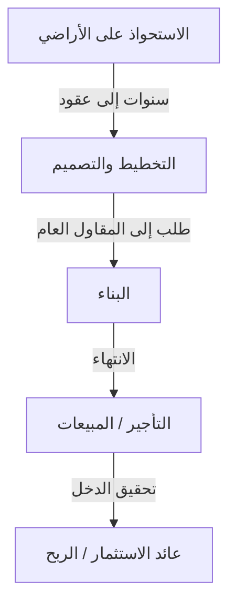
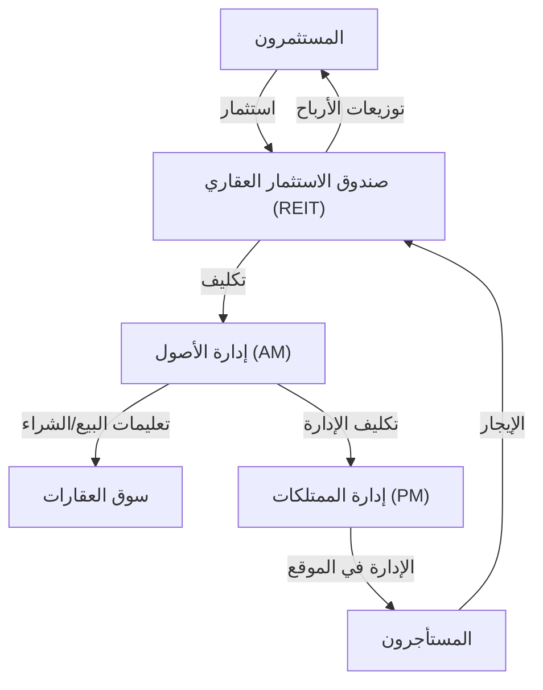

## مقدمة: المدينة ككائن حي عملاق

الطرق الممهدة التي نمشي عليها كل يوم، وناطحات السحاب التي ننظر إليها، والمنازل التي نجد فيها السلام. كل هذا يتم إنشاؤه وصيانته بواسطة نظام بيئي ضخم يُعرف باسم "صناعة العقارات". لا يقتصر مفهوم العقار على كونه "أصلاً غير منقول" فحسب. بل هو أساس حياة الناس، ومسرح للأنشطة الاقتصادية للشركات، ومنتج مالي تدور فيه أموال الاستثمار العالمية.

في هذه المقالة، سنتعمق في كيفية هيكلة هذه المنطقة الاقتصادية الضخمة وما هي الآليات التي تحركها، من منظور مادي وتاريخي واقتصادي وتكنولوجي. كيف يجد المطورون القيمة في الأراضي الفارغة، وكيف يضمن الوسطاء سيولة السوق، وكيف نجحت صناديق الاستثمار العقاري (REITs) في الارتقاء بالعقارات لتصبح منتجاً مالياً. سنقترب من الصورة الكاملة لنماذج الأعمال للأشخاص الذين يصنعون المدن ويحركونها.

---

## 1. الخلفية التاريخية والمادية لصناعة العقارات

### 1.1. تاريخ ملكية الأراضي ونشأة الرأسمالية

يعود مفهوم العقارات إلى العصر الذي بدأت فيه البشرية بالزراعة والعيش في مجتمعات مستقرة. أصبحت الأرض مصدراً للثروة، وتطورت الدول والأنظمة القانونية حولها. في الرأسمالية الحديثة، يُعترف بالأرض كملكية خاصة، وحقوقها محمية قانونياً من خلال نظام التسجيل.

مع توضيح ملكية الأراضي، أصبح من الممكن اقتراض الأموال باستخدام الأراضي كضمان (الرهن العقاري)، مما أصبح أساساً لخلق الائتمان الحديث. وبعبارة أخرى، أصبحت العقارات تلعب دوراً ليس فقط كمساحة مادية ولكن أيضاً كمحرك يدفع الاقتصاد المالي.

### 1.2. فيزياء البناء وتطور الهندسة

هناك عامل آخر يحدد قيمة العقارات وهو القيود المادية للمباني وتاريخ التغلب عليها. في أواخر القرن التاسع عشر، مع اختراع الهياكل الفولاذية والمصاعد، تمكنت البشرية من توسيع المساحة "إلى الأعلى".

يتطلب بناء ناطحات السحاب هندسة جيوتقنية وميكانيكا إنشائية متقدمة. لبناء هيكل ضخم على أرض رخوة، من الضروري دق الركائز في أعماق الطبقة الداعمة (الصخور الصلبة). بالإضافة إلى ذلك، يجب ألا تتحمل المباني الشاهقة وزنها فحسب، بل يجب أن تتحمل أيضاً أحمال الرياح والحركة الزلزالية. يدعم تطور تقنيات التحكم في الاهتزازات مثل مخمدات الكتلة وهياكل العزل الزلزالي قيمة العقارات الحضرية (تعظيم نسبة المساحة الطابقية) من الجانب المادي.

---

## 2. اللاعبون الرئيسيون الذين يشكلون صناعة العقارات

تنقسم صناعة العقارات بشكل عام إلى ثلاث مراحل: "الإنشاء (التطوير)"، و"التداول (الوساطة)"، و"الإدارة والتشغيل (إدارة الممتلكات وإدارة الأصول)"، ويوجد لاعبون متخصصون لكل منها.

### 2.1. المطورون (الشركات العقارية الشاملة): صناع المدن

المطورون هم "منتجو تخطيط المدن" الذين يستحوذون على الأراضي الفارغة (أو الأراضي التي تحتوي على مبانٍ قديمة)، ويقومون ببناء مباني المكاتب والمرافق التجارية والمجمعات السكنية وما إلى ذلك، ويخلقون قيمة جديدة.

- **الاستحواذ على الأراضي:** هذه هي المرحلة الأصعب والأكثر أهمية. يقومون بتوحيد الأراضي من خلال مفاوضات مستمرة مع ملاك الأراضي (أحياناً تمتد مشاريع إعادة التطوير لعقود).
- **التخطيط والتصميم:** يحددون الاستخدام والتصميم الذي يعظم من إمكانات الأرض (اللوائح القانونية مثل تقسيم المناطق، ونسبة المساحة الطابقية، ونسبة تغطية البناء).
- **ترويج المشروع:** يطلبون البناء من المقاولين العامين ويديرون التقدم والميزانية للمشروع بأكمله.
- **التأجير والمبيعات:** يجذبون المستأجرين للمبنى المكتمل أو يبيعونه كمجمعات سكنية للمشترين الأفراد.

نموذج عمل المطور هو نموذج "عالي المخاطر وعالي العائد" يتضمن استثمارات أولية ضخمة. يقومون بتدبير الأموال على نطاق يتراوح من عشرات المليارات إلى مئات المليارات من الين من المؤسسات المالية (تمويل المشاريع، إلخ) ويستردونها من خلال أرباح رأس المال عند البيع بعد الانتهاء أو من إيرادات الإيجار (مكاسب الدخل).

### 2.2. الوساطة العقارية (الوسطاء): مادة التشحيم للسوق

كما يقولون في العقارات، "عقار واحد، سعر واحد" - لا يوجد عقاران متطابقان تماماً في العالم. في سوق يكون فيه التفاوت في المعلومات كبيراً جداً، يتمثل دور الوسطاء في ربط البائعين والمشترين، وأصحاب العقارات والمستأجرين.

المصدر الرئيسي لدخل الوسطاء هو "رسوم الوساطة". يضمن الوسطاء معاملات آمنة باستخدام المعرفة المتخصصة، مثل التحقيقات العقارية، وتوضيح المسائل المهمة، وصياغة العقود، ودعم فحوصات القروض.

في السنوات الأخيرة، مع صعود تكنولوجيا العقارات (PropTech)، تتقدم الابتكارات مثل تقييمات الأسعار القائمة على الذكاء الاصطناعي وجولات الواقع الافتراضي (VR) لزيادة شفافية المعلومات وخفض تكاليف المعاملات.

### 2.3. إدارة الممتلكات (PM) وصيانة المباني (BM): الحفاظ على القيمة وتحسينها

يبدأ المبنى في التدهور بمجرد اكتماله. الإدارة السليمة ضرورية للحفاظ على قيمة العقار وتحسينها على المدى الطويل.

- **إدارة الممتلكات (PM):** بالنيابة عن المالك، تتولى إدارة الممتلكات "الجوانب المرنة" من الإدارة، مثل توظيف المستأجرين، وإدارة العقود، وجمع الإيجار، والتعامل مع الشكاوى، لتعظيم التدفق النقدي للعقار.
- **صيانة المباني (BM):** هذه الإدارة مسؤولة عن "الجوانب الصلبة" من الصيانة والإدارة، مثل التنظيف، وفحص المعدات، والأمن، وصياغة خطط الإصلاح.

---

## 3. اندماج التمويل والعقارات: تأثير صناديق الاستثمار العقاري (REITs)

في تاريخ صناعة العقارات، كان ميلاد صناديق الاستثمار العقاري (REITs) حدثاً ثورياً. صندوق الاستثمار العقاري هو منتج مالي يستخدم الأموال المجمعة من العديد من المستثمرين لشراء العقارات مثل مباني المكاتب والمرافق التجارية والمرافق اللوجستية، ويوزع إيرادات الإيجار ومكاسب رأس المال التي تم الحصول عليها منها على المستثمرين.

### 3.1. التحول النموذجي الذي أحدثته صناديق الاستثمار العقاري

تقليدياً، كانت العقارات الكبيرة الممتازة (الأصول الممتازة) أصولاً "غير سائلة" لا يمكن إلا لعدد قليل من الشركات الكبيرة والأفراد الأثرياء الاحتفاظ بها. ومع ذلك، مع ظهور صناديق الاستثمار العقاري، تم توريق العقارات، مما جعل من الممكن حتى لمستثمري التجزئة العاديين أن يصبحوا مالكين (لجزء من الحقوق) لمباني المكاتب الكبيرة والفنادق الفاخرة بدءاً من مبالغ صغيرة.

### 3.2. هيكل أعمال صناديق الاستثمار العقاري

ينطوي هيكل صندوق الاستثمار العقاري على لوائح قانونية صارمة لمنع تضارب المصالح وتقسيم العمل بين اللاعبين المتخصصين.

- **شركة الاستثمار:** الكيان الذي يمتلك العقار. هي شركة ورقية ليس لها وجود مادي حقيقي.
- **شركة إدارة الأصول (AM):** مكلفة من قبل شركة الاستثمار، تتخذ شركة إدارة الأصول قرارات استثمارية متقدمة وتدير المحفظة فيما يتعلق بالعقارات التي يجب شراؤها وبيعها.
- **شركة إدارة الممتلكات (PM):** بتوجيهات من شركة إدارة الأصول (AM)، تقوم بإدارة العقارات الفردية في الموقع.
- **أمين الحفظ / الوصي الإداري العام:** يتولى حفظ الأصول والحسابات الإدارية للشركة.

### 3.3. سحر معدل الرسملة (Cap Rate)

أحد أهم المقاييس في عالم الاستثمار العقاري هو "معدل الرسملة" (Cap Rate).
يتم حسابه بقسمة صافي الدخل التشغيلي (NOI) على سعر العقار ويمثل العائد المتوقع الذي يطلبه المستثمرون من ذلك العقار.

`سعر العقار = صافي الدخل التشغيلي (NOI) / معدل الرسملة`

ما يعنيه هذا القانون هو أنه حتى لو ظل الإيجار (صافي الدخل التشغيلي) ثابتاً، إذا انخفض معدل الرسملة في السوق (بسبب انخفاض أسعار الفائدة أو اشتداد المنافسة السعرية نتيجة تدفق أموال الاستثمار)، فسيرتفع سعر العقار. يتحرك سوق العقارات الحديث بشكل وثيق مع اتجاهات أسعار الفائدة في الاقتصاد الكلي وحركات رأس المال العالمي.

---

## 4. مدينة المستقبل وتوقعات صناعة العقارات

إن الاستجابات لتغير المناخ (الاستثمار البيئي والاجتماعي والمؤسسي ESG، وتشجيع المباني الخضراء)، والتغيرات في التركيبة السكانية (شيخوخة السكان وتركز السكان في المدن)، وتطور التكنولوجيا (المدن الذكية، والميتافيرس) تجبر صناعة العقارات على تحول نموذجي جديد.

الانتقال من نموذج عمل "توفير المساحة" إلى نموذج عمل "توفير التجارب والبيانات من خلال المساحة". تعيش صناعة العقارات حالياً في خضم تحدٍ كبير لإعادة تعريف المدينة كـ "نظام تشغيل" يدعم الأنشطة البشرية، متجاوزة مجرد بناء الصناديق.

الجبهة التي يتقاطع فيها أصل الأرض العالمي المحدود مع التكنولوجيا البشرية ورغباتها. ستستمر صناعة العقارات في كونها المنطقة الاقتصادية الأكثر ديناميكية وروعة.
