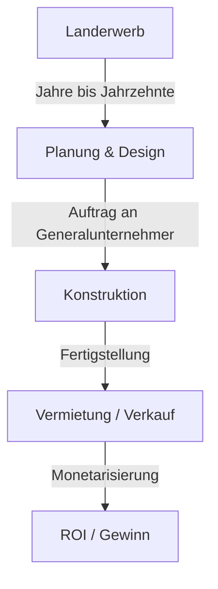
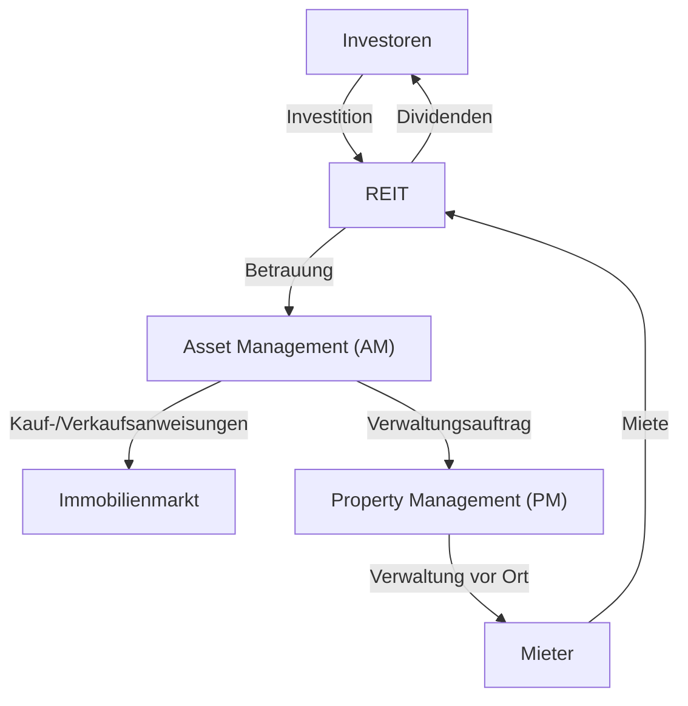

## Einführung: Die Stadt als riesiger Organismus

Die asphaltierten Straßen, auf denen wir jeden Tag gehen, die Wolkenkratzer, zu denen wir aufblicken, und die Häuser, in denen wir Ruhe finden. All dies wird durch ein riesiges Ökosystem erschaffen und instand gehalten, das als "Immobilienbranche" bekannt ist. Eine Immobilie ist nicht nur ein "unbewegliches Wirtschaftsgut". Sie ist das Fundament des Lebens der Menschen, die Bühne für wirtschaftliche Aktivitäten von Unternehmen und ein Finanzprodukt, in dem globales Investitionskapital zirkuliert.

In diesem Artikel werden wir tief in die Struktur dieser gewaltigen Wirtschaftszone eintauchen und untersuchen, welche Mechanismen sie antreiben, und zwar aus physikalischer, historischer, wirtschaftlicher und technologischer Sicht. Wie Entwickler Wert in leerem Land finden, wie Makler die Marktliquidität sicherstellen und wie REITs (Real Estate Investment Trusts) Immobilien zu einem Finanzprodukt sublimiert haben. Wir werden uns dem Gesamtbild der Geschäftsmodelle der Menschen nähern, die Städte erschaffen und bewegen.

---

## 1. Historischer und physikalischer Hintergrund der Immobilienbranche

### 1.1. Die Geschichte des Landbesitzes und die Entstehung des Kapitalismus

Das Konzept der Immobilie reicht zurück bis in die Zeit, als die Menschheit begann, Landwirtschaft zu betreiben und in sesshaften Gemeinschaften zu leben. Land wurde zu einer Quelle des Reichtums, und Nationen sowie Rechtssysteme wurden um es herum entwickelt. Im modernen Kapitalismus wird Land als Privateigentum anerkannt, und seine Rechte werden durch ein Registrierungssystem rechtlich geschützt.

Mit der Klärung des Landbesitzes wurde es möglich, Gelder aufzunehmen und dabei Land als Sicherheit (Hypothek) zu verwenden, was zum Fundament der modernen Kreditschöpfung wurde. Mit anderen Worten, Immobilien begannen eine Rolle nicht nur als physischer Raum zu spielen, sondern auch als Motor, der die Finanzwirtschaft antreibt.

### 1.2. Die Physik des Bauens und die Evolution des Ingenieurwesens

Ein weiterer Faktor, der den Wert von Immobilien bestimmt, sind die physischen Einschränkungen von Gebäuden und die Geschichte ihrer Überwindung. Im späten 19. Jahrhundert, mit der Erfindung von Stahlrahmen und Aufzügen, war die Menschheit in der Lage, den Raum "nach oben" zu erweitern.

Der Bau von Wolkenkratzern erfordert fortgeschrittene Geotechnik und Baustatik. Um eine massive Struktur auf weichem Boden zu errichten, ist es notwendig, Pfähle tief in die tragende Schicht (Grundgestein) zu treiben. Darüber hinaus müssen Hochhäuser nicht nur ihrem eigenen Gewicht standhalten, sondern auch Windlasten und seismischen Bewegungen. Die Entwicklung von Schwingungsdämpfungstechnologien wie Tilgerpendeln (Massedämpfern) und seismischen Isolationsstrukturen unterstützt den Wert städtischer Immobilien (Maximierung der Geschossflächenzahl) unter physikalischen Aspekten.

---

## 2. Hauptakteure der Immobilienbranche

Die Immobilienbranche ist im Groben in drei Phasen unterteilt: "Erschaffen (Entwicklung)", "Zirkulieren (Maklergeschäft)" und "Verwalten und Betreiben (Property Management und Asset Management)", für die jeweils spezialisierte Akteure existieren.

### 2.1. Entwickler (Umfassende Immobilienunternehmen): Erschaffer von Städten

Entwickler sind die "Produzenten der Stadtplanung", die leeres Land (oder Land mit alten Gebäuden) erwerben, Bürogebäude, kommerzielle Einrichtungen, Eigentumswohnungen usw. bauen und neuen Wert schaffen.

- **Landerwerb:** Dies ist die schwierigste und wichtigste Phase. Sie konsolidieren Land durch hartnäckige Verhandlungen mit Grundbesitzern (manchmal durch Sanierungsprojekte, die Jahrzehnte dauern).
- **Planung und Design:** Sie bestimmen die Nutzung und das Design, die das Potenzial des Landes maximieren (gesetzliche Vorschriften wie Zoneneinteilung, Geschossflächenzahl und Grundflächenzahl).
- **Projektförderung:** Sie beauftragen Generalunternehmer mit dem Bau und verwalten den Fortschritt und das Budget des gesamten Projekts.
- **Vermietung und Verkauf:** Sie werben Mieter für das fertiggestellte Gebäude an oder verkaufen es als Eigentumswohnungen an Einzelkäufer.

Das Geschäftsmodell des Entwicklers ist ein "High-Risk, High-Return"-Modell, das mit enormen Vorabinvestitionen verbunden ist. Sie beschaffen Mittel in der Größenordnung von zweistelligen bis dreistelligen Milliarden-Yen-Beträgen von Finanzinstituten (Projektfinanzierung usw.) und verdienen sie durch Kapitalgewinne beim Verkauf nach Fertigstellung oder durch Mieteinnahmen (Einkommensgewinne) zurück.

### 2.2. Immobilienmakler (Makler): Das Schmiermittel des Marktes

Wie man in der Immobilienbranche sagt: "Eine Immobilie, ein Preis" – es gibt keine zwei völlig identischen Immobilien auf der Welt. In einem Markt, in dem die Informationsasymmetrie extrem groß ist, besteht die Rolle von Maklern darin, Verkäufer und Käufer sowie Vermieter und Mieter zusammenzubringen.

Die Haupteinnahmequelle von Maklern ist die "Maklerprovision". Makler gewährleisten sichere Transaktionen mithilfe von Fachwissen, wie z.B. Immobilienuntersuchungen, Erklärungen wichtiger Sachverhalte, der Ausarbeitung von Verträgen und der Unterstützung bei der Kreditprüfung.

In den letzten Jahren sind mit dem Aufstieg der PropTech Innovationen wie KI-basierte Preisbewertungen und VR-Besichtigungen auf dem Vormarsch, um die Transparenz von Informationen zu erhöhen und Transaktionskosten zu senken.

### 2.3. Property Management (PM) und Building Maintenance (BM): Werterhaltung und -steigerung

Ein Gebäude beginnt in dem Moment zu verfallen, in dem es fertiggestellt ist. Eine ordnungsgemäße Verwaltung ist unerlässlich, um den Wert von Immobilien langfristig zu erhalten und zu steigern.

- **Property Management (PM):** Im Auftrag des Eigentümers kümmert sich das PM um die "weichen Aspekte" der Verwaltung, wie die Mieterakquise, das Vertragsmanagement, den Einzug der Miete und die Bearbeitung von Beschwerden, um den Cashflow der Immobilie zu maximieren.
- **Building Maintenance (BM):** Das PM ist verantwortlich für die "harten Aspekte" der Instandhaltung und Verwaltung, wie Reinigung, Anlageninspektionen, Sicherheit und die Ausarbeitung von Reparaturplänen.

---

## 3. Die Verschmelzung von Finanzen und Immobilien: Der Einfluss von REITs

In der Geschichte der Immobilienbranche war die Entstehung von REITs (Real Estate Investment Trusts) ein revolutionäres Ereignis. Ein REIT ist ein Finanzprodukt, das die von vielen Investoren gesammelten Gelder verwendet, um Immobilien wie Bürogebäude, gewerbliche Einrichtungen und Logistikanlagen zu kaufen, und die daraus erzielten Mieteinnahmen und Kapitalgewinne an die Investoren ausschüttet.

### 3.1. Der durch REITs herbeigeführte Paradigmenwechsel

Traditionell waren erstklassige groß angelegte Immobilien (Prime Assets) "illiquide" Vermögenswerte, die nur wenige Großkonzerne und wohlhabende Einzelpersonen halten konnten. Mit dem Aufkommen von REITs wurden Immobilien jedoch verbrieft, was es selbst normalen Kleinanlegern ermöglichte, bereits mit geringen Beträgen Eigentümer (eines Teils der Rechte) großer Bürogebäude und Luxushotels zu werden.

### 3.2. Die Geschäftsstruktur von REITs

Die Struktur eines REIT beinhaltet strenge gesetzliche Vorschriften, um Interessenkonflikte zu vermeiden, sowie eine Arbeitsteilung zwischen spezialisierten Akteuren.

- **Investmentgesellschaft:** Die Gesellschaft, die die Immobilien hält. Sie ist eine Briefkastenfirma ohne physische Substanz.
- **Asset Management Gesellschaft (AM):** Im Auftrag der Investmentgesellschaft trifft das AM fortschrittliche Investitionsentscheidungen und verwaltet das Portfolio in Bezug darauf, welche Immobilien gekauft und verkauft werden.
- **Property Management Gesellschaft (PM):** Nach Anweisung der AM-Gesellschaft führt das PM die Verwaltung einzelner Immobilien vor Ort durch.
- **Verwahrstelle / Allgemeine Verwaltungsstelle:** Kümmert sich um die Verwahrung von Vermögenswerten und die administrativen Berechnungen der Gesellschaft.

### 3.3. Die Magie der Kapitalisierungsrate (Cap Rate)

Eine der wichtigsten Kennzahlen in der Welt der Immobilieninvestitionen ist die "Cap Rate" (Kapitalisierungsrate).
Sie wird berechnet, indem das Nettobetriebsergebnis (Net Operating Income, NOI) durch den Immobilienpreis dividiert wird, und stellt die erwartete Rendite dar, die Investoren von dieser Immobilie verlangen.

`Immobilienpreis = Nettobetriebsergebnis (NOI) / Cap Rate`

Was diese Formel bedeutet, ist, dass selbst bei konstanter Miete (NOI) der Immobilienpreis steigt, wenn die Markt-Cap-Rate sinkt (aufgrund niedrigerer Zinssätze oder verschärften Preiswettbewerbs durch den Zufluss von Investitionskapital). Der moderne Immobilienmarkt bewegt sich eng mit den makroökonomischen Zinstrends und den globalen Kapitalbewegungen.

---

## 4. Die Stadt der Zukunft und die Aussichten der Immobilienbranche

Reaktionen auf den Klimawandel (ESG-Investitionen, Förderung grüner Gebäude), demografische Veränderungen (alternde Bevölkerung und Bevölkerungskonzentration in Städten) und die technologische Entwicklung (Smart Cities, Metaverse) erzwingen einen neuen Paradigmenwechsel in der Immobilienbranche.

Der Übergang von einem Geschäftsmodell der "Bereitstellung von Raum" zu einem Geschäftsmodell der "Bereitstellung von Erlebnissen und Daten durch Raum". Die Immobilienbranche befindet sich derzeit inmitten einer großen Herausforderung, die Stadt als "Betriebssystem" neu zu definieren, das menschliche Aktivitäten unterstützt und über den bloßen Bau von Kisten hinausgeht.

Die Grenze, an der das universelle, endliche Gut Land mit menschlicher Technologie und Begierde zusammentrifft. Die Immobilienbranche wird weiterhin die dynamischste und faszinierendste Wirtschaftszone bleiben.