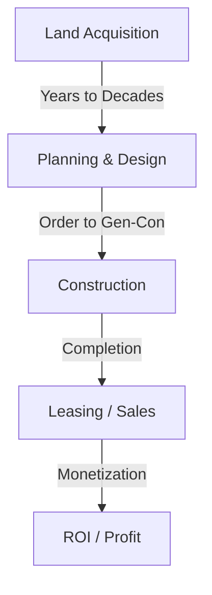
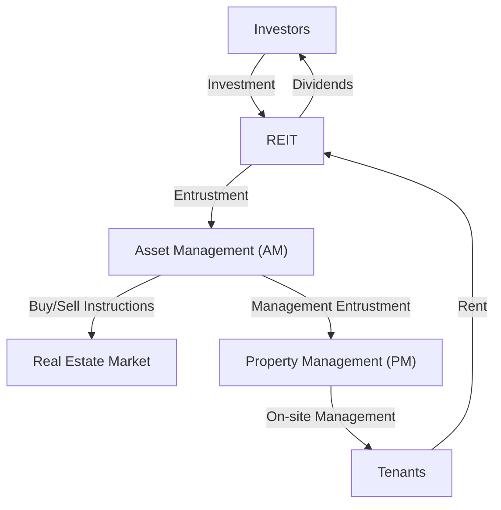

## Introduction: The City as a Giant Organism

The paved roads we walk on every day, the skyscrapers we look up to, and the homes where we find peace. All of these are created and maintained by a massive ecosystem known as the "Real Estate Industry." Real Estate is not merely an "immovable asset." It is the foundation of people's lives, the stage for corporate economic activities, and a financial product where global investment money circulates.

In this article, we will delve deeply into how this massive economic zone is structured and what mechanisms drive it, from physical, historical, economic, and technological perspectives. How developers find value in empty land, how brokers ensure market liquidity, and how REITs (Real Estate Investment Trusts) have sublimated real estate into a financial product. We will approach the entire picture of the business models of the people who create and move cities.

---

## 1. Historical and Physical Background of the Real Estate Industry

### 1.1. The History of Land Ownership and the Birth of Capitalism

The concept of real estate dates back to the era when humanity began farming and living in settled communities. Land became a source of wealth, and nations and legal systems were developed around it. In modern capitalism, land is recognized as private property, and its rights are legally protected by a registration system.

With the clarification of land ownership, it became possible to borrow funds using land as collateral (mortgage), which became the foundation of modern credit creation. In other words, real estate came to play a role not only as physical space but also as an engine driving the financial economy.

### 1.2. The Physics of Construction and the Evolution of Engineering

Another factor that determines the value of real estate is the physical constraints of buildings and the history of overcoming them. In the late 19th century, with the invention of steel frames and elevators, humanity was able to expand space "upwards."

The construction of skyscrapers requires advanced geotechnical engineering and structural mechanics. To build a massive structure on soft ground, it is necessary to drive piles deep into the supporting layer (bedrock). In addition, high-rise buildings must withstand not only their own weight but also wind loads and seismic motion. The evolution of vibration control technologies such as mass dampers and seismic isolation structures supports the value of urban real estate (maximization of the floor area ratio) from a physical aspect.

---

## 2. Major Players Comprising the Real Estate Industry

The real estate industry is broadly divided into three phases: "Creating (Development)," "Circulating (Brokerage)," and "Managing and Operating (Property Management and Asset Management)," and specialized players exist for each.

### 2.1. Developers (Comprehensive Real Estate Companies): Creators of Cities

Developers are the "producers of city planning" who acquire empty land (or land with old buildings), construct office buildings, commercial facilities, condominiums, etc., and create new value.

- **Land Acquisition:** This is the most difficult and important phase. They consolidate land through persistent negotiations with landowners (sometimes redevelopment projects spanning decades).
- **Planning and Design:** They determine the use and design that maximize the potential of the land (legal regulations such as zoning, floor area ratio, and building coverage ratio).
- **Project Promotion:** They order construction from general contractors and manage the progress and budget of the entire project.
- **Leasing and Sales:** They attract tenants for the completed building or sell it as condominiums to individual buyers.

The developer's business model is a "high-risk, high-return" model that involves massive upfront investment. They procure funds on the scale of tens of billions to hundreds of billions of yen from financial institutions (project finance, etc.) and recover them through capital gains upon sale after completion or rental income (income gains).

### 2.2. Real Estate Brokerage (Brokers): The Lubricant of the Market

As they say in real estate, "One property, one price"—no two completely identical properties exist in the world. In a market where information asymmetry is extremely large, the role of brokers is to connect sellers and buyers, and landlords and tenants.

The main source of income for brokers is the "brokerage fee." Brokers ensure safe transactions using specialized knowledge, such as property investigations, explanations of important matters, drafting contracts, and supporting loan screenings.

In recent years, with the rise of PropTech, innovations such as AI-based price assessments and VR viewings are progressing to increase the transparency of information and lower transaction costs.

### 2.3. Property Management (PM) and Building Maintenance (BM): Maintaining and Improving Value

A building begins to deteriorate the moment it is completed. Proper management is essential to maintain and improve the value of real estate over the long term.

- **Property Management (PM):** On behalf of the owner, PM handles the "soft aspects" of management, such as recruiting tenants, managing contracts, collecting rent, and handling complaints, to maximize the real estate's cash flow.
- **Building Maintenance (BM):** PM is responsible for the "hard aspects" of maintenance and management, such as cleaning, equipment inspections, security, and drafting repair plans.

---

## 3. The Fusion of Finance and Real Estate: The Impact of REITs

In the history of the real estate industry, the birth of REITs (Real Estate Investment Trusts) was a revolutionary event. A REIT is a financial product that uses funds collected from many investors to purchase real estate such as office buildings, commercial facilities, and logistics facilities, and distributes the rental income and capital gains obtained from them to investors.

### 3.1. The Paradigm Shift Brought by REITs

Traditionally, prime large-scale real estate (prime assets) were "illiquid" assets that only a few large corporations and wealthy individuals could hold. However, with the advent of REITs, real estate was securitized, making it possible for even ordinary retail investors to become owners (of a portion of the rights) of large office buildings and luxury hotels starting from small amounts.

### 3.2. The Business Structure of REITs

The structure of a REIT involves strict legal regulations to prevent conflicts of interest and a division of labor among specialized players.

- **Investment Corporation:** The vehicle that holds the real estate. It is a paper company with no physical substance.
- **Asset Management Company (AM):** Entrusted by the investment corporation, AM makes advanced investment decisions and manages the portfolio regarding which properties to buy and sell.
- **Property Management Company (PM):** Under instructions from the AM company, PM performs on-site management of individual properties.
- **Custodian / General Administrative Trustee:** Handles the custody of assets and the administrative calculations of the corporation.

### 3.3. The Magic of the Cap Rate (Capitalization Rate)

One of the most important metrics in the world of real estate investing is the "Cap Rate."
It is calculated by dividing the Net Operating Income (NOI) by the real estate price and represents the expected yield investors demand from that real estate.

`Real Estate Price = Net Operating Income (NOI) / Cap Rate`

What this formula means is that even if the rent (NOI) remains constant, if the market cap rate decreases (due to lower interest rates or intensified price competition from the influx of investment money), the real estate price will rise. The modern real estate market moves closely with macroeconomic interest rate trends and global capital movements.

---

## 4. The Future City and the Outlook of the Real Estate Industry

Responses to climate change (ESG investing, promotion of green buildings), changes in demographics (aging populations and concentration of population in cities), and the evolution of technology (smart cities, metaverse) are forcing a new paradigm shift in the real estate industry.

The transition from a business model of "providing space" to a business model of "providing experiences and data through space." The real estate industry is currently in the midst of a grand challenge to redefine the city as an "operating system" that supports human activities, moving beyond the mere construction of boxes.

The frontier where the universal finite asset of land intersects with human technology and desire. The real estate industry will continue to be the most dynamic and fascinating economic zone.
