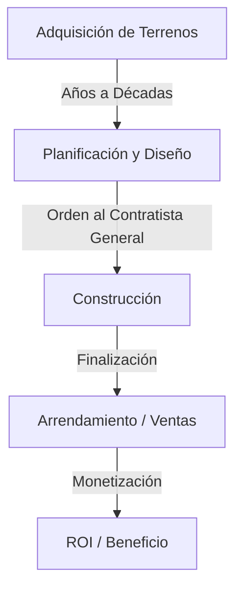
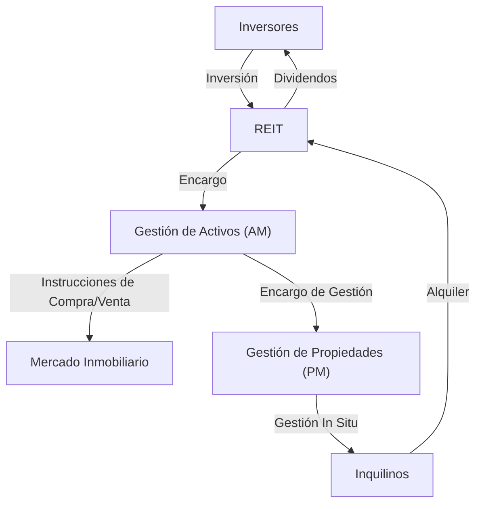

## Introducción: La Ciudad como un Organismo Gigante

Los caminos pavimentados por los que caminamos todos los días, los rascacielos que admiramos y los hogares donde encontramos paz. Todos estos son creados y mantenidos por un ecosistema masivo conocido como la "Industria Inmobiliaria". Los bienes raíces no son meramente un "activo inamovible". Son la base de la vida de las personas, el escenario de las actividades económicas corporativas y un producto financiero donde circula el dinero de inversión global.

En este artículo, profundizaremos en cómo está estructurada esta zona económica masiva y qué mecanismos la impulsan, desde perspectivas físicas, históricas, económicas y tecnológicas. Cómo los desarrolladores encuentran valor en terrenos baldíos, cómo los corredores aseguran la liquidez del mercado y cómo los REIT (Fideicomisos de Inversión en Bienes Raíces) han sublimado los bienes raíces en un producto financiero. Abordaremos el panorama completo de los modelos de negocio de las personas que crean y mueven ciudades.

---

## 1. Antecedentes Históricos y Físicos de la Industria Inmobiliaria

### 1.1. La Historia de la Propiedad de la Tierra y el Nacimiento del Capitalismo

El concepto de bienes raíces se remonta a la era en que la humanidad comenzó a cultivar y vivir en comunidades asentadas. La tierra se convirtió en una fuente de riqueza, y las naciones y los sistemas legales se desarrollaron en torno a ella. En el capitalismo moderno, la tierra es reconocida como propiedad privada y sus derechos están legalmente protegidos por un sistema de registro.

Con la clarificación de la propiedad de la tierra, fue posible tomar fondos prestados usando la tierra como garantía (hipoteca), lo que se convirtió en la base de la creación de crédito moderno. En otras palabras, los bienes raíces llegaron a desempeñar un papel no solo como espacio físico sino también como un motor que impulsa la economía financiera.

### 1.2. La Física de la Construcción y la Evolución de la Ingeniería

Otro factor que determina el valor de los bienes raíces son las limitaciones físicas de los edificios y la historia de cómo superarlas. A fines del siglo XIX, con la invención de los marcos de acero y los ascensores, la humanidad pudo expandir el espacio "hacia arriba".

La construcción de rascacielos requiere ingeniería geotécnica y mecánica estructural avanzadas. Para construir una estructura masiva en terreno blando, es necesario hincar pilotes a gran profundidad en la capa de soporte (lecho de roca). Además, los edificios de gran altura deben soportar no solo su propio peso sino también las cargas del viento y el movimiento sísmico. La evolución de las tecnologías de control de vibraciones, como los amortiguadores de masa y las estructuras de aislamiento sísmico, apoya el valor de los bienes raíces urbanos (maximización de la relación de superficie edificable) desde un aspecto físico.

---

## 2. Principales Actores que Componen la Industria Inmobiliaria

La industria inmobiliaria se divide ampliamente en tres fases: "Creación (Desarrollo)", "Circulación (Corretaje)" y "Gestión y Operación (Gestión de Propiedades y Gestión de Activos)", y existen actores especializados para cada una.

### 2.1. Desarrolladores (Empresas Inmobiliarias Integrales): Creadores de Ciudades

Los desarrolladores son los "productores de la planificación urbana" que adquieren terrenos baldíos (o terrenos con edificios antiguos), construyen edificios de oficinas, instalaciones comerciales, condominios, etc., y crean nuevo valor.

- **Adquisición de Terrenos:** Esta es la fase más difícil e importante. Consolidan la tierra a través de negociaciones persistantes con los propietarios de tierras (a veces proyectos de reurbanización que abarcan décadas).
- **Planificación y Diseño:** Determinan el uso y diseño que maximizan el potencial del terreno (regulaciones legales como zonificación, relación de superficie edificable y proporción de cobertura de edificios).
- **Promoción de Proyectos:** Encargan la construcción a contratistas generales y gestionan el progreso y el presupuesto de todo el proyecto.
- **Arrendamiento y Ventas:** Atraen inquilinos para el edificio terminado o lo venden como condominios a compradores individuales.

El modelo de negocio del desarrollador es un modelo de "alto riesgo y alta rentabilidad" que implica una inversión inicial masiva. Obtienen fondos en la escala de decenas de miles de millones a cientos de miles de millones de yenes de instituciones financieras (financiamiento de proyectos, etc.) y los recuperan a través de ganancias de capital en la venta después de la finalización o ingresos por alquiler (ganancias de ingresos).

### 2.2. Corretaje Inmobiliario (Corredores): El Lubricante del Mercado

Como dicen en el sector inmobiliario, "Una propiedad, un precio": no existen dos propiedades completamente idénticas en el mundo. En un mercado donde la asimetría de la información es extremadamente grande, el papel de los corredores es conectar a vendedores y compradores, y a propietarios e inquilinos.

La principal fuente de ingresos de los corredores es la "comisión de corretaje". Los corredores garantizan transacciones seguras utilizando conocimientos especializados, como investigaciones de propiedades, explicaciones de asuntos importantes, redacción de contratos y apoyo en la evaluación de préstamos.

En los últimos años, con el auge de PropTech, innovaciones como las evaluaciones de precios basadas en IA y las visualizaciones en realidad virtual están avanzando para aumentar la transparencia de la información y reducir los costos de transacción.

### 2.3. Gestión de Propiedades (PM) y Mantenimiento de Edificios (BM): Mantener y Mejorar el Valor

Un edificio comienza a deteriorarse en el momento en que se termina. Una gestión adecuada es esencial para mantener y mejorar el valor de los bienes raíces a largo plazo.

- **Gestión de Propiedades (PM):** En nombre del propietario, PM maneja los "aspectos blandos" de la gestión, como reclutar inquilinos, gestionar contratos, cobrar alquileres y manejar quejas, para maximizar el flujo de caja de los bienes raíces.
- **Mantenimiento de Edificios (BM):** PM es responsable de los "aspectos duros" del mantenimiento y la gestión, como la limpieza, inspecciones de equipos, seguridad y redacción de planes de reparación.

---

## 3. La Fusión de las Finanzas y los Bienes Raíces: El Impacto de los REITs

En la historia de la industria inmobiliaria, el nacimiento de los REIT (Fideicomisos de Inversión en Bienes Raíces) fue un evento revolucionario. Un REIT es un producto financiero que utiliza fondos recaudados de muchos inversores para comprar bienes raíces, como edificios de oficinas, instalaciones comerciales e instalaciones logísticas, y distribuye los ingresos por alquileres y las ganancias de capital obtenidas de ellos a los inversores.

### 3.1. El Cambio de Paradigma Traído por los REITs

Tradicionalmente, los bienes raíces de gran escala de primera calidad (activos de primera) eran activos "ilíquidos" que solo unas pocas grandes corporaciones e individuos ricos podían mantener. Sin embargo, con el advenimiento de los REIT, los bienes raíces se titularizaron, haciendo posible que incluso los inversores minoristas comunes se conviertan en propietarios (de una parte de los derechos) de grandes edificios de oficinas y hoteles de lujo a partir de pequeñas cantidades.

### 3.2. La Estructura de Negocio de los REITs

La estructura de un REIT implica regulaciones legales estrictas para evitar conflictos de intereses y una división del trabajo entre actores especializados.

- **Sociedad de Inversión:** El vehículo que posee los bienes raíces. Es una empresa de papel sin sustancia física.
- **Empresa de Gestión de Activos (AM):** Por encargo de la sociedad de inversión, AM toma decisiones de inversión avanzadas y gestiona la cartera sobre qué propiedades comprar y vender.
- **Empresa de Gestión de Propiedades (PM):** Bajo las instrucciones de la empresa AM, PM realiza la gestión in situ de las propiedades individuales.
- **Custodio / Fiduciario Administrativo General:** Maneja la custodia de los activos y los cálculos administrativos de la sociedad.

### 3.3. La Magia de la Tasa de Capitalización (Cap Rate)

Una de las métricas más importantes en el mundo de la inversión inmobiliaria es la "Tasa de Capitalización" (Cap Rate).
Se calcula dividiendo el Ingreso Operativo Neto (NOI) por el precio del inmueble y representa el rendimiento esperado que los inversores exigent de ese inmueble.

`Precio del Inmueble = Ingreso Operativo Neto (NOI) / Tasa de Capitalización`

Lo que significa esta fórmula es que incluso si el alquiler (NOI) permanece constante, si la tasa de capitalización del mercado disminuye (debido a tasas de interés más bajas o una mayor competencia de precios por la afluencia de dinero de inversión), el precio del inmueble aumentará. El mercado inmobiliario moderno se mueve en estrecha relación con las tendencias de las tasas de interés macroeconómicas y los movimientos de capital globales.

---

## 4. La Ciudad del Futuro y las Perspectivas de la Industria Inmobiliaria

Las respuestas al cambio climático (inversión ESG, promoción de edificios ecológicos), los cambios en la demografía (envejecimiento de las poblaciones y concentración de la población en las ciudades) y la evolución de la tecnología (ciudades inteligentes, metaverso) están forzando un nuevo cambio de paradigma en la industria inmobiliaria.

La transición de un modelo de negocio de "proporcionar espacio" a un modelo de negocio de "proporcionar experiencias y datos a través del espacio". La industria inmobiliaria se encuentra actualmente en medio de un gran desafío para redefinir la ciudad como un "sistema operativo" que respalda las actividades humanas, yendo más allá de la mera construcción de cajas.

La frontera donde el activo finito universal de la tierra se cruza con la tecnología y el deseo humano. La industria inmobiliaria seguirá siendo la zona económica más dinámica y fascinante.
