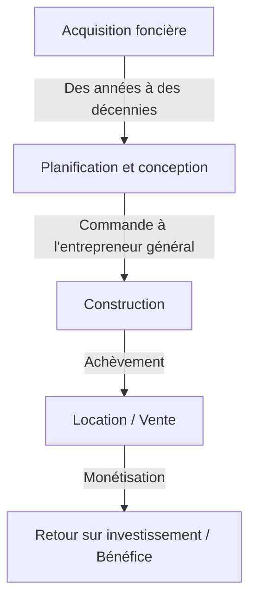
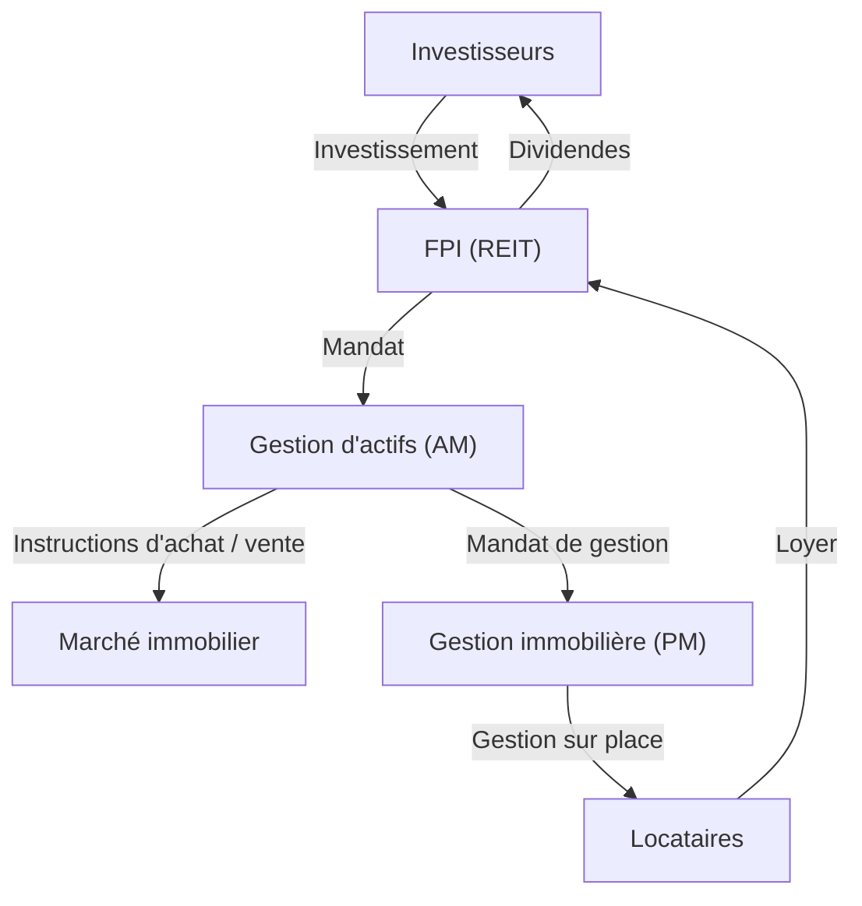

## Introduction : La ville comme un organisme géant

Les routes pavées sur lesquelles nous marchons tous les jours, les gratte-ciel que nous admirons et les maisons où nous trouvons la paix. Tout cela est créé et entretenu par un écosystème massif connu sous le nom d'"industrie immobilière". L'immobilier n'est pas seulement un "bien immobilier". C'est le fondement de la vie des gens, la scène des activités économiques des entreprises et un produit financier où circule l'argent des investissements mondiaux.

Dans cet article, nous examinerons en profondeur la structure de cette vaste zone économique et les mécanismes qui la animent, d'un point de vue physique, historique, économique et technologique. Comment les promoteurs trouvent de la valeur dans des terrains vides, comment les courtiers assurent la liquidité du marché et comment les FPI (Fonds de placement immobilier) ont sublimé l'immobilier en un produit financier. Nous aborderons l'image globale des modèles commerciaux de ceux qui créent et font bouger les villes.

---

## 1. Contexte historique et physique de l'industrie immobilière

### 1.1. L'histoire de la propriété foncière et la naissance du capitalisme

Le concept d'immobilier remonte à l'époque où l'humanité a commencé à pratiquer l'agriculture et à vivre dans des communautés sédentaires. La terre est devenue une source de richesse, et des nations et des systèmes juridiques se sont développés autour d'elle. Dans le capitalisme moderne, la terre est reconnue comme une propriété privée et ses droits sont légalement protégés par un système d'enregistrement.

Avec la clarification de la propriété foncière, il est devenu possible d'emprunter des fonds en utilisant la terre comme garantie (hypothèque), ce qui est devenu le fondement de la création de crédit moderne. En d'autres termes, l'immobilier en est venu à jouer un rôle non seulement en tant qu'espace physique, mais aussi en tant que moteur de l'économie financière.

### 1.2. La physique de la construction et l'évolution de l'ingénierie

Un autre facteur qui détermine la valeur de l'immobilier est les contraintes physiques des bâtiments et l'histoire de leur dépassement. À la fin du 19e siècle, avec l'invention des structures en acier et des ascenseurs, l'humanité a pu étendre l'espace "vers le haut".

La construction de gratte-ciel nécessite une ingénierie géotechnique et une mécanique structurelle avancées. Pour construire une structure massive sur un sol meuble, il est nécessaire d'enfoncer des pieux profondément dans la couche de support (substrat rocheux). De plus, les immeubles de grande hauteur doivent résister non seulement à leur propre poids, mais aussi aux charges de vent et aux mouvements sismiques. L'évolution des technologies de contrôle des vibrations, telles que les amortisseurs de masse et les structures d'isolation sismique, soutient la valeur de l'immobilier urbain (maximisation du coefficient d'occupation des sols) d'un point de vue physique.

---

## 2. Les principaux acteurs de l'industrie immobilière

L'industrie immobilière est globalement divisée en trois phases : "Création (Promotion)", "Circulation (Courtage)" et "Gestion et exploitation (Gestion immobilière et Gestion d'actifs)", et des acteurs spécialisés existent pour chacune d'elles.

### 2.1. Promoteurs (Sociétés immobilières globales) : Les créateurs de villes

Les promoteurs sont les "producteurs de l'urbanisme" qui acquièrent des terrains vides (ou des terrains avec de vieux bâtiments), construisent des immeubles de bureaux, des installations commerciales, des copropriétés, etc., et créent une nouvelle valeur.

- **Acquisition foncière :** C'est la phase la plus difficile et la plus importante. Ils regroupent des terrains par le biais de négociations persistantes avec les propriétaires fonciers (parfois des projets de redéveloppement s'étalant sur des décennies).
- **Planification et conception :** Ils déterminent l'utilisation et la conception qui maximisent le potentiel du terrain (réglementations légales telles que le zonage, le coefficient d'occupation des sols et le coefficient d'emprise au sol).
- **Promotion du projet :** Ils commandent la construction à des entrepreneurs généraux et gèrent l'avancement et le budget de l'ensemble du projet.
- **Location et vente :** Ils attirent des locataires pour le bâtiment achevé ou le vendent en copropriété à des acheteurs individuels.

Le modèle commercial du promoteur est un modèle à "haut risque, haut rendement" qui implique des investissements initiaux massifs. Ils se procurent des fonds à l'échelle de dizaines à centaines de milliards de yens auprès d'institutions financières (financement de projet, etc.) et les récupèrent par des plus-values à la vente après l'achèvement ou par des revenus locatifs (rendements fonciers).

### 2.2. Courtage immobilier (Courtiers) : Le lubrifiant du marché

Comme on dit dans l'immobilier, "Un bien, un prix" — il n'existe pas deux biens complètement identiques dans le monde. Dans un marché où l'asymétrie de l'information est extrêmement importante, le rôle des courtiers est de mettre en relation les vendeurs et les acheteurs, ainsi que les propriétaires et les locataires.

La principale source de revenus des courtiers est la "commission de courtage". Les courtiers garantissent des transactions sûres grâce à des connaissances spécialisées, telles que les enquêtes sur les propriétés, les explications des questions importantes, la rédaction de contrats et le soutien aux examens de prêts.

Ces dernières années, avec l'essor de la PropTech, des innovations telles que l'évaluation des prix basée sur l'IA et les visites en réalité virtuelle progressent pour accroître la transparence de l'information et réduire les coûts de transaction.

### 2.3. Gestion immobilière (PM) et Maintenance des bâtiments (BM) : Maintenir et améliorer la valeur

Un bâtiment commence à se détériorer dès son achèvement. Une gestion adéquate est essentielle pour maintenir et améliorer la valeur de l'immobilier sur le long terme.

- **Gestion immobilière (PM) :** Au nom du propriétaire, le PM gère les "aspects immatériels" de la gestion, tels que le recrutement de locataires, la gestion des contrats, la perception des loyers et le traitement des plaintes, afin de maximiser les flux de trésorerie de l'immobilier.
- **Maintenance des bâtiments (BM) :** Le PM est responsable des "aspects matériels" de la maintenance et de la gestion, tels que le nettoyage, les inspections des équipements, la sécurité et l'élaboration de plans de réparation.

---

## 3. La fusion de la finance et de l'immobilier : L'impact des FPI (REITs)

Dans l'histoire de l'industrie immobilière, la naissance des FPI (Fonds de placement immobilier / REITs) a été un événement révolutionnaire. Un FPI est un produit financier qui utilise les fonds collectés auprès de nombreux investisseurs pour acheter des biens immobiliers tels que des immeubles de bureaux, des installations commerciales et des installations logistiques, et distribue aux investisseurs les revenus locatifs et les plus-values obtenus à partir de ceux-ci.

### 3.1. Le changement de paradigme apporté par les FPI

Traditionnellement, les biens immobiliers de grande envergure et de premier ordre (actifs de premier ordre) étaient des actifs "illiquides" que seules quelques grandes entreprises et des personnes fortunées pouvaient détenir. Cependant, avec l'avènement des FPI, l'immobilier a été titrisé, permettant même aux investisseurs particuliers ordinaires de devenir propriétaires (d'une partie des droits) de grands immeubles de bureaux et d'hôtels de luxe à partir de petits montants.

### 3.2. La structure commerciale des FPI

La structure d'un FPI implique des réglementations légales strictes pour prévenir les conflits d'intérêts et une division du travail entre des acteurs spécialisés.

- **Société d'investissement :** Le véhicule qui détient l'immobilier. C'est une société écran sans substance physique.
- **Société de gestion d'actifs (AM) :** Mandatée par la société d'investissement, l'AM prend des décisions d'investissement avancées et gère le portefeuille en ce qui concerne les propriétés à acheter et à vendre.
- **Société de gestion immobilière (PM) :** Sous les instructions de la société AM, le PM effectue la gestion sur place des propriétés individuelles.
- **Dépositaire / Fiduciaire administratif général :** S'occupe de la garde des actifs et des calculs administratifs de la société.

### 3.3. La magie du taux de capitalisation (Cap Rate)

L'un des paramètres les plus importants dans le monde de l'investissement immobilier est le "taux de capitalisation".
Il est calculé en divisant le résultat net d'exploitation (NOI) par le prix du bien immobilier et représente le rendement attendu que les investisseurs exigent de ce bien immobilier.

`Prix de l'immobilier = Résultat net d'exploitation (NOI) / Taux de capitalisation`

Ce que cette formule signifie, cest que même si le loyer (NOI) reste constant, si le taux de capitalisation du marché diminue (en raison de la baisse des taux d'intérêt ou de l'intensification de la concurrence par les prix due à l'afflux d'argent d'investissement), le prix de l'immobilier augmentera. Le marché immobilier moderne évolue en étroite corrélation avec les tendances macroéconomiques des taux d'intérêt et les mouvements mondiaux de capitaux.

---

## 4. La ville de demain et les perspectives de l'industrie immobilière

Les réponses au changement climatique (investissement ESG, promotion des bâtiments verts), aux changements démographiques (vieillissement des populations et concentration de la population dans les villes) et à l'évolution de la technologie (villes intelligentes, métavers) forcent un nouveau changement de paradigme dans l'industrie immobilière.

La transition d'un modèle commercial de "fourniture d'espace" vers un modèle commercial de "fourniture d'expériences et de données à travers l'espace". L'industrie immobilière est actuellement au cœur d'un grand défi visant à redéfinir la ville comme un "système d'exploitation" qui soutient les activités humaines, allant au-delà de la simple construction de boîtes.

La frontière où le bien fini universel qu'est la terre croise la technologie et le désir humain. L'industrie immobilière continuera d'être la zone économique la plus dynamique et la plus fascinante.
