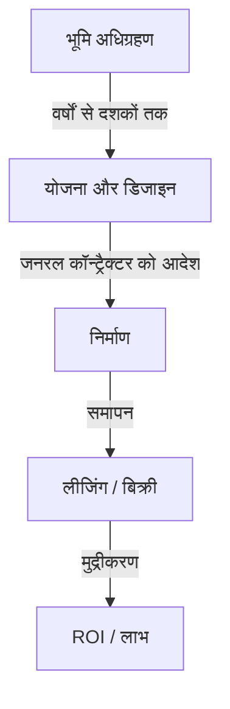
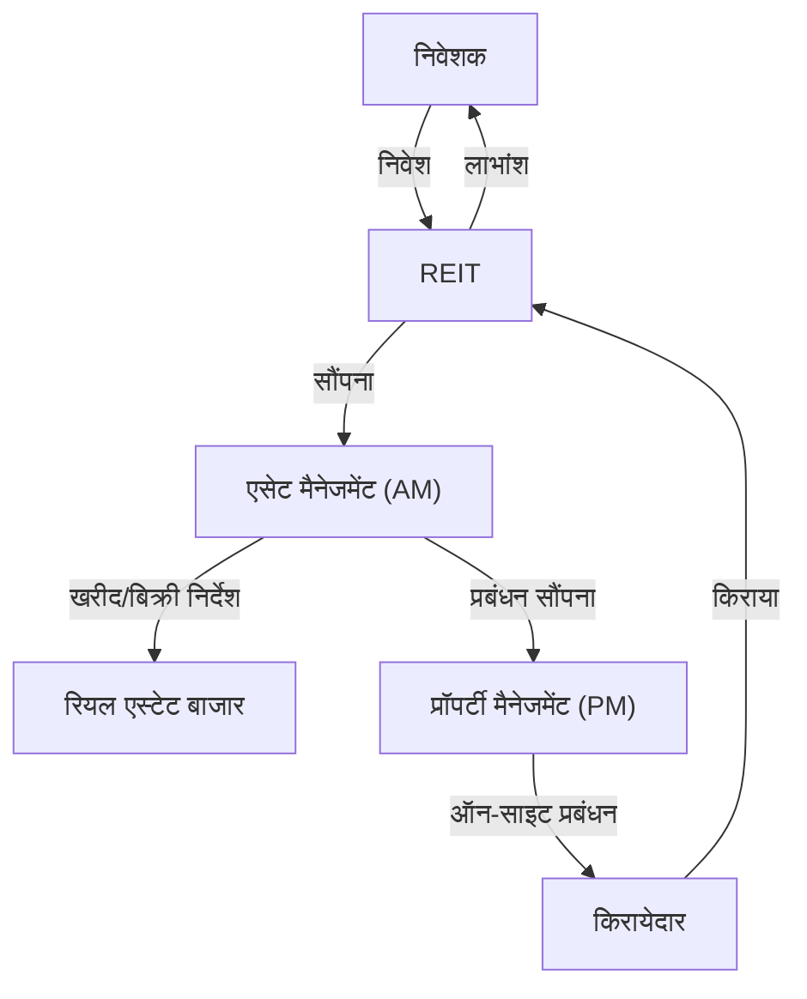

## परिचय: एक विशाल जीव के रूप में शहर

पक्की सड़कें जिन पर हम हर दिन चलते हैं, गगनचुंबी इमारतें जिन्हें हम ऊपर देखते हैं, और वे घर जहां हम शांति पाते हैं। ये सभी एक विशाल पारिस्थितिकी तंत्र द्वारा बनाए और बनाए रखे जाते हैं जिसे "रियल एस्टेट उद्योग" कहा जाता है। रियल एस्टेट केवल एक "अचल संपत्ति" नहीं है। यह लोगों के जीवन का आधार है, कॉर्पोरेट आर्थिक गतिविधियों का मंच है, और एक वित्तीय उत्पाद है जहां वैश्विक निवेश का पैसा घूमता है।

इस लेख में, हम इस बात पर गहराई से विचार करेंगे कि यह विशाल आर्थिक क्षेत्र कैसे संरचित है और कौन से तंत्र इसे भौतिक, ऐतिहासिक, आर्थिक और तकनीकी दृष्टिकोण से चलाते हैं। कैसे डेवलपर्स खाली जमीन में मूल्य पाते हैं, कैसे ब्रोकर बाजार में तरलता सुनिश्चित करते हैं, और कैसे REITs (रियल एस्टेट इन्वेस्टमेंट ट्रस्ट) ने रियल एस्टेट को एक वित्तीय उत्पाद में बदल दिया है। हम उन लोगों के बिजनेस मॉडल की पूरी तस्वीर के करीब पहुंचेंगे जो शहरों का निर्माण करते हैं और उन्हें चलाते हैं।

---

## 1. रियल एस्टेट उद्योग की ऐतिहासिक और भौतिक पृष्ठभूमि

### 1.1. भूमि स्वामित्व का इतिहास और पूंजीवाद का जन्म

रियल एस्टेट की अवधारणा उस युग से है जब मानवता ने खेती करना और बसी हुई बस्तियों में रहना शुरू किया था। भूमि धन का स्रोत बन गई, और इसके इर्द-गिर्द राष्ट्रों और कानूनी प्रणालियों का विकास किया गया। आधुनिक पूंजीवाद में, भूमि को निजी संपत्ति के रूप में मान्यता प्राप्त है, और इसके अधिकारों को पंजीकरण प्रणाली द्वारा कानूनी रूप से संरक्षित किया जाता है।

भूमि स्वामित्व के स्पष्टीकरण के साथ, भूमि को संपार्श्विक (गिरवी) के रूप में उपयोग करके धन उधार लेना संभव हो गया, जो आधुनिक ऋण सृजन का आधार बन गया। दूसरे शब्दों में, रियल एस्टेट ने न केवल भौतिक स्थान के रूप में बल्कि वित्तीय अर्थव्यवस्था को चलाने वाले इंजन के रूप में भी भूमिका निभानी शुरू कर दी।

### 1.2. निर्माण की भौतिकी और इंजीनियरिंग का विकास

रियल एस्टेट का मूल्य निर्धारित करने वाला एक अन्य कारक इमारतों की भौतिक बाधाएं और उन पर काबू पाने का इतिहास है। 19वीं सदी के अंत में, स्टील फ्रेम और लिफ्ट के आविष्कार के साथ, मानवता अंतरिक्ष का "ऊपर की ओर" विस्तार करने में सक्षम हुई।

गगनचुंबी इमारतों के निर्माण के लिए उन्नत जियोटेक्निकल इंजीनियरिंग और स्ट्रक्चरल मैकेनिक्स की आवश्यकता होती है। नरम जमीन पर एक विशाल संरचना बनाने के लिए, सहायक परत (बेडरॉक) में गहराई तक खंभे (piles) गाड़ना आवश्यक है। इसके अलावा, ऊंची इमारतों को न केवल अपने वजन बल्कि हवा के भार और भूकंपीय गति का भी सामना करना चाहिए। बड़े पैमाने पर डैम्पर्स (mass dampers) और भूकंपीय अलगाव संरचनाओं (seismic isolation structures) जैसी कंपन नियंत्रण प्रौद्योगिकियों का विकास भौतिक पहलू से शहरी रियल एस्टेट (फ्लोर एरिया अनुपात का अधिकतमकरण) के मूल्य का समर्थन करता है।

---

## 2. रियल एस्टेट उद्योग को बनाने वाले प्रमुख खिलाड़ी

रियल एस्टेट उद्योग को मोटे तौर पर तीन चरणों में बांटा गया है: "बनाना (विकास)", "परिसंचरण (ब्रोकरेज)", और "प्रबंधन और संचालन (संपत्ति प्रबंधन और संपत्ति प्रबंधन)", और प्रत्येक के लिए विशेष खिलाड़ी मौजूद हैं।

### 2.1. डेवलपर्स (व्यापक रियल एस्टेट कंपनियां): शहरों के निर्माता

डेवलपर्स "सिटी प्लानिंग के निर्माता" हैं जो खाली जमीन (या पुरानी इमारतों वाली जमीन) का अधिग्रहण करते हैं, कार्यालय भवन, व्यावसायिक सुविधाएं, कॉन्डोमिनियम आदि का निर्माण करते हैं, और नया मूल्य बनाते हैं।

- **भूमि अधिग्रहण:** यह सबसे कठिन और महत्वपूर्ण चरण है। वे जमींदारों के साथ लगातार बातचीत के माध्यम से भूमि को समेकित करते हैं (कभी-कभी पुनर्विकास परियोजनाओं में दशकों लग जाते हैं)।
- **योजना और डिजाइन:** वे उस उपयोग और डिजाइन का निर्धारण करते हैं जो भूमि की क्षमता को अधिकतम करता है (ज़ोनिंग, फ्लोर एरिया अनुपात, और भवन कवरेज अनुपात जैसे कानूनी नियम)।
- **परियोजना संवर्धन:** वे सामान्य ठेकेदारों (जनरल कॉन्ट्रैक्टर) से निर्माण का आदेश देते हैं और पूरी परियोजना की प्रगति और बजट का प्रबंधन करते हैं।
- **लीजिंग और बिक्री:** वे तैयार इमारत के लिए किरायेदारों को आकर्षित करते हैं या इसे व्यक्तिगत खरीदारों को कॉन्डोमिनियम के रूप में बेचते हैं।

डेवलपर का बिजनेस मॉडल एक "उच्च-जोखिम, उच्च-प्रतिफल" मॉडल है जिसमें भारी अग्रिम निवेश शामिल होता है। वे वित्तीय संस्थानों (प्रोजेक्ट फाइनेंस, आदि) से दसियों अरबों से लेकर सैकड़ों अरबों येन के पैमाने पर धन जुटाते हैं और पूर्ण होने के बाद बिक्री पर पूंजीगत लाभ या किराये की आय (आय लाभ) के माध्यम से इसकी वसूली करते हैं।

### 2.2. रियल एस्टेट ब्रोकरेज (ब्रोकर्स): बाजार का स्नेहक (लुब्रिकेंट)

जैसा कि रियल एस्टेट में कहा जाता है, "एक संपत्ति, एक कीमत"—दुनिया में कोई भी दो पूरी तरह से समान संपत्तियां मौजूद नहीं हैं। एक ऐसे बाजार में जहां सूचना विषमता अत्यधिक बड़ी है, ब्रोकरों की भूमिका विक्रेताओं और खरीदारों, और जमींदारों और किरायेदारों को जोड़ना है।

दलालों (ब्रोकर्स) की आय का मुख्य स्रोत "ब्रोकरेज शुल्क" है। ब्रोकर विशेष ज्ञान का उपयोग करके सुरक्षित लेनदेन सुनिश्चित करते हैं, जैसे संपत्ति की जांच, महत्वपूर्ण मामलों की व्याख्या, अनुबंध का मसौदा तैयार करना, और ऋण स्क्रीनिंग का समर्थन करना।

हाल के वर्षों में, प्रॉपटेक (PropTech) के उदय के साथ, सूचना की पारदर्शिता बढ़ाने और लेनदेन की लागत को कम करने के लिए एआई-आधारित मूल्य आकलन और वीआर (VR) देखने जैसे नवाचार प्रगति कर रहे हैं।

### 2.3. संपत्ति प्रबंधन (PM) और भवन रखरखाव (BM): मूल्य बनाए रखना और सुधारना

इमारत के पूरा होते ही वह खराब होने लगती है। लंबे समय तक रियल एस्टेट के मूल्य को बनाए रखने और सुधारने के लिए उचित प्रबंधन आवश्यक है।

- **संपत्ति प्रबंधन (PM):** मालिक की ओर से, पीएम प्रबंधन के "नरम पहलुओं" को संभालता है, जैसे कि किरायेदारों की भर्ती करना, अनुबंधों का प्रबंधन करना, किराया वसूलना, और शिकायतों को संभालना, ताकि रियल एस्टेट के नकदी प्रवाह को अधिकतम किया जा सके।
- **भवन रखरखाव (BM):** बीएम रखरखाव और प्रबंधन के "कठोर पहलुओं" के लिए जिम्मेदार है, जैसे सफाई, उपकरण निरीक्षण, सुरक्षा, और मरम्मत योजनाओं का मसौदा तैयार करना।

---

## 3. वित्त और रियल एस्टेट का संलयन: REITs का प्रभाव

रियल एस्टेट उद्योग के इतिहास में, REITs (रियल एस्टेट इन्वेस्टमेंट ट्रस्ट) का जन्म एक क्रांतिकारी घटना थी। एक REIT एक वित्तीय उत्पाद है जो कई निवेशकों से एकत्र किए गए धन का उपयोग कार्यालय भवनों, वाणिज्यिक सुविधाओं और रसद सुविधाओं जैसे रियल एस्टेट को खरीदने के लिए करता है, और उनसे प्राप्त किराये की आय और पूंजीगत लाभ को निवेशकों में वितरित करता है।

### 3.1. REITs द्वारा लाया गया प्रतिमान बदलाव (Paradigm Shift)

परंपरागत रूप से, प्रमुख बड़े पैमाने के रियल एस्टेट (प्रमुख संपत्तियां) "अतरल (illiquid)" संपत्तियां थीं जिन्हें केवल कुछ बड़े निगम और धनी व्यक्ति ही रख सकते थे। हालांकि, REITs के आगमन के साथ, रियल एस्टेट का प्रतिभूतिकरण (securitization) किया गया, जिससे आम खुदरा निवेशकों के लिए भी छोटी मात्रा से शुरू करके बड़े कार्यालय भवनों और लक्जरी होटलों के मालिक (अधिकारों के एक हिस्से के) बनना संभव हो गया।

### 3.2. REITs की व्यावसायिक संरचना

REIT की संरचना में हितों के टकराव को रोकने के लिए सख्त कानूनी नियम और विशिष्ट खिलाड़ियों के बीच श्रम का विभाजन शामिल है।

- **निवेश निगम:** वह वाहन जो रियल एस्टेट को रखता है। यह एक पेपर कंपनी है जिसका कोई भौतिक अस्तित्व नहीं है।
- **एसेट मैनेजमेंट कंपनी (AM):** निवेश निगम द्वारा सौंपे गए, एएम उन्नत निवेश निर्णय लेता है और यह पोर्टफोलियो का प्रबंधन करता है कि कौन सी संपत्ति खरीदनी या बेचनी है।
- **प्रॉपर्टी मैनेजमेंट कंपनी (PM):** एएम कंपनी के निर्देशों के तहत, पीएम व्यक्तिगत संपत्तियों का ऑन-साइट प्रबंधन करता है।
- **कस्टोडियन / सामान्य प्रशासनिक ट्रस्टी:** संपत्तियों की हिरासत (custody) और निगम की प्रशासनिक गणनाओं को संभालता है।

### 3.3. कैप रेट (Capitalization Rate) का जादू

रियल एस्टेट निवेश की दुनिया में सबसे महत्वपूर्ण मेट्रिक्स में से एक "कैप रेट" है।
इसकी गणना नेट ऑपरेटिंग इनकम (NOI) को रियल एस्टेट की कीमत से विभाजित करके की जाती है और यह उस अपेक्षित उपज (yield) को दर्शाता है जिसकी निवेशक उस रियल एस्टेट से मांग करते हैं।

`रियल एस्टेट की कीमत = नेट ऑपरेटिंग इनकम (NOI) / कैप रेट`

इस सूत्र का मतलब यह है कि भले ही किराया (NOI) स्थिर रहे, अगर बाजार कैप रेट कम हो जाता है (कम ब्याज दरों या निवेश धन की आमद से तीव्र मूल्य प्रतिस्पर्धा के कारण), तो रियल एस्टेट की कीमत बढ़ जाएगी। आधुनिक रियल एस्टेट बाजार व्यापक आर्थिक ब्याज दर के रुझानों और वैश्विक पूंजी आंदोलनों के साथ निकटता से चलता है।

---

## 4. भविष्य का शहर और रियल एस्टेट उद्योग का दृष्टिकोण

जलवायु परिवर्तन (ESG निवेश, ग्रीन बिल्डिंग को बढ़ावा देना), जनसांख्यिकी में परिवर्तन (बढ़ती उम्र की आबादी और शहरों में आबादी का संकेंद्रण), और प्रौद्योगिकी के विकास (स्मार्ट शहर, मेटावर्स) के प्रति प्रतिक्रियाएं रियल एस्टेट उद्योग में एक नए प्रतिमान बदलाव को मजबूर कर रही हैं।

"स्थान प्रदान करने" के एक बिजनेस मॉडल से "स्थान के माध्यम से अनुभव और डेटा प्रदान करने" के बिजनेस मॉडल में संक्रमण। रियल एस्टेट उद्योग वर्तमान में शहर को एक "ऑपरेटिंग सिस्टम" के रूप में फिर से परिभाषित करने की एक बड़ी चुनौती के बीच है जो बक्से (इमारतों) के मात्र निर्माण से परे मानव गतिविधियों का समर्थन करता है।

वह सीमांत (frontier) जहां भूमि की सार्वभौमिक सीमित संपत्ति मानव प्रौद्योगिकी और इच्छा के साथ प्रतिच्छेद (intersect) करती है। रियल एस्टेट उद्योग सबसे गतिशील और आकर्षक आर्थिक क्षेत्र बना रहेगा।
