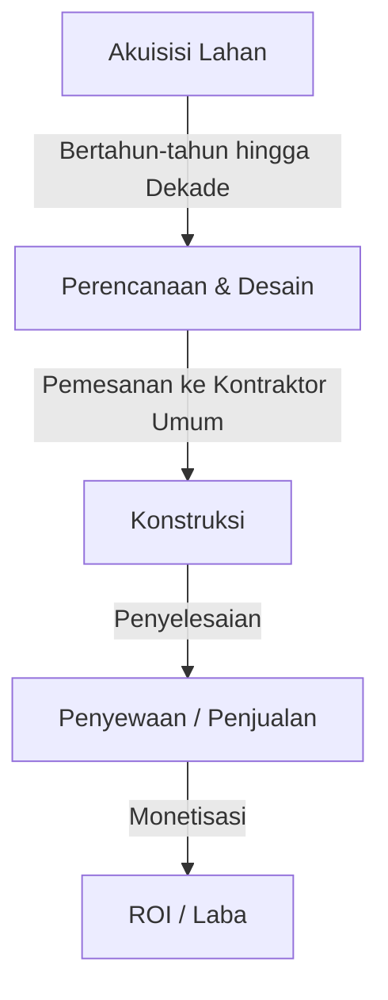
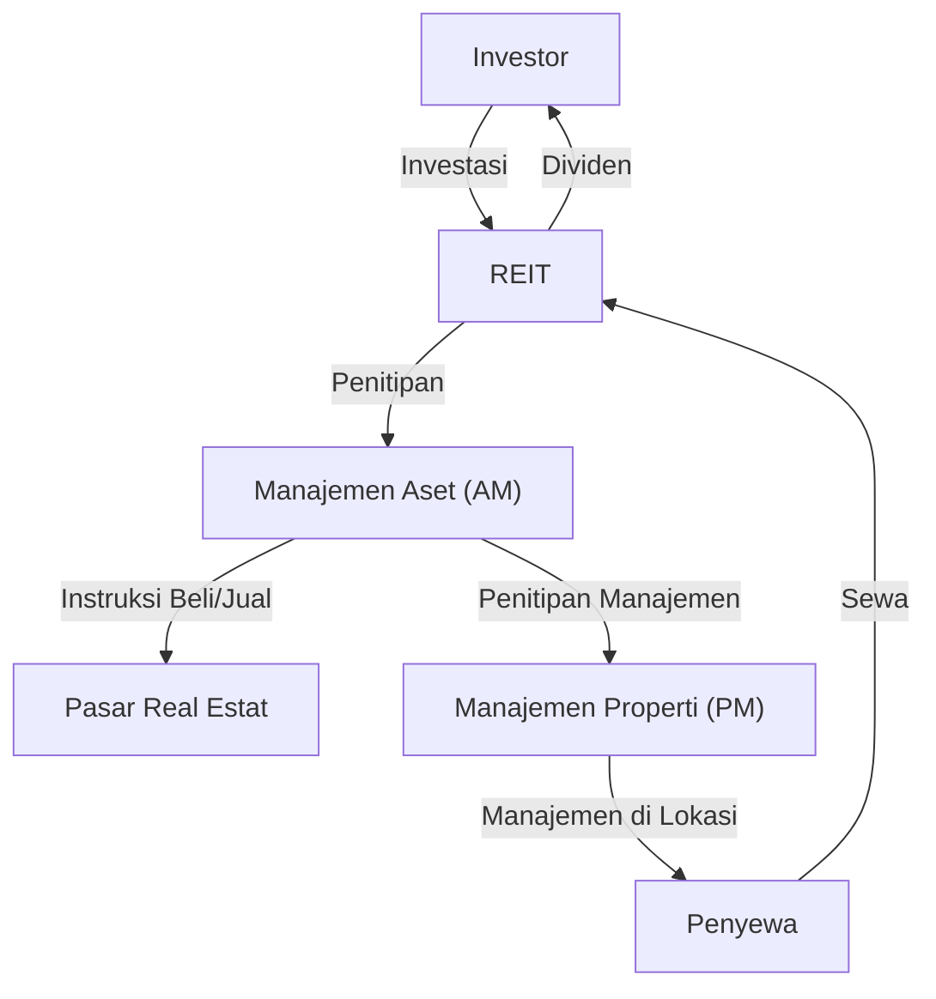

## Pengantar: Kota sebagai Organisme Raksasa

Jalan beraspal yang kita lalui setiap hari, gedung pencakar langit yang kita tatap, dan rumah tempat kita menemukan kedamaian. Semua ini diciptakan dan dipelihara oleh ekosistem raksasa yang dikenal sebagai "Industri Real Estat". Real Estat bukan sekadar "aset yang tidak dapat dipindahkan". Ini adalah fondasi kehidupan manusia, panggung untuk aktivitas ekonomi perusahaan, dan produk keuangan di mana uang investasi global beredar.

Dalam artikel ini, kita akan mendalami bagaimana struktur zona ekonomi raksasa ini dan mekanisme apa yang menggerakkannya, dari perspektif fisik, historis, ekonomi, dan teknologi. Bagaimana pengembang menemukan nilai di tanah kosong, bagaimana pialang memastikan likuiditas pasar, dan bagaimana REIT (Real Estate Investment Trust) telah menyublimasikan real estat menjadi produk keuangan. Kita akan mendekati gambaran keseluruhan dari model bisnis orang-orang yang menciptakan dan menggerakkan kota.

---

## 1. Latar Belakang Historis dan Fisik Industri Real Estat

### 1.1. Sejarah Kepemilikan Tanah dan Lahirnya Kapitalisme

Konsep real estat berawal dari era ketika umat manusia mulai bertani dan tinggal di komunitas yang menetap. Tanah menjadi sumber kekayaan, dan negara serta sistem hukum dikembangkan di sekitarnya. Dalam kapitalisme modern, tanah diakui sebagai milik pribadi, dan hak-haknya dilindungi secara hukum oleh sistem pendaftaran.

Dengan kejelasan kepemilikan tanah, menjadi mungkin untuk meminjam dana menggunakan tanah sebagai agunan (hipotek), yang menjadi fondasi penciptaan kredit modern. Dengan kata lain, real estat mulai berperan tidak hanya sebagai ruang fisik tetapi juga sebagai mesin penggerak ekonomi keuangan.

### 1.2. Fisika Konstruksi dan Evolusi Teknik

Faktor lain yang menentukan nilai real estat adalah kendala fisik bangunan dan sejarah dalam mengatasinya. Pada akhir abad ke-19, dengan penemuan rangka baja dan elevator, umat manusia mampu memperluas ruang "ke atas".

Pembangunan gedung pencakar langit membutuhkan teknik geoteknik dan mekanika struktural tingkat lanjut. Untuk membangun struktur raksasa di atas tanah lunak, perlu dilakukan pemancangan tiang dalam-dalam hingga mencapai lapisan pendukung (batuan dasar). Selain itu, bangunan bertingkat tinggi harus menahan tidak hanya beban beratnya sendiri tetapi juga beban angin dan pergerakan seismik. Evolusi teknologi kontrol getaran seperti mass damper dan struktur isolasi seismik mendukung nilai real estat perkotaan (maksimalisasi rasio luas lantai) dari aspek fisik.

---

## 2. Pemain Utama yang Membentuk Industri Real Estat

Industri real estat secara garis besar dibagi menjadi tiga fase: "Menciptakan (Pengembangan)", "Meredarkan (Perantara)", dan "Mengelola dan Mengoperasikan (Manajemen Properti dan Manajemen Aset)", dan terdapat pemain khusus untuk masing-masing.

### 2.1. Pengembang (Perusahaan Real Estat Komprehensif): Pencipta Kota

Pengembang adalah "produser tata kota" yang mengakuisisi lahan kosong (atau lahan dengan bangunan tua), membangun gedung perkantoran, fasilitas komersial, kondominium, dll., dan menciptakan nilai baru.

- **Akuisisi Lahan:** Ini adalah fase yang paling sulit dan penting. Mereka mengkonsolidasikan lahan melalui negosiasi yang gigih dengan pemilik tanah (terkadang proyek pembangunan kembali memakan waktu puluhan tahun).
- **Perencanaan dan Desain:** Mereka menentukan penggunaan dan desain yang memaksimalkan potensi lahan (peraturan hukum seperti zonasi, rasio luas lantai, dan rasio tutupan bangunan).
- **Promosi Proyek:** Mereka memesan konstruksi dari kontraktor umum dan mengelola kemajuan serta anggaran dari keseluruhan proyek.
- **Penyewaan dan Penjualan:** Mereka menarik penyewa untuk bangunan yang telah selesai atau menjualnya sebagai kondominium kepada pembeli perorangan.

Model bisnis pengembang adalah model "risiko tinggi, imbal hasil tinggi" yang melibatkan investasi awal dalam jumlah besar. Mereka mendapatkan dana dalam skala puluhan hingga ratusan miliar yen dari lembaga keuangan (pembiayaan proyek, dll.) dan memulihkannya melalui capital gain pada saat penjualan setelah penyelesaian atau pendapatan sewa (income gain).

### 2.2. Perantara Real Estat (Pialang): Pelumas Pasar

Seperti yang mereka katakan dalam real estat, "Satu properti, satu harga"—tidak ada dua properti yang benar-benar identik di dunia ini. Di pasar di mana asimetri informasi sangat besar, peran pialang adalah untuk menghubungkan penjual dan pembeli, serta tuan tanah dan penyewa.

Sumber pendapatan utama bagi pialang adalah "biaya perantara". Pialang memastikan transaksi yang aman menggunakan pengetahuan khusus, seperti penyelidikan properti, penjelasan hal-hal penting, penyusunan kontrak, dan dukungan penyaringan pinjaman.

Dalam beberapa tahun terakhir, dengan bangkitnya PropTech, inovasi seperti penilaian harga berbasis AI dan penayangan VR berkembang untuk meningkatkan transparansi informasi dan menurunkan biaya transaksi.

### 2.3. Manajemen Properti (PM) dan Pemeliharaan Gedung (BM): Mempertahankan dan Meningkatkan Nilai

Sebuah bangunan mulai mengalami degradasi saat selesai dibangun. Manajemen yang tepat sangat penting untuk mempertahankan dan meningkatkan nilai real estat dalam jangka panjang.

- **Manajemen Properti (PM):** Atas nama pemilik, PM menangani "aspek lunak" dari manajemen, seperti merekrut penyewa, mengelola kontrak, menagih sewa, dan menangani keluhan, untuk memaksimalkan arus kas real estat.
- **Pemeliharaan Gedung (BM):** PM bertanggung jawab atas "aspek keras" pemeliharaan dan pengelolaan, seperti pembersihan, inspeksi peralatan, keamanan, dan penyusunan rencana perbaikan.

---

## 3. Perpaduan Keuangan dan Real Estat: Dampak REIT

Dalam sejarah industri real estat, lahirnya REIT (Real Estate Investment Trust) merupakan peristiwa revolusioner. REIT adalah produk keuangan yang menggunakan dana yang dikumpulkan dari banyak investor untuk membeli real estat seperti gedung perkantoran, fasilitas komersial, dan fasilitas logistik, dan mendistribusikan pendapatan sewa serta capital gain yang diperoleh darinya kepada para investor.

### 3.1. Pergeseran Paradigma yang Dibawa oleh REIT

Secara tradisional, real estat berskala besar yang prima (aset utama) adalah aset "tidak likuid" yang hanya bisa dimiliki oleh segelintir perusahaan besar dan individu kaya. Namun, dengan munculnya REIT, real estat disekuritisasi, memungkinkan bahkan bagi investor ritel biasa untuk menjadi pemilik (atas sebagian hak) dari gedung perkantoran besar dan hotel mewah dimulai dari jumlah kecil.

### 3.2. Struktur Bisnis REIT

Struktur REIT melibatkan peraturan hukum yang ketat untuk mencegah konflik kepentingan dan pembagian kerja di antara para pemain khusus.

- **Perusahaan Investasi:** Kendaraan yang memegang real estat. Ini adalah perusahaan kertas tanpa substansi fisik.
- **Perusahaan Manajemen Aset (AM):** Dipercayakan oleh perusahaan investasi, AM membuat keputusan investasi tingkat lanjut dan mengelola portofolio mengenai properti mana yang akan dibeli dan dijual.
- **Perusahaan Manajemen Properti (PM):** Di bawah instruksi dari perusahaan AM, PM melakukan manajemen di lokasi untuk masing-masing properti.
- **Kustodian / Wali Amanat Administrasi Umum:** Menangani penyimpanan aset dan perhitungan administratif perusahaan.

### 3.3. Keajaiban Tingkat Kapitalisasi (Cap Rate)

Salah satu metrik terpenting dalam dunia investasi real estat adalah "Cap Rate".
Ini dihitung dengan membagi Pendapatan Operasional Bersih (NOI) dengan harga real estat dan mewakili imbal hasil yang diharapkan oleh investor dari real estat tersebut.

`Harga Real Estat = Pendapatan Operasional Bersih (NOI) / Cap Rate`

Apa yang dimaksud dengan rumus ini adalah bahwa meskipun sewa (NOI) tetap konstan, jika cap rate pasar menurun (karena suku bunga yang lebih rendah atau persaingan harga yang intensif dari masuknya uang investasi), harga real estat akan naik. Pasar real estat modern bergerak erat dengan tren suku bunga makroekonomi dan pergerakan modal global.

---

## 4. Kota Masa Depan dan Prospek Industri Real Estat

Respons terhadap perubahan iklim (investasi ESG, promosi bangunan hijau), perubahan demografi (populasi yang menua dan konsentrasi populasi di perkotaan), dan evolusi teknologi (kota pintar, metaverse) memaksa adanya pergeseran paradigma baru dalam industri real estat.

Transisi dari model bisnis "menyediakan ruang" ke model bisnis "menyediakan pengalaman dan data melalui ruang". Industri real estat saat ini berada di tengah tantangan besar untuk mendefinisikan kembali kota sebagai "sistem operasi" yang mendukung aktivitas manusia, bergerak melampaui sekadar konstruksi kotak.

Garis depan tempat aset tanah yang universal dan terbatas bersilangan dengan teknologi dan hasrat manusia. Industri real estat akan terus menjadi zona ekonomi yang paling dinamis dan menakjubkan.
