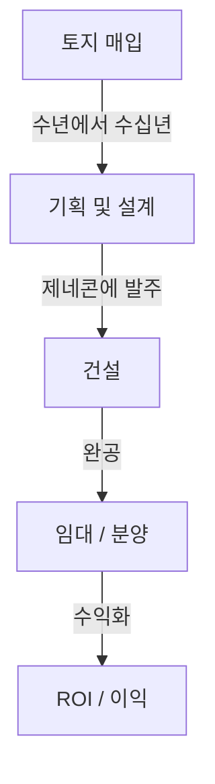
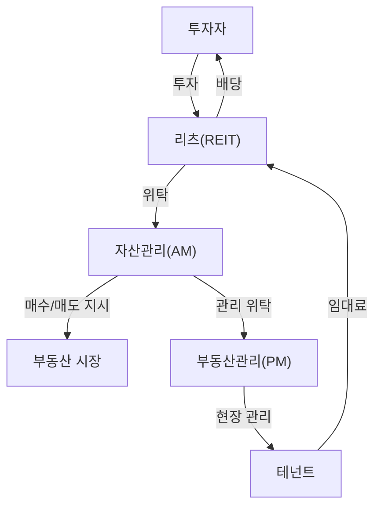

## 서론: 거대한 유기체로서의 도시

우리가 매일 걷는 포장도로, 올려다보는 마천루, 그리고 평안을 얻는 집. 이 모든 것은 "부동산 산업"이라는 거대한 생태계에 의해 창조되고 유지됩니다. 부동산은 단순한 "움직이지 않는 자산"이 아닙니다. 사람들의 생활 기반이자, 기업의 경제 활동 무대이며, 글로벌 투자 자금이 순환하는 금융 상품입니다.

이 글에서는 물리적, 역사적, 경제적, 기술적 관점에서 이 거대한 경제권이 어떻게 구조화되어 있고 어떤 메커니즘으로 움직이는지 깊이 파헤쳐 보겠습니다. 디벨로퍼가 빈 땅에서 가치를 찾아내는 방법, 중개업자가 시장의 유동성을 확보하는 방법, 그리고 리츠(REITs, 부동산 투자 신탁)가 부동산을 어떻게 금융 상품으로 승화시켰는지 살펴봅니다. 도시를 만들고 움직이는 사람들의 비즈니스 모델 전체를 조망해 보겠습니다.

---

## 1. 부동산 산업의 역사적, 물리적 배경

### 1.1. 토지 소유의 역사와 자본주의의 탄생

부동산의 개념은 인류가 농사를 짓고 정착 생활을 시작한 시대로 거슬러 올라갑니다. 토지는 부의 원천이 되었고, 이를 중심으로 국가와 법체계가 발전했습니다. 현대 자본주의에서 토지는 사유재산으로 인정받으며, 그 권리는 등기 제도를 통해 법적으로 보호받습니다.

토지 소유권이 명확해짐에 따라 토지를 담보로 자금을 빌리는 것(저당)이 가능해졌고, 이는 현대 신용 창출의 기반이 되었습니다. 즉, 부동산은 물리적 공간으로서의 역할뿐만 아니라 금융 경제를 견인하는 엔진으로서의 역할을 수행하게 되었습니다.

### 1.2. 건축의 물리학과 공학의 진화

부동산의 가치를 결정하는 또 다른 요인은 건물의 물리적 제약과 이를 극복해 온 역사입니다. 19세기 후반 철골과 엘리베이터의 발명으로 인류는 공간을 "위로" 확장할 수 있게 되었습니다.

초고층 빌딩을 건설하려면 고도의 지반공학과 구조역학이 필요합니다. 연약 지반 위에 거대한 구조물을 세우기 위해서는 지지층(암반)까지 깊숙이 말뚝을 박아야 합니다. 또한, 고층 건물은 자체 하중뿐만 아니라 풍하중과 지진동도 견뎌야 합니다. 매스 댐퍼나 면진 구조와 같은 제진 기술의 진화는 물리적 측면에서 도시 부동산의 가치(용적률 극대화)를 뒷받침합니다.

---

## 2. 부동산 산업을 구성하는 주요 플레이어

부동산 산업은 크게 "만들기(개발)", "유통하기(중개)", "관리·운영하기(부동산 관리 및 자산 관리)"의 세 단계로 나뉘며, 각 단계마다 전문 플레이어가 존재합니다.

### 2.1. 디벨로퍼 (종합 부동산 회사): 도시의 창조자

디벨로퍼는 빈 땅(또는 낡은 건물이 있는 땅)을 매입해 오피스 빌딩, 상업 시설, 아파트 등을 건설하고 새로운 가치를 창출하는 "도시 계획의 프로듀서"입니다.

- **토지 매입:** 가장 어렵고 중요한 단계입니다. 토지 소유자와의 끈질긴 협상을 통해 토지를 모읍니다(때로는 수십 년이 걸리는 재개발 프로젝트도 있습니다).
- **기획 및 설계:** 토지의 잠재력을 극대화할 수 있는 용도와 디자인을 결정합니다(용도지역, 용적률, 건폐율 등의 법적 규제 고려).
- **프로젝트 추진:** 종합건설회사(제네콘)에 공사를 발주하고 전체 프로젝트의 진행 상황과 예산을 관리합니다.
- **임대 및 분양:** 완성된 건물에 입주할 테넌트를 유치하거나 개인 구매자에게 아파트로 분양합니다.

디벨로퍼의 비즈니스 모델은 막대한 초기 투자가 수반되는 "하이 리스크, 하이 리턴" 모델입니다. 금융기관으로부터 수백억에서 수천억 엔 규모의 자금을 조달(프로젝트 파이낸싱 등)하고, 완공 후 매각을 통한 자본 이득(캐피털 게인)이나 임대 수익(인컴 게인)을 통해 자금을 회수합니다.

### 2.2. 부동산 중개 (중개업자): 시장의 윤활유

부동산 업계에서 "일물일가(하나의 매물에 하나의 가격)"라는 말이 있듯이, 세상에 완전히 똑같은 매물은 존재하지 않습니다. 정보의 비대칭성이 매우 큰 시장에서 중개업자의 역할은 매도자와 매수자, 임대인과 임차인을 연결하는 것입니다.

중개업자의 주된 수입원은 "중개 수수료"입니다. 중개업자는 매물 조사, 중요 사항 설명, 계약서 작성, 대출 심사 지원 등 전문 지식을 활용하여 안전한 거래를 보장합니다.

최근에는 프롭테크(PropTech)의 부상으로 AI 기반 가격 산정이나 VR 매물 확인과 같은 혁신이 진행되어 정보의 투명성을 높이고 거래 비용을 낮추고 있습니다.

### 2.3. 부동산 관리 (PM) 및 건물 유지보수 (BM): 가치 유지 및 향상

건물은 완공되는 순간부터 노후화되기 시작합니다. 장기적으로 부동산의 가치를 유지하고 향상시키기 위해서는 적절한 관리가 필수적입니다.

- **부동산 관리 (PM):** 소유자를 대신하여 임차인 모집, 계약 관리, 임대료 징수, 클레임 처리 등 관리의 "소프트웨어적인 측면"을 담당하여 부동산의 현금 흐름을 극대화합니다.
- **건물 유지보수 (BM):** 청소, 설비 점검, 보안, 수선 계획 수립 등 유지 관리의 "하드웨어적인 측면"을 책임집니다.

---

## 3. 금융과 부동산의 융합: 리츠(REITs)의 영향력

부동산 산업의 역사에서 리츠(REITs, 부동산 투자 신탁)의 탄생은 혁명적인 사건이었습니다. 리츠는 다수의 투자자로부터 모은 자금으로 오피스 빌딩, 상업 시설, 물류 시설 등 부동산을 매입하고, 그로부터 얻은 임대 수익과 자본 이득을 투자자에게 배당하는 금융 상품입니다.

### 3.1. 리츠가 가져온 패러다임 시프트

전통적으로 우량 대형 부동산(프라임 자산)은 소수의 대기업이나 자산가만이 보유할 수 있는 "비유동적" 자산이었습니다. 그러나 리츠의 등장으로 부동산이 유동화되면서, 일반 개인 투자자도 소액으로 대형 오피스 빌딩이나 고급 호텔의 소유자(권리의 일부)가 될 수 있게 되었습니다.

### 3.2. 리츠의 비즈니스 구조

리츠의 구조는 이해 상충을 방지하기 위한 엄격한 법적 규제와 전문 플레이어들 간의 분업으로 이루어져 있습니다.

- **투자법인:** 부동산을 보유하는 비히클(Vehicle)입니다. 물리적 실체가 없는 페이퍼 컴퍼니입니다.
- **자산관리회사 (AM):** 투자법인으로부터 위탁을 받아, 어떤 물건을 사고팔지에 대한 고도의 투자 결정과 포트폴리오 관리를 수행합니다.
- **부동산관리회사 (PM):** AM 회사의 지시를 받아 개별 부동산의 현장 관리를 수행합니다.
- **수탁회사 / 일반사무수탁회사:** 자산의 보관과 법인의 사무 계산을 담당합니다.

### 3.3. 캡레이트(환원율)의 마법

부동산 투자 세계에서 가장 중요한 지표 중 하나가 "캡레이트(Cap Rate)"입니다.
순영업소득(NOI)을 부동산 가격으로 나눈 값으로, 투자자가 해당 부동산에 요구하는 기대 수익률을 나타냅니다.

`부동산 가격 = 순영업소득(NOI) / 캡레이트`

이 공식이 의미하는 바는, 임대료(NOI)가 일정하더라도 시장의 캡레이트가 하락하면(금리 하락이나 투자 자금 유입으로 인한 가격 경쟁 심화 등으로 인해) 부동산 가격은 상승한다는 것입니다. 현대 부동산 시장은 거시경제의 금리 동향 및 글로벌 자본 이동과 밀접하게 맞물려 움직입니다.

---

## 4. 미래 도시와 부동산 산업의 전망

기후 변화에 대한 대응(ESG 투자, 친환경 건축물 촉진), 인구 통계의 변화(인구 고령화 및 도시 집중), 기술의 진화(스마트 시티, 메타버스)는 부동산 산업에 새로운 패러다임 전환을 강요하고 있습니다.

"공간을 제공하는" 비즈니스 모델에서 "공간을 통해 경험과 데이터를 제공하는" 비즈니스 모델로의 전환. 부동산 업계는 지금 단순한 상자(건물) 건설을 넘어, 인류의 활동을 지원하는 "운영 체제(OS)"로서의 도시를 재정의하는 거대한 도전에 직면해 있습니다.

보편적이고 유한한 자산인 토지가 인간의 기술 및 욕망과 교차하는 최전선. 부동산 산업은 앞으로도 가장 역동적이고 매력적인 경제권으로 남을 것입니다.
