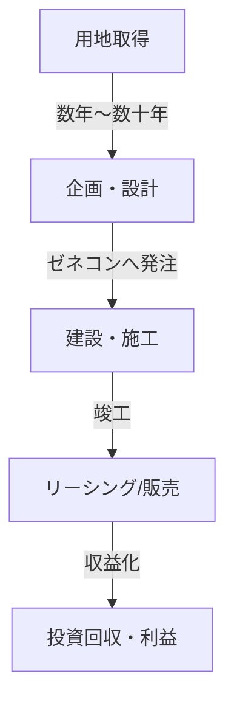
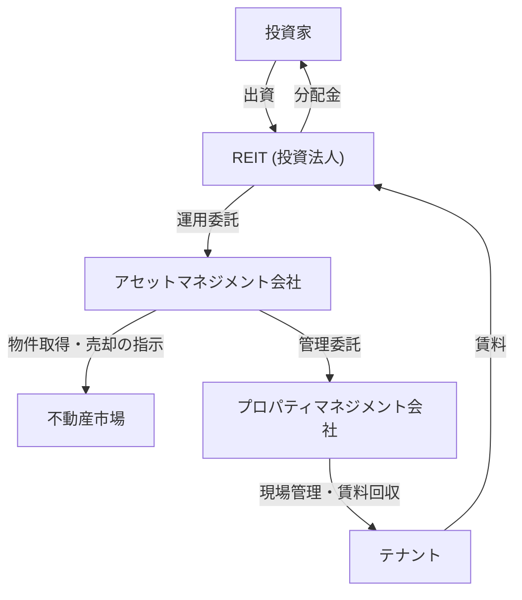

## 序論：都市という巨大な生命体

私たちが日々歩く舗装された道路、見上げる摩天楼、そして安らぎを得る住宅。これらはすべて「不動産業界」という巨大なエコシステムによって生み出され、維持されています。不動産（Real Estate）とは、単なる「動かない資産」ではありません。それは、人々の生活基盤であり、企業の経済活動の舞台であり、さらにはグローバルな投資マネーが還流する金融商品でもあります。

本記事では、この巨大な経済圏がどのように構成され、どのようなメカニズムで動いているのかを、物理的・歴史的・経済的・技術的な観点から深く掘り下げて解き明かします。デベロッパーがどのようにして何もない土地に価値を見出し、仲介業者がどのように市場の流動性を担保し、そしてREIT（不動産投資信託）がいかにして不動産を金融商品へと昇華させたのか。都市を創り、動かす人々のビジネスモデルの全貌に迫ります。

---

## 1. 不動産業界の歴史的・物理的背景

### 1.1. 土地所有権の歴史と資本主義の誕生

不動産の概念は、人類が農耕を始め、定住生活を営むようになった時代にまで遡ります。土地が富の源泉となり、それを巡って国家や法体系が整備されました。近代資本主義において、土地は私有財産として認められ、登記制度によってその権利が法的に保護されるようになりました。

土地の所有権が明確になったことで、土地を担保にして資金を借り入れる（抵当権）ことが可能になり、これが近代的な信用創造の基盤となりました。つまり、不動産は単なる物理的な空間としてだけでなく、金融経済を駆動させるエンジンとしての役割を担うようになったのです。

### 1.2. 建築の物理学とエンジニアリングの進化

不動産の価値を決定づけるもう一つの要素が、建物の物理的な制約とその克服の歴史です。19世紀後半、鉄骨造とエレベーターの発明により、人類は「上」へと空間を拡張することが可能になりました。

摩天楼の建設には、高度な地盤工学と構造力学が求められます。軟弱な地盤に巨大な構造物を建てるためには、支持層（岩盤）まで深く杭を打ち込む必要があります。また、高層ビルは自重だけでなく、風荷重や地震動にも耐えなければなりません。マスダンパーなどの制震技術や免震構造の進化は、都市の不動産価値（容積率の最大化）を物理的な側面から支えています。

---

## 2. 不動産業界を構成する主要なプレイヤー

不動産業界は、大きく分けて「創る（開発）」「流通させる（仲介）」「管理・運用する（プロパティマネジメント・アセットマネジメント）」の3つのフェーズに分かれ、それぞれに専門のプレイヤーが存在します。

### 2.1. デベロッパー（総合不動産会社）：都市の創造者

デベロッパーは、何もない土地（あるいは古い建物が建つ土地）を取得し、そこにオフィスビル、商業施設、マンションなどを建設して新たな価値を創造する「街づくりのプロデューサー」です。

- **用地取得:** 最も困難で重要なフェーズです。地権者との粘り強い交渉（時には数十年に及ぶ再開発事業）を通じて土地をまとめ上げます。
- **企画・設計:** その土地のポテンシャル（用途地域、容積率、建蔽率などの法的規制）を最大限に引き出す用途とデザインを決定します。
- **事業推進:** ゼネコン（建設会社）に施工を発注し、プロジェクト全体の進捗と予算を管理します。
- **リーシング・分譲:** 完成した建物のテナントを誘致するか、あるいはマンションとして個人の購入者に販売します。

デベロッパーのビジネスモデルは、莫大な先行投資を伴う「ハイリスク・ハイリターン」なモデルです。数百億円から数千億円規模の資金を金融機関から調達（プロジェクトファイナンスなど）し、完成後の売却益（キャピタルゲイン）や賃料収入（インカムゲイン）で回収します。

### 2.2. 不動産仲介（ブローカー）：市場の潤滑油

不動産は「一物一価」と言われるように、全く同じ物件は世界に二つと存在しません。情報の非対称性が非常に大きい市場において、売り手と買い手、貸し手と借り手を結びつけるのが仲介業者の役割です。

仲介業者の主な収益源は「仲介手数料（ブローカレッジ・フィー）」です。日本では宅地建物取引業法により、売買の仲介手数料の上限が「売買価格の3% ＋ 6万円 ＋ 消費税」と定められています。仲介業者は、物件調査、重要事項説明、契約書の作成、ローン審査のサポートなど、専門的な知識を用いて安全な取引を担保します。

近年では、不動産テック（PropTech）の台頭により、AIを用いた価格査定やVR内見など、情報の透明性を高め、取引コストを下げるイノベーションが進行しています。

### 2.3. プロパティマネジメント（PM）とビルメンテナンス（BM）：価値の維持と向上

建物は完成した瞬間から劣化が始まります。不動産の価値を長期にわたって維持・向上させるためには、適切な管理が不可欠です。

- **プロパティマネジメント (PM):** オーナーに代わって、テナントの募集・契約管理、賃料の回収、クレーム対応など「ソフト面」の管理を行い、不動産の収益（キャッシュフロー）を最大化します。
- **ビルメンテナンス (BM):** 清掃、設備点検、警備、修繕計画の立案など「ハード面」の維持管理を担います。

---

## 3. 金融と不動産の融合：REIT（不動産投資信託）の衝撃

不動産業界の歴史において、REIT（Real Estate Investment Trust）の誕生は革命的な出来事でした。REITは、多数の投資家から集めた資金でオフィスビルや商業施設、物流施設などの不動産を購入し、そこから得られる賃料収入や売却益を投資家に分配する金融商品です。

### 3.1. REITがもたらしたパラダイムシフト

伝統的に、優良な大型不動産（プライムアセット）は、一部の大企業や富裕層しか保有できない「流動性の低い」資産でした。しかし、REITの登場により、不動産が証券化（小口化）され、一般の個人投資家でも数万円から大型オフィスビルや高級ホテルのオーナー（の権利の一部）になることが可能になりました。

### 3.2. REITのビジネスストラクチャー

REITの仕組みには、利益相反を防ぐための厳格な法規制と、専門的なプレイヤーの分業が存在します。

- **投資法人:** 不動産を保有する器（ビークル）です。実体を持たないペーパーカンパニーです。
- **アセットマネジメント会社 (AM):** 投資法人から委託を受け、どの物件を買い、どの物件を売るかという高度な投資判断とポートフォリオの運用を行います。
- **プロパティマネジメント会社 (PM):** AM会社からの指示で、個別の物件の現場管理を行います。
- **カストディアン（資産保管会社）/ 一般事務受託者:** 資産の保管や法人の事務計算を行います。

### 3.3. キャップレート（還元利回り）の魔法

不動産投資の世界で最も重要な指標の一つが「キャップレート（Capitalization Rate）」です。
純収益（NOI: Net Operating Income）を不動産価格で割ったものであり、投資家がその不動産に求める期待利回りを表します。

`不動産価格 ＝ 純収益 (NOI) ÷ キャップレート`

この数式が意味するのは、賃料（NOI）が一定であっても、市場のキャップレートが低下（金利低下や投資マネーの流入による価格競争の激化）すれば、不動産価格は上昇するということです。現代の不動産市場は、マクロ経済の金利動向やグローバルな資本移動と密接に連動して動いています。

---

## 4. 未来の都市と不動産業界の展望

気候変動への対応（ESG投資、グリーンビルディングの推進）、人口動態の変化（高齢化や都市への人口集中）、そしてテクノロジーの進化（スマートシティ、メタバース）は、不動産業界に新たなパラダイムシフトを迫っています。

「空間を提供する」というこれまでのビジネスモデルから、「空間を通じた体験とデータを提供する」ビジネスモデルへの転換。不動産業界は今、単なる箱モノの建設を超え、人々の営みを支える「オペレーティングシステム」としての都市を再定義する壮大な挑戦の途上にあります。

土地という普遍の有限資産と、人類の技術と欲望が交差するフロンティア。不動産業界は、これからも最もダイナミックで魅力的な経済圏であり続けるでしょう。
