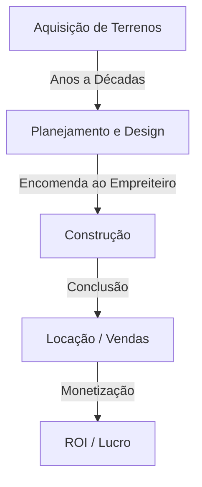
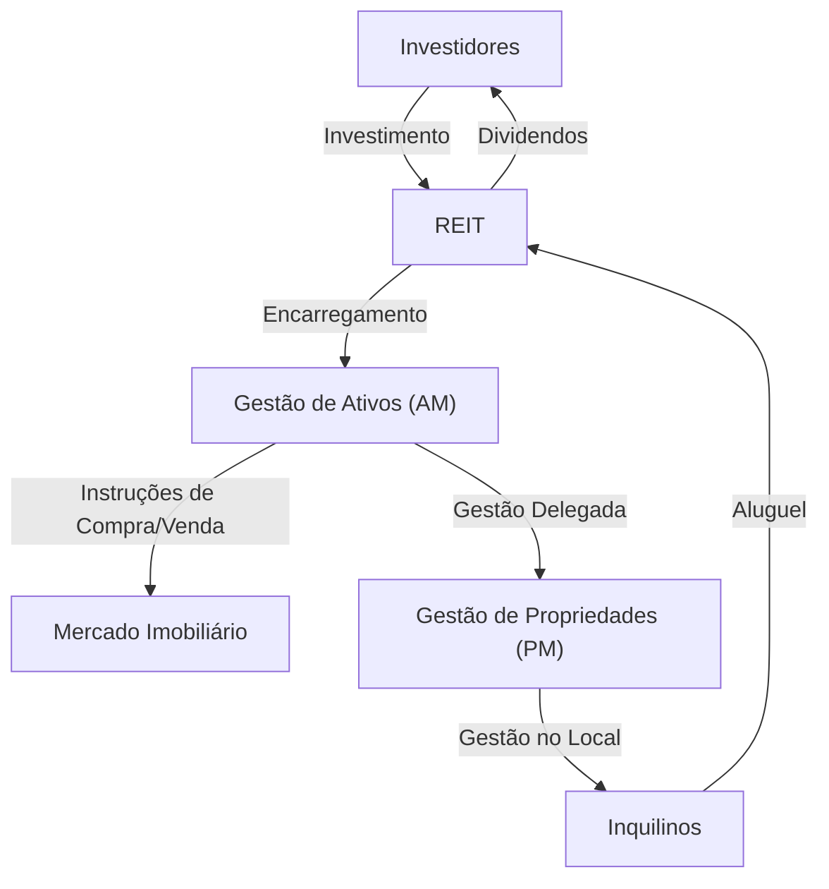

## Introdução: A Cidade como um Organismo Gigante

As estradas pavimentadas em que caminhamos todos os dias, os arranha-céus para os quais olhamos, e as casas onde encontramos paz. Tudo isso é criado e mantido por um ecossistema gigantesco conhecido como o "Setor Imobiliário". O mercado imobiliário não é meramente um "ativo imóvel". É a base da vida das pessoas, o palco das atividades econômicas corporativas e um produto financeiro onde circula o dinheiro do investimento global.

Neste artigo, vamos nos aprofundar em como essa zona econômica massiva é estruturada e quais mecanismos a impulsionam, a partir de perspectivas físicas, históricas, econômicas e tecnológicas. Como os desenvolvedores encontram valor em terrenos vazios, como os corretores garantem a liquidez do mercado e como os REITs (Fundos de Investimento Imobiliário) sublimaram o mercado imobiliário em um produto financeiro. Abordaremos o quadro geral dos modelos de negócios das pessoas que criam e movem cidades.

---

## 1. Contexto Histórico e Físico do Setor Imobiliário

### 1.1. A História da Propriedade da Terra e o Nascimento do Capitalismo

O conceito de mercado imobiliário remonta à era em que a humanidade começou a cultivar e viver em comunidades assentadas. A terra tornou-se uma fonte de riqueza, e nações e sistemas legais foram desenvolvidos em torno dela. No capitalismo moderno, a terra é reconhecida como propriedade privada, e seus direitos são legalmente protegidos por um sistema de registro.

Com o esclarecimento da propriedade da terra, tornou-se possível tomar empréstimos usando a terra como garantia (hipoteca), o que se tornou a base da moderna criação de crédito. Em outras palavras, o mercado imobiliário passou a desempenhar um papel não apenas como espaço físico, mas também como um motor impulsionando a economia financeira.

### 1.2. A Física da Construção e a Evolução da Engenharia

Outro fator que determina o valor do mercado imobiliário são as restrições físicas dos edifícios e a história de superá-las. No final do século XIX, com a invenção das estruturas de aço e dos elevadores, a humanidade conseguiu expandir o espaço "para cima".

A construção de arranha-céus exige engenharia geotécnica e mecânica estrutural avançadas. Para construir uma estrutura massiva em solo mole, é necessário cravar estacas profundamente na camada de suporte (rocha matriz). Além disso, edifícios altos devem suportar não apenas o próprio peso, mas também cargas de vento e movimentos sísmicos. A evolução das tecnologias de controle de vibração, como amortecedores de massa e estruturas de isolamento sísmico, apoia o valor do mercado imobiliário urbano (maximização do índice de área construída) do aspecto físico.

---

## 2. Principais Atores que Compõem o Setor Imobiliário

O setor imobiliário divide-se amplamente em três fases: "Criação (Desenvolvimento)", "Circulação (Corretagem)" e "Gestão e Operação (Gestão de Propriedades e Gestão de Ativos)", e existem atores especializados para cada uma delas.

### 2.1. Desenvolvedores (Empresas Imobiliárias Abrangentes): Criadores de Cidades

Os desenvolvedores são os "produtores do planejamento urbano" que adquirem terrenos vazios (ou terrenos com edifícios antigos), constroem edifícios de escritórios, instalações comerciais, condomínios, etc., e criam novo valor.

- **Aquisição de Terrenos:** Esta é a fase mais difícil e importante. Eles consolidam terras através de negociações persistentes com proprietários de terras (às vezes, projetos de redesenvolvimento que duram décadas).
- **Planejamento e Design:** Eles determinam o uso e o design que maximizam o potencial do terreno (regulamentações legais como zoneamento, índice de área construída e taxa de ocupação).
- **Promoção do Projeto:** Eles encomendam a construção a empreiteiros gerais e gerenciam o progresso e o orçamento de todo o projeto.
- **Locação e Vendas:** Eles atraem inquilinos para o edifício concluído ou o vendem como condomínios para compradores individuais.

O modelo de negócios do desenvolvedor é um modelo de "alto risco, alto retorno" que envolve um enorme investimento inicial. Eles captam fundos na escala de dezenas a centenas de bilhões de ienes de instituições financeiras (project finance, etc.) e os recuperam por meio de ganhos de capital na venda após a conclusão ou da receita de aluguel (ganhos de renda).

### 2.2. Corretagem Imobiliária (Corretores): O Lubrificante do Mercado

Como dizem no mercado imobiliário, "Uma propriedade, um preço" — não existem duas propriedades completamente idênticas no mundo. Em um mercado onde a assimetria de informação é extremamente grande, o papel dos corretores é conectar vendedores e compradores, bem como proprietários e inquilinos.

A principal fonte de renda dos corretores é a "taxa de corretagem". Os corretores garantem transações seguras usando conhecimentos especializados, como investigações de propriedades, explicações de assuntos importantes, elaboração de contratos e suporte na análise de empréstimos.

Nos últimos anos, com a ascensão da PropTech, inovações como avaliações de preços baseadas em IA e visualizações em VR estão avançando para aumentar a transparência das informações e reduzir os custos de transação.

### 2.3. Gestão de Propriedades (PM) e Manutenção de Edifícios (BM): Mantendo e Melhorando o Valor

Um edifício começa a se deteriorar no momento em que é concluído. A gestão adequada é essencial para manter e melhorar o valor do imóvel a longo prazo.

- **Gestão de Propriedades (PM):** Em nome do proprietário, o PM lida com os "aspectos brandos" da gestão, como recrutar inquilinos, gerenciar contratos, cobrar aluguel e lidar com reclamações, para maximizar o fluxo de caixa do imóvel.
- **Manutenção de Edificícios (BM):** O PM é responsável pelos "aspectos rígidos" da manutenção e gestão, como limpeza, inspeções de equipamentos, segurança e elaboração de planos de reparo.

---

## 3. A Fusão de Finanças e Imóveis: O Impacto dos REITs

Na história do setor imobiliário, o nascimento dos REITs (Fundos de Investimento Imobiliário) foi um evento revolucionário. Um REIT é um produto financeiro que usa fundos coletados de muitos investidores para comprar imóveis como edifícios de escritórios, instalações comerciais e instalações logísticas, e distribui a receita de aluguel e os ganhos de capital obtidos com eles aos investidores.

### 3.1. A Mudança de Paradigma Trazida pelos REITs

Tradicionalmente, os imóveis de grande porte de primeira linha (ativos prime) eram ativos "ilíquidos" que apenas algumas grandes corporações e indivíduos ricos podiam manter. No entanto, com o advento dos REITs, os imóveis foram securitizados, tornando possível que até mesmo investidores de varejo comuns se tornassem proprietários (de uma parte dos direitos) de grandes edifícios de escritórios e hotéis de luxo a partir de pequenas quantias.

### 3.2. A Estrutura de Negócios dos REITs

A estrutura de um REIT envolve regulamentações legais rígidas para evitar conflitos de interesse e uma divisão de trabalho entre atores especializados.

- **Corporação de Investimento:** O veículo que detém os imóveis. É uma empresa de fachada sem substância física.
- **Empresa de Gestão de Ativos (AM):** Encarregada pela corporação de investimento, a AM toma decisões de investimento avançadas e gerencia o portfólio sobre quais propriedades comprar e vender.
- **Empresa de Gestão de Propriedades (PM):** Sob as instruções da empresa AM, a PM realiza a gestão no local das propriedades individuais.
- **Custodiante / Administrador Fiduciário Geral:** Lida com a custódia de ativos e os cálculos administrativos da corporação.

### 3.3. A Mágica da Taxa de Capitalização (Cap Rate)

Uma das métricas mais importantes no mundo dos investimentos imobiliários é a "Taxa de Capitalização" (Cap Rate).
Ela é calculada dividindo a Receita Operacional Líquida (NOI) pelo preço do imóvel e representa o rendimento esperado que os investidores exigem daquele imóvel.

`Preço do Imóvel = Receita Operacional Líquida (NOI) / Taxa de Capitalização`

O que essa fórmula significa é que, mesmo que o aluguel (NOI) permaneça constante, se a taxa de capitalização de mercado diminuir (devido a taxas de juros mais baixas ou intensa concorrência de preços devido ao influxo de dinheiro de investimento), o preço do imóvel aumentará. O mercado imobiliário moderno se move de perto com as tendências macroeconômicas das taxas de juros e os movimentos globais de capital.

---

## 4. A Cidade do Futuro e as Perspectivas do Setor Imobiliário

As respostas às mudanças climáticas (investimento ESG, promoção de edifícios verdes), mudanças na demografia (envelhecimento das populações e concentração da população nas cidades) e a evolução da tecnologia (cidades inteligentes, metaverso) estão forçando uma nova mudança de paradigma no setor imobiliário.

A transição de um modelo de negócios de "fornecer espaço" para um modelo de negócios de "fornecer experiências e dados através do espaço". O setor imobiliário está atualmente no meio de um grande desafio para redefinir a cidade como um "sistema operacional" que apoia as atividades humanas, indo além da mera construção de caixas.

A fronteira onde o ativo universal finito da terra cruza com a tecnologia e o desejo humano. O setor imobiliário continuará a ser a zona econômica mais dinâmica e fascinante.
