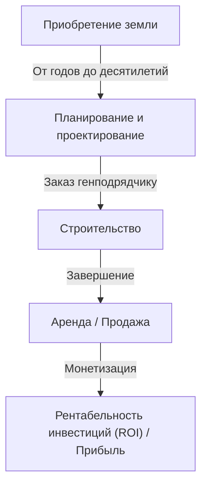
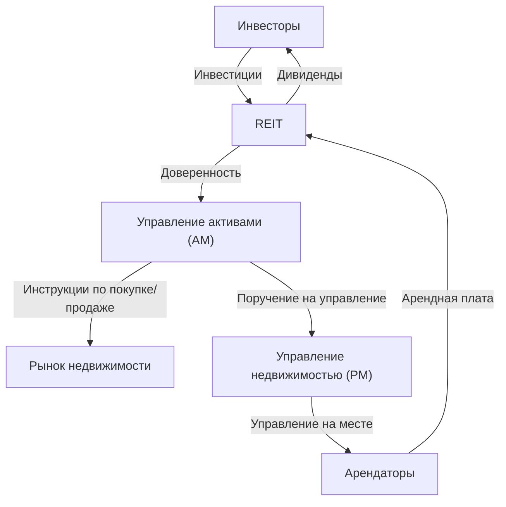

## Введение: Город как гигантский организм

Мощеные дороги, по которым мы ходим каждый день, небоскребы, на которые мы смотрим снизу вверх, и дома, где мы находим покой. Все это создается и поддерживается огромной экосистемой, известной как "Индустрия недвижимости". Недвижимость — это не просто "недвижимое имущество". Это фундамент жизни людей, арена для корпоративной экономической деятельности и финансовый продукт, в котором циркулируют глобальные инвестиционные средства.

В этой статье мы глубоко погрузимся в то, как устроена эта гигантская экономическая зона и какие механизмы ею движут, с физической, исторической, экономической и технологической точек зрения. Как девелоперы находят ценность в пустой земле, как брокеры обеспечивают ликвидность рынка и как REIT (инвестиционные фонды недвижимости) превратили недвижимость в финансовый продукт. Мы рассмотрим целостную картину бизнес-моделей людей, которые создают и двигают города.

---

## 1. Исторические и физические предпосылки индустрии недвижимости

### 1.1. История землевладения и зарождение капитализма

Концепция недвижимости восходит к эпохе, когда человечество начало заниматься земледелием и жить в оседлых общинах. Земля стала источником богатства, и вокруг нее формировались государства и правовые системы. В современном капитализме, земля признается частной собственностью, а права на нее юридически защищены системой регистрации.

С прояснением прав собственности на землю появилась возможность брать средства взаймы, используя землю в качестве залога (ипотека), что стало основой современного кредитования. Другими словами, недвижимость стала играть роль не только физического пространства, но и двигателя финансовой экономики.

### 1.2. Физика строительства и эволюция инженерии

Еще одним фактором, определяющим стоимость недвижимости, являются физические ограничения зданий и история их преодоления. В конце 19 века, с изобретением стальных каркасов и лифтов, человечество смогло расширять пространство "вверх".

Строительство небоскребов требует передовой геотехники и строительной механики. Чтобы возвести массивное сооружение на мягком грунте, необходимо забивать сваи глубоко в несущий слой (коренную породу). Кроме того, высотные здания должны выдерживать не только собственный вес, но и ветровые нагрузки, а также сейсмические колебания. Эволюция технологий гашения вибраций, таких как инерционные демпферы и сейсмоизолирующие конструкции, поддерживает ценность городской недвижимости (максимизация коэффициента использования площади) с физической точки зрения.

---

## 2. Основные участники индустрии недвижимости

Индустрию недвижимости можно условно разделить на три этапа: "Создание (Девелопмент)", "Обращение (Брокерская деятельность)" и "Управление и эксплуатация (Управление недвижимостью и Управление активами)", на каждом из которых существуют свои специализированные участники.

### 2.1. Девелоперы (Комплексные компании по недвижимости): Создатели городов

Девелоперы — это "продюсеры городского планирования", которые приобретают пустую землю (или землю со старыми постройками), строят офисные здания, коммерческие объекты, кондоминиумы и т.д., создавая новую ценность.

- **Приобретение земли:** Это самый сложный и важный этап. Они консолидируют землю путем настойчивых переговоров с землевладельцами (иногда проекты реконструкции длится десятилетиями).
- **Планирование и проектирование:** Они определяют назначение и дизайн, которые максимизируют потенциал земли (с учетом правовых норм, таких как зонирование, коэффициент использования площади и коэффициент застройки).
- **Продвижение проекта:** Они заказывают строительство у генеральных подрядчиков и управляют ходом выполнения и бюджетом всего проекта.
- **Сдача в аренду и продажа:** Они привлекают арендаторов для завершенного здания или продают его как кондоминиумы индивидуальным покупателям.

Бизнес-модель девелопера — это модель с "высоким риском и высокой доходностью", которая требует огромных первоначальных инвестиций. Они привлекают средства в масштабах от десятков до сотен миллиардов иен от финансовых учреждений (проектное финансирование и т.д.) и возвращают их за счет прироста капитала при продаже после завершения строительства или за счет доходов от аренды (дохода).

### 2.2. Брокерская деятельность с недвижимостью (Брокеры): Смазка рынка

Как говорят в сфере недвижимости: "Один объект, одна цена" — в мире не существует двух абсолютно идентичных объектов. На рынке, где информационная асимметрия чрезвычайно велика, роль брокеров заключается в том, чтобы соединить продавцов и покупателей, арендодателей и арендаторов.

Основным источником дохода для брокеров является "брокерская комиссия". Брокеры обеспечивают безопасные сделки, используя специализированные знания, такие как проверка недвижимости, объяснение важных вопросов, составление договоров и поддержка при проверке кредитоспособности.

В последние годы, с развитием PropTech, внедряются такие инновации, как оценка стоимости с помощью ИИ и VR-просмотры, чтобы повысить прозрачность информации и снизить транзакционные издержки.

### 2.3. Управление недвижимостью (PM) и обслуживание зданий (BM): Сохранение и повышение ценности

Здание начинает изнашиваться с момента его завершения. Надлежащее управление имеет важное значение для сохранения и повышения ценности недвижимости в долгосрочной перспективе.

- **Управление недвижимостью (PM):** От имени владельца PM занимается "мягкими аспектами" управления, такими как поиск арендаторов, управление договорами, сбор арендной платы и рассмотрение жалоб, чтобы максимизировать денежный поток от недвижимости.
- **Обслуживание зданий (BM):** PM отвечает за "жесткие аспекты" технического обслуживания и управления, такие как уборка, осмотр оборудования, безопасность и составление планов ремонта.

---

## 3. Слияние финансов и недвижимости: Влияние REIT

В истории индустрии недвижимости рождение REIT (инвестиционных фондов недвижимости) стало революционным событием. REIT — это финансовый продукт, который использует средства, собранные от множества инвесторов, для покупки недвижимости, такой как офисные здания, коммерческие объекты и логистические комплексы, и распределяет полученные от них доходы от аренды и прирост капитала между инвесторами.

### 3.1. Смена парадигмы, вызванная REIT

Традиционно крупная элитная недвижимость (премиальные активы) была "неликвидным" активом, которым могли владеть только несколько крупных корпораций и состоятельных людей. Однако с появлением REIT недвижимость была секьюритизирована, что позволило даже обычным розничным инвесторам стать владельцами (части прав) крупных офисных зданий и роскошных отелей, начиная с небольших сумм.

### 3.2. Бизнес-структура REIT

Структура REIT предполагает строгие правовые нормы для предотвращения конфликта интересов и разделение труда между специализированными участниками.

- **Инвестиционная корпорация:** Юридическое лицо, владеющее недвижимостью. Это компания на бумаге, не имеющая физического содержания.
- **Управляющая компания (AM):** По поручению инвестиционной корпорации AM принимает сложные инвестиционные решения и управляет портфелем в отношении того, какую недвижимость покупать и продавать.
- **Компания по управлению недвижимостью (PM):** По указанию компании AM, PM осуществляет управление отдельными объектами на местах.
- **Кастодиан / Главный административный попечитель:** Занимается хранением активов и административными расчетами корпорации.

### 3.3. Магия ставки капитализации (Cap Rate)

Одним из важнейших показателей в мире инвестиций в недвижимость является "Ставка капитализации" (Cap Rate).
Она рассчитывается путем деления чистого операционного дохода (NOI) на цену недвижимости и представляет собой ожидаемую доходность, которую инвесторы требуют от этой недвижимости.

`Цена недвижимости = Чистый операционный доход (NOI) / Ставка капитализации`

Эта формула означает, что даже если арендная плата (NOI) остается неизменной, при снижении рыночной ставки капитализации (из-за более низких процентных ставок или усиления ценовой конкуренции из-за притока инвестиционных средств) цена недвижимости вырастет. Современный рынок недвижимости движется в тесной связи с макроэкономическими тенденциями процентных ставок и глобальными движениями капитала.

---

## 4. Город будущего и перспективы индустрии недвижимости

Реакция на изменение климата (ESG-инвестирование, продвижение "зеленых" зданий), демографические изменения (старение населения и концентрация населения в городах) и развитие технологий (умные города, метавселенная) заставляют индустрию недвижимости пойти на новую смену парадигмы.

Переход от бизнес-модели "предоставления пространства" к бизнес-модели "предоставления опыта и данных через пространство". В настоящее время индустрия недвижимости находится в эпицентре грандиозного вызова по переосмыслению города как "операционной системы", которая поддерживает деятельность человека, выходя за рамки простого строительства коробок.

Рубеж, где универсальный конечный актив в виде земли пересекается с человеческими технологиями и желаниями. Индустрия недвижимости продолжит оставаться самой динамичной и захватывающей экономической зоной.
