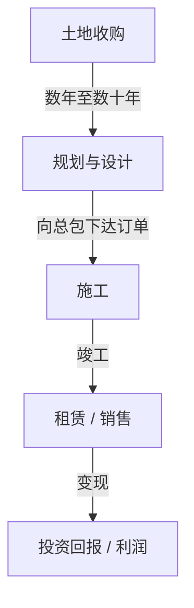
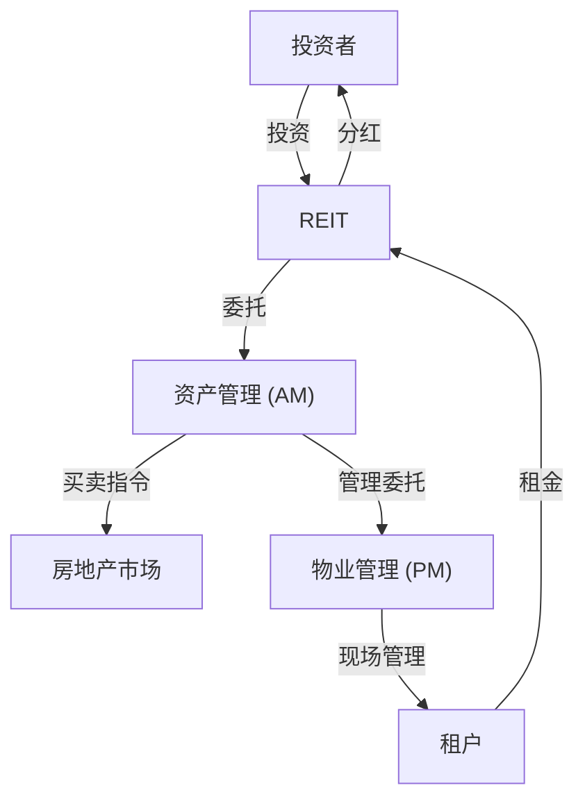

## 引言：作为巨大有机体的城市

我们每天行走的柏油马路、仰望的摩天大楼，以及寻找安宁的家园。所有这些都由一个被称为“房地产行业”的庞大生态系统创造和维护。房地产不仅仅是“不动产”。它是人们生活的基础、企业经济活动的舞台，以及全球投资资金流通的金融产品。

在本文中，我们将从物理、历史、经济和技术的角度，深入探讨这个庞大经济区是如何构建的，以及它的驱动机制是什么。开发商如何在空地上发现价值，中介如何确保市场流动性，以及REITs（房地产投资信托基金）如何将房地产升华为一种金融产品。我们将带您全面了解创造和推动城市发展的人们的商业模式。

---

## 1. 房地产行业的历史与物理背景

### 1.1. 土地所有权的历史与资本主义的诞生

房地产的概念可以追溯到人类开始务农和定居的时代。土地成为财富的源泉，国家和法律制度也围绕着它发展起来。在现代资本主义中，土地被承认为私有财产，其权利受到登记制度的法律保护。

随着土地所有权的明晰，利用土地作为抵押借入资金（抵押贷款）成为可能，这成为了现代信用创造的基础。换句话说，房地产不仅扮演着物理空间的角色，还成为了驱动金融经济的引擎。

### 1.2. 建筑的物理学与工程学的演进

决定房地产价值的另一个因素是建筑物的物理限制以及人类克服这些限制的历史。在19世纪末，随着钢结构和电梯的发明，人类得以“向上”扩展空间。

摩天大楼的建设需要先进的岩土工程和结构力学。要在软弱地基上建造庞大结构，必须将桩基深打入承载层（基岩）。此外，高层建筑不仅要承受自重，还要承受风载荷和地震动。质量阻尼器和隔震结构等减震技术的演进，从物理层面支撑了城市房地产的价值（容积率的最大化）。

---

## 2. 构成房地产行业的主要参与者

房地产行业大致分为三个阶段：“创造（开发）”、“流通（中介）”和“管理与运营（物业管理和资产管理）”，每个阶段都有专业的参与者。

### 2.1. 开发商（综合性房地产公司）：城市的创造者

开发商是“城市规划的制片人”，他们收购空地（或带有旧建筑的土地），建造办公楼、商业设施、公寓等，从而创造出新的价值。

- **土地收购：** 这是最困难也是最重要的阶段。他们通过与土地所有者进行不懈的谈判来整合土地（有时是跨越数十年的重建项目）。
- **规划与设计：** 他们决定能最大限度发挥土地潜力的用途和设计（以及应对分区、容积率和建筑覆盖率等法律法规）。
- **项目推进：** 他们向总承包商订购施工服务，并管理整个项目的进度和预算。
- **租赁与销售：** 他们为竣工的建筑物招租，或将其作为公寓出售给个人买家。

开发商的商业模式是一种涉及巨额前期投资的“高风险、高回报”模式。他们从金融机构筹集数百亿至数千亿日元规模的资金（如项目融资等），并通过竣工后出售的资本利得或租金收入（收益利得）来收回投资。

### 2.2. 房地产中介（经纪人）：市场的润滑剂

正如房地产界所说，“一物一价”——世界上不存在两个完全相同的房产。在信息不对称极其严重的市场中，中介的作用就是连接卖家与买家、房东与租客。

中介的主要收入来源是“中介费”。中介利用专业知识确保交易的安全，例如进行房产调查、重要事项说明、起草合同以及支持贷款审查。

近年来，随着房地产科技（PropTech）的兴起，基于AI的估价和VR看房等创新正在不断推进，以提高信息的透明度并降低交易成本。

### 2.3. 物业管理（PM）与建筑维护（BM）：维持与提升价值

建筑物在竣工的那一刻起就开始老化。为了长期维持并提升房地产的价值，妥善的管理是必不可少的。

- **物业管理（PM）：** 代表业主处理管理的“软方面”，例如招募租户、管理合同、收取租金和处理投诉，以最大化房地产的现金流。
- **建筑维护（BM）：** 负责维护和管理的“硬方面”，例如清洁、设备检查、安保以及起草维修计划。

---

## 3. 金融与房地产的融合：REITs的影响

在房地产行业的历史中，REITs（房地产投资信托基金）的诞生是一个革命性事件。REIT是一种金融产品，它利用从众多投资者那里收集的资金购买办公楼、商业设施和物流设施等房地产，并将从中获得的租金收入和资本利得分配给投资者。

### 3.1. REITs带来的范式转变

传统上，优质的大型房地产（核心资产）是只有少数大公司和富裕阶层才能持有的“非流动性”资产。然而，随着REITs的出现，房地产被证券化，使得普通个人投资者也能以小额资金成为大型办公楼和豪华酒店的（部分权利）所有者。

### 3.2. REITs的业务结构

REIT的结构涉及严格的法律规定以防止利益冲突，并要求专业参与者之间进行分工。

- **投资法人：** 持有房地产的载体。它是一家没有实体的纸上公司。
- **资产管理公司（AM）：** 受投资法人委托，AM做出高级投资决策并管理投资组合，决定买卖哪些房产。
- **物业管理公司（PM）：** 在AM公司的指示下，PM对各个房产进行现场管理。
- **托管人 / 综合行政受托人：** 负责资产的托管和法人的行政计算。

### 3.3. 资本化率（Cap Rate）的魔力

在房地产投资领域中最重要的指标之一是“资本化率”（Cap Rate）。
它是通过净营运收入（NOI）除以房地产价格计算得出的，代表了投资者对该房地产所要求的预期收益率。

`房地产价格 = 净营运收入 (NOI) / 资本化率 (Cap Rate)`

这个公式的含义是，即使租金（NOI）保持不变，如果市场资本化率下降（由于利率降低或投资资金涌入加剧了价格竞争），房地产价格也会随之上升。现代房地产市场的走势与宏观经济利率趋势和全球资本流动密切相关。

---

## 4. 未来城市与房地产行业的展望

应对气候变化（ESG投资、推广绿色建筑）、人口结构的变化（人口老龄化和城市人口集中）以及技术的演进（智慧城市、元宇宙）正迫使房地产行业发生新的范式转变。

从“提供空间”的商业模式向“通过空间提供体验和数据”的商业模式转变。房地产行业目前正处于一项巨大的挑战之中，即超越单纯建造空间的范畴，将城市重新定义为支持人类活动的“操作系统”。

土地这一普遍有限的资产与人类技术和欲望交汇的前沿。房地产行业将继续是最具活力和魅力的经济区。
