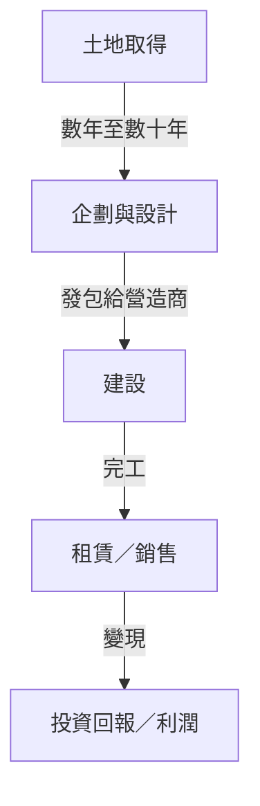
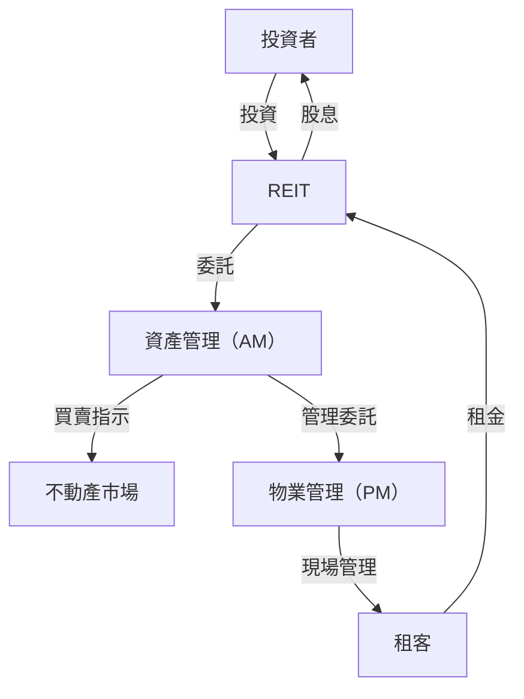

## 序言：作為巨大有機體的城市

我們每天走過的柏油路、抬頭仰望的摩天大樓，以及我們尋求安寧的家。這一切都是由一個被稱為「不動產業界」的巨大生態系統所創造與維持的。不動產不僅僅是「無法移動的資產」。它是人們生活的基礎，是企業經濟活動的舞台，也是全球投資資金流通的金融商品。

在本文中，我們將從物理、歷史、經濟與科技的角度，深入探討這個巨大的經濟圈是如何建構的，以及推動它的運作機制是什麼。開發商如何從空地中發現價值，仲介如何確保市場流動性，以及 REITs（不動產投資信託）如何將不動產昇華為金融商品。我們將全面剖析這些創造並推動城市的專業人士們的商業模式。

---

## 1. 不動產業界的歷史與物理背景

### 1.1. 土地所有權的歷史與資本主義的誕生

不動產的概念可以追溯到人類開始務農並定居的時代。土地成為財富的來源，國家與法律體系也圍繞著它發展。在現代資本主義中，土地被認定為私有財產，其權利受到登記制度的法律保護。

隨著土地所有權的明確化，利用土地作為擔保（抵押）來借貸資金成為可能，這也成為現代信用創造的基礎。換句話說，不動產不僅扮演物理空間的角色，更成為推動金融經濟的引擎。

### 1.2. 建築的物理學與工程學的進化

決定不動產價值的另一個因素是建築物的物理限制，以及克服這些限制的歷史。在 19 世紀末，隨著鋼骨結構與電梯的發明，人類得以將空間向「上」擴展。

摩天大樓的建設需要先進的大地工程與結構力學。要在軟弱地盤上建造巨大結構，必須將樁打入深處的支撐層（岩盤）。此外，高層建築不僅要承受自身重量，還必須抵禦風載重與地震動。質量阻尼器與隔震結構等制震技術的進化，從物理層面支撐了城市不動產的價值（容積率的最大化）。

---

## 2. 構成不動產業界的主要參與者

不動產業界大致可分為三個階段：「創造（開發）」、「流通（仲介）」與「管理與營運（物業管理與資產管理）」，每個階段都有專門的參與者。

### 2.1. 開發商（綜合不動產公司）：城市的創造者

開發商是「城市規劃的製作人」，他們取得空地（或帶有舊建築的土地），建設辦公大樓、商業設施、公寓等，從而創造新價值。

- **土地取得：** 這是最困難也是最重要的階段。他們透過與地主堅持不懈的談判來整合土地（有時是跨越數十年的重建計畫）。
- **企劃與設計：** 他們決定能夠將土地潛力最大化的用途與設計（如土地使用分區、容積率與建蔽率等法律規範）。
- **專案推動：** 他們向綜合營造商發包工程，並管理整個專案的進度與預算。
- **租賃與銷售：** 他們為完工的建築招商引資，或作為公寓出售給個人買家。

開發商的商業模式是一種伴隨巨額前期投資的「高風險、高報酬」模式。他們從金融機構（專案融資等）籌集數百億至數千億日圓規模的資金，並在完工後透過出售賺取資本利得或租金收入（收益利得）來回收。

### 2.2. 不動產仲介（經紀人）：市場的潤滑劑

正如不動產界所說：「一物一價」——世界上不存在兩個完全相同的物件。在一個資訊不對稱極大的市場中，仲介的作用就是連結賣家與買家、房東與租客。

仲介的主要收入來源是「仲介費」。仲介運用專業知識確保交易安全，例如物件調查、重要事項說明、起草合約與支援貸款審查。

近年來，隨著不動產科技（PropTech）的興起，AI 價格評估與 VR 看房等創新正不斷進展，以提高資訊透明度並降低交易成本。

### 2.3. 物業管理（PM）與建築維護（BM）：維持與提升價值

建築物從完工的那一刻起就開始老化。適當的管理對於長期維持與提升不動產價值不可或缺。

- **物業管理（PM）：** 代表所有權人，PM 處理管理的「軟體層面」，例如招租、合約管理、收取租金與處理投訴，以將不動產的現金流最大化。
- **建築維護（BM）：** 負責維護與管理的「硬體層面」，例如清潔、設備檢查、保全與起草修繕計畫。

---

## 3. 金融與不動產的融合：REITs 的影響

在不動產業界的歷史上，REITs（不動產投資信託）的誕生是一個革命性的事件。REIT 是一種金融商品，它使用從眾多投資者那裡收集的資金來購買辦公大樓、商業設施與物流設施等不動產，並將從中獲得的租金收入與資本利得分配給投資者。

### 3.1. REITs 帶來的典範轉移

傳統上，優質的大型不動產（核心資產）是只有少數大企業與富裕人士才能持有的「非流動性」資產。然而，隨著 REITs 的出現，不動產被證券化，使得即使是普通的散戶投資者，也能從小額開始成為大型辦公大樓與豪華酒店的（部分權利）擁有者。

### 3.2. REITs 的業務結構

REIT 的結構涉及嚴格的法律規範，以防止利益衝突，並在專業參與者之間進行分工。

- **投資法人：** 持有不動產的載體。它是一家沒有實體的紙上公司。
- **資產管理公司（AM）：** 受投資法人委託，AM 做出進階的投資決策，並管理關於買賣哪些物件的投資組合。
- **物業管理公司（PM）：** 在 AM 公司的指示下，PM 執行個別物件的現場管理。
- **保管機構／一般事務受託機構：** 處理資產的保管與法人的行政計算。

### 3.3. 資本化率（Cap Rate）的魔力

在不動產投資世界中最重要的指標之一是「資本化率（Cap Rate）」。
它的計算方式是將淨營運收入（NOI）除以不動產價格，代表投資者對該不動產所要求的預期收益率。

`不動產價格 = 淨營運收入（NOI） / 資本化率`

這個公式的意義在於，即使租金（NOI）保持不變，如果市場資本化率下降（由於利率降低或投資資金湧入加劇價格競爭），不動產價格就會上漲。現代不動產市場與總體經濟的利率趨勢及全球資本流動密切相關。

---

## 4. 未來城市與不動產業界的展望

應對氣候變遷（ESG 投資、推廣綠建築）、人口結構變化（人口老化與人口向城市集中）以及科技演進（智慧城市、元宇宙），正迫使不動產業界進行新的典範轉移。

從「提供空間」的商業模式轉變為「透過空間提供體驗與數據」的商業模式。不動產業界目前正處於一項重新將城市定義為支援人類活動的「作業系統」的巨大挑戰之中，超越了僅僅是建造盒子的範疇。

土地這個普遍且有限的資產與人類科技及慾望交會的邊界。不動產業界將繼續成為最具活力且迷人的經濟圈。
