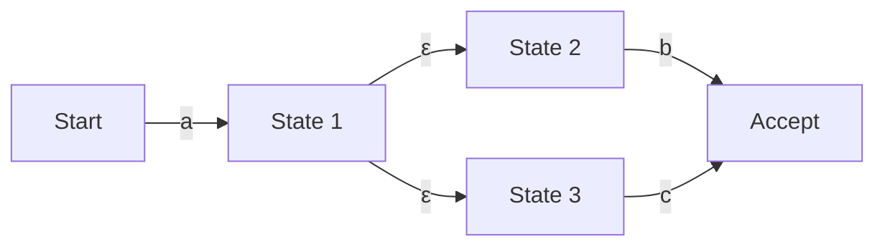

## مقدمة: عالم الرياضيات الكامن وراء التعبيرات النمطية

إذا كنت مبرمجًا، فمن المحتمل أنك تستخدم "التعبيرات النمطية (Regular Expression)" يوميًا للبحث عن النصوص واستبدالها، أو للتحقق من صحة قيم الإدخال. ولكن، وراء هذا البناء اللغوي الموجز، ربما نادرًا ما تفكر في الخوارزمية التي تحلل النص.

يرتبط محرك تقييم التعبيرات النمطية، الذي يبدو بسيطًا، ارتباطًا وثيقًا بـ "نظرية الآلات (Automata Theory)" التي تشكل أساس علوم الكمبيوتر. في هذا المقال، سننطلق من التعريف الرياضي للغات النظامية في تسلسل تشومسكي الهرمي، ونتعمق في الاختلافات بين الآلات المحدودة غير الحتمية (NFA) والآلات المحدودة الحتمية (DFA)، فضلاً عن خطر "التراجع الكارثي (Catastrophic Backtracking)" الذي تقع فيه بعض محركات التعبيرات النمطية، وصولاً إلى تقنيات التسريع باستخدام NFA الخاصة بـ Thompson لتجنب ذلك.

## تسلسل تشومسكي الهرمي واللغات النظامية

عند تقاطع علوم الكمبيوتر واللغويات، صنف نعوم تشومسكي اللغات الصورية إلى أربعة مستويات (تسلسل تشومسكي الهرمي) بناءً على قدرة القواعد على توليدها.

1. **النوع 0 (قواعد ذات بنية عبارية)**: يمكن التعرف عليها بواسطة آلة تورنغ
2. **النوع 1 (قواعد حساسة للسياق)**: يمكن التعرف عليها بواسطة آلة محدودة خطيًا
3. **النوع 2 (قواعد خالية من السياق)**: يمكن التعرف عليها بواسطة آلة الدفع السفلي (Pushdown Automaton)
4. **النوع 3 (قواعد نظامية)**: يمكن التعرف عليها بواسطة الآلات المحدودة (Finite Automaton)

"التعبيرات النمطية" التي نتعامل معها هي في الأصل تدوين رياضي للتعبير عن "اللغة النظامية (Regular Language)" التي يولدها هذا "النوع 3 (القواعد النظامية)". يمكن للآلات المحدودة، التي تحتوي على عدد محدود من الحالات، التعرف على اللغات النظامية وقبولها بدقة.

رياضياً، يتم تعريف التعبير النمطي على الأبجدية $\Sigma$ على أساس المجموعة الفارغة $\emptyset$، السلسلة الفارغة $\varepsilon$، وحرف واحد $a \in \Sigma$، ويتم تعريفه بتطبيق ثلاث عمليات لعدد محدود من المرات: الاتحاد (الاختيار $|$)، التسلسل (الربط)، وإغلاق كلين (التكرار $*$).

ومع ذلك، فإن التعبيرات النمطية المطبقة في لغات البرمجة الحديثة (مثل PCRE) تمتلك ميزات موسعة مثل الإشارة المرجعية الخلفية (Backreference)، وبالتالي فهي تتجاوز بصرامة إطار "اللغة النظامية" لتسلسل تشومسكي، مما يجعل مطابقة الأنماط المعتمدة على السياق ممكنة. هذا هو أحد الأسباب التي تؤدي إلى مشكلة التعقيد الحسابي المذكورة لاحقًا.

## الآلات المحدودة: NFA و DFA

لمطابقة التعبيرات النمطية مع السلاسل النصية، يجب تحويلها إلى نموذج انتقال حالة يمكن للكمبيوتر تفسيره، أي آلة محدودة. تنقسم الآلات المحدودة بشكل أساسي إلى نوعين: "آلة محدودة غير حتمية (NFA)" و "آلة محدودة حتمية (DFA)".

### آلة محدودة غير حتمية (NFA: Nondeterministic Finite Automaton)

تكمن ميزة NFA في "عدم الحتمية". في حالة معينة، عند تلقي حرف إدخال معين، يُسمح بوجود وجهات انتقال متعددة، أو الانتقال دون استهلاك أي إدخال (انتقال $\varepsilon$).

NFA قريب جدًا من بنية التعبيرات النمطية، وباستخدام خوارزميات مثل طريقة البناء الخاصة بـ Thompson، يمكن إجراء التحويل من التعبير النمطي إلى NFA ميكانيكيًا في وقت ومساحة $O(N)$ تتناسب مع طول التعبير النمطي. ومع ذلك، أثناء المحاكاة (التنفيذ)، نظرًا لأنه من الضروري تتبع احتمالات متعددة في وقت واحد، أو استخدام التراجع لاستكشاف جميع المسارات، فقد يستغرق التنفيذ وقتًا طويلاً في التطبيقات البسيطة.

### آلة محدودة حتمية (DFA: Deterministic Finite Automaton)

تتميز DFA بأنه في حالة معينة، عند تلقي حرف إدخال معين، **يتم تحديد وجهة الانتقال دائمًا لتكون وجهة واحدة فقط**. لا يُسمح بانتقالات $\varepsilon$.

نظرًا لأن وجهة الانتقال فريدة، تكتمل المطابقة ببساطة عن طريق تغيير الحالة أثناء قراءة سلسلة الإدخال حرفًا تلو الآخر من البداية. إذا كان طول السلسلة $M$، فإن وقت التنفيذ يكون $O(M)$، وتعمل بسرعة كبيرة في وقت خطي بالنسبة لطول سلسلة الإدخال.

ومع ذلك، هناك مشكلة في التحويل من NFA إلى DFA (باستخدام طريقة تكوين المجموعة الفرعية، وما إلى ذلك). نظرًا لأنه يتم تعيين مجموعة من الحالات المتعددة لـ NFA كحالة واحدة لـ DFA، في أسوأ الحالات، قد ينفجر عدد حالات DFA بشكل أسي إلى $O(2^N)$ بالنسبة لعدد حالات NFA الأصلي $N$.

## التراجع الكارثي (Catastrophic Backtracking) و ReDoS

تتبنى العديد من محركات التعبيرات النمطية الحديثة (مثل Java و Python و PHP و Ruby و Perl وما إلى ذلك) "محرك NFA مع التراجع". هذه ليست آلات رياضية صارمة، ولكن يتم تنفيذها بخوارزمية عودية (Recursive) تستخدم بحث العمق أولاً (DFS) للعثور على مسار متطابق.

تتمتع هذه الطريقة بميزة سهولة تنفيذ وظائف قوية مثل الإشارة المرجعية الخلفية والنظر إلى الأمام (Lookahead)، ولكن لديها نقطة ضعف قاتلة للتعبيرات النمطية حيث تزداد مساحة البحث بشكل أسي.

### آلية التراجع الكارثي

على سبيل المثال، ضع في اعتبارك التعبير النمطي والسلسلة المستهدفة التالية:

- التعبير النمطي: `^(a+)+$`
- السلسلة المستهدفة: `aaaaaaaaaaaaaaaaaaaX`

نظرًا لأن نهاية السلسلة هي `X`، يجب أن يفشل هذا التعبير النمطي في النهاية في المطابقة. ومع ذلك، يحاول محرك NFA مع التراجع تجربة جميع مجموعات التجميع الممكنة للتأكد من الفشل.

1. في البداية، يحاول `+` الخارجي ابتلاع السلسلة بأكملها `aaaaaaaaaaaaaaaaaaa` كمجموعة واحدة، لكنه يتراجع لأنها لا تتطابق مع `$` في النهاية.
2. بعد ذلك، يحاول تقسيمها إلى مجموعتين: `aaaaaaaaaaaaaaaaaa` و `a`.
3. إذا كان ذلك لا يزال غير ناجح، فإنه يستمر في الاستكشاف من خلال توليد أنماط تقسيم واحدة تلو الأخرى، مثل `aaaaaaaaaaaaaaaaa` و `aa`، أو `aaaaaaaaaaaaaaaaa` و `a` و `a`.

بالنسبة لعدد أحرف الإدخال $n$، يزداد عدد المحاولات بما يتناسب مع $O(2^n)$. حتى مع وجود 20 إلى 30 حرفًا فقط، فإن حجم العمليات الحسابية يتجاوز مئات الملايين من المرات، ويصل استخدام وحدة المعالجة المركزية إلى 100%، ويبدو أن البرنامج قد تعطل. هذا هو "التراجع الكارثي (Catastrophic Backtracking)".

### هجوم حجب الخدمة بالتعبيرات النمطية (ReDoS)

طريقة الهجوم التي تستغل هذه الخاصية تسمى **ReDoS (Regular Expression Denial of Service)**. من خلال إرسال سلسلة تتسبب عمداً في حدوث تراجع إلى الخادم، يمكن للمهاجم استنفاد موارد وحدة المعالجة المركزية للخادم وإسقاط الخدمة.

في تطبيقات الويب، إذا كان التعبير النمطي للتحقق من إدخال المستخدم ضعيفًا، فقد يكون هدفًا لهجوم ReDoS هذا. على سبيل المثال، يجب توخي الحذر الشديد إذا كنت تستخدم تعبيرات نمطية معقدة (مثل محددات الكمية المتداخلة) في التحقق من صحة عناوين البريد الإلكتروني.

## محرك Thompson NFA وطرق التنفيذ السريعة للمحركات

لمنع ReDoS وضمان أداء يمكن التنبؤ به ومستقر لأي إدخال، يلزم وجود تطبيق لمحرك تعبيرات نمطية لا يعتمد على التراجع. حزمة `regexp` في لغة Go، وصندوق `regex` في لغة Rust، ومحرك RE2 من Google تتبنى مثل هذا النهج.

### محاكاة Thompson NFA

بدلاً من بحث العمق أولاً عن طريق التراجع، فإن محاكاة Thompson NFA هي طريقة تقوم في وقت واحد بالاحتفاظ بـ "جميع الحالات النشطة الممكنة حاليًا" وتحديثها كمجموعة، مثل **بحث العرض أولاً (BFS)**.

مخطط الخوارزمية كما يلي:

1. **التهيئة**: قم بإنشاء NFA من التعبير النمطي، وقم بتعيين مجموعة (الإغلاق) لجميع الحالات التي يمكن الوصول إليها من حالة البدء عن طريق انتقال $\varepsilon$ كـ "مجموعة الحالة الحالية".
2. **استهلاك الحرف**: اقرأ حرفًا واحدًا من سلسلة الإدخال.
3. **تحديث الحالة**: لكل حالة مدرجة في "مجموعة الحالة الحالية"، اجمع جميع الحالات التي يمكن الانتقال إليها بالحرف المقروء.
4. **حساب إغلاق $\varepsilon$**: أضف جميع الحالات التي يمكن الوصول إليها عن طريق انتقال $\varepsilon$ الإضافي من الحالات التي تم جمعها في الخطوة 3، واجعلها "مجموعة الحالة الحالية" الجديدة.
5. **التكرار**: كرر الخطوات من 2 إلى 4 حتى تنفد سلسلة الإدخال.
6. **التقييم**: في وقت الانتهاء من قراءة السلسلة، إذا كانت "مجموعة الحالة الحالية" تحتوي على "حالة القبول"، فإن المطابقة ناجحة، وإلا فإنها فاشلة.

تتمثل الميزة الأكبر لهذا النهج في أنه يتم تقييم كل حالة مرة واحدة على الأكثر لحرف إدخال معين. إذا كان طول سلسلة الإدخال هو $M$ وعدد حالات NFA المبنية من التعبير النمطي (يتناسب مع طول التعبير النمطي) هو $N$، فإن وقت التنفيذ يصبح $O(M \times N)$، والانفجار الأسي في وقت الحساب ($O(2^M)$) مثل محركات التراجع لا يحدث أبدًا.

### التخزين المؤقت لـ DFA (Lazy DFA)

محاكاة Thompson NFA آمنة، ولكن نظرًا لأنها تحسب مجموعة الحالات لكل انتقال، فهناك عبء مضاعف ثابت مقارنة بـ DFA النقي (وقت التنفيذ $O(M)$).

لذلك، غالبًا ما تُستخدم في المحركات السريعة الحديثة عملية تحسين تسمى "Lazy DFA" (DFA المؤجل). هذه طريقة تحسب ديناميكيًا فقط الانتقالات (المجموعات الفرعية) المطلوبة في وقت التشغيل وتحفظ (تخزن مؤقتًا) النتيجة في الذاكرة، بدلاً من إجراء جميع تحويلات NFA إلى DFA مسبقًا في وقت الترجمة (Compile).

نتيجة لذلك، إذا كان الانتقال نفسه مطلوبًا مرة أخرى، فيمكن سحب انتقال DFA المخزن مؤقتًا في وقت $O(1)$، مما يوازن بين سرعة DFA وكفاءة الذاكرة وأمان NFA.

## الخلاصة

التعبيرات النمطية ليست مجرد أدوات مريحة، بل يكمن وراءها نظرية عميقة في علوم الكمبيوتر تُسمى الآلات (Automata).

*   من السهل التحويل إلى **NFA** من التعبيرات النمطية، ولكن من الضروري مراعاة مسارات متعددة في وقت التشغيل.
*   **DFA** سريع جدًا في التنفيذ، ولكن هناك خطر انفجار عدد الحالات أثناء التحويل.
*   **محرك NFA مع التراجع** المستخدم في العديد من اللغات غني بالميزات، ولكنه يحمل خطر ReDoS بسبب التراجع الكارثي.
*   المحركات التي تتبنى **Thompson NFA** أو **Lazy DFA** (مثل RE2) تضمن أداءً خطيًا لأي إدخال، وهي ضرورية لبناء أنظمة آمنة.

عند تصميم نظام حيث الأداء أو الأمان أمر بالغ الأهمية، من المهم أن تفهم "نوع التنفيذ" لمحرك التعبيرات النمطية في لغة البرمجة التي تستخدمها، وأن تختار المحرك المناسب وطريقة كتابة التعبيرات النمطية وفقًا للغرض.
